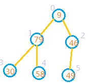
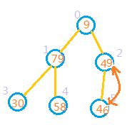
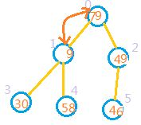
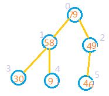

# 堆排序

* [返回顶层目录](../../../../SUMMARY.md)
* [返回上层目录](sort.md)
* [堆排序的引入](#堆排序的引入)
* [什么是堆](#什么是堆)
* [堆排序思想](#堆排序思想)
* [堆排序方法说明](#堆排序方法说明)
* [C++源码实现](#C++源码实现)


直接看视频：[堆排序(heapsort)](https://www.bilibili.com/video/av47196993?from=search&seid=17162511716605883584)。

<iframe src="//player.bilibili.com/player.html?aid=47196993&cid=82656324&page=1" scrolling="no" border="0" frameborder="no" framespacing="0" allowfullscreen="true"> </iframe>

# 堆排序的引入

我们知道简单选择排序的时间复杂度为O(n^2)，熟悉各种排序算法的朋友都知道，这个时间复杂度是很大的，所以怎样减小简单选择排序的时间复杂度呢？简单选择排序主要操作是进行关键字的比较，所以怎样减少比较次数就是改进的关键。简单选择排序中第i趟需要进行n-i次比较，如果我们用到前面已排好的序列a[1...i-1]是否可以减少比较次数呢？答案是可以的。举个例子来说吧，A、B、C进行比赛，B战胜了A，C战胜了B，那么显然C可以战胜A，C和A就不用比了。正是基于这种思想，有人提出了树形选择排序：对n个记录进行两两比较，然后在([n/2]向上取整)个较小者之间在进行两两比较，如此重复，直到选出最小记录。但是这种排序算法需要的辅助空间比较多，所以威洛姆斯(J . Willioms)在1964年提出了另一种选择排序，这就是下面要谈的堆排序。

# 什么是堆

首先堆heap是一种数据结构，是一棵完全二叉树且满足性质：所有非叶子结点的值均不大于或均不小于其左、右孩子结点的值。

# 堆排序思想
堆排序的基本思想是**利用heap这种数据结构(可看成一个完全二叉树)，使在排序中比较的次数明显减少**。

堆排序的时间复杂度为O(n*log(n))， 非稳定排序，原地排序(空间复杂度O(1))。

堆排序的关键在于**建堆**和**调整堆**，下面简单介绍一下建堆的过程：

第1趟将索引0至n-1处的全部数据建大顶(或小顶)堆，就可以选出这组数据的最大值(或最小值)。将该堆的根节点与这组数据的最后一个节点交换，就使的这组数据中最大(最小)值排在了最后。

第2趟将索引0至n-2处的全部数据建大顶(或小顶)堆，就可以选出这组数据的最大值(或最小值)。将该堆的根节点与这组数据的倒数第二个节点交换，就使的这组数据中最大(最小)值排在了倒数第2位。

…

第k趟将索引0至n-k处的全部数据建大顶(或小顶)堆，就可以选出这组数据的最大值(或最小值)。将该堆的根节点与这组数据的倒数第k个节点交换，就使的这组数据中最大(最小)值排在了倒数第k位。

其实整个堆排序过程中, 我们只需重复做两件事：

- 建堆(初始化+调整堆, 时间复杂度为O(n));
- 拿堆的根节点和最后一个节点交换(siftdown, 时间复杂度为O(n*log n) ).

因而堆排序整体的时间复杂度为O(n*log n).

# 堆排序方法说明

下面通过一组数据说明堆排序的方法：

9, 79, 46, 30, 58, 49

1: 先将待排序的数视作完全二叉树(按层次遍历顺序进行编号, 从0开始)，如下图:



2：完全二叉树的最后一个非叶子节点，也就是最后一个节点的父节点。最后一个节点的索引为数组长度len-1，那么最后一个非叶子节点的索引应该是为(len-1)/2。也就是从索引为2的节点开始，如果其子节点的值大于其本身的值。则把他和较大子节点进行交换，即将索引2处节点和索引5处元素交换。交换后的结果如图：



**建堆从最后一个非叶子节点开始即可**

3：向前处理前一个节点，也就是处理索引为1的节点，此时79>30,79>58,因此无需交换。

4：向前处理前一个节点，也就是处理索引为0的节点，此时9 < 79,9 < 49, 因此需交换。应该拿索引为0的节点与索引为1的节点交换，因为79>49. 如图:



5：如果某个节点和它的某个子节点交换后，该子节点又有子节点，系统还需要再次对该子节点进行判断。如上图因为1处、3处、4处中，1处的值大于3、4处的值，所以还需交换。



**牢记：** 将每次堆排序得到的最大元素与当前规模的数组最后一个元素交换.

# C++源码实现

```c++
// 小顶堆
#include <stdio.h>
#include <iostream>
#include<algorithm>
using namespace std;

void adjust_heap(int arr[], int i, int len) {
	int left = 2 * i + 1;
	int right = 2 * i + 2;
	int max_index = i;
	int temp;

	if(left < len && arr[left] > arr[max_index]) max_index = left;
	// max_index是3个数中最大数的下标
	if(right < len && arr[right] > arr[max_index]) max_index = right;

	if(max_index != i) {  // 如果max_index的值有更新
		temp = arr[max_index];
		arr[max_index] = arr[i];
		arr[i] = temp;
		// 递归调整其他不满足堆性质的部分
		adjust_heap(arr, max_index, len);
	}
}

void heap_sort(int arr[], int len) {
	int temp;

	// 对每一个非叶结点进行堆调整(从最后一个非叶结点开始)
	for(int i = len / 2 - 1; i >= 0; i--) {
		adjust_heap(arr, i, len);
	}

	for(int i = len - 1; i >= 1; i--) {
		// 将当前最大的放置到数组末尾
		temp = arr[0];
		arr[0] = arr[i];
		arr[i] = temp;
		// 将未完成排序的部分继续进行堆排序
		adjust_heap(arr, 0, i);
	}
}

int main() {
	int arr[] = {4, 6, 8, 5, 9};
	int len = sizeof(arr)/sizeof(int);
	cout << "length = " << len << endl;

	heap_sort(arr, len);

	for (int i = 0; i < len; i++) cout << arr[i] << " ";
	cout << endl;

	return 0;
}
```

这里还有一个不是排序，而是找TopK的代码。相当于维护一个小顶堆，不断用其他数和小顶堆的顶部去比较，如果比小顶堆的数要大，则替换小顶堆，然后重构一遍小顶堆。

```c++
void topk_min_heap(int arr[], int len) {
	int root = 0;  // 指向当前的根结点
	int LeftChild = 2 * root + 1;  // 指向当前根结点的左孩子
	int MinChild = LeftChild;

	int temp = arr[0];  // 记录当前根结点元素

	// 开始逐渐向下调整
	while(LeftChild <= len) {
		if(LeftChild < len && arr[LeftChild] > arr[LeftChild + 1])
			MinChild = LeftChild + 1;  // Child指向子节点中最小的那个
		if(temp > arr[MinChild]) {
			arr[root] = arr[MinChild];
			root = MinChild;  // 重新调整跟结点指向
			LeftChild = 2 * root + 1;  // 重新调整左孩子指向
			MinChild = LeftChild;  // 重新调整孩子指向
		}
		else break;
	}
	arr[root] = temp;
}
```

# 参考资料

* [堆排序原理及其实现(C++)](https://blog.csdn.net/lzuacm/article/details/52853194)

本文参考此博客。

===

[堆排序是什么鬼？](https://mp.weixin.qq.com/s/B0ImTjuQJiR7ahRzBpslcg)

