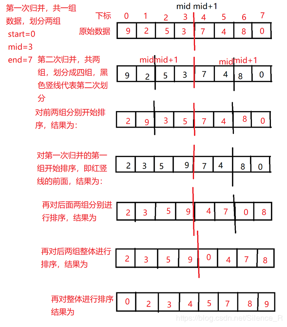

# 归并排序

* [返回顶层目录](../../../../SUMMARY.md)
* [返回上层目录](sort.md)


归并排序（MERGE-SORT）是建立在归并操作上的一种有效的排序算法,该算法是采用分治法（Divide and Conquer）的一个非常典型的应用。将已有序的子序列合并，得到完全有序的序列；即先使每个子序列有序，再使子序列段间有序。若将两个有序表合并成一个有序表，称为二路归并

归并排序是一种稳定的排序算法，其时间复杂度为:O(nlogn)

算法思路（从小到大）：
1、对于一组数据a[N]，申请临时空间，temp[N],用于临时存放数据，划分为两个序列
2、设置两个指针分别指向两个序列的首部，其中中间数据mid=(start+end)/2划分到前一个序列当中
3、比较两个指针所指向的数据，选择相对小的元素放入到合并空间，并移动指针到下一位置
4、重复步骤3，直到这两个指针的某个指针超出自身所指向序列
5、将另外一个序列全部依次放入到临时数组中（合并空间）



```c
#include<stdio.h>

/*归并排序*/
void Merge_Sort(int *arr, int *temparr,int start,int mid,int end)
{
    int left_start = start ;
    int left_end   = mid ;

    int right_start = mid+1 ;
    int right_end   = end ;

    int index = start ;

    while(left_start<=left_end&&right_start<=right_end)
    {
        if(arr[left_start]>arr[right_start])
            temparr[index++] = arr[right_start++] ;
        else
            temparr[index++] = arr[left_start++] ;
    }

    while(left_start<=left_end)
        temparr[index++] = arr[left_start++] ;

    while(right_start<=right_end)
        temparr[index++] = arr[right_start++] ;

    for(index = start ;index<=end ;++index)
        arr[index] = temparr[index] ;
}

void Sort_Message(int *arr, int *temparr,int start,int end)
{
    if(start<end)
    {
        int mid = (start+end)/2 ;
        Sort_Message(arr,temparr,start,mid) ;
        Sort_Message(arr,temparr,mid+1,end) ;
        Merge_Sort(arr,temparr,start,mid,end) ;
    }
}

int main(void)
{
    int a[] = {9,2,5,3,7,4,8,0} ;
    int n = sizeof(a)/sizeof(a[0]) ;
    int i, temp[8] ;

    printf("原序列为:") ;
    for(i=0;i<n;++i)
        printf("%d ",a[i]) ;
    printf("\n") ;

    Sort_Message(a,temp,0,n-1) ;

    printf("\n排后序列:") ;
    for(i=0;i<n;++i)
        printf("%d ",a[i]) ;
    printf("\n") ;
    return 0 ;
}
```

运行结果为：


# 参考资料

* [归并排序C语言实现](https://blog.csdn.net/Silence_R/article/details/86524975)

本文参考此博客。

