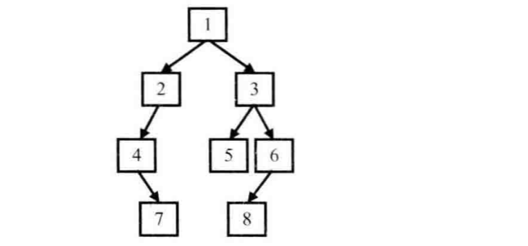
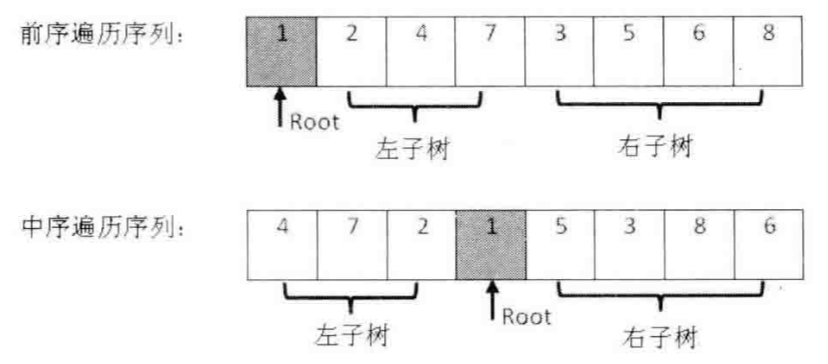
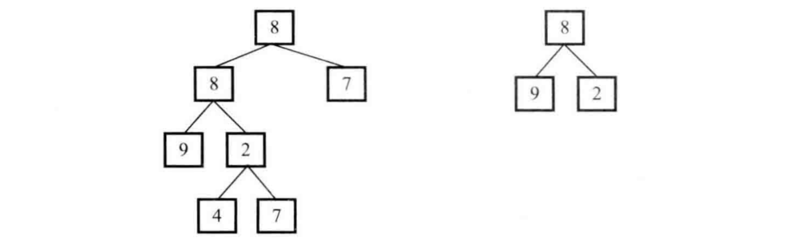
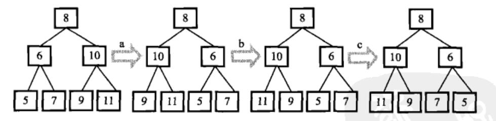
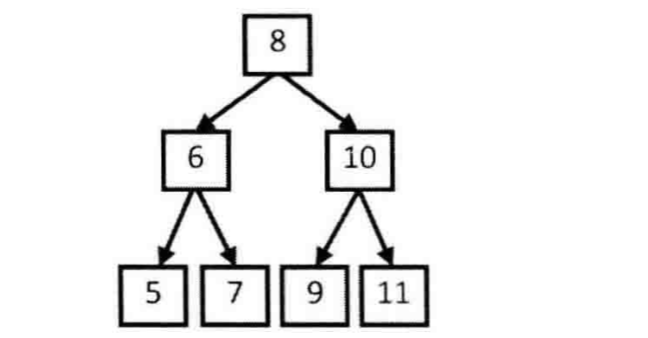
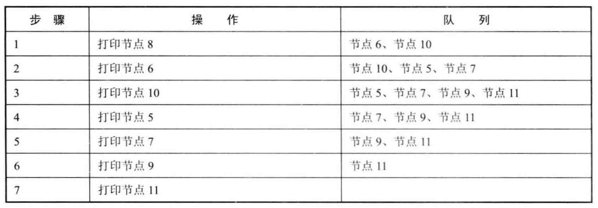

# 二叉树


# 剑指Offer7：重建二叉树

> 题目：输入某二叉树的前序遍历和中序遍历的结果，请重建出该二叉树。假设输入的前序遍历和中序遍历的结果中都不含重复的数字。例如输入前序遍历序列{1,2,4,7,3,5,6,8}和中序遍历序列{4,7,2,1,5,3,8,6}，则重建二叉树并返回。
>
> 
>
> 二叉树节点定义如下：
>
> ```c++
> struct TreeNode {
>   int val;
>   TreeNode *left;
>   TreeNode *right;
>   TreeNode(int x) : val(x), left(NULL), right(NULL) {}
> };
> ```

通常树有如下几种遍历方式：

- 前序遍历：先访问根结点，再访问左子结点，最后访问右子结点。
- 中序遍历：先访问左子结点，再访问根结点，最后访问右子结点。
- 后序遍历：先访问左子结点，再访问右子结点，最后访问根结点。

本题为前序遍历和中序遍历，最少需要两种遍历方式，才能重建二叉树。

前序遍历序列中，第一个数字总是树的根结点的值。在中序遍历序列中，根结点的值在序列的中间，左子树的结点的值位于根结点的值的左边，而右子树的结点的值位于根结点的值的右边。剩下的我们可以递归来实现，具体如图：



c++:

```c++
TreeNode* reConstructBinaryTree(vector<int> pre,vector<int> vin) {
    if(pre.size() == 0){                    //如果为空，返回NULL
        return NULL;
    }
    //依次是前序遍历左子树，前序遍历右子树，中序遍历左子树，中序遍历右子树
    vector<int> left_pre, right_pre, left_vin, right_vin;
    //前序遍历第一个节点一定为根节点
    TreeNode* head = new TreeNode(pre[0]);
    //找到中序遍历的根节点
    int root = 0;
    //遍历找到中序遍历根节点索引值
    for(int i = 0; i < pre.size(); i++){
        if(pre[0] == vin[i]){
            root = i;
            break;
        }
    }
       //利用中序遍历的根节点，对二叉树节点进行归并
    for(int i = 0; i < root; i++){
        left_vin.push_back(vin[i]);
        left_pre.push_back(pre[i + 1]);            //前序遍历第一个为根节点
    }

    for(int i = root + 1; i < pre.size(); i++){
        right_vin.push_back(vin[i]);
        right_pre.push_back(pre[i]);
    }

    //递归，再对其进行上述所有步骤，即再区分子树的左、右子子数，直到叶节点
    head->left = reConstructBinaryTree(left_pre, left_vin);
    head->right = reConstructBinaryTree(right_pre, right_vin);
    return head;
}
```

[详情](https://cuijiahua.com/blog/2017/11/basis_3.html)，[练习](https://www.nowcoder.com/practice/8a19cbe657394eeaac2f6ea9b0f6fcf6?tpId=13&tqId=11157&tPage=1&rp=1&ru=/ta/coding-interviews&qru=/ta/coding-interviews/question-ranking)。


# 剑指Offer26：树的子结构

> 题目：输入两颗二叉树A，B，判断B是不是A的子结构。（PS：我们约定空树不是任意一个树的子结构）。
>
> 二叉树节点定义如下：
>
> ```c++
> struct TreeNode {
> 	int val;
> 	struct TreeNode *left;
> 	struct TreeNode *right;
> 	TreeNode(int x) :
> 			val(x), left(NULL), right(NULL) {
> 	}
> };
> ```

要查找树A中是否存在和树B结构一样的子树，我们可以分为两步：第一步在树A中找到和B的根结点的值一样的结点R，第二步再判断树A中以R为根节点的子树是不是包含和树B一样的结构。



c++:

```c++
bool HasSubtree(TreeNode* pRoot1, TreeNode* pRoot2)
{
    bool result = false;
    if(pRoot1 != NULL && pRoot2 != NULL){
        if(pRoot1->val == pRoot2->val){
        result = DoesTree1HasTree2(pRoot1, pRoot2);
    }
        if(!result){
            result = HasSubtree(pRoot1->left, pRoot2);
        }
        if(!result){
            result = HasSubtree(pRoot1->right, pRoot2);
        }
    }
    return result;
}

bool DoesTree1HasTree2(TreeNode* pRoot1, TreeNode* pRoot2){
    if(pRoot2 == NULL){
        return true;
    }
    if(pRoot1 == NULL){
        return false;
    }
    if(pRoot1->val != pRoot2->val){
        return false;
    }
    return DoesTree1HasTree2(pRoot1->left, pRoot2->left) && DoesTree1HasTree2(pRoot1->right, pRoot2->right);
}
```

[详情](https://cuijiahua.com/blog/2017/12/basis_17.html)，[练习](https://www.nowcoder.com/practice/6e196c44c7004d15b1610b9afca8bd88?tpId=13&tqId=11170&tPage=1&rp=1&ru=/ta/coding-interviews&qru=/ta/coding-interviews/question-ranking)。


# 剑指Offer27：二叉树的镜像

> 操作给定的二叉树，将其变换为源二叉树的镜像。
>
> 如下图所示：
>
> 
>
> 二叉树节点定义如下：
>
> ```c++
> struct TreeNode {
>     int val;
>     struct TreeNode *left;
>     struct TreeNode *right;
>     TreeNode(int x) :
>             val(x), left(NULL), right(NULL) {
>     }
> };
> ```

先交换根节点的两个子结点之后，我们注意到值为10、6的结点的子结点仍然保持不变，因此我们还需要交换这两个结点的左右子结点。做完这两次交换之后，我们已经遍历完所有的非叶结点。此时变换之后的树刚好就是原始树的镜像。交换示意图如下所示：



c++:

```c++
void Mirror(TreeNode *pRoot) {
    if((pRoot == NULL) || (pRoot->left == NULL && pRoot->right == NULL)){
        return;
    }

    //交换根节点的左右结点
    TreeNode *pTemp = pRoot->left;
    pRoot->left = pRoot->right;
    pRoot->right = pTemp;

    //递归左子树
    if(pRoot->left){
        Mirror(pRoot->left);
    }
    //递归右子树
    if(pRoot->right){
        Mirror(pRoot->right);
    }
}
```

[详情](https://cuijiahua.com/blog/2017/12/basis_18.html)，[练习](https://www.nowcoder.com/practice/564f4c26aa584921bc75623e48ca3011?tpId=13&tqId=11171&tPage=1&rp=1&ru=/ta/coding-interviews&qru=/ta/coding-interviews/question-ranking)。


# 剑指Offer32：从上到下打印二叉树

> 从上往下打印出二叉树的每个节点，同层节点从左至右打印。
>
> 例如输入下图中的二叉树，则依次打印出8, 6, 10, 5, 7, 9, 11。
>
> 
>
> 二叉树节点定义如下：
>
> ```c++
> struct TreeNode {
> 	int val;
> 	struct TreeNode *left;
> 	struct TreeNode *right;
> 	TreeNode(int x) :
> 			val(x), left(NULL), right(NULL) {
> 	}
> };
> ```

如上图所示，因为按层打印的顺序决定应该先打印根结点，所以我们从[树](https://cuijiahua.com/blog/tag/%e6%a0%91/)的根结点开始分析。为了接下来能够打印值为8的结点的两个子结点，我们应该在遍历该结点时把值为6和10的两个结点保存到一个容器里，现在容器内就有两个结点了。按照从左到右打印的要求，我们先取出为6的结点。打印出值6之后把它的值分别为5和7的两个结点放入数据容器。此时数据容器中有三个结点，值分别为10、5和7。接下来我们从数据容器中取出值为10的结点。注意到值为10的结点比值为5、7的结点先放入容器，此时又比这两个结点先取出，这就是我们通常说的先入先出，因此不难看出这个数据容器应该是一个队列。由于值为5、7、9、11的结点都没有子结点，因此只要依次打印即可。



c++:

```c++
vector<int> PrintFromTopToBottom(TreeNode* root) {
    TreeNode* fr;
    if(root == NULL){
        return result;
    }
    que.push(root);
    while(!que.empty()){
        fr = que.front();
        result.push_back(fr->val);
        if(fr->left != NULL){
            que.push(fr->left);
        }
        if(fr->right != NULL){
            que.push(fr->right);
        }
        que.pop();
    }
    return result;
}
private:
vector<int> result;
queue<TreeNode*> que;
```

[详情](https://cuijiahua.com/blog/2017/12/basis_22.html)，[练习](https://www.nowcoder.com/practice/7fe2212963db4790b57431d9ed259701?tpId=13&tqId=11175&tPage=1&rp=1&ru=/ta/coding-interviews&qru=/ta/coding-interviews/question-ranking)。


# 剑指Offer34：二叉树中和为某一值的路径

> 输入一颗二叉树和一个整数，打印出二叉树中结点值的和为输入整数的所有路径。路径定义为从树的根结点开始往下一直到叶结点所经过的结点形成一条路径。
>
> 二叉树节点定义如下：
>
> ```c++
> struct TreeNode {
> 	int val;
> 	struct TreeNode *left;
> 	struct TreeNode *right;
> 	TreeNode(int x) :
> 			val(x), left(NULL), right(NULL) {
> 	}
> };
> ```

深度优先搜索。使用前序遍历，使用两个全局变量result和tmp，result来存放最终结果，tmp用来存放临时结果。

每次遍历，我们先把root的值压入tmp，然后判断当前root是否同时满足：

- 与给定数值相减为0；
- 左子树为空；
- 右子树为空。

如果满足条件，就将tmp压入result中，否则，依次遍历左右子树。需要注意的是，遍历左右子树的时候，全局变量tmp是不清空的，直到到了根结点才请空tmp。

c++:

```c++
vector<vector<int> > FindPath(TreeNode* root,int expectNumber){
    if(root == NULL){
        return result;
    }

    tmp.push_back(root->val);
    if((expectNumber - root->val ) == 0 && root->left == NULL && root->right == NULL){
        result.push_back(tmp);
    }

    //遍历左子树
    FindPath(root->left, expectNumber - root->val);
    //遍历右子树
    FindPath(root->right, expectNumber - root->val);

    tmp.pop_back();
    return result;
}

vector<vector<int> > result;
vector<int> tmp;
```

[详情](https://cuijiahua.com/blog/2017/12/basis_24.html)，[练习](https://www.nowcoder.com/practice/b736e784e3e34731af99065031301bca?tpId=13&tqId=11177&tPage=1&rp=1&ru=/ta/coding-interviews&qru=/ta/coding-interviews/question-ranking)。


# 剑指Offer55：二叉树的深度

> 输入一棵二叉树，求该树的深度。从根结点到叶结点依次经过的结点（含根、叶结点）形成树的一条路径，最长路径的长度为树的深度。
>
> 二叉树节点定义如下：
>
> ```c++
> struct TreeNode {
> 	int val;
> 	struct TreeNode *left;
> 	struct TreeNode *right;
> 	TreeNode(int x) :
> 			val(x), left(NULL), right(NULL) {
> 	}
> };
> ```

这道题蛮简单的，求二叉树的深度。可以是递归的方法，属于DFS（深度优先搜索）；另一种方法是按照层次遍历，属于BFS（广度优先搜索）。

c++:

**DFS方法：**

```c++
int TreeDepth(TreeNode* pRoot)
{
    if(pRoot == NULL){
        return 0;
    }
    int left = TreeDepth(pRoot->left);
    int right = TreeDepth(pRoot->right);
    return (left > right) ? (left + 1) : (right + 1);
}
```

**BFS方法：**

```c++
int TreeDepth(TreeNode* pRoot)
{
    if(pRoot == NULL){
        return 0;
    }
    queue<TreeNode*> que;
    int depth = 0;
    que.push(pRoot);
    while(!que.empty()){
        int size = que.size();
        depth++;
        for(int i = 0; i < size; i++){
            TreeNode* node = que.front();
            que.pop();
            if(node->left){
                que.push(node->left);
            }
            if(node->right){
                que.push(node->right);
            }
        }
    }
    return depth;
}
```

[详情](https://cuijiahua.com/blog/2018/01/basis_38.html)，[练习](https://www.nowcoder.com/practice/435fb86331474282a3499955f0a41e8b?tpId=13&tqId=11191&tPage=1&rp=1&ru=/ta/coding-interviews&qru=/ta/coding-interviews/question-ranking)。


# 参考资料

* [剑指Offer系列刷题笔记汇总](https://cuijiahua.com/blog/2018/02/basis_67.html)

本文参考此博客。

