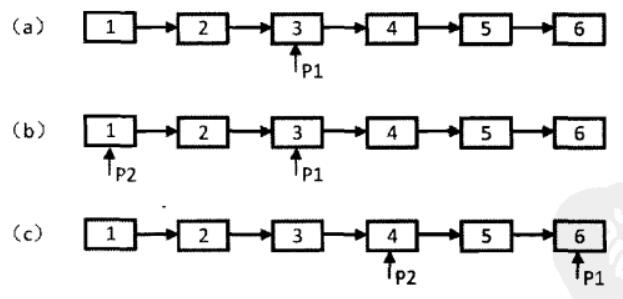
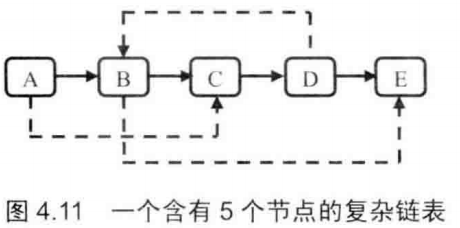
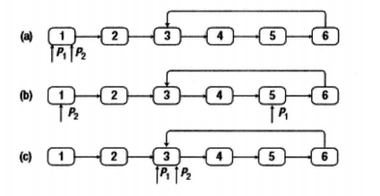

# 链表

* [返回顶层目录](../../../../SUMMARY.md)
* [返回上层目录](../jianzhi-offer.md)
* [剑指offer6：从尾到头打印链表](#剑指offer6：从尾到头打印链表)
* [剑指offer22：链表中倒数第k个节点](#剑指offer22：链表中倒数第k个节点)
* [剑指offer24：反转链表](#剑指offer24：反转链表)
* [剑指offer25：合并两个排序的链表](#剑指offer25：合并两个排序的链表)
* [剑指offer35：复杂链表的复制](#剑指offer35：复杂链表的复制)
* [剑指offer52：两个链表的第一个公共结点](#剑指offer52：两个链表的第一个公共结点)
* [剑指offer23：链表中环的入口结点](#剑指offer23：链表中环的入口结点)
* [剑指Offer18-2：删除链表中重复的结点](#剑指Offer18-2：删除链表中重复的结点)


# 剑指offer6：从尾到头打印链表

>题目：输入一个链表的头节点，从尾到头反过来打印每个节点的值。
>
>链表节点定义如下：
>
>```c++
>struct ListNode {
>	int val;
>    struct ListNode *next;
>    ListNode(int x) :
>        val(x), next(NULL) {}
>};
>```

遍历链表是从头到尾，但是输出确实从尾到头，这就是典型的“后进先出“，可以用栈实现这个顺序。即每经过一个节点，将该节点放到一个栈中，当遍历完整个链表后，再从栈顶开始逐个输出节点的值，这时输出的节点顺序已经反过来了。

c++:

```c++
class Solution {
public:
    vector<int> printListFromTailToHead(ListNode* head) {
        stack<int> MyStack;
        vector<int> ReturnVal;
        ListNode* p = head;
        
        while(p!=NULL) {
            MyStack.push(p->val);
            p = p->next;
        }
        
        while(!MyStack.empty()) {
            ReturnVal.push_back(MyStack.top());
            MyStack.pop();
        }
        
        return ReturnVal;
    }
};
```

[详情](https://cuijiahua.com/blog/2017/11/basis_3.html)，[练习](https://www.nowcoder.com/practice/d0267f7f55b3412ba93bd35cfa8e8035?tpId=13&tqId=11156&tPage=1&rp=1&ru=/ta/coding-interviews&qru=/ta/coding-interviews/question-ranking)。

# 剑指offer22：链表中倒数第k个节点

>题目：输入一个链表，输出该链表中倒数第k个结点。

我们可以定义两个指针。第一个指针从链表的头指针开始遍历向前走k-1，第二个指针保持不动；从第k步开始，第二个指针也开始从链表的头指针开始遍历。由于两个指针的距离保持在k-1，当第一个（走在前面的）指针到达链表的尾结点时，第二个指针（走在后面的）指针正好是倒数第k个结点。

效果示意图，以链表总共6个结点，求倒数第3个结点为例：



除此之外，要注意代码的鲁棒性。需要判断传入参数合法性问题。

c++：

```c++
class Solution {
public:
    ListNode* FindKthToTail(ListNode* pListHead, unsigned int k) {
        if(pListHead == NULL || k == 0){
            return NULL;
        }
        ListNode *pAhead = pListHead;
        ListNode *pBehind = pListHead;
        for(unsigned int i = 0; i < k - 1; i++){
            if(pAhead->next != NULL){
                pAhead = pAhead->next;
            } else {
                return NULL;
            }
        }
        while(pAhead->next != NULL){
            pAhead = pAhead->next;
            pBehind = pBehind->next;
        }
        return pBehind;
    }
};
```

[详情](https://cuijiahua.com/blog/2017/12/basis_14.html)，[练习](https://www.nowcoder.com/practice/529d3ae5a407492994ad2a246518148a?tpId=13&tqId=11167&tPage=1&rp=1&ru=/ta/coding-interviews&qru=/ta/coding-interviews/question-ranking)

# 剑指offer24：反转链表

>题目：输入一个链表，反转链表后，输出链表的所有元素。
>
>链表节点定义如下：
>
>```c++
>struct ListNode {
>	int val;
>	struct ListNode *next;
>}
>```

这个很简单，我们使用三个指针，分别指向当前遍历到的结点、它的前一个结点以及后一个结点。

在遍历的时候，做当前结点的尾结点和前一个结点的替换。

c++：

```c++
class Solution {
public:
    ListNode* ReverseList(ListNode* pHead) {
        ListNode* pReverseHead = nullptr;
        ListNode* pNode = pHead;
        ListNode* pPrev = nullptr;
        while(pNode != nullptr) {
            ListNode* pNext = pNode->next;
            
            if(pNext == nullptr) {
                pReverseHead = pNode; 
            }
            
            pNode->next = pPrev;
            pPrev = pNode;
            pNode = pNext;
        }
        
        return pReverseHead;
    }
};
```

[详情](https://cuijiahua.com/blog/2017/12/basis_15.html)，[练习](https://www.nowcoder.com/practice/75e878df47f24fdc9dc3e400ec6058ca?tpId=13&tqId=11168&tPage=1&rp=1&ru=/ta/coding-interviews&qru=/ta/coding-interviews/question-ranking)

# 剑指offer25：合并两个排序的链表

> 题目：输入两个单调递增的链表，输出两个链表合成后的链表，当然我们需要合成后的链表满足单调不减规则。
>
> 链表定义如下：
>
> ```C++
> struct ListNode {
> 	int val;
> 	struct ListNode *next;
> };
> ```

先判断输入的链表是否为空的指针。如果第一个链表为空，则直接返回第二个链表；如果第二个链表为空，则直接返回第一个链表。如果两个链表都是空链表，合并的结果是得到一个空链表。

两个链表都是排序好的，我们只需要从头遍历链表，判断当前指针，哪个链表中的值小，即赋给合并链表指针即可。使用递归就可以轻松实现。

c++：

```
class Solution {
public:
    ListNode* Merge(ListNode* pHead1, ListNode* pHead2)
    {
        if(pHead1 == nullptr) return pHead2;
        if(pHead2 == nullptr) return pHead1;
        
        ListNode* pMergedHead = nullptr;
        
        if(pHead1->val <= pHead2->val) {
            pMergedHead = pHead1;
            pMergedHead->next = Merge(pHead1->next, pHead2);
        } else {
            pMergedHead = pHead2;
            pMergedHead->next = Merge(pHead1, pHead2->next);
        }
        
        return pMergedHead;
    }
};
```

[详情](https://cuijiahua.com/blog/2017/12/basis_16.html)，[练习](https://www.nowcoder.com/practice/d8b6b4358f774294a89de2a6ac4d9337?tpId=13&tqId=11169&tPage=1&rp=1&ru=/ta/coding-interviews&qru=/ta/coding-interviews/question-ranking)。

# 剑指offer35：复杂链表的复制

>输入一个复杂链表（每个节点中有节点值，以及两个指针，一个指向下一个节点，另一个特殊指针指向任意一个节点），返回结果为复制后复杂链表的head。
>
>链表定义如下：
>
>```c++
>struct RandomListNode {
>    int label;
>    struct RandomListNode *next, *random;
>    RandomListNode(int x) :
>            label(x), next(NULL), random(NULL) {
>    }
>};
>```

下图是一个含有5个节点的复杂链表，实线箭头表示`next`指针，虚线箭头表示`random`指针。指向nullptr的指针没有画出。



第一步，我们把N'连接在N的后面：


第二步，链表N的`random`节点指向节点S，那么其对应复制出来的N‘是N的`next`指向的节点，同样S’也是S的`next`指向的节点。设置`next`之后的链表如下所示：


第三步，把这个长表拆分为两个链表：把奇数位的节点用`next`链接起来就是原始链表，把偶数位的节点用`next`链接起来就是复制出来的链表。上图中的链表拆分之后的两个链表如下图所示。


c++：

```c++
class Solution {
public:
    void CloneNode(RandomListNode *pHead) {
        RandomListNode *pNode = pHead;
        while(pNode != nullptr) {
            RandomListNode *pCloned = new RandomListNode(0);
            pCloned->label = pNode->label;
            pCloned->next = pNode->next;
            pCloned->random = nullptr;
            
            pNode->next = pCloned;
            pNode = pCloned->next;
        }
    }
    
    void ConnectRandomNodes(RandomListNode *pHead) {
        RandomListNode *pNode = pHead;
        while(pNode != nullptr) {
            RandomListNode *pCloned = pNode->next;
            if(pNode->random != nullptr) {
                pCloned->random = pNode->random->next;
            }
            pNode = pCloned->next;
        }
    }
    
    RandomListNode* ReconnectNodes(RandomListNode* pHead) {
        RandomListNode *pNode = pHead;
        RandomListNode *pClonedHead = nullptr;
        RandomListNode *pClonedNode = nullptr;
        
        if(pNode != nullptr) {
            pClonedHead = pClonedNode = pNode->next;
            pNode->next = pClonedNode->next;
            pNode = pNode->next;
        }
        
        while(pNode != nullptr) {
            pClonedNode->next = pNode->next;
            pClonedNode = pClonedNode->next;
            pNode->next = pClonedNode->next;
            pNode = pNode->next;
        }
        
        return pClonedHead;
    }
    
    RandomListNode* Clone(RandomListNode* pHead)
    {
        CloneNode(pHead);
        ConnectRandomNodes(pHead);
        return ReconnectNodes(pHead);
    }
};
```

[详细](https://cuijiahua.com/blog/2017/12/basis_25.html)，[练习](https://www.nowcoder.com/practice/f836b2c43afc4b35ad6adc41ec941dba?tpId=13&tqId=11178&tPage=1&rp=1&ru=/ta/coding-interviews&qru=/ta/coding-interviews/question-ranking)

# 剑指offer52：两个链表的第一个公共结点

> 输入两个链表，找出它们的第一个公共结点。
>
> 链表节点定义如下：
>
> ```c++
> struct ListNode {
> 	int val;
> 	struct ListNode *next;
> }
> ```


我们也可以先让把长的链表的头砍掉，让两个链表长度相同，这样，同时遍历也能找到公共结点。此时，时间复杂度O(m+n)，空间复杂度为O(MAX(m,n))。

c++:

```c++
class Solution {
public:
    ListNode* FindFirstCommonNode( ListNode* pHead1, ListNode* pHead2) {        
        ListNode* p1 = pHead1;
        ListNode* p2 = pHead2;
        
        if(p1 == nullptr || p2 == nullptr) {
            return nullptr;
        }
        
        int len1 = 0, len2 = 0;
        while(p1 != nullptr) {
            p1 = p1->next;
            len1++;
        }
        while(p2 != nullptr) {
            p2 = p2->next;
            len2++;
        }
        
        p1 = pHead1;
        p2 = pHead2;
        
        if(len1 > len2) {
            for(int i = 0; i < len1 - len2; i++) {
                p1 = p1->next;
            }
        } else if(len1 < len2) {
            for(int i = 0; i < len2 - len1; i++) {
                p2 = p2->next;
            }
        }
        
        while(p1 != nullptr && p2 != nullptr) {
            if(p1 == p2) {
                return p1;
            }
            p1 = p1->next;
            p2 = p2->next;
        }
        
        return nullptr;
    }
};
```

[详细](https://cuijiahua.com/blog/2018/01/basis_36.html)，[练习](https://www.nowcoder.com/practice/6ab1d9a29e88450685099d45c9e31e46?tpId=13&tqId=11189&tPage=1&rp=1&ru=/ta/coding-interviews&qru=/ta/coding-interviews/question-ranking)

# 剑指offer23：链表中环的入口结点

>一个链表中包含环，请找出该链表的环的入口结点。
>
>链表节点定义如下：
>
>```c++
>struct ListNode {
>    int val;
>    struct ListNode *next;
>};
>```

可以用两个指针来解决这个问题。先定义两个指针P1和P2指向链表的头结点。如果链表中的环有n个结点，指针P1先在链表上向前移动n步，然后两个指针以相同的速度向前移动。当第二个指针指向的入口结点时，第一个指针已经围绕着揍了一圈又回到了入口结点。

以下图为例，指针P1和P2在初始化时都指向链表的头结点。由于环中有4个结点，指针P1先在链表上向前移动4步。接下来两个指针以相同的速度在链表上向前移动，直到它们相遇。它们相遇的结点正好是环的入口结点。



**现在，关键问题在于怎么知道环中有几个结点呢？**

可以使用快慢指针，一个每次走一步，一个每次走两步。如果两个指针相遇，表明链表中存在环，并且两个指针相遇的结点一定在环中。

随后，我们就从相遇的这个环中结点出发，一边继续向前移动一边计数，当再次回到这个结点时，就可以得到环中结点数目了。

c++:

```c++
class Solution {
public:
    ListNode* EntryNodeOfLoop(ListNode* pHead)
    {
        if(pHead == nullptr) return nullptr;
        
        ListNode* pFast = pHead->next;
        ListNode* pSlow = pHead;
        
        while(pFast != pSlow) {
            if(pFast != nullptr && pFast->next != nullptr && pSlow != nullptr) {
                pFast = pFast->next->next;
                pSlow = pSlow->next;
            } else {
                return nullptr;
            }
        }
        
        ListNode* pInCircle = pSlow;
        pSlow = pInCircle->next;
        int n = 1;
        while(pSlow != pInCircle) {
            pSlow = pSlow->next;
            n++;
        }
        
        pFast = pSlow = pHead;
        for(; n > 0; n--) {
            pFast = pFast->next;
        }
        while(pFast != pSlow) {
            pFast = pFast->next;
            pSlow = pSlow->next;
        }
        
        return pFast;
    }
};
```

[详细](https://cuijiahua.com/blog/2018/01/basis_55.html)，[练习](https://www.nowcoder.com/practice/253d2c59ec3e4bc68da16833f79a38e4?tpId=13&tqId=11208&tPage=1&rp=1&ru=/ta/coding-interviews&qru=/ta/coding-interviews/question-ranking)

# 剑指Offer18-2：删除链表中重复的结点

> 在一个排序的链表中，存在重复的结点，请删除该链表中重复的结点，重复的结点不保留，返回链表头指针。 例如，链表1->2->3->3->4->4->5 处理后为 1->2->5。
>
> 链表节点定义如下：
>
> ```c++
> struct ListNode {
>     int val;
>     struct ListNode *next;
> };
> ```

删除重复结点，只需要记录当前结点前的最晚访问过的不重复结点pPre、当前结点pCur、指向当前结点后面的结点pNext的三个指针即可。如果当前节点和它后面的几个结点数值相同，那么这些结点都要被剔除，然后更新pPre和pCur；如果不相同，则直接更新pPre和pCur。

需要考虑的是，如果第一个结点是重复结点我们该怎么办？这里我们分别处理一下就好，如果第一个结点是重复结点，那么就把头指针pHead也更新一下。

c++:

```c++
class Solution {
public:
    ListNode* deleteDuplication(ListNode* pHead)
    {
        if(pHead == nullptr) return nullptr;
        
        ListNode* pPre = nullptr;
        ListNode* pCur = pHead;
        ListNode* pNext = nullptr;
        
        while(pCur != nullptr) {
            if(pCur->next != nullptr && pCur->val == pCur->next->val) {
                pNext = pCur->next;
                while(pNext->next != nullptr && pNext->next->val == pCur->val) {
                    pNext = pNext->next;
                }
                if(pCur != pHead) {
                    pPre->next = pNext->next;
                } else {
                    pHead = pNext->next;
                }
                pCur = pNext->next;
            } else {
                pPre = pCur;
                pCur = pCur->next;
            }
        }
        return pHead;
    }
};
```

[详细](https://cuijiahua.com/blog/2018/01/basis_56.html)，[练习](https://www.nowcoder.com/practice/fc533c45b73a41b0b44ccba763f866ef?tpId=13&tqId=11209&tPage=1&rp=1&ru=/ta/coding-interviews&qru=/ta/coding-interviews/question-ranking)


# 参考资料

- [剑指Offer系列刷题笔记汇总](https://cuijiahua.com/blog/2018/02/basis_67.html)

本文参考此博客。

