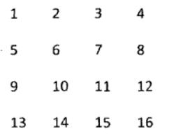
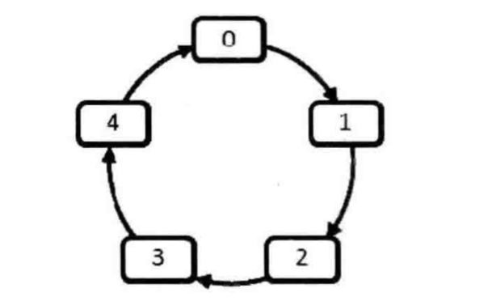

# 其他

* [返回顶层目录](../../../../SUMMARY.md)
* [返回上层目录](../jianzhi-offer.md)
* [剑指offer14：剪绳子](#剑指offer14：剪绳子)


# 剑指offer15：二进制中1的个数

> 题目：输入一个整数，输出该数二进制表示中1的个数。其中负数用补码表示。

不右移输入的数字n，左移数字1.

c++:

```c++
class Solution {
public:
     int  NumberOf1(int n) {
         int count = 0;
         unsigned int flag = 1;
         while(flag){
             if(n & flag){
                 count++;
             }
             
             flag = flag << 1;
         }
         
         return count;
     }
};
```

[详情](https://cuijiahua.com/blog/2017/11/basis_11.html)，[练习](https://www.nowcoder.com/practice/8ee967e43c2c4ec193b040ea7fbb10b8?tpId=13&tqId=11164&tPage=1&rp=1&ru=/ta/coding-interviews&qru=/ta/coding-interviews/question-ranking)。


# 剑指offer16：数值的整数次方

> 题目：输入一个整数，输出该数二进制表示中1的个数。其中负数用补码表示。

不右移输入的数字n，左移数字1。

c++:

```c++
class Solution {
    bool g_InvalidInput = false;
    
public:
    double Power(double base, int exponent) {
        g_InvalidInput = false;
        if(equal(base, 0.0) && exponent < 0) {
            g_InvalidInput = true;
            return 0.0;
        }
        unsigned int absExponent = (unsigned int)(exponent);
        if(exponent < 0) {
            absExponent = (unsigned int)(-exponent);
        }
        
        double result = PowerWithUnsignedExponent(base, absExponent);
        if(exponent < 0) {
            result =  1.0 / result;
        }
        return result;
    }
private:
    double PowerWithUnsignedExponent(double base, unsigned int exponent) {
        double result = 1.0;
        for(int i = 1; i <= exponent; i++) {
            result *= base;
        }
        return result;
    }
    
    bool equal(double num1, double num2){
        if(num1 - num2 > -0.0000001 && (num1 - num2) < 0.0000001){
            return true;
        } else{
            return false;
        }
    }
};
```

[详情](https://cuijiahua.com/blog/2017/11/basis_12.html)，[练习](https://www.nowcoder.com/practice/1a834e5e3e1a4b7ba251417554e07c00?tpId=13&tqId=11165&tPage=1&rp=1&ru=/ta/coding-interviews&qru=/ta/coding-interviews/question-ranking)。


# 剑指offer29：顺时针打印矩阵

> 题目：输入一个矩阵，按照从外向里以顺时针的顺序依次打印出每一个数字，例如，如果输入如下矩阵：
>
> 
>
> 则依次打印出数组：1，2，3，4，8，12，16，15，14，13，9，5，6，7，11，10。

将结果存入vector数组，从左到右，再从上到下，再从右到左，最后从下到上遍历。

c++:

```c++
class Solution {
public:
    vector<int> printMatrix(vector<vector<int> > matrix) {
        int rows = matrix.size();			//行数
        int cols = matrix[0].size();		//列数
        vector<int> result;
        
        if(rows == 0 && cols == 0){
            return result;
        }
        int left = 0, right = cols - 1, top = 0, bottom = rows - 1;
        
        while(left <= right && top <= bottom){
            //从左到右
            for(int i = left; i <= right; ++i){
                result.push_back(matrix[top][i]);
            }
            //从上到下
            for(int i = top + 1; i <= bottom; ++i){
                result.push_back(matrix[i][right]);
            }
            //从右到左
            if(top != bottom){
                for(int i = right - 1; i >= left; --i){
                    result.push_back(matrix[bottom][i]);
                }
            }
            //从下到上
            if(left != right){
                for(int i = bottom - 1; i > top; --i){
                    result.push_back(matrix[i][left]);
                }
            }
            left++, top++, right--, bottom--;
        }
        return result;
    }
};
```

[详情](https://cuijiahua.com/blog/2017/12/basis_19.html)，[练习](https://www.nowcoder.com/practice/9b4c81a02cd34f76be2659fa0d54342a?tpId=13&tqId=11172&tPage=1&rp=1&ru=/ta/coding-interviews&qru=/ta/coding-interviews/question-ranking)。


# 剑指offer40：最小的K个数

> 题目：输入n个整数，找出其中最小的K个数。例如输入4,5,1,6,2,7,3,8这8个数字，则最小的4个数字是1,2,3,4。

维护k个元素的最大堆，即用容量为k的最大堆存储最先遍历到的k个数，并假设他们是最小的k个数。继续遍历数列，每次遍历到一个元素，将它与堆顶元素比较，若小于堆顶元素，更新堆，否则，不更新堆。

c++:

```c++
class Solution {
public:
    vector<int> GetLeastNumbers_Solution(vector<int> input, int k) {
        vector<int> result;
        int length = input.size();
        bool need_update = true;
        if(length <= 0 || k <= 0 || k > length){
            return result;
        }
        
        for(int i = 0; i < input.size(); i++){
            if(result.size() < k){
                result.push_back(input[i]);
            }
            else{
                if(need_update) {
                    for(int j = k / 2 - 1; j >= 0; j--){
                        HeadAdjust(result, j, k);
                    }
                    need_update = false;
                }
                if(result[0] > input[i]) {
                    swap(result[0], result[k - 1]);
                    result[k-1] = input[i];
                    need_update = true;
                }
            }
        }
       
        return result;
    }
private:
    void HeadAdjust(vector<int> &input, int parent, int length){
        int temp = input[parent];
        int child = 2 * parent + 1;
        while(child < length){
            if(child + 1 < length && input[child] < input[child+1]){
                child++;
            }
            if(temp >= input[child]){
                break;
            }
            input[parent] = input[child];
            
            parent = child;
            child = 2 * parent + 1;
        }
        input[parent] = temp;
    }
};
```

[详情](https://cuijiahua.com/blog/2017/12/basis_29.html)，[练习](https://www.nowcoder.com/practice/6a296eb82cf844ca8539b57c23e6e9bf?tpId=13&tqId=11182&tPage=1&rp=1&ru=/ta/coding-interviews&qru=/ta/coding-interviews/question-ranking)。


# 剑指offer43：从1到n整数中1出现的次数

> 题目：输入一个整数n，求从1到n这n个整数的十进制表示中1出现的次数。例如输入12，从1到12这些整数中包含1的数字有1，10，11和12，1一共出现了5次。

两种方法，一种是从1到n遍历，每次通过对10求余数判断整数的个位数字是不是1，大于10的除以10之后再判断。我们对每个数字都要做除法和求余运算以求出该数字中1出现的次数。如果输入数字n，n有O(logn)位，我们需要判断每一位是不是1，那么时间复杂度为O(n*logn)。这样做，计算量大，效率不高。

第二种是数学之美第134页上面提出的方法，设定整数点（如1、10、100等等）作为位置点i（对应n的各位、十位、百位等等），分别对每个数位上有多少包含1的点进行分析。这个有点太难了，面试也不会出这个。

只看第一种简单的遍历：

c++:

```c++
class Solution {
public:
    int NumberOf1Between1AndN_Solution(int n)
    {
        int number = 0;
        for(unsigned int i = 1; i <= n; i++) {
            number += GetOneNum(i);
        }
        return number;
    }
private:
    int GetOneNum(unsigned int i) {
        int num = 0;
        while(i) {
            if(i % 10 == 1) {
                num++;
            }
            i = i / 10;
        }
        return num;
    }
};
```

[详情](https://cuijiahua.com/blog/2017/12/basis_31.html)，[练习](https://www.nowcoder.com/practice/bd7f978302044eee894445e244c7eee6?tpId=13&tqId=11184&tPage=1&rp=1&ru=/ta/coding-interviews&qru=/ta/coding-interviews/question-ranking)。


# 剑指offer49：丑数

> 题目： 把只包含因子2、3和5的数称作丑数（Ugly Number）。例如6、8都是丑数，但14不是，因为它包含因子7。 习惯上我们把1当做是第一个丑数。求按从小到大的顺序的第N个丑数。

所谓的一个数m是另一个数n的因子，是指n能被m整除，也就是n%m==0。根据丑数的定义，丑数只能被2、3和5整除。根据丑数的定义，丑数应该是另一个丑数乘以2、3或者5的结果（1除外）。因此我们可以创建一个数组，里面的数字是排好序的丑数，每一个丑数都是前面的丑数乘以2、3或者5得到的。

这个思路的关键问题在于怎样保证数组里面的丑数是排好序的。对乘以2而言，肯定存在某一个丑数T2，排在它之前的每一个丑数乘以2得到的结果都会小于已有最大的丑数，在它之后的每一个丑数乘以乘以2得到的结果都会太大。我们只需要记下这个丑数的位置，同时每次生成新的丑数的时候，去更新这个T2。对乘以3和5而言，也存在着同样的T3和T5。

c++:

```c++
class Solution {
public:
    int GetUglyNumber_Solution(int index) {
        if(index <= 0){
            return 0;
        }
        vector<int> res(index);
        res[0] = 1;
        int t2 = 0, t3 = 0, t5 = 0;
        for(int i = 1; i < index; i++){
            res[i] = min(res[t2] * 2, min(res[t3] * 3, res[t5] * 5));
            while(res[i] >= res[t2] * 2){
                t2++;
            }
            while(res[i] >= res[t3] * 3){
                t3++;
            }
            while(res[i] >= res[t5] * 5){
                t5++;
            }
        }
        return res[index - 1];
    }
};
```

[详情](https://cuijiahua.com/blog/2018/01/basis_33.html)，[练习](https://www.nowcoder.com/practice/6aa9e04fc3794f68acf8778237ba065b?tpId=13&tqId=11186&tPage=1&rp=1&ru=/ta/coding-interviews&qru=/ta/coding-interviews/question-ranking)。


# 剑指offer57-1：和为S的两个数字

> 题目：输入一个递增排序的数组和一个数字S，在数组中查找两个数，是的他们的和正好是S，如果有多对数字的和等于S，输出两个数的乘积最小的。

对于一个数组，我们可以定义两个指针，一个从左往右遍历（pleft），另一个从右往左遍历（pright）。首先，我们比较第一个数字和最后一个数字的和curSum与给定数字sum，如果curSum < sum，那么我们就要加大输入值，所以，pleft向右移动一位，重复之前的计算；如果curSum > sum，那么我们就要减小输入值，所以，pright向左移动一位，重复之前的计算；如果相等，那么这两个数字就是我们要找的数字，直接输出即可。

这么做的好处是，也保证了乘积最小。为什么？
$$
\begin{aligned}
&(b+a)^2-(b-a)^2=4ab\\
\Rightarrow&S^2-(b-a)^2=4ab\\
\Rightarrow&min(ab)\Rightarrow max(b-a)
\end{aligned}
$$
要让ab最小，需要让b-a最大，这正好能够满足。

c++:

```c++
class Solution {
public:
    vector<int> FindNumbersWithSum(vector<int> array,int sum) {
        vector<int> result;
        int length = array.size();
        if(length < 1){
            return result;
        }
        int pright = length - 1;
        int pleft = 0;
        
        while(pright > pleft){
            int curSum = array[pleft] + array[pright];
            if(curSum == sum){
                result.push_back(array[pleft]);
                result.push_back(array[pright]);
                break;
            }
            else if(curSum < sum){
                pleft++;
            }
            else{
                pright--;
            }
        }
        return result;
    }
};
```

[详情](https://cuijiahua.com/blog/2018/01/basis_42.html)，[练习](https://www.nowcoder.com/practice/390da4f7a00f44bea7c2f3d19491311b?tpId=13&tqId=11195&tPage=1&rp=1&ru=/ta/coding-interviews&qru=/ta/coding-interviews/question-ranking)。


# 剑指offer57-2：和为S的连续正数序列

> 题目：小明很喜欢数学,有一天他在做数学作业时,要求计算出9~16的和,他马上就写出了正确答案是100。但是他并不满足于此,他在想究竟有多少种连续的正数序列的和为100(至少包括两个数)。没多久,他就得到另一组连续正数和为100的序列:18,19,20,21,22。现在把问题交给你,你能不能也很快的找出所有和为S的连续正数序列? Good Luck!

这道题还是蛮简单的。

设定两个指针，一个指向第一个数，一个指向最后一个数，在此之前需要设定第一个数和最后一个数的值，由于是正数序列，所以可以把第一个数设为1，最后一个数为2（因为是要求是连续正数序列，最后不可能和第一个数重合）。下一步就是不断改变第一个数和最后一个数的值，如果从第一个数到最后一个数的和刚好是要求的和，那么把所有的数都添加到一个序列中；如果大于要求的和，则说明从第一个数到最后一个数之间的范围太大，因此减小范围，需要把第一个数的值加1，同时把当前和减去原来的第一个数的值；如果小于要求的和，说明范围太小，因此把最后一个数加1，同时把当前的和加上改变之后的最后一个数的值。这样，不断修改第一个数和最后一个数的值，就能确定所有连续正数序列的和等于S的序列了。

注意：初中的求和公式应该记得吧，首项加尾项的和乘以个数除以2，即sum = (a + b) * n / 2。

c++:

```c++
class Solution {
public:
    vector<vector<int> > FindContinuousSequence(int sum) {
        vector<vector<int> > result;
        // 高位指针和低位指针
        int phigh = 2, plow = 1;
        
        // 终止条件是phigh等于sum
        while(phigh > plow){
            // 当前和，使用求和公式s = (a+b) * n / 2
            int curSum = (plow + phigh) * (phigh - plow + 1) >> 1;
            if(curSum < sum){
                phigh++;
            }
            if(curSum == sum){
                vector<int> temp;
                for(int i = plow; i <= phigh; i++){
                    temp.push_back(i);
                }
                result.push_back(temp);
                plow++;
            }
            if(curSum > sum){
                plow++;
            }
        }
        return result;
    }
};
```

[详情](https://cuijiahua.com/blog/2018/01/basis_41.html)，[练习](https://www.nowcoder.com/practice/c451a3fd84b64cb19485dad758a55ebe?tpId=13&tqId=11194&tPage=1&rp=1&ru=/ta/coding-interviews&qru=/ta/coding-interviews/question-ranking)。


# 剑指offer61：扑克牌顺子

> 题目：LL今天心情特别好,因为他去买了一副扑克牌,发现里面居然有2个大王,2个小王(一副牌原本是54张😊)...他随机从中抽出了5张牌,想测测自己的手气,看看能不能抽到顺子,如果抽到的话,他决定去买体育彩票,嘿嘿！！“红心A,黑桃3,小王,大王,方片5”,“Oh My God!”不是顺子.....LL不高兴了,他想了想,决定大\小 王可以看成任何数字,并且A看作1,J为11,Q为12,K为13。上面的5张牌就可以变成“1,2,3,4,5”(大小王分别看作2和4),“So Lucky!”。LL决定去买体育彩票啦。 现在,要求你使用这幅牌模拟上面的过程,然后告诉我们LL的运气如何。为了方便起见,你可以认为大小王是0。

这道题还是蛮简单的。

设定两个指针，一个指向第一个数，一个指向最后一个数，在此之前需要设定第一个数和最后一个数的值，由于是正数序列，所以可以把第一个数设为1，最后一个数为2（因为是要求是连续正数序列，最后不可能和第一个数重合）。下一步就是不断改变第一个数和最后一个数的值，如果从第一个数到最后一个数的和刚好是要求的和，那么把所有的数都添加到一个序列中；如果大于要求的和，则说明从第一个数到最后一个数之间的范围太大，因此减小范围，需要把第一个数的值加1，同时把当前和减去原来的第一个数的值；如果小于要求的和，说明范围太小，因此把最后一个数加1，同时把当前的和加上改变之后的最后一个数的值。这样，不断修改第一个数和最后一个数的值，就能确定所有连续正数序列的和等于S的序列了。

注意：初中的求和公式应该记得吧，首项加尾项的和乘以个数除以2，即sum = (a + b) * n / 2。

c++:

```c++
class Solution {
public:
    bool IsContinuous( vector<int> numbers ) {
        if(numbers.size() == 0)
            return false;

        int len = numbers.size();
        int zero_count = 0;
        int gap_count = 0;

        sort(numbers.begin(), numbers.end());
        int I = 0;
        for(; I<len; I++)
            if(numbers[I] == 0)
                ++zero_count;

        int small = zero_count;
        int big = small + 1;
        while(big < len)
        {
            if(numbers[small] == numbers[big])
                return false;
            gap_count += numbers[big] - numbers[small] -1;
            small = big;
            ++big;
        }
        return (gap_count > zero_count)? false: true;
    }
};
```

[详情](https://cuijiahua.com/blog/2018/01/basis_45.html)，[练习](https://www.nowcoder.com/practice/762836f4d43d43ca9deb273b3de8e1f4?tpId=13&tqId=11198&tPage=1&rp=1&ru=/ta/coding-interviews&qru=/ta/coding-interviews/question-ranking)。


# 剑指offer62：圆圈中最后剩下的数

> 题目：每年六一儿童节,牛客都会准备一些小礼物去看望孤儿院的小朋友,今年亦是如此。HF作为牛客的资深元老,自然也准备了一些小游戏。其中,有个游戏是这样的:首先,让小朋友们围成一个大圈。然后,他随机指定一个数m,让编号为0的小朋友开始报数。每次喊到m-1的那个小朋友要出列唱首歌,然后可以在礼品箱中任意的挑选礼物,并且不再回到圈中,从他的下一个小朋友开始,继续0...m-1报数....这样下去....直到剩下最后一个小朋友,可以不用表演,并且拿到牛客名贵的“名侦探柯南”典藏版(名额有限哦!!^_^)。请你试着想下,哪个小朋友会得到这份礼品呢？(注：小朋友的编号是从0到n-1)

例如，0，1，2，3，4这5个数字组成一个圆圈，从数字0开始每次删除第3个数字，则删除的前4个数字依次是2、0、4、1，因此最后剩下的数字是3。



解法1：用环形链表模拟圆圈。

c++:

```c++
class Solution {
public:
    int LastRemaining_Solution(int n, int m)
    {
        if(n < 1 || m < 1) {
            return -1;
        }
        list<int> numbers;
        for(int i = 0; i < n; ++i) {
            numbers.push_back(i);
        }
        list<int>::iterator current = numbers.begin();
        
        while(numbers.size() > 1) {
            for(int i = 1; i < m; ++i) {
                current ++;
                if(current == numbers.end()) {
                    current = numbers.begin();
                }
            }
            list<int>::iterator next = ++ current;
            if(next == numbers.end()) {
                next = numbers.begin();
            }
            -- current;
            numbers.erase(current);
            current = next;
        }
        
        return *(current);
    }
};
```

[详情](https://cuijiahua.com/blog/2018/01/basis_46.html)，[练习](https://www.nowcoder.com/practice/f78a359491e64a50bce2d89cff857eb6?tpId=13&tqId=11199&tPage=1&rp=1&ru=/ta/coding-interviews&qru=/ta/coding-interviews/question-ranking)。

解法2：[用递归或循环](https://www.zhihu.com/question/20065611/answer/78681758)：

可以这样理解这个方法：

当有n个人的时候，他们的编号依次是0、1、2、3、4、………、n-1。假设最后编号为x(n)的人会留下来。

因为数到m的那个人会出列，那么此轮中编号为(m-1)%n的人会出列，编号为(m+0)%n的人将做为下一轮编号为0的人，此轮编号为(m+i)%n的人将做为下一轮编号为i的人…

因此当有n-1个人的时候，编号为i的人对应着上一轮编号为(m+i)%n的人。假设此轮编号为x(n-1)的人最终会留下来。因为编号为x(n-1)的人肯定对应着上一轮的x(n)，所以有**x(n)=(m+x(n-1))%n**。

有了这个递推公式，那我们就可以一直递推到x(2)=(m+x(1))%2，而x(1)=0。

所以我们可以这么来写这个函数:

c++:

```c++
class Solution {
public:
    int LastRemaining_Solution(int n, int m)
    {
        if(n < 1 || m < 1) {
            return -1;
        }
        int last = 0;
        for(int i = 2; i <= n; i++) {
            last = (last + m) % i;
        }
        return last;
    }
};
```

[详情](https://cuijiahua.com/blog/2018/01/basis_46.html)，[练习](https://www.nowcoder.com/practice/f78a359491e64a50bce2d89cff857eb6?tpId=13&tqId=11199&tPage=1&rp=1&ru=/ta/coding-interviews&qru=/ta/coding-interviews/question-ranking)。


# 参考资料

- [剑指Offer系列刷题笔记汇总](https://cuijiahua.com/blog/2018/02/basis_67.html)

本文参考此博客。

