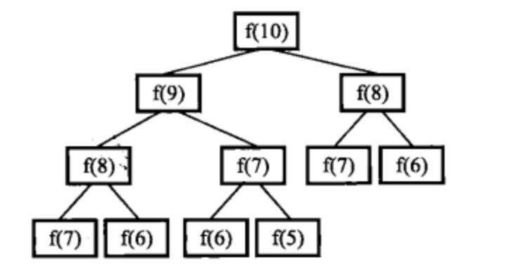

# 递归和回溯法

* [返回顶层目录](../../../../SUMMARY.md)
* [返回上层目录](../jianzhi-offer.md)
* [递归](#递归)
  * [剑指offer10：裴波那契数列](#剑指offer10：裴波那契数列)
  * [剑指offer10-1：青蛙跳台阶](#剑指offer10-1：青蛙跳台阶)
  * [剑指offer10-3：矩形覆盖](#剑指offer10-3：矩形覆盖)
* [回溯法](#回溯法)
  * [剑指offer12：矩阵中的路径](#剑指offer12：矩阵中的路径)


# 递归

## 剑指offer10：裴波那契数列

>题目：大家都知道斐波那契数列，现在要求输入一个整数n，请你输出斐波那契数列的第n项。（n<=39）
>
>斐波那契数列公式为：
>
>

这道题递归很好写，但是存在很严重的效率问题。我们以求解f(10)为例类分析递归的求解过程。想求f(10)，需要先求得f(9)和f(8)。同样，想求得f(9)，需要先求的f(8)和f(7)....我们可以用树形结构来表示这种依赖关系，如下图所示：



我们不难发现在这棵树中有很多结点是重复的，而且重复的结点数会随着n的增加而急剧增加，这意味计算量会随着n的增加而急剧增大。事实上，递归方法计算的时间复杂度是以n的指数的方式递增的。

所以，使用简单的循环方法来实现。

c++:

```c++
class Solution {
public:
    int Fibonacci(int n) {
        if(n <= 0)
            return 0;
        if(n == 1)
            return 1;
        int first = 0, second = 1, third = 0;
        for (int i = 2; i <= n; i++) {
            third = first + second;
            first = second;
            second = third;
        }
        return third;
    }
};
```

[详情](https://cuijiahua.com/blog/2017/11/basis_7.html)，[练习]()。


## 剑指offer10-1：青蛙跳台阶

> 题目：一只青蛙一次可以跳上1级台阶，也可以跳上2级。求该青蛙跳上一个n级的台阶总共有多少种跳法。

首先我们考虑最简单的情况。如果只有1级台阶，那么显然只一种跳法。如果有2级台阶，那就有两种跳法：一种是分两次跳，每次跳1级；另一种是一次跳2级。

接着，我们来讨论一般情况。我们把n级台阶时的跳法看成是n的函数，记为f(n)。当n>2时，第一次跳的时候就有两种不同的选择：一是第一次只跳1级，此时跳法数目等于后面剩下的n-1级台阶的跳法数目，即为f(n-1)；另外一种选择是跳一次跳2级，此时跳法数目等于后面剩下的n-2级台阶的跳法数目，即为f(n-2)。因此n级台阶的不同跳法的总数f(n)=f(n-1)+f(n-2)。分析到这里，我们不难看出这实际上就是斐波那契数列了。

c++:

```c++
class Solution {
public:
    int jumpFloor(int number) {
        if(number <= 0){
            return 0;
        }
        else if(number < 3){
            return number;
        }
        int first = 1, second = 2, third = 0;
        for(int i = 3; i <= number; i++){
            third = first + second;
            first = second;
            second = third;
        }
        return third;
    }
};
```

[详情](https://cuijiahua.com/blog/2017/11/basis_8.html)，[练习](https://www.nowcoder.com/practice/8c82a5b80378478f9484d87d1c5f12a4?tpId=13&tqId=11161&tPage=1&rp=1&ru=/ta/coding-interviews&qru=/ta/coding-interviews/question-ranking)。


## 剑指offer10-3：矩形覆盖

> 题目：我们可以用2\*1的小矩形横着或者竖着去覆盖更大的矩形。请问用n个2\*1的小矩形无重叠地覆盖一个2\*n的大矩形，总共有多少种方法？

以2x8的矩形为例。示意图如下：


我们先把2x8的覆盖方法记为f(8)。用第一个1x2小矩阵覆盖大矩形的最左边时有两个选择，竖着放或者横着放。当竖着放的时候，右边还剩下2x7的区域，这种情况下的覆盖方法记为f(7)。接下来考虑横着放的情况。当1x2的小矩形横着放在左上角的时候，左下角和横着放一个1x2的小矩形，而在右边还剩下2x6的区域，这种情况下的覆盖方法记为f(6)。因此f(8)=f(7)+f(6)。此时我们可以看出，这仍然是斐波那契数列。

c++:

```c++
class Solution {
public:
    int rectCover(int number) {
		if(number <= 2){
            return number;
        }
        int first = 1, second = 2, third = 0;
        for(int i = 3; i <= number; i++){
            third = first + second;
            first = second;
            second = third;
        }
        return third;
    }
};
```

[详情](https://cuijiahua.com/blog/2017/11/basis_10.html)，[练习](https://www.nowcoder.com/practice/72a5a919508a4251859fb2cfb987a0e6?tpId=13&tqId=11163&tPage=1&rp=1&ru=/ta/coding-interviews&qru=/ta/coding-interviews/question-ranking)。

# 回溯法

## 剑指offer12：矩阵中的路径

> 题目：请设计一个函数，用来判断在一个矩阵中是否存在一条包含某字符串所有字符的路径。路径可以从矩阵中的任意一个格子开始，每一步可以在矩阵中向左，向右，向上，向下移动一个格子。如果一条路径经过了矩阵中的某一个格子，则该路径不能再进入该格子。 例如在下面的3x4的矩阵中包含一条字符串"bcced"的路径（路径中的字母用斜体表示）。但是矩阵中不包含"abcb"路径，因为字符串的第一个字符b占据了矩阵中的第一行第二个格子之后，路径不能再次进入这个格子。
>
> 

这是一个可以用回溯法解决的典型问题。

首先，遍历这个矩阵，我们很容易就能找到与字符串str中第一个字符相同的矩阵元素ch。然后遍历ch的上下左右四个字符，如果有和字符串str中下一个字符相同的，就把那个字符当作下一个字符（下一次遍历的起点），如果没有，就需要回退到上一个字符，然后重新遍历。为了避免路径重叠，需要一个辅助矩阵来记录路径情况。

下面代码中，当矩阵坐标为（row，col）的格子和路径字符串中下标为pathLength的字符一样时，从4个相邻的格子（row，col-1）、（row-1，col）、（row，col+1）以及（row+1，col）中去定位路径字符串中下标为pathLength+1的字符。

如果4个相邻的格子都没有匹配字符串中下标为pathLength+1的字符，表明当前路径字符串中下标为pathLength的字符在矩阵中的定位不正确，我们需要回到前一个字符串（pathLength-1），然后重新定位。

一直重复这个过程，直到路径字符串上所有字符都在矩阵中找到格式的位置（此时str[pathLength] == '\0'）。

c++:

```c++
class Solution {
public:
    bool hasPath(char* matrix, int rows, int cols, char* str)
    {
        if(matrix == NULL || rows < 1 || cols < 1 || str == NULL){
            return false;
        }
        bool* visited = new bool[rows*cols];
        memset(visited, 0, rows*cols);
        int pathLength = 0;
        for(int row = 0; row < rows; row++){
            for(int col = 0; col < cols; col++){
                if(hasPathCore(matrix, rows, cols, row, col, str, pathLength, visited)){
                    delete[] visited;
                    return true;
                }
            }
        }
        delete[] visited;
        return false;
    }
private:
    bool hasPathCore(char* matrix, int rows, int cols, int row, int col, char* str, int& pathLength, bool* visited){
        if(str[pathLength] == '\0'){
            return true;
        }
        bool hasPath = false;
        if(row >= 0 && row < rows && col >= 0 && col < cols && matrix[row*cols+col] == str[pathLength] && !visited[row*cols+col]){
            ++pathLength;
            visited[row*cols+col] = true;
            hasPath = hasPathCore(matrix, rows, cols, row-1, col, str, pathLength, visited)
                || hasPathCore(matrix, rows, cols, row+1, col, str, pathLength, visited)
                || hasPathCore(matrix, rows, cols, row, col-1, str, pathLength, visited)
                || hasPathCore(matrix, rows, cols, row, col+1, str, pathLength, visited);
            if(!hasPath){
                --pathLength;
                visited[row*cols+col] = false;
            }
        }
        return hasPath;
    }
};
```

[详情](https://cuijiahua.com/blog/2018/02/basis_65.html)，[练习](https://www.nowcoder.com/practice/c61c6999eecb4b8f88a98f66b273a3cc?tpId=13&tqId=11218&tPage=1&rp=1&ru=/ta/coding-interviews&qru=/ta/coding-interviews/question-ranking)。


# 参考资料

- [剑指Offer系列刷题笔记汇总](https://cuijiahua.com/blog/2018/02/basis_67.html)

本文参考此博客。

