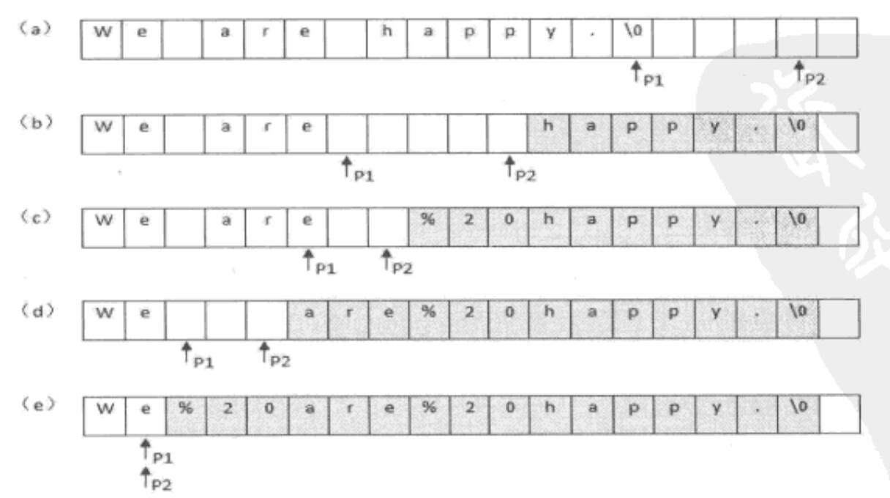
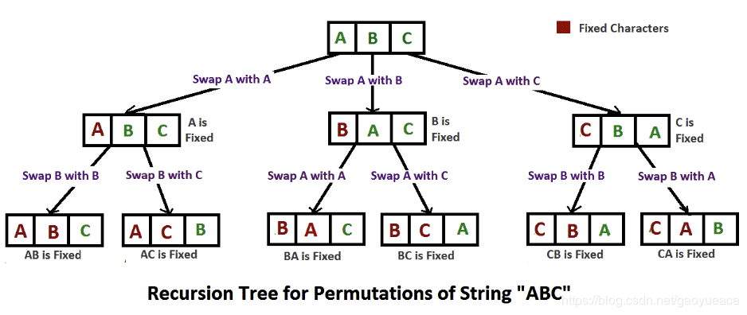

# 字符串

* [返回顶层目录](../../../../SUMMARY.md)
* [返回上层目录](../jianzhi-offer.md)
* [剑指offer5：替换空格](#剑指offer5：替换空格)
* [剑指offer38：字符串的排列](#剑指offer38：字符串的排列)
* [剑指offer50：第一个只出现一次的字符](#剑指offer50：第一个只出现一次的字符)
* [剑指offer58-1：翻转单词顺序](#剑指offer58-1：翻转单词顺序)
* [剑指offer58-2：左旋转字符串](#剑指offer58-2：左旋转字符串)
* [剑指offer67：把字符串转换成整数](#剑指offer67：把字符串转换成整数)
* [剑指offer19：正则表达式匹配](#剑指offer19：正则表达式匹配)
* [剑指offer20：表示数值的字符串](#剑指offer20：表示数值的字符串)


# 剑指offer5：替换空格

> 题目：请实现一个函数，将一个字符串中的空格替换成“%20”。例如，当字符串为We Are Happy.则经过替换之后的字符串为We%20Are%20Happy。

最简单的方法就是从头到尾遍历，但是时间复杂度为O(n^2)。

本文采用一种时间复杂度为O(n)的方法。

我们可以先遍历一次字符串，这样就可以统计出字符串空格的总数，并可以由此计算出替换之后的字符串的总长度。每替换一个空格，长度增加2，因此替换以后字符串的长度等于原来的长度加上2乘以空格数目。以"We are happy"为例，"We are happy"这个字符串的长度为14（包括结尾符号"\n"），里面有两个空格，因此替换之后字符串的长度是18。

我们从字符串的尾部开始复制和替换。首先准备两个指针，P1和P2，P1指向原始字符串的末尾，而P2指向替换之后的字符串的末尾。接下来我们向前移动指针P1，逐个把它指向的字符复制到P2指向的位置，直到碰到第一个空格为止。碰到第一个空格之后，把P1向前移动1格，在P2之前插入字符串"%20"。由于"%20"的长度为3，同时也要把P2向前移动3格。

移动示意图：



c++:

```c++
class Solution {
public:
    void replaceSpace(char *str,int length) {
        int i = 0;
        int numSpace =0;
        while(str[i] != '\0')
        {
            if(str[i]==' ')
                numSpace++;
            ++i;
        }
        int newLen = i+numSpace*2;
        for(int j=i;j>=0,newLen>=0;)
        {
            if(str[j]==' ')
                {
                str[newLen--] = '0';
                str[newLen--] = '2';
                str[newLen--] = '%';
            }
            else
                str[newLen--] = str[j];
            j--;
        }
    }
};
```

[详情](https://cuijiahua.com/blog/2017/11/basis_2.html)，[练习](https://www.nowcoder.com/practice/4060ac7e3e404ad1a894ef3e17650423?tpId=13&tqId=11155&tPage=1&rp=1&ru=/ta/coding-interviews&qru=/ta/coding-interviews/question-ranking)。


# 剑指offer38：字符串的排列

> 题目：输入一个字符串,按字典序打印出该字符串中字符的所有排列。例如输入字符串abc，则打印出由字符a,b,c所能排列出来的所有字符串abc,acb,bac,bca,cab和cba。

输入一个字符串,长度不超过9(可能有字符重复)，字符只包括大小写字母。

我们求整个字符串的排列，可以看成两步：首先求所有可能出现在第一个位置的字符，即把第一个字符和后面所有的字符交换。如下图所示：


上图就是分别把第一个字符a和后面的b、c等字符交换的情形。首先固定第一个字符，求后面所有字符的排列。这个时候我们仍把后面的所有字符分为两部分：后面的字符的第一个字符，以及这个字符之后的所有字符。然后把第一个字符逐一和它后面的字符交换。

这个思路，是典型的递归思路：



c++:

```c++
class Solution {
public:
    vector<string> Permutation(string str) {
        //判断输入
        if(str.length() == 0){
            return result;
        }
        PermutationCore(str, 0);
        //对结果进行排序
        sort(result.begin(), result.end());
        return result;
    }
    
private:
    void PermutationCore(string str, int begin){
        //递归结束的条件：第一位和最后一位交换完成
        if(begin == str.length()){
            result.push_back(str);
            return;
        }
        for(int i = begin; i < str.length(); i++){
            //如果字符串相同，则不交换
            if(i != begin && str[i] == str[begin]){
                continue;
            }
            //位置交换
            swap(str[begin], str[i]);
            //递归调用，前面begin+1的位置不变，后面的字符串全排列
            PermutationCore(str, begin + 1);
            // 位置应该再换回来，虽然不加这句 也对，但是我觉得还是要加上
            swap(str[begin], str[i]);
        }
    }
    vector<string> result;
};
```

[详情](https://cuijiahua.com/blog/2017/12/basis_27.html)，[练习](https://www.nowcoder.com/practice/fe6b651b66ae47d7acce78ffdd9a96c7?tpId=13&tqId=11180&tPage=1&rp=1&ru=/ta/coding-interviews&qru=/ta/coding-interviews/question-ranking)。


# 剑指offer50：第一个只出现一次的字符

> 题目：在一个字符串(1<=字符串长度<=10000，全部由字母组成)中找到第一个只出现一次的字符,并返回它的位置。

建立一个哈希表，第一次扫描的时候，统计每个字符的出现次数。第二次扫描的时候，如果该字符出现的次数为1，则返回这个字符的位置。

c++:

```c++
class Solution {
public:
    int FirstNotRepeatingChar(string str) {
        int length = str.size();
        if(length == 0){
            return -1;
        }
        map<char, int> item;
        for(int i = 0; i < length; i++){
            item[str[i]]++;
        }
        for(int i = 0; i < length; i++){
            if(item[str[i]] == 1){
                return i;
            }
        }
        return -1;
    }
};
```

[详情](https://cuijiahua.com/blog/2018/01/basis_34.html)，[练习](https://www.nowcoder.com/practice/1c82e8cf713b4bbeb2a5b31cf5b0417c?tpId=13&tqId=11187&tPage=1&rp=1&ru=/ta/coding-interviews&qru=/ta/coding-interviews/question-ranking)。


# 剑指offer58-1：翻转单词顺序

> 题目：牛客最近来了一个新员工Fish，每天早晨总是会拿着一本英文杂志，写些句子在本子上。同事Cat对Fish写的内容颇感兴趣，有一天他向Fish借来翻看，但却读不懂它的意思。例如，“student. a am I”。后来才意识到，这家伙原来把句子单词的顺序翻转了，正确的句子应该是“I am a student.”。Cat对一一的翻转这些单词顺序可不在行，你能帮助他么？

观察字符串变化规律，你会发现这道题很简单。只需要对每个单词做翻转，然后再整体做翻转就得到了正确的结果。

c++:

```c++
class Solution {
public:
    string ReverseSentence(string str) {
        string result = str;
        int length = result.size();
        if(length == 0){
            return "";
        }
        // 追加一个空格，作为反转标志位
        result += ' ';
        int mark = 0;
        // 根据空格，反转所有单词
        for(int i = 0; i < length + 1; i++){
            if(result[i] == ' '){
                Reverse(result, mark, i - 1);
                mark = i + 1;
            }
        }
        // 去掉添加的空格
        result = result.substr(0, length);
        // 整体反转
        Reverse(result, 0, length - 1);
        
        return result;
    }
private:
    void Reverse(string &str, int begin, int end){
        while(begin < end){
            swap(str[begin++], str[end--]);
        }
    }
};
```

[详情](https://cuijiahua.com/blog/2018/01/basis_44.html)，[练习](https://www.nowcoder.com/practice/3194a4f4cf814f63919d0790578d51f3?tpId=13&tqId=11197&tPage=1&rp=1&ru=/ta/coding-interviews&qru=/ta/coding-interviews/question-ranking)。


# 剑指offer58-2：左旋转字符串

> 题目：输入字符串"abcdefg"和数字2，该函数将返回左旋转2位得到的结果"cdefgab"

第一步：翻转字符串“ab”，得到"ba"；

第二步：翻转字符串"cdefg"，得到"gfedc"；

第三步：翻转字符串"bagfedc"，得到"cdefgab"；

或者：

第一步：翻转整个字符串"abcdefg",得到"gfedcba"

第二步：翻转字符串“gfedc”，得到"cdefg"

第三步：翻转字符串"ba",得到"ab"

c++:

```c++
class Solution {
public:
    string LeftRotateString(string str, int n) {
        string result = str;
        int length = result.size();
        if(length < 0){
            return NULL;
        }
        if(0 <= n <= length){
            int pFirstBegin = 0, pFirstEnd = n - 1;
            int pSecondBegin = n, pSecondEnd = length - 1;
            ReverseString(result, pFirstBegin, pFirstEnd);
            ReverseString(result, pSecondBegin, pSecondEnd);
            ReverseString(result, pFirstBegin, pSecondEnd);
        }
        return result;
    }
private:
    void ReverseString(string &str, int begin, int end){
        while(begin < end){
            swap(str[begin++], str[end--]);
        }
    }
};
```

[详情](https://cuijiahua.com/blog/2018/01/basis_43.html)，[练习](https://www.nowcoder.com/practice/12d959b108cb42b1ab72cef4d36af5ec?tpId=13&tqId=11196&tPage=1&rp=1&ru=/ta/coding-interviews&qru=/ta/coding-interviews/question-ranking)。


# 剑指offer67：把字符串转换成整数

> 题目：将一个字符串转换成一个整数，要求不能使用字符串转换整数的库函数atoi。 数值为0或者字符串不是一个合法的数值则返回0。
>
> 输入一个字符串,包括数字字母符号,可以为空。如果是合法的数值表达则返回该数字，否则返回0
>
> 例如：
>
> ```c++
> +2147483647 => 2147483647
> 1a33 => 0
> ```

这道题要考虑全面，对异常值要做出处理。

对于这个题目，需要注意的要点有：

- 指针是否为空指针以及字符串是否为空字符串；
- 字符串对于正负号的处理；
- 输入值是否为合法值，即小于等于'9'，大于等于'0'；
- int为32位，需要判断是否溢出；
- 使用错误标志，区分合法值0和非法值0。

代码中用两个函数来实现该功能，其中标志位g_nStatus用来表示是否为异常输出，minus标志位用来表示是否为负数。

c++:

```c++
class Solution {
public:
    enum Status{kValid = 0, kInValid};
    int g_nStatus = kValid;
    int StrToInt(string str) {
        g_nStatus = kInValid;
        long long num = 0;
        const char* cstr = str.c_str();
        // 判断是否为指针和是否为空字符串
        if(cstr != NULL && *cstr != '\0'){
            // 正负号标志位，默认是加号
            bool minus = false;
            if(*cstr == '+'){
                cstr++;
            }
            else if(*cstr == '-'){
                minus = true;
                cstr++;
            }
            if(*cstr != '\0'){
                num = StrToIntCore(cstr, minus);
            }
        }
        return (int)num;
    }
private:
    long long StrToIntCore(const char* cstr, bool minus){
        long long num = 0;
        while(*cstr != '\0'){
            // 判断是否是非法值
            if(*cstr >= '0' && *cstr <= '9'){
                int flag = minus ? -1 : 1;
                num = num * 10 + flag * (*cstr - '0');
                // 判断是否溢出,32位
                if((!minus && num > 0x7fffffff) || (minus && num < (signed int)0x80000000)){
                    num = 0;
                    break;
                }
                cstr++;
            }
            else{
                num = 0;
                break;
            }
        }
        // 判断是否正常结束
        if(*cstr == '\0'){
            g_nStatus = kValid;
        }
        return num;
    }
};
```

[详情](https://cuijiahua.com/blog/2018/01/basis_49.html)，[练习](https://www.nowcoder.com/practice/1277c681251b4372bdef344468e4f26e?tpId=13&tqId=11202&tPage=1&rp=1&ru=/ta/coding-interviews&qru=/ta/coding-interviews/question-ranking)。


# 剑指offer19：正则表达式匹配

> 题目：请实现一个函数用来匹配包括'.'和'\*'的正则表达式。模式中的字符'.'表示任意一个字符，而'*'表示它前面的字符可以出现任意次（包含0次）。 在本题中，匹配是指字符串的所有字符匹配整个模式。例如，字符串"aaa"与模式"a.a"和"ab*ac*a"匹配，但是与"aa.a"和"ab*a"均不匹配。

这道题有些绕，需要好好思考下。

我们先来分析下如何匹配一个字符，现在只考虑字符'.'，不考虑'*'看一下：

如果字符串和模式串的当前字符相等，那么我们继续匹配它们的下一个字符；如果模式串中的字符是'.'，那么它可以匹配字符串中的任意字符，我们也可以继续匹配它们的下一个字符。

接下来，把字符'*'考虑进去，它可以匹配任意次的字符，当然出现0次也可以。

我们分两种情况来看：

- 模式串的下一个字符不是'*'，也就是上面说的只有字符'.'的情况。

如果字符串中的第一个字符和模式串中的第一个字符相匹配，那么字符串的模式串都向后移动一个字符，然后匹配剩余的字符串和模式串。如果字符串中的第一个字符和模式中的第一个字符不相匹配，则直接返回false。

- 模式串的下一个字符是'*'，此时就要复杂一些。

因为可能有多种不同的匹配方式。

选择一：无论字符串和模式串当前字符相不相等，我们都将模式串后移两个字符，相当于把模式串中的当前字符和'*'忽略掉，因为'*'可以匹配任意次的字符，所以出现0次也可以。

选择二：如果字符串和模式串当前字符相等，则字符串向后移动一个字符。而模式串此时有两个选择：

1、我们可以在模式串向后移动两个字符，继续匹配；

2、也可以保持模式串不变，这样相当于用字符'*'继续匹配字符串，也就是模式串中的字符'*'匹配字符串中的字符多个的情况。

用一张图表示如下：


如上图所示，当匹配进入状态2，并且字符串中的字符是'a'时，我们有两个选择：可以进入状态3（在模式串向后移动两个字符），也可以回到状态2（模式串保持不变）。

除此之外，还要注意对空指针的处理。

看下面的代码时可以用

```js
aaaaa
aa*
```

作为例子来看。

c++:

```c++
class Solution {
public:
    bool match(char* str, char* pattern)
    {
        // 指针为空，返回false
        if(str == NULL || pattern == NULL){
            return false;
        }
        return matchCore(str, pattern);
    }
private:
    bool matchCore(char* str, char* pattern){
        // 字符串和模式串都运行到了结尾，返回true
        if(*str == '\0' && *pattern == '\0'){
            return true;
        }
        // 字符串没有到结尾，模式串到了，则返回false
        // 模式串没有到结尾，字符串到了，则根据后续判断进行，需要对'*'做处理
        if((*str != '\0' && *pattern == '\0')){
            return false;
        }
        // 如果模式串的下一个字符是'*'，则进入状态机的匹配
        if(*(pattern + 1) == '*'){
            // 如果字符串和模式串相等，或者模式串是'.'，并且字符串没有到结尾，则继续匹配
            if(*str == *pattern || (*pattern == '.' && *str != '\0')){
                // 进入下一个状态，就是匹配到了一个
                return matchCore(str + 1, pattern + 2) ||
                    // 保持当前状态，就是继续那这个'*'去匹配
                    matchCore(str + 1, pattern) ||
                    // 跳过这个'*'
                    matchCore(str, pattern + 2);
            }
            // 如果字符串和模式串不相等，则跳过当前模式串的字符和'*'，进入新一轮的匹配
            else{
                // 跳过这个'*'
                return matchCore(str, pattern + 2);
            }
        }
        // 如果字符串和模式串相等，或者模式串是'.'，并且字符串没有到结尾，则继续匹配
        if(*str == *pattern || (*pattern == '.' && *str != '\0')){
            return matchCore(str + 1, pattern + 1);
        }
        return false;
    }
};
```

[详情](https://cuijiahua.com/blog/2018/01/basis_52.html)，[练习](https://www.nowcoder.com/practice/45327ae22b7b413ea21df13ee7d6429c?tpId=13&tqId=11205&tPage=1&rp=1&ru=/ta/coding-interviews&qru=/ta/coding-interviews/question-ranking)。


# 剑指offer20：表示数值的字符串

> 题目：请实现一个函数用来判断字符串是否表示数值（包括整数和小数）。例如，字符串"+100","5e2","-123","3.1416"和"-1E-16"都表示数值。 但是"12e","1a3.14","1.2.3","+-5"和"12e+4.3"都不是。

这道题还是比较简单的。表示数值的字符串遵循如下模式：

```js
[sign]integral-digits[.[fractional-digits]][e|E[sign]exponential-digits]
```

其中，`[`和`]`之间的为可有可无的部分。

在数值之前可能有一个表示正负的`+`或者`-`。接下来是若干个0到9的数位表示数值的整数部分（在某些小数里可能没有数值的整数部分）。如果数值是一个小数，那么在小数后面可能会有若干个0到9的数位表示数值的小数部分。如果数值用科学记数法表示，接下来是一个`e`或者`E`，以及紧跟着的一个整数（可以有正负号）表示指数。

判断一个字符串是否符合上述模式时，首先看第一个字符是不是正负号。如果是，在字符串上移动一个字符，继续扫描剩余的字符串中0到9的数位。如果是一个小数，则将遇到小数点。另外，如果是用科学记数法表示的数值，在整数或者小数的后面还有可能遇到`e`或者`E`。

c++:

```c++
class Solution {
public:
    // 数字的格式可以用A[.[B]][e|EC]或者.B[e|EC]表示，
    // 其中A和C都是整数（可以有正负号，也可以没有）
    // 而B是一个无符号整数
    bool isNumeric(char* string)
    {
        // 非法输入处理
        if(string == NULL || *string == '\0'){
            return false;
        }
        // 正负号判断
        if(*string == '+' || *string == '-'){
            ++string;
        }
        bool numeric = true;
        scanDigits(&string);
        if(*string != '\0'){
            // 小数判断
            if(*string == '.'){
                ++string;
                scanDigits(&string);
                if(*string == 'e' || *string == 'E'){
                    numeric = isExponential(&string);
                }
            }
            // 整数判断
            else if(*string == 'e' || *string == 'E'){
                numeric = isExponential(&string);
            }
            else{
                numeric = false;
            }
        }
        return numeric && *string == '\0';
    }
private:
    // 扫描数字，对于合法数字，直接跳过
    void scanDigits(char** string){
        while(**string != '\0' && **string >= '0' && **string <= '9'){
            ++(*string);
        }
    }
    // 用来潘达un科学计数法表示的数值的结尾部分是否合法
    bool isExponential(char** string){
        ++(*string);
        if(**string == '+' || **string == '-'){
            ++(*string);
        }
        if(**string == '\0'){
            return false;
        }
        scanDigits(string);
        // 判断是否结尾，如果没有结尾，说明还有其他非法字符串
        return (**string == '\0') ? true : false;
    }
};
```

[详情](https://cuijiahua.com/blog/2018/01/basis_53.html)，[练习](https://www.nowcoder.com/practice/6f8c901d091949a5837e24bb82a731f2?tpId=13&tqId=11206&tPage=1&rp=1&ru=/ta/coding-interviews&qru=/ta/coding-interviews/question-ranking)。


# 参考资料

- [剑指Offer系列刷题笔记汇总](https://cuijiahua.com/blog/2018/02/basis_67.html)

本文参考此博客。

