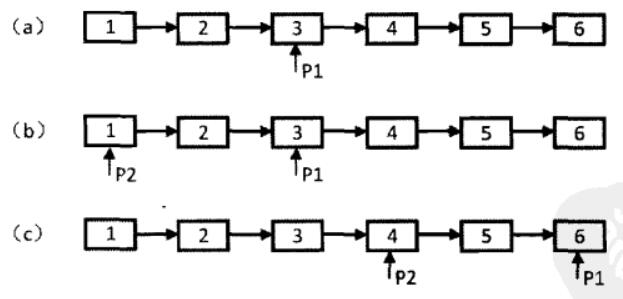

# 链表

* [返回顶层目录](../../../SUMMARY.md)
* [返回上层目录](../data-structures-and-algorithms.md)
* [剑指offer6：从尾到头打印链表](#剑指offer6：从尾到头打印链表)
* [剑指offer22：链表中倒数第k个节点](#剑指offer22：链表中倒数第k个节点)
* [剑指offer24：反转链表](#剑指offer24：反转链表)
* [剑指offer25：合并两个排序的链表](#剑指offer25：合并两个排序的链表)


# 剑指offer6：从尾到头打印链表

>题目：输入一个链表的头节点，从尾到头反过来打印每个节点的值。
>
>链表节点定义如下：
>
>```c++
>struct ListNode
>{
>	int m_nKey;
>	ListNode* m_pNext;
>}
>```

遍历链表是从头到尾，但是输出确实从尾到头，这就是典型的“后进先出“，可以用栈实现这个顺序。即每经过一个节点，将该节点放到一个栈中，当遍历完整个链表后，再从栈顶开始逐个输出节点的值，这时输出的节点顺序已经反过来了。

c++:

```c++
class Solution {
public:
    vector<int> printListFromTailToHead(ListNode* head) {
        stack<int> MyStack;
        vector<int> ReturnVal;
        ListNode* p = head;
        
        while(p!=NULL) {
            MyStack.push(p->val);
            p = p->next;
        }
        
        while(!MyStack.empty()) {
            ReturnVal.push_back(MyStack.top());
            MyStack.pop();
        }
        
        return ReturnVal;
    }
};
```

更多请见[牛客网](https://www.nowcoder.com/practice/d0267f7f55b3412ba93bd35cfa8e8035?tpId=13&tqId=11156&tPage=1&rp=1&ru=/ta/coding-interviews&qru=/ta/coding-interviews/question-ranking)。

# 剑指offer22：链表中倒数第k个节点

>题目：输入一个链表，输出该链表中倒数第k个结点。

我们可以定义两个指针。第一个指针从链表的头指针开始遍历向前走k-1，第二个指针保持不动；从第k步开始，第二个指针也开始从链表的头指针开始遍历。由于两个指针的距离保持在k-1，当第一个（走在前面的）指针到达链表的尾结点时，第二个指针（走在后面的）指针正好是倒数第k个结点。

效果示意图，以链表总共6个结点，求倒数第3个结点为例：



除此之外，要注意代码的鲁棒性。需要判断传入参数合法性问题。

c++：

```c++
class Solution {
public:
    ListNode* FindKthToTail(ListNode* pListHead, unsigned int k) {
        if(pListHead == nullptr || k == 0) {
            return nullptr;
        }
        
        ListNode *pAhead = pListHead;
        ListNode *pBehead = nullptr;
        
        for(unsigned int i = 0; i < k - 1; i++) {
            if(pAhead->next != nullptr) {
                pAhead = pAhead->next;
            } else {
                return nullptr;
            }
        }
        
        while(pAhead->next != nullptr) {
            pAhead = pAhead->next;
            pBehead = pBehead->next;
        }
        
        return pBehead;
    }
};
```

更多请见[牛客网](https://www.nowcoder.com/practice/529d3ae5a407492994ad2a246518148a?tpId=13&tqId=11167&tPage=1&rp=1&ru=/ta/coding-interviews&qru=/ta/coding-interviews/question-ranking)

# 剑指offer24：反转链表

>题目：输入一个链表，反转链表后，输出链表的所有元素。
>
>链表节点定义如下：
>
>```c++
>struct ListNode {
>	int val;
>	struct ListNode *next;
>}
>```

这个很简单，我们使用三个指针，分别指向当前遍历到的结点、它的前一个结点以及后一个结点。

在遍历的时候，做当前结点的尾结点和前一个结点的替换。

c++：

```c++
class Solution {
public:
    ListNode* ReverseList(ListNode* pHead) {
        ListNode* pReverseHead = nullptr;
        ListNode* pNode = pHead;
        ListNode* pPrev = nullptr;
        while(pNode != nullptr) {
            ListNode* pNext = pNode->next;
            
            if(pNext == nullptr) {
                pReverseHead = pNode; 
            }
            
            pNode->next = pPrev;
            pPrev = pNode;
            pNode = pNext;
        }
        
        return pReverseHead;
    }
};
```

更多请见[牛客网](https://www.nowcoder.com/practice/75e878df47f24fdc9dc3e400ec6058ca?tpId=13&tqId=11168&tPage=1&rp=1&ru=/ta/coding-interviews&qru=/ta/coding-interviews/question-ranking)

# 剑指offer25：合并两个排序的链表

> 题目：输入两个单调递增的链表，输出两个链表合成后的链表，当然我们需要合成后的链表满足单调不减规则。
>
> 链表定义如下：
>
> ```C++
> struct ListNode {
> 	int val;
> 	struct ListNode *next;
> };
> ```

先判断输入的链表是否为空的指针。如果第一个链表为空，则直接返回第二个链表；如果第二个链表为空，则直接返回第一个链表。如果两个链表都是空链表，合并的结果是得到一个空链表。

两个链表都是排序好的，我们只需要从头遍历链表，判断当前指针，哪个链表中的值小，即赋给合并链表指针即可。使用递归就可以轻松实现。

c++：

```
class Solution {
public:
    ListNode* Merge(ListNode* pHead1, ListNode* pHead2)
    {
        if(pHead1 == nullptr) return pHead2;
        if(pHead2 == nullptr) return pHead1;
        
        ListNode* pMergedHead = nullptr;
        
        if(pHead1->val <= pHead2->val) {
            pMergedHead = pHead1;
            pMergedHead->next = Merge(pHead1->next, pHead2);
        } else {
            pMergedHead = pHead2;
            pMergedHead->next = Merge(pHead1, pHead2->next);
        }
        
        return pMergedHead;
    }
};
```

更多请见[牛客网](https://www.nowcoder.com/practice/d8b6b4358f774294a89de2a6ac4d9337?tpId=13&tqId=11169&tPage=1&rp=1&ru=/ta/coding-interviews&qru=/ta/coding-interviews/question-ranking)。


```c++
#include <iostream>
#include <vector>
#include <stack>
using namespace std;

struct ListNode {
	int val;
	struct ListNode *next;
};

ListNode* Merge(ListNode* pHead1, ListNode* pHead2)
{
	if (pHead1 == nullptr) return pHead2;
	if (pHead2 == nullptr) return pHead1;

	ListNode* pMergedHead = nullptr;

	if (pHead1->val <= pHead2->val) {
		pMergedHead = pHead1;
		pMergedHead->next = Merge(pHead1->next, pHead2);
	}
	else {
		pMergedHead = pHead2;
		pMergedHead->next = Merge(pHead1, pHead2->next);
	}

	return pMergedHead;
}

int main()
{
    cout << "Hello World!\n"; 

	ListNode list1_1, list1_3, list2_2, list2_4;
	ListNode* pHead1, * pHead2, * pHeadM;
	list1_1.val = 1;
	list1_3.val = 3;
	list2_2.val = 2;
	list2_4.val = 4;
	pHead1 = &list1_1;
	list1_1.next = &list1_3;
	list1_3.next = nullptr;
	pHead2 = &list2_2;
	list2_2.next = &list2_4;
	list2_4.next = nullptr;

	pHeadM = Merge(pHead1, pHead2);
	
	do {
		cout << pHeadM->val << endl;
		pHeadM = pHeadM->next;
	} while (pHeadM != nullptr);
	
	

	return 0;
}
```


===

[面试常考-链表反转解析](https://mp.weixin.qq.com/s/zDRnSq_-pXg2iXHmVSDDbA)

