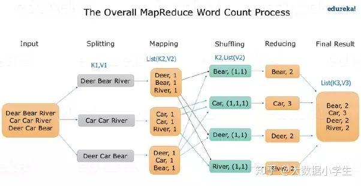

# MapReduce

* [返回顶层目录](../../SUMMARY.md)
* [返回上层目录](hadoop.md)

# 对MapReduce的理解

谷歌于2004年12月发表了一篇关于MapReduce技术的论文。这成为了Hadoop处理模型的起源。因此，MapReduce是一种编程模型，允许我们对大型数据集执行并行和分布式处理。  Hadoop可以从根本上分为两部分 - 处理和存储。对于存储，您有HDFS或Hadoop分布式文件系统，并且为了处理，您有MapReduce。 MapReduce基于Divide and Conquer定理，其中数据被分成较小的块，每个块在不同的机器中同时或并行处理。  现在，假设我们必须使用MapReduce对sample.txt执行简单的word count。因此，我们将找到这些独特单词的独特单词和出现次数。



首先，我们将输入分成三个模块，如图所示。这将在所有mapper节点之间分配工作。

然后，我们对每个mapper中的单词进行标记，并给出一个等于1的次数统计，即每个单词本身将出现一次。对每个标记的次数统计产生一个键值对， 如（bear, 1）说明在这个mapper中bear出现了一次

现在，将创建一个键值对列表，其中键只是单词和值是1。所以，对于第一行（deer, bear, river），我们有3个键值对 - (deer，1); (bear，1); (River，1)。map过程在所有节点上保持不变。
在mapper阶段之后，发生shuffle过程，以便将具有相同键的所有元组发送到相应的reducer。


因此，在排序和重排阶段之后，每个reducer将具有唯一键和与该键相对应的值列表。例如，Bear:[1,1]; car:[1,1,1]; Deer : [1,1], River : [1, 1] 

现在，每个Reducer计算该值列表中存在的值。如图所示，reducer获取一个值列表(如bear)，其中键值为[1,1]。然后，它计算列表中的1的数量，并将最终输出给出为 -  Bear，2。
最后，然后收集所有输出键/值对并将其写入输出文件中。

---

讲个和图书馆有关的[例子](https://www.zhihu.com/question/23345991/answer/628399452)吧。

假设图书馆里有100万本书。书可以分为A、B、C、D四个种类。（科幻、言情、历史、人文）。

先找10万人把这100万本书做分类。即现在获得了10万个表。每个表如下：

```
（P1，Book1，A）
（P1，Book2，D）
	……
（P1，Book10，C）
```

这一步叫做map。

然后第二步，10万个人每个人做统计，统计每一个种类的书有多少本。统计出A、B、C、D四类书的数量。但是这十万个人不会数数。每统计到一次只能报一次1。

```
（P1，A，1，1，1）
（P1，B，1）
（P1，C，1，1，1，1）
（P1，D，1，1）
```

这一步叫做shuffle。

再把这些1加起来的过程就是reduce。

```
（P1，A，3）
（P1，B，1）
（P1，C，4）
（P1，D，2）
```

最后一步是count。就是把10万个人叫一起，统计每个种类书的数量，累加。

```
（A，300000）
（B，100000）
（C，400000）
（D，200000）
```


# 参考资料

* [关于MapReduce的理解？](https://www.zhihu.com/question/23345991)

"对MapReduce的理解"参考了此知乎问答。


