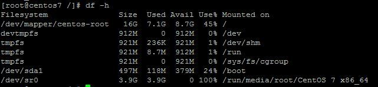

# Linux常见命令

* [返回顶层目录](../../../SUMMARY.md)
* [查看文件](#)
  * [head/tail/sed查看或截取超大文件](#head/tail/sed查看或截取超大文件)
  * [less直接查看超大文件](#less直接查看超大文件)
  * [cat文件内容打印到屏幕](#cat文件内容打印到屏幕)
* [移动/传输文件](#移动/传输文件)
  * [mv移动文件/重命名](#mv移动文件/重命名)
  * [scp本地文件上传到开发机](#scp本地文件上传到开发机)
* [磁盘](#磁盘)
  * [df查看磁盘分区空间](#df查看磁盘分区空间)
  * [du查看当前目录的总大小](#du查看当前目录的总大小)
  * [ln软链接](#ln软链接)
* [权限](#权限)
  * [chmod更改文件权限](#chmod更改文件权限)
  * [chown更改文件拥有者](#chown更改文件拥有者)
* [终端/后台](#终端/后台)
  * [nohup](#nohup)
  * [screen](#screen)
* 过滤
  * [grep关键字查找](#grep关键字查找)


# 查看文件

## head/tail/sed查看或截取超大文件

Linux下打开超大文件方法
在Linux下用VIM打开大小几个G、甚至几十个G的文件时，是非常慢的。

这时，我们可以利用下面的方法分割文件，然后再打开。

1 查看文件的前多少行

```shell
head -10000 /var/lib/mysql/slowquery.log > temp.log
```

上面命令的意思是：把slowquery.log文件前10000行的数据写入到temp.log文件中。

或者查看：

```
head -10000 /var/lib/mysql/slowquery.log
```

2 查看文件的后多少行

```shell
tail -10000 /var/lib/mysql/slowquery.log > temp.log
```

上面命令的意思是：把slowquery.log文件后10000行的数据写入到temp.log文件中。

3 查看文件的几行到几行

```shell
sed -n ‘10,10000p’ /var/lib/mysql/slowquery.log > temp.log
```

上面命令的意思是：把slowquery.log文件第10到10000行的数据写入到temp.log文件中。


参考资料：

* [Linux打开超大文件方法](https://blog.csdn.net/liurwei/article/details/82225245)


## less直接查看超大文件

less 与 more 类似，但使用 less 可以随意浏览文件，而 more 仅能向前移动，却不能向后移动，而且 **less 在查看之前不会加载整个文件**。

```shell
less abc.txt
```

参考资料：

- [Linux less命令](https://www.runoob.com/linux/linux-comm-less.html)


## cat文件内容打印到屏幕

cat 命令用于连接文件并**直接打印到标准输出设备上**。

```shell
cat abc.txt
```

参考资料：

* [Linux cat命令](https://www.runoob.com/linux/linux-comm-cat.html)


# 移动/传输文件

## mv移动文件/重命名

在一些情况下，我们需要将很多个文件同时移动到一个指定的目录下，如果一个一个移动，那太蛋疼了。

今天用man mv查到一个选项-t，是指定目标文件夹，就是我们所要将文件移至的文件夹，很省事儿，分享给大家。

比如当前目录下有a.dir  b.dir   c.dir  1.txt  2.txt  des.dir.我们现在要将a.dir  b.dir   c.dir  1.txt  2.txt这几个文件移动到des.dir 目录下。

执行：

```shell
mv  a.dir  b.dir   c.dir  1.txt  2.txt  -t  des.dir
```

就可以一次将这些文件移动到des.dir下。


参考资料：

* [linux命令mv同时移动多个文件至一个目录](https://jingyan.baidu.com/article/d8072ac4686a1dec95cefd8d.html)


## scp本地文件上传到开发机

```shell
scp /tmp/Anaconda3-2019.03-Linux-x86_64.sh  ml004.dx:/tmp/
```

同样也可以将文件从开发机下载到本地。

# 磁盘

## df查看磁盘分区空间

df 以磁盘分区为单位查看文件系统，可以获取硬盘被占用了多少空间，目前还剩下多少空间等信息。

例如，我们使用df -h命令来查看磁盘信息， -h 选项为根据大小适当显示：



显示内容参数说明：

- **Filesystem**：文件系统
- **Size**： 分区大小
- **Used**： 已使用容量
- **Avail**： 还可以使用的容量
- **Use%**： 已用百分比
- **Mounted on**： 挂载点　


参考资料：

* [Linux 查看磁盘空间](https://www.runoob.com/w3cnote/linux-view-disk-space.html)


## du查看当前目录的总大小

**du** 的英文原义为 **disk usage**，含义为显示磁盘空间的使用情况，用于查看当前目录的总大小。

例如查看当前目录的大小：

```shell
# du -sh
605M    .
```

显示指定文件所占空间：

```shell
# du log2012.log 
300     log2012.log
```

方便阅读的格式显示test目录所占空间情况：

```shell
# du -h test
608K    test/test6
308K    test/test4
4.0K    test/scf/lib
4.0K    test/scf/service/deploy/product
4.0K    test/scf/service/deploy/info
12K     test/scf/service/deploy
16K     test/scf/service
4.0K    test/scf/doc
4.0K    test/scf/bin
32K     test/scf
8.0K    test/test3
1.3M    test
```

du 命令用于查看当前目录的总大小：

- -s：对每个Names参数只给出占用的数据块总数。
- -a：递归地显示指定目录中各文件及子目录中各文件占用的数据块数。若既不指定-s，也不指定-a，则只显示Names中的每一个目录及其中的各子目录所占的磁盘块数。
- -b：以字节为单位列出磁盘空间使用情况（系统默认以k字节为单位）。
- -k：以1024字节为单位列出磁盘空间使用情况。
- -c：最后再加上一个总计（系统默认设置）。
- -l：计算所有的文件大小，对硬链接文件，则计算多次。
- -x：跳过在不同文件系统上的目录不予统计。
- -h：以K，M，G为单位，提高信息的可读性。


**du -h --max-depth=1查看子文件夹大小**

实际上就是超过指定层数（1层）的目录后，予以忽略。


参考资料：

* [Linux 查看磁盘空间](https://www.runoob.com/w3cnote/linux-view-disk-space.html)

## ln软链接

它的功能是为某一个文件在另外一个位置建立一个同步的链接。

当我们需要在不同的目录，用到相同的文件时，我们不需要在每一个需要的目录下都放一个必须相同的文件，我们只要在某个固定的目录，放上该文件，然后在 其它的目录下用ln命令链接（link）它就可以，不必重复的占用磁盘空间。

比如，/data的空间特别大，而当前文件夹data所在的磁盘空间不足，但是还想把文件放在当前文件夹data下，那就可以建一个软连接，看起来是把文件放在data下了，其实文件是存放在/data/lu.wei/dada中的。

```shell
ln -s /data/lu.wei/dada/ data
```

参考资料：

* [Linux ln命令](https://www.runoob.com/linux/linux-comm-ln.html)


# 权限

权限简介：

Linux系统上对文件的权限有着严格的控制，用于如果相对某个文件执行某种操作，必须具有对应的权限方可执行成功。这也是Linux有别于Windows的机制，也是基于这个权限机智，Linux可以有效防止病毒自我运行，因为运行的条件是必须要有运行的权限，而这个权限在Linux是用户所赋予的。

Linux的文件权限有以下设定：

* Linux下文件的权限类型一般包括读，写，执行。对应字母为 r、w、x。
* Linux下权限的粒度有 拥有者(**U**ser)、群组(**G**roup)、其它以外的人(**O**thers)三种(这三种均为所有人**A**ll)。每个文件都可以针对三个粒度，设置不同的rwx(读写执行)权限。
* 通常情况下，一个文件只能归属于一个用户和组， 如果其它的用户想有这个文件的权限，则可以将该用户加入具备权限的群组，一个用户可以同时归属于多个组。

## chmod更改文件权限

Linux上通常使用chmod命令对文件的权限进行设置和更改。

使用格式

```shell
chmod [可选项] <mode> <file...>
```

```shell
参数说明：
 
[可选项]
  -c, --changes          like verbose but report only when a change is made (若该档案权限确实已经更改，才显示其更改动作)
  -f, --silent, --quiet  suppress most error messages  （若该档案权限无法被更改也不要显示错误讯息）
  -v, --verbose          output a diagnostic for every file processed（显示权限变更的详细资料）
       --no-preserve-root  do not treat '/' specially (the default)
       --preserve-root    fail to operate recursively on '/'
       --reference=RFILE  use RFILE's mode instead of MODE values
  -R, --recursive        change files and directories recursively （以递归的方式对目前目录下的所有档案与子目录进行相同的权限变更)
       --help		显示此帮助信息
       --version		显示版本信息
[mode] 
    权限设定字串，详细格式如下 ：
    [ugoa...][[+-=][rwxX]...][,...]，
    其中
    [ugoa...]
    u 表示该档案的拥有者，g 表示与该档案的拥有者属于同一个群体(group)者，o 表示其他以外的人，a 表示所有（包含上面三者）。
    [+-=]
    + 表示增加权限，- 表示取消权限，= 表示唯一设定权限。
    [rwxX]
    r 表示可读取，w 表示可写入，x 表示可执行，X 表示只有当该档案是个子目录或者该档案已经被设定过为可执行。
 	
[file...]
    文件列表（单个或者多个文件、文件夹）
```

范例：

设置所有用户可读取文件 a.conf

```shell
chmod ugo+r a.conf
或 
chmod a+r  a.conf
```

设置 c.sh 只有 拥有者可以读写及执行

```shell
chmod u+rwx c.sh
```

设置文件 a.conf 与 b.xml 权限为拥有者与其所属同一个群组 可读写，其它组可读不可写

```shell
chmod a+r,ug+w,o-w a.conf b.xml
```

设置当前目录下的所有档案与子目录皆设为任何人可读写

```shell
chmod -R a+rw *
```

**数字权限使用格式：**

在这种使用方式中，首先我们需要了解数字如何表示权限。 首先，我们规定 数字 4 、2 和 1表示读、写、执行权限（具体原因可见下节权限详解内容），即**r=4，w=2，x=1**。此时其他的权限组合也可以用其他的八进制数字表示出来，

如：

```shell
rwx = 4 + 2 + 1 = 7
rw = 4 + 2 = 6
rx = 4 +1 = 5
```

即

* 若要同时设置 rwx (可读写运行） 权限则将该权限位 设置 为 4 + 2 + 1 = 7

* 若要同时设置 rw- （可读写不可运行）权限则将该权限位 设置 为 4 + 2 = 6

* 若要同时设置 r-x （可读可运行不可写）权限则将该权限位 设置 为 4 +1 = 5

由上可以得出，每个属组的所有的权限都可以用一位八进制数表示，每个数字都代表了不同的权限（权值）。如 最高的权限为是7，代表可读，可写，可执行。

故如果我们将每个属组的权限都用八进制数表示，则文件的权限可以表示为三位八进制数

```shell
-rw------- =  600
-rw-rw-rw- =  666
-rwxrwxrwx =  777
```

上面我们提到，每个文件都可以针对三个粒度，设置不同的rwx(读写执行)权限。即我们可以用用三个8进制数字分别表示 拥有者 、群组 、其它组( u、 g 、o)的权限详情，并用chmod直接加三个8进制数字的方式直接改变文件权限。语法格式为：

```shell
chmod <abc> file...
```

其中

>a,b,c各为一个数字，分别代表User、Group、及Other的权限。
>
>相当于简化版的
>
>chmod u=权限, g=权限, o=权限 file...
>
>而此处的权限将用8进制的数字来表示User、Group、及Other的读、写、执行权限

范例：

* 设置所有人可以读写及执行

```shell
chmod 777 file  
# 等价于  chmod u=rwx,g=rwx,o=rwx file 或  chmod a=rwx file
```

设置拥有者可读写，其他人不可读写执行

```shell
chmod 600 file
# 等价于  chmod u=rw,g=---,o=--- file 或 chmod u=rw,go-rwx file
```


参考资料：

* [Linux权限详解（chmod、600、644、666、700、711、755、777、4755、6755、7755）](https://blog.csdn.net/u013197629/article/details/73608613)

## chown更改文件拥有者

linux/Unix 是多人多工作业系统，每个的文件都有拥有者（所有者），如果我们想变更文件的拥有者（利用 chown 将文件拥有者加以改变），**一般只有系统管理员(root)拥有此操作权限**，而普通用户则没有权限将自己或者别人的文件的拥有者设置为别人。

范例：

设置文件 d.key、e.scrt的拥有者设为 users 群体的 tom

```shell
chown tom:users file d.key e.scrt
```

设置当前目录下与子目录下的所有文件的拥有者为 users 群体的 James

```shell
chown -R James:users  *
```


参考资料：

- [Linux权限详解（chmod、600、644、666、700、711、755、777、4755、6755、7755）](https://blog.csdn.net/u013197629/article/details/73608613)


# 终端/后台

## nohup

后台运行

```shell
nohup python -u xxx.py 1>./log.txt 2>&1 &
```

python需要加-u，这样才会使得所有输出到输出到log里。

## screen

在VPS中执行一些非常耗时的任务时（如下载，压缩，解压缩，编译，安装等），我们通常是单独开一个远程终端窗口来执行这个任务，且在任务执行过程中不能关闭这个窗口或者中断连接，否则正在执行的任务会被终止掉。而有了screen，我们可以在一个窗口中安装程序，然后在另一个窗口中下载文件，再在第三个窗口中编译程序，只需要一个SSH连接就可以同时执行这三个任务，还可以方便的在不同会话或窗口中切换，即使因为意外导致窗口关闭或者连接中断，也不会影响这三个任务的执行。

screen的说明相当复杂，反正我是看得头晕了。但事实上，我们只需要掌握下面五个命令就足够我们使用了：

* 创建一个名为test1的会话

```shell
screen -S test1
```

* 进入test1后输入下面的命令，退出test1会话，但会话中的任务会继续执行

```shell
screen -d
or
press Ctrl-A 和 D
```

* 列出所有会话

```shell
screen -ls
```

* 恢复名为test1的会话

```shell
screen -r test1
or
screen -r pid(number)
```

* 退出并彻底关闭当前窗口，会话中的任务也会被关闭

```shell
exit
or
Ctrl+D
```


参考资料：

* [screen 命令使用及示例](https://linux.cn/article-8215-1.html)
* [linux文件权限查看及修改-chmod ------入门的一些常识](https://blog.csdn.net/haydenwang8287/article/details/1753883)


# 过滤

## grep关键字查找

从文件abc.txt中查找含有xxx字符串的行

```shell
grep "xxx" abc.txt
```

# 定时任务

## crontab定时运行

Linux crontab是用来定期执行程序的命令。

当安装完成操作系统之后，默认便会启动此任务调度命令。

crond命令每分锺会定期检查是否有要执行的工作，如果有要执行的工作便会自动执行该工作。

而linux任务调度的工作主要分为以下两类：

- 1、系统执行的工作：系统周期性所要执行的工作，如备份系统数据、清理缓存
- 2、个人执行的工作：某个用户定期要做的工作，例如每隔10分钟检查邮件服务器是否有新信，这些工作可由每个用户自行设置

**语法**：

```shell
crontab [ -u user ] { -l | -r | -e }
```

**说明：**

crontab 是用来让使用者在固定时间或固定间隔执行程序之用，换句话说，也就是类似使用者的时程表。

-u user 是指设定指定 user 的时程表，这个前提是你必须要有其权限(比如说是 root)才能够指定他人的时程表。如果不使用 -u user 的话，就是表示设定自己的时程表。

**参数说明**：

- -e : 执行文字编辑器来设定时程表，内定的文字编辑器是 VI，如果你想用别的文字编辑器，则请先设定 VISUAL 环境变数来指定使用那个文字编辑器(比如说 setenv VISUAL joe)
- -r : 删除目前的时程表
- -l : 列出目前的时程表

时程表的格式如下：

```shell
f1 f2 f3 f4 f5 program
```

- 其中 f1 是表示分钟，f2 表示小时，f3 表示一个月份中的第几日，f4 表示月份，f5 表示一个星期中的第几天。program 表示要执行的程序。
- 当 f1 为 * 时表示每分钟都要执行 program，f2 为 * 时表示每小时都要执行程序，其余类推
- 当 f1 为 a-b 时表示从第 a 分钟到第 b 分钟这段时间内要执行，f2 为 a-b 时表示从第 a 到第 b 小时都要执行，其余类推
- 当 f1 为 */n 时表示每 n 分钟个时间间隔执行一次，f2 为 */n 表示每 n 小时个时间间隔执行一次，其余类推
- 当 f1 为 a, b, c,... 时表示第 a, b, c,... 分钟要执行，f2 为 a, b, c,... 时表示第 a, b, c...个小时要执行，其余类推

**另一种语法**：

```shell
crontab [ -u user ] file
```

使用者也可以将所有的设定先存放在文件中，用 crontab file 的方式来设定时程表。

举例：

* 每月每天每小时的第 0 分钟执行一次 /bin/ls

  ```shell
  0 * * * * /bin/ls
  ```

* 在 12 月内, 每天的早上 6 点到 12 点，每隔 3 个小时 0 分钟执行一次 /usr/bin/backup

  ```shell
  0 6-12/3 * 12 * /usr/bin/backup
  ```

* 周一到周五每天下午 5:00 寄一封信给 alex@domain.name

  ```shell
  0 17 * * 1-5 mail -s "hi" alex@domain.name < /tmp/maildata
  ```

* 每月每天的午夜 0 点 20 分, 2 点 20 分, 4 点 20 分....执行 echo "haha"

  ```shell
  20 0-23/2 * * * echo "haha"
  ```

**注意：**当程序在你所指定的时间执行后，系统会寄一封信给你，显示该程序执行的内容，若是你不希望收到这样的信，请在每一行空一格之后加上`> /dev/null 2>&1`即可。

**查看log**：

crontab的运行记录在/var/log/cron-201xxxxx中，直接vim打开这个文件，或者可以用tail -f /var/log/cron.log观察。

参考资料：

- [Linux crontab命令](https://www.runoob.com/linux/linux-comm-crontab.html)


