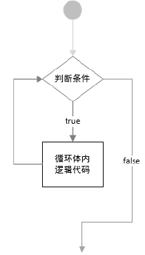

# 过程控制

* [返回顶层目录](../../../SUMMARY.md#目录)
* [返回上层目录](../python.md)
* [if条件判断](#if条件判断)
* [while循环](#while循环)
* [for循环](#for循环)
* [break跳出循环](#break跳出循环)
* [continue跳出本次循环](#continue跳出本次循环)

# if条件判断

条件判断语法格式：

```python
if 条件:
    逻辑代码
else:
    其他逻辑代码
```

注意：条件句后加**冒号:**，这样是为了方便写正则表达式(把代码写在一行)。

```python
'''
if条件判断
'''
age = input("请输入你的年龄：")
age_int = int(age)
if age_int < 18:
    print("不向未成年人销售烟酒！")
else:
    print("请付款！")
print("欢迎下次光临")
```

**多条件判断**

```python
if 条件1:
    逻辑代码1
else if 条件2:
    逻辑代码2
else 条件3:
    逻辑代码3
```

注意，不是else if，是**elif**。

```python
age = input("请输入你的年龄：")
age_int = int(age)
if age_int < 16:
    print("未满16岁，太小了！")
elif age_int < 18:
    print("不向未成年人销售烟酒！")
else:
    print("请付款！")
print("欢迎下次光临")
```

**if嵌套**

```python
fee = input("请缴费50：")
fee = int(fee)
if fee == 50:
    gender = input("是男性吗？(y/n)：")
    if(gender == "y"):
        print("先生，您好！")
    else:
        print("女士，您好！")
    print("缴费成功！")
elif fee < 18:
    print("不向未成年人销售烟酒！")
else:
    print("金额不正确！")
```

# while循环

语法格式：

```python
while 判断条件：
	条件满足，执行语句
```



```python
# 打印数字1到100
num = 1
while num <= 10:
    print(num)
    num += 1
```

# for循环

语法格式：

```python
for 临时变量 in 序列:
	序列中存在待处理元素则进入循环体执行代码
```


```python
# 打印1到10十个数字
for i in range(1,11):
    print(i,end="")
```

# break跳出循环

- while循环中使用break

  ```python
  while条件:
  	break #整个循环结束
  ```

- while循环嵌套中使用break

  ```python
  while条件:
  	代码
  	while 条件:
  		break #只结束内层整个循环
  	代码
  ```

代码

- while循环中使用break

```python
# break跳出它所在的整个循环
# 打印1到20的偶数
i = 1
while i <= 20:
    if i % 2 == 0:
        # 如果这个偶数能被10整除，则跳出循环。
        if i % 10 == 0:
            break
        print(i)
    i += 1
print("*************")
```

- while循环嵌套中使用break

```python
# while循环嵌套，break跳出内层循环
# 打印1到4四个数字，每个数字的上一行都打印与数字相同个数的星号
i = 1
while i < 5:
    j = 0
    while j < i:
        if(j == 3):
            break
        print("*",end="")
        j += 1
    print("")
    print(i)
    i += 1
```

对于for循环，也同样。

总结：break的作用范围只作用于它所在的循环，不影响其他外部循环。

# continue跳出本次循环

continue跳出本次循环，当次循环中continue后的语句将不会被执行，继续执行下一次循环。

- while循环中使用continue

  ```python
  while 条件:
  	if 条件:
  		continue #本次循环结束，后面代码语句不执行
  	代码语句
  ```

- for循环中使用continue

  ```python
  for 变量 in 序列:
  	if 条件:
  		continue #本次循环结束，后面代码语句不执行
  	代码语句
  ```

代码

- while循环中使用continue

```python
# continue 跳出本次while循环
i = 1
while i <= 20:
    i += 1
    if i % 2 == 0:
        if i % 10 == 0:
            continue
        print(i)
print("**********")
```

