# matplotlib

* [返回顶层目录](../../SUMMARY.md#目录)
* [返回上层目录](python.md#python)

# matplotlib简介

matplotlib给python提供了丰富的绘图库，尤其是二维图像绘制。

**官网**：http://matplotlib.org/

**简单介绍**

Python中最著名的绘图系统，很多其他的绘图例如seaborn（针对pandas绘图而来）也是由其封装而成。创世人John Hunter于2012年离世。这个绘图系统操作起来很复杂，和R的ggplot,lattice绘图相比显得望而却步，这也是为什么我个人不丢弃R的原因，虽然调用

```python
plt.style.use("ggplot")
```

绘制的图形可以大致按照ggplot的颜色显示，但是还是感觉很鸡肋。但是matplotlib的复杂给其带来了很强的定制性。其具有面向对象的方式及Pyplot的经典高层封装。

需要掌握的是：

1. 散点图，折线图，条形图，直方图，饼状图，箱形图的绘制。
2. 绘图的三大系统：pyplot，pylab(不推荐)，面向对象
3. 坐标轴的调整，添加文字注释，区域填充，及特殊图形patches的使用
4. 金融的同学注意的是：可以直接调用Yahoo财经数据绘图（真。。。）

Pyplot快速入门：[Pyplot tutorial](http://matplotlib.org/users/pyplot_tutorial.html)

下面就是对官网pyplot快速入门教程的学习记录和翻译。

# 图形的基本绘制

这个已经翻译好了http://blog.csdn.net/qq_31192383/article/details/53977822


```python
import matplotlib.pyplot as plt
plt.plot([1,2,3,4],[5,6,6,4])
plt.ylabel('some numbers')
plt.show()
```

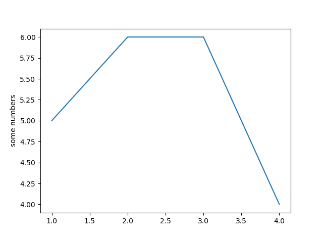


```python
import matplotlib.pyplot as plt
plt.plot([1,2,3,4],[1,2,9,16],'ro')
plt.axis([0,6,0,20])
plt.show()
```

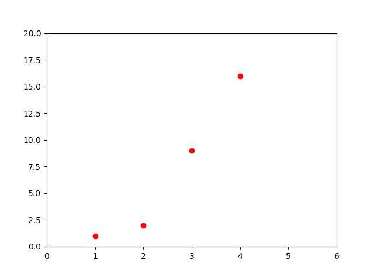


```python
import numpy as np
import matplotlib.pyplot as plt

#x = np.array(range(5))
x = np.arange(0,5,0.25)

plt.plot(x, x, 'r--o', x, x**2, 'b--s', x, x**3, 'g--^')
plt.ylabel('x^n')
plt.xlabel('x')
plt.show()
```

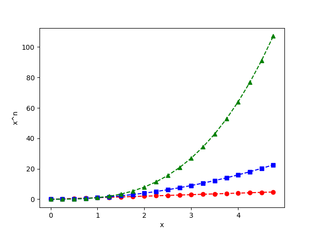


#控制线条的属性


* 使用关键字参数


```python
import numpy as np
import matplotlib.pyplot as plt

#x = np.array(range(5))
x = np.arange(0,5,0.25)

#plt.plot(x, x, 'r--o', x, x**2, 'b--s', x, x**3, 'g--^')
plt.plot(x, x, 'r--o', x, x**2, 'b--s', x, x**3, 'g--^', linewidth = 3.0)
plt.ylabel('x^n')
plt.xlabel('x')
plt.show()
```

和上一张图相比，通过对线宽属性进行设置，即`linewidth = 3.0`，线条明显变粗了。

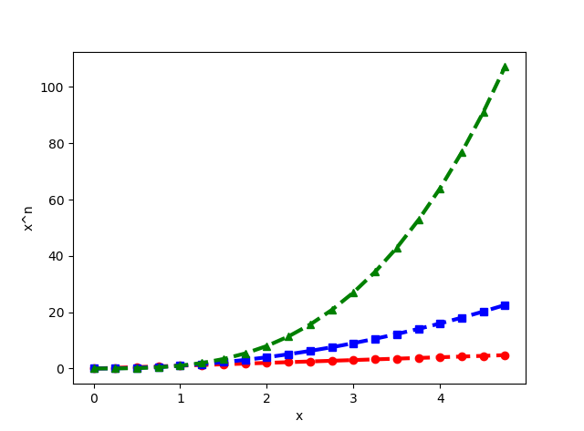

* 通过获得线对象，对线对象进行设置

```python
import numpy as np
import matplotlib.pyplot as plt

#x = np.array(range(5))
x = np.arange(0,5,0.25)

#line1, = plt.plot(x, x, 'r--o')
(line1, line2, line3) = plt.plot(x, x, 'r--o', x, x**2, 'b--s', x, x**3, 'g--^', linewidth = 3.0)
print(type(line1))
#<class 'matplotlib.lines.Line2D'>
line1.set_antialiased(False)
line2.set_linewidth(5)
plt.ylabel('x^n')
plt.xlabel('x')
plt.show()
```

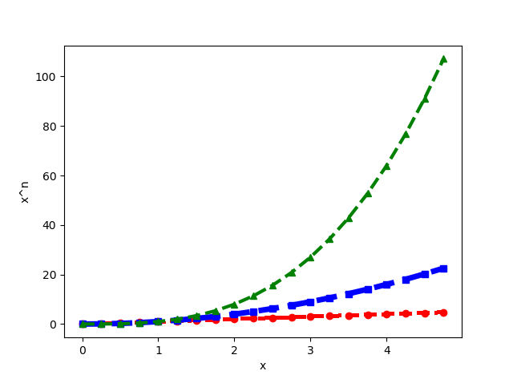


* dads

```python
import numpy as np
import matplotlib.pyplot as plt

#x = np.array(range(5))
x = np.arange(0,5,0.25)

lines = plt.plot(x, x, 'r--o', x, x**2, 'b--s', x, x**3, 'g--^', linewidth = 3.0)
# use keyword args
plt.setp(lines, color = 'r', linewidth = 6.0)
# 很显然，setp函数一次只能对一个线对象设置属性
# or MATLAB style string value pairs
#plt.setp(lines, 'color', 'r', 'linewidth', 6.0)
plt.ylabel('x^n')
plt.xlabel('x')
plt.show()
```

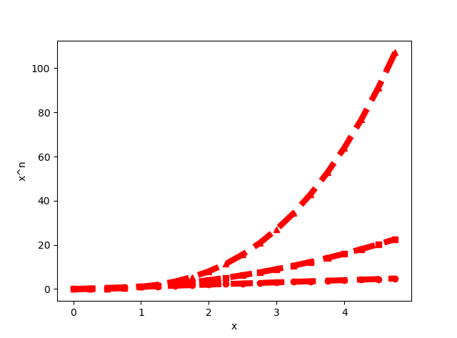


​     同时获取多个线对象，分别使用`plt.setp()`函数设置每个线对象的属性。

```python
import numpy as np
import matplotlib.pyplot as plt

x = np.arange(0,5,0.25)

(line1, line2, line3) = plt.plot(x, x, 'r--o', x, x**2, 'b--s', x, x**3, 'g--^', linewidth = 3.0)
print(type(line1))
#<class 'matplotlib.lines.Line2D'>
plt.setp(line1, color = 'r', lw = 10.0)
plt.setp(line2, color = 'g', linewidth = 7.0)
plt.setp(line3, color = 'b', lw = 4.0)
# 这样通过setup函数就能对所有线对象设置属性了
# or MATLAB style string value pairs
#plt.setp(lines, 'color', 'r', 'linewidth', 6.0)
plt.ylabel('x^n')
plt.xlabel('x')
plt.show()
```

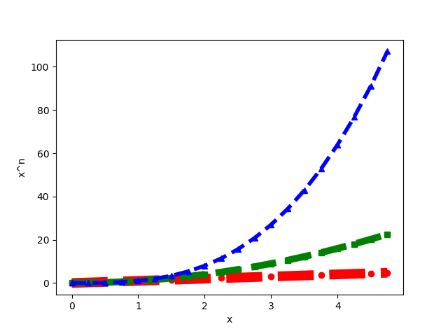


### Line2D线对象的属性

下面是可选的Line2D线对象的属性

|        Property        |                Value Type                |
| :--------------------: | :--------------------------------------: |
|         alpha          |                  float                   |
|        animated        |             [True \| False]              |
|   antialiased or aa    |             [True \| False]              |
|        clip_box        |   a matplotlib.transform.Bbox instance   |
|        clip_on         |             [True \| False]              |
|       clip_path        | a Path instance and a Transform instance, a Patch |
|       color or c       |           any matplotlib color           |
|        contains        |         the hit testing function         |
|     dash_capstyle      |                [`'butt'`                 |
|     dash_joinstyle     |                [`'miter'`                |
|         dashes         |     sequence of on/off ink in points     |
|          data          |     (np.array xdata, np.array ydata)     |
|         figure         |   a matplotlib.figure.Figure instance    |
|         label          |                any string                |
|    linestyle or ls     |                 [ `'-'`                  |
|    linewidth or lw     |          float value in points           |
|          lod           |             [True \| False]              |
|         marker         |                 [ `'+'`                  |
| markeredgecolor or mec |           any matplotlib color           |
| markeredgewidth or mew |          float value in points           |
| markerfacecolor or mfc |           any matplotlib color           |
|    markersize or ms    |                  float                   |
|       markevery        | [ None \| integer \| (startind, stride) ] |
|         picker         |    used in interactive line selection    |
|       pickradius       |      the line pick selection radius      |
|     solid_capstyle     |                [`'butt'`                 |
|    solid_joinstyle     |                [`'miter'`                |
|       transform        | a matplotlib.transforms.Transform instance |
|        visible         |             [True \| False]              |
|         xdata          |                 np.array                 |
|         ydata          |                 np.array                 |
|         zorder         |                any number                |


为了得到可以设置的线对象的属性列表，调用`plt.setp()`函数，该函数以线对象为参数。

```python
import numpy as np
import matplotlib.pyplot as plt

x = np.array([0,1,2,3,4,5])
print(x)
line1, = plt.plot(x, 'or')
print(type(line1))
#<class 'matplotlib.lines.Line2D'>

plt.setp(line1)
```

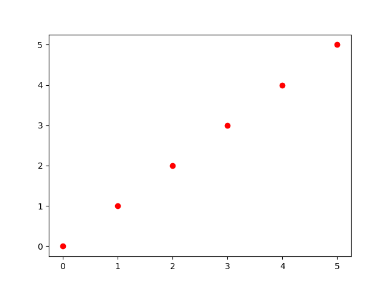


# 绘制多个图像和轴


```python
import matplotlib.pyplot as plt
import numpy as np

def func(t):
    return np.exp(-t)*np.cos(2*np.pi*t)

t1 = np.arange(0,5,0.2)
t2 = np.arange(0,5,0.05)

plt.figure(1)
plt.subplot(211)
plt.plot(t1,func(t1),'bo',t2,func(t2),'k')

plt.subplot(212)
plt.plot(t2,np.cos(2*np.pi*t2),'r--')
plt.show()
```

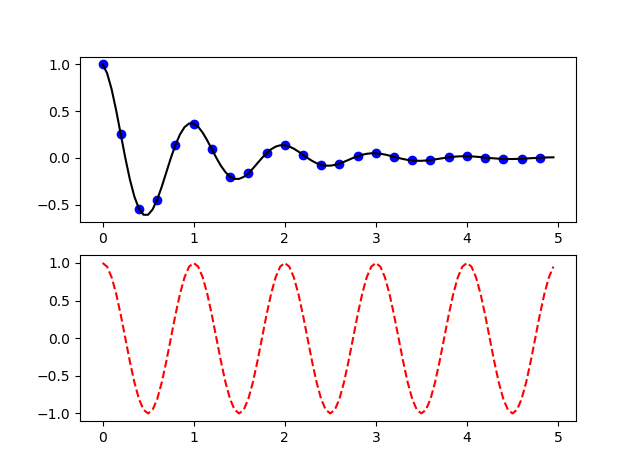


```python
import matplotlib.pyplot as plt

plt.figure(1)               # the first figure
plt.subplot(211)            # the first subplot in the first figure
plt.plot([1,2,3])
plt.subplot(212)            # the second subplot in tthe first figure
plt.plot([4,5,6])

plt.figure(2)               # a second figure
plt.plot([4,5,6])

plt.figure(1)               # figure 1 current; ubplot(212) still current
plt.subplot(211)            # make subplot(211) in figure1 current
plt.title("Easy as 1, 2, 3")# subplot 211 tittle

plt.show()
```

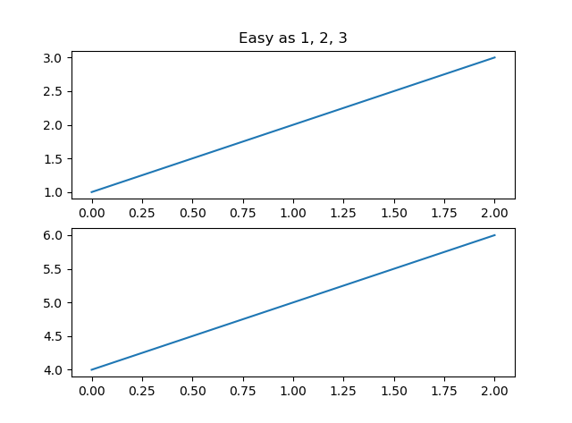

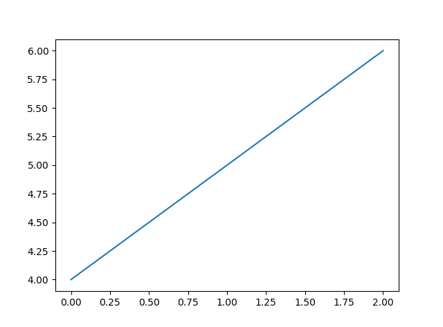


```python
import numpy as np
import matplotlib.pyplot as plt

# Fixing random state for reproducibility
np.random.seed(19680801)

mu, sigma = 100, 15
x = mu + sigma * np.random.randn(10000)

# the histogram of the data
n, bins, patches = plt.hist(x, bins=10, normed=1, facecolor='g', edgecolor='k', alpha=0.75, histtype='bar')
#hist的参数非常多，但常用的就这六个，只有第一个是必须的，后面六个可选
#x: 需要计算直方图的一维数组
#bins: 直方图的柱数，可选项，默认为10，可不写bins=10,直接在x后面写10
#normed: 是否将得到的直方图向量归一化。默认为0
#facecolor: 直方图颜色
#edgecolor: 直方图边框颜色
#alpha: 透明度
#histtype: 直方图类型，‘bar’, ‘barstacked’, ‘step’, ‘stepfilled’
#返回值：
#n: 直方图向量，是否归一化由参数normed设定
#bins: 返回各个bin的区间范围
#patches: 返回每个bin里面包含的数据，是一个list
print(n)#直方图的y值向量，是否归一化由参数normed决定
#[  1.28221796e-04   9.14648810e-04   5.06048687e-03   1.65919004e-02
#   2.51229239e-02   2.27209022e-02   1.13262586e-02   3.09441934e-03
#   4.87242824e-04   3.41924789e-05]
print(bins)#返回各个bin的区间范围
#[  43.48262893   55.18110804   66.87958716   78.57806627   90.27654539
#  101.97502451  113.67350362  125.37198274  137.07046185  148.76894097
#  160.46742008]
print(patches)#返回每一个bin里包含的数据，是一个list
#<a list of 10 Patch objects>
print(type(patches))
#<class 'matplotlib.cbook.silent_list'>

plt.xlabel('Smarts')
plt.ylabel('Probability')
plt.title('Histogram of IQ')
plt.text(60, .025, r'$\mu=100,\ \sigma=15$')
plt.axis([40, 160, 0, 0.03])
plt.grid(True)
plt.show()
```

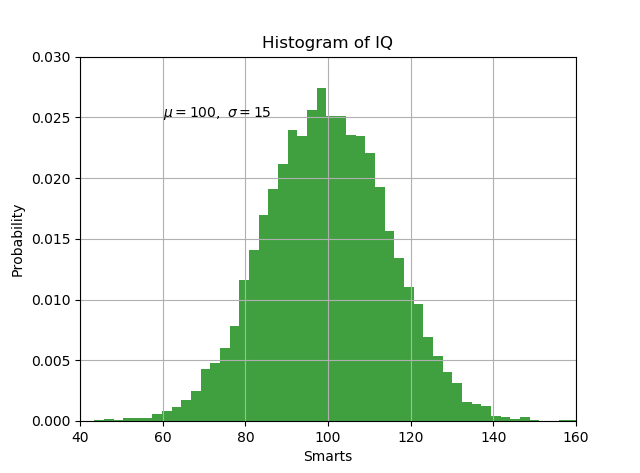


# 支持的颜色和线型

http://blog.csdn.net/mmc2015/article/details/47746195

如果颜色不显示指出，则默认循环使用不同的颜色，

## 支持的颜色

| character |  color  |
| :-------: | :-----: |
|    ‘b’    |  blue   |
|    ‘g’    |  green  |
|    ‘r’    |   red   |
|    ‘c’    |  cyan   |
|    ‘m’    | magenta |
|    ‘y’    | yellow  |
|    ‘k’    |  black  |
|    ‘w’    |  white  |

## 支持的线型

| character |      description      |
| :-------: | :-------------------: |
|   `'-'`   |   solid line style    |
|  `'--'`   |   dashed line style   |
|  `'-.'`   |  dash-dot line style  |
|   `':'`   |   dotted line style   |
|   `'.'`   |     point marker      |
|   `','`   |     pixel marker      |
|   `'o'`   |     circle marker     |
|   `'v'`   | triangle_down marker  |
|   `'^'`   |  triangle_up marker   |
|   `'<'`   | triangle_left marker  |
|   `'>'`   | triangle_right marker |
|   `'1'`   |    tri_down marker    |
|   `'2'`   |     tri_up marker     |
|   `'3'`   |    tri_left marker    |
|   `'4'`   |   tri_right marker    |
|   `'s'`   |     square marker     |
|   `'p'`   |    pentagon marker    |
|   `'*'`   |      star marker      |
|   `'h'`   |    hexagon1 marker    |
|   `'H'`   |    hexagon2 marker    |
|   `'+'`   |      plus marker      |
|   `'x'`   |       x marker        |
|   `'D'`   |    diamond marker     |
|   `'d'`   |  thin_diamond marker  |
|   `'|'`   |     vline marker      |
|   `'_'`   |     hline marker      |

## line2D参数

The kwargs are `Line2D` properties：

|                 Property                 |               Description                |
| :--------------------------------------: | :--------------------------------------: |
| [`agg_filter`](http://matplotlib.org/api/artist_api.html#matplotlib.artist.Artist.set_agg_filter) |                 unknown                  |
| [`alpha`](http://matplotlib.org/api/artist_api.html#matplotlib.artist.Artist.set_alpha) | float (0.0 transparent through 1.0 opaque) |
| [`animated`](http://matplotlib.org/api/artist_api.html#matplotlib.artist.Artist.set_animated) |             [True \| False]              |
| [`antialiased`](http://matplotlib.org/api/lines_api.html#matplotlib.lines.Line2D.set_antialiased) or aa |             [True \| False]              |
| [`axes`](http://matplotlib.org/api/lines_api.html#matplotlib.lines.Line2D.set_axes) | an [`Axes`](http://matplotlib.org/api/axes_api.html#matplotlib.axes.Axes) instance |
| [`clip_box`](http://matplotlib.org/api/artist_api.html#matplotlib.artist.Artist.set_clip_box) | a [`matplotlib.transforms.Bbox`](http://matplotlib.org/devel/transformations.html#matplotlib.transforms.Bbox) instance |
| [`clip_on`](http://matplotlib.org/api/artist_api.html#matplotlib.artist.Artist.set_clip_on) |             [True \| False]              |
| [`clip_path`](http://matplotlib.org/api/artist_api.html#matplotlib.artist.Artist.set_clip_path) | [ ([`Path`](http://matplotlib.org/api/path_api.html#matplotlib.path.Path), [`Transform`](http://matplotlib.org/devel/transformations.html#matplotlib.transforms.Transform)) |
| [`color`](http://matplotlib.org/api/lines_api.html#matplotlib.lines.Line2D.set_color) or c |           any matplotlib color           |
| [`contains`](http://matplotlib.org/api/artist_api.html#matplotlib.artist.Artist.set_contains) |           a callable function            |
| [`dash_capstyle`](http://matplotlib.org/api/lines_api.html#matplotlib.lines.Line2D.set_dash_capstyle) |   [‘butt’ \| ‘round’ \| ‘projecting’]    |
| [`dash_joinstyle`](http://matplotlib.org/api/lines_api.html#matplotlib.lines.Line2D.set_dash_joinstyle) |     [‘miter’ \| ‘round’ \| ‘bevel’]      |
| [`dashes`](http://matplotlib.org/api/lines_api.html#matplotlib.lines.Line2D.set_dashes) |     sequence of on/off ink in points     |
| [`drawstyle`](http://matplotlib.org/api/lines_api.html#matplotlib.lines.Line2D.set_drawstyle) | [‘default’ \| ‘steps’ \| ‘steps-pre’ \| ‘steps-mid’ \| ‘steps-post’] |
| [`figure`](http://matplotlib.org/api/artist_api.html#matplotlib.artist.Artist.set_figure) | a [`matplotlib.figure.Figure`](http://matplotlib.org/api/figure_api.html#matplotlib.figure.Figure) instance |
| [`fillstyle`](http://matplotlib.org/api/lines_api.html#matplotlib.lines.Line2D.set_fillstyle) | [‘full’ \| ‘left’ \| ‘right’ \| ‘bottom’ \| ‘top’ \| ‘none’] |
| [`gid`](http://matplotlib.org/api/artist_api.html#matplotlib.artist.Artist.set_gid) |               an id string               |
| [`label`](http://matplotlib.org/api/artist_api.html#matplotlib.artist.Artist.set_label) | string or anything printable with ‘%s’ conversion. |
| [`linestyle`](http://matplotlib.org/api/lines_api.html#matplotlib.lines.Line2D.set_linestyle) or ls |                  [`'-'`                  |
| [`linewidth`](http://matplotlib.org/api/lines_api.html#matplotlib.lines.Line2D.set_linewidth) or lw |          float value in points           |
| [`lod`](http://matplotlib.org/api/artist_api.html#matplotlib.artist.Artist.set_lod) |             [True \| False]              |
| [`marker`](http://matplotlib.org/api/lines_api.html#matplotlib.lines.Line2D.set_marker) | [`A valid marker style`](http://matplotlib.org/api/markers_api.html#module-matplotlib.markers) |
| [`markeredgecolor`](http://matplotlib.org/api/lines_api.html#matplotlib.lines.Line2D.set_markeredgecolor) or mec |           any matplotlib color           |
| [`markeredgewidth`](http://matplotlib.org/api/lines_api.html#matplotlib.lines.Line2D.set_markeredgewidth) or mew |          float value in points           |
| [`markerfacecolor`](http://matplotlib.org/api/lines_api.html#matplotlib.lines.Line2D.set_markerfacecolor) or mfc |           any matplotlib color           |
| [`markerfacecoloralt`](http://matplotlib.org/api/lines_api.html#matplotlib.lines.Line2D.set_markerfacecoloralt) or mfcalt |           any matplotlib color           |
| [`markersize`](http://matplotlib.org/api/lines_api.html#matplotlib.lines.Line2D.set_markersize) or ms |                  float                   |
| [`markevery`](http://matplotlib.org/api/lines_api.html#matplotlib.lines.Line2D.set_markevery) | [None \| int \| length-2 tuple of int \| slice \| list/array of int \| float \| length-2 tuple of float] |
| [`path_effects`](http://matplotlib.org/api/artist_api.html#matplotlib.artist.Artist.set_path_effects) |                 unknown                  |
| [`picker`](http://matplotlib.org/api/lines_api.html#matplotlib.lines.Line2D.set_picker) | float distance in points or callable pick function `fn(artist, event)` |
| [`pickradius`](http://matplotlib.org/api/lines_api.html#matplotlib.lines.Line2D.set_pickradius) |         float distance in points         |
| [`rasterized`](http://matplotlib.org/api/artist_api.html#matplotlib.artist.Artist.set_rasterized) |         [True \| False \| None]          |
| [`sketch_params`](http://matplotlib.org/api/artist_api.html#matplotlib.artist.Artist.set_sketch_params) |                 unknown                  |
| [`snap`](http://matplotlib.org/api/artist_api.html#matplotlib.artist.Artist.set_snap) |                 unknown                  |
| [`solid_capstyle`](http://matplotlib.org/api/lines_api.html#matplotlib.lines.Line2D.set_solid_capstyle) |   [‘butt’ \| ‘round’ \| ‘projecting’]    |
| [`solid_joinstyle`](http://matplotlib.org/api/lines_api.html#matplotlib.lines.Line2D.set_solid_joinstyle) |     [‘miter’ \| ‘round’ \| ‘bevel’]      |
| [`transform`](http://matplotlib.org/api/lines_api.html#matplotlib.lines.Line2D.set_transform) | a [`matplotlib.transforms.Transform`](http://matplotlib.org/devel/transformations.html#matplotlib.transforms.Transform) instance |
| [`url`](http://matplotlib.org/api/artist_api.html#matplotlib.artist.Artist.set_url) |               a url string               |
| [`visible`](http://matplotlib.org/api/artist_api.html#matplotlib.artist.Artist.set_visible) |             [True \| False]              |
| [`xdata`](http://matplotlib.org/api/lines_api.html#matplotlib.lines.Line2D.set_xdata) |                 1D array                 |
| [`ydata`](http://matplotlib.org/api/lines_api.html#matplotlib.lines.Line2D.set_ydata) |                 1D array                 |
| [`zorder`](http://matplotlib.org/api/artist_api.html#matplotlib.artist.Artist.set_zorder) |                any number                |


# Python--matplotlib绘图可视化知识点整理

http://blog.csdn.net/panda1234lee/article/details/52311593


# 参考资料

- [如何系统地学习Python 中 matplotlib, numpy, scipy, pandas？](https://www.zhihu.com/question/37180159)

matplotlib简介中的简单介绍就是复制的这里。