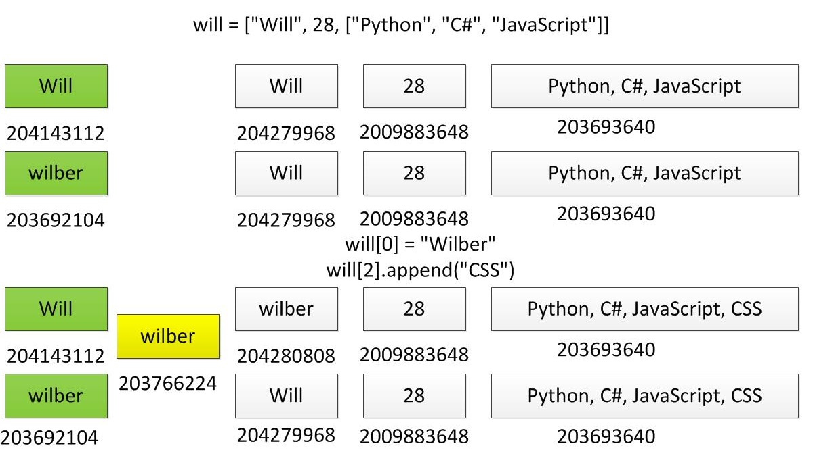
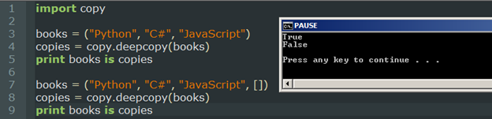

# python语法

* [返回顶层目录](../../SUMMARY.md#目录)
* [返回上层目录](python.md#python)
* [01基础语法](#01基础语法)
  * [第一个python程序](#第一个python程序)
  * [注释](#注释)
  * [变量类型](#变量类型)
  * [输入输出](#输入输出)
  * [格式化符号](#格式化符号)
  * [类型转换](#类型转换)
  * [变量名、命名规则、关键字](#变量名、命名规则、关键字)
  * [运算符](#运算符)
  * [if条件判断](#if条件判断)
* [02循环、字符串、列表](#02循环、字符串、列表)
  * [while循环](#while循环)
  * [for循环](#for循环)
  * [break跳出循环](#break跳出循环)
  * [continue跳出本次循环](#continue跳出本次循环)
  * [range()函数](#range()函数)
  * [字符串操作](#字符串操作)
  * [列表](#列表)
* [03元组、字典、函数（上）](#03元组、字典、函数（上）)
  * [元组](#元组)
  * [字典](#字典)
  * [集合set](#集合set)
  * [函数](#函数)
  * [字符串常用内置方法](#字符串常用内置方法)
* [04函数（下）](#04函数（下）)
  * [局部变量、全局变量](#局部变量、全局变量)
  * [函数缺省参数、不定长参数、命名参数](#函数缺省参数、不定长参数、命名参数)
  * [递归函数及应用](#递归函数及应用)
  * [匿名函数及应用](#匿名函数及应用)
* [05文件操作、面向对象](#05文件操作、面向对象)
  * [日期和时间](#日期和时间)
  * [文件操作](#文件操作)
  * [文件夹操作](#文件夹操作)
  * [JSON格式文件操作](#JSON格式文件操作)
  * [CSV格式文件操作](#CSV格式文件操作)
  * [面向对象编程](#面向对象编程)
* [06面向对象（中）](#06面向对象（中）)
  * [类的构造方法](#类的构造方法)
  * [类的访问权限](#类的访问权限)
  * [继承](#继承)
  * [多态](#多态)
  * [引用其他.py文件中的类](#引用其他.py文件中的类)
* [07对象（下）、异常处理、模块](#07对象（下）、异常处理、模块)
  * [类属性](#类属性)
  * [类方法、静态方法](#类方法、静态方法)
  * [单例类](#单例类)
  * [异常处理](#异常处理)
  * [包和模块](#包和模块)
* [08正则表达](#08正则表达)
  * [re模块的使用](#re模块的使用)
  * [字符匹配、数量表示、边界表示](#字符匹配、数量表示、边界表示)
    * [字符匹配](#字符匹配)
    * [数量表示](#数量表示)
    * [边界表示](#边界表示)
  * [正则表达式的高级用法](#正则表达式的高级用法)
  * [贪婪与非贪婪模式](#贪婪与非贪婪模式)
* [09排序算法](#排序算法)
  * [冒泡排序](#冒泡排序)
  * [选择排序](#选择排序)
  * [快速排序](#快速排序)
  * [归并排序](#归并排序)


# 01基础语法

## 第一个python程序

在开始的搜索框中输入cmd，打开cmd命令窗口，然后输入python，进入python


打印“hello,world!”：

```
print("hello,world!")
```

退出python：


```
exit()
```


工欲善其事，必先利其器，我们使用**pycharm**作为我们的开发环境。当然你也可以用spyder(anaconda自带)。

## 注释

- 单行注释
  - 以#开头，只注释一行
  - 快捷键ctrl+/

```python
#单行注释，打印hello world
print("hello,world!")
```

- 多行注释
  - '''注释内容'''，实现多行注释

```python
'''
多行注释，打印hello world
'''
print("hello,world!")
```

## 变量类型

比C语言主要多了列表、元组、字典这三种类型。


注意：

- Boolean类型的True和False首字母要大写。
- python不需要指定变量类型，其解释器会根据变量值来判断是什么类型。

**查看变量类型**

```
name = "zhangsan"
age = 28
print(type(name))
print(type(age))
```

输出为

```
<class 'str'>
<class 'int'>
```

## 输入输出

- 输入input()

```python
# 输入
name = input("请输入用户名：")
password = input("请输入密码：")
print(name)
print(password)
```

注意：接收的类型都是默认字符串"str"类型。

- print输出
  - 直接输出内容
  - 输出单个和多个变量
  - 格式化输出
  - format输出，可免去定义格式

```python
# 直接输出内容
print("luwei,28")
name = "luwei"
age = 28
# 输出单个和多个变量
print(name,age)
# 格式化输出
print("你的名字是：%s"%name)
print("你的年龄是：%d"%age)
print("name:%s,age:%d"%(name,age))#一行输出多个变量
# format输出
print("name:{},age:{}".format(name,age))#可免去定义格式
```

- 无换行输出
  - 加end=""
- 换行输出
  - 加\n

```python
name = "luwei"
age = 28
# 无换行输出，加end=""
print("你的名字是：%s "%name,end="")
print("你的年龄是：%d"%age)
# 换行输出，加\n
print("name:%s\nage:%d"%(name,age))
```

## 格式化符号


**浮点数精度显示控制**

```python
percent = 99.99
print("你战胜了全国%.2f%%的用户"%percent)
```

在格式化输出的时候**%**是特殊字符，表示转换说明符，如果想打印普通的%，那么要使用%%来表示。

## 类型转换


特别的，其中eval()会根据你所需要的数据类型来自动转换。

```python
name = input("请输入姓名：")
age = input("请输入年龄：")
print("name:%s,age:%d"%(name,int(age)))
print("name:%s,age:%d"%(name,eval(age)))
```

## 变量名、命名规则、关键字

- 变量名

  - 区分大小写
  - 字母、数字、下划线组成，但是不能以数字开头

- 命名规则

  - 见名知意，如name
  - 驼峰命名法，如：类名(UserInfo)、异常名(ValueError)
  - 小写字符+下划线，如变量名(user_name)、函数名(get_name())

- 关键字

  - 在python内部具有特殊功能的标识符

  - 通过keyword模块的kwlist函数查看

  - ```python
    import keyword as kw
    print(kw.kwlist)
    ```

## 运算符

- 算数运算符
  - +，加
  - -，减
  - *，乘
  - /，除
  - %，取余，10%3=1
  - **，幂次方
  - //，取整，返回商的整数部分，10//3=3
- 比较运算符
  - ==，等于
  - !=，不等于
  - \>，大于
  - \<，小于
  - \>=，大于等于
  - <=，小于等于
- 赋值运算符
  - =，赋值运算符
  - +=，自加
  - -=，自减
  - *=，自乘
  - /=，自除
  - %=，自取余
  - **=，自幂次方
  - //=，自取整
- 逻辑运算
  - and， x and y，与
  - or，x or y，或
  - not，not x，非

**运算符的优先级**


## if条件判断

条件判断语法格式：

```python
if 条件:
    逻辑代码
else:
    其他逻辑代码
```

注意：条件句后加**冒号:**，这样是为了方便写正则表达式(把代码写在一行)。

```python
'''
if条件判断
'''
age = input("请输入你的年龄：")
age_int = int(age)
if age_int < 18:
    print("不向未成年人销售烟酒！")
else:
    print("请付款！")
print("欢迎下次光临")
```

**多条件判断**

```python
if 条件1:
    逻辑代码1
else if 条件2:
    逻辑代码2
else 条件3:
    逻辑代码3
```

注意，不是else if，是**elif**。

```python
age = input("请输入你的年龄：")
age_int = int(age)
if age_int < 16:
    print("未满16岁，太小了！")
elif age_int < 18:
    print("不向未成年人销售烟酒！")
else:
    print("请付款！")
print("欢迎下次光临")
```

**if嵌套**

```python
fee = input("请缴费50：")
fee = int(fee)
if fee == 50:
    gender = input("是男性吗？(y/n)：")
    if(gender == "y"):
        print("先生，您好！")
    else:
        print("女士，您好！")
    print("缴费成功！")
elif fee < 18:
    print("不向未成年人销售烟酒！")
else:
    print("金额不正确！")
```

# 02循环、字符串、列表

## while循环

语法格式：

```python
while 判断条件：
	条件满足，执行语句
```


```python
# 打印数字1到100
num = 1
while num <= 10:
    print(num)
    num += 1
```

## for循环

语法格式：

```python
for 临时变量 in 序列:
	序列中存在待处理元素则进入循环体执行代码
```


```python
# 打印1到10十个数字
for i in range(1,11):
    print(i,end="")
```

## break跳出循环

- while循环中使用break

  ```python
  while条件:
  	break #整个循环结束
  ```

- while循环嵌套中使用break

  ```python
  while条件:
  	代码
  	while 条件:
  		break #只结束内层整个循环
  	代码
  ```

代码

- while循环中使用break

```python
# break跳出它所在的整个循环
# 打印1到20的偶数
i = 1
while i <= 20:
    if i % 2 == 0:
        # 如果这个偶数能被10整除，则跳出循环。
        if i % 10 == 0:
            break
        print(i)
    i += 1
print("*************")
```

- while循环嵌套中使用break

```python
# while循环嵌套，break跳出内层循环
# 打印1到4四个数字，每个数字的上一行都打印与数字相同个数的星号
i = 1
while i < 5:
    j = 0
    while j < i:
        if(j == 3):
            break
        print("*",end="")
        j += 1
    print("")
    print(i)
    i += 1
```

对于for循环，也同样。

总结：break的作用范围只作用于它所在的循环，不影响其他外部循环。

## continue跳出本次循环

continue跳出本次循环，当次循环中continue后的语句将不会被执行，继续执行下一次循环。

- while循环中使用continue

  ```python
  while 条件:
  	if 条件:
  		continue #本次循环结束，后面代码语句不执行
  	代码语句
  ```

- for循环中使用continue

  ```python
  for 变量 in 序列:
  	if 条件:
  		continue #本次循环结束，后面代码语句不执行
  	代码语句
  ```

代码

- while循环中使用continue

```python
# continue 跳出本次while循环
i = 1
while i <= 20:
    i += 1
    if i % 2 == 0:
        if i % 10 == 0:
            continue
        print(i)
print("**********")
```

## range()函数

range(开始，结束)，返回一个序列，**左闭右开**

```python
for i in range(10): #等价于range(0,10)
	print(i)
```

range(开始，结束，步长)

```python
# 打印0到10的偶数
for i in range(0,11,2):
	print(i)
```

## 字符串操作

- 字符串变量定义

  s = "hello"

  s = 'hello'

- 组成字符串的方式

  - 使用“+”将两个字符串连接成一个新的字符串
  - 组成字符串格式化符号

- 下标hello[01234]

  - 通过下标获取指定位置的字符，string_name[index]

- 切片

  - 切片的语法：string_name[起始:结束:步长]

代码

- 基本操作

```python
s = "hello"
# 通过交表获取指定位置元素
print(s[1])
# 获取字符串长度
print(len(s))
# 循环遍历字符串
for i in range(0,len(s)):
    print(s[i],end="")
print("")
# 脚标 用负数表示倒着数
print(s[-1])# 倒数第一个
print(s[-2])# 倒数第二个
```

### 切片

- 基本操作

```python
# 切片
# 注意：切片切出来的字符串是左闭右开的
line = "zhangsan,20"
name = line[0:8:1]
print(name)
age = line[9::1]# 截取到最后，可以不加结束序号
print(age)
```

- 切片步长

```python
# 切片步长
s = "abcde"
print(s[1:])# bcde
print(s[1:-1])# bcd
print(s[1:-2])# bc
# 隔一个位置取一个元素
print(s[0::2])# 等价于
print(s[::2])# ace
```

## 列表

可理解为柜子，柜子里有不同的抽屉，可存储不同类型的值。

- 可存储相同或者不同类型数据的集合

- 列表定义

  - name_list = ["zhangsan","lisi","wangwu"]

- 顺序存储，可通过下标获取内部元素

  name_list[0]

  name_list[1]

- 内容可变，可通过下角标修改元素值

  name_list[0] = "xiaobai"

- 使用循环遍历列表

- 嵌套列表

代码

基本操作

```python
name_list = ["zhangsan", "lisi", "wangwu"]
print(name_list)# ['zhangsan', 'lisi', 'wangwu']
print(type(name_list))# 类型<class 'list'>
# 脚标获取列表元素
print(name_list[0])
```

存储不同类型的元素，遍历列表

```python
# 存储不同类型的数据
info_list = ["zhangsan", 20, 180.5, 80, True]
print(info_list[4])# True
info_list[3] = 70
print(info_list)# ['zhangsan', 20, 180.5, 70, True]

# 遍历列表，获取列表所有元素
# while循环
i = 0
while i < len(info_list):
    print(info_list[i])
    i += 1
# for循环，通过脚标
for i in range(len(info_list)):
    print(info_list[i])
# for循环，通过序列的每一个元素
for item in info_list:
    print(item)
```

嵌套列表

```python
# 嵌套列表
info_lists = [["zhangsan", 20], ["lisi", 30], ["wangwu", 40]]
print(info_lists[0])# ['zhangsan', 20]
print(info_lists[0][0])# zhangsan

# 循环遍历嵌套列表
for person in info_lists:
    for item in person:
        print(item)
    print("-----------")
```

### 对列表进行增删改查

- append()/insert()添加元素

  - append()向列表末尾添加元素

    ```python
    # append向列表末尾添加元素
    info_lists = [["zhangsan", 20], ["lisi", 30], ["wangwu", 40]]
    info_lists.append(["xiaobai", 25])
    print(info_lists)
    # [['zhangsan', 20], ['lisi', 30], ['wangwu', 40], ['xiaobai', 25]]
    ```

  - insert()可指定位置添加元素

    ```python
    # insert(index, item)
    info_lists = [["zhangsan", 20], ["lisi", 30], ["wangwu", 40]]
    info_lists.insert(1,["wangmazi", 23])
    print(info_lists)
    # [['zhangsan', 20], ['wangmazi', 23], ['lisi', 30], ['wangwu', 40]]
    ```

- “+”组合两个列表生成新的列表

  ```python
  # 两个列表元素组合生成新的列表
  name_list1 = ["唐僧","悟空","八戒"]
  name_list2 = ["沙僧", "白龙马"]
  new_list = name_list1 + name_list2
  print(new_list)# ['唐僧', '悟空', '八戒', '沙僧', '白龙马']
  ```

- extend()向调用它的列表中添加另外一个列表的元素

  ```python
  name_list1 = ["唐僧","悟空","八戒"]
  name_list2 = ["沙僧", "白龙马"]
  name_list1.extend(name_list2)
  print(name_list1)# ['唐僧', '悟空', '八戒', '沙僧', '白龙马']
  ```


- del()/pop()/remove()删除元素

  ```python
  # 删除
  name_list = ["唐僧","悟空","八戒", "沙僧", "白龙马"]
  # 指定脚标
  del name_list[1]
  print(name_list)
  # 指定元素名称
  name_list.remove("八戒")
  print(name_list)
  # 删除最后一个元素(未指定删除位置)
  name_list.pop()
  print(name_list)
  # 删除某个脚标
  name_list.pop(1)
  print(name_list)
  ```

- 切片

  - 和字符串的切片操作相同

    ```python
    name_list = ["唐僧","悟空","八戒", "沙僧", "白龙马"]
    print(name_list[1::2])# ['悟空', '沙僧']
    ```

- in/not in 判断元素在列表中是否存在

  ```python
  name_list = ["唐僧","悟空","八戒", "沙僧", "白龙马"]
  print("悟空" in name_list)# True
  print("如来" in name_list)# False
  print("悟空" not in name_list)# False
  print("如来" not in name_list)# True
  ```

- sort()列表内元素重排序

  - 默认从小到大排列

    ```python
    # sort()
    num_list = [6, 3, 12, 1]
    num_list.sort() # 默认升序
    print(num_list)# [1, 3, 6, 12]
    num_list.sort(reverse=True) # 倒序排列
    print(num_list)# [12, 6, 3, 1]
    ```

- reverse()列表内容倒置

  ```python
  num_list = [6, 3, 12, 1]
  num_list.reverse()
  print(num_list)#[1, 12, 3, 6]
  ```

- count()统计列表内指定元素个数

  ```python
  num_list = [6, 3, 12, 1, 6, 6]
  print(num_list.count(6))# 3
  ```

# 03元组、字典、函数（上）

## 元组

- 循序存储相同/不同类型的元素

- 元组定义，使用()将元素括起来，元素之间用","隔开

- 特性：**不可变，不支持增删改查**

- 查询：通过下标查询元组指定位置的元素

- 空元组的定义：none_tuple = ()

- 只包含一个元素的元组：one_tuple = ("one",)

  **定义一个元素的元组，括号里一定要有一个逗号(,)**

- 循环遍历元组


列表用于存储可变的元素，一般存储相同类型的元素。

元组不可变，通常存储一些不希望被改变的信息，如用户名，密码等。

```python
#定义元组，存储数据库信息
db_info = ("192.169.1.1", "root", "root123")
# 通过脚标查询元组中的元素
ip = db_info[0]
port = db_info[1]
print("ip:{},port:{}".format(ip, port))
# ip:192.169.1.1,port:root
print(type(ip))#<class 'str'>

# 通过脚标来修改元组指定元素的值，这是不行的
db_info[1] = 8080
print(db_info)
# TypeError: 'tuple' object does not support item assignment

# del删除元组指定位置的元素，这是不行的
del db_info[1]
# TypeError: 'tuple' object doesn't support item deletion

# 定义一个元组
one_tuple = (123,)
print(one_tuple)# (123,)
print(type(one_tuple))# <class 'tuple'>
# 错误的定义只包含一个元素的元组，少了元素后的逗号。
one_tuple1 = (123)
print(one_tuple1)# 123
print(type(one_tuple1))# <class 'int'>

# 定义空元组
none_tuple = ()
print(none_tuple)
print(type(none_tuple))
```

循环遍历元组

```python
# 循环遍历
db_info = ("192.169.1.1", "root", "root123")
# for循环
for item in db_info:
    print(item)

# while循环
i = 0
while i < len(db_info):
    print(db_info[i])
    i += 1
```


## 字典

- 存储Key-Value键值对类型的数据
- 字典定义：{Key1 : value1,  key2 : value2,  ...}
- 查询：根据Key查找Value
- 字典具有添加、修改、删除操作
- 内置方法get、keys、values、items、clear
- 循环遍历字典


基本操作

```python
user_if_dict = {"name":"悟空","age":100,"gender":"male","job":"取经"}
print("{}的年龄：{}，性别：{}，工作内容：{}".format(user_if_dict["name"],user_if_dict["age"],user_if_dict["gender"],user_if_dict["job"]))

# 通过Key修改已经存在的值
user_if_dict["job"] = "取经|偷桃"
print(user_if_dict["job"])
```

使用字典的原因：

存储大量数据也能够准确查找和修改。


不支持通过下标来查询指定位置的元素的值。


Key不能重复出现，否则后面的值会覆盖前面的值

```python
user_if_dict = {"name":"悟空","age":100,"gender":"male","job":"取经","name":"白骨精"}
print("{}的年龄：{}，性别：{}，工作内容：{}".format(user_if_dict["name"],user_if_dict["age"],user_if_dict["gender"],user_if_dict["job"]))
```


字典的增删改查操作

```python
# 字典的增删改查操作

# 添加一个键值对
user_if_dict = {"name":"悟空","age":100,"gender":"male","job":"取经"}
user_if_dict["tel"] = 13812345678
print(user_if_dict)# 5对
print(len((user_if_dict)))

# 修改字典中的指定的值
user_if_dict["tel"] = 13811118888
print(user_if_dict)
# 删除元素
del user_if_dict["tel"]
print(user_if_dict)

# 查询指定名字的元素
print(user_if_dict["name"])
# 查询不存在的键，会报错
# 解决办法
# 方法一：in or not in
if "tel" in user_if_dict:
    print(user_if_dict["tel"])
else:
    print("\"tel\"不存在")
# 方法二： 字典内置的get方法
# 如果不存在，就会返回一个设定的默认值，用于缺省只补全
print(user_if_dict.get("tel","19911116666"))# None
```

使用循环来遍历字典

```python
# 使用循环来遍历字典
# 字典内置的Keys方法，返回所有的Key组成一个序列
user_if_dict = {"name":"悟空","age":100,"gender":"male","job":"取经","name":"白骨精"}
for key in user_if_dict.keys():
    print("{}:{}".format(key, user_if_dict[key]),end="|")
# 字典内置的Values方法，返回所有的Value组成的一个序列
for value in user_if_dict.values():
    print(value)# 只能遍历出字典所有的值
# 返回字典的键值对，组成元组返回
for item in user_if_dict.items():
    print(type(item))# <class 'tuple'>
    print(item)# ('name', '白骨精')
    print(item[0])# Key: name
    print(item[1])# Value: 白骨精
# 用两个变量分别接受字典的Key和Value
for key,value in user_if_dict.items():
    print("{}:{}".format(key,value))
```


清空字典

```python
user_if_dict = {"name":"悟空","age":100,"gender":"male","job":"取经","name":"白骨精"}
print(user_if_dict)
user_if_dict.clear()
print(user_if_dict)# {}
```


## 集合set

- 无序存储不同数据类型不重复元素的序列

  即使填入多个相同的元素，也会被去重

- 集合定义：name_set={"xiaoming",  "xiaoqiang", "xiaobai"}

- 使set对序列中元素去重，同时创建集合

  例如：name_set = set(["xiaoming", "zhangsan"])

- 创建空集合：none_set = set()

- 使用in和not in判断一个元素在集合中是否存在

- 使用add(元素)方法添加一个元素到集合中

- 使用update(序列)方法将一个序列中的元素添加到集合中，同时对元素去重

- remove(元素)根据元素值删除集合中指定元素，如果元素不存在，则报错

- discard(元素)根据元素值删除集合中指定元素，如果元素不存在，不会引发错误

- pop()随机删除集合中的某个元素，并且返回被删除的元素

- clear()清空集合

- 集合操作

  - 交集intersection(&)
  - 并集union(|)
  - 差集difference(-)
  - 对称差集(^)

基本用法

```python
# 集合的定义，元素去重
student_set = {"zhangsan","lisi","wangwu","zhangsan"}
print(student_set)# 无序，去重
print(len(student_set))
print(type(student_set))
# set(序列)
# set(集合) 对list中的元素去重，并创建一个新的集合
id_list = ["id1", "id2", "id3", "id1", "id2"]
new_set = set(id_list)
print(id_list)
print(new_set)
# set(元组) 对突破了中的元素去重，并创建一个新的集合
id_tuple = ("id1", "id2", "id3", "id1", "id2")
new_set = set(id_tuple)
print(id_tuple)
print(new_set)
```

对于字符串，会打乱元素顺序，并对字符去重。

```python
string_set = set("hello")
print(string_set)
# {'o', 'e', 'l', 'h'}
```

创建空集合

```python
# 创建空集合
none_set = set()
print(none_set)# set()
# 注意，床架空字典是{}
none_dict = {}
print(none_dict)# {}
```

判断存在与否

```python
# in or not in
id_list = ["id1", "id2", "id3", "id1", "id2"]
new_set = set(id_list)
user_id = "id1"
if user_id in new_set:
    print("{}存在".format(user_id))
elif user_id not in new_set:
    print("{}不存在".format(user_id))
```

update添加序列，而add()只能添加一个元素

```python
# update(序列) 重复元素会去重
name_set = {"zhangsan", "lisi"}
# 添加列表元素到集合
name_set.update(["悟空", "八戒"])
print(name_set)
# 添加元组元素到集合
name_set.update(("悟空", "八戒"))
print(name_set)
# 添加多个序列元素到集合
name_set.update(["悟空", "八戒"],["沙僧", "八戒"])
print(name_set)
# 把一个集合并入另一个集合
name_set.update({"张飞","李逵"})
print(name_set)
# add()只能添加一个元素
name_set.add("如来佛")
print(name_set)
```

三种删除操作

```python
# 三种删除操作

#remove(元素)
name_set = {"zhangsan", "lisi", "wangwu"}
name_set.remove("zhangsan")
print(name_set)
# remove删除不存在的元素会报错
# name_set.remove("zhangsan")# KeyError: 'zhangsan'

# discard(元素)
name_set = {"zhangsan", "lisi", "wangwu"}
name_set.discard("zhangsan")
print(name_set)
name_set.discard("zhangsan")

# pop随机删除
name_set = {"zhangsan", "lisi", "wangwu"}
name_set.pop()
print(name_set)
```

交集，并集，差集

```python
# 交集，并集，
# 交集
num_set1 = {1,2,4,7}
num_set2 = {2,5,8,9}
inter_set1 = num_set1 & num_set2
inter_set2 = num_set1.intersection(num_set2)
print(inter_set1)
print(inter_set2)

# 并集
num_set1 = {1,2,4,7}
num_set2 = {2,5,8,9}
union_set1 = num_set1 | num_set2
union_set2 = num_set1.union(num_set2)
print(union_set1)
print(union_set2)

# 差集
num_set1 = {1,2,4,7}
num_set2 = {2,5,8,9}
diff_set1 = num_set1 - num_set2
diff_set2 = num_set1.difference(num_set2)
print(diff_set1)
print(diff_set2)

# 对称差集, 互差再并
num_set1 = {1,2,4,7}
num_set2 = {2,5,8,9}
sym_diff_set1 = num_set1 ^ num_set2
sym_diff_set2 = num_set1.symmetric_difference(num_set2)
print(sym_diff_set1)
print(sym_diff_set2)
```


## 函数

- 对某一功能的封装

- 函数定义

  ```python
  def 函数名称（参数）:
  	函数体代码
  	return 返回值
  ```

  别忘了定义函数名后面加冒号“:”

- 函数调用：函数名(参数)

- 函数参数

  形参：定义函数时设置的参数

  实参：调用函数时传入的参数


无参函数

```python
def print_user_info():
    print("name:zhangsan")
    print("age:20")

print_user_info()
```

有参函数

```python
def print_user_info2(name, age):
    print("name:{}".format(name))
    print("age:{}".format(age))

name = "zhangsan"
age = 20
print_user_info2(name, age)
```

带有返回值的函数

```python
# 返回单个值
def x_y_sum(x,y):
    res = x + y
    return res
# 返回多个值
def x_y_comp(x,y):
    rs1 = x + y
    rs2 = x - y
    rs3 = x * y
    rs4 = x / y
    # rs = (rs1, rs2, rs3, rs4)
    # return  rs
    return rs1, rs2, rs3, rs4

z = x_y_sum(10, 40)
print(z)
z = x_y_comp(4, 2)
print(z)# (6, 2, 8, 2.0)
print(type(z))# <class 'tuple'>
```

## 字符串常用内置方法

- find

  在字符串中查找指定的子字符串是否存在，如果存在则返回第一个子字符串的起始下标，如果不存在则返回-1

- count

  在字符串中统计包含的子字符串的个数

- replace

  使用新的子字符串替换指定的子字符串，返回新的字符串

- split

  按照指定的分隔符字符串，返回分割之后的所有元素的列表

```python
# find
line = "hello world hello python"
print(line.find("hello"))# 第一个子字符串的起始脚标
print(line.find("hello", 6))# 从第六个脚标其开始查找 12
print(line.find("java")) # 不存在，返回-1
# count
print(line.count("world")) # 出现的次数
# replace 字符串是不可变类型
new_line = line.replace("hello", "qqq")
print(new_line)

# split分割
line_list = line.split(" ")
print(line_list)
```

- startswith

  判断字符串是否以指定前缀开头，返回值为True或False

- endswith

  判断字符串是否以指定后缀结束，返回值为True或False

```python
# startswith
files = ["20171201.txt","20180101.log"]
for item in files:
    if item.startswith("2018") and item.endswith("log"):
        print("2018年待处理日志：{}".format(item))
```

- upper

  字符串所有字符大写

- lower

  字符串所有字符小写

```python
# upper lower 大小写
content = input("是否继续，继续输入yes，退出输入no")
if content.lower() == "yes":
    print("欢迎继续使用")
else:
    print("退出，请取卡")
```

# 04函数（下）

## 局部变量、全局变量

- 局部变量
  - 函数内部定义的变量
  - 不同函数内的局部变量可以定义相同的名字，互不影响
  - 作用范围：函数体内有效，其他函数不能直接使用
- 全局变量
  - 函数外部定义的变量
  - 作用范围：可以在不同函数中使用
  - 在函数内使用global关键字实现修改全局变量的值
  - 全局变量命名建议以g_开头，如：g_name

基本操作

```python
# 全局变量
g_name = "zhangsan"
def get_name1():
    print(g_name)

def get_name2():
    print(g_name)

get_name1()
print("--------")
get_name2()
```

想通过在函数内直接修改全局变量的方式是错误的，相当于在函数体内定义了一个与全局变量同名的局部变量。

全局变量不能在函数体内被直接通过赋值而修改。函数体内被修改的那个”全局变量“其实只是函数体内定义的一个局部变量，只是名称相同而已。所以，通过在函数体内直接对全局变量赋值是无法改变其值的。

```python
g_age = 25
def change_age():
    g_age = 35
    print("函数内：",g_age)

change_age()# 函数内： 35
print("--------")
print(g_age)# 25
```

应该在函数体内用global声明全局变量，才能修改：

```python
g_age = 25
def change_age():
    global g_age# 必须使用global关键字声明
    print("修改之前：",g_age)
    g_age = 35
    print("修改之后：",g_age)

change_age()# 修改之前： 25 修改之后： 35
print("--------")
print(g_age)# 35
```

全局变量定义的位置应当放在调用它的函数之前，不然会出错。

原因：python解释器从上到下逐行执行，那当执行此函数时，函数之后的变量是不存在的。

```python
g_num1 = 100
def print_global_num():
    print("g_num1:{}".format(g_num1))
    print("g_num2:{}".format(g_num2))
    print("g_num3:{}".format(g_num3))

g_num2 = 200
print_global_num()
g_num3 = 300# 在调用函数之后，没有被定义
```

正确的全局变量定义方法：

在函数调用之前就把全局变量定义好

```python
g_num1 = 100
g_num2 = 200
g_num3 = 300

def print_global_num1():
    print("g_num1:{}".format(g_num1))
def print_global_num2():
    print("g_num2:{}".format(g_num2))
def print_global_num3():
    print("g_num3:{}".format(g_num3))

print_global_num1()
print_global_num2()
print_global_num3()
```

全局变量的类型为字典、列表时，在函数体内修改你值时，可不使用global关键字。

```python
g_num_list = [1,2,3]
g_info_dict = {"name":"zhangsan", "age":20}
def update_info():
    g_num_list.append(4)# 并没有使用global关键字
    g_info_dict["gender"] = "male"
def get_info():
    for num in g_num_list:
        print(num,end= " ")
    for key,value in g_info_dict.items():
        print("{}:{}".format(key, value))

update_info()
get_info()
# 1 2 3 4
# name:zhangsan
# age:20
# gender:male
```

## 函数缺省参数、不定长参数、命名参数

- 缺省(默认)参数
  - 函数定义带有初始值的形参
  - 函数调用时，缺省参数可传，也可不传
  - 缺省参数一定要位于参数列表的最后
  - 缺省参数数量没有限制
- 命名参数
  - 调用带有参数的函数时，通过指定参数名称传入参数的值
  - 可以不按函数定义的参数顺序传入
- 不定长参数
  - 函数可以接受不定个数的参数传入
  - def function([formal_args,]*args)函数调用时，传入的不定参数会被封装成元组
  - def function([formal_args,]**args)函数调用时，如果传入key=value形式的不定长参数，会被封装成字典
- 拆包
  - 对于定义了不定长参数的函数，在函数调用时需要把已定义好的元组或者列表传入到函数中，需要使用拆包方法

缺省参数

```python
def x_y_sum(x, y=20):
    rs = x + y
    print("{}+{}={}".format(x,y,rs))

x_y_sum(10, 30)# 10+30=40
x_y_sum(10)# 10+20=30
```

命名参数

```python
def x_y_sum(x=10, y=20):
    rs = x + y
    print("{}+{}={}".format(x, y, rs))

num1 = 15
num2 = 12
x_y_sum(y=num1, x=num2)
# 12+15=27
```

不定长参数

1、元组：*args

```python
# 计算任意数字的和
def any_num_sum(x, y=10, *args):
    print("args:{}".format(args))
    rs = x + y
    if len(args) > 0:
        for arg in args:
            rs += arg
    print("计算结果：{}".format(rs))

# any_num_sum(20)
# any_num_sum(20,30)
any_num_sum(20,30,40,50)
# args:(40, 50) 元组
# 计算结果：140
```

2、字典：**args

接受key:value对，然后封装到字典里

```python
# 缴五险一金
def social_comp(basic_money, **proportion):
    print("缴费基数：{}".format(basic_money))
    print("缴费比例：{}".format(proportion))

social_comp(8000, e=0.1, a=0.12)
# 缴费基数：8000
# 缴费比例：{'e': 0.1, 'a': 0.12}
```

不定长参数综合使用+拆包

```python
# 工资计算器
def salary_comp(basic_money, *other_money, **proportion):
    print("基本工资：{}".format(basic_money))
    print("其他福利：{}".format(other_money))
    print("计费比例：{}".format(proportion))
other_money = (500,200,100,1000)
proportion_dict = {"e":0.2, "m":0.1, "a":0.12}

# 注意要用*和**来拆包，不然就会把最后两个都当作元组进行封装了
salary_comp(8000, *other_money, **proportion_dict)
# 基本工资：8000
# 其他福利：(500, 200, 100, 1000)
# 计费比例：{'e': 0.2, 'm': 0.1, 'a': 0.12}
```

## 递归函数及应用

- 函数调用自身
- 注意：递归过程中要有用于结束递归的判断

递归函数

```python
# 阶乘
'''
1! = 1
1! = 2*1!
3! = 3*2!
'''
# for循环计算阶乘
def recursive_for(num):
    rs = num
    for i in range(1,num):
        rs *= i
    return rs
# 递归计算阶乘
def recursive(num):
    if num > 1:
        return num * recursive(num-1)
    else:
        return num

num = recursive_for(4)
print(num)
num = recursive(4)
print(num)
```

1


## 匿名函数及应用

匿名函数：定义的函数没有名称

- 用lambda关键字创建匿名函数
- 定义：lambda[参数列表]:表达式
- 匿名函数可以作为参数被传入其他函数

匿名函数

```python
# 匿名函数
sum = lambda  x,y: x+y
print(sum(10,20))# 30
print(type(sum))# <class 'function'>
```

应用场景：

- 作为函数的参数

  ```python
  def x_y_comp(x,y,func):
      rs = func(x,y)
      print("计算结果：{}".format(rs))

  x_y_comp(3,5,lambda x,y:x+y)# 计算结果：8
  x_y_comp(3,5,lambda x,y:x*y)# 计算结果：15
  ```

- 作为内置函数的参数

  ```python
  user_info = [{"name":"zhangsan","age":20},{"name":"lisi","age":15},{"name":"wangwu","age":30},]
  print(user_info)
  # 按照年龄的降序排列，默认是升序
  user_info.sort(key=lambda info:info["age"], reverse=True)
  print(user_info)
  ```

# 05文件操作、面向对象

## 日期和时间

- time模块

  - time() 函数获取当前时间戳
  - time.sleep(seconds) 睡眠程序等待几秒钟

- datetime模块

  - datetime.datetime.now() 获取当前日期和时间

  - strftime(format) 日期时间格式化

  - datetime.datetime.fromtimestamp(timestamp)将时间戳转换为日期时间

  - datetime.timedelta(时间间隔)返回一个时间间隔对象，通过时间间隔可以对时间进行加减法得到新的时间

    | 格式化符号 | 说明                  |
    | ----- | ------------------- |
    | %y    | 两位数的年份表示(00~99)     |
    | %Y    | 思维说的年份表示(0000~9999) |
    | %m    | 月份(01~12)           |
    | %d    | 月内中的一天(0~31)        |
    | %H    | 24小时制小时数(0~23)      |
    | %I    | 12小时制小时数(01~12)     |
    | %M    | 分钟数(00=59)          |
    | %S    | 秒(00~59)            |

time模块

```python
import time
# 获取当前时间戳
print(time.time())# 从1970年到现在经历的秒数

# 程序等待
start_time = time.time()
print("----------")
time.sleep(2)# 程序等待
print("----------")
end_time = time.time()
print(end_time - start_time)
```

datetime模块

```python
import datetime
print(datetime.datetime.now())
# 2018-05-17 20:11:59.104035
print(type(datetime.datetime.now()))
# <class 'datetime.datetime'>

# 日期格式化 string_formate
print(datetime.datetime.now().strftime("%Y/%m/%d %H/%M/%S"))
# 2018/05/17 20/11/59
```

计算时间差值

```python
# 计算时间差值
import datetime, time
start_time = datetime.datetime.now()
time.sleep(5)
end_time = datetime.datetime.now()
print((end_time - start_time).seconds)
```

时间戳转换为日期

```python
# 时间戳转换为日期
import datetime, time
ts = time.time()
print(ts)
print(datetime.datetime.fromtimestamp(ts))
print(datetime.datetime.fromtimestamp(ts).strftime("%Y-%m-%d"))
```

根据时间间隔，获取指定日期

```python
# 根据时间间隔，获取指定日期
import datetime, time
today = datetime.datetime.today()
print(today.strftime("%Y-%m-%d %H-%M-%S"))
# 2018-05-17 20-22-56
delta_time = datetime.timedelta(days=1)
print(delta_time)
# 1 day, 0:00:00
yestoday = today - delta_time
print(yestoday.strftime("%Y-%m-%d %H-%M-%S"))
# 2018-05-16 20-22-56
```

## 文件操作

- open(文件路径，访问模式，encoding=编码格式)方法打开一个已存在的文件，或者创建新的文件

- close()方法关闭已打开的文件

- 打开文件常用的三种访问模式

  - r:只读模式（默认）
  - w:只写模式
  - a:追加模式

- write(data)方法向文件中写入字符串

  ```python
  # 如果不存在则创建一个文件
  #相对路径
  f = open("test.txt", "w", encoding="utf-8")
  #绝对路径
  # f = open("d://test.txt", "w", encoding="utf-8")
  # 追加模式 a：append
  # f = open("test.txt", "a", encoding="utf-8")
  f.write("你好")
  f.close()
  ```

- read()方法读取文件全部内容

  ```python
  # 读数据
  f = open("test.txt", "r", encoding="utf-8")
  data = f.read()# 一次性全读出来
  print(data)
  ```

- readlines()方法读取文件全部内容，放回一个列表，每行数据是列表中的一个元素。

  一次性全部读取，非常低效

  ```python
  # readlines() 一次性全部读取，非常低效
  f = open("test.txt", "r", encoding="utf-8")
  data = f.readlines()
  print(data)# ['你好\n', '123\n']
  print(type(data))# <class 'list'>
  for line in data:
      print("--->{}".format(line),end="")
  f.close()
  ```

- readline()方法按行读取文件数据

  ```python
  #readline
  f = open("test.txt", "r", encoding="utf-8")
  data = f.readline()
  print(data)# ['你好\n', '123\n']
  print(type(data))# <class 'list'>
  f.close()
  ```

- writelines(字符串序列)将一个字符串序列（如字符串列表等）的元素写入到文件中

  ```python
  f = open("test.txt", "w", encoding="utf-8")
  # f.writelines(["zhangsan","lisi","wangwu"])
  # zhangsanlisiwangwu
  f.writelines(["zhangsan\n","lisi\n","wangwu\n"])
  # zhangsan
  # lisi
  # wangwu
  f.close()
  ```

- os.rename(oldname,newname)文件重命名

- os.remove(filepath)删除文件

- 安全的打开关闭文件的方式(自动调用close方法)：

  ```python
  with open("d://test.txt","w") as f:
  	f.write("hello python")
  ```

  ```python
  with open("test.txt", "w", encoding="utf-8") as f:
      f.writelines(["zhangsan\n","lisi\n","wangwu\n"])
  ```

## 文件夹操作

- os.mkdir(path)：创建文件夹
- os.getcwd()：获取程序运行的当前目录
- os.listdir(path)：获取指定目录下的文件列表
- os.rmdir(path)：删除空文件夹
- shutil.rmtree(path)：删除非空文件夹
  - shutil：高级的文件、文件夹、压缩包处理模块

```python
import os
# 创建文件夹
os.mkdir("d://test_dir")
# 获取程序运行的当前目录
path = os.getcwd()
print(path)
# 获取指定目录下面所有文件
files_list = os.listdir("d://")
print(files_list)
# 删除空文件夹
os.rmdir("d://test_dir")
# 删除非空文件夹
import shutil
shutil.rmtree("d://test_dir")
```

## JSON格式文件操作

- 引入json模块：import json

- dumps(python_data)：将Python数据转换为JSON编码的字符串

- loads(json_data)：将json编码的字符串转换为python的数据结构

- dump(python_data, file)：将Python数据转换为JSON编码的字符串，并写入文件

- load(json_file)：从JSON数据文件中读取数据，并将JSON编码的字符串转换为python的数据结构

- Python数据类型与JSON类型对比

  | Python       | JSON       |
  | ------------ | ---------- |
  | dict         | {}         |
  | list, tuple  | []         |
  | str          | sring      |
  | int 或者 float | number     |
  | True/False   | true/false |
  | None         | null       |

将Python数据转换为JSON编码的字符串，

然后将json编码的字符串转换为python的数据结构：

```python
import json
disc = {"name":"zhangsan",
        "age":20,
        "language":["python", "java"],
        "study":{"AI":"python","bigdata":"hadoop"},
        "if_vip":True,
        }
# 将Python数据转换为JSON编码的字符串
json_str = json.dumps(disc)
print(json_str)
# {"name": "zhangsan", "age": 20, "language": ["python", "java"], "study": {"AI": "python", "bigdata": "hadoop"}, "if_vip": true}
print(type(json_str))# <class 'str'>

# 将json编码的字符串转换为python的数据结构
py_dict = json.loads(json_str)
print(py_dict)
# {'name': 'zhangsan', 'age': 20, 'language': ['python', 'java'], 'study': {'AI': 'python', 'bigdata': 'hadoop'}, 'if_vip': True}
print(type(py_dict))# <class 'dict'>
```

## CSV格式文件操作

- csv格式文件默认以逗号分隔
- 引入csv模块：import csv
- write写操作
  - writerow([row_data])一次写入一行数据
  - writerows([[row_data],[row_data],...])一次写入多行数据
- read读操作
  - reader(file_object)根据打开的文件对象返回一个可迭代reader对象
  - 可以使用next(reader)遍历reader对象，获取每一行数据
- DictWriter和DictReader对象处理Python字典类型的数据

write写操作：

```python
import csv
datas = [["name","age"],["zhangsan", 20],["lisi", 24]]
with open("d://user_info.csv","w",newline="",encoding="utf-8") as f:
    writer = csv.writer(f)
    for row in datas:
        writer.writerow(row)
        # name,age
        # zhangsan,20
        # lisi,24
    # 一次写入
    writer.writerows(datas)
```

read读操作：

```python
# 读csv数据
with open("d://user_info.csv","r",newline="",encoding="utf-8") as f:
    reader = csv.reader(f)
    header = next(reader)
    print(header)# ['name', 'age']
    print("-------")
    for row in reader:
        print(row)
        print(row[0])
        print(row[1])
```

字典数据操作

- 写：

```python
import csv
header = ["age","name"]
rows = [{"name":"zhangsan","age": 20},{"name":"lisi","age": 24}]
with open("d://user_info2.csv","w",newline="",encoding="utf-8") as f:
    writer = csv.DictWriter(f, header)
    writer.writeheader()
    writer.writerows(rows)
```

- 读

```python
import csv
header = ["name","age"]
with open("d://user_info2.csv","r",newline="",encoding="utf-8") as f:
    reader = csv.DictReader(f)
    for row in reader:
        print(row)# OrderedDict([('age', '20'), ('name', 'zhangsan')])
        print(row["name"],row["age"])# zhangsan 20
```

## 面向对象编程

- 面向对象编程（简称oop）：是一种解决软件复用问题的设计和编程方法。

  这种方法把软件系统由相似的操作逻辑、数据、状态等以类的形式描述出来，通过对象实例在软件系统中复用，从而提高软件开发效率。

- 类：一个事物的抽象，定义了一类事物的属性和行为

- 对象：通过类创建的一个具体事物，它具有状态和行为，可以做具体的事情。

- 类和对象的关系

  - 类相当于创建对象的模板，根据类可以创建多个对象

- 类的构成

  - 类的名称
  - 类的属性
  - 类的方法

- 类的定义

  ```python
  class 类名:
  	def 方法名(self[，参数列表])
  ```

- 类名的命名规则按照“大驼峰”

- 定义的方法默认要传入一个self参数，表示自己，self参数必须是第一个参数

- 创建对象：对象变量名 = 类名()

```python
class Dog:
    def eat(self):
        print("小狗正在啃骨头！")
    def drink(self):
        print("小狗正在喝水！")

# 创建对象
wang_cai = Dog()# 旺财
wang_cai.eat()
wang_cai.drink()
print("-----------")
afu = Dog()# 阿福
afu.eat()
afu.drink()
```

# 06面向对象（中）

类的构造方法

类的访问权限

继承

多态

项目实践


## 类的构造方法

- \_\_int\_\_构造方法
  - 调用时间：在对象被实例化时被程序自动调用
  - 作用：用于对象创建时初始化
  - 书写格式：init前后分别是两个下划线
  - 程序不显示定义init方法，则程序默认调用一个无参init方法


构造一个类

```python
class Dog:
    # def __init__(self):# 无参构造方法
    #     print("定义了一条狗")
    def __init__(self, gender, variety, name):# 有参构造方法
        self.gender = gender
        self.variety = variety
        self.name = name
    def get_pro(self):
        print("我的名字是：{}".format(self.name))
    def eat(self):
        print("正在啃骨头")
    def drink(self):
        print("正在喝水")

# wangcai = Dog()
wangcai = Dog("male", "golden", "wangcai")
wangcai.eat()
wangcai.drink()
print(wangcai.name)
print(wangcai.variety)
print(wangcai.gender)
print(wangcai.get_pro())
# print("-------------")
# heibei = Dog("female", "lapulasi", "heibei")
# heibei.eat()
# heibei.drink()
# print(heibei.name)
# print(heibei.variety)
# print(heibei.gender)
```

## 类的访问权限

- 修改对象属性的方法
  - 方法1：对象变量名.属性 = 新值
  - 方法1的问题：
    - 1)可能修改的属性值不合法
    - 2)在类的外部可以随意修改类的内部属性
  - 方法2：对象变量名.内部修改属性方法
- 私有属性
  - 定义：\_\_私有变量名，变量名钱是两个下划线
  - 只能在类的内部使用，类外部不能访问，否则报错
- 私有方法
  - 只能在类内部调用，在类的外部无法调用
  - 定义私有方法在方法前加两个下划线
  - 类内部调用私有方法要使用self.私有方法的方式调用


类的私有属性无法被修改：

```python
class Dog:
    # def __init__(self):# 无参构造方法
    #     print("定义了一条狗")
    def __init__(self, gender, variety, name, age):# 有参构造方法
        self.gender = gender
        self.variety = variety
        self.name = name
        self.__age = age
    def get_pro(self):
        print("gender:{}, variety:{}, name:{}, age:{}".format(self.name, self.variety, self.name, self.__age))
    def set_pro(self, **args):
        if "gender" in args:
            self.gender = args["gender"]
        elif "variety" in args:
            self.variety = args["variety"]
        elif "name" in args:
            self.name = args["name"]
        elif "age" in args:
            if args["age"] < 0 or args["age"] > 20:
                print("非法年龄：{}".format(args["age"]))
            else:
                self.__age = args["age"]
    def eat(self):
        print("正在啃骨头")
    def drink(self):
        print("正在喝水")

wangcai = Dog("male","golden", "wangcai", 1)
wangcai.get_pro()# age:1
wangcai.set_pro(age=100)# 非法年龄：100
wangcai.get_pro()# age:1
wangcai.__age= 10# 类的外部不能对类的四有属性进行修改
wangcai.get_pro()# age:1
```

私有方法

```python
class Comrade:
    def __send_message(self):#私有方法
        print("消息已经汇报给上级")
    def answer(self, secret):
        if secret == "芝麻开门":
            print("接头成功")
            self.__send_message()# 调用私有方法
        else:
            print("接头失败！")
c = Comrade()
c.answer("芝麻开门")
```

## 继承

- 在程序中，继承描述的是类中类型与子类型之间的所属关系，例如猫和狗都属于动物
- 单继承
  - 子类继承一个父类，在定义子类时，小括号()中写父类的类名
  - 父类的非私有属性、方法、会被子类继承
  - 子类中方法的查找：先查找子类中对应的方法，如果找不到，再到父类中查找
  - 子类可以继承父类的属性和方法，也可以继承父类的父类的非私有属性和方法，以此类推
  - 在子类中调用父类的方法：ClassName.methodname(self)
- 多继承
  - object类是所有类的基类，在定义类的时候，不需要显式地在括号中表明继承自object类
  - 多继承：一些子类可以继承多个父类
  - 多继承定义方式：在类名后的括号中添加需要继承的多个类名
  - 多继承中，如果在多个类中有同名的方法，子类调用查找方法的顺序是按照小括号内继承父类从左到右的顺序查找，第一个匹配方法名的父类方法将会被调用

单继承

```python
class Animal:
    def __my(self):
        print("私有方法")
    def eat(self):
        print("---吃---")
    def drink(self):
        print("---喝---")
    def run(self):
        print("--跑---")
class Dog(Animal):
    def hand(self):
        print("***握手***")
    def eat(self):# 重写与父类同名的成员函数
        print("***狗在吃饭***")
class GoldDog(Dog):
    def guide(self):
        Animal.run(self)# 在子类中调用父类的方法
        print("我能导航")
wangcai = Dog()
# 子类可继承父类的非私有方法
wangcai.eat()
wangcai.drink()
wangcai.run()
wangcai.hand()
# wangcai.__my()# 子类不能继承父类的私有方法
# Error: 'Dog' object has no attribute '__my'
jinmao = GoldDog()
jinmao.hand()# 继承父类
jinmao.eat()# 继承父类重新定义的函数
jinmao.drink()# 继承爷爷类
jinmao.guide()
```

多继承：（尽量不雅使用相同的方法名称，以免产生分歧）

```python
class AI:
    def face(self):
        print("人脸识别")
    def data_ana(self):
        print("人工智能的数据分析")
class BigData:
    def data_ana(self):
        print("大数据的数据分析")
class Python(AI, BigData):# 继承了两个父类的方法
    def operate(self):
        print("自动化运维")

py = Python()
py.face()
py.data_ana()
py.operate()
```

## 多态

多态(主要用于JAVA、C#强类型的语言中)

- 一个抽象类有多个子类，不同的类表现出多种形态

```python
class Animal:
    def eat(self):
        print("正在吃饭")
class Dog(Animal):
    def eat(self):
        print("Dog正在吃饭")
class Cat(Animal):
    def eat(self):
        print("Cat正在吃饭")
def show_eat(obj):
    obj.eat()

wangcai = Dog()
show_eat(wangcai)
tom = Cat()
show_eat(tom)
```

## 引用其他.py文件中的类

dog_define.py:

```python
class Dog():
    def eat(self):
        print("狗在吃饭")
```

dog_use.py:

```python
from dog_define import Dog
jinmao = Dog()
jinmao.eat()
```

注意的是，在pycharm中，会发生无法导入同级别其他文件中的类的情况。需要对所在的包右击“Mark directory as”->"sources Root"。

# 07对象（下）、异常处理、模块

## 类属性

- 实例属性

  - 所属于具体的实例对象，不同的实例对象之间的实例属性互不影响

- 类属性

  - 所属于类对象，多个实例对象之间共享一个类属性

  - 获取类属性方法：类名.类属性

  - 通过实例对象不能修改类属性

    


类属性（在所有对象中共享的属性）

```python
class Person:
    sum_num = 0# 类属性:人类总数，对象全局共享
    def __init__(self, new_name):
        self.name = new_name
        Person.sum_num += 1
p1 = Person("zhangsan")
print(Person.sum_num, p1.sum_num)# 1 1
p2 = Person("lisi")
print(Person.sum_num, p1.sum_num, p2.sum_num)# 2 2 2
p1.sum_num = 100# 相当于动态的添加了一个实例属性，并不能修改类属性
print(Person.sum_num, p1.sum_num, p2.sum_num)# 2 100 2
```

如果名称相同，则优先找实例属性，再找类属性：

建议：尽量使用类名.类属性来调用类属性，以免和实例属性混淆。

```python
class Person:
    sum_num = 0# 类属性:人类总数，对象全局共享
    def __init__(self, new_name, num):
        self.name = new_name
        self.sum_num = num
        Person.sum_num += 1
p1 = Person("zhangsan", 99)
print(Person.sum_num, p1.sum_num)# 1 99
```

## 类方法、静态方法

- 类方法
  - 所属与类对象，使用@classmethod修饰的方法
  - 定义类方法的第一个参数通常以"cls"参数作为类对象被传入
  - 调用方式：类名.类方法 或者 实例对象.类方法（不推荐）
- 静态方法
  - 使用@staticmethod修饰的方法，不需要默认传递任何参数
  - 调用方式：类名.静态方法 或者 实例对象.静态方法

```python
class Person:
    sum_num = 0# 类属性:人类总数，对象全局共享
    def __init__(self, new_name):
        self.name = new_name
        Person.sum_num += 1
    @classmethod
    def add_sum_num(cls):
        cls.sum_num += 1
        print(cls.sum_num)

# 类名调用类方法
Person.add_sum_num()# 1
p1 = Person("zhangsan")
print(Person.sum_num, p1.sum_num)# 2 2
# 不建议用实例对象调用类方法
p1.add_sum_num()# 3
```

静态方法

静态方法几乎和类和对象本身没什么关系,所以不建议使用静态方法。

```python
class Person:
    sum_num = 0# 类属性:人类总数，对象全局共享
    def __init__(self, new_name):
        self.name = new_name
        Person.sum_num += 1
    @staticmethod
    def static_test():
        print("-----静态方法-----")
        Person.sum_num += 1
        print(Person.sum_num)

Person.static_test()
print("------")
p1 = Person("p1")
p1.static_test()
```

在类方法和静态方法中，不能直接调用实例属性。

## 单例类

- \_\_new\_\_(cls)
  - 超类object类内置的方法，用户创建对象，返回创建对象的引用
  - 先在内存里创建一个对象，在根据\_\_init\_\_添加具体的类的属性
  - 必须要提供cls参数，代表类对象
  - 必须要有返回值，返回创建对象的引用
- 单例类
  - 在整个程序系统中确保某一个类只有一个实例对象。比如数据库连接的类，确保只有一个数据库连接的类，保证系统的性能。


实例化对象的过程

- 1、调用\_\_new\_\_方法创建对象，并返回创建的对象的引用。（new是创建具体对象的，而不是创建类属性的，类属性在new之前就已经被python解释器创建了）
- 2、调用\_\_init\_\_构造方法初始化对象，将先创建的对象的引用作为参数传入，此时self指向的是上一步new方法创建的对象的引用
- 3、初始化对象结束，将对象的引用返回给具体的对象变量(如例子中的db)

```python
class DataBaseObj(object):
    def __init__(self):
        # __init__是在__new__基础上完成了一些其他的初始化的操作
        print("__init__构造方法")
    def __new__(cls):# 重写父类的__new__方法
        # cls代表的是类对象
        print("cls_id:{}",id(cls))
        return object.__new__(cls)# 必须要返回一个对象
# 类就像是一个制造商，new就是前期的原材料购买环节，
# init就是在原材料基础上加工初始化商品的缓解.
print("DataBaseObj_id:", id(DataBaseObj))
# DataBaseObj_id: 6092792
db = DataBaseObj()
# cls_id:{} 6092792
# __init__构造方法
print(db)
# <__main__.DataBaseObj object at 0x0000000002869588>
```

单例类：

```python
class SingleObj:
    instance = None
    def __init__(self):
        print("__init__")
    def __new__(cls):
        if cls.instance == None:
            cls.instance = object.__new__(cls)
        # 类属性指向实例对象
        return  cls.instance

s1 = SingleObj()# __init__
print(id(s1))# 34452592
s2 = SingleObj()# __init__
print(id(s2))# 34452592
```

## 异常处理

- 捕获异常

  ```python
  try:
  	逻辑代码块
  except ExceptionType as err:
  	异常处理方法
  ```

- 捕获多个异常

  ```python
  try:
  	逻辑代码块
  except (ExceptionType1, ExceptionType1, ...) as err:
  	异常处理方法
  ```

- 捕获所有可能发生发生的异常

  ```python
  try:
  	逻辑代码块
  except (ExceptionType1, ExceptionType1, ...) as err:
  	异常处理方法
  except Exception as err:
  	异常处理方法
  ```

- finally，常用于关闭文件或数据库连接等程序运行过程中，是否发生异常，程序都要处理。不论是否产生异常，均要执行

  ```python
  try:
  	逻辑代码块
  except (ExceptionType1, ExceptionType1, ...) as err:
  	异常处理方法
  except Exception as err:
  	异常处理方法
  finally:
    	无论是否有异常产生，都会执行这里的代码块！
  ```

- 函数嵌套异常传递


单个

```python
try:
    open("test.txt", "r")
except FileNotFoundError as err:
    print("捕获到了异常：文件不存在!",err)
print("哈哈")
```

多个(一旦出错，后面的代码均不会执行)

```python
try:
    print(num)
    open("test.txt", "r")
except (NameError, FileNotFoundError) as err:
    print(err)
print("哈哈")
```

所有

```python
try:
    print(num)
    open("test.txt", "r")
except (NameError) as err1:
    print(err1)
except Exception as err2:
    print(err2)
print("哈哈")
```

finally

```python
f = None
try:
    f = open("test.txt", "r")
except Exception as err:
    print(err)
    if f != None:
        print("关闭文件")
        f.close()
finally:
    print("不论发生什么，都会执行我")
print("哈哈")
```

函数嵌套，也即程序调用时发生异常

```python
def test1():
    print("-------test1-------")
    print(num)
    print("-------test2--------")
def test2():
    print("*******test2********")
    try:
        test1()
    except Exception as err:
        print("捕获到了test1函数的异常", err)
    print("********test-2********")

test2()
```

## 包和模块

- python项目结构

  - 一个项目里有多个包，一个包里有多个模块(.py)，一个模块就是一个以.py结尾的文件，一个模块内可以定义变量、函数、类等。

    


- 模块的名字：.py文件的名字

- 包下可以包含子包

- 不同包下可以有相同的模块名称，使用“包名.模块名”的方法区分

- 引入模块的方式

  - 引入单个模块：import model_name

  - 引入多个模块：import model_name1, model_name2, ...

  - 引入模块中的指定函数：

    from model_name import funcc1, func2, ...

- 包中必须包含一个默认的\_\_init\_\_文件

  - 用于标识一个包，而不是一个普通的文件夹

  - **会在包或者该包下的模块被引入时自动调用**

  - 常用于设置包和模块的一些初始化操作

    如\_\_init\__.py可写成：

    ```python
    print("init文件自动被调用")
    # import business.model1
    __all__ = ['model1','model2']
    ```

    以便

    ```python
    from business import *
    ```


不同的包之间可以创建同名的模块(.py)。

# 08正则表达

## re模块的使用

- re正则表达式模块
  - match（正则表达式，待匹配字符串），
    - 用于正则匹配检查，如果待匹配字符串能够匹配正则表达式，则match方法返回匹配对象，否则返回None
    - 采用从左往右逐项匹配
  - group()方法
    - 用来返回字符串的匹配部分

```python
import re
rs = re.match("chinahadoop", "chinahadoop.cn")
print(rs)
# <_sre.SRE_Match object; span=(0, 11), match='chinahadoop'>
print(type(rs))
#<class '_sre.SRE_Match'>
if rs != None:
    print(rs.group())
    # chinahadoop
```

## 字符匹配、数量表示、边界表示

### 字符匹配

- . ，匹配除“\n”之外的任意单个字符
- \d，匹配0到9之间的一个数字，等价于[0-9]
- \D，匹配一个非数字字符，等价于[~0-9]
- \s，匹配任意空白字符
- \w，匹配任意单词字符（包含下划线），如a-z，A-z，0-9，_
- \W，匹配任意非单词字符，等价于^[a-z，A-z，0-9，_]
- []，匹配[]中列举的字符
- ^，取反

"."匹配除了“\n”之外的任意单个字符

```python
import re
rs = re.match(".", "1")
print(rs.group())# 1
rs = re.match(".", "a")
print(rs.group())# a
rs = re.match(".", "abc")
print(rs.group())# a
rs = re.match("...", "abcd")
print(rs.group())# abc
rs = re.match(".", "\n")
print(type(rs))# <class 'NoneType'>
```

"\s"匹配空格字符

"\S"匹配非空格字符

```python
import re
rs = re.match("\s","\t")
print(rs.group())# tab
rs = re.match("\S","abc")
print(rs.group())# a
```

"\w"匹配单词字符

```python
import re
rs = re.match("\w","Ab")
print(rs.group())# A
rs = re.match("\w","12")
print(rs.group())# 1
rs = re.match("\w","_")
print(rs.group())# _
```

"[]"匹配日中括号列举的字符

```python
rs = re.match("[Hh]","Hello")
if rs != None:
    print(rs.group())# H
rs = re.match("[0123456789]","3n")
if rs != None:
    print(rs.group())# 3
rs = re.match("[0-9]","3n")
if rs != None:
    print(rs.group())# 3
```

### 数量表示

- *，一个字符可以出现任意次，也可以一次都不出现
- +，一个字符至少出现一次
- ？，一个字符至多出现一次
- {m}，一个字符出现m次
- {m,}，一个字符至少出现m次
- {m, n}，一个字符出现m到n次

“*“表示出现任意次

```python
import re
# 以1开头
rs = re.match("1\d*","123456789")
if rs != None:
    print(rs.group())# 123456789
rs = re.match("1\d*","23456789")
if rs != None:
    print(rs.group())# None
rs = re.match("1\d*","12345abcde")
if rs != None:
    print(rs.group())# 12345
```

"+"一个字符至少出现1次

```python
# 至少包含一个字符的数字，那就能匹配上
import re
rs = re.match("\d+","123abc")
print(rs)# 123
```

"?"一个字符至多出现1次

```python
# 最多匹配一个
import re
rs = re.match("\d?","abc")
print(rs)# ''空
rs = re.match("\d?","123abc")
print(rs)# 1
```

自定义匹配字符出现的次数

```python
import re
rs = re.match("\d{3}","12345abc")# 出现3次
print(rs)# 123
rs = re.match("\d{5}","123abc")# 出现5次
print(rs)# None
rs = re.match("\d{3,}","12345abc") #至少出现3次
print(rs)# 12345
rs = re.match("\d{3,}","12abc") #至少出现3次
print(rs)# None
rs = re.match("\d{0,}","abc1234") #至少出现0次 = *
print(rs)# ""
rs = re.match("\d{1,}","123abc1234") #至少出现1次 = +
print(rs)# 123
```

注意：从字符串的第一个字符进行匹配，这是match函数的特点

练习：匹配一个手机号

分析过程：

手机号11位，第一位以1开头，第二位3/5/7/8，第三位到第十一位是0-9数字

```python
import re
rs = re.match("1[3578]\d{9}","13612345678abc")
print(rs) # 13612345678
```

后面我们学到“边界”，才能识别11位。

### 边界表示

- 字符串与单词边界

  - ^，用于匹配一个字符串的开头

  - $，用于匹配一个字符串的结尾

    只是用于匹配是否结束，而不是匹配结束的那个字符。

- 匹配分组

  - |，表示或，匹配|连接的任何一个表达式
  - ()，将括号中字符作为一个分组
  - \NUM，配合分组()使用，引用分组NUM（NUM表示分组的编号）对应的匹配规则
  - (?P<name>)，给分组起别名
  - (?P=name)，应用指定别名的分组匹配到的字符串

转义字符

```python
# 转义字符
str1 = "hello\\world"
print(str1)# hello\world
str2 = "hello\\\\world"
print(str2)# hello\\world
# 原生字符串 raw(原始)的简写
str3 = r"hello\\world"
print(str3)# hello\\world
```

正则表达式里的字符

```python
import re
str1 = r"hello\\world"
rs = re.match("\w{5}\\\\\w{5}",str1)
print(rs)# None 居然是空，为什么？
# 若需匹配\，则需正则表达式里\\\\个斜杠匹配
rs = re.match("\w{5}\\\\\\\\\w{5}",str1)
print(rs)# hello\\\\world
# 为什么？
# \w{5}\\\\\\\\\w{5}   \\\\\\\\(正则表达式引擎)->\\\\正则对象
rs = re.match(r"\w{5}\\\\\w{5}",str1)# 原生
print(rs) # hello\\\\world
```

字符串的边界

使用结束边界"$"完善手机号匹配

```python
import re
# $ 表示到这里就结束了
rs = re.match("1[3578]\d{9}$","13612345678abc")
print(rs) # None
rs = re.match("1[3578]\d{9}$","13612345678")
print(rs) # 13612345678
```

匹配邮箱

```python
import re
rs = re.match("\w{3,10}@163.com$","luwei123@163.com")
print(rs) # luwei123@163.com
rs = re.match("\w{3,10}@163.com$","lw@163.com")
print(rs) # None
rs = re.match("\w{3,10}@163.com$","luwei123@163.comHaHa")
print(rs) # None
rs = re.match("\w{3,10}@163.com$","luwei123@163Xcom")# .这里是任意字符
print(rs) # luwei123@163Xcom 这里就有问题了,这里的.不是任意字符
rs = re.match("\w{3,10}@163\.com$","luwei123@163Xcom")# 用转义字符
print(rs)# None
```

匹配分组

匹配0-100的数字

```python
import re
rs = re.match("[1-9]?\d?$|100$","0")
print(rs) # None
```

正则表达式中使用括号()来分组

```python
import re
rs = re.match("\w{3,10}@(163|qq|gmail)\.com","hello@gmail.com")
print(rs) # hello@gmail.com
```

\NUM 使用第NUM个分组

```python
import re
html_str = "<head><title>python</title></head>"
rs = re.match(r"<.+><.+>.+</.+></.+>", html_str)
print(rs)# <head><title>python</title1></head>
html_str = "<head><title>python</title111></head222>"
rs = re.match(r"<.+><.+>.+</.+></.+>", html_str)
print(rs)# <head><title>python</title111></head222>
html_str = "<head><title>python</title111></head222>"
rs = re.match(r"<(.+)><(.+)>.+</\2></\1>", html_str)
print(rs)# None
html_str = "<head><title>python</title></head>"
rs = re.match(r"<(.+)><(.+)>.+</\2></\1>", html_str)
print(rs)# <head><title>python</title></head>
# 给每个分组起一个别名，这样方便使用
html_str = "<head><title>python</title></head>"
rs = re.match(r"<(?P<g1>.+)><(?P<g2>.+)>.+</(?P=g2)></(?P=g1)>", html_str)
print(rs)# <head><title>python</title></head>1
```

## 正则表达式的高级用法

- search
  - 从左到右在字符串的任意位置搜索第一次出现匹配给定正则表达式的字符
- findall
  - 在字符串中查找所有匹配成功的组，返回匹配成功的结果列表
- finditer
  - 在字符串中查找所欲正则表达式匹配成功的字符串，返回iterator迭代器
- sub
  - 将匹配到的数据使用新的数据替换
- split
  - 根据指定的分隔符切割字符串，返回切割之后的列表

```python
import re
rs = re.search("hello","haha,hello,python,hello,world")
# 有两个hello，但只找第一个，不会继续往后找
print(rs)# hello

rs = re.findall("hello","haha,hello,python,hello,world")
#  找到所有的hello匹配结果
print(rs)# ['hello', 'hello']

rs = re.finditer("\w{3,20}@(163|qq)\.(com|cn)","hello@163.com---luwei@qq.com")
# 返回和match同类型的迭代器
print(type(rs))
for it in rs:
    print(it.group())
    # hello@163.com
    # luwei@qq.com

str = "java python c cpp java"
rs = re.sub(r"java","python", str)
#  将匹配到的数据使用新的数据替换
print(rs)# python python c cpp python

# 用指定符号进行字符串切割
line1 = "word;Word,emp?hahaha"
print(re.split(r";|,|\?", line1)) #别忘了转义"?"
# ['word', 'Word', 'emp', 'hahaha']
print(re.split(r"[;,?]", line1))
# ['word', 'Word', 'emp', 'hahaha']
```

## 贪婪与非贪婪模式

- 贪婪模式
  - 正则表达式引擎默认是贪婪模式，尽可能多的匹配字符
- 非贪婪模式
  - 与贪婪模式相反，尽可能少的匹配字符
  - 在表示数量的”*“，”?“，”+“，“{m,n}”符号后面加上?，使贪婪变成非贪婪。

```python
import re
rs = re.findall("hello\d*","hello12345")
print(rs)# hello12345
rs = re.findall("hello\d*?","hello12345")
print(rs)# hello
```

# 09排序算法

## 冒泡排序

- 原理
  - 循环遍历列表，每次循环找出本次循环最大的元素排在后边
  - 需要使用嵌套循环实现，外层循环控制总循环次数，内存循环负责每轮的循环比较（共n-1轮）


```python
'''
len(list) = n
轮数：n-1
每轮两两元素比较的次数为：n-1-i(i为预警排好序的元素个数，等于已经排序过的轮数)
'''
'''
参数：data_list：待排序的元素列表
'''
def bubble_sort(data_list):
    num = len(data_list) #待排序的元素个数
    for i in range(0, num-1):#控制总体轮数
        for j in range(0, num-1-i):
            if data_list[j] > data_list[j+1]:
                data_list[j], data_list[j+1] = data_list[j+1], data_list[j]
            print(data_list)

list = [28, 32, 14, 12, 53, 42]
bubble_sort(list)
print("----排序结果-----")
print(list)
# [12, 14, 28, 32, 42, 53]
```

## 选择排序

- 原理
  - 将待排序列表看成是已排序和未排序两部分
  - 每次从未排序列表中找出最小值，放到已排序列表末尾


```python
'''
带排序元素有n个，总共需要n-1轮排序
'''
def select_sort(data_list):
    list_len = len(data_list)
    # 控制排序轮数
    for i in range(list_len-1):
        # 初始假设的最小值脚标
        temp_min_index = i
        for j in range(i+1, list_len):
            if data_list[temp_min_index] > data_list[j]:
                # 更新临时最小值脚标
                temp_min_index = j
        # 如果初始假设最小值脚标和临时最小值脚标不等，
        # 则交换两个元素的位置。
        if i != temp_min_index:
            data_list[i], data_list[temp_min_index] = data_list[temp_min_index], data_list[i]

list = [28, 32, 14, 12, 53, 42]
select_sort(list)
print("----排序结果-----")
print(list)
# [12, 14, 28, 32, 42, 53]
```

## 快速排序

- 原理
  - 一次排序按照一个基准值将带排序的列表分割成两部分，基准值左边是比基准值小的元素，基准值邮编是比基准值大的元素
  - 按照上一步的方法对基准值左右两部分数据分别进行快速排序


```python
'''
基准值：默认带排序的第一个元素
使用临时变量存储基准值
高位游标，和低位游标，
'''
def quick_sort(data_list, start, end):
    # 结束递归标识
    if start >= end:
        return
    # 低位游标
    low_index = start
    # 高位游标
    high_index = end
    # 基准值
    basic_data = data_list[low_index]
    # 开始比较
    while low_index < high_index:
        # 如果高位游标指向的元素>=基准值，高位游标向左移动一位
        while low_index < high_index and data_list[high_index] >= basic_data:
            high_index -= 1

        if low_index != high_index:
            # 当高位游标指向的元素小于基准值
            data_list[low_index] = data_list[high_index]
            low_index += 1

        # 如果低位游标指向的元素<基准值，低位游标向右移动一位
        while low_index < high_index and data_list[low_index] < basic_data:
            low_index += 1

        if low_index != high_index:
            # 当低位游标指向的元素大于等于基准值
            data_list[high_index] = data_list[low_index]

    data_list[low_index] = basic_data
    # 对基准值左侧位置采用快速排序
    quick_sort(data_list, start, low_index-1)
    # 对基准值右侧位置采用快速排序
    quick_sort(data_list, high_index, end)
    high_index -= 1

list = [28, 32, 14, 12, 53, 42]
quick_sort(list, 0, len(list)-1)
print("----排序结果-----")
print(list)
```

## 归并排序

归并排序在大数据中经常用到。

- 原理
  - 先递归分解序列，再排序合并序列


```python
'''
归并排序
'''
def merge_sort(data_list):
    if len(data_list) <= 1:
        return data_list
    # 根据列表长度，确定拆分的中间位置
    mid_index = len(data_list) // 2
    left_list = merge_sort(data_list[:mid_index])
    right_list = merge_sort(data_list[mid_index:])
    return merge(left_list, right_list)

def merge(left_list, right_list):
    l_index = 0 # 左侧列表游标
    r_index = 0 # 右侧列表游标
    merge_list = []
    while l_index < len(left_list) and r_index < len(right_list):
        if left_list[l_index] < right_list[r_index]:
            merge_list.append(left_list[l_index])
            l_index += 1
        else:
            merge_list.append(right_list[r_index])
            r_index += 1
    if l_index < len(left_list):
        merge_list += left_list[l_index:]
    if r_index < len(right_list):
        merge_list += right_list[r_index:]
    return merge_list

list = [28, 32, 14, 12, 53, 42]
sorted_list = merge_sort(list)
print("----排序结果-----")
print(sorted_list)
# [12, 14, 28, 32, 42, 53]
```

# 10数据分析与可视化实践


## 微信用户数据分析

- 微信接口itchat
  - 第三方开源的微信个人号接口
  - 安装方法：pip install itchat
- 用户 数据分析指标
  - 不同性别好友人数和占比
  - 不同地域用户分布情况
- 绘图库matplotlib
  - python的2D绘图库，可以绘制常用的直方图、折线图、散点图等
  - 安装方法：pip install matplotlib

```python
import itchat
import matplotlib.pyplot as mpl

class WeChat:
    def __init__(self):
        pass
    '''
    微信好友不同性别分布图
    '''
    def wechat_user_gender_report(self):
        itchat.login()
        friends = itchat.get_friends()
        male_count = 0
        female_count = 0
        other_count = 0
        for friend in friends[1:]:
            gender = friend["Sex"]
            if gender == 1:
                male_count += 1
            elif gender == 2:
                female_count += 1
            else:
                other_count += 1
            total = len(friends[1:])
        print("----------*微信好有分析报告-------")
        print("好友总数：{}".format(total))
        print("男性好友总数：%d，占比：%.2f%%"%(male_count,float(male_count)/total*100))
        print("女性好友总数：%d，占比：%.2f%%"%(female_count,float(female_count)/total*100))
        print("不明性别好友总数：%d，占比：%.2f%%"%(other_count,float(other_count)/total*100))
        datas = [male_count, female_count, other_count]
        labels = ["male", "female", "others"]
        self.get_pie(datas, labels)
    '''
    微信好友不同地域分布图
    '''
    def wechat_user_location_report(self):
        itchat.login()
        friends = itchat.get_friends()
        province_dict = {}
        for friend in friends[1:]:
            province = friend["Province"]
            if province == "":
                province = ""
            else:
                province_dict[province] = province_dict.get(province, 0) + 1
        print(province_dict)
    '''
    生成饼图
    参数：
        datas：展示的数据列表
        labels：展示的数据标签
    '''
    def get_pie(self, datas, labels):
        mpl.rcParams["font.sans-serif"] = ["SimHei"]
        mpl.figure(figsize=(8,6),dpi=80)
        mpl.axes(aspect=1)#x轴与y轴的比例为圆形
        mpl.pie(datas, labels=labels,autopct="%.2f%%")
        mpl.title("微信好友性别分析图")
        mpl.show()
wechat = WeChat()
wechat.wechat_user_gender_report()
#----------*微信好有分析报告-------
#好友总数：90
#男性好友总数：72，占比：80.00%
#女性好友总数：15，占比：16.67%
#不明性别好友总数：3，占比：3.33%
wechat.wechat_user_location_report()
# {'陕西': 54, '江苏': 2, '宁夏': 1, '辽宁': 1, '北京': 8, '四川': 3, 'Dubayy': 1, '江西': 1, 'Paris': 2, 'England': 1, 'Maryland': 1, 'Toulouse': 1, 'Chon Buri': 1, '广东': 1, '浙江': 1, '湖南': 1, 'Victoria': 1, '上海': 2, '河北': 1}
```


# 参考资料

- [《Python人工智能——基础篇》小象学院](www.chinahadoop.cn/course/1123)

本章就是根据该视频教程写的笔记。


# 条件、循环和其他语句


##循环

### for循环

Python for循环可以遍历任何序列的项目，如一个列表或者一个字符串。

for循环的**语法**格式如下：

```python
for iterating_var in sequence:
   statements(s)
```

**实例**：

```python
#!/usr/bin/python
# -*- coding: UTF-8 -*-

for letter in 'Python':     # 第一个实例
   print('当前字母 :', letter)
#当前字母 : P
#当前字母 : y
#当前字母 : t
#当前字母 : h
#当前字母 : o
#当前字母 : n
fruits = ['banana', 'apple',  'mango']
for fruit in fruits:        # 第二个实例
   print('当前水果 :', fruit)
#当前水果 : banana
#当前水果 : apple
#当前水果 : mango
print("Good bye!")
#Good bye!
```

另外一种执行循环的遍历方式是通过**序列索引**迭代，如下实例：

```python
#!/usr/bin/python
# -*- coding: UTF-8 -*-
 
fruits = ['banana', 'apple',  'mango']
for index in range(len(fruits)):
   print('当前水果 :', fruits[index])
#当前水果 : banana
#当前水果 : apple
#当前水果 : mango
print("Good bye!")
#Good bye!
```

以上实例我们使用了内置函数`len()`和`range()`，函数`len()`返回列表的长度，即元素的个数。`range`返回一个序列的数。

循环使用**else**语句，在python中，`for … else`表示这样的意思，`for`中的语句和普通的没有区别，`else`中的语句会在循环正常执行完（即`for`不是通过`break`跳出而中断的）的情况下执行，`while … else`也是一样。

```python
#!/usr/bin/python
# -*- coding: UTF-8 -*-
import math
import numpy as np
for num in range(10,20):  # 迭代 10 到 20 之间的数字
    sqrtNum = np.floor(math.sqrt(num)+1).astype(int)
    for i in range(2,sqrtNum): # 根据因子迭代
        if num%i == 0:      # 确定第一个因子
            j=num/i          # 计算第二个因子
            print('%d 等于 %d * %d' % (num,i,j))
            break            # 跳出当前循环
    else:                  # 循环的 else 部分
        print(num, '是一个质数')
#10 等于 2 * 5
#11 是一个质数
#12 等于 2 * 6
#13 是一个质数
#14 等于 2 * 7
#15 等于 3 * 5
#16 等于 2 * 8
#17 是一个质数
#18 等于 2 * 9
#19 是一个质数
```

使用list.append()模块对质数进行输出。 

```python
#!/usr/bin/python
# -*- coding: UTF-8 -*-
import math
import numpy as np
prime = []
sum = 0
for num in range(10,20):  # 迭代 10 到 20 之间的数字
    sqrtNum = np.floor(math.sqrt(num)+1).astype(int)
    for i in range(2,sqrtNum): # 根据因子迭代
        if num%i == 0:
            break            # 跳出当前循环
    else:                  # 循环的 else 部分
        prime.append(num)
        sum+=1;
print(prime)
#[11, 13, 17, 19]
print(sum)
#4
```

for循环后的in跟随一个序列`range()`的话，循环每次使用的序列元素，而不是序列

```python
#!/usr/bin/python
# -*- coding: UTF-8 -*-

'''在python中，for循环后的in跟随一个序列的话，循环每次使用的序列元素，而不是序列
的下标'''
s = 'qazxswed'
for i in range(0,len(s),2):
    print(s[i])
'''enumerate() :
    在每次循环中，可以同时得到下标和元素
    际上，enumerate(),在每次循环中返回的是包含每个元素的定值表，两个元素分别赋值
 index，char'''
for (index,char) in enumerate(s):
    print("index=%s ,char=%s" % (index,char))
#q
#z
#s
#e
#index=0 ,char=q
#index=1 ,char=a
#index=2 ,char=z
#index=3 ,char=x
#index=4 ,char=s
#index=5 ,char=w
#index=6 ,char=e
#index=7 ,char=d
```

冒泡排序

```python
#!/usr/bin/python
# -*- coding: UTF-8 -*-

# 冒泡排序# 定义列表 list
arays = [1,8,2,6,3,9,4]
for i in range(len(arays)):
    for j in range(i+1):
        if arays[i] < arays[j]:
            # 实现连个变量的互换
            arays[i],arays[j] = arays[j],arays[i]
print(arays)
#[1, 2, 3, 4, 6, 8, 9]
```


# 知识点


## range函数的作用

python内置range()函数的作用是什么？它能返回一系列连续增加的整数，它的工作方式类似于分片，可以生成一个列表对象。range函数大多数时常出现在**for循环中**，在for循环中可做为索引使用。其实它也可以出现在任何需要整数列表的环境中，在python 3.0中range函数是一个迭代器，不能print(range(4))

Python3.x 中 range() 函数返回的结果是一个**整数序列的对象**，而**不是列表**。

```python
print(type(range(10)))
#<class 'range'>
```

当你 help(range) 时会看到：

```python
help(range)
#Return an object that produces a sequence of integers from start (inclusive)
#to stop (exclusive) by step.
```

所以，不是列表，但是可以利用 list 函数返回列表，即：

```python
print(list(range(5)))
#[0, 1, 2, 3, 4]
```

## Python 序列的概念及基本操作方法

序列sequence是python中最基本的数据结构，本文先对序列做一个简单的概括，之后简单讲解下所有序列都能通用的操作方法。

**1序列概念**
列表和元组这两种数据类型是最常被用到的序列，python内建序列有六种，除了刚刚有说过的两种类型之外，还有字符串、Unicode字符串、buffer对像和最后一种xrange对像，这几种都是不常使用的。

**2序列通用操作方法**
所有序列类型有一些可以通用的方法，比如：索引、分片、乘、加，检查成员资格。当然还有一些很实用的内建函数，像是计算序列长度，找出序列中的最大或最小无素等。下来就来一一的介绍下序列的基本操作方法吧。

**2.1什么是索引**：序列中的每一个元素都有自己的位置编号，可以通过偏移量索引来读取数据。最开始的第一个元素，索引为0，第二个元素，索引为1，以此类推；也可以从最后一个元素开始计数，最后一个元素的索引是-1，倒数第二个元素的索引就是-2，以此类推。

**2.2序列相加**：相同数据类型序列之间可以相加，不同数据类型序列不能相加。

列表类型序列相加

```python
print([1,2]+[3,4])
#[1, 2, 3, 4]

list1 = list([1,2])
list2 = list([3,4])
list3 = list1 + list2
print(list3)
#[1, 2, 3, 4]
```

字符串类型序列相加

```python
print('hello'+'.python')
#hello.python
```

元组类型序列相加

```python
print((1,2,3)+(4,5,6))
#(1, 2, 3, 4, 5, 6)

a = (1,2,3)
b = (4,5,6)
c = a + b
print(c)
#(1, 2, 3, 4, 5, 6)
```

**2.3序列乘法**：把原序列乘X次，并生成一个新的序列

```python
list1 = list([1,2])
list1_3 = list1 * 3
print(list1_3)
# [1, 2, 1, 2, 1, 2]

list1 = [1,2]
list1_3 = list1 * 3
print(list1_3)
# [1, 2, 1, 2, 1, 2]

list1_3 = [1,2] * 3
print(list1_3)
# [1, 2, 1, 2, 1, 2]
```

**2.4成员资格**：检查某个指定的值是否在序列中，用in布尔运算符来检查，其返回值为True/False。True为真，在这里可以理解为要查找的值在序列中，False结果与其相反。

```python
a = 'iplaypython'
print('i' in a)
print('z' in a)
#True
#False
```

**2.5序列内建函数**：len()函数计算序列内元素数量；min()函数、max()函数分别查找并返回序列中的最大或最小元素。

```python
num = [99,1,55]
print(len(num))
print(min(num))
print(max(num))
#3
#1
#99
```

在操作一组数据时，序列是很好用的数据结构。列表、元组和字符串这几种数据类型是比较常接触到的序列。除了以上讲的序列基本操作方法之外，还有一个比较重要的序列迭代没有讲，这部分内容会单独做讲解。

### 序列迭代


## 赋值、浅拷贝、深拷贝的区别

****

**一、概念**

对于一个对象/结构体

```c++
struct X
{
  int x;//理解为：文件
  int y;//理解为：文件
  int* p;//理解为：文件夹，或者文件的快捷方式
};
```

**赋值(在python中赋值相当于引用)**是指源对象与拷贝对象共用一份实体，仅仅是引用的变量不同（名称不同）。对其中任何一个对象的改动都会影响另外一个对象。也就是说，对于python的直接赋值，X a = {...}，X b = a，这就相当于C++中的引用，b只不过是a的另外一个名字罢了，那自然是其中一个改变必然引起另一个的变化了。

引用就像是复制了文件夹的快捷方式然后重命名。

**浅拷贝**(影子克隆):只复制对象的基本类型,而对象类型仍属于原来的引用，即对于基本类型就不保存内存地址，而直接就是复制数值本身了，对于对象类型，则仍是引用，会相互影响。浅拷贝是指将对象中的数值类型的字段拷贝到新的对象中，而对象中的引用型字段则指复制它的一个引用到目标对象。如果改变目标对象中引用型字段的值他将反映在原始对象中，也就是说原始对象中对应的字段也会发生变化。也就是说，浅拷贝对于所复制的对象什么都不管，看到什么就复制什么，看到int x, int y就复制，看到int* p就复制，那int* p其实是一个指针啊，只相当于钥匙，但是箱子里的东西没有复制啊，所以，X a = {...}，X b = copy.copy(a)，a或b的int x, int b的值变了，另一个值是不会发生变化的，而int* p所指向的值变了，那么另外一个int* p所指向的值必然发生变化，因为都是同一把钥匙啊，开的都是同一个箱子。

浅拷贝就像是，对对象的基本类型则是将原始值复制到开辟的新的内存空间中。对对象的对象类型，则是只复制地址而已。形象的说，就是对文件直接复制，对文件夹仅仅复制快捷方式。 浅拷贝一言以蔽就是存的什么就拷贝什么，这本来就是编译器做的事，管你是不是指针还是什么，文件夹其实你存的是文件夹的地址，而文件夹的内容是存在某处空间的。

**深拷贝**：而对于深拷贝，这一个勤奋的人，他不会只做表面，他会把每一个细节都照顾好。于是，当他遇到指针的时候，他会知道new出来一块新的内存，然后把原来指针指向的值拿过来，这样才是真正的完成了克隆体和原来的物体的完美分离，如果物体比作人的话，那么原来的人的每一根毛细血管都被完美的拷贝了过来，而绝非只是表面。所以，这样的代价会比浅拷贝耗费的精力更大，付出的努力更多，但是是值得的。当原来的物体销毁后，克隆体也可以活的很好。

深拷贝实现代码：

```c++
int *a = new int(42);
int *b = new int(*a);
```

****

**二、深拷贝和浅拷贝的区别**

深拷贝和浅拷贝其实真正的区别在于是否还需申请新的内存空间。  成员不包括指针和引用时，这两种拷贝没区别。浅拷贝是只拷贝指针地址，意思是浅拷贝指针都指向同一个内存空间，当原指针地址所指空间被释放，那么浅拷贝的指针全部失效。对于字符串类型，浅复制是对值的复制，对于对象来说，**浅复制是对对象地址的复制**，并没   有开辟新的栈，也就是复制的结果是两个对象指向同一个地址，修改其中一个对象的属性，则另一个对象的属性也会改变，**而深复制则是开辟新的栈**，两个对象对应两个不同的地址，修改一个对象的属性，不会改变另一个对象的属性。**浅拷贝只是对指针的拷贝，拷贝后两个指针指向同一个内存空间，深拷贝不但对指针进行拷贝，而且对指针指向的内容进行拷贝，经深拷贝后的指针是指向两个不同地址的指针。**

打个比方：我有一个箱子，箱子里只装了一张纸条，纸条上写着保险柜的密码。这时我拿来了第二个箱子。我打开旧箱子，把密码纸上的内容复印了一份，放到新箱子里。这是浅拷贝。我打开旧箱子，取出密码纸，找到保险柜，取出绝密资料，然后我去买了一个一模一样的保险柜，复制了一份新的绝密资料防放到新保险柜里。然后我给新的保险柜创建了一个新密码，放到新箱子里。这是深拷贝。 

再打个比方：你想复制一间房子。深拷贝指的是你重新买了间房，里面的布置也全和原来那间做的一模一样。这时候你有两间一模一样的房子。潜拷贝指的是你想复制一间房，就去重新配了把钥匙。你最终还是只有一间房。只是多了个钥匙而已。

忘掉这两个概念，好好理解什么是指针，什么是内存，内存怎么分布。只要理解了指针之间的相互赋值、传递的行为是怎样的，就自然理解了深拷贝浅拷贝是怎么个情况。并不用特意去记着两个名词。有天赋的一看到指针之间互相赋值只是复制了地址，就能想到某些时候我想要的行为可能不是这样的，那该怎么办。

我吐个槽。。这玩意儿根本就是胡乱扯出来的概念，不是说不好，只是把很自然的事情搞一个高大上的名词，感觉故弄玄虚。说白了，就是类值和类指针行为的区别。对于含有指针成员的类，直接拷贝可能会出现两个对象的指针成员指向同一个数据区。这时候一般先new个内存，然后复制内容 。当然这也得看情况，如果整个类只需要一份这样的数据，就没必要new内存了，直接编译器默认构造函数就行。总结：一般对于堆上的内存才需要深拷贝 。

为了防止内存泄漏，如何在C++中构造一个深拷贝的类的成员函数呢？请看[浅拷贝和深拷贝的区别？](http://www.cnblogs.com/always-chang/p/6107437.html)。

****

**三、用python代码来解释**

**python中的浅拷贝和深拷贝函数**

在python中，对象赋值实际上是对象的引用。当创建一个对象，然后把它赋给另一个变量的时候，python并没有拷贝这个对象，而只是拷贝了这个对象的引用。以下分两个思路来分别理解浅拷贝和深拷贝：

- **浅拷贝**：利用切片操作、工厂方法list方法拷贝、使用copy模块中的copy()函数。
- **深拷贝**：利用copy中的deepcopy方法进行拷贝。

**例子1**

1. **利用切片操作和工厂方法list方法浅拷贝**

```python
jack = ['jack', ['age',20]]
tom = jack[:]
anny = list(jack)

print(id(jack), id(tom), id(anny))# 浅拷贝的对象名称不同
# 204155592 204156296 200960776
# 从id值来看，三者是不同的对象。为tom和anny重新命名为各自的名称：
tom[0] = 'tom'
anny[0] = 'anny'
print(jack, tom, anny)
# ['jack', ['age', 20]] ['tom', ['age', 20]] ['anny', ['age', 20]]
# 从这里来看一切正常，可是anny只有18岁，重新为anny定义岁数。
anny[1][1] = 18
print(jack, tom, anny)
# ['jack', ['age', 18]] ['tom', ['age', 18]] ['anny', ['age', 18]]
# 这时候奇怪的事情发生了，jack、tom、anny的岁数都发生了改变，都变成了18了。
# jack、tom、anny应当都是不同的
print([id(x) for x in jack])
print([id(x) for x in tom])
print([id(x) for x in anny])
# [204196304, 208657608]
# [204196976, 208657608]
# [204197480, 208657608]
# 恍然大悟，原来jack、tom、anny的岁数元素指向的是同一个元素。
# 修改了其中一个，当然影响其他人了。
# 那为什么修改名称没影响呢？原来在python中字符串不可以修改，
# 所以在为tom和anny重新命名的时候，会重新创建一个’tom’和’anny’对象，
# 替换旧的’jack’对象。
```

1. **利用copy中的deepcopy方法进行深拷贝**

```python
import copy
jack = ['jack', ['age', '20']]
tom = copy.deepcopy(jack)
anny = copy.deepcopy(jack)

print(id(jack), id(tom), id(anny))# 浅拷贝的对象名称不同
# 203987272 208656392 204144456
# 从id值来看，三者是不同的对象。根据第一个思路进行重命名，重定岁数操作：
tom[0] = 'tom'
anny[0] = 'anny'
print(jack, tom, anny)
# ['jack', ['age', '20']] ['tom', ['age', '20']] ['anny', ['age', '20']]
# 从这里来看一切正常，可是anny只有18岁，重新为anny定义岁数。
anny[1][1] = 18
print(jack, tom, anny)
# ['jack', ['age', '20']] ['tom', ['age', '20']] ['anny', ['age', 18]]
# 这时候他们之间就不会互相影响了。打印出每个人的内部元素每个id：
print([id(x) for x in jack])
print([id(x) for x in tom])
print([id(x) for x in anny])
# [204194120, 203722440]
# [204197144, 203719816]
# [204196808, 203988808]
# 他们的内部元素也都指向了不同的对象。
```

注意： 对于数字，字符串和其他原子类型对象等，没有被拷贝的说法，即便是用深拷贝，查看id的话也是一样的，如果对其重新赋值，也只是新创建一个对象，替换掉旧的而已。

**例子2**

在python中，对象赋值实际上是对象的引用。当创建一个对象，然后把它赋给另一个变量的时候，python并没有拷贝这个对象，而只是拷贝了这个对象的引用。

1. **直接赋值**，传递对象的引用而已,原始列表改变，被赋值的b也会做相同的改变

```python
alist = [1,2,3,["a","b"]]
b = alist
print(b)
# [1, 2, 3, ['a', 'b']]
alist.append(5)
print(alist)
# [1, 2, 3, ['a', 'b'], 5]
print(b)
# [1, 2, 3, ['a', 'b'], 5]
print(alist is b)
# True
print(id(alist),id(b))
# 200483080 200483080
```

1. **copy浅拷贝**，只拷贝了指针对象的指针值，所以原始数据改变，子对象会改变

```python
import copy
alist = [1,2,3,["a","b"]]
c = copy.copy(alist)
print(c)
# [1, 2, 3, ['a', 'b']]
alist.append(5)
print(alist)
# [1, 2, 3, ['a', 'b'], 5]
print(c)
# [1, 2, 3, ['a', 'b']]
# alist中加了5，c中并没有加5
alist[3].append('c')
print(alist, c)
# [1, 2, 3, ['a', 'b', 'c'], 5]
# [1, 2, 3, ['a', 'b', 'c']]
# alist的第二个对象元素中加了c，
# c中的第二个对象元素中也加了c，
# 这是因为c浅复制的是第二个对象元素的指针，
# 依然会指向alist的第二个元素
print(alist is c)
# False
print(id(alist),id(c))
# 200806344 200609480
```

1. **deepcopy深拷贝**，包含对象里面的自对象的拷贝，所以原始对象的改变不会造成深拷贝里任何子元素的改变

```python
import copy
alist = [1,2,3,["a","b"]]
d = copy.deepcopy(alist)
print(d)
# [1, 2, 3, ['a', 'b']]
alist.append(5)
print(alist)
# [1, 2, 3, ['a', 'b'], 5]
print(d)
# [1, 2, 3, ['a', 'b']]
# alist中加了5，d中并没有加5
alist[3].append('c')
print(alist, d)
# [1, 2, 3, ['a', 'b', 'c'], 5]
# [1, 2, 3, ['a', 'b']]
# alist的第二个对象元素中加了c，
# c始终什么都没变，
print(alist is d)
# False
print(id(alist),id(d))
# 200806344 200609480
```

**例子3**

Python中，对象的赋值，拷贝（深/浅拷贝）之间是有差异的，如果使用的时候不注意，就可能产生意外的结果。

下面本文就通过简单的例子介绍一下这些概念之间的差别。

- **对象赋值**
- **浅拷贝**
- **深拷贝**

不同的赋值方式都用下面同一段代码，仅仅需要选择取消注释代码中如下三行的对应行注释即可

```python
#wilber = will# 对象赋值
#wilber = copy.copy(will)# 浅拷贝
#wilber = copy.deepcopy(will)# 深拷贝
```

代码如下：

```python
import copy

will = ["Will", 28, ["Python", "C#", "JavaScript"]]
#wilber = will# 对象赋值
#wilber = copy.copy(will)# 浅拷贝
#wilber = copy.deepcopy(will)# 深拷贝
print(id(will))
print(will)
print ([id(ele) for ele in will])
print (id(wilber))
print( wilber)
print ([id(ele) for ele in wilber])

will[0] = "Wilber"
will[2].append("CSS")
print (id(will))
print( will)
print ([id(ele) for ele in will])
print( id(wilber))
print (wilber)
print ([id(ele) for ele in wilber])
```

1. **对象赋值**

下面来分析一下这段代码：

- 首先，创建了一个名为will的变量，这个变量指向一个list对象，从第一张图中可以看到所有对象的地址（每次运行，结果可能不同）

- 然后，通过will变量对wilber变量进行赋值，那么wilber变量将指向will变量对应的对象（内存地址），也就是说"wilber is will"，"wilber[i] is will[i]"

  可以理解为，Python中，对象的赋值都是进行对象引用（内存地址）传递

- 第三张图中，由于will和wilber指向同一个对象，所以对will的任何修改都会体现在wilber上

  这里需要注意的一点是，str是不可变类型，所以当修改的时候会替换旧的对象，产生一个新的地址39758496


1. **浅拷贝**

分析一下这段代码：

- 首先，依然使用一个will变量，指向一个list类型的对象

- 然后，通过copy模块里面的浅拷贝函数copy()，对will指向的对象进行浅拷贝，然后浅拷贝生成的新对象赋值给wilber变量

  浅拷贝会创建一个新的对象，这个例子中**"wilber is not will"**

  但是，对于对象中的元素，浅拷贝就只会使用原始元素的引用（内存地址），**也就是说"wilber[i] is will[i]"**

- 当对will进行修改的时候

  由于list的第一个元素是不可变类型，所以will对应的list的第一个元素会使用一个新的对象39758496

  但是list的第三个元素是一个可不类型，修改操作不会产生新的对象，所以will的修改结果会相应的反应到wilber上




总结一下，当我们使用下面的操作的时候，会产生浅拷贝的效果：

- 使用切片[:]操作
- 使用工厂函数（如list/dir/set）
- 使用copy模块中的copy()函数

1. **深拷贝**

分析一下这段代码：

- 首先，同样使用一个will变量，指向一个list类型的对象

- 然后，通过copy模块里面的深拷贝函数deepcopy()，对will指向的对象进行深拷贝，然后深拷贝生成的新对象赋值给wilber变量

  跟浅拷贝类似，深拷贝也会创建一个新的对象，这个例子中**"wilber is not will"**

  但是，对于对象中的元素，深拷贝都会重新生成一份（有特殊情况，下面会说明），而不是简单的使用原始元素的引用（内存地址）

  例子中will的第三个元素指向39737304，而wilber的第三个元素是一个全新的对象39773088，也就是说，**"wilber[2] is not will[2]"**

- 当对will进行修改的时候

  由于list的第一个元素是不可变类型，所以will对应的list的第一个元素会使用一个新的对象39758496

  但是list的第三个元素是一个可不类型，修改操作不会产生新的对象，但是由于"wilber[2] is not will[2]"，所以will的修改不会影响wilber


其实，对于拷贝有一些特殊情况：

- 对于非容器类型（如数字、字符串、和其他'原子'类型的对象）没有拷贝这一说

  也就是说，对于这些类型，"obj is copy.copy(obj)" 、"obj is copy.deepcopy(obj)"

- 如果元祖变量只包含原子类型对象，则不能深拷贝，看下面的例子




# 参考资料

- [如何理解 C++ 中的深拷贝和浅拷贝？](#如何理解 C++ 中的深拷贝和浅拷贝？)

浅拷贝深拷贝的概念和区别主要是参考的这个知乎提问中的高票答案。

- [深拷贝与浅拷贝-知乎专栏](#https://zhuanlan.zhihu.com/p/28935492)

python函数关于深浅拷贝的例子一就是参考并复制的这篇文章。

- [python的复制，深拷贝和浅拷贝的区别](http://www.cnblogs.com/xueli/p/4952063.html)

python函数关于深浅拷贝的例子二就是参考并复制的这篇文章。

- [图解Python深拷贝和浅拷贝](http://www.cnblogs.com/wilber2013/p/4645353.html)

python函数关于深浅拷贝的例子三就是参考并复制的这篇文章。