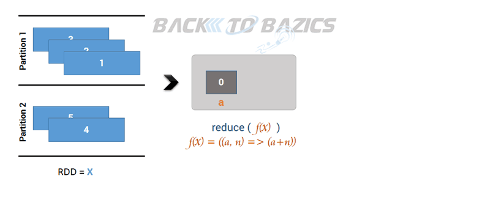
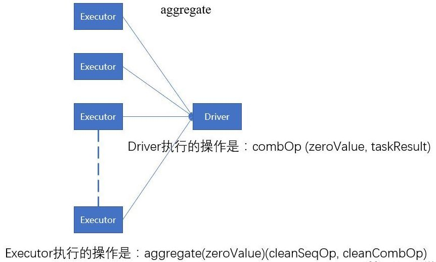
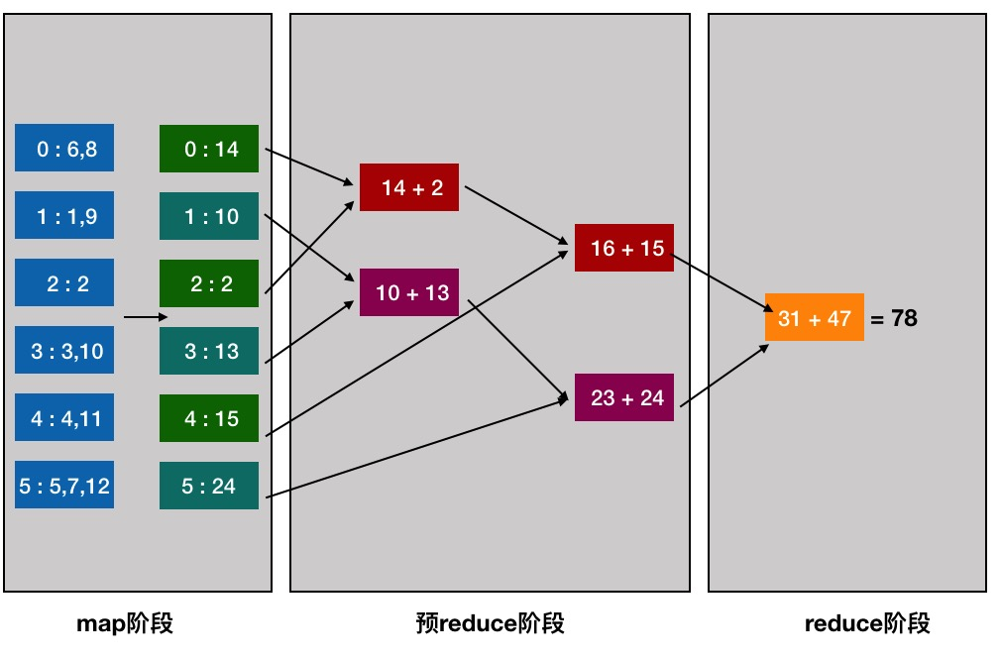
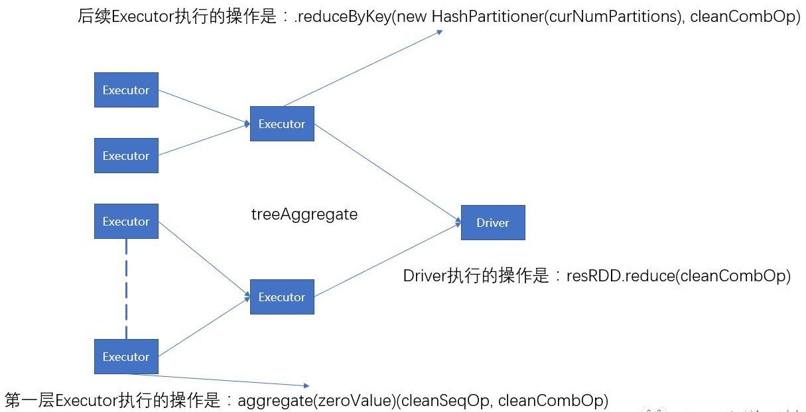
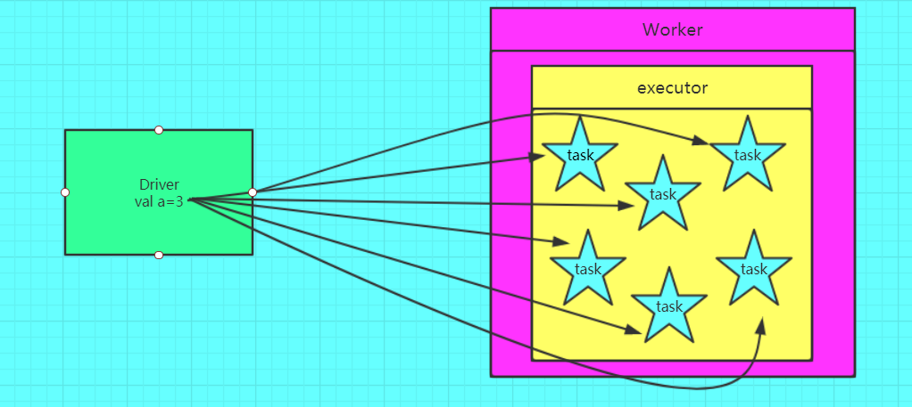
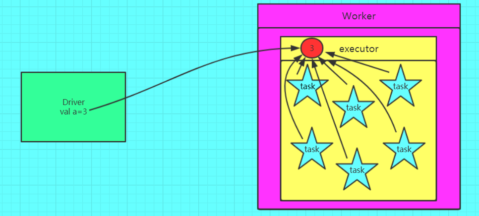
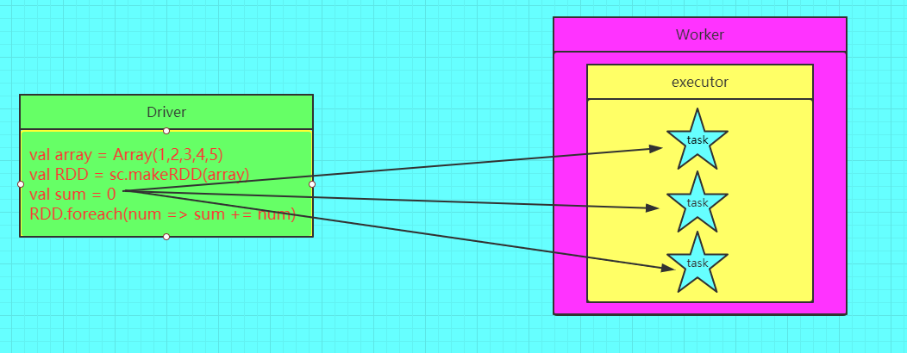
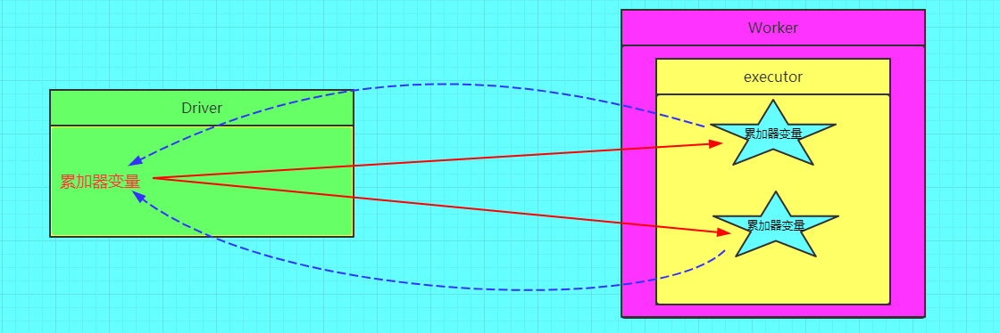

# RDD编程

* [返回顶层目录](../../../SUMMARY.md)
* [返回上层目录](../spark.md)


# RDD基本转换操作

## 输入

### parallelize

调用SparkContext 的 parallelize()，将一个存在的集合，变成一个RDD，这种方式试用于学习spark和做一些spark的测试

> def parallelize[T](seq: Seq[T], numSlices: Int = defaultParallelism)(implicit arg0: ClassTag[T]): RDD[T]
>
> - 第一个参数一是一个 Seq集合
> - 第二个参数是分区数
> - 返回的是RDD[T]

```scala
scala> sc.parallelize(List("shenzhen", "is a beautiful city"))
res1: org.apache.spark.rdd.RDD[String] = ParallelCollectionRDD[1] at parallelize at <console>:22
```


### makeRDD

只有scala版本的才有makeRDD

> def makeRDD\[T\](seq : scala.Seq[T], numSlices : scala.Int = { /* compiled code */ })

跟parallelize类似

```scala
sc.makeRDD(List("shenzhen", "is a beautiful city"))
```


### textFile

调用SparkContext.textFile()方法，从外部存储中读取数据来创建 RDD
例如在我本地F:\dataexample\wordcount\input下有个sample.txt文件，文件随便写了点内容，我需要将里面的内容读取出来创建RDD

```scala
var lines = sc.textFile("F:\\dataexample\\wordcount\\input") 
```

注: textFile支持分区，支持模式匹配，例如把F:\dataexample\wordcount\目录下inp开头的给转换成RDD

```scala
var lines = sc.textFile("F:\\dataexample\\wordcount\\inp*")
```

多个路径可以使用逗号分隔，例如

```scala
var lines = sc.textFile("dir1,dir2",3)
```


## 分区

### coalesce

def coalesce(numPartitions: Int, shuffle: Boolean = false)(implicit ord: Ordering[T] = null): RDD[T]

该函数用于将RDD进行重分区，使用HashPartitioner。

第一个参数为重分区的数目，第二个为是否进行shuffle，默认为false;

以下面的例子来看：

```scala
scala> var data = sc.textFile("/tmp/lxw1234/1.txt")
data: org.apache.spark.rdd.RDD[String] = MapPartitionsRDD[53] at textFile at :21
 
scala> data.collect
res37: Array[String] = Array(hello world, hello spark, hello hive, hi spark)
 
scala> data.partitions.size
res38: Int = 2  //RDD data默认有两个分区
 
scala> var rdd1 = data.coalesce(1)
rdd1: org.apache.spark.rdd.RDD[String] = CoalescedRDD[2] at coalesce at :23
 
scala> rdd1.partitions.size
res1: Int = 1   //rdd1的分区数为1
 
 
scala> var rdd1 = data.coalesce(4)
rdd1: org.apache.spark.rdd.RDD[String] = CoalescedRDD[3] at coalesce at :23
 
scala> rdd1.partitions.size
res2: Int = 2   //如果重分区的数目大于原来的分区数，那么必须指定shuffle参数为true，//否则，分区数不便
 
scala> var rdd1 = data.coalesce(4,true)
rdd1: org.apache.spark.rdd.RDD[String] = MapPartitionsRDD[7] at coalesce at :23
 
scala> rdd1.partitions.size
res3: Int = 4
```

### repartition

def repartition(numPartitions: Int)(implicit ord: Ordering[T] = null): RDD[T]

该函数其实就是coalesce函数第二个参数为true的实现

```scala
scala> var rdd2 = data.repartition(1)
rdd2: org.apache.spark.rdd.RDD[String] = MapPartitionsRDD[11] at repartition at :23
 
scala> rdd2.partitions.size
res4: Int = 1
 
scala> var rdd2 = data.repartition(4)
rdd2: org.apache.spark.rdd.RDD[String] = MapPartitionsRDD[15] at repartition at :23
 
scala> rdd2.partitions.size
res5: Int = 4
```

## 操作

### reduce

**reduce**将**RDD**中元素两两传递给输入函数? 同时产生一个新的值，新产生的值与RDD中下一个元素再被传递给输入函数直到最后只有一个值为止。



```scala
// reduce numbers 1 to 10 by adding them up
val x = sc.parallelize(1 to 10, 2)
val y = x.reduce((accum,n) => (accum + n)) 
// y: Int = 55
 
// shorter syntax
val y = x.reduce(_ + _) 
// y: Int = 55
 
// same thing for multiplication
val y = x.reduce(_ * _) 
// y: Int = 3628800
```


### randomSplit

```scala
def randomSplit(weights: Array[Double], seed: Long = Utils.random.nextLong): Array[RDD[T]]
```

该函数根据weights权重，将一个RDD切分成多个RDD。

该权重参数为一个Double数组

第二个参数为random的种子，基本可忽略。

```scala
scala> var rdd = sc.makeRDD(1 to 10,10)
rdd: org.apache.spark.rdd.RDD[Int] = ParallelCollectionRDD[16] at makeRDD at :21
 
scala> rdd.collect
res6: Array[Int] = Array(1, 2, 3, 4, 5, 6, 7, 8, 9, 10)  
 
scala> var splitRDD = rdd.randomSplit(Array(1.0,2.0,3.0,4.0))
splitRDD: Array[org.apache.spark.rdd.RDD[Int]] = Array(
MapPartitionsRDD[17] at randomSplit at :23, 
MapPartitionsRDD[18] at randomSplit at :23, 
MapPartitionsRDD[19] at randomSplit at :23, 
MapPartitionsRDD[20] at randomSplit at :23)
 
//这里注意：randomSplit的结果是一个RDD数组
scala> splitRDD.size
res8: Int = 4
//由于randomSplit的第一个参数weights中传入的值有4个，因此，就会切分成4个RDD,
//把原来的rdd按照权重1.0,2.0,3.0,4.0，随机划分到这4个RDD中，权重高的RDD，划分到//的几率就大一些。
//注意，权重的总和加起来为1，否则会不正常
 
scala> splitRDD(0).collect
res10: Array[Int] = Array(1, 4)
 
scala> splitRDD(1).collect
res11: Array[Int] = Array(3)                                                    
 
scala> splitRDD(2).collect
res12: Array[Int] = Array(5, 9)
 
scala> splitRDD(3).collect
res13: Array[Int] = Array(2, 6, 7, 8, 10)
```

### glom

```scala
def glom(): RDD[Array[T]]
```

该函数是将RDD中每一个分区中类型为T的元素转换成Array[T]，这样每一个分区就只有一个数组元素。

```scala
scala> var rdd = sc.makeRDD(1 to 10,3)
rdd: org.apache.spark.rdd.RDD[Int] = ParallelCollectionRDD[38] at makeRDD at :21
scala> rdd.partitions.size
res33: Int = 3  //该RDD有3个分区
scala> rdd.glom().collect
res35: Array[Array[Int]] = Array(Array(1, 2, 3), Array(4, 5, 6), Array(7, 8, 9, 10))
//glom将每个分区中的元素放到一个数组中，这样，结果就变成了3个数组
```

### aggregate

针对Spark的RDD，API中有一个aggregate函数，本人理解起来费了很大劲，明白之后，mark一下，供以后参考。

首先，Spark文档中[aggregate](http://spark.apache.org/docs/latest/api/scala/index.html#org.apache.spark.rdd.RDD)函数定义如下

```scala
def aggregate[U](zeroValue: U)(seqOp: (U, T) ⇒ U, combOp: (U, U) ⇒ U)(implicit arg0: ClassTag[U]): U
```

> Aggregate the elements of each partition, and then the results for all the partitions, using given combine functions and a neutral "zero value". This function can return a different result type, U, than the type of this RDD, T. Thus, we need one operation for merging a T into an U and one operation for merging two U's, as in scala.TraversableOnce. Both of these functions are allowed to modify and return their first argument instead of creating a new U to avoid memory allocation.  
>
> seqOp操作会聚合各分区中的元素，然后combOp操作把所有分区的聚合结果再次聚合，两个操作的初始值都是zeroValue.   seqOp的操作是遍历分区中的所有元素(T)，第一个T跟zeroValue做操作，结果再作为与第二个T做操作的zeroValue，直到遍历完整个分区。combOp操作是把各分区聚合的结果，再聚合。aggregate函数返回一个跟RDD不同类型的值。因此，需要一个操作seqOp来把分区中的元素T合并成一个U，另外一个操作combOp把所有U聚合。

* **zeroValue**是给定的初始值，该值将会在seqOp和**combOp两个函数中都**使用。
* **seqOp**在Executor端对每个分区进行操作，会用到初始值zeroValue。

* **combOp**在driver端执行，**也会用到初始值**。

举个例子。假如List(1,2,3,4,5,6,7,8,9,10)，对List求平均数，使用aggregate可以这样操作。

```scala
val rdd = sc.makeRDD(List(1,2,3,4,5,6,7,8,9),3)
// rdd: List[Int] = List(1, 2, 3, 4, 5, 6, 7, 8, 9)
//rdd.aggregate((0,0))( // for List not rdd
rdd.par.aggregate((0,0))(
(acc,number) => (acc._1 + number, acc._2 + 1),
(par1,par2) => (par1._1 + par2._1, par1._2 + par2._2)
)
// res0: (Int, Int) = (45,9)
res0._1 / res0._2
// res1: Int = 5
```

过程大概这样：

首先，初始值是`(0,0)`，这个值在后面2步会用到。

然后，`(acc,number) => (acc._1 + number, acc._2 + 1)`，`number`即是函数定义中的`T`，这里即是List中的元素。所以`acc._1 + number, acc._2 + 1`的过程如下。

```
1.  0+1,  0+1
2.  1+2,  1+1
3.  3+3,  2+1
4.  6+4,  3+1
5.  10+5,  4+1
6.  15+6,  5+1
7.  21+7,  6+1
8.  28+8,  7+1
9.  36+9,  8+1
```

结果即是(45,9)。

这里演示的是单线程计算过程，实际Spark执行中是分布式计算，可能会把List分成多个分区，假如3个，p1(1,2,3,4)，p2(5,6,7,8)，p3(9)，经过计算各分区的的结果（10,4），（26,4），（9,1），这样，执行(par1,par2) => (par1._1 + par2._1, par1._2 + par2._2)就是（10+26+9,4+4+1）即（45,9）.再求平均值就简单了。


但需要注意：aggregate是在每个分区计算完成后，把所有的数据拉倒driver端，进行统一的遍历合并，这样如果数据量很大，在driver端可能会爆内存：OOM，这时候就需要使用treeAggregate了。

aggregate执行结构图:



**这种聚合操作是有缺陷的，就是所有SeqOp操作对分区的执行结果都只能全部返回给Driver端，然后在对返回的结果和初始值执行CombOp操作，这样数据量大的时候很容易导致Driver端内存溢出，所以，就出现了优化函数treeAggregate。**

### treeAggregate

treeAggregate在aggregate的基础上做了一些优化，因为aggregate是在每个分区计算完成后，把所有的数据拉倒driver端，进行统一的遍历合并，这样如果数据量很大，在driver端可能会OOM。

因此treeAggregate在中间多加了一层合并。



源码：

```scala
def treeAggregate[U: ClassTag](zeroValue: U)(
 seqOp: (U, T) => U,
 combOp: (U, U) => U,
 depth: Int = 2): U = withScope {...}
```

**参数定义：**

* zeroValue是给定的初始值，该值只在seqOp使用。

* seqOp在Executor端对每个分区进行操作，会用到初始值zeroValue。

* combOp在Executor端和driver端都会执行，**不会用到初始值**。

源码片段分析：

（1）在Executor端执行的第一层任务，主要操作是对源数据和初始值zeroValue执行seqOp操作。

```scala
val aggregatePartition =
  (it: Iterator[T]) => it.aggregate(zeroValue)(cleanSeqOp, cleanCombOp)
var partiallyAggregated = mapPartitions(it => Iterator(aggregatePartition(it)))
```

（2）在执行完成第一层任务之后，执行combOp操作，主要是逐渐降低分区数，来逐层进行combOp操作，该操作是在Executor端执行，并且该操作并未用到初始值。

```scala
var numPartitions = partiallyAggregated.partitions.length
val scale = math.max(math.ceil(math.pow(numPartitions, 1.0 / depth)).toInt, 2)
while (numPartitions > scale + math.ceil(numPartitions.toDouble / scale)) {
  numPartitions /= scale
 val curNumPartitions = numPartitions
  partiallyAggregated = partiallyAggregated.mapPartitionsWithIndex {
    (i, iter) => iter.map((i % curNumPartitions, _))
  }.reduceByKey(new HashPartitioner(curNumPartitions), cleanCombOp).values
}
```

（3）在Executor端初步聚合后，对结果数据使用combOp操作再次执行reduce操作。

```scala
partiallyAggregated.reduce(cleanCombOp)
```

由上面我们可以总结，aggregate执行结构图，如下：



**aggregate VS treeAggregate**

`treeAggregate`其实基本上和`aggregate`是一样的，但是在`aggregate`中，需要把各partition的结果汇总发到driver上使用`combOp`进行最后一步汇总合并，这里有时会成为瓶颈（带宽、依次遍历各partition结果并合并），而`treeAggregate`就是用来优化这一环节的，按照树结构来reduce，提升性能。`treeAggregate`提供了一个新的参数`depth`，就是用来指定这个reduce树的深度的，默认为2。

了解了`aggregate`和`treeAggregate`后，我们就知道了，在实际使用中，尽量还是使用`treeAggregate`吧。

1, aggregate和treeAggregate的作用一样，最终的结果区别是treeAggregate执行combOp并没有用到初始值zeroValue。

2，treeAggregate比aggregate多执行了n次任务，n可计算。

3，treeAggregate降低了aggregate在driver端内存溢出的风险。

可以举个例子：

```scala
def seq(a:Int,b:Int):Int={
 println("seq:"+a+":"+b)
  a+b
}

def comb(a:Int,b:Int):Int={
 println("comb:"+a+":"+b)
  a+b
}

val res = sc.parallelize(List(1,2,3,4),3)
res.aggregate(1)(seq,comb)
res.treeAggregate(1)(seq,comb)
```

结果是：

```scala
//res.aggregate(1)(seq,comb)
seq:1:1
seq:1:3
seq:1:2
seq:4:4
comb:1:8
comb:9:2
comb:11:3
res0: Int = 14                                                                  

//res.treeAggregate(1)(seq,comb)
seq:1:2
seq:1:3
seq:1:1
seq:4:4
comb:2:8
comb:10:3
res1: Int = 13
```

Spark的[GradientDescent](https://github.com/apache/spark/blob/01f09b161217193b797c8c85969d17054c958615/mllib/src/main/scala/org/apache/spark/mllib/optimization/GradientDescent.scala#L236-L248)用到了该函数，自己写梯度下降时可进行参考。

# 共享变量

在spark程序中，当一个传递给Spark操作(例如map和reduce)的函数在远程节点上面运行时，Spark操作实际上操作的是这个函数所用变量的一个独立副本。这些变量会被复制到每台机器上，并且这些变量在远程机器上的所有更新都不会传递回驱动程序。通常跨任务的读写变量是低效的，但是，Spark还是为两种常见的使用模式提供了两种有限的共享变量：广播变（broadcast variable）和累加器（accumulator）

## 广播变量broadcast

**1、为什么要将变量定义成广播变量？**

如果我们要在分布式计算里面分发大对象，例如：字典，集合，黑白名单等，这个都会由Driver端进行分发，一般来讲，如果这个变量不是广播变量，那么每个task就会分发一份，这在**task数目十分多的情况下Driver的带宽会成为系统的瓶颈，而且会大量消耗task服务器上的资源**，如果将这个变量声明为广播变量，那么只是每个executor拥有一份，这个executor启动的task会共享这个变量，节省了通信的成本和服务器的资源。

**2、广播变量图解**

错误的，不使用广播变量



正确的，使用广播变量的情况



**3、如何定义一个广播变量？**

```scala
val a = 3
val broadcast = sc.broadcast(a)
```

**4、如何还原一个广播变量？**

```scala
val c = broadcast.value
```

**5、定义广播变量需要的注意点？**

变量一旦被定义为一个广播变量，那么这个变量只能读，不能修改

**6、注意事项**

1、能不能将一个RDD使用广播变量广播出去？

​       不能，因为RDD是不存储数据的。**可以将RDD的结果广播出去。**

2、 广播变量只能在Driver端定义，**不能在Executor端定义。**

3、 在Driver端可以修改广播变量的值，**在Executor端无法修改广播变量的值。**

4、如果executor端用到了Driver的变量，如果**不使用广播变量在Executor有多少task就有多少Driver端的变量副本。**

5、如果Executor端用到了Driver的变量，如果**使用广播变量在每个Executor中只有一份Driver端的变量副本。**

## 累加器accumulator

**为什么要将一个变量定义为一个累加器？**

在spark应用程序中，我们经常会有这样的需求，如异常监控，调试，记录符合某特性的数据的数目，这种需求都需要用到计数器，如果一个变量不被声明为一个累加器，那么它将在被改变时不会再driver端进行全局汇总，即在分布式运行时每个task运行的只是原始变量的一个副本，并不能改变原始变量的值，但是当这个变量被声明为累加器后，该变量就会有分布式计数的功能。

**2、图解累加器**

错误的图解



正确的图解



**3、如何定义一个累加器？**

```scala
val a = sc.accumulator(0)
```

**4、如何还原一个累加器？**

```scala
val b = a.value
```

**5、注意事项**

1、 **累加器在Driver端定义赋初始值，累加器只能在Driver端读取最后的值，在Excutor端更新。**

2、累加器不是一个调优的操作，因为如果不这样做，结果是错的


# 论文

学习一下Spark的RDD，据说这篇论文一定要看

[Resilient Distributed Datasets: A Fault-Tolerant Abstraction for
In-Memory Cluster Computing](https://www.usenix.org/system/files/conference/nsdi12/nsdi12-final138.pdf)


# 参考资料

- [spark RDD算子（一） parallelize，makeRDD，textFile](https://blog.csdn.net/T1DMzks/article/details/70189509)

"输入"参考此文章。

* [Spark算子：RDD基本转换操作(2)–coalesce、repartition](http://lxw1234.com/archives/2015/07/341.htm)

"分区"参考此文章。

* [Spark reduce Example Using Scala](https://backtobazics.com/big-data/spark/apache-spark-reduce-example/)

* [Spark算子：RDD基本转换操作(3)–randomSplit、glom](http://lxw1234.com/archives/2015/07/343.htm)

* [理解Spark RDD中的aggregate函数](https://blog.csdn.net/qingyang0320/article/details/51603243)
* [Spark MLlib 之 aggregate和treeAggregate从原理到应用](https://www.cnblogs.com/xing901022/p/9285898.html)
* [结合源码彻底讲解Aggregate vs treeAggregate](https://cloud.tencent.com/developer/article/1033015)

"操作"参考此文章。

* [Spark学习之路 （四）Spark的广播变量和累加器](https://www.cnblogs.com/qingyunzong/p/8890483.html)

"共享变量"参考此文章。

===

[Spark笔记：RDD基本操作（上）](https://www.cnblogs.com/sharpxiajun/p/5506822.html)