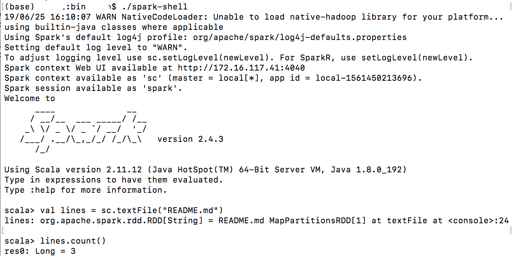

# Spark简介

* [返回顶层目录](../../SUMMARY.md)
* [返回上层目录](spark.md)


# Linux安装单机版spark

只学习spark，还不学分布式的时候，可以先单机装spark，这时候不需要用到hadoop的，但是仍然需要java环境，所以要先安装java的jdk。

## 下载并安装java jdk：

具体不细说了

## 安装好java环境后，安装spark

因为是单机版，所以不需要安装先安装spark，直接上官网下载，地址：http://spark.apache.org/downloads.html ，没有hadoop环境就选择spark-2.3.2-bin-hadoop2.7就好了，点进下载链接后，里头有很多个镜像，选择一个能打开的下载就行。下载好之后，解压。

## 打开shell，使用spark

cd到spark解压后的目录下，在我这里就是cd spark-2.3.2-bin-hadoop2.7，进入目录后，输入bin/spark-shell（**如果在bin目录下，输入./spark-shell而不是spark-shell**），这样就打开了scala shell，能够输入scala命令进行交互了。界面如下：



给个交互的小例子：

```sql
val lines = sc.textFile("../data/README.md")
lines.foreach(println)
lines.count()
lines.first()
```

## 退出spark：输入“:quit”

或者`:q`。

## 使用scala和python的小例子

使用scala：在spark文件夹下输入：

```scala
bin/spark-shell
//创建新的RDD，Resilient Distributed Dataset，弹性分布式数据集
var lines = sc.textFile(“README.md”)  
//输出长度
lines.count()  
```

   使用python：在spark文件夹下输入：

```python
bin/pyspark   --如果配置了环境变量就可以直接用pyspark
textFile = sc.textFile("README.md")   --创建新的RDD
textFile.count()  --输出长度
```

## spark2.0运行py文件的方法

```sh
./bin/spark-submit filepath.py
```


# 参考资料

* [Linux下安装单机版Spark并使用scala和python](https://blog.csdn.net/weixin_39750084/article/details/83661141)

"Linux安装单机版spark"参考此博客。


