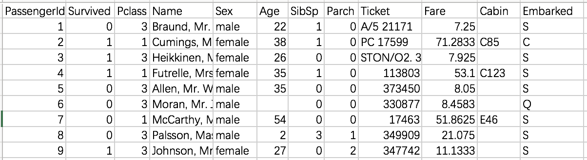

# TensorFlow机器学习基础

- [返回顶层目录](../../../SUMMARY.md)
- [返回上层目录](../tensorflow.md)


# 有监督学习的通用代码框架

下图是有监督学习的通用训练闭环框架：


该训练闭环的功能是：

* 首先对模型参数进行初始化。通常采用对参数随机赋值的方法，但对于比较简单的模型，也可以将各个参数的初值均设为0。
* 读取训练数据（包括每个数据样本及其期望输出）。通常人们会在这些数据送入模型之前，随机打乱样本的次序。
* 在训练数据上执行推断模型。这样，在当前模型参数配置下，每个训练样本都会得到一个输出值
* 计算损失。损失是一个能够刻画模型在最后一步得到的输出与来自训练机的期望输出之间差距的概括性指标。损失函数有多种类型，本书会陆续进行介绍。
* 调整模型参数。这一步对于实际的学习过程。给定损失函数，学习的目的在于通过大量训练步骤改善各参数的值，从而将损失最小化。最常见的策略是使用梯度下降算法。

上述闭环会依据所需的学习速率、所给定的模型及其输入数据，通过大量循环不断重复上述过程。

下面利用上述结构为模型训练和评估定义一个通用的代码框架：

```python
import tensorflow as tf

# 初始化变量或模型参数
# W = tf.Variable...
# b = tf.Variable...

def inference(X):
    # 计算推断模型在数据X上的输出，并将结果返回

def loss(X, Y):
    # 依据训练数据X及其期望输出Y计算损失

def inputs():
    # 读取或生成训练数据X及其期望输出Y
    
def train(total_loss):
    # 依据计算的总损失训练或调整模型参数
    
def evaluate(sess, X, Y):
    # 对训练得到的模型进行评估

# 在一个会话对象中启动数据流图，搭建模型
with tf.Session() as sess:
	tf.global_variables_initializer().run()
    
    X, Y = inputs()
    
    total_loss = loss(X, Y)
    train_op = train(total_loss)
    
    coord = tf.train.Coordinator()
    threads = tf.train.start_queue_runners(sess=sess, coord=coord)
    
    # 实际的训练迭代次数
    training_steps = 10000
    for step in range(training_steps):
        sess.run([train_op])
        # 出于调试和学习目的，查看损失在训练过程中递减的情况
        if step % 1000 == 0:
            print("loss = ", sess.run(total_loss))
            
    evaluate(sess, X, Y)
    
    coord.request_stop()
    coord.join(threads)
    sess.close()
```

在接下来的几节中，将针对不同类型的推断模型为这些模板方法填充所需的代码。

当对模型的响应满意后，便可将精力放在模型导出，以及用它所需要使用的数据进行推断上。

关于上述代码中的如下两行代码

```python
    coord = tf.train.Coordinator()
    threads = tf.train.start_queue_runners(sess=sess, coord=coord)
```

的具体[解释](https://blog.csdn.net/dcrmg/article/details/79780331)如下：

> TensorFlow的Session对象是支持多线程的，可以在同一个会话（Session）中创建多个线程，并行执行。在Session中的所有线程都必须能被同步终止，异常必须能被正确捕获并报告，会话终止的时候， 队列必须能被正确地关闭。
>
> TensorFlow提供了两个类来实现对Session中多线程的管理：tf.Coordinator和 tf.QueueRunner，这两个类往往一起使用。
>
> Coordinator类用来管理在Session中的多个线程，可以用来同时停止多个工作线程并且向那个在等待所有工作线程终止的程序报告异常，该线程捕获到这个异常之后就会终止所有线程。使用 **tf.train.Coordinator()**来创建一个线程管理器（协调器）对象。
>
> QueueRunner类用来启动tensor的入队线程，可以用来启动多个工作线程同时将多个tensor（训练数据）推送入文件名称队列中，具体执行函数是 **tf.train.start_queue_runners** ， 只有调用 tf.train.start_queue_runners 之后，才会真正把tensor推入内存序列中，供计算单元调用，否则会由于内存序列为空，数据流图会处于一直等待状态。

# 线性回归

在机器学习问题中，线性回归是一种最简单的建模手段。

下图展示了一个2D情况下的线性回归模型。图中的点代表训练数据，而直线代表模型的推断结果。


线性回归模型的一般表达式为：
$$
\mathbf{Y}=\mathbf{XW}^T+b
$$
其中，$$\mathbf{X}=(x_1, x_2, ... , x_k)$$，$$\mathbf{W}=(w_1, w_2, ... , w_k)$$。$$\mathbf{W}$$和b都是要学习的参数。

损失函数定义为L2损失：
$$
loss=\sum_i(y_i-y\_predicted_i)^2
$$
模型的优化方法采用随机梯度下降法。

将适合本问题的模型和损失函数套用进之前的通用训练模型框架中：

```python
import tensorflow as tf
import numpy as np
import matplotlib.pyplot as plt

# 初始化变量或模型参数
W = tf.Variable(tf.zeros([2, 1]), name="weights")
b = tf.Variable(0., name="bias")

def inference(X):
    return tf.matmul(X, W) + b
    
def loss(X, Y):
    Y_predicted = inference(X)
    return tf.reduce_sum(tf.squared_difference(Y, Y_predicted))
    
def inputs():
    weight_age = [[84, 46], [73, 20], [65, 52], [70, 30],
                  [76, 57], [69, 25], [63, 28], [72, 36], [79, 57], [75, 44],
                  [27, 24], [89, 31], [65, 52], [57, 23], [59, 60], [69, 48],
                  [60, 34], [79, 51], [75, 50], [82, 34], [59, 46], [67, 23],
                  [85, 37], [55, 40], [63, 30]]
    blood_fat_content = [354, 190, 405, 263, 451, 302, 288,
                         385, 402, 365, 209, 290, 346, 254, 395, 434, 220, 374, 308,
                         220, 311, 181, 274, 303, 244]
    return tf.cast(weight_age, dtype=tf.float32), tf.cast(blood_fat_content, dtype=tf.float32)
    
def train(total_loss):
    learning_rate = 0.0000001
    return tf.train.GradientDescentOptimizer(learning_rate).minimize(total_loss)
    
def evaluate(sess, X, Y):
    print(sess.run(inference([[80., 25.]])))
    print(sess.run(inference([[65., 25.]])))
    
saver = tf.train.Saver()

with tf.Session() as sess:
    tf.global_variables_initializer().run()
    
    X, Y = inputs()
    
    total_loss = loss(X, Y)
    print("total_loss = {}".format(sess.run(total_loss)))
    train_op = train(total_loss)
    
    coord = tf.train.Coordinator()
    threads = tf.train.start_queue_runners(sess=sess, coord=coord)
    
    # 实际的训练迭代次数
    training_steps = 10000
    for step in range(training_steps):
        sess.run([train_op])
        
        if step % 1000 == 0:
            saver.save(sess, 'my-model', global_step=step)
            print("loss = ", sess.run(total_loss))
    
    saver.save(sess, 'my-model', global_step=training_steps)
    w1, w2 = sess.run(W)
    b = sess.run(b)
    print("W1 = {}, W2 = {}, b = {}".format(w1, w2, b))
    evaluate(sess, X, Y)
    
    coord.request_stop()
    coord.join(threads)
    sess.close()
```

输出结果如下：

```
total_loss = 63976248.0
loss =  7608772.5
loss =  5330322.5
loss =  5318362.0
loss =  5306487.5
loss =  5294694.0
loss =  5282986.0
loss =  5271360.0
loss =  5259814.5
loss =  5248352.0
loss =  5236971.0
W1 = [3.414043], W2 = [1.4546419], b = 10.848892211914062
[[320.33838]]
[[269.12775]]
```

# 逻辑回归

二分类问题中，最常见的分类函数就是逻辑回归了：
$$
f(x)=\frac{1}{1+e^{-x}}
$$
损失函数采用交叉熵损失：
$$
\text{loss}=\sum_i(y_i\cdot \text{log}(y\_predicted_i)+(1-y_i)\cdot \text{log}(1-y\_predicted_i))
$$
将该模型用到如下问题中：

有一艘著名的船泰坦尼克号沉没了，这里有一份乘客名单，分别给出了生存人员的性别，舱位，年龄。 则根据失踪人员的对应信息，推测生存概率。

数据来自kaggle竞赛的[titanic数据集](https://www.kaggle.com/c/titanic/data)，如下所示：



我们可以学会编写读取文件的基本代码，并常见一个batch来读取多行数据。

对于数据集中的属性数据，为了能在模型中使用，需要将其转换为数值型特征，一种方法是为每个可能的取值分配一个数值，即one-hot编码。例如，如果直接用1表示一等船票，2和3表示二、三等船票，这种方式会为这些取值强加一种实际并不存在的线性关系，因为我们不能说，三等船票是一等船票的3倍，正确的做法是将每个属性拓展为N维的布尔型特征，若具备该属性，则相应的维度上取值为1，这样就可以使模型独立地学习到每个可能的取值。

具体代码为：

```python
import tensorflow as tf
import os

with tf.name_scope('parameters'):
    W = tf.Variable(tf.zeros([5,1]), name='weights')
    b = tf.Variable(0., name="bias")
    tf.summary.histogram('weight',W)
    tf.summary.histogram('bias',b)

def combine_inputs(X):
    return tf.matmul(X,W) + b

def inference(X):
    return tf.sigmoid(combine_inputs(X))

def loss(X, Y):
    loss = tf.reduce_mean(tf.nn.sigmoid_cross_entropy_with_logits(labels=Y, logits=combine_inputs(X)))
    tf.summary.scalar('loss', loss)
    return loss

def read_csv(batch_size, file_name, record_defaults):
    filename_queue = tf.train.string_input_producer([os.path.join(os.getcwd(), file_name)])

    reader = tf.TextLineReader(skip_header_lines=1)
    key, value = reader.read(filename_queue)

    # decode_csv will convert a Tensor from type string (the text line) in
    # a tuple of tensor columns with the specified defaults, which also
    # sets the data type for each column
    decoded = tf.decode_csv(value, record_defaults=record_defaults)

    # batch actually reads the file and loads "batch_size" rows in a single tensor
    return tf.train.shuffle_batch(decoded,
                                  batch_size=batch_size,
                                  capacity=batch_size * 50,
                                  min_after_dequeue=batch_size)


def inputs():
    passenger_id, survived, pclass, name, sex, age, sibsp, parch, ticket, fare, cabin, embarked = \
        read_csv(100, "train.csv", [[0.0], [0.0], [0], [""], [""], [0.0], [0.0], [0.0], [""], [0.0], [""], [""]])

    # convert categorical data 转换属性数据
    is_first_class = tf.to_float(tf.equal(pclass, [1]))
    is_second_class = tf.to_float(tf.equal(pclass, [2]))
    is_third_class = tf.to_float(tf.equal(pclass, [3]))

    gender = tf.to_float(tf.equal(sex, ["female"]))

    # Finally we pack all the features in a single matrix;
    # We then transpose to have a matrix with one example per row and one feature per column.
    print(is_first_class, is_second_class, is_third_class, gender, age)
    # 可以使用 tf.stack 方法将所有布尔值打包进单个张量中
    print(tf.stack([is_first_class, is_second_class, is_third_class, gender, age]))
    print(tf.transpose(tf.stack([is_first_class, is_second_class, is_third_class, gender, age])))

    # 最终将所有特征排列在一个矩阵中，然后对该矩阵转置，使其每行对应一个样本，每列对应一种特征
    features = tf.transpose(tf.stack([is_first_class, is_second_class, is_third_class, gender, age]))
    survived = tf.reshape(survived, [100, 1])

    return features, survived


def train(total_loss):
    learning_rate = 0.01
    return tf.train.GradientDescentOptimizer(learning_rate).minimize(total_loss)


def evaluate(sess, X, Y):

    predicted = tf.cast(inference(X) > 0.5, tf.float32)

    print(sess.run(tf.reduce_mean(tf.cast(tf.equal(predicted, Y), tf.float32))))

# Launch the graph in a session, setup boilerplate
with tf.Session() as sess:

    tf.initialize_all_variables().run()

    X, Y = inputs()

    total_loss = loss(X, Y)
    train_op = train(total_loss)

    coord = tf.train.Coordinator()
    threads = tf.train.start_queue_runners(sess=sess, coord=coord)

    merged = tf.summary.merge_all()
    writer = tf.summary.FileWriter("./my_graph", sess.graph)
    # actual training loop
    training_steps = 1000
    for step in range(training_steps):
        sess.run([train_op])
        rs = sess.run(merged)
        writer.add_summary(rs, step)
        # for debugging and learning purposes, see how the loss gets decremented thru training steps
        if step % 10 == 0:
            print("loss: ", sess.run([total_loss]))

    evaluate(sess, X, Y)

    import time
    time.sleep(5)

    coord.request_stop()
    coord.join(threads)
    sess.close()

```

注：该代码来源于[这里](http://sailblade.com/blog/2018/03/01/Tensorflow-sigmoidRegression/)。

输出为：

```
loss:  [0.5430653]
loss:  [0.5220633]
loss:  [0.50926584]
loss:  [0.5200003]
loss:  [0.57297224]
0.76
```

ji

# softmax分类


