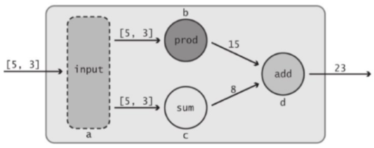
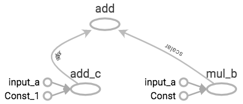
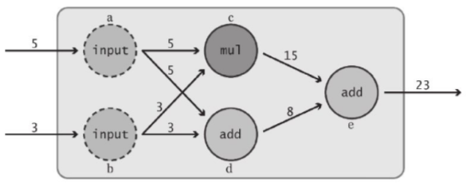
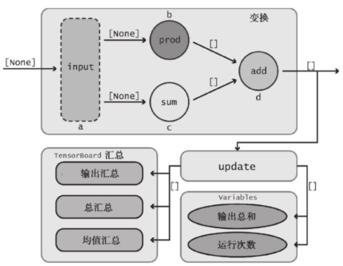
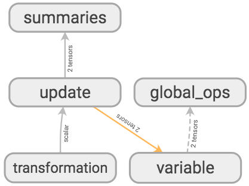
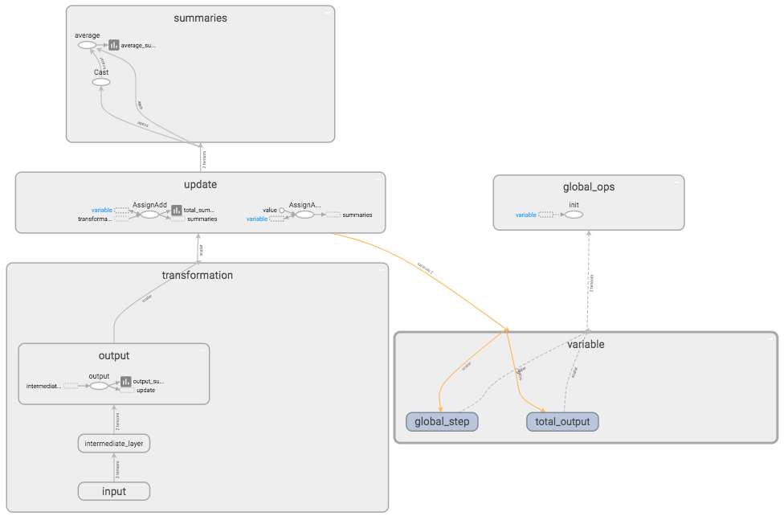
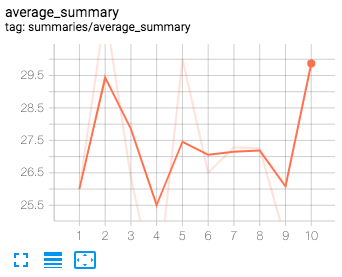
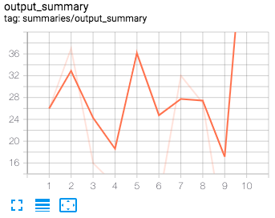

# TensorFlow基础

* [返回顶层目录](../../../../SUMMARY.md)
* [返回上层目录](../../tensorflow.md)
* [基础练习](#基础练习)
* [综合练习](#综合练习)


# 基础练习

我们来实现下图所示的计算流程：



导入TensorFlow库：

```python
import tensorflow as tf
import numpy as np
import matplotlib.pyplot as plt
```

然后定义默认的Graph，并用Session进行运算，然后写入磁盘中：

```python
data = [5, 3]
a = tf.constant(data, name="input_a")
b = tf.reduce_prod(a, name="mul_b")
c = tf.reduce_sum(a, name="add_c")
#d = tf.add(c, b, name="add_d")
d = c + b
sess = tf.Session()
print(sess.run(d))
# 23
writer = tf.summary.FileWriter('my_graph', sess.graph)

writer.close()
sess.close()
```

定义的图如下所示：



# 综合练习

下面通过一个综合练习来掌握前面我们学过的所有组件：

* Tensor对象
* Graph对象
* Op操作符
* Variable对象
* 占位符
* Session对象
* 名称作用域
* TensorBoard汇总数据

最终目的是，通过此练习能自如地搭建基本的TensorFlow数据流图，并在TensorBoard中对其进行研究。

本练习的模型为：



本练习的数据流图为：



下面开始动手实践：

（1）首先导入TensorFlow库：

```python
import tensorflow as tf
import numpy as np
import matplotlib.pyplot as plt
```

（2）接下来构造图，显示创建一个Graph对象加以使用，不使用默认的Graph对象：

```python
graph = tf.Graph()
# 将构建的心的Graph对象设为默认的Graph对象：
with graph.as_default():
    with tf.name_scope("variable"):
        # 记录数据流图运行次数的Variable对象
        global_step = tf.Variable(0, dtype=tf.int32, trainable=False, name="global_step")
        # 追踪该模型的所有输出随时间的累加和的Variable对象
        total_output = tf.Variable(0.0, dtype=tf.float32, trainable=False, name="total_output")
    
    with tf.name_scope("transformation"):
        # 独立的输入层
        with tf.name_scope("input"):
            # 创建输出占位符，用于接受一个向量
            a = tf.placeholder(tf.float32, shape=[None], name="input_placeholder_a")
        # 独立的中间层
        with tf.name_scope("intermediate_layer"):
            b = tf.reduce_prod(a, name="product_b")
            c = tf.reduce_sum(a, name="sum_c")
        # 独立的输出层
        with tf.name_scope("output"):
            output = tf.add(b, c, name="output")
    
    with tf.name_scope("update"):
        # 用最新的输出更新Variable对象total_output
        update_total = total_output.assign_add(output)
        # 将前面的Variable对象globle_step增1，只要数据流图运行，该操作便需要进行
        increment_step = global_step.assign_add(1)
    
    with tf.name_scope("summaries"):
        avg = tf.math.divide(update_total, tf.cast(increment_step, tf.float32), name="average")
        # 为了输出节点创建汇总数据
        tf.summary.scalar("output_summary", output)
        tf.summary.scalar("total_summary", update_total)
        tf.summary.scalar("average_summary", avg)
    
    with tf.name_scope("global_ops"):
        # 初始化 OP
        init = tf.global_variables_initializer()
        # 将所有汇总数据合并到一个Op中
        merged_summaries = tf.summary.merge_all()
```

上一段代码构建的数据流图如下两图所示：

数据流图总览：



数据流图详细展示：



注：上两图都是在TensorBoard中打开的。接下来会详细讲TensorBoard。

（3）构建好数据流图以后，接下来运行该数据流图。

打开一个Session对象，并加载已经创建好的Graph对象，也可以打开tf.summary.FileWriter对象，方便利用其保存数据。

Session对象启动后，在做其他事之前，先对各Variable对象进行初始化：

```python
sess = tf.Session(graph=graph)
writer = tf.summary.FileWriter('./improved_graph', graph)
sess.run(init)
```

为了运行该数据，需要创建一个辅助函数run_graph()，这样以后便无需反复输入相同的代码。

我们将输入向量传给该函数，该函数将运行数据流图，并将汇总数据保存下来：

```python
def run_graph(input_tensor):
    feed_dict = {a: input_tensor}
    _, step, summary = sess.run([output, increment_step, merged_summaries], feed_dict=feed_dict)
    writer.add_summary(summary, global_step=step)
```

下面来实际使用这个函数，可变换向量的长度来多次调用run_graph()函数：

```python
run_graph([2, 8])
run_graph([3, 1, 3, 3])
run_graph([8])
run_graph([1, 2, 3])
run_graph([11, 4])
run_graph([4, 1])
run_graph([7, 3, 1])
run_graph([6, 3])
run_graph([0, 2])
run_graph([4, 5, 6])
```

上述调用可反复进行。

下图是tf.summary.scalar值的随运行次数的变化情况：



注：上三图都是在TensorBoard中打开查看的。

数据填充完毕后，用下面的代码将汇总数据写入磁盘：

```python
# 将汇总数据写入磁盘
writer.flush()
```

（4）tf.summary.FileWriter对象和Session对象已经使用完毕，我们将其关闭，以完成一些清理工作。

```python
writer.close()
sess.close()
```

以上便是全部的TensorFlow代码了。

下面我们打开TensorBoard，看看上图所示的结果吧。

启动Terminal，`cd`到运行上述代码的目录（确保`improved_graph`目录在该路径下），并运行下列命令：

```shell
tensorboard --logdir "imroved_graph"
```

该命令会在6006端口启动一个TensorBoar服务器，并托管存储在`improved_graph`中的数据。在浏览器中观察得到的结果。这里就不放图了，因为前面几个图就是其结果。

好了，本练习至此就全部结束了。虽然有点长，但是还不至于理解不了。希望能够熟练掌握如何基于虚拟草图创建TensorFlow数据流图，以及如何利用TensorBoard做一些基础的数据汇总工作。


# 参考资料

* 《面向机器智TensorFlow实践》

本文主要参考此书对应章节。


