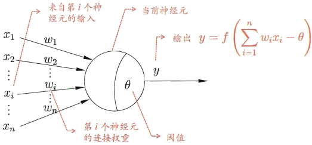
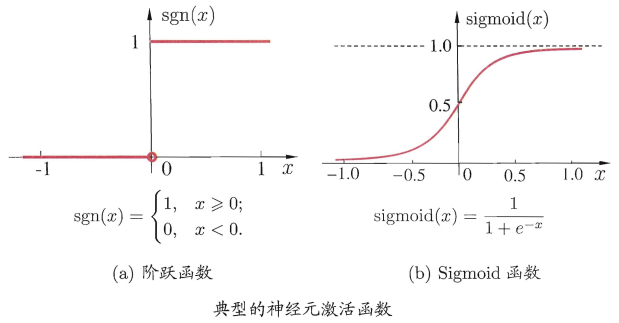
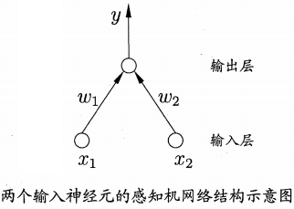
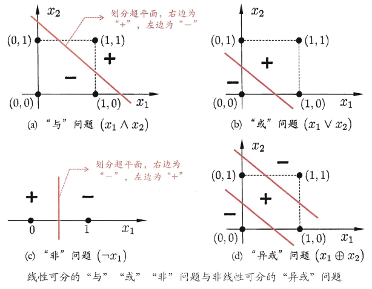
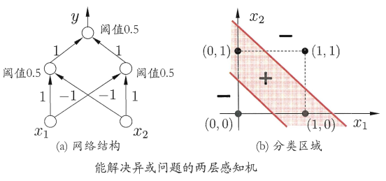
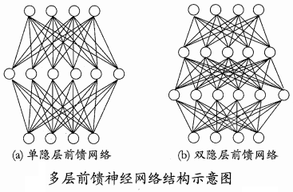
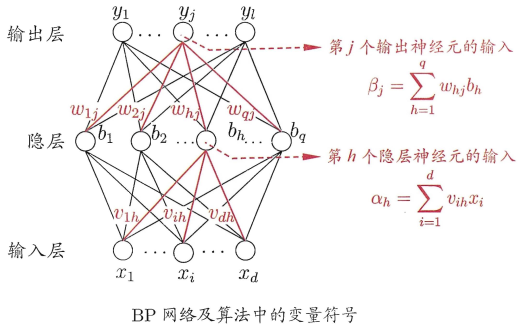

# ANN人工神经网络

* [返回顶层目录](../../SUMMARY.md#目录)

神经网络为什么可以（理论上）拟合任何函数？

<https://www.zhihu.com/question/268384579>

# 神经元模型

神经网络（neural networks）方面的研究很早就已出现，今天"神经网络"己是一个相当大的、多学科交叉的学科领域。各相关学科对神经网络的定义多种多样，本书采用目前使用得最广泛的一种，即"**神经网络是由具有适应性的简单单元组成的广泛并行互连的网络，它的组织能够模拟生物神经系统对真实世界物体所作出的交互反应**"[Kohonen, 1988]。我们在机器学习中谈论神经网络时指的是"神经网络学习"或者说，是机器学习与神经网络这两个学科领域的交叉部分。

神经网络中最基本的成分是神经元（neuron）模型，即上述定义中的"简单单元"。在生物神经网络中，每个神经元与其他神经元相连，当它"兴奋"时，就会向相连的神经元发送化学物质，从而改变这些神经元内的电位；如果某神经元的电位超过了一个"阈值"（threshold），那么它就会被激活，即 "兴奋 "起来，向其他神经元发送化学物质。

1943年，[McCulloch and Pitts, 1943]将上述情形抽象为下图所示的简单模型，这就是一直沿用至今的 "M-P神经元模型"。在这个模型中，**神经元接收到来自n个其他神经元传递过来的输入信号，这些输入信号通过带权重的连接（connection）进行传递，神经元接收到的总输入值将与神经元的阀值进行比较，然后通过"激活函数"（activation function）处理以产生神经元的输出**。

理想中的激活函数是下图(a)所示的阶跃函数，它将输入值映射为输出值"0" 或”1“，显然"1"对应于神经元兴奋，"0"对应于神经元抑制。然而，阶跃函数具有不连续、不光滑等不太好的性质，因此实际常用Sigmoid函数作为激活函数。典型的Sigmoid 函数如下图(b)所示，它把可能在较大范围内变化的输入值挤压到(0, 1)输出值范围内，因此有时也称为"挤压函数"。

把许多个这样的神经元按-定的层次结构连接起来，就得到了神经网络。

事实上，从计算机科学的角度看，我们可以先不考虑神经网络是否真的模拟了生物神经网络，只需将一个神经网络视为包含了许多参数的数学模型，这个模型是若干个函数， 例如
$$
y_j=f\left( \sum_iw_ix_i-\theta_j \right)
$$
相互（嵌套）代入而得.有效的神经网络学习算法大多以数学证明为支撑。

# 激活函数

[理解神经网络的激活函数](https://mp.weixin.qq.com/s?__biz=MzU4MjQ3MDkwNA==&mid=2247483977&idx=1&sn=401b211bf72bc70f733d6ac90f7352cc&chksm=fdb69fdecac116c81aad9e5adae42142d67f50258106f501af07dc651d2c1473c52fad8678c3&mpshare=1&scene=1&srcid=0508JKgf4ThI1pfcRQSyK3Q4#rd)

卷积网络的激活函数sigmod和relu有什么区别？

使用sigmod函数会导致将近一半的神经元被激活。不太符合人类脑活动工程学。
而relu函数在这方面神似，自动引入稀疏性，相当于无监督预练习。

[理解神经网络的激活函数](http://mp.weixin.qq.com/s?__biz=MzU4MjQ3MDkwNA==&mid=2247483977&idx=1&sn=401b211bf72bc70f733d6ac90f7352cc&chksm=fdb69fdecac116c81aad9e5adae42142d67f50258106f501af07dc651d2c1473c52fad8678c3&mpshare=1&scene=1&srcid=07308RapV3KncGG6CBZwmF8w#rd)

[神经网络的激活函数总结](https://mp.weixin.qq.com/s?__biz=MzU4MjQ3MDkwNA==&mid=2247485762&idx=1&sn=e1e9fc75b92999177d3c61c655b0e06e&chksm=fdb694d5cac11dc37dac1a7ce32150836d66f0012f35a7e04e3dceaf626b8453dc39ee80172b&scene=0#rd)

[一种新的思路通俗理解激活函数](https://mp.weixin.qq.com/s?__biz=MzI4MDYzNzg4Mw==&mid=2247488052&idx=1&sn=327b04f1a7b2a7cd62a5c369e33b9f62&chksm=ebb42ae0dcc3a3f6809ba19dfd4432b4700f52a6ca5d448a98e0b6ea58f6a67e41d517295079&mpshare=1&scene=1&srcid=0723FSI6mqiC7zFLQNzK9HpT#rd)

[理解激活函数作用，看这篇文章就够了！](https://mp.weixin.qq.com/s?__biz=MzI4MDYzNzg4Mw==&mid=2247488049&idx=1&sn=4cad0db659391faaa4dac0ace524a21f&chksm=ebb42ae5dcc3a3f3145c70529bb828ebdb66429cc0c1433ad5ad5072ef2c2bb86094f27320be&scene=0#rd)

[通俗理解神经网络中激活函数作用](http://mp.weixin.qq.com/s?__biz=MzI4MDYzNzg4Mw==&mid=2247486431&idx=1&sn=f8f6f1ca8e4ab16616ee5ac853803d3b&chksm=ebb4330bdcc3ba1dc946df1078c49f8e42fe5701afefa8d886d2ca6654698fb9b2c8e0908341&scene=0#rd)

# 感知机与多层网络

**感知机（Perceptron）由两层神经元组成**，如下图所示，输入层接收外界输入信号后传递给输出层，输出层是M-P神经元，亦称"阈值逻辑单元"（threshold logic unit）。

感知机能容易地实现逻辑与、或、非运算。注意到
$$
y=f\left( \sum_iw_ix_i-\theta \right)
$$
，假定f是激活函数中的阶跃函数，有

*  “与”（x1 && x2）：令w1 = w2 = 1，θ = 2，则y = f( 1·x1 + 1·x2 - 2 )，仅在x1 =1且x2 = 1时，y = 1
* “或”（x1 || x2）：令w1 = w2 = 1，θ = 0.5，则y = f( 1·x1 + 1·x2 - 0.5 )，当x1 = 1或x2 = 1时，y = 1
* “非”（! x1）：令w1 = -0.6，w2 = 0，θ = -0.5，则y = f( -0.6·x1 + 0·x2 + 0.5 )，当x1 = 1时，y = 0；当x1 = 0时，y = 1

更一般地，给定训练数据集，权重wi(i = 1, 2, ... , n)以及阈值θ可通过学习得到。阈值θ可看作一个固定输入为-1.0的"哑结点"（dummy node）所对应的连接权重W(n+1)，这样，权重和阈值的学习就可统一为权重的学习。感知机学习规则非常简单，对训练样例(x, y)，若当前感知机的输出为hat(y)，则感知机权重将这样调整：
$$
\begin{aligned}
&w_i\leftarrow w_i+\Delta w_i\\
&w_i=\eta(y-\hat{y})x_i
\end{aligned}
$$
其中η∈(0, 1)称为学习率。从上式可看出，若感知机对训练样例(x, y)预测正确，即hat(y) = y，则感知机不发生变化，否则将根据错误的程度进行权重调整。

需注意的是，感知机只有输出层神经元进行激活函数处理，即只拥有一层功能神经单元，其学习能力非常有限。事实上，上述与、或、非问题都是线性可分的问题。可以证明，若两类模式是线性可分的，即存在一个线性超平面能将它们分开，如下图(a)-(c) 所示，则感知机的学习过程一定会收敛而求得适当的权向量w = (w1, w2, ... , w(n+1))；否则感知机学习过程将会发生震荡，w难以稳定下来，不能求得合适解，例如**感知机甚至不能解决如下图(d)所示的异或这样简单的非线性可分问题**。

**要解决非线性可分问题，需考虑使用多层功能神经元**。例如下图中这个简单的两层感知机就能解决异或问题。在下图(a)中，输出层与输入层之间的一层神经元，被称为隐层或隐藏层（hidden layer），隐含层和输出层神经元都是拥有激活函数的功能神经元。

更一般的，常见的神经网络是形如下图所示的层级结构，每层神经元与下层神经元全互连，神经元之间不存在同层连接， 也不存在跨层连接。这样的神经网络结构通常称为"**多层前馈神经网络**"（multi-layer feedforward neural networks），其中输入层神经元接收外界输入，隐层与输出层神经元对信号进行加工，最终结果由输出层神经元输出；换言之，输入层神经元仅是接受输入，不进行函数处理，隐层与输出层包含功能神经元。因此，下图(a)通常被称为"两层网络"。为避免歧义，本书称其为"单隐层网络"。**只需包含隐层，即可称为多层网络**。神经网络的**学习过程，就是根据训练数据来调整神经元之间的"连接权值"以及每个功能神经元的阈值**；换言之，神经网络"学"到的东西，蕴涵在连接权值与阈值中。

# 误差逆向传播（BP）算法

多层网络的学习能力比单层感知机强得多。欲训练多层网络，前面的简单感知机学习规则显然不够了，需要更强大的学习算法。误差逆传播（error BackPropagation，简称BP）算法就是其中最杰出的代表。**误差逆向传播算法是迄今最成功的神经网络学习算法**。现实任务中使用神经网络时，大多是在使用BP算法进行训练。

下面我们来看看 BP 算法究竟是什么样。

给定训练集D = \{ (x1, y1), (x2, y2), ... , (xm, ym) \}， xi∈R^d，yi∈R^l，即输入示例由d个属性描述，输出l维实值向量。

为便于讨论，下图给出了一个拥有d个输入神经元、l个输出神经元、q个隐层神经元的多层前馈网络结构，其中输出层第j个神经元的阈值用θj表示，隐层第h个神经元的阈值用γh表示。输入层第i个神经元与隐层第h个神经元之间的连接权为v(ih)，隐层第h个神经元与输出层第j个神经元之间的连接权为w(hj)。

记隐层第h个神经元接收到的输入为
$$
\alpha_h=\sum_{i=1}^dv_{ih}x_i
$$

， 输出层第j个神经元接收到的输入为
$$
\beta_j=\sum_{h=1}^qw_{hj}b_h
$$
，其中bh为隐层第h个神经元的输出。假设隐层和输出层神经元都使用Sigmoid激活函数。

对训练例(xk, yk)，假定神经网络的输出为
$$
\hat{y}_k=(\hat{y}_1^k, \hat{y}_2^k, ... , \hat{y}_l^k)
$$
，即
$$
\hat{y}_j^k=f(\beta_j-\theta_j)
$$
则网络在(xk, yk)上的均方误差为
$$
E_k=\frac{1}{2}\sum_{j=1}^l(\hat{y}_j^k-y_j^k)^2
$$
其中，1/2是为了后续求导的便利。

上图的网络中有(d + l + 1)q + l个参数需确定：输入层到隐层的d x q个权值 、 隐层到输出层的q x l个权值、q个隐层神经元的阈值、l个输出层神经元的阈值。BP是一个迭代学习算法，在迭代的每一轮中采用广义的感知机学习规则对参数进行更新估计，即与前面的感知机更新算法类似，任意参数v的更新估计式为
$$
v\leftarrow v+\Delta v 
$$
下面我们以上图中隐层到输出层的连接权w(hj)为例来进行推导。

BP算法基于梯度下降策略，以目标的负梯度方向对参数进行调整。对上上式的均方误差Ek，给定学习率η，有
$$
\Delta w_{hj}=-\eta\frac{\partial E_k}{\partial w_{hj}}
$$
注意到w(hj)先影响到第j个输出层神经元的输入值βj，再影响到其输出值hat(y)_j^k，再影响到Ek，有
$$
\frac{\partial E_k}{\partial w_{hj}}=\frac{\partial E_k}{\partial \hat{y}_j^k}\frac{\partial \hat{y}_j^k}{\partial \beta_j}\frac{\partial \beta_j}{\partial w_{hj}}
$$
根据βj的定义，显然有
$$
\frac{\partial \beta_j}{\partial w_{hj}}=b_h
$$
Sigmoid激活函数有一个很好的性质：
$$
f'(x)=f(x)(1-f(x))
$$
于是有输出层灵敏度gj为
$$
\begin{aligned}
g_j&=\frac{\partial E_k}{\partial \hat{y}_j^k}\frac{\partial \hat{y}_j^k}{\partial \beta_j}\\
&=(\hat{y}_j^k-y_j^k)f'(\beta_j-\theta_j)\\
&=(\hat{y}_j^k-y_j^k)\hat{y}_j^k(1-\hat{y}_j^k)\\
\end{aligned}
$$
则BP算法中关于输出层权值w(hj)的更新公式为
$$
\Delta w_{hj}=-\eta g_jb_h
$$
输出层的阈值θj更新公式为（θj为阈值，本身前面带有负号，所以这里负负得正了）
$$
\Delta\theta_j=\eta g_j
$$
类似可得隐层灵敏度eh为
$$
\begin{aligned}
e_h&=\frac{\partial E_k}{\partial b_h}\frac{\partial b_h}{\partial \alpha_h}\\
&=\left( \sum_{j=1}^l \frac{\partial E_k}{\partial \beta_j}\cdot \frac{\partial \beta_j}{\partial b_h} \right) \cdot \frac{\partial b_h}{\partial \alpha_h}\\
&=\left( \sum_{j=1}^l g_j w_{hj}\right)f'(\alpha_h-\gamma_h)\\
&=b_h(1-b_h)\sum_{j=1}^l g_j w_{hj}
\end{aligned}
$$

# 全局最小与局部极小

# 其他常见神经网络

# 参考资料

* 《机器学习》周志华

本文主要参考此资料。

