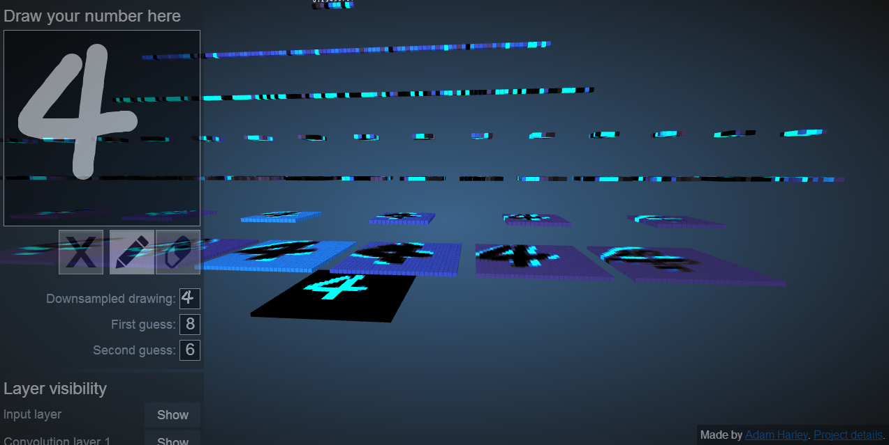
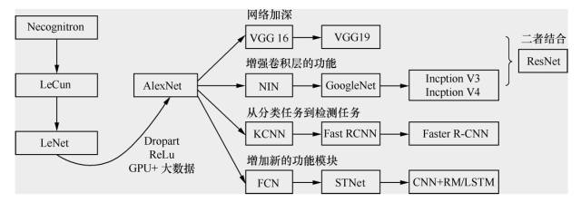
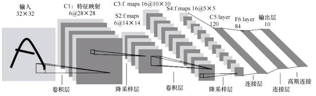
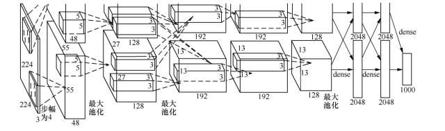
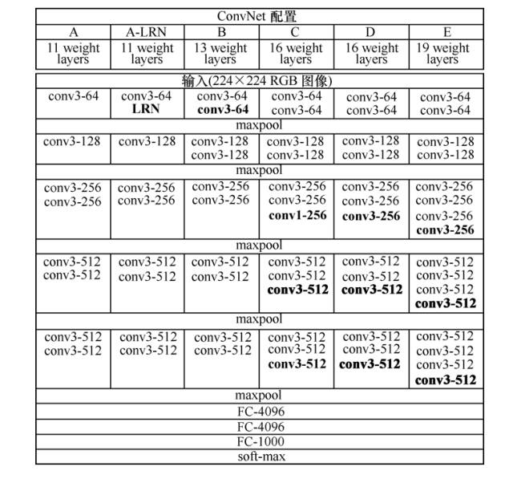
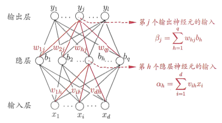

# CNN卷积神经网络

* [返回顶层目录](../../SUMMARY.md#目录)
* [卷积](#卷积)
* [池化](#池化)

- [损失函数](#损失函数)
- [CNN训练原理](#CNN训练原理)
- [预防过拟合](#预防过拟合)

[CNN卷积神经网络分析](https://zhuanlan.zhihu.com/p/36915223)

# 什么是卷积神经网络

看这个

如何理解卷积神经网络（CNN）中的卷积和池化？

题主在学习ML的过程中发现，在CNN的诸多教程与论文当中对卷积和池化的介绍都不如其他方面直观和易于理解，这个领域对我来说一直是一个黑箱，除了能简单掌握Tensorflow和Theano等的接口函数的使用之外，一直无法对这方面有一个系统的了解。
因此希望能更加系统和直观地理解这两个方面。

可以看看这篇文章《[An Intuitive Explanation of Convolutional Neural Networks](https://ujjwalkarn.me/2016/08/11/intuitive-explanation-convnets/)》，感觉讲的还挺详细
翻译版：[[翻译\] 神经网络的直观解释](http://www.hackcv.com/index.php/archives/104/?hmsr=toutiao.io&utm_medium=toutiao.io&utm_source=toutiao.io)

[深度卷积神经网络演化历史及结构改进脉络-40页长文全面解读](https://mp.weixin.qq.com/s?__biz=MzU4MjQ3MDkwNA==&mid=2247484037&idx=1&sn=13ad0d521b6a3578ff031e14950b41f4&chksm=fdb69f12cac11604a42ccb37913c56001a11c65a8d1125c4a9aeba1aed570a751cb400d276b6&scene=0#rd)

[入门 | 一文看懂卷积神经网络](https://mp.weixin.qq.com/s?__biz=MzA5ODUxOTA5Mg==&mid=2652557859&idx=1&sn=ad930ee2f1225b68750f6ba85d6c54ee&chksm=8b7e2378bc09aa6ebb8fc34fe51c9ffd7d644d98ead2c8de585d1394ff7e86dfc1ad1f4445ad&scene=0#rd)

# 感性认识

http://scs.ryerson.ca/~aharley/vis/conv/

[卷积网络背后的直觉](https://zhuanlan.zhihu.com/p/37657943)

[能否对卷积神经网络工作原理做一个直观的解释？](https://www.zhihu.com/question/39022858)

[机器视角：长文揭秘图像处理和卷积神经网络架构](https://mp.weixin.qq.com/s?__biz=MzA3MzI4MjgzMw==&mid=2650728746&idx=1&sn=61e9cb824501ec7c505eb464e8317915&scene=0#wechat_redirect)

[An Intuitive Explanation of Convolutional](https://ujjwalkarn.me/2016/08/11/intuitive-explanation-convnets/)

# 卷积神经网络的发展历程

卷积神经网络的发展过程如图所示：

卷积神经网络发展的起点是神经认知机(neocognitron)模型，当时已经出现了卷积结构。第一个卷积神经网络模型诞生于1989年，其发明人是 LeCun。学习卷积神经网络的读本是 Lecun的论文，在这篇论文里面较为详尽地解释了什么是卷积神经网络，并且阐述了为什么要卷积，为什么要降采样，径向基函数(radial basis function，RBF)怎么用，等等。

1998年 LeCun 提出了 LeNet，但随后卷积神经网络的锋芒逐渐被 SVM 等手工设计的特征的分类器盖过。随着 ReLU 和 Dropout 的提出，以及GPU和大数据带来的历史机遇，卷积神经网络在2012年迎来了历史性突破—AlexNet。

如图所示，AlexNet 之后卷积神经网络的演化过程主要有4个方向的演化：

- 一个是网络加深；
- 二是增强卷积层的功能；
- 三是从分类任务到检测任务；
- 四是增加新的功能模块。

如上图，分别找到各个阶段的几个网络的论文，理解他们的结构和特点之后，在 TensorFlow Models 下，都有对这几个网络的实现。

对着代码理解，并亲自运行。随后在自己的数据集上做一做 finetune，会对今后工业界进行深度学习网络的开发流程有个直观的认识。

下面就简单讲述各个阶段的几个网络的结构及特点。

## 网络加深

### LeNet

> LeNet 的论文《GradientBased Learning Applied to Document  Recognition》
>
> http://vision.stanford.edu/cs598_spring07/papers/Lecun98.pdf
>
> LeCun的LeNet个人网站
>
> http://yann.lecun.com/exdb/lenet/index.html

LeNet包含的组件如下。

- 输入层：32×32
- 卷积层：3个
- 降采样层：2个
- 全连接层：1个
- 输出层（高斯连接）：10个类别（数字0～9的概率）

LeNet的网络结构如图所示：

下面就介绍一下各个层的用途及意义。

- 输入层。输入图像尺寸为32×32。这要比MNIST数据集中的字母（28×28）还大，即对图像做了预处理 reshape 操作。这样做的目的是希望潜在的明显特征，如笔画断续、角点，能够出现在最高层特征监测卷积核的中心。
- 卷积层(C1, C3, C5)。卷积运算的主要目的是使原信号特征增强，并且降低噪音。在一个可视化的在线演示示例中，我们可以看出不同的卷积核输出特征映射的不同，如图所示。
- 下采样层(S2, S4)。下采样层主要是想降低网络训练参数及模型的过拟合程度。通常有以下两种方式。
  - 最大池化(max pooling)：在选中区域中找最大的值作为采样后的值。
  - 平均值池化(mean pooling)：把选中的区域中的平均值作为采样后的值。
- 全连接层(F6)。F6是全连接层，计算输入向量和权重向量的点积，再加上一个偏置。随后将其传递给sigmoid函数，产生单元i的一个状态。
- 输出层。输出层由欧式径向基函数(Euclidean radial basis function)单元组成，每个类别(数字的0～9)对应一个径向基函数单元，每个单元有84个输入。也就是说，每个输出 RBF 单元计算输入向量和该类别标记向量之间的欧式距离。距离越远，RBF 输出越大。

经过测试，采用 LeNet，6万张原始图片的数据集，错误率能够降低到0.95%；54万张人工处理的失真数据集合并上6万张原始图片的数据集，错误率能够降低到0.8%。

接着，历史转折发生在2012年，Geoffrey Hinton 和他的学生 Alex Krizhevsky 在 ImageNet 竞赛中一举夺得图像分类的冠军，刷新了图像分类的记录，通过比赛回应了对卷积方法的质疑。比赛中他们所用网络称为 AlexNet。

### AlexNet

AlexNet 在2012年的 ImageNet 图像分类竞赛中，Top-5错误率为15.3%；2011年的冠军是采用基于传统浅层模型方法，Top-5错误率为25.8%。AlexNet 也远远超过2012年竞赛的第二名，错误率为26.2%。AlexNet 的论文详见 Alex Krizhevsky、Ilya Sutskever 和 Geoffrey E．Hinton 的[《ImageNet Classification with Deep Convolutional Neural Networks》](https://papers.nips.cc/paper/4824-imagenet-classification-with-deep-convolutional-neural-networks.pdf)。

AlexNet 的结构如图所示。图中明确显示了两个 GPU 之间的职责划分：一个 GPU 运行图中顶部的层次部分，另一个 GPU 运行图中底部的层次部分。GPU 之间仅在某些层互相通信。

AlexNet 由5个卷积层、5个池化层、3个全连接层，大约5000万个可调参数组成。最后一个全连接层的输出被送到一个1000维的 softmax 层，产生一个覆盖1000类标记的分布。

AlexNet 之所以能够成功，让深度学习卷积的方法重回到人们视野，原因在于使用了如下方法：

- 防止过拟合：Dropout、数据增强(data augmentation)。
- 非线性激活函数：ReLU。
- 大数据训练：120万(百万级)ImageNet图像数据。
- GPU 实现、LRN(local responce normalization)规范化层的使用。

要学习如此多的参数，并且防止过拟合，可以采用两种方法：数据增强和 Dropout。

数据增强：增加训练数据是避免过拟合的好方法，并且能提升算法的准确率。当训练数据有限的时候，可以通过一些变换从已有的训练数据集中生成一些新数据，来扩大训练数据量。通常采用的变形方式以下几种，具体效果如图所示。

- 水平翻转图像(又称反射变化，flip)。
- 从原始图像(大小为256×256)随机地平移变换(crop)出一些图像(如大小为224×224)。
- 给图像增加一些随机的光照(又称光照、彩色变换、颜色抖动)。

Dropout。AlexNet 做的是以0.5的概率将每个隐层神经元的输出设置为0。以这种方式被抑制的神经元既不参与前向传播，也不参与反向传播。因此，每次输入一个样本，就相当于该神经网络尝试了一个新结构，但是所有这些结构之间共享权重。因为神经元不能依赖于其他神经元而存在，所以这种技术降低了神经元复杂的互适应关系。因此，网络需要被迫学习更为健壮的特征，这些特征在结合其他神经元的一些不同随机子集时很有用。如果没有 Dropout，我们的网络会表现出大量的过拟合。Dropout 使收敛所需的迭代次数大致增加了一倍。

Alex 用非线性激活函数 relu 代替了 sigmoid，发现得到的 SGD 的收敛速度会比 sigmoid/tanh 快很多。单个 GTX 580 GPU 只有3 GB 内存，因此在其上训练的数据规模有限。从 AlexNet 结构图可以看出，它将网络分布在两个 GPU 上，并且能够直接从另一个 GPU 的内存中读出和写入，不需要通过主机内存，极大地增加了训练的规模。

## 增强卷积层的功能

### VGGNet

VGGNet 可以看成是加深版本的 AlexNet，参见 Karen Simonyan 和 Andrew Zisserman 的论文[《Very Deep Convolutional Networks for Large-Scale Visual Recognition》](https://arxiv.org/pdf/1409.1556.pdf)。

VGGNet 和下文中要提到的 GoogLeNet 是2014年 ImageNet 竞赛的第二名和第一名，Top-5错误率分别为7.32%和6.66%。VGGNet 也是5个卷积组、2层全连接图像特征、1层全连接分类特征，可以看作和 AlexNet 一样总共8个部分。根据前5个卷积组，VGGNet 论文中给出了 A～E 这5种配置，如图所示。卷积层数从8（A 配置）到16（E 配置）递增。VGGNet 不同于 AlexNet 的地方是：VGGNet 使用的层更多，通常有16～19层，而 AlexNet 只有8层。

### GoogLeNet

提到 GoogleNet，我们首先要说起 NIN(Network in Network)的思想(详见 Min Lin 和 Qiang Chen 和 Shuicheng Yan 的论文[《Network In Network》](https://arxiv.org/pdf/1312.4400.pdf))，它对传统的卷积方法做了两点改进：将原来的线性卷积层(linear convolution layer)变为多层感知卷积层(multilayer perceptron)；将全连接层的改进为全局平均池化。这使得卷积神经网络向另一个演化分支—增强卷积模块的功能的方向演化，2014年诞生了 GoogLeNet(即 Inception V1)。谷歌公司提出的 GoogLeNet 是2014年 ILSVRC 挑战赛的冠军，它将 Top-5的错误率降低到了6.67%。GoogLeNet 的更多内容详见 Christian Szegedy 和 Wei Liu 等人的论文[《Going Deeper with Convolutions》](https://arxiv.org/pdf/1409.4842.pdf)。

GoogLeNet 的主要思想是围绕“深度”和“宽度”去实现的。

- 深度。层数更深，论文中采用了22层。为了避免梯度消失问题，GoogLeNet 巧妙地在不同深度处增加了两个损失函数来避免反向传播时梯度消失的现象。
- 宽度。增加了多种大小的卷积核，如1×1、3×3、5×5，但并没有将这些全都用在特征映射上，都结合起来的特征映射厚度将会很大。但是采用了[论文](https://arxiv.org/pdf/1409.4842.pdf)中Figure2右侧所示的降维的 Inception 模型，在3×3、5×5卷积前，和最大池化后都分别加上了1×1的卷积核，起到了降低特征映射厚度的作用。

# 卷积

一文全解深度学习中的卷积

https://zhuanlan.zhihu.com/p/36742352

[卷积特征提取](http://deeplearning.stanford.edu/wiki/index.php/%E5%8D%B7%E7%A7%AF%E7%89%B9%E5%BE%81%E6%8F%90%E5%8F%96)

CNN（卷积神经网络），它的基本假设是特征的不同维度之间有局部相关性，卷积操作可以抓住这只局部相关性，形成新的特征。比如自然语言里，有重复出现的bigram，或者图像里代表性的局部像素块。不满足这种局部相关性的数据，比如收到的邮件序列，这种局部相关性很弱，那用CNN就不能抓到有用的特征。作者：李韶华链接：https://www.zhihu.com/question/46301335/answer/112354887来源：知乎著作权归作者所有。商业转载请联系作者获得授权，非商业转载请注明出处。

[哪位高手能解释一下卷积神经网络的卷积核？](https://www.zhihu.com/question/52237725/answer/172479030)

**Convolution Kernel 的意义**

Convolution Kernel 其实在图像处理中并不是新事物，Sobel 算子等一系列滤波算子，一直都在被用于边缘检测等工作中，只是以前被称为 Filter。做图像处理的同学应该有印象。

Convolution Kernel 具有的一个属性就是局部性。即它只关注局部特征，局部的程度取决于 Convolution Kernel 的大小。比如用 Sobel 算子进行边缘检测，本质就是比较图像邻近像素的相似性。

也可以从另外一个角度理解 Convolution Kernel 的意义。学过信号处理的同学应该记得，时域卷积对应频域相乘。所以原图像与 Convolution Kernel 的卷积，其实是对频域信息进行选择。比如，图像中的边缘和轮廓属于是高频信息，图像中某区域强度的综合考量属于低频信息。在传统图像处理里，这是指导设计 Convolution Kernel 的一个重要方面。

[[CV] 通俗理解『卷积』——从傅里叶变换到滤波器](https://zhuanlan.zhihu.com/p/28478034)

# 池化

[池化](http://deeplearning.stanford.edu/wiki/index.php/%E6%B1%A0%E5%8C%96)

池化层是干什么的呢？池化，英文是pooling，字面上看挺难懂，但其实这可能是CNN里最简单的一步了。我们可以不按字面理解，把它理解成下采样（subsampling）。池化分为最大值池化和平均值池化，和卷积差不多，也是取一小块区域，比如一个5*5的方块，如果是最大值池化，那就选这25个像素点最大的那个输出，如果是平均值池化，就把25个像素点取平均输出。

这样做有什么好处呢？1、应该很明显可以看出，图像经过了下采样尺寸缩小了，按上面的例子，原来5*5的一个区域，现在只要一个值就表示出来了！2、增强了旋转不变性，池化操作可以看做是一种强制性的模糊策略，举个不恰当的例子，假设一个猫的图片，猫的耳朵应该处于左上5x5的一个小区域内（实际上猫的耳朵不可能这么小），无论这个耳朵如何旋转，经过池化之后结果都是近似的，因为就是这一块取平均和取最大对旋转并不care。

当然和之前的卷积一样，池化也是层层递进的，底层的池化是在模糊底层特征，如线条等，高层的池化模糊了高级语义特征，如猫耳朵。所以，一般的CNN架构都是三明治一样，卷积池化交替出现，保证提取特征的同时也强制模糊增加特征的旋转不变性。

# 损失函数

贝叶斯眼里的正则化

https://zhuanlan.zhihu.com/p/32685118

总结一下，交叉熵损失函数（cross entropy loss），其本质就是最大似然估计MLE，而正则化等价于MLE加上**先验分布**。所以，从贝叶斯角度来看，损失函数＋正则化就是贝叶斯最大后验估计MAP。

# CNN训练原理

[卷积神经网络算法的实现](https://blog.csdn.net/qq_31780525/article/details/71389982)

《[Notes on Convolutional Neural Networks](http://web.mit.edu/jvb/www/papers/cnn_tutorial.pdf)》，这是Jake Bouvrie在2006年写的关于CNN的训练原理，虽然文献老了点，不过对理解经典CNN的训练过程还是很有帮助的。该作者是剑桥的研究认知科学的。本文参照了这篇翻译《[Notes on Convolutional Neural Networks翻译](https://blog.csdn.net/zouxy09/article/details/9993371)》，并在此基础上增加了自己的修改。

## 概要

主要讲了CNN的Feedforward Pass和Backpropagation Pass，关键是卷积层和polling层的BP推导讲解。

## 引言

这个文档是为了讨论CNN的推导和执行步骤的，并加上一些简单的扩展。因为CNN包含着比权重还多的连接，所以结构本身就相当于实现了一种形式的正则化了。另外CNN本身因为结构的关系，也具有某种程度上的平移不变性。这种特别的NN可以被认为是以数据驱动的形式在输入中可以自动学习过滤器来自动的提取特征。我们这里提出的推导是具体指2D数据和卷积的，但是也可以无障碍扩展到任意维度上。

我们首先以在全连接网络上说明经典的Bp是如何工作的，然后介绍了在2DCNN中BP是如何在过滤器和子采样层上进行权值更新的。通过这些论述，我们强调了模型实际执行的高效的重要性，并给出一小段MATLAB代码来辅助说明这些式子。当然在CNN上也不能过度的夸大高效代码的重要性（毕竟结构放在那里了，就是很慢的）。接下来就是讨论关于如何将前层学到的特征图自动组合的主题，并具体的考虑学习特征图的稀疏组合问题。

免责声明：这个粗糙的笔记可能包含错误，各位看官且看且谨慎。（论文作者本人的免责声明，并非译者）。

## 用BP训练全连接网络

在许多文献中，可以发现经典的CNN是由卷积和子采样操作互相交替组成的，然后在最后加上一个普通的多层网络的结构：最后几层（最靠经输出层的部分）是全连接1D层。当准备好将最后的2D特征图作为输入馈送到这个全连接1D网络的时候，也能很方便的将所有的输出图中表现的特征连接到一个长输入向量中，并往回使用BP进行训练。这个标准的BP算法将会在具体介绍CNN的情况之前介绍（【1】中有更详细的介绍）。

### 前向传播

在推导过程中，我们的损失函数采用的是误差平方和损失函数。对于一个有着c个类别和N个训练样本的多类问题，这个损失函数形式如下：

$$
E^N=\frac{1}{2}\sum_{n=1}^N\sum_{k=1}^c(t_k^n-y_k^n)^2\quad\quad\quad\quad\quad(1)
$$
这里$t_k^n$是第n个样本相对应的目标（标签）的第k维，$y_k^n$是由模型的第n个样本预测得到的目标（标签）的第k维。对于多分类问题，这个目标通常是以“one-of-c”编码的形式存在的，当$x^n$是属于第k类的，那么$t^n$的第k个元素就是正的，其他的元素就是0或者是负的（这取决于激活函数的选择）。

 因为在整个训练集上的误差只是简单的将每个样本产生的误差进行相加得到的，所以这里先在单个样本（第n 个）上用BP来做讲解：

$$
E^n=\frac{1}{2}\sum_{k=1}^c(t_k^n-y_k^n)^2=\frac{1}{2}\left \| t^n-y^n \right \|_2^2\quad\quad\quad\quad\quad(2)
$$
在普通的全连接网络上，我们能够用下面的BP规则的形式来对E求关于权重的偏导。 这里$l$指示当前的第几层，输出层为第L层，而输入层（原始数据层）为第1层。这里第$l$层（当前层）的输出是：

$$
x^l=f(u^l),\quad \text{with } u^l=W^lx^{l-1}+b^l\quad\quad\quad\quad\quad(3)
$$
这里，当前层的W是指当前层输入一侧的权值，而不是当前层输出一侧的权值（那是下一层的W了）。这里输出的激活函数 f（**·**）通常选择逻辑（sigmoid）函数
$$
f(x)=\frac{1}{1+e^{-\beta x}}
$$
或者双曲线tangent函数f(x)=a·tanh(b·x)。这个逻辑函数可以将[-∞，+∞]的数映射到[0，1]，而这个双曲线tangent函数可以将[-∞，+∞]的数映射到[-a，+a]。因此双曲线tangent函数的输出通常是靠近0 ，而sigmoid函数的输出通常是非0的。然而对训练数据进行归一化到0均值和单位方差（方差为1）可以在梯度下降上改善收敛。在基于一个归一化的数据集上，通常更喜欢选择双曲线tangent函数。LeCun建议a=1.7159；b=2/3。这样非线性最大化的点会出现在f(±1)=±1，因此当期望的训练目标以值±1进行归一化的时候，就可以可以避免在训练的时候饱和的问题（估计就是防止训练目标分布的太集中在0周围了，这样可以使它们更加合理的分布）。

### 反向传播

网络中我们需要后向传播的“ 误差”可以被认为是关于有偏置项扰动的每个单元的 “灵敏度”（这个解释来自于Sebastian Seung）。也就是说：

$$
\frac{\partial E}{\partial b}=\frac{\partial E}{\partial u}\frac{\partial u}{\partial b}=\delta\quad\quad\quad\quad\quad(4)
$$
这里，u是当前层的输入，具体如公式3所示。

$$
x^l=f(u^l),\quad \text{with } u^l=W^lx^{l-1}+b^l\quad\quad\quad\quad\quad(3)
$$
因为
$$
\frac{\partial u}{\partial b}=1
$$
，所以偏置的灵敏度其实等于一个单元的所有输入产生的误差偏导。下面的就是从高层到低层的BP：

$$
\delta^l=\left[\left(W^{l+1}\right)^T\delta_{l+1}\right]\ \text{o}\ f'(u^l)\quad\quad\quad\quad\quad(5)
$$
这里的“o” 表示是逐元素相乘的，相当于matlab中的矩阵按各元素位置的点乘：C=A.*B。

上式怎么理解呢？上式的左边是当前层$l$的输入u对误差的偏导，这是BP算法的难点，但是这个如果对BP算法有所了解的话应该很好理解。我们对照着下图来理解公式(5)

假设$l+1$层有m个神经元，$l$层有n个神经元，我们先对第$l$层的第h个神经元的输入求导，这个只要搞懂了，然后就很容易扩展为对第$l$层整个n个神经元求导了。

先对第$l$层的第h个神经元的输入求导：
$$
\begin{aligned}
\delta_h^l=\frac{\partial E}{\partial u_h^l}&=\frac{\partial E}{\partial x_h^l}\cdot \frac{\partial x_h^l}{\partial u_h^l}\\
&=\left[\sum_{j=1}^m\left(\frac{\partial E}{\partial u_j^{l+1}}\cdot \frac{\partial u_j^{l+1}}{\partial x_h^l}\right)\right]f'(u^l_h)\\
&=\left[\sum_{j=1}^m\left(\delta_j^{l+1}\cdot W_{hj}^{l+1}\right)\right]f'(u^l_h)\\
&=
\begin{bmatrix}
W_{h1}^{l+1} & W_{h2}^{l+1}  & ... & W_{hj}^{l+1}  & ... & W_{hm}^{l+1}
\end{bmatrix}\begin{bmatrix}
\delta_1^{l+1}\\
\delta_2^{l+1}\\
...\\
\delta_j^{l+1}\\
...\\
\delta_m^{l+1}\\
\end{bmatrix}
f'(u^l_h)
\end{aligned}
$$
然后容易扩展为对第$l$层整个n个神经元求导：
$$
\begin{aligned}
\delta^l=\frac{\partial E}{\partial u^l}
&=
\begin{bmatrix}
\delta_1^l\\ \delta_2^l\\ ... \\ \delta_h^l\\ ...\\ \delta_n^l
\end{bmatrix}\\
&=
\begin{bmatrix}
W_{11}^{l+1} & W_{12}^{l+1}  & ... & W_{1j}^{l+1}  & ... & W_{1m}^{l+1}\\
W_{21}^{l+1} & W_{22}^{l+1}  & ... & W_{2j}^{l+1}  & ... & W_{2m}^{l+1}\\
...& ...& ...& ...& ...& ...\\ 
W_{h1}^{l+1} & W_{h2}^{l+1}  & ... & W_{hj}^{l+1}  & ... & W_{hm}^{l+1}\\
...& ...& ...& ...& ...& ...\\ 
W_{n1}^{l+1} & W_{n2}^{l+1}  & ... & W_{nj}^{l+1}  & ... & W_{nm}^{l+1}\\
\end{bmatrix}\begin{bmatrix}
\delta_1^{l+1}\\
\delta_2^{l+1}\\
...\\
\delta_j^{l+1}\\
...\\
\delta_m^{l+1}\\
\end{bmatrix}
\text{o}
\begin{bmatrix}
f'(u^l_1)\\ 
f'(u^l_2)\\ 
...\\
f'(u^l_h)\\
...\\
f'(u^l_n)
\end{bmatrix}\\
&=\left(W^{l+1}\right)^T\delta^{l+1}\ \text{o}\ f'(u^l)
\end{aligned}
$$

其中，
$$
\begin{aligned}
&W^{l+1}\text{为}[m\times n]\text{维向量,}\text{是}l+1\text{层神经元的输入权重,}m\text{是}l+1\text{层神经元的个数,}n\text{是}l\text{层神经元的个数;}\\
&\delta^{l+1}\text{为}[m\times 1]\text{维向量,}m\text{是}l+1\text{层神经元的个数;}\\
&f'(u^l)\text{是}[n\times 1]\text{维向量了}\\
\end{aligned}
$$

$$
E^n=\frac{1}{2}\sum_{k=1}^c(t_k^n-y_k^n)^2=\frac{1}{2}\left \| t^n-y^n \right \|_2^2\quad\quad\quad\quad\quad(2)
$$

对于公式(2)中的误差函数，输出层神经元的灵敏度如下：
$$
\delta^L=f'(u^L)\ \text{o}\ (y^n-t^n)\quad\quad\quad\quad\quad(6)
$$
最后，关于一个指定的神经元的权重的更新的求导规则仅仅就是该神经元的输入乘上该神经元的δ进行缩放罢了（其实就是如下面公式7的两个相乘而已）。在向量的形式中，这相当于输入向量（前层的输出）和灵敏度向量的外积：

因为如公式(3)所示：
$$
u^l=W^lx^{l-1}+b^l\quad\quad\quad\quad\quad(3)
$$
所以有：

$$
\begin{aligned}
\frac{\partial E}{\partial W^l}&=\frac{\partial E}{\partial u^l}\frac{\partial u^l}{\partial x^{l-1}}=x^{l-1}(\delta^l)^T\\
&=\begin{bmatrix}
x_1^{l-1} \\ x_2^{l-1} \\ ... \\ x_h^{l-1} \\ ... \\ x_n^{l-1}
\end{bmatrix}\begin{bmatrix}
\delta_1^l & \delta_2^l & ... & \delta_j^l & ... & \delta_m^l
\end{bmatrix}\\
&=\begin{bmatrix}
x_{1}^{l-1}\delta_1^l & x_{1}^{l-1}\delta_2^l  & ... & x_{1}^{l-1}\delta_j^l  & ... & x_{1}^{l-1}\delta_m^l\\
x_{2}^{l-1}\delta_1^l & x_{2}^{l-1}\delta_2^l & ... & x_{2}^{l-1}\delta_j^l  & ... & x_{2}^{l-1}\delta_m^l\\
...& ...& ...& ...& ...& ...\\ 
x_{h}^{l-1}\delta_1^l & x_{h}^{l-1}\delta_2^l  & ... & x_{h}^{l-1}\delta_j^l  & ... & x_{h}^{l-1}\delta_m^l\\
...& ...& ...& ...& ...& ...\\ 
x_{n}^{l-1}\delta_1^l & x_{n}^{l-1}\delta_2^l  & ... & x_{n}^{l-1}\delta_j^l  & ... & x_{n}^{l-1}\delta_m^l\\
\end{bmatrix}
\end{aligned}\quad\quad\quad\quad\quad(7)
$$

$$
\Delta W^l=-\eta\frac{\partial E}{\partial W^l}\quad\quad\quad\quad\quad(8)
$$

和公式(4)的偏置更新的表现形式相类似。在实际操作中这里的学习率一般是每个权重都有不同的学习率$η_{ij}$。

## CNN

通常卷积层都是有子采样层的附加以此来减少计算时间并且逐步的建立更深远的空间和构型的不变性。在照顾特异性的同时也需要一个小的子采样因子，当然这个不是新方法，但是这个概念却简单而又有效。哺乳动物的视觉皮层和在【12 8 7】中的模型着重的介绍了这些方面，在过去的10年中听觉神经科学的发展让我们知道在不同动物的皮层上primary和belt听觉领域中有相同的设计模型【6 11 9】。层级分析和学习结构也许就是听觉领域获得成功的关键。

### 卷积层

这里接着谈论网络中关于卷积层的BP更新。在一个卷积层中，先用可学习的卷积核对前层的特征图进行卷积，然后再通过**激活函数**来得到输出特征图。每个输出图可能是由多个输入图的卷积组合而成的。一般有：

$$
X_j^l=f\left(\sum_{i\in M_j}x_i^{l-1}*k_{ij}^l+b_j^l\right)\quad\quad\quad\quad\quad(9)
$$
这里Mj表示所选的输入图的集合，在MATLAB中这里的卷积是“valid”边缘处理的。那么到底选择哪些输入图呢？通常对输入图的选择包括选择“所有两个的组合”或者是“所有三个的组合”，但是下面会讨论如何去自动选择需要组合的特征图。每个输出图都有个额外的偏置b，然而对于一个特定的输出图来说，卷积每个输入图的卷积核是不一样的。也就是说如果输出图j和k都是在输入图i上相加得到的，输出图j应用在图i上的卷积核是和输出图k应用在图i上的卷积核是不同的。

#### 计算梯度

我们假设每个卷积层l后面都跟着一个下采样层l+1。在BP算法中，根据上文的反向传播算法，我们知道，要想求得层l的每个神经元的灵敏度，就需要先计算与当前层中这个节点相关联的下一层的所有单元的灵敏度$δ_h^{l+1}$之和，并分别乘以对应的下一层（第l+1层）与这个单元之间的权重参数$W_h^{l+1}$，其总和就是传递到这一层这个单元的灵敏度。并用当前层l的该神经元节点h的输入$u_h^l$的激活函数f的偏导乘以这个量就是第l层中当前单元h的灵敏度$δ_h^l$了：
$$
\delta_h^l=\left(W_h^{l+1}\right)^T\delta_h^{l+1}\text{o}\ f'(u_h^l)\quad\quad\quad\quad\quad(10)
$$
（这里所要表达的就是BP的想法，如果熟悉BP那么这里比较绕口的意思就能很好的明白了）。

在一个卷积层并后面跟个下采样层的情况中，在下采样层中所关联的灵敏度图δ（特征图中每个像素对应一个灵敏度，所以也组成一个图）中的一个像素对应着卷积层输出图中的像素块（后来的池化的想法）。因此在第l层中的一个图上的每个单元只与第l+1层中相对应的图中的一个单元相连（多对一的关系）。为了高效的计算第l层的灵敏度，我们可以对下采样层中的敏感图进行上采样去保证与卷积层的图具有相同的尺寸，随后只需要将第l+1层中的上采样灵敏度图与第l层中的激活函数偏导图逐元素相乘即可（也就是公式5）。
$$
\delta^l=\left[\left(W^{l+1}\right)^T\delta_{l+1}\right]\ \text{o}\ f'(u^l)\quad\quad\quad\quad\quad(5)
$$
在下采样层图中定义的“权重”全等于β（一个常量，见"子采样层"小节），所以只是将前面步骤的结果用β来进行缩放以达到计算第l层的灵敏度δ^l的结果。我们能在卷积层的每个图j中进行同样的计算，并用子采样层中相对应的图进行搭配：
$$
\delta_j^l=\beta_j^{l+1}\left(f'(u_j^l)\text{ o up}\left(\delta_j^{l+1}\right)\right)\quad\quad\quad\quad\quad(11)
$$
其中，up( )函数表示一个上采样操作。如果下采样的采样因子是n的话，它简单的将每个像素水平和垂直方向上拷贝n次。正如我们下面要讨论的那样，这个函数可以用Kronecker乘积来实现：
$$
\text{up}(x)=x\bigotimes1_{n\times n}\quad\quad\quad\quad\quad(12)
$$
ok，现在我们得到了给定图的灵敏度，下面我们可以立即计算bias的梯度了：简单地将层l中的灵敏度图j中的所有节点相加：
$$
\frac{\partial E}{\partial b_j}=\sum_{u,v}\left(\delta_j^l\right)_{uv}\quad\quad\quad\quad\quad(13)
$$
最后，对卷积核的权值的梯度就可以用BP算法来计算了（公式(8)）。
$$
\Delta W^l=-\eta\frac{\partial E}{\partial W^l}\quad\quad\quad\quad\quad(8)
$$
另外，很多连接的权值是共享的。因此，对于一个给定的权值，我们需要对所有与该权值有联系（权值共享的连接）的连接对该点求梯度，然后对这些梯度进行求和，就像上面对bias的梯度计算一样：
$$
\frac{\partial E}{\partial k_{ij}^l}=\sum_{u,v}\left(\delta_j^l\right)_{uv}\left(p_i^{l-1}\right)_{uv}\quad\quad\quad\quad\quad(14)
$$
其中，
$$
\left(p_i^{l-1}\right)_{uv}
$$
是
$$
x_i^{l-1}
$$
中的在卷积的时候与
$$
k_{ij}^l
$$
逐元素相乘的图上的那一小块图（比如5x5），输出卷积图$x_j^l$的(u,v)位置的值是由上一层的(u,v)位置的块图与卷积核k_ij逐元素相乘的结果。

乍一看，好像我们需要煞费苦心地记住输出图（和对应的灵敏度图）中每个像素对应于输入图的那个块图。但实际上，在Matlab中，式(14)可以通过一个代码就实现。对于上面的公式，可以用Matlab的卷积函数来实现：
$$
\frac{\partial E}{\partial k_{ij}^l}=\text{rot180}\left( \text{conv2}\left( x_i^{l-1},\ \text{rot180}(\delta_j^l), \ '\text{valid}' \right) \right)
$$
我们先对δ灵敏度图进行旋转，这样就可以进行互相关计算，而不是卷积（在卷积的数学定义中，特征矩阵（卷积核）在传递给conv2时需要先翻转（flipped）一下。也就是颠倒下特征矩阵的行和列）。然后把输出反旋转回来，这样我们在前向传播进行卷积的时候，卷积核才是我们想要的方向。

### 降采样层

一个降采样层对输入层的图进行降采样。如果有N个输入图，那么一定会有N个输出图，但输出图的尺寸都会变小。更正式的描述为：
$$
x_j^l=f\left(\beta_j^l\ \text{down}(x_j^{l-1})+b_j^l\right)
$$
其中，down( )代表一个降采样函数。典型的操作是，该函数会对输入图像中的各自区分的nxn大小的像素块进行求和，这样的话，输出图就会在两个维度上都缩小了n倍。每一个输出图都有其各自的乘性偏置β和一个加性偏置b。

#### 计算梯度

这里的难点在于计算灵敏度图。只要我们一旦得到灵敏度图，剩下的唯一需要更新的可学习的参数就是乘性偏置β和加性偏置b了。我们假定当前的降采样层的上下层都是卷积层。而如果降采样层的下一层是全连接层，则可以用上面介绍的BP反向传播公式来计算降采样层的灵敏度图。

当我们尝试计算卷积核的梯度时，我们必须要指出输入图的中哪一个图块对应输出图中给定的像素。这里，我们必须指出当前层的灵敏度图中的哪一个图块对应着下一层的灵敏度图中给定的像素，这样才能使用类似公式5（如下式所示）的δ递推。
$$
\delta^l=\left[\left(W^{l+1}\right)^T\delta_{l+1}\right]\ \text{o}\ f'(u^l)\quad\quad\quad\quad\quad(5)
$$
当然，输入块图和输出图像素之间的连接上相乘的权值正是（经过旋转的）卷积核的权值。这也可以用一行代码高效的执行卷积：
$$
\delta_j^l=f'(u_j^l)\text{ o }\text{conv2}\left(\delta_j^{l+1},\text{rot180}(k_j^{l+1}),\text{'full'}\right)
$$
我们依然将卷积核旋转180度，让卷积函数执行交叉关联（互相关计算）。注意在当前这个情况中，我们需要“full”（再次用了matlab里面的术语）卷积边缘处理，这一微小的差异然我们更加容易和高效地处理边缘情况（输入到层l+1中一个单元的数量不是完整的n×n大小的卷积核）。在这些情况中，“full”卷积将自动对缺失的输入补零。

到这里，我们就可以对加性偏置b和乘性偏置β计算梯度了。加性偏置b依然仅仅是灵敏度图中所有元素的加和：
$$
\frac{\partial E}{\partial b_j}=\mathop{\sum}_{u,v}\left(\delta_j^l\right)_{uv}
$$
乘性偏置β必然会涉及到前向传播时在当前层计算的初始降采样图。处于这个原因，在前向计算保存这些图是有利的，这样我们就不必在反向传播时重复计算了。

我们定义：
$$
d_j^l=\text{down}\left(x_j^{l-1}\right)
$$
然后乘性偏置β的梯度为：
$$
\frac{\partial E}{\partial \beta_j}=\sum_{u,v}\left(\delta_j^l\text{ o }d_j^l\right)_{uv}
$$

### 学习特征图的组合

很多时候，通过卷积多个输入图，然后再对这些卷积值求和得到一个输出图，这样的效果往往是比较好的。在一些文献中，一般是人工选择哪些输入图去组合得到一个输出图。但我们这里尝试去让CNN在训练的过程中学习这些组合，也就是让网络自己学习挑选哪些输入图来计算得到输出图才是最好的。我们用αij表示在得到第j个输出图的其中第i个输入图的权值或者贡献。这样，第j个输出图可以表示为：
$$
x_j^l=f\left(\sum_{i=1}^{N_{in}}\alpha_{ij}(x_i^{l-1}*k_i^l)+b_j^l\right)
$$
需要满足约束
$$
\sum_i\alpha_{ij}=1,\quad\text{and}\quad 0\leqslant\alpha_{ij}\leqslant 1
$$
这些受限条件可以通过设置αij变量等于基于一组无约束，潜在权重cij的softmax来实现：
$$
\alpha_{ij}=\frac{\text{exp}(c_{ij})}{\sum_k\text{exp}(c_{kj})}
$$
因为对于一个固定的j来说，每组权值cij都与除第j组以外的其他组的权值是各自独立的，所以为了方面描述，我们把下标j去掉，只考虑一个输出图的更新，其他输出图的更新是一样的过程，只是图的索引j不同而已。

softmax函数的导数为：
$$
\frac{\partial \alpha_k}{\partial c_i}=\delta_{ki}\alpha_i-\alpha_i\alpha_k\quad\quad\quad\quad\quad(15)
$$
这里，δ被作为δ的克罗内克积使用（这里的解释详见[《Softmax函数及其导数》](https://www.itency.com/topic/show.do?id=516703)）。而在等式1中关于层l上的αi变量的偏导是：
$$
\frac{\partial E}{\partial \alpha_i}=\frac{\partial E}{\partial u^l}\frac{\partial u^l}{\partial \alpha_i}=\sum_{u,v}\left(\delta^l\text{ o }(x_i^{l-1}*k_i^l)\right)_{uv}
$$
这里δ^l是敏感性图，就相当于输出图的输入u 。再一次，这里的卷积是“valid”的，这样这个结果才能匹配敏感性图的尺寸。现在我们能使用这个链式法则去计算损失函数（1）关于潜在权重ci的梯度了：

$$
\begin{aligned}
\frac{\partial E}{\partial c_i}&=\sum_k\frac{\partial E}{\partial \alpha_k}\frac{\partial \alpha_k}{\partial c_i}\quad\quad\quad\quad\quad(16)\\
&=\alpha_i\left(\frac{\partial E}{\partial \alpha_i}-\sum_k\frac{\partial E}{\partial \alpha_k}\alpha_k\right)\quad\quad\quad\quad\quad(17)\\
\end{aligned}
$$

#### 加强稀疏组合

为了限制权重αi是稀疏分布的，也就是限制一个输出map只与某些而不是全部的输入maps相连。我们在最终的代价函数里增加正则项罚函数Ω(α)。这样做的时候，我们将鼓励某些权值为零。这样就只有某一些输入图（而不是所有输入图）会贡献到一个给定的输出图中。

对于单个样本，重写代价函数为：
$$
\tilde{E}^n=E^n+\lambda\sum_{i,j}|(\alpha)_{i,j}|\quad\quad\quad\quad\quad(18)
$$
然后，找到该正则化项对权值ci梯度的贡献。用户自定义的超参数λ控制着网络对训练数据的拟合误差最小和正则项中的权值根据L1正则化结果最小之间的权衡。

我们再次只考虑用于给定输出图的权值αi并去掉下标j。首先，我们需要正则化项Ω(α)对αi求导（除了不可导的原点处）
$$
\frac{\partial \Omega}{\partial \alpha_i}=\lambda\text{sign}(\alpha_i)\quad\quad\quad\quad\quad(19)
$$
将上市和式（15）结合，可得正则项Ω(α)对ci的链式求导（即ci对正则项的贡献）
$$
\begin{aligned}
\frac{\partial \Omega}{\partial c_i}&=\sum_k\frac{\partial \Omega}{\partial \alpha_k}\frac{\partial \alpha_k}{\partial c_i}\quad\quad\quad\quad\quad(20)\\
&=\lambda\left( |\alpha_i|-\alpha_i\sum_k|\alpha_k| \right)\quad\quad\quad\quad\quad(21)\\
\end{aligned}
$$
当使用罚函数项（18）时，权值ci最终的梯度通过式（13）和式（9）来计算：
$$
\frac{\partial \tilde{E}^n}{\partial c_i}=\frac{\partial E^n}{\partial c_i}+\frac{\partial \Omega}{\partial c_i}
$$

### 在Matlab中的加速

在带有降采样和卷积层的网络中，主要的计算瓶颈是

1. 在前向传播中：对卷积层的输出图进行降采样
2. 在反向传播中：对上一层的降采样层的敏感度图δ进行上采样，以匹配下一层的卷积层输出图的尺寸大小
3. sigmoid的应用及其求导

当然在前馈和BP阶段中卷积的计算也是瓶颈，但是假设这个2D卷积程序是高效执行的，那么这部分也就没什么可以优化的了。

然而，人们可能会试图使用MATLAB的内置图像处理程序来处理上采样和下采样操作。对于上采样，imresize函数可以做这个工作，但是会有明显的开销。一个更快的可选方法是使用克罗内克积（Kronecker product ）函数kron，通过一个全一矩阵ones来和我们需要上采样的矩阵进行Kronecker乘积，就可以实现上采样的效果。这可以快一个数量级。对于前向传播过程中的下采样，imresize并没有提供在缩小图像的过程中还计算nxn块内像素的和的功能，所以没法用。“ 最近邻”方法仅仅用图块中的一个原始像素来替换整块像素。一个可选方法是用blkproc在每个不同的图块上进行操作，或者将im2col和colfilt组合起来。这些操作都只是计算需要的部分而没有其他的开销，而重复的调用用户自定义的图块处理函数会带来过大的开销。一个更快速的可用方法是用一个全一的矩阵（ones( )）来对图像进行卷积，然后简单的通过标准的索引方法来采样最后卷积结果。例如，如果下采样的域是2x2的，那么我们可以用2x2的元素全是1的卷积核来卷积图像。然后再卷积后的图像中，我们每个2个点采集一次数据，y=x(1:2:end,1:2:end)，这样就可以得到了两倍下采样，同时执行求和的效果。虽然在这种情况下卷积实际上计算的输出数量是我们真正需要的输出的四倍（假设2倍下采样），但这种方法仍然（经验上）比前面提到的方法快一个数量级或更快。

大多数作者执行sigmiod激活函数和他的偏导的时候都是使用inline函数定义的。但是在MATLAB中“inline”的定义和C中的宏定义完全不同，而且还需要大量的时间去评估，因此通常来说是用实际的代码进行替换的。这也是对于代码优化和可读性之间的权衡问题。

## 实际训练问题

### 批量更新VS在线更新

随机梯度下降vs批量学习

### 学习率

LeCun的随机在线方法（diagonal approx to hessian），这值得吗？Viren的观点是：至少对于每层来说有不同的学习率，因为更低层的梯度更小而且更不可靠。LeCun在参考文献【5】中也说了类似的话。

### 损失函数的选择

误差平方（MLE）VS交叉熵 （cross-entropy）。后者在某些分类任务上比前者好。

### 检查求导是否正确

当需要验证你的BP实现（或求导）的代码是否正确时，有限差分是不可缺少的工具（就是UFLDL中每个任务都需要进行cost函数验证的部分）。BP()或者求导写的代码不但容易犯错而且仍然是个需要学习某些东西的网络（这句可忽略）。通过将你写的代码所计算的梯度和有限差分所估计的梯度进行对比，可以验证你是否写错了：

对于单个输入样本，使用二阶有限差分来估计梯度：
$$
\frac{\partial E}{\partial w_i}\approx\frac{E(w_i+\epsilon)-E(w_i-\epsilon)}{2\epsilon}
$$
然后，和你写的BP代码的梯度返回值进行对比。Epsilon应该尽可能的小，但是不要太小而引起数值精度问题。例如ε=10e-8就还不错。应当注意，使用有限差分来训练网络的效率非常低（即对于网络中W权重的时间复杂度为O(W^2））；但是BP反向传播的时间复杂度只有O(W)，所以，虽然BP比较麻烦，但是相比其O(W)的速度优势，使用BP还是值得的。

# 预防过拟合

[激活引入非线性，池化预防过拟合（上）](https://zhuanlan.zhihu.com/p/32793922)

# 参考资料

* [行家 | 如何跨领域成为一位人工智能工程师？](https://blog.csdn.net/u4110122855/article/details/78043171)

"卷积神经网络的发展历程"一节参考了该文。

- [Notes on Convolutional Neural Networks](https://www.cnblogs.com/shouhuxianjian/p/4529202.html)
- [Deep Learning论文笔记之（四）CNN卷积神经网络推导和实现](https://blog.csdn.net/zouxy09/article/details/9993371)

"CNN训练原理"参考了上述博客的翻译。