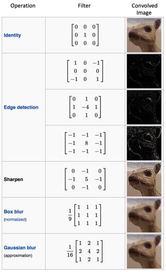

# CNN卷积神经网络

* [返回顶层目录](../../SUMMARY.md#目录)
* [卷积](#卷积)
* [池化](#池化)
* [损失函数](#损失函数)
* [CNN训练原理](#CNN训练原理)
* [预防过拟合](#预防过拟合)

卷积神经网络是一种专门用来处理具有类似网络结构的神剧的神经网络。例如时间序列数据（可以认为是在时间轴上有规律地采样形成的一维网格）和图像数据（可以看作二维的像素网格）。卷积神经网络在诸多应用领域都表现优异。“卷积神经网络”一词表明该网络使用了卷积这种数学运算。卷积是一种特殊的线性运算。**卷积网络是指那些至少在网络的一层中使用卷积运算来替代一般的矩阵乘法运算的神经网络**。

CNN（Convolution Neural Network，卷积神经网络）作为一种经典的DNN结构，上世纪90年代就已经被提出了，却沉寂近20年。有趣的是，在2012年AlexNet大放异彩后，CNN在随后几年近乎卷席了整个图像处理领域，很有点戏剧性。近些年，CNN在语音处理、NLP领域也发展迅速。

CNN其实可以看作DNN的一种特殊形式。它跟传统DNN标志性的区别在于两点，Convolution Kernel以及Pooling。

# 卷积神经网络感性认识

Adam Harley创建了一个卷积神经网络的可视化结果http://scs.ryerson.ca/~aharley/vis/conv/，使用的是MNIST手写数字的训练集。我强烈建议使用它来理解CNN的工作原理。

http://scs.ryerson.ca/~aharley/vis/conv/

# 卷积神经网络的直观解释

这篇文章原地址为[An Intuitive Explanation of Convolutional Neural Networks](https://ujjwalkarn.me/2016/08/11/intuitive-explanation-convnets/)，卷积神经网络的讲解非常通俗易懂。翻译版：[[翻译\] 神经网络的直观解释](http://www.hackcv.com/index.php/archives/104/?hmsr=toutiao.io&utm_medium=toutiao.io&utm_source=toutiao.io)

## 什么是卷积神经网络？为什么它们很重要？

卷积神经网络（ConvNets 或者 CNNs）属于神经网络的范畴，已经在诸如图像识别和分类的领域证明了其高效的能力。卷积神经网络可以成功识别人脸、物体和交通信号，从而为机器人和自动驾驶汽车提供视力。

在上图中，卷积神经网络可以识别场景，也可以提供相关的插图说明（足球运动员正在踢足球）；而下图展示了卷积神经网络可以用来识别日常物体、人和动物。最近，卷积神经网络也在一些自然语言处理任务（比如语句分类）上面展示了良好的效果。

因此，卷积神经网络对于今天大多数的机器学习用户来说都是一个重要的工具。然而，理解卷积神经网络以及首次学习使用它们有时会很痛苦。那本篇博客的主要目的就是让我们对卷积神经网络如何处理图像有一个基本的了解。

如果你是神经网络的新手，我建议你阅读下[这篇短小的多层感知器的教程](https://ujjwalkarn.me/2016/08/09/quick-intro-neural-networks/)，在进一步阅读前对神经网络有一定的理解。在本篇博客中，多层感知器叫做“全连接层”。

## LeNet 架构（1990s）

LeNet是推进深度学习领域发展的最早的卷积神经网络之一。经过多次成功迭代，到 1988 年，Yann LeCun把这一先驱工作命名为[LeNet5](http://yann.lecun.com/exdb/publis/pdf/lecun-01a.pdf)。当时，LeNet架构主要用于字符识别任务，比如读取邮政编码、数字等等。

接下来，我们将会了解LeNet架构是如何学会识别图像的。近年来有许多在LeNet 上面改进的新架构被提出来，但它们都使用了LeNet中的主要概念，如果你对LeNet 有一个清晰的认识，就相对比较容易理解。

上图中的卷积神经网络和原始的LeNet的结构比较相似，可以把输入的图像分为四类：狗、猫、船或者鸟（原始的LeNet主要用于字符识别任务）。正如上图说示，当输入为一张船的图片时，网络可以正确的从四个类别中把最高的概率分配给船（0.94）。在输出层所有概率的和应该为一（本文稍后会解释）。

在上图中的ConvNet有四个主要操作：

1. 卷积
2. 非线性处理（ReLU）
3. 池化或者亚采样
4. 分类（全连接层）

这些操作对于各个卷积神经网络来说都是基本组件，因此理解它们的工作原理有助于充分了解卷积神经网络。下面我们将会尝试理解各步操作背后的原理。

## 图像是像素值的矩阵

本质上来说，每张图像都可以表示为像素值的矩阵：

[通道](https://en.wikipedia.org/wiki/Channel_(digital_image))常用于表示图像的某种组成。一个标准数字相机拍摄的图像会有三通道 - 红、绿和蓝；你可以把它们看作是互相堆叠在一起的二维矩阵（每一个通道代表一个颜色），每个通道的像素值在 0 到 255 的范围内。

[灰度](https://en.wikipedia.org/wiki/Grayscale)图像，仅仅只有一个通道。在本篇文章中，我们仅考虑灰度图像，这样我们就只有一个二维的矩阵来表示图像。矩阵中各个像素的值在0到255的范围内——零表示黑色，255 表示白色。

## 卷积

卷积神经网络的名字就来自于其中的[卷积操作](http://en.wikipedia.org/wiki/Convolution)。卷积的主要目的是为了从输入图像中提取特征。卷积可以通过从输入的一小块数据中学到图像的特征，并可以保留像素间的空间关系。我们在这里并不会详细讲解卷积的数学细节，但我们会试着理解卷积是如何处理图像的。

如我们上面所说，每张图像都可以看作是像素值的矩阵。考虑一下一个5x5的图像，它的像素值仅为0或者1（注意对于灰度图像而言，像素值的范围是0到255，下面像素值为0和1的绿色矩阵仅为特例）：

同时，考虑下另一个3x3的矩阵，如下所示：

接下来，5x5的图像和3x3的矩阵的卷积可以按下图所示的动画一样计算：

现在停下来好好理解下上面的计算是怎么完成的。我们用橙色的矩阵在原始图像（绿色）上滑动，每次滑动一个像素（也叫做“步长”），在每个位置上，我们计算对应元素的乘积（两个矩阵间），并把乘积的和作为最后的结果，得到输出矩阵（粉色）中的每一个元素的值。注意，3x3 的矩阵每次步长中仅可以“看到”输入图像的一部分。

在CNN的术语中，3x3的矩阵叫做“滤波器（filter）”或者“核（kernel）”或者“特征检测器（feature detector）”，通过在图像上滑动滤波器并计算点乘得到矩阵叫做“卷积特征（Convolved Feature）”或者“激活图（Activation Map）”或者“特征图（Feature Map）”。记住滤波器在原始输入图像上的作用是特征检测器。

从上面图中的动画可以看出，对于同样的输入图像，不同值的滤波器将会生成不同的特征图。比如，对于下面这张输入图像：

在下表中，我们可以看到不同滤波器对上图卷积的效果。正如表中所示，通过在卷积操作前修改滤波矩阵的数值，我们可以进行诸如边缘检测、锐化和模糊等操作 —— 这表明不同的滤波器可以从图中检测到不同的特征，比如边缘、曲线等。在[这里的 8.2.4 部分](http://docs.gimp.org/en/plug-in-convmatrix.html)中可以看到更多的例子。

另一个理解卷积操作的好方法是看下面这张图的动画：

滤波器（红色框）在输入图像滑过（卷积操作），生成一个特征图。另一个滤波器（绿色框）在同一张图像上卷积可以得到一个不同的特征图。注意卷积操作可以从原图上获取局部依赖信息。同时注意这两个不同的滤波器是如何从同一张图像上生成不同的特征图。记住上面的图像和两个滤波器仅仅是我们上面讨论的数值矩阵。

在实践中，**CNN会在训练过程中学习到这些滤波器的值**（尽管如此，但我们依然需要在训练前指定诸如滤波器的个数、滤波器的大小、网络架构等参数）。我们使用的滤波器越多，提取到的图像特征就越多，网络所能在未知图像上识别的模式也就越好。

特征图的大小（卷积特征）由下面三个参数控制，我们需要在卷积前确定它们：

- 深度（Depth）：深度对应的是卷积操作所需的滤波器个数。在下图的网络中，我们使用三个不同的滤波器对原始图像进行卷积操作，这样就可以生成三个不同的特征图。你可以把这三个特征图看作是堆叠的2d矩阵，那么，特征图的“深度”就是三。

* 步长（Stride）：步长是我们在输入矩阵上滑动滤波矩阵的像素数。当步长为1时，我们每次移动滤波器一个像素的位置。当步长为2时，我们每次移动滤波器会跳过2个像素。步长越大，将会得到更小的特征图。
* 零填充（Zero-padding）：有时，在输入矩阵的边缘使用零值进行填充，这样我们就可以对输入图像矩阵的边缘进行滤波。零填充的一大好处是可以让我们控制特征图的大小。使用零填充的也叫做泛卷积，不适用零填充的叫做严格卷积。这个概念在下面的参考文献14中介绍的非常详细。

## 激活函数（ReLU）

在上面图中，在每次的卷积操作后都使用了一个叫做ReLU的操作。ReLU表示修正线性单元（Rectified Linear Unit），是一个非线性操作。它的输入如下所示：

ReLU是一个元素级别的操作（应用到各个像素），并将特征图中的所有小于0的像素值设置为零。ReLU的目的是在ConvNet中引入非线性，因为在大部分的我们希望 ConvNet学习的实际数据是非线性的（卷积是一个线性操作——元素级别的矩阵相乘和相加，所以我们需要通过使用非线性函数ReLU 来引入非线性。

ReLU操作可以从下面的图中理解。它展示的ReLU操作是应用到上面那张城市图像得到的特征图之一。这里的输出特征图也可以看作是“修正”过的特征图。

其他非线性函数，比如tanh或者sigmoid也可以用来替代ReLU，但ReLU在大部分情况下表现是更好的。

## 池化操作

空间池化（Spatial Pooling）（也叫做降采用或者下采样）降低了各个特征图的维度，但可以保持大部分重要的信息。空间池化有下面几种方式：最大化、平均化、加和等等。

对于最大池化（Max Pooling），我们定义一个空间邻域（比如，2x2的窗口），并从窗口内的修正特征图中取出最大的元素。除了取最大元素，我们也可以取平均（Average Pooling）或者对窗口内的元素求和。在实际中，最大池化被证明效果更好一些。

下面的图展示了使用2x2窗口在修正特征图（在卷积 + ReLU操作后得到）使用最大池化的例子。

我们以2个元素（也叫做“步长”）滑动我们2x2的窗口，并在每个区域内取最大值。如上图所示，这样操作可以降低我们特征图的维度。

在下图展示的网络中，池化操作是分开应用到各个特征图的（注意，因为这样的操作，我们可以从三个输入图中得到三个输出图）。

下图展示了在上面的图中我们在ReLU操作后得到的修正特征图的池化操作的效果。

池化函数可以逐渐降低输入表示的空间尺度。特别地，池化：

* 使输入表示（特征维度）变得更小，并且网络中的参数和计算的数量更加可控的减小，因此，可以控制过拟合
* 使网络对于输入图像中更小的变化、冗余和变换变得不变性（输入的微小冗余将不会改变池化的输出——因为我们在局部邻域中使用了最大化/平均值的操作
* 帮助我们获取图像最大程度上的尺度不变性（准确的词是“不变性”）。它非常的强大，因为我们可以检测图像中的物体，无论它们位置在哪里（参考18和19获取详细信息）

## 目前为止的故事

到目前为止我们了解了卷积、ReLU和池化是如何操作的。理解这些层是构建任意CNN的基础是很重要的。正如上图所示，我们有两组卷积、ReLU&池化层 —— 第二组卷积层使用六个滤波器对第一组的池化层的输出继续卷积，得到一共六个特征图。接下来对所有六个特征图应用ReLU。接着我们对六个修正特征图分别进行最大池化操作。

这些层一起就可以从图像中提取有用的特征，并在网络中引入非线性，减少特征维度，同时保持这些特征具有某种程度上的尺度变化不变性。

第二组池化层的输出作为全连接层的输入，我们会在下一部分介绍全连接层。

## 全连接层

全连接层是传统的多层感知器，在输出层使用的是softmax激活函数（也可以使用其他像SVM的分类器，但在本文中只使用softmax）。“全连接（Fully Connected）”这个词表明前面层的所有神经元都与下一层的所有神经元连接。如果你对多层感知器不熟悉的话，我推荐你阅读[这篇文章](https://ujjwalkarn.me/2016/08/09/quick-intro-neural-networks/)。

**卷积和池化层的输出表示了输入图像的高级特征。全连接层的目的是为了使用这些特征把输入图像基于训练数据集进行分类**。比如，在下面图中我们进行的图像分类有四个可能的输出结果（注意下图并没有显示全连接层的节点连接）。

除了分类，添加一个全连接层也（一般）是学习这些特征的非线性组合的简单方法。从卷积和池化层得到的大多数特征可能对分类任务有效，但这些特征的组合可能会更好。

从全连接层得到的输出概率和为1。这个可以在输出层使用softmax作为激活函数进行保证。softmax函数输入一个任意大于0值的矢量，并把它们转换为零一之间的数值矢量，其和为一。

## 组合并用反向传播训练

正如上面讨论的，**卷积+池化层的作用是从输入图像中提取特征，而全连接层的作用是分类器**。

注意在下面的图中，因为输入的图像是船，对于船这一类的目标概率是1，而其他三类的目标概率是0，即

* 输入图像 = 船
* 目标矢量 = [0, 0, 1, 0]

完整的卷积网络的训练过程可以总结如下：

* 第一步：我们初始化所有的滤波器，使用随机值设置参数/权重
* 第二步：网络接收一张训练图像作为输入，通过前向传播过程（卷积、ReLU 和池化操作，以及全连接层的前向传播），找到各个类的输出概率
  * 我们假设船这张图像的输出概率是 [0.2, 0.4, 0.1, 0.3]
  * 因为对于第一张训练样本的权重是随机分配的，输出的概率也是随机的
* 第三步：在输出层计算总误差（计算4类的和）
  * Total Error = ∑  ½ (target probability – output probability) ²
* 第四步：使用反向传播算法，根据网络的权重计算误差的梯度，并使用梯度下降算法更新所有滤波器的值/权重以及参数的值，使输出误差最小化
  * 权重的更新与它们对总误差的占比有关
  * 当同样的图像再次作为输入，这时的输出概率可能会是 [0.1, 0.1, 0.7, 0.1]，这就与目标矢量 [0, 0, 1, 0] 更接近了
  * 这表明网络已经通过调节权重/滤波器，可以正确对这张特定图像的分类，这样输出的误差就减小了
  * 像滤波器数量、滤波器大小、网络结构等这样的参数，在第一步前都是固定的，在训练过程中保持不变——仅仅是滤波器矩阵的值和连接权重在更新
* 第五步：对训练数据中所有的图像重复步骤1~4

上面的这些步骤可以**训练**ConvNet——这本质上意味着对于训练数据集中的图像，ConvNet在更新了所有权重和参数后，已经优化为可以对这些图像进行正确分类。

当一张新的（未见过的）图像作为ConvNet的输入，网络将会再次进行前向传播过程，并输出各个类别的概率（对于新的图像，输出概率是使用已经在前面训练样本上优化分类的参数进行计算的）。如果我们的训练数据集非常的大，网络将会（有希望）对新的图像有很好的泛化，并把它们分到正确的类别中去。

注：

1. 上面的步骤已经简化，也避免了数学详情，只为提供训练过程的直观内容。可以参考文献4和12了解数学公式和完整过程。
2. 在上面的例子中我们使用了两组卷积和池化层。然而请记住，这些操作可以在一个ConvNet中重复多次。实际上，现在有些表现最好的ConvNet 拥有多达十几层的卷积和池化层！同时，每次卷积层后面不一定要有池化层。如下图所示，我们可以在池化操作前连续使用多个卷积+ReLU操作。还有，请注意ConvNet的各层在下图中是如何可视化的。

## 卷积神经网络的可视化

一般而言，越多的卷积步骤，网络可以学到的识别特征就越复杂。比如，ConvNet 的图像分类可能在第一层从原始像素中检测出边缘，然后在第二层使用边缘检测简单的形状，接着使用这些形状检测更高级的特征，比如更高层的人脸。下面的图中展示了这些内容——我们使用[卷积深度置信网络](http://web.eecs.umich.edu/~honglak/icml09-ConvolutionalDeepBeliefNetworks.pdf)学习到的特征，这张图仅仅是用来证明上面的内容（这仅仅是一个例子：真正的卷积滤波器可能会检测到对我们毫无意义的物体）。

Adam Harley创建了一个卷积神经网络的可视化结果http://scs.ryerson.ca/~aharley/vis/conv/，使用的是MNIST手写数字的训练集。我强烈建议使用它来理解CNN的工作原理。

我们可以在下图中看到网络是如何识别输入“8” 的。注意下图中的可视化并没有单独展示ReLU操作。

输入图像包含1024个像素（32x32 大小），第一个卷积层（卷积层1）由六个独特的5x5（步长为1）的滤波器组成。如图可见，使用六个不同的滤波器得到一个深度为六的特征图。

卷积层1后面是池化层1，在卷积层1得到的六个特征图上分别进行2x2的最大池化（步长为2）的操作。你可以在池化层上把鼠标移动到任意的像素上，观察在前面卷积层（如上图所示）得到的4x4的小格。你会发现4x4小格中的最大值（最亮）的像素将会进入到池化层。

池化层1后面的是十六个5x5（步长为 1）的卷积滤波器，进行卷积操作。后面就是池化层2，进行2x2的最大池化（步长为2）的操作。这两层的概念和前面描述的一样。

接下来我们就到了三个全连接层。它们是：

* 第一个全连接层有120个神经元
* 第二层全连接层有84个神经元
* 第三个全连接层有10个神经元，对应10个数字——也就做输出层

注意在下图中，输出层中的10个节点的各个都与第二个全连接层的所有100个节点相连（因此叫做全连接）。

同时，注意在输出层那个唯一的亮的节点是如何对应于数字 “8” 的——这表明网络把我们的手写数字正确分类（越亮的节点表明从它得到的输出值越高，即，8是所有数字中概率最高的）。

同样的3D可视化可以在[这里](http://scs.ryerson.ca/~aharley/vis/conv/)看到。

## 其他的ConvNet架构

卷积神经网络从上世纪90年代初期开始出现。我们上面提到的LeNet是早期卷积神经网络之一。其他有一定影响力的架构如下所示：

- LeNet(1990s)：本文已介绍
- 1990s to 2012：在上世纪90年代后期至2010年初期，卷积神经网络进入孵化期。随着数据量和计算能力的逐渐发展，卷积神经网络可以处理的问题变得越来越有趣。
- AlexNet(2012)–在2012，Alex Krizhevsky（与其他人）发布了[AlexNet](https://papers.nips.cc/paper/4824-imagenet-classification-with-deep-convolutional-neural-networks.pdf)，它是比LeNet更深更宽的版本，并在2012年的ImageNet大规模视觉识别大赛（ImageNet Large Scale Visual Recognition Challenge，ILSVRC）中以巨大优势获胜。这对于以前的方法具有巨大的突破，当前CNN大范围的应用也是基于这个工作。
- ZF Net(2013)–ILSVRC 2013的获胜者是来自Matthew Zeiler和Rob Fergus的卷积神经网络。它以[ZFNet](http://arxiv.org/abs/1311.2901)（Zeiler & Fergus Net的缩写）出名。它是在AlexNet 架构超参数上进行调整得到的效果提升。
- GoogleNet(2014)–ILSVRC 2014的获胜者是来自于Google的[Szegedy](http://arxiv.org/abs/1409.4842)等人的卷积神经网络。它的主要贡献在于使用了一个Inception模块，可以大量减少网络的参数个数（4M，AlexNet有60M的参数）。
- VGGNet(2014)–在ILSVRC 2014的领先者中有一个[VGGNet](http://www.robots.ox.ac.uk/~vgg/research/very_deep/) 的网络。它的主要贡献是展示了网络的深度（层数）对于性能具有很大的影响。
- ResNets(2015)–[残差网络](http://arxiv.org/abs/1512.03385)是何凯明（和其他人）开发的，并赢得ILSVRC 2015的冠军。ResNets是当前卷积神经网络中最好的模型，也是实践中使用ConvNet的默认选择（截至到2016年五月）。
- DenseNet(2016八月)–近来由Gao Huang（和其他人）发表的，[the Densely Connected Convolutional Network](http://arxiv.org/abs/1608.06993)的各层都直接于其他层以前向的方式连接。DenseNet在五种竞争积累的目标识别基准任务中，比以前最好的架构有显著的提升。可以在[这里](https://github.com/liuzhuang13/DenseNet)看Torch实现。

## 总结

在本篇文章中，我尝试使用简单的方式来解释卷积神经网络背后的主要概念。我简化/跳过了一些细节，但希望本篇文章可以让你对它们有一定的了解。

本文最开始是受Denny Britz 的[理解用于自然语言处理的卷积神经网络](http://www.wildml.com/2015/11/understanding-convolutional-neural-networks-for-nlp/)（我强烈建议阅读）启发，大量的解释也是基于那篇文章。如果你想要对这些概念有更深的理解，我建议你浏览一下[Stanford 的 ConvNet 课程](http://cs231n.stanford.edu/)中的[笔记](http://cs231n.github.io/)，以及下面所列的参考文献。如果你对上面的概念有什么疑问，或者有问题和建议，欢迎在下面留言。

本文中使用的所有图像和动画的版权都归下面参考文献中对应作者所有。

**参考文献**

1. [Clarifai Home Page](https://www.clarifai.com/)
2. Shaoqing Ren, et al, “Faster R-CNN: Towards Real-Time Object Detection with Region Proposal Networks”, 2015, [arXiv:1506.01497](http://arxiv.org/pdf/1506.01497v3.pdf)
3. [Neural Network Architectures](http://culurciello.github.io/tech/2016/06/04/nets.html), Eugenio Culurciello’s blog
4. [CS231n Convolutional Neural Networks for Visual Recognition, Stanford](http://cs231n.github.io/convolutional-networks/)
5. [Clarifai / Technology](https://www.clarifai.com/technology)
6. [Machine Learning is Fun! Part 3: Deep Learning and Convolutional Neural Networks](https://medium.com/@ageitgey/machine-learning-is-fun-part-3-deep-learning-and-convolutional-neural-networks-f40359318721#.2gfx5zcw3)
7. [Feature extraction using convolution, Stanford](http://deeplearning.stanford.edu/wiki/index.php/Feature_extraction_using_convolution)
8. [Wikipedia article on Kernel (image processing)](https://en.wikipedia.org/wiki/Kernel_(image_processing))
9. [Deep Learning Methods for Vision, CVPR 2012 Tutorial](http://cs.nyu.edu/~fergus/tutorials/deep_learning_cvpr12)
10. [Neural Networks by Rob Fergus, Machine Learning Summer School 2015](http://mlss.tuebingen.mpg.de/2015/slides/fergus/Fergus_1.pdf)
11. [What do the fully connected layers do in CNNs?](http://stats.stackexchange.com/a/182122/53914)
12. [Convolutional Neural Networks, Andrew Gibiansky](http://andrew.gibiansky.com/blog/machine-learning/convolutional-neural-networks/)
13. A. W. Harley, “An Interactive Node-Link Visualization of Convolutional Neural Networks,” in ISVC, pages 867-877, 2015 ([link](http://scs.ryerson.ca/~aharley/vis/harley_vis_isvc15.pdf))
14. [Understanding Convolutional Neural Networks for NLP](http://www.wildml.com/2015/11/understanding-convolutional-neural-networks-for-nlp/)
15. [Backpropagation in Convolutional Neural Networks](http://andrew.gibiansky.com/blog/machine-learning/convolutional-neural-networks/)
16. [A Beginner’s Guide To Understanding Convolutional Neural Networks](https://adeshpande3.github.io/adeshpande3.github.io/A-Beginner's-Guide-To-Understanding-Convolutional-Neural-Networks-Part-2/) Vincent Dumoulin, et al, “A guide to convolution arithmetic for deep learning”, 2015, [arXiv:1603.07285](http://arxiv.org/pdf/1603.07285v1.pdf)
17. [What is the difference between deep learning and usual machine learning?](https://github.com/rasbt/python-machine-learning-book/blob/master/faq/difference-deep-and-normal-learning.md)
18. [How is a convolutional neural network able to learn invariant features?](https://github.com/rasbt/python-machine-learning-book/blob/master/faq/difference-deep-and-normal-learning.md)
19. [A Taxonomy of Deep Convolutional Neural Nets for Computer Vision](http://journal.frontiersin.org/article/10.3389/frobt.2015.00036/full)

# 卷积神经网络的发展历程

卷积神经网络的发展过程如图所示：

卷积神经网络发展的起点是神经认知机(neocognitron)模型，当时已经出现了卷积结构。第一个卷积神经网络模型诞生于1989年，其发明人是 LeCun。学习卷积神经网络的读本是 Lecun的论文，在这篇论文里面较为详尽地解释了什么是卷积神经网络，并且阐述了为什么要卷积，为什么要降采样，径向基函数(radial basis function，RBF)怎么用，等等。

1998年 LeCun 提出了 LeNet，但随后卷积神经网络的锋芒逐渐被 SVM 等手工设计的特征的分类器盖过。随着 ReLU 和 Dropout 的提出，以及GPU和大数据带来的历史机遇，卷积神经网络在2012年迎来了历史性突破—AlexNet。

如图所示，AlexNet 之后卷积神经网络的演化过程主要有4个方向的演化：

- 一个是网络加深；
- 二是增强卷积层的功能；
- 三是从分类任务到检测任务；
- 四是增加新的功能模块。

如上图，分别找到各个阶段的几个网络的论文，理解他们的结构和特点之后，在 TensorFlow Models 下，都有对这几个网络的实现。

对着代码理解，并亲自运行。随后在自己的数据集上做一做 finetune，会对今后工业界进行深度学习网络的开发流程有个直观的认识。

下面就简单讲述各个阶段的几个网络的结构及特点。

## 网络加深

### LeNet

> LeNet 的论文《GradientBased Learning Applied to Document  Recognition》
>
> http://vision.stanford.edu/cs598_spring07/papers/Lecun98.pdf
>
> LeCun的LeNet个人网站
>
> http://yann.lecun.com/exdb/lenet/index.html

LeNet包含的组件如下。

- 输入层：32×32
- 卷积层：3个
- 降采样层：2个
- 全连接层：1个
- 输出层（高斯连接）：10个类别（数字0～9的概率）

LeNet的网络结构如图所示：

下面就介绍一下各个层的用途及意义。

- 输入层。输入图像尺寸为32×32。这要比MNIST数据集中的字母（28×28）还大，即对图像做了预处理 reshape 操作。这样做的目的是希望潜在的明显特征，如笔画断续、角点，能够出现在最高层特征监测卷积核的中心。
- 卷积层(C1, C3, C5)。卷积运算的主要目的是使原信号特征增强，并且降低噪音。在一个可视化的在线演示示例中，我们可以看出不同的卷积核输出特征映射的不同，如图所示。
- 下采样层(S2, S4)。下采样层主要是想降低网络训练参数及模型的过拟合程度。通常有以下两种方式。
  - 最大池化(max pooling)：在选中区域中找最大的值作为采样后的值。
  - 平均值池化(mean pooling)：把选中的区域中的平均值作为采样后的值。
- 全连接层(F6)。F6是全连接层，计算输入向量和权重向量的点积，再加上一个偏置。随后将其传递给sigmoid函数，产生单元i的一个状态。
- 输出层。输出层由欧式径向基函数(Euclidean radial basis function)单元组成，每个类别(数字的0～9)对应一个径向基函数单元，每个单元有84个输入。也就是说，每个输出RBF单元计算输入向量和该类别标记向量之间的欧式距离。距离越远，RBF 输出越大。

经过测试，采用 LeNet，6万张原始图片的数据集，错误率能够降低到0.95%；54万张人工处理的失真数据集合并上6万张原始图片的数据集，错误率能够降低到0.8%。

接着，历史转折发生在2012年，Geoffrey Hinton和他的学生Alex Krizhevsky在ImageNet竞赛中一举夺得图像分类的冠军，刷新了图像分类的记录，通过比赛回应了对卷积方法的质疑。比赛中他们所用网络称为AlexNet。

### AlexNet

AlexNet 在2012年的 ImageNet 图像分类竞赛中，Top-5错误率为15.3%；2011年的冠军是采用基于传统浅层模型方法，Top-5错误率为25.8%。AlexNet也远远超过2012年竞赛的第二名，错误率为26.2%。AlexNet 的论文详见Alex Krizhevsky、Ilya Sutskever和Geoffrey E．Hinton 的[《ImageNet Classification with Deep Convolutional Neural Networks》](https://papers.nips.cc/paper/4824-imagenet-classification-with-deep-convolutional-neural-networks.pdf)。

AlexNet 的结构如图所示。图中明确显示了两个GPU之间的职责划分：一个GPU运行图中顶部的层次部分，另一个GPU运行图中底部的层次部分。GPU之间仅在某些层互相通信。

AlexNet由5个卷积层、5个池化层、3个全连接层，大约5000万个可调参数组成。最后一个全连接层的输出被送到一个1000维的softmax层，产生一个覆盖1000类标记的分布。

AlexNet之所以能够成功，让深度学习卷积的方法重回到人们视野，原因在于使用了如下方法：

- **防止过拟合**：**Dropout**、**数据增强**（data augmentation）
- 非线性激活函数：**ReLU**
- **大数据训练**：120万（百万级）ImageNet图像数据
- **GPU**实现、LRN（local responce normalization）规范化层的使用

要学习如此多的参数，并且防止过拟合，可以采用两种方法：数据增强和Dropout。

**数据增强**：增加训练数据是避免过拟合的好方法，并且能提升算法的准确率。当训练数据有限的时候，可以通过一些变换从已有的训练数据集中生成一些新数据，来扩大训练数据量。通常采用的变形方式以下几种，具体效果如图所示。

- 水平翻转图像（又称反射变化，flip）
- 从原始图像（大小为256×256）随机地平移变换（crop）出一些图像（如大小为224×224）
- 给图像增加一些随机的光照（又称光照、彩色变换、颜色抖动）

**Dropout**。AlexNet做的是以0.5的概率将每个隐层神经元的输出设置为0。以这种方式被抑制的神经元既不参与前向传播，也不参与反向传播。因此，每次输入一个样本，就相当于该神经网络尝试了一个新结构，但是所有这些结构之间共享权重。因为神经元不能依赖于其他神经元而存在，所以这种技术降低了神经元复杂的互适应关系。因此，网络需要被迫学习更为健壮的特征，这些特征在结合其他神经元的一些不同随机子集时很有用。如果没有Dropout，我们的网络会表现出大量的过拟合。Dropout 使收敛所需的迭代次数大致增加了一倍。

Alex 用非线性激活函数ReLU代替了sigmoid，发现得到的SGD的收敛速度会比 sigmoid/tanh快很多。单个GTX 580 GPU只有3 GB 内存，因此在其上训练的数据规模有限。从AlexNet结构图可以看出，它将网络分布在两个GPU上，并且能够直接从另一个GPU的内存中读出和写入，不需要通过主机内存，极大地增加了训练的规模。

## 增强卷积层的功能

### VGGNet

VGGNet 可以看成是加深版本的AlexNet，参见Karen Simonyan和Andrew Zisserman的论文[《Very Deep Convolutional Networks for Large-Scale Visual Recognition》](https://arxiv.org/pdf/1409.1556.pdf)。

VGGNet和下文中要提到的GoogLeNet是2014年ImageNet竞赛的第二名和第一名，Top-5错误率分别为7.32%和6.66%。VGGNet也是5个卷积组、2层全连接图像特征、1层全连接分类特征，可以看作和AlexNet一样总共8个部分。根据前5个卷积组，VGGNet论文中给出了A～E这5种配置，如图所示。卷积层数从8（A 配置）到16（E 配置）递增。VGGNet不同于AlexNet的地方是：VGGNet使用的层更多，通常有16～19层，而AlexNet只有8层。

### GoogLeNet

提到GoogleNet，我们首先要说起NIN(Network in Network)的思想（详见Min Lin和Qiang Chen和Shuicheng Yan的论文[《Network In Network》](https://arxiv.org/pdf/1312.4400.pdf)），它对传统的卷积方法做了两点改进：将原来的线性卷积层（linear convolution layer）变为多层感知卷积层（multilayer perceptron）；将全连接层的改进为全局平均池化。这使得卷积神经网络向另一个演化分支：增强卷积模块的功能的方向演化，2014年诞生了GoogLeNet（即Inception V1）。谷歌公司提出的GoogLeNet是2014年ILSVRC挑战赛的冠军，它将Top-5的错误率降低到了6.67%。GoogLeNet的更多内容详见Christian Szegedy和Wei Liu等人的论文[《Going Deeper with Convolutions》](https://arxiv.org/pdf/1409.4842.pdf)。

GoogLeNet的主要思想是围绕“深度”和“宽度”去实现的。

- 深度。层数更深，论文中采用了22层。为了避免梯度消失问题，GoogleNet巧妙地在**不同深度处增加了两个损失函数来避免反向传播时梯度消失的现象**。
- 宽度。增加了多种大小的卷积核，如1×1、3×3、5×5，但并没有将这些全都用在特征映射上，都结合起来的特征映射厚度将会很大。但是采用了[论文](https://arxiv.org/pdf/1409.4842.pdf)中Figure2右侧所示的降维的**Inception**模型，在3×3、5×5卷积前，和最大池化后都分别加上了1×1的卷积核，起到了**降低特征映射厚度**的作用。

## ResNet（网络加深+增强卷积层）

**网络退化现象：** 
层数增加，错误率却上升。 
解决方法：ResNet中引入了shortcut结构，将输入跳层传递与卷积的结果相加。

**残差ResNet思想：** 
如果能用几层网络去逼近一个复杂的非线性映射H(x)来预测图片的分类，那么同样可以用这几层网络去逼近它的残差函数F(x)=H(x)-x，且我们认为优化残差映射要比直接优化H(x)简单。当输入层的图像比原图大，**reshape的目的：**希望潜在的明显特征，如笔画断续、角点，能够出现在最高层特征检测卷积核的中心

## 从分类任务到检测任务

RCNN → Fast RCNN → Faster RCNN

可达到实时。辅助无人驾驶。

## 增加新的功能模块

FCN → STnet → CNN+RM/LSTM

FCN（反卷积）

# 卷积运算

## 什么是卷积运算

一文全解深度学习中的卷积

https://zhuanlan.zhihu.com/p/36742352

[卷积特征提取](http://deeplearning.stanford.edu/wiki/index.php/%E5%8D%B7%E7%A7%AF%E7%89%B9%E5%BE%81%E6%8F%90%E5%8F%96)

CNN（卷积神经网络），它的基本假设是特征的不同维度之间有局部相关性，卷积操作可以抓住这只局部相关性，形成新的特征。比如自然语言里，有重复出现的bigram，或者图像里代表性的局部像素块。不满足这种局部相关性的数据，比如收到的邮件序列，这种局部相关性很弱，那用CNN就不能抓到有用的特征。作者：李韶华链接：https://www.zhihu.com/question/46301335/answer/112354887来源：知乎著作权归作者所有。商业转载请联系作者获得授权，非商业转载请注明出处。

[哪位高手能解释一下卷积神经网络的卷积核？](https://www.zhihu.com/question/52237725/answer/172479030)

**Convolution Kernel 的意义**

Convolution Kernel 其实在图像处理中并不是新事物，Sobel 算子等一系列滤波算子，一直都在被用于边缘检测等工作中，只是以前被称为 Filter。做图像处理的同学应该有印象。

Convolution Kernel 具有的一个属性就是局部性。即它只关注局部特征，局部的程度取决于 Convolution Kernel 的大小。比如用 Sobel 算子进行边缘检测，本质就是比较图像邻近像素的相似性。

也可以从另外一个角度理解 Convolution Kernel 的意义。学过信号处理的同学应该记得，时域卷积对应频域相乘。所以原图像与 Convolution Kernel 的卷积，其实是对频域信息进行选择。比如，图像中的边缘和轮廓属于是高频信息，图像中某区域强度的综合考量属于低频信息。在传统图像处理里，这是指导设计 Convolution Kernel 的一个重要方面。

[[CV] 通俗理解『卷积』——从傅里叶变换到滤波器](https://zhuanlan.zhihu.com/p/28478034)

---

首先要解释一下Convolution（卷积）。一般我们接触过的都是一维信号的卷积，也就是
$$
y[n]=x[n]*h[n]=\sum_kx[k]h[n-k]
$$
在信号处理中，x[n]是输入信号，h[n]是单位响应。于是输出信号y[n]就是输入信号x[n]响应的延迟叠加。这也就是一维卷积本质：加权 叠加/积分。

那么对于二维信号，比如图像，卷积的公式就成了：
$$
y[m,n]=x[m,n]*h[m,n]=\sum_j\sum_ix[i,j]h[m-i,n-j]
$$
假设现在Convolution Kernel大小3x3，我们就可以化简上式为
$$
\begin{aligned}
y[1,1]
\end{aligned}
$$
https://zhuanlan.zhihu.com/p/27023778

https://www.zhihu.com/question/27251882

## 使用卷积运算的动机

卷积运算通过三个重要的思想来帮助改进机器学习系统： 稀疏交互（sparse interactions）、 参数共享（parameter sharing）、 等变表示（equivariant representations）。另外，卷积提供了一种处理大小可变的输入的方法。我们下面依次介绍这些思想。 

###  稀疏交互

传统的神经网络使用矩阵乘法来建立输入与输出的连接关系。其中，参数矩中每一个单独的参数都描述了一个输入单元与一个输出单元间的交互。这意着每一个输出单元与每一个输入单元都产生交互。

然而， 卷积网络具有稀疏交互（sparse interactions）（也叫做稀疏连接（sparse connectivity）或者稀疏权重（sparse weights））的特征。这是使**核的大小远小于输入的大小**来达到的。举个例子，处理一张图像时，输入的图像可能包含成千上万个像素点，但是我们可以通过只用几十到上百个像素点的核来检测一些小的有意义的特征，例如图像的边缘。这味着我们需要存储的参数更少，不仅减少了模型的存储需求，而且提高了它的统计效率。这也意味着为了得到输出我们只需要更少的计算量。这些效率上的提高往往是很显著的。如果有m个输入和n个输出，那么矩阵乘法需要m×n个参数并且相应算法的时间复杂度为O(m×n)（对于每一个例子）。如果我们限制每一个输出拥有的连接数为k，那么稀疏的连接方法只需要k×n个参数以及O(k×n)的运行时间。在很多实际应用中，只需保持k比m小几个数量级，就能在机器学习的任务中取得好的表现。 稀疏连接的**图形化解释**如下图和下下图所示。

上图中，对每幅图从上往下看。我们强调了一个输入单元x3以及在s中受该单元影响的输出单元。

* （上）当s是由核宽度为3的卷积产生时，只有三个输出受到x的影响
* （下）当s是由矩阵乘法产生时，连接不再是稀疏的，所以所有的输出都会受到x3的影响

在上图中，对每幅图从上往下看。我们强调了一个输出单元s3以及x中影响该单元的输入单元。这些单元被称为s3的接受域（receptive field）。 

* （上）当s是由核宽度为3的卷积产生时，只有三个输入影响s3
* （下）当s是由矩阵乘法产生时，连接不再是稀疏的，所以所有的输入都会影响s3

在深度卷积网络中，**处在网络深层的单元可能与绝大部分输入是间接交互的**，如下图所示。这允许网络可以通过只描述稀疏交互的基石来高效地描述多个变量的复杂交互。 

如上图所示，处于卷积网络更深的层中的单元，它们的接受域要比处在浅层的单元的接受域更大。如果网络还包含类似步幅卷积或者池化之类的结构特征，这种效应会加强。这意味着在卷积网络中尽管直接连接都是很稀疏的，但处在更深的层中的单元可以间接地连接到全部或者大部分输入图像。 

###  参数共享

参数共享（parameter sharing）是指在一个模型的多个函数中使用相同的参数。在传统的神经网络中，当计算一层的输出时，权重矩阵的每一个元素只使用一次，当它乘以输入的一个元素后就再也不会用到了。作为参数共享的同义词，我们可以说一个网络含有**绑定的权重**（tied weights），因为用于一个输入的权重也会被绑定在其他的权重上。在卷积神经网络中，核的每一个元素都作用在输入的每一位置上（是否考虑边界像素取决于对边界决策的设计）。卷积运算中的参数共享保证了我们只需要学习一个参数集合，而不是对于每一位置都需要学习一个单独的参数集合。这虽然没有改变前向传播的运行时间（仍然是O(k×n)），但它显著地把模型的存储需求降低至k个参数，并且k通常要比m小很多个数量级。因为m和n通常有着大致相同的大小， k在实际中相对于m×n是很小的。因此，**卷积在存储需求和统计效率方面极大地优于稠密矩阵的乘法运算**。

下图演示了参数共享是如何实现的：

上图中，黑色箭头表示在两个不同的模型中使用了特殊参数的连接：

*  （上） 黑色箭头表示在卷积模型中对3元素核的中间元素的使用。因为参数共享，这个单独的参数被用于所有的输入位置
*  （下）这个单独的黑色箭头表示在全连接模型中对权重矩阵的中间元素的使用。这个模型没有使用参数共享，所以参数只使用了一次

作为前两条原则的一个**实际例子**，下图说明了稀疏连接和参数共享是如何显著提高线性函数在一张图像上进行边缘检测的效率的。

在上图中，右边的图像是通过先获得原始图像中的每个像素，然后减去左边相邻像素的值而形成的。这个操作给出了输入图像中所有垂直方向上的边缘的强度，对目标检测来说是有用的。两个图像的高度均为280个像素。输入图像的宽度为320个像素，而输出图像的宽度为319个像素。这个变换可以通过包含两个元素的卷积核来描述，使用卷积需要319 × 280 × 3 = 267960次浮点运算（每个输出像素需要两次乘法和一次加法）。为了用矩阵乘法描述相同的变换，需要一个包含320 × 280 × 319 × 280个或者说超过80亿个元素的矩阵，这使得卷积对于表示这种变换更有效40亿倍。直接运行矩阵乘法的算法将执行超过160亿次浮点运算，这使得卷积在计算上大约有60000倍的效率。当然，矩阵的大多数元素将为零。如果我们只存储矩阵的非零元，则矩阵乘法和卷积都需要相同数量的浮点运算来计算。矩阵仍然需要包含2 × 319 × 280 = 178640个元素。**将小的局部区域上的相同线性变换应用到整个输入上**，卷积是描述这种变换的极其有效的方法。 

###等变表示

对于卷积，参数共享的特殊形式使得神经网络层具有对**平移等变**（equivariance）的性质。如果一个函数满足输入改变，输出也以同样的方式改变这一性质，我们就说它是等变（equivariant）的。特别地，如果函数f(x)与g(x)满足f(g(x)) = g(f(x))，我们就说f(x)对于变换g具有等变性。

对于卷积来说，如果令g是输入的任意平移函数，那么卷积函数对于g具有等变性。

举个例子，令I表示图像在整数坐标上的亮度函数，g表示图像函数的变换函数（把一个图像函数映射到另一个图像函数的函数）使得I′ = g(I)，其中图像函数I′满足I′(x, y) = I(x-1, y)。这个函数把I中的每个像素向右移动一个单位。如果我们先对I进行这种变换然后进行卷积操作所得到的结果，与先对I进行卷积然后再对输出使用平移函数g得到的结果是一样的。

当处理时间序列数据时，这意味着通过卷积可以得到一个由输入中出现不同特征的时刻所组成的时间轴。如果我们把输入中的一个事件向后延时，在输出中仍然会有完全相同的表示，只是时间延后了。图像与之类似，卷积产生了一个2维映射来表明某些特征在输入中出现的位置。如果我们移动输入中的对象，它的表示也会在输出中移动同样的量。当处理多个输入位置时，一些作用在邻居像素的函数是很有用的。例如在处理图像时，在卷积网络的第一层进行图像的边缘检测是很有用的。相同的边缘或多或少地散落在图像的各处，所以应当对整个图像进行参数共享。但在某些情况下，我们并不希望对整幅图进行参数共享。例如，在处理已经通过剪裁而使其居中的人脸图像时，我们可能想要提取不同位置上的不同特征（处理人脸上部的部分网络需要去搜寻眉毛，处理人脸下部的部分网络就需要去搜寻下巴了） 。

卷积对其他的一些变换**并不是天然等变**的，例如对于图像的放缩或者旋转变换，需要其他的一些机制来处理这些变换。

最后，一些不能被传统的由（固定大小的）矩阵乘法定义的神经网络处理的特殊数据，可能通过卷积神经网络来处理。

# 池化

[池化](http://deeplearning.stanford.edu/wiki/index.php/%E6%B1%A0%E5%8C%96)

https://www.zhihu.com/question/284156420

池化层是干什么的呢？池化，英文是pooling，字面上看挺难懂，但其实这可能是CNN里最简单的一步了。我们可以不按字面理解，把它理解成下采样（subsampling）。池化分为最大值池化和平均值池化，和卷积差不多，也是取一小块区域，比如一个5*5的方块，如果是最大值池化，那就选这25个像素点最大的那个输出，如果是平均值池化，就把25个像素点取平均输出。

这样做有什么好处呢？1、应该很明显可以看出，图像经过了下采样尺寸缩小了，按上面的例子，原来5*5的一个区域，现在只要一个值就表示出来了！2、增强了旋转不变性，池化操作可以看做是一种强制性的模糊策略，举个不恰当的例子，假设一个猫的图片，猫的耳朵应该处于左上5x5的一个小区域内（实际上猫的耳朵不可能这么小），无论这个耳朵如何旋转，经过池化之后结果都是近似的，因为就是这一块取平均和取最大对旋转并不care。

当然和之前的卷积一样，池化也是层层递进的，底层的池化是在模糊底层特征，如线条等，高层的池化模糊了高级语义特征，如猫耳朵。所以，一般的CNN架构都是三明治一样，卷积池化交替出现，保证提取特征的同时也强制模糊增加特征的旋转不变性。

[激活引入非线性，池化预防过拟合（上）](https://zhuanlan.zhihu.com/p/32793922)

采样层的作用可以等效为正则化，可以降低模型的耦合度，所以去掉的话准确率降低是正常的

信息肯定会丢失，就看丢失的信息是否重要，所以现在很多最新的网络基本减少使用pool，使用其他降维技术处理。

pooling肯定会导致网络获取信息的不足。在应用pooling的时候会减小图像的信息，所以是否使用pooling往往取决于你的目的。如果是希望进行图像分割，图像分类等等不需要关注图像细节的任务时，使用pooling往往可以加速训练或者获取更deep的feature，例如unet在downsamling的应用。但是如果你希望最终产生图像的细节，比如生成图像，补全信息等等任务，一定一定不要使用pooling，那样会导致最终结果变糊，因为经过了pooling之后要补全缺失的信息需要convolution kernel去拟合，也就是猜的过程，那样一定是不准确的。作者：萝卜吗链接：https://www.zhihu.com/question/284156420/answer/505056420来源：知乎著作权归作者所有。商业转载请联系作者获得授权，非商业转载请注明出处。

# 损失函数

贝叶斯眼里的正则化

https://zhuanlan.zhihu.com/p/32685118

总结一下，交叉熵损失函数（cross entropy loss），其本质就是最大似然估计MLE，而正则化等价于MLE加上**先验分布**。所以，从贝叶斯角度来看，损失函数＋正则化就是贝叶斯最大后验估计MAP。

# CNN训练原理

[卷积神经网络算法的实现](https://blog.csdn.net/qq_31780525/article/details/71389982)

《[Notes on Convolutional Neural Networks](http://web.mit.edu/jvb/www/papers/cnn_tutorial.pdf)》，这是Jake Bouvrie在2006年写的关于CNN的训练原理，虽然文献老了点，不过对理解经典CNN的训练过程还是很有帮助的。该作者是剑桥的研究认知科学的。本文参照了这篇翻译《[Notes on Convolutional Neural Networks翻译](https://blog.csdn.net/zouxy09/article/details/9993371)》，并在此基础上增加了自己的修改。

## 概要

主要讲了CNN的Feedforward Pass和Backpropagation Pass，关键是卷积层和polling层的BP推导讲解。

## 引言

这个文档是为了讨论CNN的推导和执行步骤的，并加上一些简单的扩展。因为CNN包含着比权重还多的连接，所以结构本身就相当于实现了一种形式的正则化了。另外CNN本身因为结构的关系，也具有某种程度上的平移不变性。这种特别的NN可以被认为是以数据驱动的形式在输入中可以自动学习过滤器来自动的提取特征。我们这里提出的推导是具体指2D数据和卷积的，但是也可以无障碍扩展到任意维度上。

我们首先以在全连接网络上说明经典的Bp是如何工作的，然后介绍了在2DCNN中BP是如何在过滤器和子采样层上进行权值更新的。通过这些论述，我们强调了模型实际执行的高效的重要性，并给出一小段MATLAB代码来辅助说明这些式子。当然在CNN上也不能过度的夸大高效代码的重要性（毕竟结构放在那里了，就是很慢的）。接下来就是讨论关于如何将前层学到的特征图自动组合的主题，并具体的考虑学习特征图的稀疏组合问题。

免责声明：这个粗糙的笔记可能包含错误，各位看官且看且谨慎。（论文作者本人的免责声明，并非译者）。

## 用BP训练全连接网络

在许多文献中，可以发现经典的CNN是由卷积和子采样操作互相交替组成的，然后在最后加上一个普通的多层网络的结构：最后几层（最靠经输出层的部分）是全连接1D层。当准备好将最后的2D特征图作为输入馈送到这个全连接1D网络的时候，也能很方便的将所有的输出图中表现的特征连接到一个长输入向量中，并往回使用BP进行训练。这个标准的BP算法将会在具体介绍CNN的情况之前介绍（【1】中有更详细的介绍）。

### 前向传播

在推导过程中，我们的损失函数采用的是误差平方和损失函数。对于一个有着c个类别和N个训练样本的多类问题，这个损失函数形式如下：

$$
E^N=\frac{1}{2}\sum_{n=1}^N\sum_{k=1}^c(t_k^n-y_k^n)^2\quad\quad\quad\quad\quad(1)
$$
这里$t_k^n$是第n个样本相对应的目标（标签）的第k维，$y_k^n$是由模型的第n个样本预测得到的目标（标签）的第k维。对于多分类问题，这个目标通常是以“one-of-c”编码的形式存在的，当$x^n$是属于第k类的，那么$t^n$的第k个元素就是正的，其他的元素就是0或者是负的（这取决于激活函数的选择）。

 因为在整个训练集上的误差只是简单的将每个样本产生的误差进行相加得到的，所以这里先在单个样本（第n 个）上用BP来做讲解：

$$
E^n=\frac{1}{2}\sum_{k=1}^c(t_k^n-y_k^n)^2=\frac{1}{2}\left \| t^n-y^n \right \|_2^2\quad\quad\quad\quad\quad(2)
$$
在普通的全连接网络上，我们能够用下面的BP规则的形式来对E求关于权重的偏导。 这里$l$指示当前的第几层，输出层为第L层，而输入层（原始数据层）为第1层。这里第$l$层（当前层）的输出是：

$$
x^l=f(u^l),\quad \text{with } u^l=W^lx^{l-1}+b^l\quad\quad\quad\quad\quad(3)
$$
这里，当前层的W是指当前层输入一侧的权值，而不是当前层输出一侧的权值（那是下一层的W了）。这里输出的激活函数 f（**·**）通常选择逻辑（sigmoid）函数
$$
f(x)=\frac{1}{1+e^{-\beta x}}
$$
或者双曲线tangent函数f(x)=a·tanh(b·x)。这个逻辑函数可以将[-∞，+∞]的数映射到[0，1]，而这个双曲线tangent函数可以将[-∞，+∞]的数映射到[-a，+a]。因此双曲线tangent函数的输出通常是靠近0 ，而sigmoid函数的输出通常是非0的。然而对训练数据进行归一化到0均值和单位方差（方差为1）可以在梯度下降上改善收敛。在基于一个归一化的数据集上，通常更喜欢选择双曲线tangent函数。LeCun建议a=1.7159；b=2/3。这样非线性最大化的点会出现在f(±1)=±1，因此当期望的训练目标以值±1进行归一化的时候，就可以可以避免在训练的时候饱和的问题（估计就是防止训练目标分布的太集中在0周围了，这样可以使它们更加合理的分布）。

### 反向传播

网络中我们需要后向传播的“ 误差”可以被认为是关于有偏置项扰动的每个单元的 “灵敏度”（这个解释来自于Sebastian Seung）。也就是说：

$$
\frac{\partial E}{\partial b}=\frac{\partial E}{\partial u}\frac{\partial u}{\partial b}=\delta\quad\quad\quad\quad\quad(4)
$$
这里，u是当前层的输入，具体如公式3所示。

$$
x^l=f(u^l),\quad \text{with } u^l=W^lx^{l-1}+b^l\quad\quad\quad\quad\quad(3)
$$
因为
$$
\frac{\partial u}{\partial b}=1
$$
，所以偏置的灵敏度其实等于一个单元的所有输入产生的误差偏导。下面的就是从高层到低层的BP：

$$
\delta^l=\left[\left(W^{l+1}\right)^T\delta_{l+1}\right]\ \text{o}\ f'(u^l)\quad\quad\quad\quad\quad(5)
$$
这里的“o” 表示是逐元素相乘的，相当于matlab中的矩阵按各元素位置的点乘：C=A.*B。

上式怎么理解呢？上式的左边是当前层$l$的输入u对误差的偏导，这是BP算法的难点，但是这个如果对BP算法有所了解的话应该很好理解。我们对照着下图来理解公式(5)

假设$l+1$层有m个神经元，$l$层有n个神经元，我们先对第$l$层的第h个神经元的输入求导，这个只要搞懂了，然后就很容易扩展为对第$l$层整个n个神经元求导了。

先对第$l$层的第h个神经元的输入求导：
$$
\begin{aligned}
\delta_h^l=\frac{\partial E}{\partial u_h^l}&=\frac{\partial E}{\partial x_h^l}\cdot \frac{\partial x_h^l}{\partial u_h^l}\\
&=\left[\sum_{j=1}^m\left(\frac{\partial E}{\partial u_j^{l+1}}\cdot \frac{\partial u_j^{l+1}}{\partial x_h^l}\right)\right]f'(u^l_h)\\
&=\left[\sum_{j=1}^m\left(\delta_j^{l+1}\cdot W_{hj}^{l+1}\right)\right]f'(u^l_h)\\
&=
\begin{bmatrix}
W_{h1}^{l+1} & W_{h2}^{l+1}  & ... & W_{hj}^{l+1}  & ... & W_{hm}^{l+1}
\end{bmatrix}\begin{bmatrix}
\delta_1^{l+1}\\
\delta_2^{l+1}\\
...\\
\delta_j^{l+1}\\
...\\
\delta_m^{l+1}\\
\end{bmatrix}
f'(u^l_h)
\end{aligned}
$$
然后容易扩展为对第$l$层整个n个神经元求导：
$$
\begin{aligned}
\delta^l=\frac{\partial E}{\partial u^l}
&=
\begin{bmatrix}
\delta_1^l\\ \delta_2^l\\ ... \\ \delta_h^l\\ ...\\ \delta_n^l
\end{bmatrix}\\
&=
\begin{bmatrix}
W_{11}^{l+1} & W_{12}^{l+1}  & ... & W_{1j}^{l+1}  & ... & W_{1m}^{l+1}\\
W_{21}^{l+1} & W_{22}^{l+1}  & ... & W_{2j}^{l+1}  & ... & W_{2m}^{l+1}\\
...& ...& ...& ...& ...& ...\\ 
W_{h1}^{l+1} & W_{h2}^{l+1}  & ... & W_{hj}^{l+1}  & ... & W_{hm}^{l+1}\\
...& ...& ...& ...& ...& ...\\ 
W_{n1}^{l+1} & W_{n2}^{l+1}  & ... & W_{nj}^{l+1}  & ... & W_{nm}^{l+1}\\
\end{bmatrix}\begin{bmatrix}
\delta_1^{l+1}\\
\delta_2^{l+1}\\
...\\
\delta_j^{l+1}\\
...\\
\delta_m^{l+1}\\
\end{bmatrix}
\text{o}
\begin{bmatrix}
f'(u^l_1)\\ 
f'(u^l_2)\\ 
...\\
f'(u^l_h)\\
...\\
f'(u^l_n)
\end{bmatrix}\\
&=\left(W^{l+1}\right)^T\delta^{l+1}\ \text{o}\ f'(u^l)
\end{aligned}
$$

其中，
$$
\begin{aligned}
& l\text{层有}n\text{个神经元,}l+1\text{层有}m\text{个神经元}\\
&W^{l+1}\text{为}[m\times n]\text{维向量,}\text{是}l+1\text{层神经元的输入权重,}m\text{是}l+1\text{层神经元的个数,}n\text{是}l\text{层神经元的个数;}\\
&\delta^{l+1}\text{为}[m\times 1]\text{维向量,}m\text{是}l+1\text{层神经元的个数;}\\
&f'(u^l)\text{是}[n\times 1]\text{维向量了}\\
\end{aligned}
$$

$$
E^n=\frac{1}{2}\sum_{k=1}^c(t_k^n-y_k^n)^2=\frac{1}{2}\left \| t^n-y^n \right \|_2^2\quad\quad\quad\quad\quad(2)
$$

对于公式(2)中的误差函数，输出层神经元的灵敏度如下：
$$
\delta^L=f'(u^L)\ \text{o}\ (y^n-t^n)\quad\quad\quad\quad\quad(6)
$$
最后，关于一个指定的神经元的权重的更新的求导规则仅仅就是该神经元的输入乘上该神经元的δ进行缩放罢了（其实就是如下面公式7的两个相乘而已）。在向量的形式中，这相当于输入向量（前层的输出）和灵敏度向量的外积：

因为如公式(3)所示：
$$
u^l=W^lx^{l-1}+b^l\quad\quad\quad\quad\quad(3)
$$
所以有：

$$
\begin{aligned}
\frac{\partial E}{\partial W^l}&=\frac{\partial E}{\partial u^l}\frac{\partial u^l}{\partial x^{l-1}}=x^{l-1}(\delta^l)^T\\
&=\begin{bmatrix}
x_1^{l-1} \\ x_2^{l-1} \\ ... \\ x_h^{l-1} \\ ... \\ x_n^{l-1}
\end{bmatrix}\begin{bmatrix}
\delta_1^l & \delta_2^l & ... & \delta_j^l & ... & \delta_m^l
\end{bmatrix}\\
&=\begin{bmatrix}
x_{1}^{l-1}\delta_1^l & x_{1}^{l-1}\delta_2^l  & ... & x_{1}^{l-1}\delta_j^l  & ... & x_{1}^{l-1}\delta_m^l\\
x_{2}^{l-1}\delta_1^l & x_{2}^{l-1}\delta_2^l & ... & x_{2}^{l-1}\delta_j^l  & ... & x_{2}^{l-1}\delta_m^l\\
...& ...& ...& ...& ...& ...\\ 
x_{h}^{l-1}\delta_1^l & x_{h}^{l-1}\delta_2^l  & ... & x_{h}^{l-1}\delta_j^l  & ... & x_{h}^{l-1}\delta_m^l\\
...& ...& ...& ...& ...& ...\\ 
x_{n}^{l-1}\delta_1^l & x_{n}^{l-1}\delta_2^l  & ... & x_{n}^{l-1}\delta_j^l  & ... & x_{n}^{l-1}\delta_m^l\\
\end{bmatrix}
\end{aligned}\quad\quad\quad\quad\quad(7)
$$

$$
\Delta W^l=-\eta\frac{\partial E}{\partial W^l}\quad\quad\quad\quad\quad(8)
$$

和公式(4)的偏置更新的表现形式相类似。在实际操作中这里的学习率一般是每个权重都有不同的学习率$η_{ij}$。

## CNN

通常卷积层都是有子采样层的附加以此来减少计算时间并且逐步的建立更深远的空间和构型的不变性。在照顾特异性的同时也需要一个小的子采样因子，当然这个不是新方法，但是这个概念却简单而又有效。哺乳动物的视觉皮层和在【12 8 7】中的模型着重的介绍了这些方面，在过去的10年中听觉神经科学的发展让我们知道在不同动物的皮层上primary和belt听觉领域中有相同的设计模型【6 11 9】。层级分析和学习结构也许就是听觉领域获得成功的关键。

### 卷积层

这里接着谈论网络中关于卷积层的BP更新。在一个卷积层中，先用可学习的卷积核对前层的特征图进行卷积，然后再通过**激活函数**来得到输出特征图。每个输出图可能是由多个输入图的卷积组合而成的。一般有：

$$
X_j^l=f\left(\sum_{i\in M_j}x_i^{l-1}*k_{ij}^l+b_j^l\right)\quad\quad\quad\quad\quad(9)
$$
这里Mj表示所选的输入图的集合，在MATLAB中这里的卷积是“valid”边缘处理的。那么到底选择哪些输入图呢？通常对输入图的选择包括选择“所有两个的组合”或者是“所有三个的组合”，但是下面会讨论如何去自动选择需要组合的特征图。每个输出图都有个额外的偏置b，然而对于一个特定的输出图来说，卷积每个输入图的卷积核是不一样的。也就是说如果输出图j和k都是在输入图i上相加得到的，输出图j应用在图i上的卷积核是和输出图k应用在图i上的卷积核是不同的。

#### 计算梯度

我们假设每个卷积层l后面都跟着一个下采样层l+1。在BP算法中，根据上文的反向传播算法，我们知道，要想求得层l的每个神经元的灵敏度，就需要先计算与当前层中这个节点相关联的下一层的所有单元的灵敏度$δ_h^{l+1}$之和，并分别乘以对应的下一层（第l+1层）与这个单元之间的权重参数$W_h^{l+1}$，其总和就是传递到这一层这个单元的灵敏度。并用当前层l的该神经元节点h的输入$u_h^l$的激活函数f的偏导乘以这个量就是第l层中当前单元h的灵敏度$δ_h^l$了：
$$
\delta_h^l=\left(W_h^{l+1}\right)^T\delta_h^{l+1}\text{o}\ f'(u_h^l)\quad\quad\quad\quad\quad(10)
$$
（这里所要表达的就是BP的想法，如果熟悉BP那么这里比较绕口的意思就能很好的明白了）。

在一个卷积层并后面跟个下采样层的情况中，在下采样层中所关联的灵敏度图δ（特征图中每个像素对应一个灵敏度，所以也组成一个图）中的一个像素对应着卷积层输出图中的像素块（后来的池化的想法）。因此在第l层中的一个图上的每个单元只与第l+1层中相对应的图中的一个单元相连（多对一的关系）。为了高效的计算第l层的灵敏度，我们可以对下采样层中的敏感图进行上采样去保证与卷积层的图具有相同的尺寸，随后只需要将第l+1层中的上采样灵敏度图与第l层中的激活函数偏导图逐元素相乘即可（也就是公式5）。
$$
\delta^l=\left[\left(W^{l+1}\right)^T\delta_{l+1}\right]\ \text{o}\ f'(u^l)\quad\quad\quad\quad\quad(5)
$$
在下采样层图中定义的“权重”全等于β（一个常量，见"子采样层"小节），所以只是将前面步骤的结果用β来进行缩放以达到计算第l层的灵敏度δ^l的结果。我们能在卷积层的每个图j中进行同样的计算，并用子采样层中相对应的图进行搭配：
$$
\delta_j^l=\beta_j^{l+1}\left(f'(u_j^l)\text{ o up}\left(\delta_j^{l+1}\right)\right)\quad\quad\quad\quad\quad(11)
$$
其中，up( )函数表示一个上采样操作。如果下采样的采样因子是n的话，它简单的将每个像素水平和垂直方向上拷贝n次。正如我们下面要讨论的那样，这个函数可以用Kronecker乘积来实现：
$$
\text{up}(x)=x\bigotimes1_{n\times n}\quad\quad\quad\quad\quad(12)
$$
ok，现在我们得到了给定图的灵敏度，下面我们可以立即计算bias的梯度了：简单地将层l中的灵敏度图j中的所有节点相加：
$$
\frac{\partial E}{\partial b_j}=\sum_{u,v}\left(\delta_j^l\right)_{uv}\quad\quad\quad\quad\quad(13)
$$
最后，对卷积核的权值的梯度就可以用BP算法来计算了（公式(8)）。
$$
\Delta W^l=-\eta\frac{\partial E}{\partial W^l}\quad\quad\quad\quad\quad(8)
$$
另外，很多连接的权值是共享的。因此，对于一个给定的权值，我们需要对所有与该权值有联系（权值共享的连接）的连接对该点求梯度，然后对这些梯度进行求和，就像上面对bias的梯度计算一样：
$$
\frac{\partial E}{\partial k_{ij}^l}=\sum_{u,v}\left(\delta_j^l\right)_{uv}\left(p_i^{l-1}\right)_{uv}\quad\quad\quad\quad\quad(14)
$$
其中，
$$
\left(p_i^{l-1}\right)_{uv}
$$
是
$$
x_i^{l-1}
$$
中的在卷积的时候与
$$
k_{ij}^l
$$
逐元素相乘的图上的那一小块图（比如5x5），输出卷积图$x_j^l$的(u,v)位置的值是由上一层的(u,v)位置的块图与卷积核k_ij逐元素相乘的结果。

乍一看，好像我们需要煞费苦心地记住输出图（和对应的灵敏度图）中每个像素对应于输入图的那个块图。但实际上，在Matlab中，式(14)可以通过一个代码就实现。对于上面的公式，可以用Matlab的卷积函数来实现：
$$
\frac{\partial E}{\partial k_{ij}^l}=\text{rot180}\left( \text{conv2}\left( x_i^{l-1},\ \text{rot180}(\delta_j^l), \ '\text{valid}' \right) \right)
$$
我们先对δ灵敏度图进行旋转，这样就可以进行互相关计算，而不是卷积（在卷积的数学定义中，特征矩阵（卷积核）在传递给conv2时需要先翻转（flipped）一下。也就是颠倒下特征矩阵的行和列）。然后把输出反旋转回来，这样我们在前向传播进行卷积的时候，卷积核才是我们想要的方向。

### 降采样层

一个降采样层对输入层的图进行降采样。如果有N个输入图，那么一定会有N个输出图，但输出图的尺寸都会变小。更正式的描述为：
$$
x_j^l=f\left(\beta_j^l\ \text{down}(x_j^{l-1})+b_j^l\right)
$$
其中，down( )代表一个降采样函数。典型的操作是，该函数会对输入图像中的各自区分的nxn大小的像素块进行求和，这样的话，输出图就会在两个维度上都缩小了n倍。每一个输出图都有其各自的乘性偏置β和一个加性偏置b。

#### 计算梯度

这里的难点在于计算灵敏度图。只要我们一旦得到灵敏度图，剩下的唯一需要更新的可学习的参数就是乘性偏置β和加性偏置b了。我们假定当前的降采样层的上下层都是卷积层。而如果降采样层的下一层是全连接层，则可以用上面介绍的BP反向传播公式来计算降采样层的灵敏度图。

当我们尝试计算卷积核的梯度时，我们必须要指出输入图的中哪一个图块对应输出图中给定的像素。这里，我们必须指出当前层的灵敏度图中的哪一个图块对应着下一层的灵敏度图中给定的像素，这样才能使用类似公式5（如下式所示）的δ递推。
$$
\delta^l=\left[\left(W^{l+1}\right)^T\delta_{l+1}\right]\ \text{o}\ f'(u^l)\quad\quad\quad\quad\quad(5)
$$
当然，输入块图和输出图像素之间的连接上相乘的权值正是（经过旋转的）卷积核的权值。这也可以用一行代码高效的执行卷积：
$$
\delta_j^l=f'(u_j^l)\text{ o }\text{conv2}\left(\delta_j^{l+1},\text{rot180}(k_j^{l+1}),\text{'full'}\right)
$$
我们依然将卷积核旋转180度，让卷积函数执行交叉关联（互相关计算）。注意在当前这个情况中，我们需要“full”（再次用了matlab里面的术语）卷积边缘处理，这一微小的差异然我们更加容易和高效地处理边缘情况（输入到层l+1中一个单元的数量不是完整的n×n大小的卷积核）。在这些情况中，“full”卷积将自动对缺失的输入补零。

到这里，我们就可以对加性偏置b和乘性偏置β计算梯度了。加性偏置b依然仅仅是灵敏度图中所有元素的加和：
$$
\frac{\partial E}{\partial b_j}=\mathop{\sum}_{u,v}\left(\delta_j^l\right)_{uv}
$$
乘性偏置β必然会涉及到前向传播时在当前层计算的初始降采样图。处于这个原因，在前向计算保存这些图是有利的，这样我们就不必在反向传播时重复计算了。

我们定义：
$$
d_j^l=\text{down}\left(x_j^{l-1}\right)
$$
然后乘性偏置β的梯度为：
$$
\frac{\partial E}{\partial \beta_j}=\sum_{u,v}\left(\delta_j^l\text{ o }d_j^l\right)_{uv}
$$

### 学习特征图的组合

很多时候，通过卷积多个输入图，然后再对这些卷积值求和得到一个输出图，这样的效果往往是比较好的。在一些文献中，一般是人工选择哪些输入图去组合得到一个输出图。但我们这里尝试去让CNN在训练的过程中学习这些组合，也就是让网络自己学习挑选哪些输入图来计算得到输出图才是最好的。我们用αij表示在得到第j个输出图的其中第i个输入图的权值或者贡献。这样，第j个输出图可以表示为：
$$
x_j^l=f\left(\sum_{i=1}^{N_{in}}\alpha_{ij}(x_i^{l-1}*k_i^l)+b_j^l\right)
$$
需要满足约束
$$
\sum_i\alpha_{ij}=1,\quad\text{and}\quad 0\leqslant\alpha_{ij}\leqslant 1
$$
这些受限条件可以通过设置αij变量等于基于一组无约束，潜在权重cij的softmax来实现：
$$
\alpha_{ij}=\frac{\text{exp}(c_{ij})}{\sum_k\text{exp}(c_{kj})}
$$
因为对于一个固定的j来说，每组权值cij都与除第j组以外的其他组的权值是各自独立的，所以为了方面描述，我们把下标j去掉，只考虑一个输出图的更新，其他输出图的更新是一样的过程，只是图的索引j不同而已。

softmax函数的导数为：
$$
\frac{\partial \alpha_k}{\partial c_i}=\delta_{ki}\alpha_i-\alpha_i\alpha_k\quad\quad\quad\quad\quad(15)
$$
这里，δ被作为δ的克罗内克积使用（这里的解释详见[《Softmax函数及其导数》](https://www.itency.com/topic/show.do?id=516703)）。而在等式1中关于层l上的αi变量的偏导是：
$$
\frac{\partial E}{\partial \alpha_i}=\frac{\partial E}{\partial u^l}\frac{\partial u^l}{\partial \alpha_i}=\sum_{u,v}\left(\delta^l\text{ o }(x_i^{l-1}*k_i^l)\right)_{uv}
$$
这里δ^l是敏感性图，就相当于输出图的输入u 。再一次，这里的卷积是“valid”的，这样这个结果才能匹配敏感性图的尺寸。现在我们能使用这个链式法则去计算损失函数（1）关于潜在权重ci的梯度了：

$$
\begin{aligned}
\frac{\partial E}{\partial c_i}&=\sum_k\frac{\partial E}{\partial \alpha_k}\frac{\partial \alpha_k}{\partial c_i}\quad\quad\quad\quad\quad(16)\\
&=\alpha_i\left(\frac{\partial E}{\partial \alpha_i}-\sum_k\frac{\partial E}{\partial \alpha_k}\alpha_k\right)\quad\quad\quad\quad\quad(17)\\
\end{aligned}
$$

#### 加强稀疏组合

为了限制权重αi是稀疏分布的，也就是限制一个输出map只与某些而不是全部的输入maps相连。我们在最终的代价函数里增加正则项罚函数Ω(α)。这样做的时候，我们将鼓励某些权值为零。这样就只有某一些输入图（而不是所有输入图）会贡献到一个给定的输出图中。

对于单个样本，重写代价函数为：
$$
\tilde{E}^n=E^n+\lambda\sum_{i,j}|(\alpha)_{i,j}|\quad\quad\quad\quad\quad(18)
$$
然后，找到该正则化项对权值ci梯度的贡献。用户自定义的超参数λ控制着网络对训练数据的拟合误差最小和正则项中的权值根据L1正则化结果最小之间的权衡。

我们再次只考虑用于给定输出图的权值αi并去掉下标j。首先，我们需要正则化项Ω(α)对αi求导（除了不可导的原点处）
$$
\frac{\partial \Omega}{\partial \alpha_i}=\lambda\text{sign}(\alpha_i)\quad\quad\quad\quad\quad(19)
$$
将上市和式（15）结合，可得正则项Ω(α)对ci的链式求导（即ci对正则项的贡献）
$$
\begin{aligned}
\frac{\partial \Omega}{\partial c_i}&=\sum_k\frac{\partial \Omega}{\partial \alpha_k}\frac{\partial \alpha_k}{\partial c_i}\quad\quad\quad\quad\quad(20)\\
&=\lambda\left( |\alpha_i|-\alpha_i\sum_k|\alpha_k| \right)\quad\quad\quad\quad\quad(21)\\
\end{aligned}
$$
当使用罚函数项（18）时，权值ci最终的梯度通过式（13）和式（9）来计算：
$$
\frac{\partial \tilde{E}^n}{\partial c_i}=\frac{\partial E^n}{\partial c_i}+\frac{\partial \Omega}{\partial c_i}
$$

### 在Matlab中的加速

在带有降采样和卷积层的网络中，主要的计算瓶颈是

1. 在前向传播中：对卷积层的输出图进行降采样
2. 在反向传播中：对上一层的降采样层的敏感度图δ进行上采样，以匹配下一层的卷积层输出图的尺寸大小
3. sigmoid的应用及其求导

当然在前馈和BP阶段中卷积的计算也是瓶颈，但是假设这个2D卷积程序是高效执行的，那么这部分也就没什么可以优化的了。

然而，人们可能会试图使用MATLAB的内置图像处理程序来处理上采样和下采样操作。对于上采样，imresize函数可以做这个工作，但是会有明显的开销。一个更快的可选方法是使用克罗内克积（Kronecker product ）函数kron，通过一个全一矩阵ones来和我们需要上采样的矩阵进行Kronecker乘积，就可以实现上采样的效果。这可以快一个数量级。对于前向传播过程中的下采样，imresize并没有提供在缩小图像的过程中还计算nxn块内像素的和的功能，所以没法用。“ 最近邻”方法仅仅用图块中的一个原始像素来替换整块像素。一个可选方法是用blkproc在每个不同的图块上进行操作，或者将im2col和colfilt组合起来。这些操作都只是计算需要的部分而没有其他的开销，而重复的调用用户自定义的图块处理函数会带来过大的开销。一个更快速的可用方法是用一个全一的矩阵（ones( )）来对图像进行卷积，然后简单的通过标准的索引方法来采样最后卷积结果。例如，如果下采样的域是2x2的，那么我们可以用2x2的元素全是1的卷积核来卷积图像。然后再卷积后的图像中，我们每个2个点采集一次数据，y=x(1:2:end,1:2:end)，这样就可以得到了两倍下采样，同时执行求和的效果。虽然在这种情况下卷积实际上计算的输出数量是我们真正需要的输出的四倍（假设2倍下采样），但这种方法仍然（经验上）比前面提到的方法快一个数量级或更快。

大多数作者执行sigmiod激活函数和他的偏导的时候都是使用inline函数定义的。但是在MATLAB中“inline”的定义和C中的宏定义完全不同，而且还需要大量的时间去评估，因此通常来说是用实际的代码进行替换的。这也是对于代码优化和可读性之间的权衡问题。

## 实际训练问题

### 批量更新VS在线更新

随机梯度下降vs批量学习

### 学习率

LeCun的随机在线方法（diagonal approx to hessian），这值得吗？Viren的观点是：至少对于每层来说有不同的学习率，因为更低层的梯度更小而且更不可靠。LeCun在参考文献【5】中也说了类似的话。

### 损失函数的选择

误差平方（MLE）VS交叉熵 （cross-entropy）。后者在某些分类任务上比前者好。

### 检查求导是否正确

当需要验证你的BP实现（或求导）的代码是否正确时，有限差分是不可缺少的工具（就是UFLDL中每个任务都需要进行cost函数验证的部分）。BP()或者求导写的代码不但容易犯错而且仍然是个需要学习某些东西的网络（这句可忽略）。通过将你写的代码所计算的梯度和有限差分所估计的梯度进行对比，可以验证你是否写错了：

对于单个输入样本，使用二阶有限差分来估计梯度：
$$
\frac{\partial E}{\partial w_i}\approx\frac{E(w_i+\epsilon)-E(w_i-\epsilon)}{2\epsilon}
$$
然后，和你写的BP代码的梯度返回值进行对比。Epsilon应该尽可能的小，但是不要太小而引起数值精度问题。例如ε=10e-8就还不错。应当注意，使用有限差分来训练网络的效率非常低（即对于网络中W权重的时间复杂度为O(W^2））；但是BP反向传播的时间复杂度只有O(W)，所以，虽然BP比较麻烦，但是相比其O(W)的速度优势，使用BP还是值得的。

# 梯度下降法的改进—动量法

## 梯度下降法的问题

考虑一个二维输入[x1, x2]，输出的损失函数L，下面是这个函数的等高线

可以想象成一个很扁的漏斗，这样在竖直方向上，梯度就非常大，在水平方向上，梯度就相对较小，所以我耵在设置学习率的时候就不设置太大，为了防止竖直方向上参数更新太过了，这样一个较小的学习率又导致了水平方向上参数在更新的时候太过于缓慢，所以就导致最终收敛起来非常慢。

## 动量法

花书181

https://blog.csdn.net/qq_37053885/article/details/81605365

动量法的提出就是为了应对这个问题，我们对梯度下降法做一个修改如下
$$
\begin{aligned}
v_i&=\gamma v_{i-1}+\eta\triangledown L(\theta)\\
\theta_i&=\theta_{i-1}-v_i
\end{aligned}
$$
其中vi是当前速度，γ是动量参数，是一个小于1的正数。η是学习率。

动量法相当于每次在进行参数更新的时候，都会将之前的速度考虑进来，每个参数在各方向上的移动幅度不仅取决于当前的梯度，还取决于过去各个梯度在各个方向上是否一致，如果一个梯度一直沿着当前方向进行更新，那么每次更斩的幅度就越来越大，如果一个梯度在一个方向上不断变化，那么其更新幅度就会被衰减，这样我彳n就可以使苗一个较大的学习率，使得收敛更快，同时梯度比较大的方向就会因为动里的关系每次更新的幅度减少，如下图
比如我扪的梯度每次都等于g，而旦方向都相同，那么动里法在该方向上使参数加速移动，有下面的公式：
v〇 = 0
Vi = yv〇 + 仳=狀
v2
 = 十狀= (】+;/)狀
v 3
 = Yv 2+i]g = (\+Y^y2 )tjg
Wee = (1 +，+，2 + y3 + … >狀=狀
如果我们把/定为0.9,那么更新幅度的峰值就是原本梯度乘学习率的10倍。
本质上说，动里法就仿佛我们从高坡上推一个球，小球在向下滚动的过程中积累了动垦，在途中也会变得越来越快，最后会达到一个峰值，
中就是，动里项会沿君梯度指向方向相同的方向不断增大，对于梯度方向改变的方向逐渐减小，得到了更快的收敛速度以及更小的居荡。

# 参考资料

* [行家 | 如何跨领域成为一位人工智能工程师？](https://blog.csdn.net/u4110122855/article/details/78043171)

"卷积神经网络的发展历程"一节参考了该文。

- [Notes on Convolutional Neural Networks](https://www.cnblogs.com/shouhuxianjian/p/4529202.html)
- [Deep Learning论文笔记之（四）CNN卷积神经网络推导和实现](https://blog.csdn.net/zouxy09/article/details/9993371)

"CNN训练原理"参考了上述博客的翻译。

---

资料收集：

[CNN卷积神经网络分析](https://zhuanlan.zhihu.com/p/36915223)

[深度卷积神经网络演化历史及结构改进脉络-40页长文全面解读](https://mp.weixin.qq.com/s?__biz=MzU4MjQ3MDkwNA==&mid=2247484037&idx=1&sn=13ad0d521b6a3578ff031e14950b41f4&chksm=fdb69f12cac11604a42ccb37913c56001a11c65a8d1125c4a9aeba1aed570a751cb400d276b6&scene=0#rd)

[入门 | 一文看懂卷积神经网络](https://mp.weixin.qq.com/s?__biz=MzA5ODUxOTA5Mg==&mid=2652557859&idx=1&sn=ad930ee2f1225b68750f6ba85d6c54ee&chksm=8b7e2378bc09aa6ebb8fc34fe51c9ffd7d644d98ead2c8de585d1394ff7e86dfc1ad1f4445ad&scene=0#rd)

[卷积网络背后的直觉](https://zhuanlan.zhihu.com/p/37657943)

[能否对卷积神经网络工作原理做一个直观的解释？](https://www.zhihu.com/question/39022858)

[机器视角：长文揭秘图像处理和卷积神经网络架构](https://mp.weixin.qq.com/s?__biz=MzA3MzI4MjgzMw==&mid=2650728746&idx=1&sn=61e9cb824501ec7c505eb464e8317915&scene=0#wechat_redirect)

[An Intuitive Explanation of Convolutional](https://ujjwalkarn.me/2016/08/11/intuitive-explanation-convnets/)

