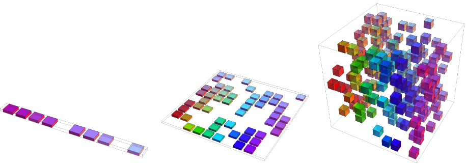

# 深度学习概论

* [返回顶层目录](../../SUMMARY.md#目录)

# 深度学习的学习历程

[深度学习的学习历程](https://zhuanlan.zhihu.com/p/34524772)

我刚入门深度学习的时候，看了各种深度学习相关的资料，花书、cs231n、neural networks and deep learning、cs224d等等。

看来看去，感觉好像什么都懂了，不就那些模块吗，conv、lstm、pooling、fc、drop out等等，这些模块的公式早就能背得滚瓜烂熟。alexnet、vgg、googlenet、resnet等网络就像乐高一样，把这些模块当积木一样组合起来，好像也没啥特别的。

又好像什么都不懂，学会这些模块的公式就算会深度学习了吗？整个深度学习的学习周期是怎样的，我下一步应该干啥？这些模块看起来平平无奇，为什么组合在一起就能发挥这么大威力？为什么drop out能起到正则作用？L1正则和L2正则有什么区别？cnn、rnn、dnn除了公式不一样外到底有啥区别？诶，最后一个fc层看起来跟多类别lr分类器好像啊，它们是一回事吗？各种各样的问题，不一而足，而每个问题我都不知道答案。

看的这些资料里面要么没讲到这些问题，要么用比较数学的方式解释，对初学者非常不友好。

我觉得初学者最缺的不是深度学习的资料，以及那一堆公式，而是一个指路人，他能用通俗易懂的方式把深度学习在你面前掰开，又亲手把它给捏回去，还能告诉你深度学习整个的学习周期是怎样的，这样就能让你少走很多弯路，提高学习的效率。

如果现在可以穿越到我刚入门的时候，我会这样跟当时的自己讲：

深度学习的资料汗牛充栋，不过入门看其中一两本经典的书就够了，比如花书《deep learning》和stanford的cs231n。

入门不要贪多，不要贪图一下就啥都能理解。入门一定要快，不要恋战，比较难理解的知识点先跳过去。入门的目的是对深度学习的历史、概貌有个大致了解，知道深度学习能干什么。

深度学习入门的确容易，就那么几个模块，conv、rnn、relu、pooling、fc等等，只要你懂线性代数、求导，然后看一两本经典的书就入门了。

但是想学好实际上却不那么容易。我觉得学习深度学习分为三个阶段。

**一、看山是山**

conv、rnn、relu、pooling、fc等等模块的公式背得滚瓜烂熟，定义烂熟于心，但是别人要问两个为什么，立马就招架不住了。

这个阶段主要是看教材、课程，打好基础。

**二、看山不是山**

conv不就是模板匹配+sliding window嘛，跟用hog进行行人检测的过程多类似呀，只不过conv里的模板参数可以学；drop out不就是集成学习的思想嘛，它跟random forest多像啊；L1正则和L2正则是加在模型上的prior，比如L1正则假定了一个拉普拉斯分布，L2正则假定了一个高斯分布；fc不就是矩阵里空间变换嘛；最后一层fc加softmax不就是多分类lr嘛，之前的部分可以看做一个特征提取器，然后用多分类lr对特征进行分类。

cnn和rnn是加了assumption的dnn。cnn的assumption是数据在二维空间上存在着相关性，rnn的assumption是数据在一维空间上存在着相关性。心想“诶，二维空间是一维空间的特例，那cnn岂不是可以用来解决需要使用rnn的问题？我擦，大发现，看来可以搞一波事情了，谷歌了一下，发现facebook已经用cnn来做翻译了，holy shit，晚了一步”。

这个阶段主要是思考上个阶段看的东西，将书本里的知识内化为自己的知识。

**三、看山还是山**

慢慢意识到，没有最好的模型，只有最合适的模型。之前听到实验室学弟问“深度学习这么厉害，为啥还要学lr、naive bayes、svm这些low的模型”，我想这应该是很多初学者的疑问，我当初也有这样的疑问。

尺有所长，寸有所短。每个模型都有它适用的范围（其实也就是assumption），深度学习也不例外，超过了适用范围，啥模型都得嗝屁。比如你的数据天然是线性可分的，那lr或者svm将会是最好的选择，如果你选了高大上的深度学习，结果反而会适得其反。

面对一个任务，分析这个任务的assumption，然后去你的武器库（也就是各种模型）里寻找跟这个assumption匹配的武器，知己知彼，方能百战不殆。不要瞧不起svm这样的匕首，也不要太高看深度学习这样的屠龙刀。

这个阶段就是要融会贯通，无招胜有招。大音希声，大象无形，武功高强者，飞花摘叶俱可伤人。

# 发展深度学习的原因

之前我们学习的传统机器学习算法在很多不同的重要问题上效果都良好，但是他们不能解决人工智能的核心问题，如语音识别或者对象识别。

促使深度学习发展的是一部分原因是**传统机器学习算法在这类人工智能问题上的泛化能力不足**。

本节介绍两方面：

* 为什么当处理高维数据时，在新样本上泛化特别困难；
* 为什么传统机器学习算法的泛化机制不适合高维空间中的复杂函数。

这些高维空间经常涉及巨大的计算代价，深度学习的目的是为了克服这些难题及其他一些难题。

传统机器学习面临下面两个问题，而深度学习的目的之一就是为了克服这两个问题。

## 维数灾难

当数据的维度很高时，很多机器学习的问题变得相当困难。这种现象被称为维数灾难。

维度增多会使得x的可能分布位置数目远大于训练样本的数目。

为了充分理解这个问题，假设空间被分成网格。

低维时，用少量划分的网格就可以描述这个空间。当泛化到新数据点时，可通过检测与这个新数据点在相同网格中的训练样本，来判断如何处理新数据点。

但是，如果该网格中没有样本，是不是就傻眼了？在高维空间中，**参数的分布位置数目远大于样本数目，大部分分布位置是没有样本的**。

那如何预测新的分布位置的输出呢？很多传统的机器学习算法仅仅假设新的位置点的输出应约等于最邻近的样本点的输出。

比如每个维度分成十份，一共十个训练数据点，一维的情况下，十个训练数据最多可以占据十个网格，即100%的覆盖率，而在二维空间，十个数据最多占据10%的网格(10/10^2=10%)，即10%的覆盖率，在三维空间，十个数据最多占据1%的网格(10/10^3=1%)，即1%的覆盖率。即随着维度的增加，样本的可能分布位置远大于样本数目。

# 深度学习2006年重新受到关注

深度学习从2006年开始受到关注的原因是：

- 在学术界，在数以万计样本的中等规模数据上，深度学习在新样本上比当时很多热门算法泛化得更好。
- 在工业界，深度学习提供了一种训练大数据集上的非线性模型的可扩展方式。

# 深度学习的正则化

深度学习中的正则化策略综述（附Python代码）

https://mp.weixin.qq.com/s?__biz=MzUyMjE2MTE0Mw==&mid=2247486251&idx=2&sn=7a62d0f390b9a52722cc018e99abbfe6&chksm=f9d155b3cea6dca53ae669d4fee0004213b6cf3d91ffa41506523db569399c052350e1b55f13&mpshare=1&scene=1&srcid=0521XN8U5xVdLkAY1VDzA37Q#rd

Dropout

结合预先训练好的许多不同模型，来进行预测是一种非常成功的减少测试误差的方式（Ensemble）。但因为每个模型的训练都需要花了好几天时间，因此这种做法对于大型神经网络来说太过昂贵。

然而，AlexNet 提出了一个非常有效的模型组合版本，它在训练中只需要花费两倍于单模型的时间。这种技术叫做Dropout，它做的就是以0.5的概率，将每个隐层神经元的输出设置为零。以这种方式“dropped out”的神经元既不参与前向传播，也不参与反向传播。

所以每次输入一个样本，就相当于该神经网络就尝试了一个新的结构，但是所有这些结构之间共享权重。因为神经元不能依赖于其他特定神经元而存在，所以这种技术降低了神经元复杂的互适应关系。

正因如此，网络需要被迫学习更为鲁棒的特征，这些特征在结合其他神经元的一些不同随机子集时有用。在测试时，我们将所有神经元的输出都仅仅只乘以0.5，对于获取指数级dropout网络产生的预测分布的几何平均值，这是一个合理的近似方法。

作者：仙道菜 
来源：CSDN 
原文：https://blog.csdn.net/cyh_24/article/details/51440344?utm_source=copy 
版权声明：本文为博主原创文章，转载请附上博文链接！

# 预防过拟合

[激活引入非线性，池化预防过拟合（上）](https://zhuanlan.zhihu.com/p/32793922)

