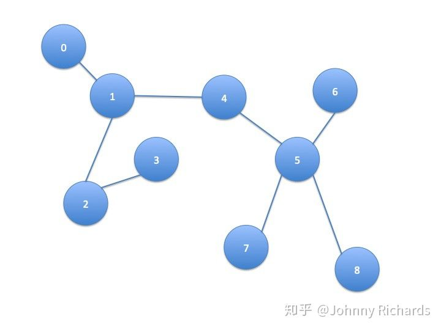
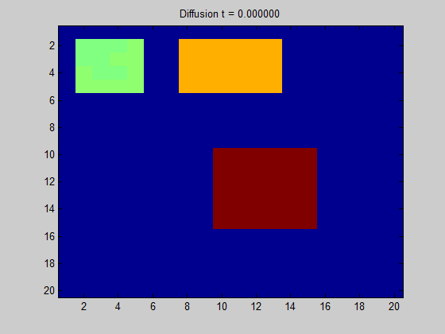
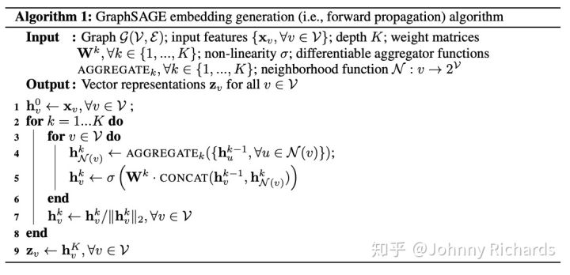
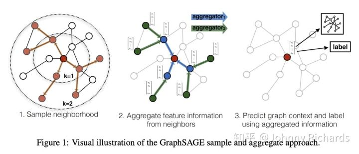

# GCN图卷积网络本质理解

- [返回顶层目录](../../../SUMMARY.md#目录)
- [返回上层目录](graph-convolutional-networks.md)
- [图（Graph）上的热传播模型](#图（Graph）上的热传播模型)
  - [从一维空间开始](#从一维空间开始)
  - [图(Graph)上热传播模型的推广](#图(Graph)上热传播模型的推广)
- [推广到GCN](#推广到GCN)
  - [Laplacian算子的另一个性质](#Laplacian算子的另一个性质)
- [宇宙热寂说、恒温热源和半监督学习](#宇宙热寂说、恒温热源和半监督学习)
- [关于优化过程和优化结果的讨论](#关于优化过程和优化结果的讨论)

一般讲GCN，都会从傅立叶变换出发到拉普拉斯矩阵最后再到GCN。这虽然是已经很详细和全面的讲解，清晰明确非常赞。

然而，发表一点个人意见，我认为这个回答对于初学者不太友好，直接看可能容易晕，主要的困难在于，最开始的Fourier变换概念太多，而在触及**GCN的本质Laplacian矩阵**的时候，描述过于抽象，而Laplacian矩阵直观的数学意义和感受被隐藏进参考文献了，于是我在这里做个补充，权当抛砖引玉。

先说问题的本质：**图中的每个结点无时无刻不因为邻居和更远的点的影响而在改变着自己的状态直到最终的平衡，关系越亲近的邻居影响越大。**

要想理解GCN以及其后面一系列工作的实质，最重要的是理解其中的精髓**Laplacian矩阵**在干什么。知道了Laplacian矩阵在干什么后，剩下的只是**解法的不同**——所谓的Fourier变换只是将问题从空域变换到频域去解，所以也有直接在空域解的（例如GraphSage）。

为了让问题简单便于理解，先让我们忘记时域、频域这些复杂的概念，从一个最简单的物理学现象——热传导出发。

# 图（Graph）上的热传播模型

众所周知，没有外接干预的情况下，热量从温度高传播到温度低的地方并且不可逆，根据著名的牛顿冷却定律（Newton Cool's Law），热量传递的速度正比于温度梯度，直观上也就是某个地方A温度高，另外一个B地方温度低，这两个地方接触，那么温度高的地方的热量会以正比于他们俩温度差的速度从A流向B。

## 从一维空间开始

我们先建立一个一维的温度传播的模型，假设有一个均匀的铁棒，不同位置温度不一样，现在我们刻画这个铁棒上面温度的热传播随着时间变化的关系。预先说明一下，一个连续的铁棒的热传播模型需要列**温度对时间和坐标的偏微分方程**来解决，我们不想把问题搞这么复杂，我们把**空间离散化**，假设铁棒是一个**一维链条**，链条上每一个单元拥有一致的温度，温度在相邻的不同的单元之间传播，如下图：

*一维离散链条上的热传播*

对于第 i个单元，它只和 i-1 与 i+1 两个单元相邻，接受它们传来的热量（或者向它们传递热量，只是正负号的差异而已），假设它当前的温度为Φi，那么就有：
$$
\frac{d\phi_i}{dt}=k(\phi_{i+1}-\phi_{i})-k(\phi_i-\phi_{i-1})
$$
k和单元的比热容、质量有关是个常数。右边第一项是下一个单元向本单元的热量流入导致温度升高，第二项是本单元向上一个单元的热量流出导致温度降低。做一点微小的数学变换可以得到：
$$
\frac{d\phi_i}{dt}-k\left[(\phi_{i+1}-\phi_{i})-k(\phi_i-\phi_{i-1})\right]=0
$$
注意观察第二项，它是两个差分的差分，在离散空间中，相邻位置的差分推广到连续空间就是**导数**，那么差分的差分，就是**二阶导数**！

所以，我们可以反推出铁棒这样的连续一维空间的热传导方程就是：
$$
\frac{\part \phi}{\part t}-k\frac{\part^2\phi}{\part x^2}=0
$$
同理，在高维的欧氏空间中，一阶导数就推广到**梯度**，二阶导数就是我们今天讨论的主角——**拉普拉斯算子**：
$$
\frac{\part \phi}{\part t}-k\Delta \phi=0
$$
其中Δ这个符号代表的是对各个坐标二阶导数的加和，现在的主流写法也可以写作∇ ^2。

综上所述，我们发现这样几个事实：

1、在欧氏空间中，某个点温度升高的速度正比于该点周围的温度分布，用拉普拉斯算子衡量。

2、拉普拉斯算子，是二阶导数对高维空间的推广。

那么，你肯定会问：你扯这么多有什么用呢？我还是看不到拉普拉斯算子和拉普拉斯矩阵还有GCN有半毛钱关系啊？

不要急，目前只是第一步，让我们把这个热传导模型推广导拓扑空间，你就会发现它们其实刻画的是同一回事了！

## 图(Graph)上热传播模型的推广

现在，我们依然考虑热传导模型，只是这个事情不发生在欧氏空间了，发生在一个Graph上面。这个图上的每个结点（Node）是一个单元，且这个单元只和与这个结点相连的单元，也就是有边（Edge）连接的单元发生热交换。例如下图中，结点1只和结点0、2、4发生热交换，更远的例如结点5的热量要通过4间接的传播过来而没有直接热交换。

*图上的热传播*

我们假设热量流动的速度依然满足牛顿冷却定律，研究任一结点i，它的温度随着时间的变化可以用下式来刻画：
$$
\frac{d\phi_i}{dt}=-k\sum_jA_{ij}(\phi_i-\phi_j)
$$
其中A是这个图的邻接矩阵（Adjacency Matrix），定义非常直观： 对于这个矩阵中的每一个元素Aij，如果结点i和j相邻，那么Aij = 1，否则Aij = 0。在这里，我们只讨论简单情况：

1、这张图是无向图，若i和j相邻，那么j和i也相邻，所以Aij = Aji，这是个对称阵。

2、结点自己到自己没有回环边，也就是A对角线上元素都是0。

所以不难理解上面这个公式恰好表示了只有相邻的边才能和本结点发生热交换且热量输入（输出）正比于温度差。

我们不妨用乘法分配律稍微对上式做一个推导：
$$
\begin{aligned}
\frac{d\phi_i}{dt}&=-k\left[\phi_i\sum_jA_{ij}-\sum_jA_{ij}\phi_j\right]\\
&=-k\left[deg(i)\ \phi_i-\sum_jA_{ij}\phi_j\right]
\end{aligned}
$$
先看右边括号里面第一项，deg(i)代表对这个顶点求度（degree），一个顶点的度被定义为这个顶点有多少条边连接出去，很显然，根据邻接矩阵的定义，第一项的求和正是在计算顶点i的度。

再看右边括号里面的第二项，这可以认为是邻接矩阵的第i行对所有顶点的温度组成的向量做了个内积。

为什么要作上述变化呢，我们只看一个点的温度不太好看出来，我们把所有点的温度写成向量形式再描述上述关系就一目了然了。首先可以写成这样：
$$
\begin{aligned}
\begin{bmatrix}
\frac{d\phi_1}{dt}\\ 
\frac{d\phi_2}{dt}\\
...\\
\frac{d\phi_n}{dt}
\end{bmatrix}
=-k
\begin{bmatrix}
deg(1)\times \phi_1\\ 
deg(2)\times \phi_2\\
...\\
deg(n)\times \phi_n
\end{bmatrix}
+kA
\begin{bmatrix}
\phi_1\\ 
\phi_2\\
...\\
\phi_n
\end{bmatrix}
\end{aligned}
$$
然后我们定义向量
$$
\phi=[\phi_1,\phi_2,...,\phi_n]^T
$$
，那么就有：
$$
\frac{d\phi}{dt}=-kD\phi+kA\phi=-k(D-A)\phi
$$
其中
$$
D=diag(deg(1),deg(2),...,deg(n))
$$
被称为度矩阵，只有对角线上有值，且这个值表示对应的顶点度的大小。整理整理，我们得到：
$$
\frac{d\phi}{dt}+kL\phi=0
$$
回顾刚才在连续欧氏空间的那个微分方程：
$$
\frac{\part \phi}{\part t}-k\Delta \phi=0
$$
**二者具有一样的形式！**我们来对比一下二者之间的关系：

相同点：刻画空间温度分布随时间的变化，且这个变化满足一个相同形式的微分方程。

不同点：**前者刻画拓扑空间有限结点**，用向量Φ来刻画当前状态，单位时间状态的变化正比于线性变换-L算子作用在状态Φ上。**后者刻画欧氏空间的连续分布**，用函数Φ(x, t)来刻画当前状态，单位时间状态变化正比于拉普拉斯算子Δ作用在状态Φ上。

不难发现，这就是**同一种变换、同一种关系在不同空间上面的体现**，实质上是一回事！

于是我们自然而然，可以把连续空间中的热传导，推广到图（Graph）上面去，我们把图上面和欧氏空间地位相同变换，以矩阵形式体现的L叫做拉普拉斯（Laplacian）矩阵。看，这正是 [superbrother](https://www.zhihu.com/question/54504471/answer/332657604) 答案中所述的原始形式的拉普拉斯矩阵。

需要多嘴一句的是，本文开头所说的离散链条上的热传导，如果你把链条看成一个图，结点从左到右编号1，2，3...的话，也可以用图的热传导方程刻画，此时D除了头尾两个结点是1其他值都是2，A的主对角线上下两条线上值是1，其他地方是0。举个例子如下：
$$
\begin{aligned}
\begin{bmatrix}
0&1&0&0\\ 
1&0&1&0\\
0&1&0&1\\
0&0&1&0
\end{bmatrix}
\end{aligned}
$$

# 推广到GCN

现在**问题已经很明朗**了，只要你给定了一个空间，给定了空间中存在一种东西可以在这个空间上流动，两邻点之间流动的强度正比于它们之间的状态差异，那么**何止是热量可以在这个空间流动，任何东西都可以！**

自然而然，假设在图中各个结点流动的东西不是**热量**，而是**特征（Feature）**，而是**消息（Message）**，那么问题自然而然就被推广到了GCN。**所以GCN的实质是什么，是在一张Graph Network中特征（Feature）和消息（Message）中的流动和传播！这个传播最原始的形态就是状态的变化正比于相应空间（这里是Graph空间）拉普拉斯算子作用在当前的状态。**

抓住了这个实质，剩下的问题就是怎么去更加好的建模和解决这个问题。

建模方面就衍生出了各种不同的算法，你可以在这个问题上面复杂化这个模型，不一定要遵从牛顿冷却定律，你可以引入核函数、引入神经网络等方法把模型建得更非线性更能刻画复杂关系。

解决方面，因为很多问题在频域解决更加好算，你可以通过Fourier变换把空域问题转化为频域问题，解完了再变换回来，于是便有了所有Fourier变换中的那些故事。

扯了这么多，总结一下，问题的本质就是：

1. 我们有张图，图上每个结点刻画一个实体，物理学场景下这个实体是某个有温度的单元，它的状态是温度，广告和推荐的场景下这个实体是一个user，一个item，一个ad，它的状态是一个embedding的向量。
2. 相邻的结点具有比不相邻结点更密切的关系，物理学场景下，这个关系是空间上的临近、接触，广告和推荐场景下这个是一种逻辑上的关系，例如用户购买、点击item，item挂载ad。
3. 结点可以传播热量/消息到邻居，使得相邻的结点在温度/特征上面更接近。

**本质上，这是一种Message Passing，是一种Induction，卷积、傅立叶都是表象和解法。**

最后再补充**说明几点事实**：

**热/消息传导方程的数值可迭代求解性（机器学习上的可操作性）**

我们可以把原方程写成这样：
$$
\frac{d\phi}{dt}=-kL\phi
$$
机器学习中，时间是离散的，也就是左边对时间的求导变成了离散的一步步迭代。好在这个方程天生似乎就是上帝为了我们能够迭代求解而设计的。右边用拉普拉斯算子作用一次到全局的状态上，就能把状态更新一步！

实际解决的过程中，可以发挥机器学习搬砖工懂得举一反三的优良精神，首先，不一定要全局操作，我们可以batchify操作一部分结点，大家轮着来，其次，我们可以只考察这个点的一阶和二阶邻居对当前点作Message Passing，这个思想就是对拉普拉斯算子作特征分解，然后只取低阶的向量，因为矩阵的谱上面能量一般具有长尾效应，头几个特征值dominate几乎所有能量。

## Laplacian算子的另一个性质

Laplacian矩阵/算子不仅表现的是一种二阶导数的运算，另一方面，它表现了一种加和性，这个从图上热/消息传播方程最原始的形态就能一目了然：
$$
\frac{d\phi_i}{dt}=k\sum_jA_{ij}\left(\phi_j-\phi_i\right)
$$
可见，每个结点每个时刻的状态变化，就是所有邻居对本结点差异的总和，也就是所有的邻居把message pass过来，然后再Aggregate一下，这正是GraphSage等空域算法的关键步骤**Aggregate思想**的滥觞。

在实际建模中，我们的Aggregate不一定是加和，作为一个熟练的机器学习搬砖工，我们懂得可以把Aggregate推广成各种操作例如Sum Pooling，例如LSTM，例如Attention，以求刷效果，发paper :)

**两种空间下的Fourier分解/ 特征分解对比（卷积为什么能从欧氏空间推广到Graph空间）**

最后，因为有以上分析作基础，我们可以解释一下傅立叶变换是怎么推广到图空间的。

首先，在欧氏空间上，迭代求解的核心算子Δ算子的特征函数是：
$$
e^{-jwt}
$$
，因为：
$$
\Delta e^{-jwt}=w^2e^{-jwt}
$$
其次，在图空间上，对应地位的L对应的不是特征函数，而是它的特征值和特征向量，分别对应上面的w^2和e^{-jwt}。

唯一的区别是，e^{-jwt}是定义内积为函数积分的空间上的一组基，有无穷多个，当然这无穷多个是完备的。而L的特征空间是有限维的，因为L的对称性和半正定性，所有特征值都是实数且特征向量都是实向量，特征空间维度等于图中的结点数也就是L的阶。

注意，实对称矩阵的特征空间的所有基能够张出整个线性空间且它们两两正交，所以无论是拉普拉斯算子Δ还是拉普拉斯矩阵L，它们的特征空间是一个满秩且基两两正交的空间，所以把欧氏空间的e^{-jwt}推广到图空间的L的这一组特征向量。**正是同一个关系（Message Passing），同一种变换，在不同空间下的体现罢了！**

拉普拉斯矩阵还有另外两个变种，本质上就是用度对周围邻居的影响做了不同的归一化策略，具体可参考wikipedia：[Laplacian_matrix](https://en.wikipedia.org/wiki/Laplacian_matrix)

故事还没有结束，让我们来探讨点更有意思的事情～[Laplacian matrix](https://en.wikipedia.org/wiki/Laplacian_matrix)故事还没有结束，让我们来探讨点更有意思的事情～

# 宇宙热寂说、恒温热源和半监督学习

感谢你饶有兴致能够继续听我絮叨完。乍看这个标题，你一定认为我在扯淡，前面两个概念和后面一个八竿子打不着。不用着急，且听我慢慢道来，as the saying goes：因果有差距，联想来搭桥～

如果你仔细的思考，你会发现常挂在嘴边的热力学传导模型有个宿命论的结论：假设这个图是个连通图，每个结点到任一其他结点都有路可走，那么这样的事情肯定会发生：如果一个结点温度高于周围邻居，那么它的热量会持续流出到邻居，此间它自己的热量流失，温度就会降低，直到它和周围邻居一样，最终所有结点都达到一个平衡的、一样的温度。

我想说的是，你的猜想非常正确而且能够经过严格的数学证明，只要解上面这个方程（并不难）就能验证你的结论。

问题的本质在于，我们之前所讨论的热传导场景是一个**孤立系统的无源**场景，每一个结点的热量都有一个初始禀赋，没有外界干预它、给它热量，它每传给周围一些热量，自己就要减少，伴随自身温度的降低。那么根据**能量守恒定律**，整个系统的能量是定值，并且随着热传导，系统的热量被均匀分配到每个参与其中的结点。这正是**热力学第一定律**和**热力学第二定律**在这张图上的完美体现。这也是这张图上的“宇宙热寂说”，这个孤立的小宇宙，最终处处温度一样，平衡状态下没有热量的流动。

[Wikipedia](https://en.wikipedia.org/wiki/Laplacian_matrix)对无源系统有个动态图仿真，能够增加直观认识，盗图放在这里：

*无源系统最终出现“宇宙热寂”现象，所有点平衡态温度趋同*

如果我们在这张图上引入一个东西叫做**恒温热源**，事情就会发生改变。所谓恒温热源，就是这样一个存在，系统中有些点开了外挂，它们接着系统外面的某些“供热中心”，使得它们温度能够保持不变。这样，这些结点能够源源不断的去从比它温度高的邻居接受热量，向温度比它低的邻居释放热量，每当有热量的增补和损失，“供热中心”便抽走或者补足多余或者损失的热量，使得这个结点温度不发生变化。

那么最终的平衡的结果不是无源情况下所有结点温度一样，而是整个图中，高温热源不断供热给周围的邻居，热量传向远方，低温热源不断持续吸收邻居和远方的热量，最终状态下每条边热量稳恒流动（不一定为0），流量不再变化，每个结点都达到**终态的某个固有温度**。这个温度具体是多少，取决于整张图上面**恒温热源的温度和它们的分布**。

**恒温热源的存在，正是我们跨向半监督学习的桥梁**。

我们把问题向广告和推荐场景去类比，在这个场景下，某些结点有着明确的label，例如某个广告被点击，某个广告的ctr是多少，某个item被收藏，这些带着label的结点有着相对的确定性——它们可以被看作是这个结点的温度，这些**有标签的结点正是恒温热源**。那么，这些图的其他参与者，那些等待被我们预测的结点正是这张图的**无源部分**，它们被动的接受着那些或近或远的恒温热源传递来的Feature，改变着自己的Feature，从而影响自己的label。

让我们做个类比：

- **温度** 好比 **label** 是状态量
- **恒温热源 好比 有明确 label的结点**，它们把自己的Feature传递给邻居，让邻居的Feature与自己趋同从而让邻居有和自己相似的label
- 结点的**热能**就是**Feature**，无标签的、被预测的结点的Feature被有明确label的结点的Feature传递并且影响最终改变自己

需要说明的一点是，无论是有源还是无源，当有新的结点接入已经平衡的系统，系统的平衡被打破，新的结点最终接受已有结点和恒温热源的传递直到达到新的平衡。**所以我们可以不断的用现有的图去预测我们未见过的结点的性质，演化和滚大这个系统**。

如果关注有源情况下的热传导方程定量分析，可以看wikipedia这一条：

这里不是我们的重点，就不再赘述了。最后，我们讨论一下优化的过程，以期待发现什么。

[Heat_equation](https://en.wikipedia.org/wiki/Heat_equation)

# 关于优化过程和优化结果的讨论

[Heat equation - Wikipedia](https://link.zhihu.com/?target=https%3A//en.wikipedia.org/wiki/Heat_equation)关于优化过程和优化结果的讨论

从物理和从机器学习角度去看拉普拉斯热传导微分方程注定是不一样的。

从物理学角度去研究它，更多的是在搞明白**边界条件**和**初始条件**的情况下，探索和了解**后续状态的演化过程**。

而机器学习更多关心的是结果，毕竟我们要的是**最终**的**参数**和**特征**，用来使用和预测结果。然而，关注一些过程方面的东西，能够帮助我们更加深入的建立起原始热传导和前沿的GNN算法的联系。

我们并不靠解这个微分方程得到状态和时间的显式关系来获得对过程的认知，这个对我们当下讨论的话题意义不大，想了解怎么解可以看[Laplacian_matrix](https://en.wikipedia.org/wiki/Laplacian_matrix)，做法大概就是以所有特征向量为基展开状态向量，然后就能像解决简单常微分方程的办法积个分解出来，是一个exponential的形式。我们用另外一个方式来认知这个过程。

为求简单，我们研究上文所说的原始的无源热传导方程：
$$
\frac{d\phi}{dt}=-kL\phi
$$
为了好解，我们把时间也离散化，微分变差分近似是这样：
$$
\phi_{t+1}-\phi_t=-kL\phi_t
$$
所以自然：
$$
\phi_{t+1}=\phi_t-kL\phi_t
$$
这实质上是一个机器学习，或者优化问题中常见的样子：
$$
w_{t+1}=w_t-\alpha\bigtriangledown f(w_t)
$$
只是状态的变化量从梯度算子（可能还有动量、历史状态、Hessian矩阵、正则化操作等等，这里不赘述）作用于loss function变成了拉普拉斯算子作用于当前状态。

我们这回先不整体的考察状态向量Φ的演化，倒退到早些时候所说的每个结点i的状态Φi的变化，有：
$$
\begin{aligned}
\phi^{(i)}_{t+1}&=\phi^{(i)}_t-k\sum_jA_{ij}\left(\phi^{(i)}_t-\phi^{(j)}_t\right)\\
&=(1-k\times deg(i))\phi^{(i)}_t+k\sum_jA_{ij}\phi^{(j)}_t\\
&=(1-k\times deg(i))\phi^{(i)}_t+k\sum_{j\in \text{Neighber}(i)}A_{ij}\phi^{(j)}_t
\end{aligned}
$$
到这里已经很明了了，每个结点的下一个状态，是当前状态的常数倍（第一项），和所有邻居的加和（第二项）的融合。

我们来看看GraphSage核心算法的过程，会发现原理上二者的惊人相似性：

*GraphSage算法，截自[原论文](https://papers.nips.cc/paper/6703-inductive-representation-learning-on-large-graphs.pdf)*

看最里面的循环节，就是迭代过程，核心两步：

1、Aggregate邻居结点的状态，作为邻居结点的一个“和”状态。

2、将这个“和”状态和当前结点的状态通过Concat操作和带非线性激活的全连接层融合到一起更新当前结点的状态。

原文中的配图很好的解释了这个过程：

*[GraphSage算法](https://papers.nips.cc/paper/6703-inductive-representation-learning-on-large-graphs.pdf)采样和Aggregate过程*

GraphSage这个过程和原始的热传导过程是这么的相似，我们可以发现：

1、原始的热传导用所有直接相邻的邻居的简单加和作为邻居“和”状态，GraphSage用一个Aggregator作用于所有采样邻居（可以是二阶）得到“和”状态。本质是Aggregate，只是后者更加非线性，建模能力更强。

2、原始的热传导把邻居“和”状态和当前结点状态简单加权叠加作为融合态，GraphSage使用Concat操作加上神经网络非线性融合一把。本质是把邻居的“和”和本地的现有状态糅合得到本地新状态，依然只是后者更加非线性，建模能力更强。

3、原始热传导使用所有一阶邻居。GraphSage会采样邻居，因为实际上邻居可能很多全部算很慢，同时它还会采样高阶邻居。本质是主动融合几何上相近的单元。这里可能存在一个隐患，在高度非线性下，对周围邻居的采样的Aggregate是不是对周围所有邻居的Aggregate的**无偏估计**，本人知识有限，有待进一步考证。

所有的所有，还是**“相邻”、“叠加”与“融合”**三个关键词，只是解法更新、迭代、升级了。

**理解了Laplacian变换和图上的热传播的关系，搞明白了Message Passing和有源无源状态下的均衡状态，再去看浩如烟海的paper和高票答案，相信你一定会有更深刻的理解！祝你好运～**

**参考文献**

1、[Laplacian matrix](https://link.zhihu.com/?target=https%3A//en.wikipedia.org/wiki/Laplacian_matrix)

2、Cannon J R. The one-dimensional heat equation[M]. Cambridge University Press, 1984.

3、[Hamilton W, Ying Z, Leskovec J. Inductive representation learning on large graphs[C]//Advances in Neural Information Processing Systems. 2017: 1024-1034.](https://papers.nips.cc/paper/6703-inductive-representation-learning-on-large-graphs.pdf)

4、[Heat equation - Wikipedia](https://link.zhihu.com/?target=https%3A//en.wikipedia.org/wiki/Heat_equation)

# 参考资料

* [如何理解 Graph Convolutional Network（GCN）？](https://www.zhihu.com/question/54504471/answer/630639025)

本文参考[Johnny Richards](https://www.zhihu.com/people/johnny-richards)的知乎回答。

