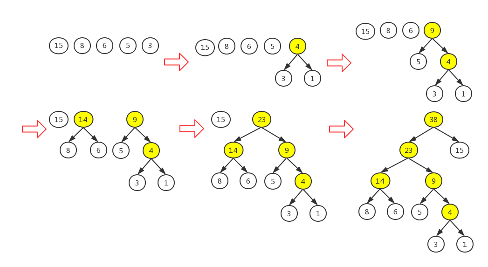
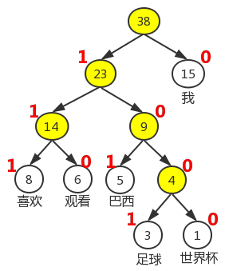
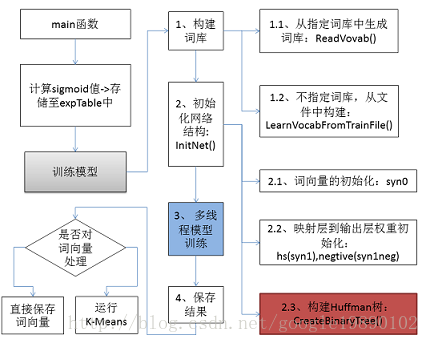
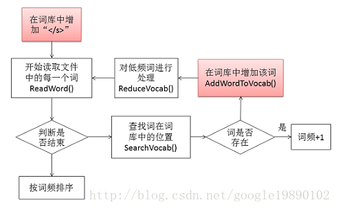

# word2vec

* [返回顶层目录](../../../SUMMARY.md)

# 前言

# word2vec算法原理

## 预备知识

### sigmoi函数

### 逻辑回归

### bayer公式

### Huffman编码

本节简单介绍Huffman编码，为此，首先介绍Huffman树的定义及其构造算法：

#### Huffman树

在计算机科学中，**树**是一种重要的非线性数据结构，它是数据元素（在树中称为**结点**）按分之关系组织起来的结构。若干棵互补交互的树所构成的集合称为森林。下面给出几个与树相关的常用概念。

* 路径和路径长度

  在一棵树中，从一个节点往下可以到达的孩子或者孙子节点之间的道路，称为**路径**。通路中分支的数目称为路径长度。若规定根节点的层号为1，则从根结点到第L层的结点的路径长度为L-1。

* 结点的权和带权路径长度

  若为树中结点赋予一个具有某种含义的（非负）数值，则这个数值称为该结点的权。结点的带权路径长度是指，从根结点到该结点之间的路径长度与该结点的权的乘积。

* 树的带权路径长度

  树的带权路径长度规定为所有叶子结点的带权路径长度之和。

**二叉树**是每个结点最多有两个子树的有序树。两个子树通常被称为“左子树”和“右子树”，定义中的“有序”是指两个子树有左右之分，顺序不能颠倒。

给定n个权值作为n个叶子结点，构造一颗二叉树，若它的带权路径长度达到最小，则称这样的二叉树为最右二叉树，也称为Huffman树。

#### Huffman树的构造

给定n个权值\{w1, w2,  ... , wn\}作为二叉树的n个叶子结点，可通过以下算法来构造一颗Huffman树。

> **Huffman树构造算法**
>
> （1）将\{w1, w2,  ... , wn\}看成是有n棵树的森林（每棵树仅有一个结点）。
>
> （2）在森林中选出两个根结点的权值最小的树合并，作为一棵新树的左、右子树，且新树的根结点权值为其左、右子树结点权值之和。
>
> （3）从森林中删除选取的两棵树，并将新树加入森林。
>
> （4）重复（2）（3）步，直到森林中只剩下一棵树为止，该树即为所求的Huffman树。

接下来，给出上述算法的一个具体实例。

例：假设2018世界杯期间，从新浪微博中住去了若干条鱼足球相关的微博，经统计，“我”、“喜欢”、“观看”、“巴西”、“足球”、“世界杯”这六个词出现的次数分别为15、8、6、5、3、1。请以这六个词为叶子结点，以相应词频当权值，构造一颗Huffman树。

下图为Huffman树的构造过程：

利用上述的Huffman树构造算法，易知其构造过程如上图所示。图中第六步给出了做中的Huffman树，由图可见词频越大的词离根结点越近。

构造过程中，痛殴合并新增的结点被标记为黄色。由于每两个结点都要进行一次合并，因此，**若叶子结点的个数为n，则构造的Huffman树中新增结点的个数为n-1**，本例中n=6，因此新增结点的个数为5。

注意，前面有提到，二叉树的两个子树是分左右的，对于某个非叶子结点来说，就是其两个孩子结点是分左右的，在本例中，统一将词频大的结点作为左孩子结点，词频小的作为右孩子结点。当然，这只是一个约定，你要将词频大的结点作为右孩子结点也没有问题。

#### Huffman编码

在数据通信中，需要将传送的文字转换成二进制的字符串，用0、1码的不同排列来表示字符。例如，需传送的报文为“AFTER DATA EAR ARE ART AREA”，这里用到的字符集为“A, E, R, T, F, D”，各字母出现的次数为8, 4, 5, 3, 1, 1。现要求为这些字母设计编码。

要区分6个字母，最简单的二进制编码方式是**等长编码**，固定采用3位二进制（2^3=8>6），可分别用000、001、010、011、100、101对“A, E, R, T, F, D”进行编码发送，当对方接受报文时再按照三位分一进行译码。

显然你编码的长度取决豹纹那种不同字符的个数。若报文中可能出现26个不同字符，则固定编码长度为5（2^5=32>26）。然而，传送报文时总是希望总长度尽可能短。在实际应用中，各个字符的出现频度或使用次数是不相同的，如A、B、C的使用频率远远高于X、Y、Z，自然会想到设计编码时，让使用频率高的用短码，使用频率低的用长码，以优化整个报文方案。

为使**不等长编码**为**前缀编码**（即要求一个字符的编码不能是另一个字符编码的前缀），可用字符集中的每个字符作为叶子结点生成一颗编码二叉树，为了获得传送报文的最短长度，可将每个字符的出现频率作为字符结点的权值赋予该结点上，显然字使用频率越小权值越小，权值越小叶子就越靠下，于是**频率小编码长，频率高编码短**，这样就**保证了此树的最小带权路径长度**，效果上就是传送报文的最短长度。因此，求传送报文的最短长度问题转化为求由字符集中的所有字符作为叶子结点，由字符出现频率作为其权值所产生的huffman树的问题。利用Huffman树设计的二进制前缀编码，称为**Huffman编码**，它既能满足前缀编码的条件，又能保证报文编码总长最短。

本文将介绍的word2vector工具中也用到Huffman编码，**它把训练预料中的词当成叶子结点，其在语料中出现的次数当作权值，通过构建相应的Huffman树来对每一个词进行Huffman编码**。

下图给出了上例中的六个词的Huffman编码，其中约定（词频较大的）左孩子结点编码为1，（词频较小的）右孩子编码为0.这样一来，“我”、“喜欢”、“观看”、“巴西”、“足球”、“世界杯”这六个词的huffman编码分别为0、111、110、110、101、1001和1000。

注意，到目前为至，关于Huffman树的Huffman编码，有两个约定：（1）将权值大的结点作为左孩子结点，权值小的作为右孩子结点；（2）左孩子结点编码为1，右孩子结点编码为0。**在word2vec源码中将权值较大的孩子结点编码为1，较小的孩子结点编码为0**。为与上述约定统一起见，**下文中提到的“左孩子结点”都是指权值较大的孩子结点**。

## 背景知识

## 基于Hierarchical Softmax的模型

## 基于Negative Sampling的模型

## 若干源码细节

# word2vec源码解析

在阅读本文之前，建议首先阅读上面的“word2vec的算法原理”，掌握如下的几个概念：

* 什么是统计语言模型
* 神经概率语言模型的网络结构
* CBOW模型和Skip-gram模型的网络结构
* Hierarchical Softmax和Negative Sampling的训练方法
* Hierarchical Softmax与Huffman树的关系

有了如上的一些概念，接下来就可以去读word2vec的源码。在源码的解析过程中，对于基础知识部分只会做简单的介绍，而不会做太多的推导，原理部分会给出相应的参考地址。

在wrod2vec工具中，有如下的几个比较重要的概念：

* CBOW

* Skip-Gram

* Hierarchical Softmax

* Negative Sampling

其中CBOW和Skip-Gram是word2vec工具中使用到的两种不同的语言模型，而Hierarchical Softmax和Negative Sampling是对以上的两种模型的具体的优化方法。

## word2vec流程图

在word2vec工具中，主要的工作包括：

* 预处理。即变量的声明，全局变量的定义等；
* 构建词库。即包含文本的处理，以及是否需要有指定词库等；
* 初始化网络结构。即包含CBOW模型和Skip-Gram模型的参数初始化，Huffman编码的生成等；
* 多线程模型训练。即利用Hierarchical Softmax或者Negative Sampling方法对网络中的参数进行求解；
* 最终结果的处理。即是否保存和以何种形式保存。

对于以上的过程，可以由下图表示：

在接下来的内容中，将针对以上的五个部分，详细分析下在源代码中的实现技巧，以及简单介绍我在读代码的过程中对部分代码的一些思考。

## 预处理

## 构建词库

在word2vec源码中，提供了两种构建词库的方法，分别为：

- 指定词库：ReadVocab()方法
- 从词的文本构建词库：LearnVocabFromTrainFile()方法

### 构建词库的过程

#### 从指定词库生成词库

#### 从词的文本构建词库

在这里，我们以从词的文本构建词库为例（函数LearnVocabFromTrainFile()）。构建词库的过程如下所示：

### 对词的哈希处理

### 对低频词的处理

### 根据词频对词库中的词排序

## 初始化网络结构

## 多线程模型训练

# 参考资料

* [机器学习算法实现解析——word2vec源码解析](https://blog.csdn.net/google19890102/article/details/51887344)

"word2vec源码解析"一节主要参考此文章。

* [word2vec之源码注释](http://suhui.github.io/word2vec)
* [基于深度学习的自然语言处理（Word2vec源码分析-2上）](https://zhuanlan.zhihu.com/p/40557458)
* [基于深度学习的自然语言处理（Word2vec源码分析-2下）](https://zhuanlan.zhihu.com/p/40558913)

* [word2vec 源代码 完整注释](https://blog.csdn.net/jingquanliang/article/details/82886645)
* [word2vec源码解析之word2vec.c](https://blog.csdn.net/lingerlanlan/article/details/38232755)

源码注释参考上述几个文档。

* [word2vec使用说明](http://jacoxu.com/word2vector/)

这是word2vec的使用说明。

