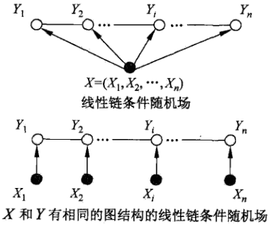

# CRF条件随机场

* [返回顶层目录](../../SUMMARY.md#目录)

[如何直观地理解条件随机场，并通过PyTorch简单地实现](https://mp.weixin.qq.com/s?__biz=MzA3MzI4MjgzMw==&mid=2650742297&idx=3&sn=7c0fa6f3468f3813e309d0bb274be849&chksm=871ada67b06d53711a2f9142b7fa39ab5e060298ce90233f78cee6c4d7ffca3f34fb540b288a&mpshare=1&scene=1&srcid=0515I9LFZDhoQjEUOxM255qV#rd)

条件随机场(CRF) - 1 - 简介

https://blog.csdn.net/xueyingxue001/article/details/51498902

# 直观理解CRF条件随机场

理解条件随机场最好的办法就是用一个现实的例子来说明它。

假设你有许多小明同学一天内不同时段的照片，从小明提裤子起床到脱裤子睡觉各个时间段都有（小明是照片控！）。现在的任务是对这些照片进行分类。比如有的照片是吃饭，那就给它打上吃饭的标签；有的照片是跑步时拍的，那就打上跑步的标签；有的照片是开会时拍的，那就打上开会的标签。问题来了，你准备怎么干？

一个简单直观的办法就是，不管这些照片之间的时间顺序，想办法训练出一个多元分类器。就是用一些打好标签的照片作为训练数据，训练出一个模型，直接根据照片的特征来分类。例如，如果照片是早上6:00拍的，且画面是黑暗的，那就给它打上睡觉的标签;如果照片上有车，那就给它打上开车的标签。

这样可行吗？

乍一看可以！但实际上，由于我们忽略了这些照片之间的时间顺序这一重要信息，我们的分类器会有缺陷的。举个例子，假如有一张小明闭着嘴的照片，怎么分类？显然难以直接判断，需要参考闭嘴之前的照片，如果之前的照片显示小明在吃饭，那这个闭嘴的照片很可能是小明在咀嚼食物准备下咽，可以给它打上吃饭的标签；如果之前的照片显示小明在唱歌，那这个闭嘴的照片很可能是小明唱歌瞬间的抓拍，可以给它打上唱歌的标签。

所以，为了让我们的分类器能够有更好的表现，在为一张照片分类时，我们必须将与它相邻的照片的标签信息考虑进来。这——就是条件随机场(CRF)大显身手的地方！

## 从例子说起——词性标注问题

啥是词性标注问题？

非常简单的，就是给一个句子中的每个单词注明词性。比如这句话：“Bob drank coffee at Starbucks”，注明每个单词的词性后是这样的：“Bob (名词)  drank(动词)   coffee(名词)   at(介词)    Starbucks(名词)”。

下面，就用条件随机场来解决这个问题。

以上面的话为例，有5个单词，我们将：**(名词，动词，名词，介词，名词)**作为一个标注序列，称为l，可选的标注序列有很多种，比如l还可以是这样：**（名词，动词，动词，介词，名词）**，我们要在这么多的可选标注序列中，挑选出一个**最靠谱**的作为我们对这句话的标注。

怎么判断一个标注序列靠谱不靠谱呢？

就我们上面展示的两个标注序列来说，第二个显然不如第一个靠谱，因为它把第二、第三个单词都标注成了动词，动词后面接动词，这在一个句子中通常是说不通的。

假如我们给每一个标注序列打分，打分越高代表这个标注序列越靠谱，我们至少可以说，凡是标注中出现了**动词后面还是动词**的标注序列，要给它**负分！！**

上面所说的**动词后面还是动词**就是一个特征函数，我们可以定义一个特征函数集合，用这个特征函数集合来为一个标注序列打分，并据此选出最靠谱的标注序列。也就是说，**每一个特征函数都可以用来为一个标注序列评分，把集合中所有特征函数对同一个标注序列的评分综合起来，就是这个标注序列最终的评分值**。

## 定义CRF中的特征函数

现在，我们正式地定义一下什么是CRF中的特征函数，所谓特征函数，就是这样的函数，它接受四个参数：

- 句子s（就是我们要标注词性的句子）
- i，用来表示句子s中第i个单词
- l_i，表示要评分的标注序列给第i个单词标注的词性
- l_(i-1)，表示要评分的标注序列给第i-1个单词标注的词性

它的输出值是0或者1，0表示要评分的标注序列不符合这个特征，1表示要评分的标注序列符合这个特征。

注意：这里，我们的特征函数仅仅依靠当前单词的标签和它前面的单词的标签对标注序列进行评判，这样建立的CRF也叫作**线性链CRF**，这是CRF中的一种简单情况。为简单起见，本文中我们仅考虑线性链CRF。

## 从特征函数到概率

定义好一组特征函数后，我们要给每个特征函数fj赋予一个权重λj。现在，只要有一个句子s，有一个标注序列l，我们就可以利用前面定义的特征函数集来对l评分。
$$
\text{score}(l|s)=\sum_{j=1}^m\sum_{i=1}^n\lambda_jf_j(s,i,l_i,l_{i-1})
$$
上式中有两个求和，外面的求和用来求每一个特征函数fj评分值的和，里面的求和用来求句子中每个位置的单词的的特征值的和。

对这个分数进行**指数化和标准化**，我们就可以得到标注序列l的概率值**p(l|s)**，如下所示：
$$
\begin{aligned}
p(l|s)&=\frac{\text{exp}[\text{score}(l|s)]}{\sum_{l'}\text{exp}[\text{score}(l'|s)]}\\
&=\frac{\text{exp}[\sum_{j=1}^m\sum_{i=1}^n\lambda_jf_j(s,i,l_i,l_{i-1})]}{\sum_{l'}\text{exp}[\sum_{j=1}^m\sum_{i=1}^n\lambda_jf_j(s,i,l'_i,l'_{i-1})]}\\
\end{aligned}
$$
有没有似曾相识的感觉？这个过程像不像逻辑回归？

## 几个特征函数的例子

前面我们已经举过特征函数的例子，下面我们再看几个具体的例子，帮助增强大家的感性认识。
$$
f_1(s,i,l_i,l_{i-1})=1
$$
当l_i是“副词”并且第i个单词以“ly”结尾时，我们就让f1 = 1，其他情况f1为0。不难想到，f1特征函数的权重λ1应当是正的。而且λ1越大，表示我们越倾向于采用那些把以“ly”结尾的单词标注为“副词”的标注序列。
$$
f_2(s,i,l_i,l_{i-1})=1
$$
如果i=1，l_i是动词，并且距离s是以"？"结尾时，f2=1，其他情况f2=0。同样，λ2应当是正的，并且λ2越大，表示我们越倾向于采用那些把问句的第一个单词标注为“动词”的标注序列。
$$
f_3(s,i,l_i,l_{i-1})=1
$$
当l_(i-1)是介词，l_i是名词时，f3=1，其他情况f3=0。λ3也应当是正的，并且λ3越大，说明我们越认为介词后面应当跟一个名词。
$$
f_4(s,i,l_i,l_{i-1})=1
$$
如果I_i和l_(i-1)都是介词，那么f4=1，其他情况f4=0。这里，我们应当可以想到λ4是负的，并且λ4的绝对值越大，表示我们越不认可介词后面还是介词的标注序列。

好了，一个条件随机场就这样建立起来了，让我们总结一下：

**为了建一个条件随机场，我们首先要定义一个特征函数集，每个特征函数都以整个句子s，当前位置i，位置i和i-1的标签为输入。然后为每一个特征函数赋予一个权重，然后针对每一个标注序列l，对所有的特征函数加权求和，必要的话，可以把求和的值转化为一个概率值**。

## CRF与逻辑回归的比较

观察公式：
$$
\begin{aligned}
p(l|s)&=\frac{\text{exp}[\text{score}(l|s)]}{\sum_{l'}\text{exp}[\text{score}(l'|s)]}\\
&=\frac{\text{exp}[\sum_{j=1}^m\sum_{i=1}^n\lambda_jf_j(s,i,l_i,l_{i-1})]}{\sum_{l'}\text{exp}[\sum_{j=1}^m\sum_{i=1}^n\lambda_jf_j(s,i,l'_i,l'_{i-1})]}\\
\end{aligned}
$$
是不是有点逻辑回归的味道？

事实上，**条件随机场是逻辑回归的序列化版本**。逻辑回归是用于分类的对数线性模型，**条件随机场是用于序列化标注的对数线性模型**。

## CRF与HMM的比较

对于词性标注问题，HMM模型也可以解决。HMM的思路是用生成办法，就是说，在已知要标注的句子s的情况下，去判断生成标注序列l的概率，如下所示：
$$
p(l,s)=p(l_0)\prod_ip(l_i|l_{i-1})p(w_i|l_i)
$$
这里：

p(l_i|l_(i-1))是转移概率，比如，l_i-1是介词，l_i是名词，此时的p表示介词后面的词是名词的概率。

p(w_i|l_i)表示发射概率（emission probability），比如l_i是名词，w_i是单词“ball”，此时的p表示在是名词的状态下，是单词“ball”的概率。

那么，HMM和CRF怎么比较呢？

答案是：CRF比HMM要强大的多，它可以解决所有HMM能够解决的问题，并且还可以解决许多HMM解决不了的问题。事实上，我们可以对上面的HMM模型取对数，就变成下面这样：
$$
\text{log}p(l,s)=\text{log}p(l_0)+\sum_i\text{log}p(l_i|l_{i-1})+\sum_i\text{log}p(w_i|l_i)
$$
我们把这个式子与CRF的式子进行比较：
$$
\text{score}(l|s)=\sum_{j=1}^m\sum_{i=1}^n\lambda_jf_j(s,i,l_i,l_{i-1})
$$
不难发现，如果我们把HMM式子（上上式）中的log形式的概率看成是CRF式子（上式）中的特征函数的权值的话，我们会发现，CRF和HMM具有相同的形式。

换句话说，我们可以构造一个CRF，使它与HMM的对数形式相同。怎么构造呢？

对于HMM中的每一个转移概率p(l_i=y|l_(i-1)=x)，我们可以定义这样的一个特征函数：
$$
f_{x,y}(s,i,l_i,l_{i-1})=1
$$
该特征函数仅当l_i = y,l_(i-1)=x时才等于1。这个特征函数的权重如下：
$$
w_{x,y}=\text{log}p(l_i=y|l_{i-1}=x)
$$
同样的，对于HMM中的每一个发射概率，我们也都可以定义相应的特征函数，并让该特征函数的权重等于HMM中的log形式的发射概率。

用这些形式的特征函数和相应的权值计算出来的p(l|s)和对数形式的HMM模型几乎是一样的！

用一句话来说明HMM和CRF的关系就是这样：
**每一个HMM模型都等价于某个CRF**
**每一个HMM模型都等价于某个CRF**
**每一个HMM模型都等价于某个CRF**

但是，CRF要比HMM更加强大，原因主要有两点：

* **CRF可以定义数量更多，种类更丰富的特征函数**。HMM模型具有天然具有局部性，就是说，在HMM模型中，当前的单词只依赖于当前的标签，当前的标签只依赖于前一个标签。这样的局部性限制了HMM只能定义相应类型的特征函数，我们在上面也看到了。但是CRF却可以着眼于整个句子s定义更具有全局性的特征函数，如这个特征函数：

  >$$
  >f_2(s,i,l_i,l_{i-1})=1
  >$$
  >
  >如果i=1，l_i=动词，并且句子s是以“？”结尾时，f2=1，其他情况f2=0。

* **CRF可以使用任意的权重** 将对数HMM模型看做CRF时，特征函数的权重由于是log形式的概率，所以都是小于等于0的，而且概率还要满足相应的限制，如
  $$
  0\leqslant p(w_i|l_i)\leqslant 1,\quad \sum_wp(w_i=w|l_1)=1
  $$
  但在CRF中，每个特征函数的权重可以是任意值，没有这些限制。

# 条件随机场的定义与形式

## 条件随机场的定义

条件随机场是给定随机变量X条件下，随机变量Y的马尔科夫随机场。这里主要介绍定义在线性链上的特殊的条件随机场，称为线性链条件随机场。线性链条件随机场可以用于标注等问题。这时，在条件概率模型P(Y|X)中，Y是输出变量，表示标记序列，X是输入变狼，表示需要标注的观测序列。也把标记序列称为状态序列（参见隐马尔科夫模型）。学习时，利用训练数据集通过极大似然估计或正则化的极大似然估计得到条件概率模型hat(P)(Y|X)；预测时，对于给定的输入序列x，求出条件概率hat(x)(y|x)最大的输出序列hat(y)。

首先定义一般的条件随机场，然后定义线性链条件随机场。

**条件随机场定义：**设X与Y是随机变量，P(Y|X)是在给定X的条件下Y的条件概率分布。若随机变量Y构成一个由无向图G=(V, E)表示的马尔科夫随机场，即
$$
P(Y_v|X,Y_w,w\neq v)=P(Y_v|X,Y_w,w\sim v)
$$
对任意结点v成立，则称条件概率分布P(Y|X)为**条件随机场**。上式中，w~v表示在图G=(V, E)中与结点v有边连接的所有结点w，而w≠v表示结点v以外的所有结点，Yv与Yw为结点v, u与w对应的随机变量。也就是说，上式表明**一个结点仅与它直接相连的结点相关**。

在定义中，并没有要求X和Y具有相同的结构。现实中，一般假设X和Y有相同的结构。本书主要考虑无向图为如下两图所示的线性链的情况，即
$$
G=(V=\{ 1,2,...,n \},\ E=\{ (i,\ i+1) \}),\quad i=1,2,...,n-1
$$
在此情况下，X=(X1, X2, ... ,Xn)，Y=(Y1, Y2, ... , Yn)，最大团是相邻两个结点的集合。

线性链条件随机场有下面的定义：

**线性链条件随机场定义：**设X=(X1, X2, ... ,Xn)，Y=(Y1, Y2, ... , Yn)均为线性链表示的随机变量序列，若在给定随机变量序列X的条件下，随机变量序列Y的条件概率分布P(Y|X)构成条件随机场，即满足马尔科夫性。
$$
\begin{aligned}
P(Y_i|X,Y_1,...,Y_{i-1},Y_{i+1},...,Y_n)&=P(Y_i|X,Y_{i-1},Y_{i+1})\\
i=1,2,...,n\quad \text{(在}i=1\text{和}n&\text{时只考虑单边)}
\end{aligned}
$$
则称P(Y|X)为线性链条件随机场（只与前后相关）。在标注问题中，X表示输入观测序列，Y表示对应的输出标记序列或状态序列。

---

我们再回顾下马尔可夫随机场(MRF)，即概率无向图模型。

马尔可夫随机场对应一个无向图。这个无向图上的每个节点对应一个随机变量，节点之间的边表示节点对应的随机变量之间有概率依赖关系。因此，MRF的结构其本质反映了我们的先验知识：哪些变量之间有依赖关系需要考虑，哪些可以忽略。

然后我们再看看什么是条件随机场(CRF)。

其实弄懂了MRF之后，CRF就很好理解了，因为如果给定的MRF中每个随机变量下面还有观察值，那么我们的目标就是要确定给定观察集合下的MRF分布，也就是条件分布，而这种条件分布就是条件随机场。

简单的说，条件随机场(CRF)类似于MRF，只不过CRF比MRF多了一个观察集合，或者说，**CRF本质上就是给定了观察值集合的MRF**。

## 条件随机场的参数化形式

（11.11）

PS：这里是我对11.10式exp中内容的理解。
​    之前我们说了“这里主要考虑无向图G=(V,E)为如图11.4与11.5所示的线性链的情况”，这意味着什么呢？这意味着：把P(Y|X)因子分解后，各因子是定义在相邻两个节点上的函数，而这个函数需要既能包括“从上个节点转移到这个节点的情况”又能包括“给出当前节点是什么标记的情况”（还记得在“条件随机场(CRF) - 1 - 简介”中提到的给照片打TAG的例子么？）。
​         既然如此，那我就定义：
​                   t(yi-1, yi, x, i)表达“在给定观测x的情况下从上个节点yi-1转移到这个节点yi的情况”
​                   s(yi, x, i)表达“当前节点yi是不是标记x的情况”
​         不过上面只能表达某个节点yi，实际上我们的节点多着呢，有1, 2, ..., i 个，所以给上面两个加上求和符号来表达所有节点的情况，即：
​                   
​         但这样还不行，为什么？因为我的把这两个函数组合起来，但还记得在“条件随机场(CRF) - 1 - 简介”中提到的给照片打TAG的例子么？在那个例子中有的照片需要根据上一张照片才能确定TAG，有的则不需要，于是在组合的时候，就需要给他们加上权值，来表达这个情况，这时，给这两个函数加上权值之后进行组合，就变成了：
​                   
​         但！(还没完啊....是啊，还没完=。=)对于yi来说，在未确定其值(在没有给照片打上TAG之前)时它可取的特征值可是从一个集合里取的，这样一来，对于某个节点yi，根据“转移路线的不同、每个转移路线权值的差异”和“特征结合的数量、对应某个特征的可能性(即函数s的权值)”会有多个函数t和函数s，若假设一共有k个函数t和l个函数s，那为了表达所有的情况，就需要对这k和函数t和l个函数s分别求和，即：
​                  

---------------------

本文来自 血影雪梦 的CSDN 博客 ，全文地址请点击：https://blog.csdn.net/xueyingxue001/article/details/51498968?utm_source=copy 

参数化形式对应的状态路径图

《统计学习方法》中这个示例，作者没有给出这个条件随机场的参数化形式 对应的状态路径图。看着这个参数形式t和s理解其对应的条件随机场，是不太形象的，也不好理解。

---------------------

本文来自 CV_ML_DP 的CSDN 博客 ，全文地址请点击：https://blog.csdn.net/u012421852/article/details/80344965?utm_source=copy 

## 条件随机场的矩阵形式

线性链条件随机场中的矩阵形式推导

https://blog.csdn.net/qq_22408061/article/details/80524244

# 和HMM的区别

如何用简单易懂的例子解释条件随机场（CRF）模型？它和HMM有什么区别？

https://blog.csdn.net/QFire/article/details/81065256

# 参考资料

* [如何轻松愉快地理解条件随机场（CRF）？](https://www.jianshu.com/p/55755fc649b1)

“直观理解CRF条件随机场”一节来源于此文。

* [条件随机场(CRF) - 2 - 定义和形式](https://blog.csdn.net/xueyingxue001/article/details/51498968?utm_source=copy)

"条件随机场的定义与"一节最后的部分参考了此博客。

