# 决策树

* [返回顶层目录](../../SUMMARY.md#目录)
* [决策树模型与学习](#决策树模型与学习)
  * [决策树模型](#决策树模型)
  * [决策树与if-then规则](#决策树与if-then规则)
  * [决策树与条件概率分布](#决策树与条件概率分布)
  * [决策树学习算法](#决策树学习算法)
* [特征选择](#特征选择)
  * [特征选择问题](#特征选择问题)
  * [信息增益](#信息增益)
  * [信息增益率](#信息增益率)
  * [基尼指数](#基尼指数)
* [决策树的生成](#决策树的生成)
  * [ID3算法](#ID3算法)
  * [C4.5算法](#C4.5算法)
  * [CART算法](#CART算法)
    * [回归树的生成](#回归树的生成)
    * [分类树的生成](#分类树的生成)
* [决策树的剪枝](#决策树的剪枝)
  * [预剪枝](#预剪枝)
  * [后剪枝](#后剪枝)
    * [后剪枝过程描述](#后剪枝过程描述)
    * [后剪枝算法](#后剪枝算法)
    * [CART剪枝](#CART剪枝)
* [连续与缺失值](#连续与缺失值)
  * [连续值处理](#连续值处理)
  * [缺失值处理](#缺失值处理)
* [多变量决策树](#多变量决策树)

这里讨论一种被广泛使用（并且建议优先使用）的分类算法——[决策树](http://en.wikipedia.org/wiki/Decision_tree)（decision tree）。相比贝叶斯算法，决策树的优势在于构造过程不需要任何领域知识或参数设置，因此在实际应用中，对于探测式的知识发现，决策树更加适用。

当一条记录有若干不同的方式划分为目标类的一部分时，适合用单条线来发现类别之间边界的统计学方法是无力的。而决策树能够成功地达到这一目标。

决策树可以认为是if-then规则的集合，也可以认为是点贵在特征空间与类空间上的条件概率分布。其主要优点是模型具有可读性，分类速度快。

决策树的学习与预测过程：学习时，利用训练数据，根据损失函数最小化的原则建立决策树模型；预测时，对新的数据，利用决策树模型进行分类。

决策树学习通常包括3个步骤：特征选择、决策树的生成、决策树的修剪。

这些决策树学习的思想主要来源于由Quinlan在1986年提出的ID3算法和1993年提出的C4.5算法，以及由Breiman等人在1984年提出的CART算法。

本章先介绍决策树的基本概念，在通过ID3、C4.5和CART介绍特征的选择。决策树的生成以及决策树的修剪。最后介绍连续与缺失值的处理和多变量决策树。

# 决策树模型与学习

## 决策树模型

**决策树定义：**

分类决策树是一种描述对实例进行分类的树形结构。决策树由结点和有向边组成。结点有两种类型：内部结点和叶节点，内部结点表示一个特征或属性，叶节点表示一个类。

用决策树分类，从根节点开始，对实例的某一特征进行测试，根据测试结果，将实例分配到其子结点；这时，每一个子结点对应着该特征的一个取值。如此递归地对实例进行测试并分配，直至达到叶节点。最后将实例分配到叶结点的类中。

下图是一个决策树的示意图。图中圆和方框分别表示内部结点和叶结点。

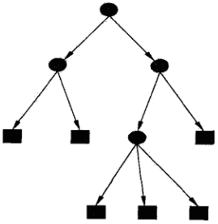

## 决策树与if-then规则

可以将决策树看成一个if-then规则的集合，将决策树转换成if-then规则的过程是这样的：由决策树的根结点到叶结点的每一条路径构建一条规则。

路径上的内部结点的规则对应着规则的条件，而叶结点的类对应着规则的结论。决策树的路径或其对应的if-then规则集合具有一个重要的性质：**互斥并且完备**。这就是说，每一条实例都被一条路径或者一条规则所覆盖，而且只被一条路或一条规则所覆盖。

## 决策树与条件概率分布

决策树还表示给定特征下类的条件概率分布。这一条件概率分布定义在特征空间的一个划分上。

将特征空间划分为互不相交的单元或者区域，并在每个单元定义一个类的概率分布，就构成了一个条件概率分布，所以决策树是判别模型而不是生成模型。

决策树的一条路径对应于划分中的一个单元。决策树所表示的条件概率分布由各个单元给定下类的条件概率分布组成。假设X为表示特征的随机变量，Y为表示类的随机变量，那么这个条件概率分布可以表示为P(Y|X)。X取值于给定划分单元的集合，Y取值于类的集合。

**各叶结点（单元）上的条件概率往往偏向于某一个类**，即属于某一类的条概率较大。决策树分类时将该结点的实例强行分到条件概率大的那一类中。

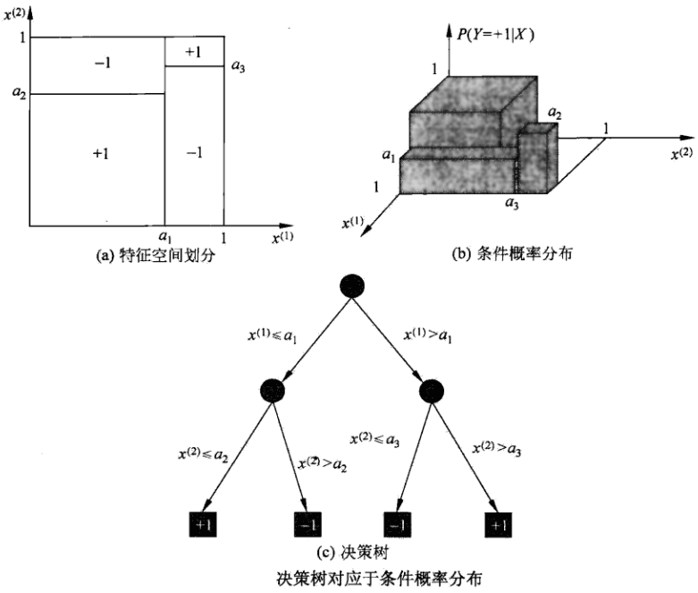

上图（a）示意地表示了特征空间的一个划分。图中的大正方形表示特征空间。这个大正方形被若干个小矩形分割，每个小矩形表示一个单元。特征空间划分上的单元构成了一个集合，X取值为单元的集合。为简单起见，假设只有两类：正类和负类，即Y取值为+1和-1。小矩形中的数字表示单元的类，上图（b）示意地表示特征空间划分确定时，特征（单元）给定条件下类的条件概率分布。上图（b）中条件概率分布对应于上图（a）的划分。当某个单元c的条件概率满足P(Y=+1|X=c)>0.5时，则认为这个单元属于正类，即落在这个单元的实例都被视为正例。上图（c）为对应于上图（b）中条件概率分布的决策树。

## 决策树学习算法

决策树学习，假设给定训练数据集
$$
D=\{(x_1,y_1),(x_2,y_2),...,(x_N,y_N)\}
$$
其中，
$$
x_i=(x_i^{(1)},x_i^{(2)},...,x_i^{(n)})^T
$$
为输入实例（特征向量），n为特征个数，
$$
y_i\in\{1,2,...,K\}
$$
为类标记，i=1,2,...,N，N为样本容量。学习的目标是根据给定的训练数据集，构建一个决策树模型，使它能够对实例进行正确的分类。

**决策树本质上是从训练数据集中归纳出一组分类规则**。从另一个角度看，决策树学习是由训练数据集估计条件概率模型，所以决策树是判别式模型。

决策树学习的损失函数通常是正则化的极大似然函数。决策树学习的策略是以损失函数为目标函数的最小化，正则化是为了产生一颗泛化能力强，即处理未见示例能力强的决策树，其基本的流程遵循简单且直观的“分而治之”策略。

但是，从所有可能的决策树中选择最优决策树是NP完全问题，通常采用启发式方法，近似求解这一最优化问题，这样得到的决策树是次最优的。

决策树学习的算法是一个递归地选择最有特征，并根据该特征对训练数据进行分割，使得对各个子数据集有一个最好的分类的过程，这本质上其实是贪心策略。这一过程对应着特征空间的划分，也对应着决策树的构建。

决策树基本的学习算法如下所示：

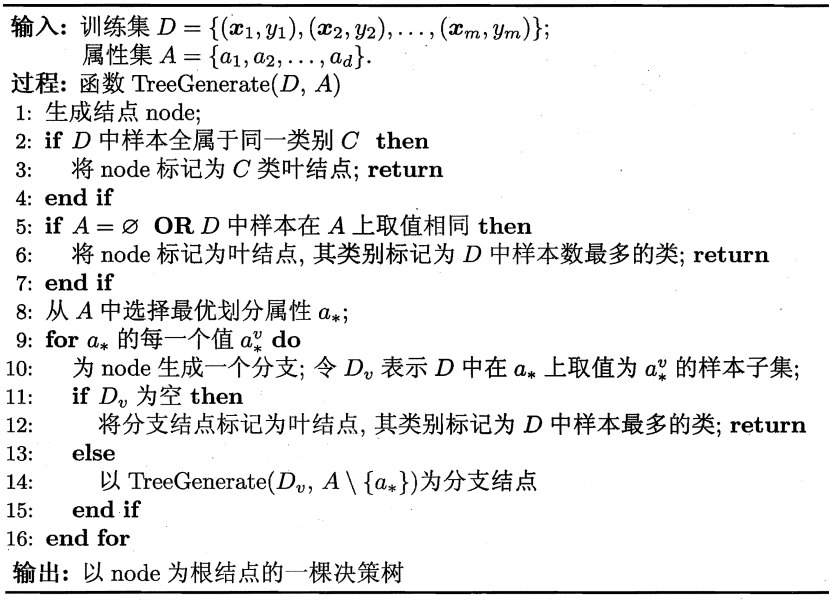

显然，决策树的生成是一个递归过程。在决策树的基本算法中，有三种情况会导致递归返回：

（1）当前结点包含的样本全属于同一类别，无需划分；

（2）当前属性集为空，或是所有样本在所有属性上取值相同，无法划分；

（3）当前结点包含的样本集为空，不能划分。

在第（2）种情况下，我们把当前结点标记为叶结点，但把其类别设定为该结点所含样本最多的类别；

在第（3）种情况下。同样把当前结点标记为叶结点，但将其类别设定为其父结点所含样本最多的类别。

注意，这两种情形的处理实质不同：情形（2）是利用当前结点的后验分布，而情形（3）是把父结点的样本分布作为当前结点的先验分布。

# 特征选择

## 特征选择问题

从上面的决策树学习算法可以看出，决策树学习的关键是第8行，即如何选择最优化分属性，随着划分过程不断进行，我们希望决策树的分支结点所包含的样本尽可能属于同一类别，即结点的“纯度”越来越高，这样可以提高决策树学习的效率。

## 信息增益

特征A对训练数据集D的信息增益g(D, A)，定义为集合D的经验熵H(D)与特征A给定条件下D的条件经验熵H(D|A)之差，即
$$
g(D,A)=H(D)-H(D|A)
$$
熵H(Y)与条件熵H(Y|X)之差称为互信息。决策树学习中的信息增益等价于训练数据集中类与特征的互信息。

信息增益表示得知特征X的信息而使类Y的信息的不确定性减少的程度。一般而言，信息增益越大，意味着使用属性a来进行划分所获得的“纯度提升”越大，因此，我们可用信息增益来进行决策树的划分属性的选择。选择信息增益最大的属性，即在上图的决策树学习算法的第8行选择属性a*
$$
a_*=\text{arg }\mathop{\text{max}}_{a\in A}\ \text{Gain}(D,a)
$$
著名的ID3算法就是以信息增益为准则来选择划分属性。

---

下面介绍计算信息增益的具体算法：

根据信息增益准则的特征选择方法是：训练数据集（或子集）D，计算器每个特征的信息增益，并比较它们的大小，选择信息增益最大的特征。

设训练数据集为D，|D|表示其样本容量，即样本个数。设有K个类Ck，k=1, 2, ... ,K，|Ck|为属于类Ck的样本个数，
$$
\sum_{k=1}^K|C_k|=|D|
$$
。设特征A有n个不同的取值{a1, a2, ... , an}，根据特征A的取值将D划分为n个子集D1, D2, ... , Dn，|Di|为Di的样本个数，
$$
\sum_{i=1}^n|D_i|=|D|
$$
。记子集Di中属于类Ck的样本的集合为Dik，即
$$
D_{ik}=D_i\cap C_k
$$
，|Dik|为Dik的样本个数，于是信息增益的算法如下：

**信息增益的算法：**

输入：训练数据集D和特征A；

输出：特征A对训练集D的信息增益g(D,A)。

（1）计算数据集D的经验熵H(D)
$$
H(D)=-\sum_{k=1}^K\frac{C_k}{D}\text{log}_2\frac{C_k}{D}
$$
（2）计算特征A对数据集D的经验条件熵H(D|A)
$$
H(D|A)=\sum_{i=1}^n\frac{|D_i|}{|D|}H(D_i)=-\sum_{i=1}^n\frac{|D_i|}{|D|}\sum_{k=1}^K\frac{|D_{ik}|}{|D_i|}log_2\frac{|D_{ik}|}{|D_i|}
$$
（3）计算信息增益
$$
g(D,A)=H(D)-H(D|A)
$$

## 信息增益率

以信息增益率作为划分训练数据集的特征，存在偏向于选择取值较多的特征的问题。使用信息增益率，可以对这一问题进行校正。这也是特征选择的另一准则。

**信息增益率的定义**

特征A对训练数据D的信息增益率
$$
g_R(D,A)
$$
定义为其信息增益g(D,A)与其训练数据集D关于特征A的值的熵$H_A(D)$之比，即
$$
g_R(D,A)=\frac{g(D,A)}{H_A(D)}
$$
其中，
$$
H_A(D)=-\sum_{i=1}^n\frac{|D_i|}{|D|}\text{log}_2\frac{|D_i|}{|D|}
$$
，n是特征A取值的个数。

上式表明，一个特征的取值越多，则其本身的熵越大。

C4.5算法使用信息增益率。

## 基尼指数

CART决策树使用“基尼指数”（Gini index）来选择划分属性。数据集D的纯度可以用基尼指数来度量：

分类问题中，假设有K个类，样本点属于第k类的概率为pk，则概率分布的基尼指数定义为
$$
\begin{aligned}
\text{Gini}(D)&=\sum_{k=1}^{K}\sum_{k'\neq k}p_kp_{k'}\\
&=\sum_{k=1}^{K}p_k(1-p_k)\\
&=1-\sum_{k=1}^{K}p_k^2
\end{aligned}
$$
直观的来说，Gini(D)反映了**从数据集D中随机抽取两个样本，其类别标记不一致的概率**。因此，Gini(D)越小，则数据集D的纯度越高。

对于给定的样本集合D，其基尼指数为
$$
\text{Gini}(D)=1-\sum_{k=1}^K\left(\frac{|C_k|}{|D|}\right)^2
$$
这里，Ck是D中属于第k类的样本子集，K是类的个数。

如果样本集合D根据特征A是否取某一可能值a被分割成D1和D2两部分，则在特征A的条件下，集合D的基尼指数定义为
$$
\text{Gini}(D,A)=\frac{|D_1|}{|D|}\text{Gini}(D_1)+\frac{|D_2|}{|D|}\text{Gini}(D_2)
$$

基尼指数Gini(D)表示集合D的不确定性，基尼指数Gini(D,A)表示经A=a分割后，集合的不确定性。尼基指数越大，样本的集合不确定性越大，这一点与熵类似。

下图是二分类问题中基尼指数Gini(p)、熵之半（0.5H(p)）和分类误差率之间的关系。横坐标表示概率p，纵坐标表示损失，可以看出，基尼指数和熵之半的曲线很接近，都可以近似地代表分类误差率。

# 决策树的生成

## ID3算法

ID3算法的核心是在决策树各个结点上应用信息增益准则选择特征，递归地构建决策树。

具体方法是：从根结点开始，对结点计算所有可能的特征的信息增益，选择信息增益最大的特征作为结点的特征，由该特征的不同取值建立子结；再对子结点递归地调用以上方法，构建决策树；直到所有特征的信息增益均很小或者没有特征可以选择为止。最后得到一颗决策树。

ID3相当于用极大似然法进行概率模型的选择。

**ID3算法：**

输入：训练数据集D，特征集A，阈值ε；

输出：决策树T。

（1）若D中所有实例属于同一类Ck，则T为单结点树，并将类Ck作为该结点的类标记，返回T；

（2）若A=Ø，则T为单结点树，并将D中实例数最大的类Ck作为该结点的类标记，返回T；

（3）否则，计算A中个特征对D的信息增益，选择信息增益最大的特征Ag；

（4）如果Ag的特征小于阈值ε，则置T为单结点树，并将D中实例数最大的类Ck作为该结点的类标记，返回T；

（5）否则，对Ag的每一可能只ai，依Ag=ai将D分割为若干非空子集Di，将Di中实例数最大的类作为标记，构建子结点，由结点及其子结点构成树T，返回T；

（6）对第i个子结点，以Di为训练集，以 A - Ag 为特征集，递归地调用步（1）到步（5），得到子树Ti，返回Ti

---

ID3算法只有树的生成，所以该算法生成的树容易产生过拟合。

## C4.5算法

C4.5算法与ID3算法相似，C4.5算法那对ID3算法进行了改进。C4.5在生成过程中，使用信息增益率来选择特征。

## CART算法

分类与回归树（classification and regression tree， CART）模型由Breiman等人在1984年提出，即可用于分类，也可用于回归。一下将分类与回归的树统称为决策树。

CART假设决策树是**二叉树**，内部结点特征的取值是”是“和”否“，左分支是取值为”是“的分支，右分支是取值为”否“的分支，这样的决策树等价于递归地二分每个特征，将特征空间划分为有限个单元，预测条件概率分布。

CART算法由以下两步组成：

（1）决策树生成：基于训练数据集生成决策树，生成的决策树要尽量大；

（2）决策树剪枝：用验证数据集对已生成的树进行剪枝并选择最优子树，这时用损失函数最小作为剪枝的标准。

**CART生成：**

决策树的生成就是递归地构建二叉决策树的过程。对**回归树用平方误差最小化**准则，对**分类树用基尼指数最小化**准则，进行特征选择，生成二叉树。

### 回归树的生成

**最小二乘回归树生成算法：**

输入：训练数据集D；

输出：回归树f(x)。

在训练数据集所在的输入空间中，递归地将每个区域划分为两个子区域并决定每个子区域上的输出值，构建二叉决策树：

（1）选择最优切分变量j与切分点s，求解
$$
\mathop{\text{min}}_{j,s}\left[ \mathop{\text{min}}_{c_1}\sum_{x_i\in R_1(j,s)}(y_i-c_1)^2 + \mathop{\text{min}}_{c_2}\sum_{x_i\in R_2(j,s)}(y_i-c_2)^2  \right]
$$
遍历变量j（个人理解，这里的j可能是第j个特征吧），对固定的切分变量j扫描切分点s，选择使上式达到最小值的对(j,s)。

（2）用选定的对(j,s)划分区域并决定相应的输出值：
$$
R_1(j,s)=\{x|x^{(j)}\leq s\},\quad R_2(j,s)=\{x|x^{(j)}> s\}
$$

$$
\hat{c}_m=\frac{1}{N_m}\sum_{x_i\in R_m(j,s)}y_i,\quad x\in R_m,\quad m=1,2
$$

（3）继续对两个子区域调用步骤（1），（2），直到满足停止条件。

（4）将输入空间划分为M个区域R1, R2,  ... , RM，生成决策树：
$$
f(x)=\sum_{m=1}^M\hat{c}_mI(x\in R_m)
$$

### 分类树的生成

分类树用基尼指数选择最优特征，同时决定该特征的最有而至切分点。

**CART生成算法：**

输入：训练数据集D，停止计算的条件；

输出：CART决策树。

根据训练数据集，从根结点开始，递归地对每个结点进行以下操作，构建二叉决策树：

（1）设结点的训练数据集为D，计算现有特征对该数据集的基尼指数。即，对每一个特征A，对其可能取的每一个值a，根据样本点对A=a的测试为”是“或者”否“将D分割成D1和D2两部分，计算A=a时的基尼指数。

（2）在所有可能的特征A以及它们所有可能的切分点a中，选择基尼指数最小的特征及其对应的切分点作为最优特征与最优切分点。依最优特征与最优切分点，从现结点生成两个子结点，将训练数据集依特征分配到两个子结点中去。

（3）对两个子结点递归地调用（1）、（2），直到满足停止条件。

（4）生成CART决策树。

算法停止计算的条件是结点中的样本个数小于预定阈值，或样本集的基尼指数小于预定阈值（样本基本属于同一类），或者没有更多的特征。

# 决策树的剪枝

决策树生成算法递归地产生决策树，直到不能继续下去为止。这样产生的树往往对训练数据的分类很准确，但对未知的测试数据的分类却没有那么准确，即出现过拟合现象。解决这个问题的办法是考虑决策树的复杂度，对已经生成的决策树进行简化。

在决策树学习中将已经生成的树进行简化的过程称为剪枝。具体地，剪枝从已经生成的树上裁掉一些子树或者叶结点，并将其根结点或父结点作为新的叶结点，从而简化分类树模型。

决策树剪枝的基本策略有“预剪枝”和“后剪枝”两种：

* **预剪枝**是指在决策树生成过程中，对每个结点在划分前先进行估计，若当前结点的划分不能带来决策树泛化性能（验证集准确率）的提升，则停止划分并将当前结点标记为叶结点；
* **后剪枝**则是先从训练集生成一棵完整的决策树，然后自底向上地对非叶结点进行考察，若将该结点对应的子树替换为叶结点能带来决策树泛化性能提升，则将该子树替换为叶结点。

如何判断决策树泛化性能（验证集准确率）是否提升呢？这里采用留出法，即预留一部分数用作“验证集”已经醒性能评估。我们将西瓜书中的西瓜数据集2.0（这里就不写出了）随机划分成两部分，如下表所示，编号为\{1,2,3,6,7,10,14,15,16,17\}的样例组成训练集，编号为\{4,5,8,9,11,12,13\}的样例组成验证集。

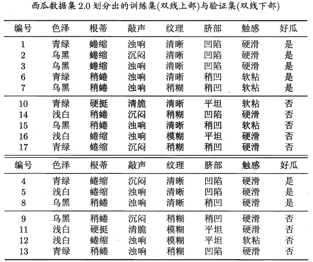

基于上表生成的未剪枝决策树：

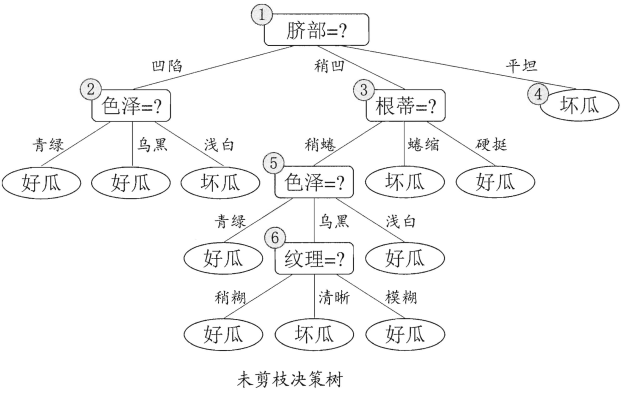

## 预剪枝

我们先讨论预剪枝。

基于信息增益准则，我们会选取属性“脐部”来对训练集进行划分，并产生3个分支，如下图所示。

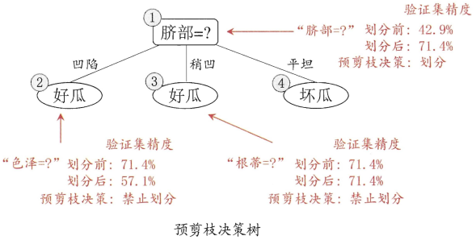

然而，是否应该进行这个划分呢？预剪枝要对划分前后的泛化性能进行估计。

在划分之前，所有样例集中在根结点。若不进行划分，则根据决策树学习算法的第6行，该结点被标记为叶结点，其类别标记为训练样例数目最多的类别，假设我们将这个叶结点标记为“好瓜”。用验证集对这个单结点决策树进行评估，则编号为\{4,5,8\}的样例被分类正确，另外4个样例分类错误，于是，，验证集经度为3/7=42.9%。

在用“脐部”进行划分以后，上图中的结点②、③、④分别包含编号为\{1,2,3,14\}、\{6,7,15,17\}、\{10,,16\}的训练样例，因此这3个结点分别被标记为叶结点"好瓜"、"好瓜"、"坏瓜"。此时，验证集中编号为\{4,5,8,11,12\}的样例被分类正确，验证集精度为5/7=71.4%>42.9%。于是，用“脐部”进行划分得以确定。

然后，决策树算法应该对结点②进行划分，基于信息增益准则将挑选出划分属性“色泽”。然而，在使用“色泽”划分后，编号为\{5\}的验证集样本分类结果会由正确转变为错误，使得验证集精度下降为57.1%，于是，预剪枝策略将禁止结点②被划分。

对结点③，最优化分属性为“根蒂”，划分后验证集精度仍为71.4%。这个划分不能提升验证集精度，于是，预剪枝策略禁止结点③被划分。

对结点④，其所含训练样例已经属于同一类，不再进行划分。

于是，基于预剪枝策略从上表的数据所生成的决策树如上图所示，其验证集精度为71.4%。这是一棵仅有一层划分的决策树。

对比上面的未剪枝决策树和上图（预剪枝决策树），可以看出，预剪枝决策树使得决策树的很多分支都没有“展开”，这不仅降低了过拟合的风险，还显著少了决策树的训练时间开销和测试时间开销。但另一方面，有些分支的当前划分虽不能提升泛化性能、甚至可能导致泛化性能暂时下降，但在其基础上进行的后续划分，却有可能导致性能显著提高；预剪枝基于**“贪心”本质**禁止这些分支展开，给预剪枝决策树带来了欠拟合的风险。

## 后剪枝

### 后剪枝过程描述

后剪枝先从训练集生成一棵完整决策树，例如基于上表的数据我们得到未剪枝的决策树，如下图所示。易知，该决策树的验证集精度为42.9%。

后剪枝首先考察未剪枝决策树中的结点⑥。若将其领衔的分支剪除，则相当于把⑥替换为叶结点。替换后的叶结点包含编号为\{7,15\}的训练样本，于是，该叶结点的类别标记为“好瓜”，此时决策树的验证集精度提高至57.1%。于是，后剪枝策略决定剪枝，如下图所示。

然后考察结点⑤，若将其领衔的子树替换为叶结点，则替换后的叶结点包含编号为\{6,7,15\}的训练样例，叶结点类别标记为“好瓜”，此时决策树验证集精度仍为57.1%。于是，可以不进行剪枝。

对结点②，若将其领衔的子树替换为叶结点，则替换后的叶结点包含编号为\{1,2,3,14\}的训练样例，叶结点标记为“好瓜”。此时决策树的验证集精度提高至71.4%.于是，后剪枝策略决定剪枝。

对结点③和①，若将其领衔的子树替换为叶结点，则所得决策树的验证集精度分别为71.4%与42.9%，均未得到提高.于是它们被保留。

最终，基于后剪枝策略上表数据所生成的决策树如下图所示，其验证集精度为71.4%。

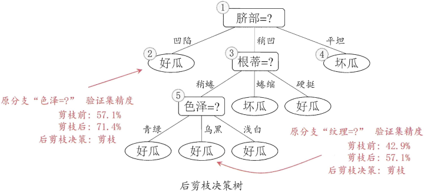

对比上图（后剪枝）和上上上图（预剪枝）可看出，后剪枝决策树通常比预剪枝决策树保留了更多的分支。一般情形下，后剪枝决策树的欠拟合风险很小，泛化性能往往优于预剪枝决策树。但后剪枝过程是在生成完全决策树之后进行的，并且要自底向上地对树中的所有非叶结点进行逐一考察，因此其训练时间开销比未剪枝决策树和预剪枝决策树都要大得多。

### 后剪枝算法

上面说得比较直觉化，下面用公式来较严格地说明后剪枝过程。

决策树的剪枝旺旺通过极小化决策树整体的损失函数或代价函数来实现。设树T的叶结点个数为|T|，t是树T的叶结点，该叶结点上有Nt个样本点，其中k类的样本点有Ntk个，k=1,2,...,K，Ht(T)为叶结点t上的经验熵，α≥0为参数，则决策树学习的损失函数可以定义为
$$
C_{\alpha}(T)=\sum_{t=1}^{|T|}N_tH_t(T)+\alpha|T|
$$
其中经验熵为
$$
H_t(T)=-\sum_k\frac{N_{tK}}{Nt}\text{log}\frac{N_{tK}}{N_t}
$$
在损失函数中，将上上式有段的第1项记作
$$
C(T)=\sum_{t=1}^{|T|}N_tH_t(T)=-\sum_{t=1}^{|T|}\sum_{k=1}^KN_{tk}\text{log}\frac{N_{tk}}{N_t}
$$
这时有
$$
C_{\alpha}(T)=C(T)+\alpha|T|
$$
上式中，C(T)表示模型对训练数据的预测误差，即模型与训练数据的拟合程度，|T|表示模型复杂度，参数α≥0控制两者之间的影响，较大的α促使选择较简单的模型（树），较小的α促使选择较复杂的模型（树）。α=0意味着只考虑模型与训练数据的拟合成都，不考虑模型的复杂度。

剪枝，就是当α确定时，选择损失函数最小的模型，即损失函数最小的子树。当α值确定时，子树越大，往往与训练数据的拟合越好，但是模型的复杂度就越高；相反，子树越小，模型的复杂度就越低，但是往往与训练数据的拟合不好。损失函数正好表示了对两者的平衡。

可以看出，决策树生成只针对了通过提高信息增益（或者信息增益率）对训练数据进行了更好的拟合，而决策树剪枝通过优化函数损失函数还考虑了减小模型复杂度。**决策树生成学习局部的模型，而决策树剪枝学习整体的模型。**

上式定义的考虑了模型复杂度的损失函数的街笑话等价于正则化的极大似然估计。所以，利用损失函数最小原则进行剪枝就是用正则化的极大似然估计进行模型选择。

决策树剪枝过程的示意图如下图所示：

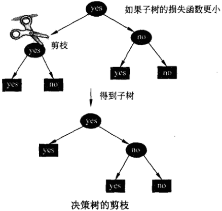

**树的剪枝算法：**

输入：生成算法产生的整个树T，参数α

输出：修剪后的子树Tα。

（1）计算每个结点的经验熵。

（2）递归地从树的叶结点向上回缩。

设一组叶结点回缩到其父结点之前与之后的整体树分别为$T_B$和$T_A$，其对应的损失函数值分别是Cα(T_B)和Cα(T_A)，如果
$$
C_{\alpha}(T_A)\leq C_{\alpha}(T_B)
$$
则进行剪枝，即将父结点变为新的叶结点。

（3）返回（2），直至不能继续为止，得到损失函数最小的子树Tα。

注意，上式只需考虑两个数的损失函数的差，其计算可以在局部进行，所以，决策树的简直算法可以由一种动态规划的算法实现。

### CART后剪枝

CART剪枝算法从“完全生长”的决策树的底端剪去一些子树，使决策树变小（模型变简单），从而能够对未知数据有更准确的预测。CART剪枝算法由两步组  成：首先从生成算法产生的决策树T0底端开始不断剪枝，直到T0的根结点，形成一个子树序列\{T0,T1,...,Tn\}；然后通过交叉验证法在独立的验证数据集上对子树序列进行测试，从中选择最优子树。

1.剪枝，形成一个子树序列 

在剪枝过程中，计算子树的损失函数： 
$$
C_{\alpha}(T)=C(T)+\alpha|T|
$$
其中，T为任意子树，C(T)为对训练数据的预测误差（如基尼指数），|T|为子树的叶结点个数，α≥0为参数，Cα(T)为参数是α时的子树T的整体损失。参数α权衡训练数据的拟合程度与模型的复杂度。  

对固定的a，—定存在使损失函数Cα(T)最小的子树，将其表示为Tα。Tα在损失函数Cα(T)最小的意义下是最优的。容易验证这样的最优子树是唯一的。当α大的时候，最优子树Tα偏小；当α小的时候，最优子树Tα偏大。极端情况，当α= 0时，整体树是最优的。当α→∞时，根结点组成的单结点树是最优的。 

Breiman等人证明：可以用递归的方法对树进行剪枝。将α从小增大，0 = α0 < α1 < ... < αn < +∞，产生一系列的区间[αi, α(i+1)), i=0,1,...,n；剪枝得到的子树序列对应着区间α ∈ [αi, α(i+1)), i=0,1,...,n的最优子树序列\{T0, T1 ,... ,Tn\}，序列中的子树是嵌套的。

# 连续与缺失值

## 连续值处理

## 缺失值处理

# 多变量决策树

# ==============

# 决策树概述

## 摘要

这里讨论一种被广泛使用（并且建议优先使用）的分类算法——[决策树](http://en.wikipedia.org/wiki/Decision_tree)（decision tree）。相比贝叶斯算法，决策树的优势在于构造过程不需要任何领域知识或参数设置，因此在实际应用中，对于探测式的知识发现，决策树更加适用。

当一条记录有若干不同的方式划分为目标类的一部分时，适合用单条线来发现类别之间边界的统计学方法是无力的。而决策树能够成功地达到这一目标。

## 引入并定义决策树

通俗来说，决策树分类的思想类似于找对象。现想象一个女孩的母亲要给这个女孩介绍男朋友，于是有了下面的对话：

> **女儿**：多大年纪了？
>
> 母亲：26。
>
> **女儿**：长的帅不帅？
>
> 母亲：挺帅的。
>
> **女儿**：收入高不？
>
> 母亲：不算很高，中等情况。
>
> **女儿**：是公务员不？
>
> 母亲：是，在税务局上班呢。
>
> **女儿**：那好，我去见见。

这个女孩的决策过程就是典型的分类树决策。相当于通过年龄、长相、收入和是否公务员对将男人分为两个类别：见和不见。假设这个女孩对男人的要求是：30岁以下、长相中等以上并且是高收入者或中等以上收入的公务员，那么这个可以用下图表示女孩的决策逻辑（**声明：此决策树纯属为了写文章而YY的产物，没有任何根据，也不代表任何女孩的择偶倾向，请各位女同胞莫质问我^_^**）：

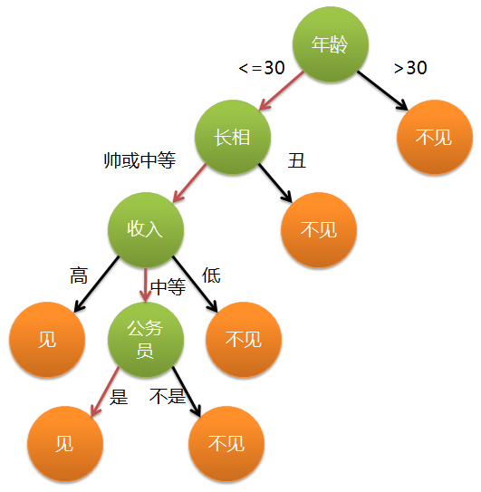

上图完整表达了这个女孩决定是否见一个约会对象的策略，其中绿色节点表示判断条件，橙色节点表示决策结果，箭头表示在一个判断条件在不同情况下的决策路径，图中红色箭头表示了上面例子中女孩的决策过程。

这幅图基本可以算是一颗决策树，说它“基本可以算”是因为图中的判定条件没有量化，如收入高中低等等，还不能算是严格意义上的决策树，如果将所有条件量化，则就变成真正的决策树了。

有了上面直观的认识，我们可以正式定义决策树了：

**决策树（decision tree）是一个树结构（可以是二叉树或非二叉树）。其每个非叶节点表示一个特征属性上的测试，每个分支代表这个特征属性在某个值域上的输出，而每个叶节点存放一个类别。使用决策树进行决策的过程就是从根节点开始，测试待分类项中相应的特征属性，并按照其值选择输出分支，直到到达叶子节点，将叶子节点存放的类别作为决策结果。**

可以看到，决策树的决策过程非常直观，容易被人理解。目前决策树已经成功运用于医学、制造产业、天文学、分支生物学以及商业等诸多领域。知道了决策树的定义以及其应用方法，下面介绍决策树的构造算法。

## 决策树的构造

不同于贝叶斯算法，决策树的构造过程不依赖领域知识，它使用属性选择度量来选择将元组最好地划分成不同的类的属性。所谓决策树的构造就是进行属性选择度量确定各个特征属性之间的拓扑结构。

构造决策树的关键步骤是分裂属性。所谓分裂属性就是在某个节点处按照某一特征属性的不同划分构造不同的分支，其目标是让各个分裂子集尽可能地“纯”。尽可能“纯”就是尽量让一个分裂子集中待分类项属于同一类别。

分裂属性分为三种不同的情况：

1. 属性是离散值且不要求生成二叉决策树。此时用属性的每一个划分作为一个分支。
2. 属性是离散值且要求生成二叉决策树。此时使用属性划分的一个子集进行测试，按照“属于此子集”和“不属于此子集”分成两个分支。
3. 属性是连续值。此时确定一个值作为分裂点split_point，按照>split_point和<=split_point生成两个分支。

构造决策树的关键性内容是进行**属性选择度量**，属性选择度量是一种选择分裂准则，是将给定的类标记的训练集合的数据划分D“最好”地分成个体类的[启发式方法](http://en.wikipedia.org/wiki/Heuristic_(computer_science))，它决定了拓扑结构及分裂点split_point的选择。

属性选择度量算法有很多，一般使用自顶向下递归分治法，并采用不回溯的[贪心策略](http://en.wikipedia.org/wiki/Greedy_algorithm)(决策树的**实质**就是贪心算法，只管当前最好，今朝有酒今朝醉，哪管日后洪水滔天)。这里介绍[ID3](http://en.wikipedia.org/wiki/ID3_algorithm)、[C4.5](http://en.wikipedia.org/wiki/C4.5_algorithm)和CART三种常用算法。

### ID3算法

 从[信息论](http://en.wikipedia.org/wiki/Information_theory)知识中我们直到，期望信息越小，[信息增益](http://en.wikipedia.org/wiki/Information_gain)越大，从而纯度越高。所以ID3算法的核心思想就是以**信息增益**度量属性选择，选择分裂后信息增益最大的属性进行分裂。下面先定义几个要用到的概念。

设D为用类别对训练元组进行的划分，则D的[熵](http://en.wikipedia.org/wiki/Entropy)（entropy）表示为：
$$
info(D)=-\sum_{i=1}^{m}p_i log_2p_i
$$
其中$p_i$表示第i个类别在整个训练元组中出现的概率，可以用属于此类别元素的数量除以训练元组元素总数量作为估计。熵的实际意义表示是D中元组的类标号所需要的平均信息量。

现在我们假设将训练元组D按属性A进行划分，则A对D划分的期望信息为：
$$
info_A(D)=\sum_{j=1}^{v}\frac{|D_j|}{|D|}info(D_j)
$$
而信息增益即为两者的差值：
$$
gain(A)=info(D)-info_A(D)
$$
ID3算法就是在每次需要分裂时，计算每个属性的增益率，然后选择增益率最大的属性进行分裂。下面我们继续用SNS社区中不真实账号检测的例子说明如何使用ID3算法构造决策树。为了简单起见，我们假设训练集合包含10个元素：

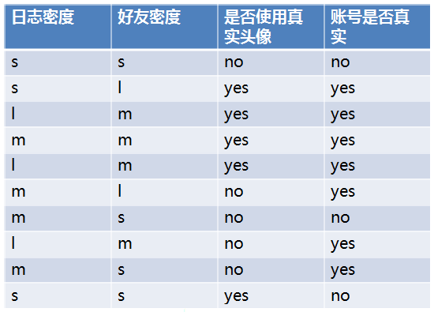

其中s、m和l分别表示小、中和大。

设L、F、H和R表示日志密度、好友密度、是否使用真实头像和账号是否真实，下面计算各属性的信息增益。
$$
\begin{aligned}
info(D)&=-0.7log_2{0.7}-0.3log_2{0.3}\\
&=0.7\times 0.51+0.3\times 1.74\\
&=0.879
\end{aligned}
$$

$$
\begin{aligned}
info_L(D)=&0.3\times (-\frac{0}{3}log_2{\frac{0}{3}}-\frac{3}{3}log_2\frac{3}{3})\\
+&0.4\times (-\frac{1}{4}log_2\frac{1}{4}-\frac{3}{4}log_2\frac{3}{4})\\
+&0.3\times (-\frac{1}{3}log_2\frac{1}{3}-\frac{2}{3}log_2\frac{2}{3})\\
=&0+0.326+0.277\\
=&0.603
\end{aligned}
$$

$$
gain(L)=0.879-0.603=0.276
$$

因此日志密度的信息增益是0.276。

用同样方法得到F和H的信息增益分别为0.033和0.553。

因为F具有最大的信息增益，所以第一次分裂选择F为分裂属性，分裂后的结果如下图表示：

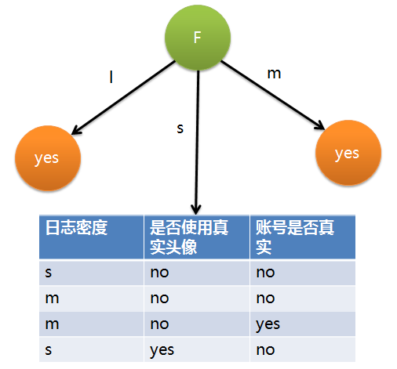

在上图的基础上，再递归使用这个方法计算子节点的分裂属性，最终就可以得到整个决策树。

上面为了简便，将特征属性离散化了，其实日志密度和好友密度都是连续的属性。对于特征属性为**连续值**，可以如此使用ID3算法：

先将D中元素按照特征属性排序，则每两个相邻元素的中间点可以看做潜在分裂点，从第一个潜在分裂点开始，分裂D并计算两个集合的期望信息，具有最小期望信息的点称为这个属性的最佳分裂点，其信息期望作为此属性的信息期望。

ID3算法存在一个问题，就是偏向于多值属性，例如，如果存在唯一标识属性ID，则ID3会选择它作为分裂属性，这样虽然使得划分充分纯净，但这种划分对分类几乎毫无用处。

### C4.5算法

ID3算法存在一个问题，就是偏向于多值属性，例如，如果存在唯一标识属性ID，则ID3会选择它作为分裂属性，这样虽然使得划分充分纯净，但这种划分对分类几乎毫无用处。ID3的后继算法C4.5使用[**信息增益率**](http://en.wikipedia.org/wiki/Information_gain_ratio)（gain ratio）的信息增益扩充，试图克服这个偏倚。

C4.5算法首先定义了“分裂信息”，其定义可以表示成：
$$
split\_info_A{D}=-\sum_{j=1}^{v}\frac{D_j}{D}log_2\frac{D_j}{D}
$$
其中各符号意义与ID3算法相同，然后，增益率被定义为：
$$
gain\_ratio(A)=\frac{gain(A)}{split_info(A)}
$$
C4.5选择具有最大增益率的属性作为分裂属性，其具体应用与ID3类似，不再赘述。

### CART算法

用**基尼系数**(Gini Index)作为纯度度量

**GINI系数**

1. 是一种不等性度量；
2. 通常用来度量收入不平衡，可以用来度量任何不均匀分布；
3. 是介于0~1之间的数，0-完全相等，1-完全不相等；
4. **总体内包含的类别越杂乱，GINI指数就越大（跟熵的概念很相似） **

**基尼不纯度指标**

在CART算法中，基尼不纯度表示一个随机选中的样本在子集中被分错的可能性。基尼不纯度为这个样本被选中的概率乘以它被分错的概率。当一个节点中所有样本都是一个类时，基尼不纯度为零。
假设y的可能取值为1, 2, ..., m，令pi是样本被赋予i的概率，则**基尼指数**可以通过如下计算：
$$
Gini(p)=\sum_{i=1}^{m}p_i(1-p_i)=1-\sum_{i=1}^{m}p_i^2
$$
基尼不纯度的大概意思是：一个随机事件变成它的对立事件的概率

例如一个随机事件X ，P(X=0) = 0.5, P(X=1)=0.5，那么基尼不纯度就为P(X=0)×(1-P(X=0))+P(X=1)×(1-P(X=1))=0.5。

一个随机事件Y ，P(Y=0)=0.1, P(Y=1)=0.9，则基尼不纯度就为P(Y=0)×(1 - P(Y=0))+P(Y=1)×(1-P(Y=1))=0.18。

很明显X比Y更混乱，因为两个都为0.5，很难判断哪个发生。而Y就确定得多，Y=0发生的概率很大。而基尼不纯度也就越小。

所以，和熵可以作为衡量系统混乱程度的标准一样，基尼不纯度也可以作为衡量系统混乱程度的标准。

**cart分类树中的基尼指数**

如果训练数据集D根据特征A是否取某一可能值a被分割为D1和D2两部分，则在特征A的条件下，集合D的基尼指数定义为
$$
Gini(D,A)=\frac{|D_1|}{|D|}Gini(D_1)+\frac{|D_2|}{|D|}Gini(D_2)
$$
基尼指数$Gini(D)$表示集合D的不确定性，基尼指数$Gini(D,A)$表示经过A=a分割后集合D的不确定性。基尼指数越大，样本的不确定性也就越大。

**熵VS基尼指数**

随机变量的熵表达形式：
$$
H(X)=-\sum_{n=1}^{N}p_ilog(p_i)
$$
随机变量的基尼系数表达形式：
$$
Gini(p)=\sum_{i=1}^{m}p_i(1-p_i)=1-\sum_{i=1}^{m}p_k^2
$$
主要区别在于，熵达到峰值的过程要相对慢一些。因此，熵对于混乱集合的判罚要更重一些。

同样可以根据计算基尼不纯度公式计算。实际使用中，熵值对于混乱的惩罚更小，使用熵的情况更多。

### CHAID决策树

使用**卡方检验**进行评估

### 不同算法对比

老师，在CART树中，基尼不纯度和基尼系数是一个意思吗？

## 剪枝

问题

过度拟合(over fitting)

对策

前剪枝(pre prune)：先设定好规则，一旦数据符合这个规则就被剪枝

后剪枝(post prune): 子树替换，子树提升

​         奥卡姆剃刀(Occam’s Razor)：

**过度拟合：**它可能会变得过于针对训练数据，其熵值与真实情况相比可能会有所降低。**剪枝**的过程就是对具有相同父节点的一组节点进行检查，判断如果将其合并，熵的增加量是否会小于某个指定的阈值。如果确实如此，则这些叶节点会被合并成一个单一的节点，合并后的新节点包含了所有可能的结果值。这种做法有助于过度避免过度拟合的情况，使得决策树做出的预测结果，不至于比从数据集中得到的实际结论还要特殊：

# 参考文献

* [算法杂货铺——分类算法之决策树(Decision tree)](http://www.cnblogs.com/leoo2sk/archive/2010/09/19/decision-tree.html)

“决策树概述”很大部分参考了此文章。

* [CART算法中的基尼指数](http://blog.sina.com.cn/s/blog_14a25e82b0102xc6l.html)

"CART算法"一节参考了此文章。

[算法杂货铺——分类算法之决策树(Decision tree)](http://www.cnblogs.com/leoo2sk/archive/2010/09/19/decision-tree.html)

[机器学习算法之决策树](https://www.jianshu.com/p/6eecdeee5012)

[决策树与随机森林](http://www.cnblogs.com/fionacai/p/5894142.html)

[理解决策树](https://mp.weixin.qq.com/s?__biz=MzU4MjQ3MDkwNA==&mid=2247484827&idx=1&sn=043d7d0159baaddfbf92ed78ee5b1124&chksm=fdb6980ccac1111a9faeae7f517fee46a1dfab19612f76ccfe5417487b3f090ab8fc702d18b8&scene=0#rd)

