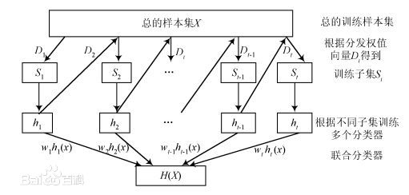
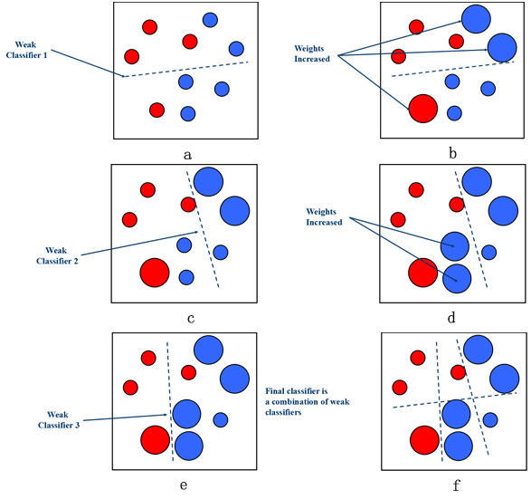

# AdaBoost

* [返回顶层目录](../../SUMMARY.md)
* [返回上层目录](ensemble-learning.md)
* [AdaBoost概述](#AdaBoost概述)
* [AdaBoost算法](#AdaBoost算法)
* [AdaBoost算法的训练误差分析](#AdaBoost算法的训练误差分析)
* [AdaBoost算法的解释](#AdaBoost算法的解释)
* [AdaBoost算法的优点](#AdaBoost算法的优点)
* [提升树](#提升树)

# AdaBoost概述

由于Boosting算法在解决实际问题时有一个重大的缺陷，即他们都要求事先知道弱分类算法分类正确率的下限，这在实际问题中很难做到，后来Freund和Schapire提出了AdaBoost 算法，该算法的效率与Freund方法的效率几乎一样，却**不需要知道弱分类算法分类正确率的下限**，可以非常容易地应用到实际问题中。

AdaBoost是Boosting算法家族中代表算法，AdaBoost主要是在整个训练集上维护一个分布权值向量Dm，用赋予权重的训练集通过弱分类算法产生分类假设Gm，即基分类器，然后计算他的错误率，用得到的错误率去更新分布权值向量Dm，对错误分类的样本分配更大的权值，正确分类的样本赋予更小的权值。每次更新后用相同的弱分类算法产生新的分类假设，这些分类假设的序列构成多分类器。对这些多分类器用加权的方法进行联合，最后得到决策结果。

这种方法不要求产生的单个分类器有高的识别率，即不要求寻找识别率很高的基分类算法，**只要产生的基分类器的识别率大于0.5，就可作为该多分类器序列中的一员**。

# AdaBoost算法

算法流程如下图所示，AdaBoost重复调用弱学习算法（多轮调用产生多个分类器），首轮调用弱学习算法时，按均匀分布从样本集中选取子集作为该次训练集，以后每轮对前一轮训练失败的样本，赋予较大的分布权值（Dm为第m轮各个样本在样本集中参与训练的权值），使其在这一轮训练出现的权值增加，即在后面的训练学习中集中对比较难训练的样本进行学习，从而得到M个弱的基分类器，G1, G2, ... , Gm，其中Gm有相应的权值wm，并且其权值大小根据该分类器的效果而定。最后的分类器由生成的多个分类器加权联合产生。

现在叙述AdaBoost算法，

输入：训练数据集
$$
T=\{ (x_1,y_1), (x_2,y_2), ... , (x_N,y_N) \}
$$
其中，每个样本点由实例与标记组成。实例xi∈X=R^n，yi∈Y=\{+1,-1\}；弱学习算法；

输出：最终分类器G(x)

（1）初始化训练数据的权值分布
$$
D_1=(w_{11}, ... , w_{1i}, , ... ,w_{1N}),\quad w_{1i}=\frac{1}{N},\quad i=1,2,...,N
$$
（2）对m=1,2,...,M

（a）使用具有权值分布Dm的训练数据学习，得到基本分类器
$$
G_m(x):\ X\rightarrow \{ -1, +1 \}
$$
（b）计算Gm(x)在训练数据集上的分类误差率
$$
e_m=P(G_m(x_i)\neq y_i)=\sum_{i=1}^Nw_{mi}I(G_m(x_i)\neq y_i)
$$
（c）计算Gm(x)的系数
$$
\alpha_m=\frac{1}{2}\text{log}\frac{1-e_m}{e_m}
$$
这里的对数是自然对数

（d）更新训练数据集的权值分布
$$
\begin{aligned}
D_{m+1}&=(w_{m+1,1},...,w_{m+1,i},...,w_{m+1,N})\\
w_{m+1,i}&=\frac{w_{mi}}{Z_m}\text{exp}(-\alpha_my_iG_m(x_i)),\quad i=1,2,...,N\\
\end{aligned}
$$
这里，Zm是规范化因子
$$
Z_m=\sum_{i=1}^Nw_{mi}\text{exp}(-\alpha_my_iG_m(x_i))
$$
它使D(m+1)成为一个概率分布。

（3）构建基本分类器的线性组合
$$
f(x)=\sum_{m=1}^M\alpha_mG_m(x)
$$
得到最终分类器
$$
G(x)=\text{sign}(f(x))=\text{sign}\left( \sum_{m=1}^M\alpha_mG_m(x) \right)
$$

---

对AdaBoost算法做如下**说明**：

**步骤（1）**假设训练数据集具有均匀的权值分布，即每个训练样本在基本分类器的学习中作用相同，这一假设保证第一步能够在原始数据上学习基本分类器G1(x)。

**步骤（2）**AdaBoost反复学习基本分类器，在每一轮m=1,2,...,M顺次地执行下列操作：

（a）使用当前分布Dm加权的训练数据集，学习基本分类器Gm(x)。

（b）计算基本分类器Gm(x)在加权训练数据集上的分类误差率：
$$
e_m=P(G_m(x_i)\neq y_i)=\sum_{G_m(x_i)\neq y_i}w_{mi}
$$
这里，w(mi)表示第m轮中第i个实例的权值，
$$
\sum_{i=1}^Nw_{mi}=1
$$
。这表明，Gm(x)在加权的训练数据集上的分类误差率是被Gm(x)误分类样本的权值之和，由此可以看出数据权值分布Dm与基本分类器Gm(x)的分类误差率的关系。

（c）计算基本分类器Gm(x)的系数αm。αm表示Gm(x)在最终分类器中的重要性。由前面的αm的计算公式（位于算法第c步）可知，当em≤1/2时，αm≥0，并且αm随着em的减小而增大，所以**分类误差率越小的基本分类器在最终分类器中的作用越大**。

（d）更新训练数据的权值分布为下一轮作准备，前面算法第d步的w(m+1,i)可以写成
$$
\begin{aligned}
w_{m+1,i}=
\left\{\begin{matrix}
&\frac{w_{mi}}{Z_m}\text{exp}(-\alpha_m), &\quad G_m(x_i)=y_i\\
&\frac{w_{mi}}{Z_m}\text{exp}(\alpha_m), &\quad G_m(x_i)\neq y_i\\ 
\end{matrix}\right.
\end{aligned}
$$
由此可知，被基本分类器Gm(x)误分类的样本的权值得以扩大，而被正确分类的样本的权值却得以缩小。两相比较，误分类的样本的权值被放大了
$$
e^{2\alpha_m}=\frac{1-e_m}{e_m}
$$
倍。因此，误分类样本在下一轮学习中起到更大的作用。**不改变所给的训练数据，而不断改变训练数据权值的分布，使得训练数据在基本分类器的学习中起不同的作用，这是AdaBoost的一个特点**。

**步骤（3）**线性组合f(x)实现M个基本分类器的加权表决。系数αm表示了基本分类器Gm(x)的重要性，这里，所有αm之和并不为1。f(x)的符号决定实例x的类，f(x)的绝对值表示分类的确信度。**利用基本分类器的线性组合构建最终分类器是AdaBoost的另一个特点**。

下图是对AdaBoost分类过程中样本权值的变化及最终的f(x)的**形象表示**：

# AdaBoost算法的训练误差分析

# AdaBoost算法的解释

# AdaBoost算法的优点

- AdaBoost是一种有很高精度的分类器
- AdaBoost可以支持各种方式构建的弱分类器，如上文中的x<v这样的分类器，AdaBoost提供的是框架
- 构造弱分类器简单，不用进行特征筛选
- 不用担心过拟合

# 提升树

AdaBoost与决策树的结合则形成了提升树（boosting tree），AdaBoost使得决策树的准确率大大提高，可与SVM相媲美。

