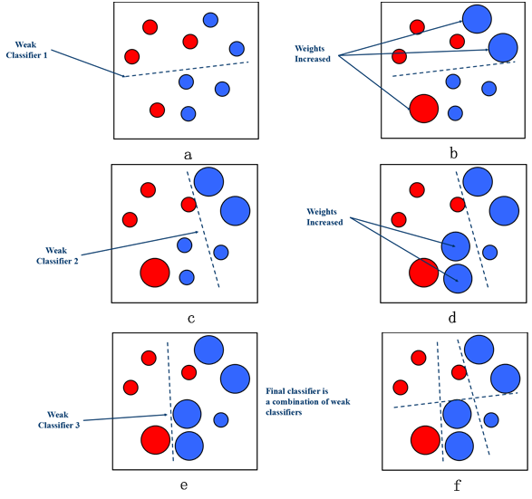

# AdaBoost[Boosting]

* [返回顶层目录](../../SUMMARY.md#目录)
* [返回上层目录](ensemble-learning.md)
* [AdaBoost概述](#AdaBoost概述)
  * [算法流程及伪码描述](#算法流程及伪码描述)
    * [算法伪码描述](#算法伪码描述)

## AdaBoost算法

由于Boosting算法在解决实际问题时有一个重大的缺陷，即他们都要求事先知道弱分类算法分类正确率的下限，这在实际问题中很难做到，后来Freund和Schapire提出了AdaBoost 算法，该算法的效率与Freund方法的效率几乎一样，却可以非常容易地应用到实际问题中。AdaBoost是Boosting算法家族中代表算法，AdaBoost主要是在整个训练集上维护一个分布权值向量$D_t(x)$ ，用赋予权重的训练集通过弱分类算法产生分类假设$H_t (x)$，即基分类器，然后计算他的错误率，用得到的错误率去更新分布权值向量$D_t(x)$，对错误分类的样本分配更大的权值，正确分类的样本赋予更小的权值。每次更新后用相同的弱分类算法产生新的分类假设，这些分类假设的序列构成多分类器。对这些多分类器用加权的方法进行联合，最后得到决策结果。这种方法不要求产生的单个分类器有高的识别率，即不要求寻找识别率很高的基分类算法，只要产生的基分类器的识别率大于0.5，就可作为该多分类器序列中的一员。

寻找多个识别率不是很高的弱分类算法比寻找一个识别率很高的强分类算法要容易得多，**AdaBoost 算法的任务就是完成将容易找到的识别率不高的弱分类算法提升为识别率很高的强分类算法**，这也是 AdaBoost 算法的核心指导思想所在，如果算法完成了这个任务，那么在分类时，只要找到一个比随机猜测略好的弱分类算法，就可以将其提升为强分类算法，而不必直接去找通常情况下很难获得的强分类算法。通过产生多分类器最后联合的方法提升弱分类算法，让他变为强的分类算法，也就是给定一个弱的学习算法和训练集，在训练集的不同子集上，多次调用弱学习算法，最终按加权方式联合多次弱学习算法的预测结果得到最终学习结果。包含以下2 点：

- **样本的权重**

AdaBoost通过对样本集的操作来训练产生不同的分类器，他是通过更新分布权值向量来改变样本权重的，也

就是提高分错样本的权重，重点对分错样本进行训练。

1. 没有先验知识的情况下,初始的分布应为等概分布,也就是训练集如果有 n个样本,每个样本的分布概率为1/ n。

1. 每次循环后提高错误样本的分布概率，分错的样本在训练集中所占权重增大,使得下一次循环的基分类器能够集中力量对这些错误样本进行判断。

- **弱分类器的权重**

最后的强分类器是通过多个基分类器联合得到的，因此在最后联合时各个基分类器所起的作用对联合结果有很大的影响，因为不同基分类器的识别率不同，他的作用就应该不同，这里通过权值体现他的作用，因此识别率越高的基分类器权重越高，识别率越低的基分类器权重越低。权值计算如下：

基分类器的错误率：
$$
e =\sum(h_t(x_i)\neq yi)D_i
$$
基分类器的权重：$W_t = F(e)$，由基分类器的错误率计算它的权重。$D_i$为第$i$轮各个样本在样本集中参与训练的概率。

### 算法流程及伪码描述

- **算法流程描述**

算法流程可用如下结构图描述，如下图所示AdaBoost重复调用弱学习算法(多轮调用产生多个分类器) ,首轮调用弱学习算法时，按均匀分布从样本集中选取子集作为该次训练集，以后每轮对前一轮训练失败的样本，赋予较大的分布权值( $Di$为第$i$轮各个样本在样本集中参与训练的概率) ，使其在这一轮训练出现的概率增加，即在后面的训练学习中集中对比较难训练的样本进行学习，从而得到T个弱的基分类器，$h_1$、$h_2$、…、$h_t$，其中$h_t$有相应的权值$w_t$，并且其权值大小根据该分类器的效果而定。最后的分类器由生成的多个分类器加权联合产生。

- **算法伪码描述**

**输入**：

$S = \{ ( x_1 , y_1 ) , … , ( x_i , y_i) , … , ( x_m, y_m)\} , x_i ∈X , yi ∈Y$，训练轮数为 T。

**过程**：

初始化分发权值向量$D_1=1/m$

$for \ t = 1:T:$

1. 使用基于分发权值向量$D_t$的数据	$S$来训练基分类器$h_t = R(x,y,D_t)$；$R$为一弱的分类算法；
2. 计算分类器$h_t$的错误率：$e_t=\sum DI(h_t(x_i)\neq y_i)$；
3. $if\ e_t > 0.5, break;$
4. 计算基分类器$h_t$的权值$w_t\in w;$
5. 更新分发权值向量：$D_{t+1}=D_t\times F(e)$，其中$F(e)$为更新函数，它以该次得到的基分类器的分类错误率$e$为自变量；

**输出**：

将多个分类器进行联合，输出最后的分类器。

在上面的算法中：

①$x_i\in X, y_i \in Y$，$X_i$表示样本属性组成的向量，$Y_i$表示该样本的类别标签；

②$D_t$为样本的分发权值向量：没有先验知识的情况下，出事的分布为等概率分布，也就是训练集如果有n个样本，每个样本的分布概率为$1/n$；

每次循环后提高错误样本的分布概率，分错的样本在训练集中所占权重增大，时的下一次循环的弱学习算法能够集中对这些错误样本进行判断；$D_t$总和应该为1；

③$w_t$为分类器的权值：准确率越改的分类器权重w越大。

# AdaBoost概述

提升（Boosting）是一种常用的统计学习方法，在分类问题中，它通过改变训练样本的权重，学习多个分类器（一般是弱分类器），并将这些分类器线性组合，最终提高分类器的性能。而针对于这种提升方法而言，需要回答两个问题，**一是在每一轮如何改变训练样本的权值或概率分布**；二是**如何将弱分类器组合成一个强分类器**。Adaboost属于Boosting一种，它可以很好的解决上述两个问题，针对第一个问题，Adaboost的做法是**提高那些被前一轮弱分类器错误分类样本的权值**，而**降低那些被正确分类的样本的权重**。从而使得那些被错误分类的样本由于其权值被加大而受到后一轮弱分类器的更多的关照（关注）。而针对第二个问题，Adaboost采取**加权多数表决**的方法，**加大分类误差率小的弱分类器的权重**，使其在最终的分类器表决中起较大作用，**减小分类误差率大的弱分类器的权重**，使其在表决中起较小的作用。总结起来，有两个权重的概念，一个是增大错误分类样本的权重，一个增大分类误差率小的弱分类器的权重。

## 算法流程及伪码描述

###　算法伪码描述

通用的Boosting算法：根据某个样本分布，训练弱分类器，进行贪婪学习，得到最优化结果，训练过程是序列串行的。

**输入：**

数据集$D={(x_1,y_1),(x_2,y_2),...,(x_m,y_m)}$；

基分类器$f$；

学习循环次数$T$；

**处理过程**：

$D_1(x)=1/m$。初始化权值分布；

$for\ t=1,...,T$：

1. $h_t=f(D,D_t)$；基于权值分布$D_t$，采用数据D训练一个分类器$h_t$。

2. $\epsilon_t=P_{x\sim D_t}(h_t(x)\not=f(x))$；估计分类器$h_t$的错误率。

3. 如果$\epsilon_t>0.5$，则break

4. $\alpha_t=\frac{1}{2}ln(\frac{1-\epsilon_t}{\epsilon_t})$，确定基分类器的权重。

5. $D_{t+1}(x)=\frac{D_t(x)}{Z_t}\times \left\{ \begin{aligned} &exp(-\alpha_t),&if\ h_t(x)=f(x)\\&exp(\alpha_t),&if\ h_t(x)\not=f(x)\end{aligned} \right.\\=\frac{D_t(x)exp(-\alpha_t f(x)h_t(x))}{Z_t}$

   更新权值分布，其中$Z_t$是正则化因子，让$D_{t+1}$成为一个总和为一的分布。

6. for循环结束

**输出**：

$H(x)=sign(\sum_{t=1}^T\alpha_th_t(x))$

