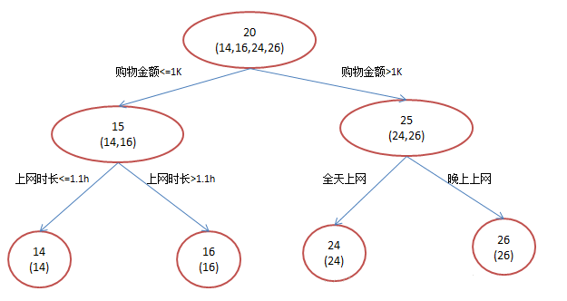

# GBDT[GradientBoosting]

* [返回顶层目录](../../SUMMARY.md#目录)
* [返回上层目录](ensemble-learning.md)
* [GBDT概述](#GBDT概述)
  * [DT：回归树 Regression Decision Tree](#DT：回归树 Regression Decision Tree)
  * [GB：梯度迭代 Gradient Boosting](#GB：梯度迭代 Gradient Boosting)
  * [GBDT工作过程实例](#GBDT工作过程实例)
  * [Shrinkage（缩减）](#Shrinkage（缩减）)
  * [GBDT的适用范围](#GBDT的适用范围)

GBDT中采用的梯度下降是通过学习新的决策树减小残差实现的。

# GBDT概述

GBDT(Gradient Boosting Decision Tree：梯度提升决策树) 又叫 MART（Multiple Additive Regression Tree：多重累计回归树)，是一种迭代的决策树算法，该算法由多棵决策树组成，所有树的结论累加起来做最终答案。它在被提出之初就和SVM一起被认为是泛化能力（generalization)较强的算法。近些年更因为被用于搜索排序的机器学习模型而引起大家关注。

**后记：**发现GBDT除了我描述的残差版本外还有另一种GBDT描述，两者大概相同，但求解方法（Gradient应用）不同。其区别和另一版本的介绍链接[见这里](http://hi.baidu.com/hehehehello/item/81e69638f0e752352e20c48b)。由于另一版本介绍博客中亦有不少错误，建议大家还是先看本篇，再跳到另一版本描述，这个顺序当能两版本都看懂。

**第1~4节：GBDT算法内部究竟是如何工作的？**

**第5节：它可以用于解决哪些问题？**

****

在此先给出我比较推荐的两篇英文文献，喜欢英文原版的同学可直接阅读：

[[1]Boosting Decision Tree入门教程](http://www.schonlau.net/publication/05stata_boosting.pdf)

[[2]LambdaMART用于搜索排序入门教程 ](http://research.microsoft.com/pubs/132652/MSR-TR-2010-82.pdf)

GBDT主要由三个概念组成：Regression Decistion Tree（即DT)，Gradient Boosting（即GB)，Shrinkage (算法的一个重要演进分枝，目前大部分源码都按该版本实现）。搞定这三个概念后就能明白GBDT是如何工作的，要继续理解它如何用于搜索排序则需要额外理解RankNet概念，之后便功德圆满。下文将逐个碎片介绍，最终把整张图拼出来。

## DT：回归树 Regression Decision Tree

提起决策树（DT, Decision Tree) 绝大部分人首先想到的就是C4.5分类决策树。但如果一开始就把GBDT中的树想成分类树，那就是一条歪路走到黑，一路各种坑，最终摔得都要咯血了还是一头雾水说的就是LZ自己啊有木有。咳嗯，所以说千万不要以为GBDT是很多棵分类树。决策树分为两大类，回归树和分类树。前者用于预测实数值，如明天的温度、用户的年龄、网页的相关程度；后者用于分类标签值，如晴天/阴天/雾/雨、用户性别、网页是否是垃圾页面。这里要强调的是，前者的结果加减是有意义的，如10岁+5岁-3岁=12岁，后者则无意义，如男+男+女=到底是男是女？ **GBDT的核心在于累加所有树的结果作为最终结果**，就像前面对年龄的累加（-3是加负3），而分类树的结果显然是没办法累加的，所以**GBDT中的树都是回归树，不是分类树，**这点对理解GBDT相当重要（尽管GBDT调整后也可用于分类但不代表GBDT的树是分类树）。那么回归树是如何工作的呢？

下面我们以对人的性别判别/年龄预测为例来说明，每个instance都是一个我们已知性别/年龄的人，而feature则包括这个人上网的时长、上网的时段、网购所花的金额等。

作为对比，先说分类树，我们知道C4.5分类树在每次分枝时，是穷举每一个feature的每一个阈值，找到使得按照feature<=阈值，和feature>阈值分成的两个分枝的熵最大的feature和阈值（熵最大的概念可理解成尽可能每个分枝的男女比例都远离1:1），按照该标准分枝得到两个新节点，用同样方法继续分枝直到所有人都被分入性别唯一的叶子节点，或达到预设的终止条件，若最终叶子节点中的性别不唯一，则以多数人的性别作为该叶子节点的性别。

回归树总体流程也是类似，不过在每个节点（不一定是叶子节点）都会得一个预测值，以年龄为例，该预测值等于属于这个节点的所有人年龄的平均值。分枝时穷举每一个feature的每个阈值找最好的分割点，但衡量最好的标准不再是最大熵，而是最小化均方差，即（每个人的年龄-预测年龄）^2 的总和 / N，或者说是每个人的预测误差平方和除以N。这很好理解，被预测出错的人数越多，错的越离谱，均方差就越大，通过最小化均方差能够找到最靠谱的分枝依据。分枝直到每个叶子节点上人的年龄都唯一（这太难了）或者达到预设的终止条件（如叶子个数上限），若最终叶子节点上人的年龄不唯一，则以该节点上所有人的平均年龄做为该叶子节点的预测年龄。若还不明白可以Google "Regression Tree"，或阅读本文的第一篇论文中Regression Tree部分。

## GB：梯度迭代 Gradient Boosting

好吧，我起了一个很大的标题，但事实上我并不想多讲Gradient Boosting的原理，因为不明白原理并无碍于理解GBDT中的Gradient Boosting。喜欢打破砂锅问到底的同学可以阅读这篇英文[wiki:Gradient_tree_boosting](http://en.wikipedia.org/wiki/Gradient_boosted_trees#Gradient_tree_boosting)。

Boosting，迭代，即通过迭代多棵树来共同决策。这怎么实现呢？难道是每棵树独立训练一遍，比如A这个人，第一棵树认为是10岁，第二棵树认为是0岁，第三棵树认为是20岁，我们就取平均值10岁做最终结论？--当然不是！且不说这是投票方法并不是GBDT，只要训练集不变，独立训练三次的三棵树必定完全相同，这样做完全没有意义。之前说过，GBDT是把所有树的结论累加起来做最终结论的，所以可以想到每棵树的结论并不是年龄本身，而是年龄的一个累加量。**GBDT的核心就在于，每一棵树学的是之前所有树结论和的残差**，这个**残差就是一个加预测值后能得真实值的累加量**。比如A的真实年龄是18岁，但第一棵树的预测年龄是12岁，差了6岁，即残差为6岁。那么在第二棵树里我们把A的年龄设为6岁去学习，如果第二棵树真的能把A分到6岁的叶子节点，那累加两棵树的结论就是A的真实年龄；如果第二棵树的结论是5岁，则A仍然存在1岁的残差，第三棵树里A的年龄就变成1岁，继续学。这就是Gradient Boosting在GBDT中的意义，简单吧。

## GBDT工作过程实例

还是年龄预测，简单起见训练集只有4个人，A、B、C、D，他们的年龄分别是14、16、24、26。其中A、B分别是高一和高三学生；C、D分别是应届毕业生和工作两年的员工。如果是用一棵传统的回归决策树来训练，会得到如下图1所示结果：

现在我们使用GBDT来做这件事，由于数据太少，我们限定叶子节点做多有两个，即每棵树都只有一个分枝，并且限定只学两棵树。我们会得到如下图2所示结果：

在第一棵树分枝和图1一样，由于A，B年龄较为相近，C,D年龄较为相近，他们被分为两拨，每拨用平均年龄作为预测值。此时计算残差（**残差的意思就是：A的预测值+A的残差=A的实际值**），所以A的残差就是14-15=-1（注意，A的预测值是指前面所有树累加的和，这里前面只有一棵树所以直接是15，如果还有树则需要都累加起来作为A的预测值）。进而得到A，B，C，D的残差分别为-1，1，-1，1。然后我们拿残差替代A、B、C、D的原值，到第二棵树去学习，如果我们的预测值和它们的残差相等，则只需把第二棵树的结论累加到第一棵树上就能得到真实年龄了。这里的数据显然是我可以做的，第二棵树只有两个值1和-1，直接分成两个节点。此时所有人的残差都是0，即每个人都得到了真实的预测值。

换句话说，现在A，B，C，D的预测值都和真实年龄一致了。Perfect!

A: 14岁高一学生，购物较少，经常问学长问题；预测年龄A = 15 – 1 = 14

B: 16岁高三学生；购物较少，经常被学弟问问题；预测年龄B = 15 + 1 = 16

C: 24岁应届毕业生；购物较多，经常问师兄问题；预测年龄C = 25 – 1 = 24

D: 26岁工作两年员工；购物较多，经常被师弟问问题；预测年龄D = 25 + 1 = 26 

那么哪里体现了Gradient呢？其实回到第一棵树结束时想一想，无论此时的cost function是什么，是均方差还是均差，只要它以误差作为衡量标准，残差向量(-1，1，-1，1)都是它的全局最优方向，这就是Gradient。

讲到这里我们已经把GBDT最核心的概念、运算过程讲完了！没错就是这么简单。不过讲到这里很容易发现三个问题：

**1）既然图1和图2 最终效果相同，为何还需要GBDT呢？**

答案是过拟合。过拟合是指为了让训练集精度更高，学到了很多”仅在训练集上成立的规律“，导致换一个数据集当前规律就不适用了。其实只要允许一棵树的叶子节点足够多，训练集总是能训练到100%准确率的（大不了最后一个叶子上只有一个instance)。在训练精度和实际精度（或测试精度）之间，后者才是我们想要真正得到的。

我们发现图1为了达到100%精度使用了3个feature（上网时长、时段、网购金额），其中分枝“上网时长>1.1h” 很显然已经过拟合了，这个数据集上A、B也许恰好A每天上网1.09h、B上网1.05小时，但用上网时间是不是>1.1小时来判断所有人的年龄很显然是有悖常识的；

相对来说图2的boosting虽然用了两棵树 ，但其实只用了2个feature就搞定了，后一个feature是问答比例，显然图2的依据更靠谱。（当然，这里是LZ故意做的数据，所以才能靠谱得如此狗血。实际中靠谱不靠谱总是相对的） **Boosting的最大好处在于，每一步的残差计算其实变相地增大了分错instance的权重，而已经分对的instance则都趋向于0。这样后面的树就能越来越专注那些前面被分错的instance**。就像我们做互联网，总是先解决60%用户的需求凑合着，再解决35%用户的需求，最后才关注那5%人的需求，这样就能逐渐把产品做好，因为不同类型用户需求可能完全不同，需要分别独立分析。如果反过来做，或者刚上来就一定要做到尽善尽美，往往最终会竹篮打水一场空。

**2）Gradient呢？不是“G”BDT么？**

 到目前为止，我们的确没有用到求导的Gradient。在当前版本GBDT描述中，的确没有用到Gradient，该版本用残差作为全局最优的绝对方向，并不需要Gradient求解.

**3）这不是boosting吧？Adaboost可不是这么定义的。**

这是boosting，但不是Adaboost。**GBDT不是Adaboost Decistion Tree。**就像提到决策树大家会想起C4.5，提到boost多数人也会想到Adaboost。Adaboost是另一种boost方法，它按分类对错，分配不同的weight，计算cost function时使用这些weight，从而让“错分的样本权重越来越大，使它们更被重视”。Bootstrap也有类似思想，它在每一步迭代时不改变模型本身，也不计算残差，而是从N个instance训练集中按一定概率重新抽取N个instance出来（单个instance可以被重复sample），对着这N个新的instance再训练一轮。由于数据集变了迭代模型训练结果也不一样，而一个instance被前面分错的越厉害，它的概率就被设的越高，这样就能同样达到逐步关注被分错的instance，逐步完善的效果。Adaboost的方法被实践证明是一种很好的防止过拟合的方法，但至于为什么则至今没从理论上被证明。GBDT也可以在使用残差的同时引入Bootstrap re-sampling，GBDT多数实现版本中也增加的这个选项，但是否一定使用则有不同看法。re-sampling一个缺点是它的随机性，即同样的数据集合训练两遍结果是不一样的，也就是模型不可稳定复现，这对评估是很大挑战，比如很难说一个模型变好是因为你选用了更好的feature，还是由于这次sample的随机因素。

## Shrinkage（缩减）

Shrinkage（缩减）的思想认为，每次走一小步逐渐逼近结果的效果，要比每次迈一大步很快逼近结果的方式更容易避免过拟合。即它不完全信任每一个棵残差树，它认为每棵树只学到了真理的一小部分，累加的时候只累加一小部分，通过多学几棵树弥补不足。用方程来看更清晰，即

没用Shrinkage时：（$y_i$表示第$i$棵树上$y$的预测值， $y_{(1\sim i)}$表示前$i$棵树$y$的综合预测值）

$y_{(i+1)}=残差(y_1\sim y_i)$， 其中： $残差(y_1\sim y_i)\ =  y_{真实值} - y_{(1\sim i)}$

$y_{(1\sim i)} = \sum(y_1, ..., y_i)$

Shrinkage不改变第一个方程，只把第二个方程改为： 

$y_{(1\sim i)} = y_{(1\sim i-1)} + step \times y_i$

即Shrinkage仍然以残差作为学习目标，但对于残差学习出来的结果，只累加一小部分（step$\times$残差）逐步逼近目标，step一般都比较小，如0.01~0.001（注意该step非gradient的step），导致各个树的残差是渐变的而不是陡变的。直觉上这也很好理解，不像直接用残差一步修复误差，而是只修复一点点，其实就是把大步切成了很多小步。**本质上，Shrinkage为每棵树设置了一个weight，累加时要乘以这个weight，但和Gradient并没有关系。**这个weight就是step。就像Adaboost一样，Shrinkage能减少过拟合发生也是经验证明的，目前还没有看到从理论的证明。

## GBDT的适用范围

该版本GBDT几乎可用于所有回归问题（线性/非线性），相对logistic regression仅能用于线性回归，GBDT的适用面非常广。亦可用于二分类问题（设定阈值，大于阈值为正例，反之为负例）。

# 参考资料

* [GBDT（MART） 迭代决策树入门教程 | 简介](http://blog.csdn.net/w28971023/article/details/8240756)

"GBDT概述"这一小节主要参考的就是此文章。