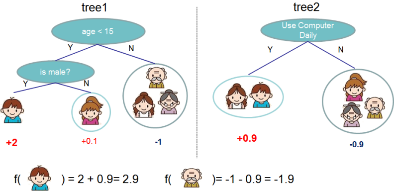

# XGBoost

* [返回顶层目录](../../SUMMARY.md)
* [返回上层目录](ensemble-learning.md)
* [XGBoost概述](#XGBoost概述)
* [XGBoost陈天奇论文及官网](#XGBoost陈天奇论文及官网)
* [模型](#模型)
* [损失函数](#损失函数)
  * [正则项](#正则项)
  * [牛顿法](#牛顿法)
  * [损失函数的二阶泰勒展开](#损失函数的二阶泰勒展开)
  * [损失函数求导得最优值](#损失函数求导得最优值)
* [优化算法](#优化算法)
  * [XGBoost的增益函数](#XGBoost的增益函数)
  * [树结点分裂方法（split finding）](#树结点分裂方法（split finding）)
    * [精确算法](#精确算法)
    * [近似算法](#近似算法)
    * [结点分裂时多机并行](#结点分裂时多机并行)
    * [加权分位点](#加权分位点)
  * [稀疏值处理](#稀疏值处理)
* [XGBoost的其他特性](#XGBoost的其他特性)
* [XGBoost的系统设计](#XGBoost的系统设计)
  * [Column Block for Parallel Learning](#Column Block for Parallel Learning)
  * [Cache Aware Access](#Cache Aware Access)
  * [Blocks for Out-of-core Computation](#Blocks for Out-of-core Computation)
* [XGBoost和GradientBoost的比较](#XGBoost和GradientBoost的比较)

XGBoost是从决策树一步步发展而来的：

* 决策树 ⟶ 对样本重抽样，然后多个树平均 ⟶ Tree bagging
* Tree bagging ⟶ 再同时对特征进行随机挑选 ⟶ 随机森林
* 随机森林 ⟶ 对随机森林中的树进行加权平均，而非简单平均⟶ Boosing (Adaboost, GradientBoost)
* boosting ⟶ 对boosting中的树进行正则化 ⟶ XGBoosting

从这条线一路发展，就能看出为什么XGBoost的优势了。

XGBoost本质只过不就是函数空间上的牛顿法（也可理解为自适应变步长的梯度下降法），使用了损失函数的二阶导数信息，所以收敛更快。

# XGBoost概述

最近引起关注的一个Gradient Boosting算法：XGBoost，在计算速度和准确率上，较GBDT有明显的提升。XGBoost 的全称是eXtreme Gradient Boosting，它是Gradient Boosting Machine的一个c++实现，作者为正在华盛顿大学研究机器学习的大牛陈天奇 。XGBoost最大的特点在于，它能够自动利用CPU的多线程进行并行，同时在算法上加以改进提高了精度。它的处女秀是Kaggle的希格斯子信号识别竞赛，因为出众的效率与较高的预测准确度在比赛论坛中引起了参赛选手的广泛关注。值得我们在GBDT的基础上对其进一步探索学习。

# XGBoost陈天奇论文及官网

[陈天奇论文《XGBoost: A Scalable Tree Boosting System》](https://arxiv.org/pdf/1603.02754v1.pdf)

[陈天奇演讲PPT《Introduction to Boosted Trees 》](https://homes.cs.washington.edu/~tqchen/pdf/BoostedTree.pdf)

[GBM之GBRT总结（陈天奇论文演讲PPT翻译版）](http://nanjunxiao.github.io/2015/08/05/GBM%E4%B9%8BGBRT%E6%80%BB%E7%BB%93/)

[XGBoost官网](https://XGBoost.readthedocs.io/en/latest/)

# 模型

给定数据集D = \{ (xi, yi) \}，XGBoost进行additive training，学习K棵树，采用以下函数对样本进行预测：
$$
\hat{y}_i=\phi(x_i)=\sum_{k=1}^Kf_k(x_i),\quad f_k\in F
$$
，这里F是假设空间，f(x)是回归树（CART）：
$$
F=\{ f(x)=w_{q(x)} \}\ (q: \mathbb{R}^m\rightarrow T, w\in\mathbb{R}^T)
$$
q(x)表示将样本x分到了某个叶子节点上，w是叶子节点的分数（leaf score），所以，w_q(x)表示回归树对样本的预测值。

**例子**：预测一个人是否喜欢玩电脑游戏

回归树的预测输出是实数分数，可以用于回归、分类、排序等任务中。对于回归问题，可以直接作为目标值，对于分类问题，需要映射成概率
$$
\sigma(z)=\frac{1}{1+\text{exp}(-z)}
$$

# 损失函数

XGBoost的损失函数（在函数空间中，即把函数当做自变量）
$$
L(\phi)=\sum_i l(\hat{y}_i,y_i)+\sum_k\Omega(f_k)
$$
其中，
$$
\Omega(f)=\gamma T+\frac{1}{2}\lambda||w||^2
$$
上式中，Ω(f)为正则项，对每棵回归树的复杂度进行了惩罚。

相比原始的GBDT，XGBoost的目标函数多了正则项，使得学习出来的模型更加不容易过拟合。

## 正则项

有哪些指标可以衡量树的复杂度？

数的深度，内部节点个数，**叶子节点个数**（T），**叶节点分数**（w）...

而XGBoost采用的：
$$
\Omega(f)=\gamma T+\frac{1}{2}\lambda||w||^2
$$
对叶子节点个数进行惩罚，相当于在训练过程中做了剪枝。

## 牛顿法

在看下一节前，有必要讲下牛顿法。

将L(θ^t)在θ^(t-1)处进行二阶泰勒展开：
$$
L(\theta^t)\approx L(\theta^{t-1})+L'(\theta^{t-1})\bigtriangleup\theta+L''(\theta^{t-1})\frac{\bigtriangleup\theta^2}{2}
$$
为了简化分析，假设参数是标量（即θ只有一维），则可将一阶和二阶导数分别记为g和h：
$$
L(\theta^t)\approx L(\theta^{t-1})+g\bigtriangleup\theta+h\frac{\bigtriangleup\theta^2}{2}
$$
要使L(θ^t)极小，即让
$$
g\bigtriangleup\theta+h\frac{\bigtriangleup\theta^2}{2}
$$
极小，可令：
$$
\frac{\partial \left( g\bigtriangleup \theta + h\frac{\bigtriangleup\theta^2}{2} \right)}{\partial \bigtriangleup \theta}=0
$$
求得
$$
\bigtriangleup\theta=-\frac{g}{h}
$$
，故
$$
\theta^t=\theta^{t-1}+\bigtriangleup\theta=\theta^{t-1}-\frac{g}{h}
$$
将参数θ推广到向量形式，迭代公式：
$$
\theta^t=\theta^{t-1}-H^{-1}g
$$
这里H是海森矩阵。

怎么理解上面的迭代公式呢？其实很简单，可以理解为**自适应变步长的梯度下降法**。

我们回顾一下梯度下降法：
$$
\theta^t=\theta^{t-1}-\alpha L'(\theta^{t-1})=\theta^{t-1}-\alpha g
$$
看出来了没？牛顿法的-(1/h)g就相当于梯度下降法的-αg，也就是**牛顿法中的梯度下降的学习率不再是固定的α了，而是自适应的1/h了**，这个1/h是怎么自适应的呢？h是二阶导，h较大的时候，说明函数变化剧烈，所以学习率1/h就会很小；而h较小的时候，说明函数变化不剧烈，几乎就是一条直线，那么学习率1/h就会变大。所以**牛顿法要比梯度下降法收敛迅速**，因为它还获知了函数的二阶导数这一信息。

## 损失函数的二阶泰勒展开

第t次迭代后，模型的也测等于前t-1次的模型预测加上第t棵树的预测：
$$
\hat{y}^{(t)}_i=\hat{y}_i^{(t-1)}+f_t(x_i)
$$
此时损失函数可写作：
$$
L^{(t)}=\sum_{i=1}^nl(y_i,\hat{y}i^{(t-1)}+f_t(x_i))+\Omega(f_t)
$$
公式中，
$$
y_i,\hat{y}_i^{(t-1)}
$$
都已知，模型要学习的只有第t棵树ft。

将损失函数在
$$
\hat{y}_i^{(t-1)}
$$
处进行二阶泰勒展开：
$$
L^{(t)}\approx\sum_{i=1}^n\left[ l(y_i, \hat{y}^{(t-1)})+g_if_t(x_i)+\frac{1}{2}h_if^2_t(x_i) \right]+\Omega(f_t)
$$
其中，
$$
g_i=\frac{\partial l(y_i, \hat{y}^{(t-1)})}{\partial \hat{y}^{(t-1)}},\quad
h_i=\frac{\partial^2 l(y_i, \hat{y}^{(t-1)})}{\partial^2 \hat{y}^{(t-1)}}
$$
来，答一个小问题，在优化第t棵树时，有多少个gi和hi要计算？嗯，没错就是各有N个，N是训练样本的数量。如果有10万样本，在优化第t棵树时，就需要计算出个10万个gi和hi。感觉好像很麻烦是不是？但是你再想一想，**这10万个gi之间是不是没有啥关系？是不是可以并行计算呢？**聪明的你想必再一次感受到了，为什么XGBoost会辣么快！因为gi和hi可以并行地求出来。                                                                                                                                                                                                                       

而且，gi和hi是不依赖于损失函数的形式的，只要这个损失函数二次可微就可以了。这有什么好处呢？好处就是XGBoost可以**支持自定义损失函数**，只需满足二次可微即可。强大了我的哥是不是？

将公式中的常数项去掉（不影响求极值），得到：
$$
\tilde{L}^{(t)}=\sum_{i=1}^n\left[ g_if_t(x_i)+\frac{1}{2}h_if^2_t(x_i) \right]+\Omega(f_t)
$$
把ft，Ω写成树结构的形式，即把下式带入损失函数中
$$
f(x)=w_{q(x)},\quad \Omega(f)=\gamma T+\frac{1}{2}||w||^2
$$
**注意：**这里出现了γ和λ，这是XGBoost自己定义的，在使用XGBoost时，你可以设定它们的值，显然，γ越大，表示越希望获得结构简单的树，因为此时对较多叶子节点的树的惩罚越大。λ越大也是越希望获得结构简单的树。为什么XGBoost要选择这样的正则化项？很简单，好使！效果好才是真的好。

得到：
$$
\begin{aligned}
\tilde{L}^{(t)}&=\sum_{i=1}^n\left[ g_if_t(x_i)+\frac{1}{2}h_if^2_t(x_i) \right]+\Omega(f_t)\\
&=\sum_{i=1}^n\left[ g_iw_{q(x_i)}+\frac{1}{2}h_iw_{q(x_i)}^2 \right]+\gamma T +\lambda\frac{1}{2}\sum_{j=1}^Tw_j^2\\
\end{aligned}
$$
注意上式最后一行的**左边是对样本的累加**，**右边是对叶节点的累加**，这该怎么**统一**起来？

定义每个叶节点j上的样本集合为（这里需要停一停，这里很重要，但是也不难理解，小学知识，认真体会下。Ij代表什么？它代表一个集合，集合中每个值代表一个训练样本的序号，整个集合就是被第t棵CART树分到了第j个叶子节点上的训练样本。）
$$
I_j=\{ i|q(x_i)=j \}
$$
需要解释下这个w_q(x)的定义，首先，一棵树有T个叶子节点，这T个叶子节点的值组成了一个T维向量w，q(x)是一个映射，用来将样本映射成1到T的某个值，也就是把它分到某个叶子节点，**q(x)其实就代表了CART树的结构。w_q(x)自然就是这棵树对样本x的预测值了。**

则损失函数可以写成按叶节点累加的形式：
$$
\begin{aligned}
\tilde{L}^{(t)}&=\sum_{i=1}^n\left[ g_iw_{q(x_i)}+\frac{1}{2}h_iw_{q(x_i)}^2 \right]+\gamma T +\lambda\frac{1}{2}\sum_{j=1}^Tw_j^2\\
&=\sum_{j=1}^T\left[ \left(\sum_{i\in I_j}g_i\right)w_j+\frac{1}{2}\left(\sum_{i\in I_j}h_i+\lambda\right)w^2_j \right]+\gamma T\\
&=\sum_{j=1}^T\left[ G_jw_j+\frac{1}{2}\left(H_j+\lambda\right)w^2_j \right]+\gamma T\\
\end{aligned}
$$
**这里是XGBoost最精髓的部分，它将基于样本的loss转化为了基于叶子节点的loss，即完成了参数的转变，这样才能 将loss部分和正则部分都转为叶子节点T的目标方程**。

## 损失函数求导得最优值

如果确定了树的结构（即q(x)确定），上式中叶子节点权重wj有闭式解。

为了使目标函数最小，可以令上式导数为0：
$$
\begin{aligned}
\frac{\partial \tilde{L}^{(t)}}{\partial w_j}&=\frac{\partial \sum_{j=1}^T\left[ G_jw_j+\frac{1}{2}\left(H_j+\lambda\right)w^2_j \right]+\gamma T}{\partial w_j}\\
&=G_j+(H_j+\lambda)w_j\\
&=0\\
\end{aligned}
$$
解得每个叶节点的最优预测分数为：
$$
w^*_j=-\frac{G_j}{H_j+\lambda}
$$
然后将让损失函数最小的w\*j（即上式）带入损失函数，得到最小损失为：
$$
\tilde{L}^*=-\frac{1}{2}\sum_{j=1}^T\frac{G_j^2}{H_j+\lambda}+\gamma T
$$
L\*代表了什么呢？它表示了这棵树的结构有多好，值越小，代表这样结构越好！也就是说，它是衡量第t棵CART树的结构好坏的标准。注意~注意~注意~，这个值仅仅是用来衡量结构的好坏的，与叶子节点的值可是无关的。为什么？请再仔细看一下obj*的推导过程。L\*只和Gj和Hj和T有关，而它们又只和树的结构(q(x))有关，与叶子节点的值可是半毛关系没有。如下图所示：

这里，我们对w\*\_j给出一个直觉的解释，以便能获得感性的认识。我们假设分到j这个叶子节点上的样本只有一个。那么，w\*\_j就变成如下这个样子：
$$
w_j^*=\left(\frac{1}{h_j+\lambda}\right)\cdot(-g_j)
$$
这个式子告诉我们，w\*\_j的最佳值就是负的梯度乘以一个权重系数，该系数类似于随机梯度下降中的学习率。观察这个权重系数，我们发现，h_j越大，这个系数越小，也就是学习率越小。h_j越大代表什么意思呢？代表在该点附近梯度变化非常剧烈，可能只要一点点的改变，梯度就从10000变到了1，所以，此时，我们在使用反向梯度更新时步子就要小而又小，也就是权重系数要更小。

**补充个理解上很重要的点，之前的GBM模型（GBDT、GBRank、LambdaMART等）都把Loss加在的树间而未改动单棵CART内部逻辑（或者说无伤大雅懒得改），XGBoost因为正则化要考虑优化树复杂度的原因，把Loss带入到CART分裂目标和节点权重上去了（或者说把树内和树间的优化目标统一了），即节点权重已经给出来了：**
$$
w^*_j=-\frac{G_j}{H_j+\lambda}
$$
**并不是像GBDT那样为了特意去拟合-g/h，所以，XGBoost新的树的输入其实无所谓，但为了计算hi和gi，则输入就成了**
$$
(y_i,\hat{y}_i^{(t-1)})
$$
**，而GBDT下一棵树的输入是(xi,-Gi)。但是XGBoost已经把这种梯度带入到CART分裂目标和节点权重上去了，表现在其叶子节点的值是-Gj/(Hj+λ)，而非对yi的拟合。**

**也就是说，XGBoost不刻意拟合任何数值，它在第t步只是寻找一种能使当前损失最小的树。因此它不像adaboost（拟合带权值样本集）和gbdt（拟合负梯度）一样以拟合为核心，而是以使损失函数最低为核心。它的方法就是通过分裂节点，使得新树的gain大于原来树的gain，从而降低损失函数，而不是数据拟合。**

在目标函数是二分类log loss损失函数下，这里给出一阶导gi和二阶导gi的推导：
$$
\begin{aligned}
l(y_i,\hat{y}_i^{(t-1)})&=-\sum_{i=1}^N\left( y_i\text{log}p_i+(1-y_i)\text{log}(1-p_i) \right)\\
&=-\sum_{i=1}^N\left( y_i\text{log}\left( \frac{1}{1+\text{exp}(-\hat{y}_i^{(t-1)})} \right)+(1-y_i)\text{log}\left(\frac{\text{exp}(-\hat{y}_i^{(t-1)})}{1+\text{exp}(-\hat{y}_i^{(t-1)})}\right) \right)\\
\end{aligned}
$$
则gi为：
$$
\begin{aligned}
g_i&=\frac{\partial l(y_i, \hat{y}^{(t-1)})}{\partial \hat{y}^{(t-1)}}\\
&=-y_i\left( 1-\frac{1}{1+\text{exp}(-\hat{y}_i^{(t-1)})} \right)+
(1-y_i)\left( \frac{1}{1+\text{exp}(-\hat{y}_i^{(t-1)})} \right)\\
&=\frac{1}{1+\text{exp}(-\hat{y}_i^{(t-1)})}-y_i\\
&=\text{Pred}-\text{Label}
\end{aligned}
$$
hi为：
$$
\begin{aligned}
h_i&=\frac{\partial^2 l(y_i, \hat{y}^{(t-1)})}{\partial^2 \hat{y}^{(t-1)}}\\
&=\frac{\text{exp}(-\hat{y}_i^{(t-1)})}{\left( 1+\text{exp}(-\hat{y}_i^{(t-1)}) \right)^2}\\
&=\text{Pred}\cdot (1-\text{Pred})\\
\end{aligned}
$$

# 优化算法

当回归树的结构确定时，我们前面已经推导出其最优的叶节点分数以及对应的最小损失值，问题是怎么确定树的结构？

* 暴力枚举所有的树结构，选择损失值最小的—NP难问题
* **贪心法，每次尝试分裂一个叶节点，计算分裂前后的增益，选择增益最大的**

暴力枚举显然不现实，这里我们像决策树划分那样选择贪心法。

## XGBoost的增益函数

分裂前后的增益怎么计算？

* ID3算法采用信息增益
* C4.5算法采用信息增益比
* CART采用Gini系数
* **XGBoost呢？**

其实前面我们已经XGBoost的最小损失为
$$
\tilde{L}^*=-\frac{1}{2}\sum_{j=1}^T\frac{G_j^2}{H_j+\lambda}+\gamma T
$$
上式中的
$$
\frac{G_j^2}{H_j+\lambda}
$$
衡量了每个叶子结点对总体损失的贡献，我们希望损失越小越好，则标红部分的值越大越好。

因此，对一个叶子结点进行分裂，分裂前后的增益定义为：
$$
\text{Gain}_{\text{split}}=\frac{1}{2}\left[ \frac{(\sum_{i\in I_L} g_i)^2}{\sum_{i\in I_L} h_i+\lambda} + \frac{(\sum_{i\in I_R} g_i)^2}{\sum_{i\in I_R} h_i+\lambda} - \frac{(\sum_{i\in I} g_i)^2}{\sum_{i\in I} h_i+\lambda} \right]-\gamma
$$
Gain的值越大，分裂后损失函数减小越多。所以当对一个叶节点分割时，计算所有候选(feature, value)对应的Gain，选取Gain最大的进行分割。

## 树结点分裂方法（split finding）

**注意：**xgboost的切分操作和普通的决策树切分过程是不一样的。普通的决策树在切分的时候并不考虑树的复杂度，而依赖后续的剪枝操作来控制。xgboost在切分的时候就已经考虑了树的复杂度，就是那个Gain(split)中的γ参数。所以，它不需要进行单独的剪枝操作。

### 精确算法

遍历所有特征的所有可能的分割点，计算gain值，选取值最大的(feature, value)去分割

### 近似算法

对于每个特征，只考察分位点，减少计算复杂度

1. Global：学习每棵树前，提出候选切分点
2. Local：每次分列前，重新提出候选切分点

**近似算法举例**：三分位数

$$
\begin{aligned}
\text{Gain}=\text{max}\{ \text{Gain}, &\frac{G_1^2}{H_1+\lambda}+\frac{G_{23}^2}{H_{23}+\lambda} - \frac{G_{123}^2}{H_{123}+\lambda}-\gamma,\\
&\frac{G_{12}^2}{H_{12}+\lambda}+\frac{G_3^2}{H_3+\lambda} - \frac{G_{123}^2}{H_{123}+\lambda}-\gamma
\}
\end{aligned}
$$

### 结点分裂时多机并行

节点分裂的时候是按照哪个顺序来的，比如第一次分裂后有两个叶子节点，先裂哪一个？ 
答案：呃，同一层级的（多机）并行，确立如何分裂或者不分裂成为叶子节点。

### 加权分位点

**带权重直方图算法**

主要用于近似算法中分位点的计算。

实际上，XGBoost不是简单地按照样本个数进行分类，而是以二阶导数值作为权重。

假设分位点为
$$
\{s_{k1},s_{k2},..,s_{kl}\}
$$
，假设
$$
D_k=\{(x_{1k},h_1),(x_{2k},h_2),..,(x_{nk},h_n)\}
$$
表示所有样本的第k个特征值及二阶导数。

则可以定义一个排序函数如下：
$$
\begin{aligned}
r_k:\mathbb{R}\rightarrow [0,+\infty)\ \text{as}\\
r_k(z)=\frac{1}{\sum_{(x,h)\in D_k}h}\sum_{(x,h)\in D_k,x<z}h
\end{aligned}
$$
希望得到的分位点满足如下条件：
$$
|r_k(s_{k,j})-r_k(s_{k,j+1})|<\epsilon,\ s_{k1}=\mathop{\text{min}}_{i}\ x_{ik},\ s_{kl}=\mathop{\text{max}}_{i}\ x_{ik}
$$
这意味着大概有1/ε个分位点。

**为什么每个数据点都用二阶代数hi作为权重呢？**（这里不太理解，哪里用hi做权重了。。。）

因为损失函数还可以写成带权重的形式：
$$
\begin{aligned}
\tilde{L}^{(t)}&=\sum_{i=1}^n\left[ g_if_t(x_i)+\frac{1}{2}h_if^2_t(x_i) \right]+\Omega(f_t)\\
&=\sum_{i=1^n}\frac{1}{2}h_i(f_t(x_i)-g_i/h_i)^2+\Omega(f_t)+\text{Constant}
\end{aligned}
$$
上式相当带权重时的损失函数，权重为hi。可以看出hi有对loss加权的作用。

为了优化该问题，本文还提出了一种新颖的分布式加权分位点算法，该算法的优点是解决了带权重的直方图算法问题，以及有理论保证。

## 稀疏值处理

稀疏值是指：缺失，类别one-hot编码，大量0值。当特征出现缺失值时，XGBoost可以学习出默认的节点分裂方向。

XGBoost还特别设计了针对稀疏数据的算法，假设样本的第i个特征缺失时，无法利用该特征对样本进行划分，这里的做法是将该样本默认地分到指定的子节点，至于具体地分到哪个节点还需要下面的算法来计算：

该算法的主要思想是：**分别假设特征缺失的样本属于右子树和左子树，而且只在不缺失的样本上迭代，分别计算缺失样本属于右子树和左子树的增益，选择增益最大的方向为缺失数据的默认方向**。

# XGBoost的其他特性

注：具体请查看陈天奇的论文。这里只是概述，待后续详细研究补充，现在我没有时间，也缺少实践。

* 行抽样（row sample）

* 列抽样（column sample）

* 借鉴随机森林

* Shrinkage（缩减），即学习速率

* 将学习速率调小，迭代次数增多，有正则化作用

* 支持自定义损失函数（需二阶可导）

  

# XGBoost的系统设计

注：具体请查看陈天奇的论文。这里只是概述，待后续详细研究补充，现在我没有时间，也缺少实践。

## Column Block for Parallel Learning

算法中最耗时的部分就是预排序，为了节省排序的时间，XGBoost将数据存在内存单元block中，同时在block采用CSC 格式存放(Compressed Column format)，每一列(一个属性列)均升序存放，这样，一次读入数据并排好序后，以后均可使用。在精确贪心算法中，将所有数据均导入内存，算法只要在数据中线性扫描已经预排序过的特征就可以。对于近似算法，可以用多个block(Multiple blocks)分别存储不同的样本集，多个block可以并行计算，
重要的是，由于将数据按列存储，可以同时访问所有列，那么可以对所有属性同时执行split finding算法，从而并行化split finding.

* 特征预排序，以column block的结构存于内存中
* 存储样本索引（instance indices）
* block中的数据以稀疏格式（CSC）存储

这个结构加速split finding的过程，只需要在建树前排序一次，后面节点分裂时直接根据索引得到梯度信息。

## Cache Aware Access

由于样本按特征进行了预排序，样本对应的统计量（一阶和二阶梯度）需要根据行索引来查找，这导致了内存的不连续访问，容易导致cpu cache命中率降低。（这块没太搞懂）

* column block按特征大小顺序存储，相应的样本的梯度信息是分散的，造成内存的不连续访问，降低CPU cache命中率

* 缓存优化方法
  * 预取数据到buffer中（非连续->连续），再统计梯度信息
  * 调节块的大小

## Blocks for Out-of-core Computation

（这块没太搞懂）

为了更好地利用计算机的磁盘空间，对于不能一次性导入到内存的数据（数据比较大），我们将数据分成多个block存在磁盘上，在计算过程中，用另外的线程读取数据，但是由于磁盘IO速度太慢，通常更不上计算的速度。所以，我们采用了下面两种方法有优化速度和存储：

* Block compression

  将block按列压缩，对于行索引，只保存第一个索引值，然后只保存该数据与第一个索引值之差（offset），一共用16个bits来保存offset,因此，一个block一般有2^16个样本。

* Block sharding

  提高磁盘的吞吐量

# XGBoost和GradientBoost的比较

首先**XGBoost**是Gradient Boosting的一种高效系统实现，只是陈天奇写的一个工具包，本身并不是一种单一算法。XGBoost可以看作是对GradientBoost的优化。其原理还是基于GradientBoost，它的创新之处是用了**二阶导数**和**正则项**。

GBDT将树f类比于参数，通过f对负梯度进行回归，通过负梯度逐渐最小化Object目标；XGBoost版本通过使得当前Object目标最小化，构造出回归树f，更直接。两者都是求得f对历史累积F进行修正。

下面具体地进行比较：

* 模型

  * XGBoost支持线性分类器

    传统GBDT以CART作为基分类器，XGBoost还支持线性分类器，这个时候XGBoost相当于带L1和L2正则化项的逻辑斯蒂回归（分类问题）或者线性回归（回归问题）

* 模型
  * 学习目标和方法不同

    GBDT直接拿一阶导数来作为下一棵决策树的预测值，进行学习（具体树怎么学习不负责）；XGBoost则是拿一阶和二阶导数直接作为下一棵决策树的增益score指导树的学习。

    GBDT主要对loss L(y,F)关于F求梯度，利用回归树拟合该负梯度；XGBOOST主要对loss L(y,F)二阶泰勒展开，然后求解析解，以解析解obj作为标准，贪心搜索split树是否obj更优。

    之前的GBM模型（GBDT、GBRank、LambdaMART等）都把Loss加在的树间而未改动单棵CART内部逻辑（或者说无伤大雅懒得改），XGBoost因为正则化要考虑优化树复杂度的原因，把Loss带入到CART分裂目标和节点权重上去了（或者说把树内和树间的优化目标统一了）

- 优化算法

  - GBDT使用了square loss的一阶求导，并且没有树本身因素的正则化部分。XGBoost使用了square loss的一阶和二阶求导，使用了树叶子节点（T）和叶子权重（w平方）作为正则化。**这里是XGBoost最精髓的部分，它将基于样本的loss转化为了基于叶子节点的loss，即完成了参数的转变，这样才能 将loss部分和正则部分都转为叶子节点T的目标方程**。

    传统GBDT在优化时只用到一阶导数信息，**XGBoost则对损失函数进行了二阶泰勒展开，同时用到了一阶和二阶导数**。顺便提一下，XGBoost工具支持自定义代价函数，只要函数可一阶和二阶求导

  - XGBoost对树的结构进行了正则化约束(regularization)，防止模型过度复杂，降低了过拟合的可能性

    XGBoost在代价函数里加入了正则项，用于控制模型的复杂度。正则项里包含了树的叶子节点个数、每个叶子节点上输出的score的L2模的平方和。从Bias-variance tradeoff角度来讲，正则项降低了模型的variance，使学习出来的模型更加简单，防止过拟合，这也是XGBoost优于传统GBDT的一个特性

  - 节点分裂的方式不同，GBDT是用的gini系数，XGBoost是经过优化推导后的

  - 类似于学习率，学习到一棵树后，对其权重进行缩减，从而降低该棵树的作用，提升可学习空间

- 其他细节

  - XGBoost使用了二阶导数。这个类似于gradient descent和Newton method的区别。所以，XGBoost应该优化目标函数更快，也就是**需要更少的树**

  - XGBoost支持**列抽样**（column subsampling）

    XGBoost借鉴了随机森林的做法，支持列抽样，不仅能降低过拟合，还能减少计算，这也是XGBoost异于传统GBDT的一个特性

  - XGBoost对于特征的值有**缺失**的样本，XGBoost可以自动学习出它的分裂方向

  - XGBoost工具**支持并行**

    boosting不是一种串行的结构吗?怎么并行的？注意XGBoost的并行不是tree粒度的并行，XGBoost也是一次迭代完才能进行下一次迭代的（第t次迭代的代价函数里包含了前面t-1次迭代的预测值）。XGBoost的并行是在特征粒度上的（树的粒度上是串行）。我们知道，**决策树的学习最耗时的一个步骤就是对特征的值进行排序（因为要确定最佳分割点）**，XGBoost在训练之前，预先对数据进行了排序，然后保存为block结构，后面的迭代中重复地使用这个结构，大大减小计算量。这个block结构也使得并行成为了可能，在进行节点的分裂时，需要计算每个特征的增益，最终选增益最大的那个特征去做分裂，那么**各个特征的增益计算就可以开多线程进行**

  - 可并行的近似直方图算法。树节点在进行分裂时，我们需要计算每个特征的每个分割点对应的增益，即用贪心法枚举所有可能的分割点。当数据无法一次载入内存或者在分布式情况下，贪心算法效率就会变得很低，所以XGBoost还提出了一种可并行的近似直方图算法，用于高效地生成候选的分割点

  - NULL值的特殊处理，作为一个特殊值来处理（实践中很有用）

# 参考资料

* [GBDT算法原理与系统设计简介](http://wepon.me/files/gbdt.pdf)

本文主要参考这篇文档。

* [xgboost的原理没你想像的那么难](https://www.jianshu.com/p/7467e616f227)

本文参考了这篇文档。

* [xgboost导读和实战](https://wenku.baidu.com/view/44778c9c312b3169a551a460.html)

“损失函数求导得最优值”参考了这篇文档。

* [通俗、有逻辑的写一篇说下Xgboost的原理](https://blog.csdn.net/github_38414650/article/details/76061893)

"优化算法"参考了这篇文档。

* [为啥Xgboost比GradientBoost好那么多？](http://sofasofa.io/forum_main_post.php?postid=1000331)

"XGBoost和GradientBoost的比较"参考这篇文档。

===

[30分钟看懂xgboost的基本原理](https://mp.weixin.qq.com/s/PSs0tdwWCm_6ajD9kQOHMw)

[xgboost 实战以及源代码分析](https://blog.csdn.net/u010159842/article/details/77503930?from=singlemessage)

[XGBoost缺失值引发的问题及其深度分析](https://mp.weixin.qq.com/s/hYuBHHfAGLO3Y0l5t6y94Q)

