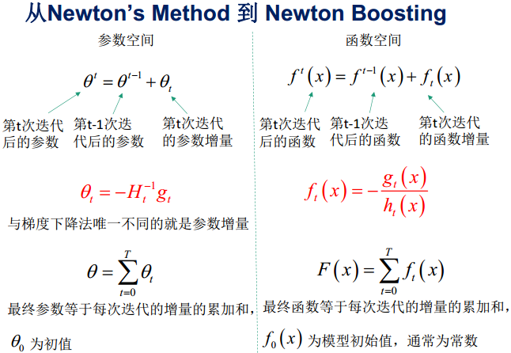
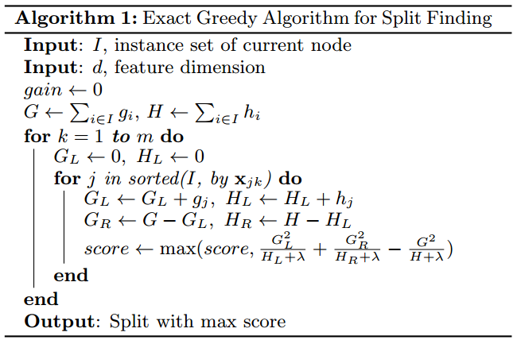

# XGBoost理论

* [返回顶层目录](../../../SUMMARY.md)
* [返回上层目录](XGBoost.md)
* [XGBoost概述](#XGBoost概述)
* [模型](#模型)
* [损失函数](#损失函数)
  * [正则项](#正则项)
  * [牛顿法](#牛顿法)
  * [损失函数的二阶泰勒展开](#损失函数的二阶泰勒展开)
  * [损失函数求导得最优值](#损失函数求导得最优值)
* [优化算法](#优化算法)
  * [XGBoost的增益函数](#XGBoost的增益函数)
  * [树结点分裂方法（split finding）](#树结点分裂方法（split finding）)
    * [暴力枚举（Basic Exact Greedy Algorithm）](#暴力枚举（Basic Exact Greedy Algorithm）)
    * [近似算法（Approximate Algo for Split Finding）](#近似算法（Approximate Algo for Split Finding）)
    * [加权分位点（Weighted Quantile Sketch）](#加权分位点（Weighted Quantile Sketch）)
    * [结点分裂时多机并行](#结点分裂时多机并行)
  * [稀疏感知分割（缺失值处理）](#稀疏感知分割（缺失值处理）)
* [XGBoost的系统设计](#XGBoost的系统设计)
  * [分块并行（Column Block for Parallel Learning）](#分块并行（Column Block for Parallel Learning）)
  * [缓存优化（Cache Aware Access）](#缓存优化（Cache Aware Access）)
  * [核外块计算（Blocks for Out-of-core Computation）](#核外块计算（Blocks for Out-of-core Computation）)
  * [XGBoost的其他特性](#XGBoost的其他特性)
* [XGBoost总结](#XGBoost总结)
  * [XGBoost优点](#XGBoost优点)
  * [XGBoost缺点](#XGBoost缺点)
  * [XGBoost和GradientBoost的比较](#XGBoost和GradientBoost的比较)
* [Xgboost使用经验总结](#Xgboost使用经验总结)

XGBoost是从决策树一步步发展而来的：

* 决策树 ⟶ 对样本重抽样，然后多个树平均 ⟶ Tree bagging
* Tree bagging ⟶ 再同时对特征进行随机挑选 ⟶ 随机森林
* 随机森林 ⟶ 对随机森林中的树进行加权平均，而非简单平均⟶ Boosing (Adaboost, GradientBoost)
* boosting ⟶ 对boosting中的树进行正则化 ⟶ XGBoosting

从这条线一路发展，就能看出为什么XGBoost的优势了。

XGBoost本质只过不就是函数空间上的牛顿法（也可理解为自适应变步长的梯度下降法），使用了损失函数的二阶导数信息，所以收敛更快。

# XGBoost概述

最近引起关注的一个Gradient Boosting算法：XGBoost，在计算速度和准确率上，较GBDT有明显的提升。XGBoost 的全称是eXtreme Gradient Boosting，它是Gradient Boosting Machine的一个c++实现，作者为正在华盛顿大学研究机器学习的大牛陈天奇 。XGBoost最大的特点在于，它能够自动利用CPU的多线程进行并行，同时在算法上加以改进提高了精度。它的处女秀是Kaggle的希格斯子信号识别竞赛，因为出众的效率与较高的预测准确度在比赛论坛中引起了参赛选手的广泛关注。值得我们在GBDT的基础上对其进一步探索学习。

**陈天奇论文及官网**：

[陈天奇论文《XGBoost: A Scalable Tree Boosting System》](https://www.kdd.org/kdd2016/papers/files/rfp0697-chenAemb.pdf)

[陈天奇演讲PPT《Introduction to Boosted Trees 》](https://homes.cs.washington.edu/~tqchen/pdf/BoostedTree.pdf)

[GBM之GBRT总结（陈天奇论文演讲PPT翻译版）](http://nanjunxiao.github.io/2015/08/05/GBM%E4%B9%8BGBRT%E6%80%BB%E7%BB%93/)

[XGBoost官网](https://XGBoost.readthedocs.io/en/latest/)

# 模型

给定数据集$$D = \{ (x_i, y_i) \}$$，XGBoost进行additive training，学习$$K$$棵树，采用以下函数对样本进行预测：
$$
\hat{y}_i=\phi(x_i)=\sum_{k=1}^Kf_k(x_i),\quad f_k\in F
$$
，这里$$F$$是假设空间，$$f(x)$$是回归树（CART）：
$$
F=\{ f(x)=w_{q(x)} \}\ (q: \mathbb{R}^m\rightarrow T, w\in\mathbb{R}^T)
$$
$$q(x)$$表示将样本$$x$$分到了某个叶子节点上，$$w$$是叶子节点的分数（leaf score），所以，$$w_{q(x)}$$表示回归树对样本的预测值。

**例子**：预测一个人是否喜欢玩电脑游戏

回归树的预测输出是实数分数，可以用于回归、分类、排序等任务中。对于回归问题，可以直接作为目标值，对于分类问题，需要映射成概率
$$
\sigma(z)=\frac{1}{1+\text{exp}(-z)}
$$

# 损失函数

XGBoost的损失函数（在函数空间中，即把函数当做自变量）
$$
L(\phi)=\sum_i l(\hat{y}_i,y_i)+\sum_k\Omega(f_k)
$$
其中，
$$
\Omega(f)=\gamma T+\frac{1}{2}\lambda||w||^2
$$
上式中，$$\Omega(f)$$为正则项，对每棵回归树的复杂度进行了惩罚。

相比原始的GBDT，XGBoost的目标函数多了正则项，使得学习出来的模型更加不容易过拟合。

## 正则项

有哪些指标可以衡量树的复杂度？

树的深度，内部节点个数，**叶子节点个数**（T），**叶节点分数**（w）...

而XGBoost采用的：
$$
\Omega(f)=\gamma T+\frac{1}{2}\lambda||w||^2
$$
对叶子节点个数和叶节点分数进行惩罚，相当于在训练过程中做了剪枝。

## 牛顿法

在看下一节前，有必要讲下[牛顿法](https://blog.csdn.net/qq_41577045/article/details/80343252?depth_1-utm_source=distribute.pc_relevant.none-task&utm_source=distribute.pc_relevant.none-task)。

将$$L(\theta^t)$$在$$\theta^{t-1}$$处进行二阶泰勒展开：
$$
L(\theta^t)\approx L(\theta^{t-1})+L'(\theta^{t-1})\bigtriangleup\theta+L''(\theta^{t-1})\frac{\bigtriangleup\theta^2}{2}
$$
为了简化分析，假设参数是标量（即$$\theta$$只有一维），则可将一阶和二阶导数分别记为$$g$$和$$h$$：
$$
L(\theta^t)\approx L(\theta^{t-1})+g\bigtriangleup\theta+h\frac{\bigtriangleup\theta^2}{2}
$$
要使$$L(\theta^t)$$极小，即让$$g\bigtriangleup\theta+h\frac{\bigtriangleup\theta^2}{2}$$极小，可令：
$$
\frac{\partial \left( g\bigtriangleup \theta + h\frac{\bigtriangleup\theta^2}{2} \right)}{\partial \bigtriangleup \theta}=0
$$
求得$$\bigtriangleup\theta=-\frac{g}{h}$$，故
$$
\theta^t=\theta^{t-1}+\bigtriangleup\theta=\theta^{t-1}-\frac{g}{h}
$$
将参数$$\theta$$推广到向量形式，迭代公式：
$$
\theta^t=\theta^{t-1}-H^{-1}g
$$
这里$$H$$是海森矩阵。

怎么理解上面的迭代公式呢？其实很简单，可以理解为**自适应变步长的梯度下降法**。

我们回顾一下梯度下降法：
$$
\theta^t=\theta^{t-1}-\alpha L'(\theta^{t-1})=\theta^{t-1}-\alpha g
$$
看出来了没？牛顿法的$$-(1/h)g$$就相当于梯度下降法的$$-\alpha g$$，也就是**牛顿法中的梯度下降的学习率不再是固定的$$\alpha$$了，而是自适应的$$1/h$$了**，这个$$1/h$$是怎么自适应的呢？$$h$$是二阶导，$$h$$较大的时候，说明函数变化剧烈，所以学习率$$1/h$$就会很小；而$$h$$较小的时候，说明函数变化不剧烈，几乎就是一条直线，那么学习率$$1/h$$就会变大。所以**牛顿法要比梯度下降法收敛迅速**，因为它还获知了函数的二阶导数这一信息。

## 损失函数的二阶泰勒展开

第$$t$$次迭代后，模型的也测等于前$$t-1$$次的模型预测加上第$$t$$棵树的预测：
$$
\hat{y}^{(t)}_i=\hat{y}_i^{(t-1)}+f_t(x_i)
$$
此时损失函数可写作：
$$
L^{(t)}=\sum_{i=1}^nl(y_i,\hat{y}_i^{(t-1)}+f_t(x_i))+\Omega(f_t)
$$
公式中，$$y_i,\hat{y}_i^{(t-1)}$$都已知，模型要学习的只有第$$t$$棵树$$f_t$$。

将损失函数在$$\hat{y}_i^{(t-1)}$$处进行二阶泰勒展开：
$$
L^{(t)}\approx\sum_{i=1}^n\left[ l(y_i, \hat{y}^{(t-1)})+g_if_t(x_i)+\frac{1}{2}h_if^2_t(x_i) \right]+\Omega(f_t)
$$
其中，
$$
g_i=\frac{\partial l(y_i, \hat{y}^{(t-1)})}{\partial \hat{y}^{(t-1)}},\quad
h_i=\frac{\partial^2 l(y_i, \hat{y}^{(t-1)})}{\partial^2 \hat{y}^{(t-1)}}
$$
来，答一个小问题，在优化第$$t$$棵树时，有多少个$$g_i$$和$$h_i$$要计算？嗯，没错就是各有$$N$$个，$$N$$是训练样本的数量。如果有10万样本，在优化第$$t$$棵树时，就需要计算出个10万个$$g_i$$和$$h_i$$。感觉好像很麻烦是不是？但是你再想一想，**这10万个$$g_i$$之间是不是没有啥关系？是不是可以并行计算呢？**聪明的你想必再一次感受到了，为什么XGBoost会辣么快！因为$$g_i$$和$$h_i$$可以并行求出来。

而且，$$g_i$$和$$h_i$$是不依赖于损失函数的形式的，只要这个损失函数二次可微就可以了。这有什么好处呢？好处就是XGBoost可以**支持自定义损失函数**，只需满足二次可微即可。强大了我的哥是不是？

将公式中的常数项去掉（不影响求极值），得到：
$$
\tilde{L}^{(t)}=\sum_{i=1}^n\left[ g_if_t(x_i)+\frac{1}{2}h_if^2_t(x_i) \right]+\Omega(f_t)
$$
把$$f_t, \Omega(f_t)$$写成**树结构的形式**，即把下式带入损失函数中
$$
f(x)=w_{q(x)},\quad \Omega(f)=\gamma T+\frac{1}{2}||w||^2
$$
**注意：**这里出现了$$\gamma$$和$$\lambda$$，这是XGBoost自己定义的，在使用XGBoost时，你可以设定它们的值，显然，$$\gamma$$越大，表示越希望获得结构简单的树，因为此时对较多叶子节点的树的惩罚越大。$$\lambda$$越大也是越希望获得结构简单的树。为什么XGBoost要选择这样的正则化项？很简单，好使！效果好才是真的好。

得到：
$$
\begin{aligned}
\tilde{L}^{(t)}&=\sum_{i=1}^n\left[ g_if_t(x_i)+\frac{1}{2}h_if^2_t(x_i) \right]+\Omega(f_t)\\
&=\sum_{i=1}^n\left[ g_iw_{q(x_i)}+\frac{1}{2}h_iw_{q(x_i)}^2 \right]+\gamma T +\lambda\frac{1}{2}\sum_{j=1}^Tw_j^2\\
\end{aligned}
$$
注意上式最后一行的**左边是对样本的累加**，**右边是对叶节点的累加**，这该怎么**统一**起来？

定义每个叶节点$$j$$上的样本集合为（这里需要停一停，这里很重要，但是也不难理解，小学知识，认真体会下。$$I_j$$代表什么？它代表一个集合，即被分到第$$j$$颗树的所有样本集合，集合中每个值代表一个训练样本的序号，整个集合就是被第$$t$$棵CART树分到了第$$j$$个叶子节点上的训练样本。）
$$
I_j=\{ i|q(x_i)=j \}
$$
需要解释下这个$$w_{q(x)}$$的定义，首先，一棵树有$$T$$个叶子节点，这$$T$$个叶子节点的值组成了一个$$T$$维向量$$w$$，$$q(x)$$是一个映射，用来将样本映射成1到$$T$$的某个值，也就是把它分到某个叶子节点，**$$q(x)$$其实就代表了CART树的结构。$$w_{q(x)}$$自然就是这棵树对样本$$x$$的预测值了。**

则损失函数可以写成按**叶节点**累加的形式：
$$
\begin{aligned}
\tilde{L}^{(t)}&=\sum_{i=1}^n\left[ g_iw_{q(x_i)}+\frac{1}{2}h_iw_{q(x_i)}^2 \right]+\gamma T +\lambda\frac{1}{2}\sum_{j=1}^Tw_j^2\\
&=\sum_{j=1}^T\left[ \left(\sum_{i\in I_j}g_i\right)w_j+\frac{1}{2}\left(\sum_{i\in I_j}h_i+\lambda\right)w^2_j \right]+\gamma T\\
&=\sum_{j=1}^T\left[ G_jw_j+\frac{1}{2}\left(H_j+\lambda\right)w^2_j \right]+\gamma T\\
\end{aligned}
$$
**这里是XGBoost最精髓的部分，它将基于样本的loss转化为了基于叶子节点的loss，即完成了参数的转变，这样才能将loss部分和正则部分都转为叶子节点$$T$$的目标方程**。

## 损失函数求导得最优值

如果确定了树的结构（即$$q(x)$$确定），上式中叶子节点权重$$w_j$$有闭式解。

为了使目标函数最小，可以令上式导数为0：
$$
\begin{aligned}
\frac{\partial \tilde{L}^{(t)}}{\partial w_j}&=\frac{\partial \sum_{j=1}^T\left[ G_jw_j+\frac{1}{2}\left(H_j+\lambda\right)w^2_j \right]+\gamma T}{\partial w_j}\\
&=G_j+(H_j+\lambda)w_j\\
&=0\\
\end{aligned}
$$
解得每个叶节点的最优预测分数为：
$$
w^*_j=-\frac{G_j}{H_j+\lambda}
$$
然后将让损失函数最小的$$w^{*}_j$$（即上式）带入损失函数，得到最小损失为：
$$
\tilde{L}^*=-\frac{1}{2}\sum_{j=1}^T\frac{G_j^2}{H_j+\lambda}+\gamma T
$$
$$\tilde{L}^*$$代表了什么呢？它表示了**这棵树的结构有多好**，值越小，代表这样结构越好！也就是说，它是衡量第$$t$$棵CART树的结构好坏的标准。注意~注意~注意~，这个值仅仅是用来衡量结构的好坏的，与叶子节点的值可是无关的。为什么？请再仔细看一下$$\tilde{L}^*$$的推导过程。$$\tilde{L}^*$$只和$$G_j$$和$$H_j$$和$$T$$有关，而它们又只和树的结构$$q(x)$$有关，与叶子节点的值可是半毛关系没有。

上式能视作衡量函数来测量树结构$$q$$的质量，类似不纯度（基尼系数）的**衡量指标**，来衡量一棵树的优劣程度。下图展示了如何计算一棵树的分值：

这里，我们对$$w^{*}_j$$给出一个直觉的解释，以便能获得感性的认识。我们假设分到$$j$$这个叶子节点上的样本只有一个。那么，$$w^{*}_j$$就变成如下这个样子：
$$
w_j^*=\left(\frac{1}{h_j+\lambda}\right)\cdot(-g_j)
$$
这个式子告诉我们，$$w^{*}_j$$的最佳值就是负的梯度乘以一个权重系数，该系数类似于随机梯度下降中的学习率。观察这个权重系数，我们发现，$$h_j$$越大，这个系数越小，也就是学习率越小。$$h_j$$越大代表什么意思呢？代表在该点附近梯度变化非常剧烈，可能只要一点点的改变，梯度就从10000变到了1，所以，此时，我们在使用反向梯度更新时步子就要小而又小，也就是权重系数要更小。

**补充个理解上很重要的点，之前的GBM模型（GBDT、GBRank、LambdaMART等）都把Loss加在的树间而未改动单棵CART内部逻辑（或者说无伤大雅懒得改），XGBoost因为正则化要考虑优化树复杂度的原因，把Loss带入到CART分裂目标和节点权重上去了（或者说把树内和树间的优化目标统一了），即节点权重已经给出来了：**
$$
w^*_j=-\frac{G_j}{H_j+\lambda}
$$
**并不是像GBDT那样为了特意去拟合$$-g/h$$，所以，XGBoost新的树的输入其实无所谓，但为了计算$$h_i$$和$$g_i$$，则输入就成了**
$$
(y_i,\hat{y}_i^{(t-1)})
$$
**，而GBDT下一棵树的输入是$$(x_i,-G_i)$$。但是XGBoost已经把这种梯度带入到CART分裂目标和节点权重上去了，表现在其叶子节点的值是$$-G_j/(H_j+\lambda)$$，而非对$$y_i$$的拟合。**

**也就是说，XGBoost不刻意拟合任何数值，它在第$$t$$步只是寻找一种能使当前损失最小的树。因此它不像adaboost（拟合带权值样本集）和gbdt（拟合负梯度）一样以拟合为核心，而是以使损失函数最低为核心。它的方法就是通过分裂节点，使得新树的gain大于原来树的gain，从而降低损失函数，而不是数据拟合。**

在目标函数是二分类log loss损失函数下，这里给出一阶导$$g_i$$和二阶导$$g_i$$的推导：
$$
\begin{aligned}
l(y_i,\hat{y}_i^{(t-1)})&=-\sum_{i=1}^N\left( y_i\text{log}p_i+(1-y_i)\text{log}(1-p_i) \right)\\
&=-\sum_{i=1}^N\left( y_i\text{log}\left( \frac{1}{1+\text{exp}(-\hat{y}_i^{(t-1)})} \right)+(1-y_i)\text{log}\left(\frac{\text{exp}(-\hat{y}_i^{(t-1)})}{1+\text{exp}(-\hat{y}_i^{(t-1)})}\right) \right)\\
\end{aligned}
$$
则$$g_i$$为：
$$
\begin{aligned}
g_i&=\frac{\partial l(y_i, \hat{y}^{(t-1)})}{\partial \hat{y}^{(t-1)}}\\
&=-y_i\left( 1-\frac{1}{1+\text{exp}(-\hat{y}_i^{(t-1)})} \right)+
(1-y_i)\left( \frac{1}{1+\text{exp}(-\hat{y}_i^{(t-1)})} \right)\\
&=\frac{1}{1+\text{exp}(-\hat{y}_i^{(t-1)})}-y_i\\
&=\text{Pred}-\text{Label}
\end{aligned}
$$
$$h_i$$为：
$$
\begin{aligned}
h_i&=\frac{\partial^2 l(y_i, \hat{y}^{(t-1)})}{\partial^2 \hat{y}^{(t-1)}}\\
&=\frac{\text{exp}(-\hat{y}_i^{(t-1)})}{\left( 1+\text{exp}(-\hat{y}_i^{(t-1)}) \right)^2}\\
&=\text{Pred}\cdot (1-\text{Pred})\\
\end{aligned}
$$

# 优化算法

当回归树的结构确定时，我们前面已经推导出其最优的叶节点分数以及对应的最小损失值，问题是**怎么确定树的结构**？

* 暴力枚举所有的树结构，选择损失值最小的—NP难问题
* **贪心法，每次尝试分裂一个叶节点，计算分裂前后的增益，选择增益最大的**

暴力枚举显然不现实，这里我们像决策树划分那样选择贪心法。

## XGBoost的增益函数

有了评判树的结构好坏的标准，我们就可以先求最佳的树结构，这个定出来后，最佳的叶子结点的值实际上在上面已经求出来了。

分裂前后的增益怎么计算？

* ID3算法采用信息增益
* C4.5算法采用信息增益比
* CART采用Gini系数
* **XGBoost呢？**

其实前面我们已经XGBoost的最小损失为
$$
\tilde{L}^*=-\frac{1}{2}\sum_{j=1}^T\frac{G_j^2}{H_j+\lambda}+\gamma T
$$
上式中的
$$
\frac{G_j^2}{H_j+\lambda}
$$
衡量了每个叶子结点对总体损失的贡献，我们希望损失越小越好，则标红部分的值越大越好。

一棵树在该衡量指标下分值越低，说明这个树的结构越好（表示的是损失）。训练数据可能有很多特征，构建一棵树可能有许多种不同的构建形式，我们不可能枚举所有可能的树结构$$q$$来一一计算它的分值。所以主要采用贪心算法来解决这个问题，贪心算法从一个单独树叶开始，迭代地增加分支，直到最后停止。（如何更快地生成树是关键）

因此，对一个叶子结点进行分裂，分裂前后的增益定义为：
$$
\begin{aligned}
&\text{Gain}_{\text{split}}\\
=&\tilde{L}^*_{pre\_split}-\tilde{L}^*_{aft\_split}\\
=&\left(-\frac{1}{2}\sum_{j=1}^T\frac{G_j^2}{H_j+\lambda}+\gamma\right)-\left(-\frac{1}{2}\sum_{j=1}^T\frac{G_j^2}{H_j+\lambda}-\frac{1}{2}\sum_{j=1}^T\frac{G_j^2}{H_j+\lambda}+2\gamma\right)\\
=&\frac{1}{2}\left[ \frac{(\sum_{i\in I_L} g_i)^2}{\sum_{i\in I_L} h_i+\lambda} + \frac{(\sum_{i\in I_R} g_i)^2}{\sum_{i\in I_R} h_i+\lambda} - \frac{(\sum_{i\in I} g_i)^2}{\sum_{i\in I} h_i+\lambda} \right]-\gamma
\end{aligned}
$$
这个公式的计算结果，通常用于在实践中评估候选分裂节点是不是应该分裂的划分依据，我们尽量找到使之最大的特征值划分点。

$$Gain$$的值越大，分裂后损失函数减小越多。所以当对一个叶节点分割时，计算所有候选(feature, value)对应的$$Gain$$，选取$$Gain$$最大的进行分割。

这个$$Gain$$实际上就是单节点的$$\tilde{L}^*$$减去切分后的两个节点的树$$\tilde{L}^*$$，$$Gain$$如果是正的，并且值越大，表示切分后$$\tilde{L}^*$$越小于单节点的$$\tilde{L}^*$$，就越值得切分。**同时**，我们还可以观察到，$$Gain$$的左半部分如果小于右侧的$$\gamma$$，则$$Gain$$就是负的，表明切分后$$\tilde{L}^*$$反而变大了。$$\gamma$$在这里实际上是一个临界值，它的值越大，表示我们对切分后$$\tilde{L}^*$$下降幅度要求越严。这个值也是可以在xgboost中设定的。

扫描结束后，我们就可以确定是否切分，如果切分，对切分出来的两个节点，递归地调用这个切分过程，我们就能获得一个相对较好的树结构。

注意：xgboost的切分操作和普通的决策树切分过程是不一样的。普通的决策树在切分的时候并不考虑树的复杂度，而依赖后续的剪枝操作来控制。**xgboost在切分的时候就已经考虑了树的复杂度，就是那个$$\gamma$$参数**。所以，它不需要进行单独的剪枝操作。

为了限制树的生长，我们可以加入阈值，当增益大于阈值时才让节点分裂，上式中的$$\gamma$$即阈值，它是正则项里叶子节点数$$T$$的系数，所以xgboost在优化目标函数的同时相当于做了**预剪枝**。另外，上式中还有一个系数$$\lambda$$，是正则项里leaf score的L2模平方的系数，对leaf score做了平滑，也起到了**防止过拟合**的作用，这个是传统GBDT里不具备的特性。

最优的树结构找到后，确定最优的叶子节点就很容易了。我们成功地找出了第$$t$$棵树！

## 树结点分裂方法（split finding）

**注意：**xgboost的切分操作和普通的决策树切分过程是不一样的。普通的决策树在切分的时候并不考虑树的复杂度，而依赖后续的剪枝操作来控制。xgboost在切分的时候就已经考虑了树的复杂度，就是那个$$Gain_{split}$$中的$$\gamma$$参数。所以，它不需要进行单独的剪枝操作。

### 暴力枚举（Basic Exact Greedy Algorithm）

在树学习中，一个关键问题是**如何找到每一个特征上的分裂点**。为了找到最佳分裂节点，分裂算法枚举特征上所有可能的分裂点，然后计算得分，这种算法称为Exact Greedy Algorithm，单机版本的XGBoost支持这种Exact Greedy Algorithm，算法如下所示：

遍历所有特征的所有可能的分割点，计算$$gain$$值，选取值最大的(feature, value)去分割

为了有效率的找到最佳分裂节点，算法必须先将该特征的所有取值进行排序，之后按顺序取分裂节点计算$$L_{s p l i t}$$。时间复杂度是$$O(N_u)$$，$$N_u$$是这个特征不同取值的个数。

### 近似算法（Approximate Algo for Split Finding）

Exact Greedy Algorithm使用贪婪算法非常有效地找到分裂节点，但是当数据量很大时，数据不可能一次性的全部读入到内存中，或者在分布式计算中，这样不可能事先对所有值进行排序，且无法使用所有数据来计算分裂节点之后的树结构得分。为解决这个问题，近似算法被设计出来。近似算法首先按照特征取值中统计分布的一些百分位点确定一些候选分裂点，然后算法将连续的值映射到buckets中，接着汇总统计数据，并根据聚合统计数据在候选节点中找到最佳节点。

XGBoost采用的近似算法对于每个特征，只考察分位点，减少复杂度，主要有两个变体：

- Global variant：学习每棵树前就提出候选切分点，并在每次分裂时都采用这种分割
- Local variant：每次分裂前将重新提出候选切分点

全局划分建议比局部划分建议需要更少的步骤，但需要更多的划分候选点才能达到局部划分建议的准确率。如下图所示：

$$1 / \epsilon$$表示buckets数，在同等准确率的情况global比local需要更多的候选点。

作者的系统实现了贪婪算法，也可以选择全局划分和局部划分来实现近似算法。

具体算法如上，这里按照三分位点举例：

找到其中最大的信息增量的划分方法：
$$
\begin{aligned}
\text{Gain}=\text{max}\{ 
&\text{Gain}, \\
&\frac{G_1^2}{H_1+\lambda}+\frac{G_{23}^2}{H_{23}+\lambda} - \frac{G_{123}^2}{H_{123}+\lambda}-\gamma,\\
&\frac{G_{12}^2}{H_{12}+\lambda}+\frac{G_3^2}{H_3+\lambda} - \frac{G_{123}^2}{H_{123}+\lambda}-\gamma
\}
\end{aligned}
$$

然而，这种划分分位点的方法在实际中可能效果不是很好，所以XGBoost实际采用的是加权分位数的方法做近似划分算法。

### 加权分位点（Weighted Quantile Sketch）

**带权重直方图算法**

由于用暴力枚举来划分分位点的方法在实际中可能效果不是很好，为了优化该问题，XGBoost实际采用的是一种新颖的分布式加权分位点算法，该算法的优点是解决了带权重的直方图算法问题，以及有理论保证。主要用于近似算法中分位点的计算。

实际上，XGBoost不是简单地按照样本个数进行分类，而是以二阶导数值作为权重。

假设分位点为
$$
\{s_{k1},s_{k2},...,s_{kl}\}
$$
，假设
$$
D_k=\{(x_{1k},h_1),(x_{2k},h_2),...,(x_{nk},h_n)\}
$$
表示所有样本的第$$k$$个特征值及二阶导数。

111
$$
|r_k(s_{k,j})-r_k(s_{k,j+1})|<\epsilon,\ s_{k1}=\mathop{\text{min}}_{i}\ x_{ik},\ s_{kl}=\mathop{\text{max}}_{i}\ x_{ik}
$$
$$s_{k1}$$是特征$$k$$的取值中最小的值$$x_{ik}$$，$$s_{kl}$$是特征$$k$$的取值中最大的值$$x_{ik}$$，这是分位数缩略图要求**需要保留原序列中的最小值和最大值**。这里$$\epsilon$$是近似因子或者说是扫描步幅，按照步幅$$\epsilon$$挑选出特征$$k$$的取值候选点，组成候选点集。这意味着大概有$$1/\epsilon$$个分位点。

**二阶导数h为权重的解释**：

这里每个数据点的权重h_i，从图上看可能更明显一些。**为什么每个数据点都用二阶代数h_i作为权重进行加权分位呢？**

因为损失函数还可以写成带权重的形式：
$$
\begin{aligned}
\tilde{L}^{(t)}&=\sum_{i=1}^n\left[ g_if_t(x_i)+\frac{1}{2}h_if^2_t(x_i) \right]+\Omega(f_t)\\
&=\sum_{i=1}^n\frac{1}{2}h_i(f_t(x_i)-g_i/h_i)^2+\Omega(f_t)+\text{Constant}
\end{aligned}
$$
上式就是一个加权平方误差，权重为$$h_i$$，label为$$-g_i/h_i$$。可以看出$$h_i$$有对loss加权的作用，所以可以将特征$$k$$的取值权重看成对应的$$h_i$$。

如果损失函数是square loss，即$$Loss(y, \hat{y})=(y-\hat{y})^2​$$，则$$h=2​$$，那么实际上是不带权。 如果损失函数是log loss，则$$h=pred\cdot (1-pred)​$$，这是个开口朝下的一元二次函数，所以最大值在0.5。当$$pred​$$在0.5附近，这个值是非常不稳定的，很容易误判，$$h​$$作为权重则因此变大，那么直方图划分，这部分就会被切分的更细：

当数据量非常大时，也需要使用quantile summary的方式来近似计算分位点。

在xgboost中，需要根据特征值以及样本的权重分布，近似计算特征值的分位点，实现近似分割算法。近似计算特征值分位点的算法称为：weighted quantile sketch，该算法满足quantile summary通常的两个操作：merge和prune。

