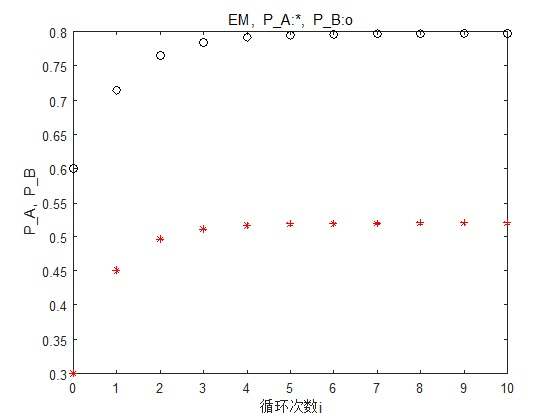

# EM算法

* [返回顶层目录](../../content/SUMMARY.md#目录)


[从最大似然到EM算法：一致的理解方式](https://mp.weixin.qq.com/s?__biz=MzIwMTc4ODE0Mw==&mid=2247487878&idx=1&sn=91eace84220bb48f876c50ef7f4b8c5f&chksm=96e9ce06a19e471049fcc02e019569ac648b5e8ed6153bf6a162a1da5b410466c94e5cf43c45&scene=0#rd)


[EM算法再次总结](https://blog.csdn.net/xueyingxue001/article/details/52020673?from=timeline)


[EM算法原理总结](https://mp.weixin.qq.com/s?__biz=MzUyMjE2MTE0Mw==&mid=2247486553&idx=1&sn=b8351c5d5f37c7603e7061201aee33fa&chksm=f9d152c1cea6dbd70fbdcad08968ce8051362af8eda8a9064ccfea6ef67a23d6b68214bee69e&mpshare=1&scene=1&srcid=0717m3N9pzw4F5sF8pnlMmln#rd)


一文详解高斯混合模型原理
http://www.ituring.com.cn/article/497545


[EM算法的九层境界：Hinton和Jordan理解的EM算法](https://mp.weixin.qq.com/s?__biz=MzA5ODUxOTA5Mg==&mid=2652560857&idx=3&sn=188be6fbfc614f505c3792285a7cb36c&chksm=8b7e2c82bc09a5945e66483aa889311f4968c200604a189d1a34dc752b90124a0c9d30193720&mpshare=1&scene=1&srcid=0731dbwZHlIqN8ushtUfiF0R#rd)


# 为什么要有EM算法


[EM算法存在的意义是什么？](https://www.zhihu.com/question/40797593/answer/453111693)


# 1如何感性地理解EM算法？

https://www.jianshu.com/p/1121509ac1dc


# 2推一篇Nature Biotech的EM tutorial文章


# 3The Introduction to Expectation Maximization Algorithm 

https://www.zhihu.com/question/27976634/answer/263821332

看了很多中文的，还是不懂，最后通过follow [NTU这个](http://www.cmlab.csie.ntu.edu.tw/~cyy/learning/tutorials/EM.pdf) 理解了一点。

很多东西都是搞数学的人弄出来，那群人小智慧有余，其实很傻。

http://www.cmlab.csie.ntu.edu.tw/~cyy/learning/tutorials/EM.pdf

什么是缺失值(missiong value)或者隐变量？举例来说：

* 给予四个人的身高和体重，但其中一人的体重未知(miss)，推测整体的distribution？
* 任意给予十个人，但尚未做分类(classify)，此时他属于哪一个类是未知的。


简单的说，EM算法就是先由当前的θn的分布，推测出缺失值z的最适合的分布，再由已知的数据+缺失数据z，去推测下一步θ(n+1)的分布。


# 4

https://www.zhihu.com/question/27976634/answer/163164402

em算法应该推成 kl散度+下界函数 的形式，这样比较好理解


EM算法是一种迭代算法，1977年由Dempster等人总结提出，用于含有隐变量（hidden variable）的概率模型参数的极大似然佔计，或极大后验概率估计。EM算法的每次迭代由两步组成：**E步，求期望（expectation）**；**M步，求极大（maximization）**。所以这一算法称为期望极大算法（expectation maximization algorithm），简称EM算法。本章首先叙述EM算法，然后讨论EM算法的收敛性；作为EM算法的应用，介绍髙斯混合模型的学习；最后叙述EM算法的推广——GEM算法。

# EM算法的引入

概率模型有时既含有观测变量（observable variable），又含有**隐变量**或潜在变量（latent variable）。如果概率模型的变量都是观测变童，那么给定数据，可以直接用极大似然估计法，或贝叶斯估计法估计模型参数。但是，当模型含有隐变量时，就不能简单地使用这些估计方法。**EM算法就是含有隐变量的概率模型参数的极大似然估计法，或极大后验概率估计法**。我们仅讨论极大似然估计，极大后验概率估计与其类似。

也就是说，EM算法当做最大似然估计的拓展，解决难以给出解析解（含有隐变量）的最大似然估计（MLE）（或极大后验概率）问题。

## 用投硬币解释EM算法

推一篇Nature Biotech的EM tutorial文章，用了一个投硬币的例子来讲EM算法的思想。

> [Do, C. B., & Batzoglou, S. (2008). 《What is the expectation maximization algorithm?》. *Nature biotechnology*, *26*(8), 897.](http://ai.stanford.edu/~chuongdo/papers/em_tutorial.pdf)

现在有两个硬币A和B，要估计的参数是它们各自翻正面（head）的概率。观察的过程是先随机选A或者B，然后扔10次。以上步骤重复5次。

如果知道每次选的是A还是B，那可以直接估计（见下图a）。如果不知道选的是A还是B（隐变量），只观测到5次循环共50次投币的结果，这时就没法直接估计A和B的正面概率。EM算法此时可起作用（见下图b）。

推荐读原文，没有复杂的数学公式，通俗易懂。


上图中第一次抛硬币时硬币A的0.45是什么意思？是怎么得到的？意思是这轮投掷的10次硬币，是硬币A的可能性有多少。这其实是一个最大似然估计，即
$$
\begin{aligned}
P_A=0.6^5\times 0.4^5=0.00079626\\
P_B=0.5^5\times 0.5^5=0.00097656\\
P_A'=P_A/(P_A+P_B)=0.45\\
P_B'=P_B/(P_A+P_B)=0.55
\end{aligned}
$$
**对例子的解释：**

**这个例子中的隐变量z，其实就是每次抛硬币的时候，选择硬币A和硬币B的概率。**

* **在E（期望）步，我们得到隐变量的估计值**

  **但为什么叫期望呢？因为为了求Q函数，要求得Q函数就必须求隐变量的期望值。为什么要求所谓的Q函数，而不是参数的似然函数呢？因为隐变量的存在，导致似然函数是一个累积和的对数，即log∑，这个不好计算呀，要转成∑log才能计算出来啊，而这个∑log，就是Q函数啊。即因为参数似然函数不好求，才转而求Q函数的**

* **在M（最大化）步，我们得到模型参数的值**

  **这相当于最大似然，但却是Q函数的最大似然。为什么Q函数的最大似然，就能相当于参数的最大似然呢？因为Q函数是参数最大似然的下界，只要Q函数是增大的，那参数似然函数也是增大的**

简单的说，**EM算法就是先由当前的θn的分布，推测出缺失值z的最适合的分布，再由已知的数据+缺失数据z，去推测下一步θ(n+1)的分布**。

这是我根据上图写的matlab代码：

```matlab
%% 先验概率
p_A_up = 0.6;% 估计的A硬币正面朝上的概率
p_B_up = 0.5;% 估计的B硬币正面朝上的概率
disp(['p_A_up(0) = ',num2str(p_A_up),' p_B_up(0) = ',num2str(p_B_up)]);
plot(0,p_A_up,'r*', 0,p_B_up,'ko'); hold on; 
xlabel('循环次数i'); ylabel('P\_A,  P\_B'); title('EM,  P\_A:*,  P\_B:o'); pause(0.15);
%% 实验样本描述
n_total = 10;
n_up_1 = 5; n_up_2 = 9; n_up_3 = 8; n_up_4 = 4; n_up_5 = 7; 
%% E_step and M_step
for i = 1:10
    % 第一次实验（10次投币）
    p_A_likelyhood_1 = p_A_up^n_up_1 * (1-p_A_up)^(n_total-n_up_1);
    p_B_likelyhood_1 = p_B_up^n_up_1 * (1-p_B_up)^(n_total-n_up_1);
    p_AB_likelyhood_1 = p_A_likelyhood_1 + p_B_likelyhood_1;
    p_A_likelyhood_1 = p_A_likelyhood_1 / p_AB_likelyhood_1;
    p_B_likelyhood_1 = p_B_likelyhood_1 / p_AB_likelyhood_1;
    n_up_A_1 = n_up_1 * p_A_likelyhood_1; n_down_A_1 = (n_total - n_up_1) * p_A_likelyhood_1;
    n_up_B_1 = n_up_1 * p_B_likelyhood_1; n_down_B_1 = (n_total - n_up_1) * p_B_likelyhood_1;

    % 第二次实验（10次投币）
    p_A_likelyhood_2 = p_A_up^n_up_2 * (1-p_A_up)^(n_total-n_up_2);
    p_B_likelyhood_2 = p_B_up^n_up_2 * (1-p_B_up)^(n_total-n_up_2);
    p_AB_likelyhood_2 = p_A_likelyhood_2 + p_B_likelyhood_2;
    p_A_likelyhood_2 = p_A_likelyhood_2 / p_AB_likelyhood_2;
    p_B_likelyhood_2 = p_B_likelyhood_2 / p_AB_likelyhood_2;
    n_up_A_2 = n_up_2 * p_A_likelyhood_2; n_down_A_2 = (n_total - n_up_2) * p_A_likelyhood_2;
    n_up_B_2 = n_up_2 * p_B_likelyhood_2; n_down_B_2 = (n_total - n_up_2) * p_B_likelyhood_2;

    % 第三次实验（10次投币）
    p_A_likelyhood_3 = p_A_up^n_up_3 * (1-p_A_up)^(n_total-n_up_3);
    p_B_likelyhood_3 = p_B_up^n_up_3 * (1-p_B_up)^(n_total-n_up_3);
    p_AB_likelyhood_3 = p_A_likelyhood_3 + p_B_likelyhood_3;
    p_A_likelyhood_3 = p_A_likelyhood_3 / p_AB_likelyhood_3;
    p_B_likelyhood_3 = p_B_likelyhood_3 / p_AB_likelyhood_3;
    n_up_A_3 = n_up_3 * p_A_likelyhood_3; n_down_A_3 = (n_total - n_up_3) * p_A_likelyhood_3;
    n_up_B_3 = n_up_3 * p_B_likelyhood_3; n_down_B_3 = (n_total - n_up_3) * p_B_likelyhood_3;

    % 第四次实验（10次投币）
    p_A_likelyhood_4 = p_A_up^n_up_4 * (1-p_A_up)^(n_total-n_up_4);
    p_B_likelyhood_4 = p_B_up^n_up_4 * (1-p_B_up)^(n_total-n_up_4);
    p_AB_likelyhood_4 = p_A_likelyhood_4 + p_B_likelyhood_4;
    p_A_likelyhood_4 = p_A_likelyhood_4 / p_AB_likelyhood_4;
    p_B_likelyhood_4 = p_B_likelyhood_4 / p_AB_likelyhood_4;
    n_up_A_4 = n_up_4 * p_A_likelyhood_4; n_down_A_4 = (n_total - n_up_4) * p_A_likelyhood_4;
    n_up_B_4 = n_up_4 * p_B_likelyhood_4; n_down_B_4 = (n_total - n_up_4) * p_B_likelyhood_4;

    % 第五次实验（10次投币）
    p_A_likelyhood_5 = p_A_up^n_up_5 * (1-p_A_up)^(n_total-n_up_5);
    p_B_likelyhood_5 = p_B_up^n_up_5 * (1-p_B_up)^(n_total-n_up_5);
    p_AB_likelyhood_5 = p_A_likelyhood_5 + p_B_likelyhood_5;
    p_A_likelyhood_5 = p_A_likelyhood_5 / p_AB_likelyhood_5;
    p_B_likelyhood_5 = p_B_likelyhood_5 / p_AB_likelyhood_5;
    n_up_A_5 = n_up_5 * p_A_likelyhood_5; n_down_A_5 = (n_total - n_up_5) * p_A_likelyhood_5;
    n_up_B_5 = n_up_5 * p_B_likelyhood_5; n_down_B_5 = (n_total - n_up_5) * p_B_likelyhood_5;
    
    % A硬币的全部投币结果
    n_up_A_total= n_up_A_1 + n_up_A_2 + n_up_A_3 + n_up_A_4 + n_up_A_5;
    n_down_A_total= n_down_A_1 + n_down_A_2 + n_down_A_3 + n_down_A_4 + n_down_A_5;
    p_A_up = n_up_A_total / (n_up_A_total + n_down_A_total);
    
    % B硬币的全部投币结果
    n_up_B_total= n_up_B_1 + n_up_B_2 + n_up_B_3 + n_up_B_4 + n_up_B_5;
    n_down_B_total= n_down_B_1 + n_down_B_2 + n_down_B_3 + n_down_B_4 + n_down_B_5;
    p_B_up = n_up_B_total / (n_up_B_total + n_down_B_total);
    
    % 输出显示A和B硬币的正面朝上概率的估计值。A和B硬币是隐变量，因为实验并没有告诉你是A还是B。
    disp(['p_A_up(',num2str(i),') = ',num2str(p_A_up),' p_B_up(',num2str(i),') = ',num2str(p_B_up)]);
    plot(i,p_A_up,'r*', i,p_B_up,'ko'); pause(0.15);
end
hold off
```

matlab运行的收敛过程如下所示，A硬币正面朝上的概率由最初猜测的0.6收敛为了最终的0.80，B硬币正面朝上的概率由最初猜测的0.5收敛到了最终的0.52。


而如果

* 取A硬币正面朝上的概率初值为0.3
* 取B硬币正面朝上的概率初值为0.6

那么得到的模型参数的极大似然估计是：

* A硬币正面朝上的概率最终值为0.52
* B硬币正面朝上的概率最终值为0.80

matlab运行的收敛过程如下所示：



这就是说，**EM算法与初值的选择有关，选择不同的初值可能得到不同的参数估计值**。

# EM算法详述

一般地，用Y表示观测随机变量的数据，Z表示隐随机变量的数据。**Y和Z连在一起称为完全数据，观测数据Y又称为不完全数据**。

假设给定观测数据Y，其概率分布是P(Y|θ)，其中θ是需要估计的模型参数，那么不完全数据Y的似然函数是P(Y|θ)，对数似然函数L(θ)=log P(Y|θ)；

假设Y和Z的联合概率分布是P(Y,Z|θ)，那么完全数据的对数似然函数是log P(Y,Z|θ)。

EM算法通过迭代求不完全数据Y的对数似然函数L(θ)=log P(Y|θ)的极大似然估计。每次迭代包含两步：

* E步，求期望
* M步，求极大化

下面来介绍EM算法。

## EM算法公式


## EM算法的推导


## EM算法的收敛性


# EM算法应用


## EM算法在高斯混合模型中的应用


## EM算法在掷硬币模型中的应用

假设有3枚硬币，分别记作A、B、C。这些硬币正面出现的概率分别为π，p和q。进行如下掷硬币实验：

先掷硬币A，然后根据A硬币的投掷结果选出硬币B或者硬币C，

- 硬币A投掷结果为正面，选硬币B
- 硬币A投掷结果为反面，选硬币C

然后掷选出的硬币B或C，掷硬币的结果，出现正面记作1，出现复变记作0；独立地重复n次试验（这里，n=10），观测结果如下：
$$
1,1,0,1,0,0,1,0,1,1
$$
假设只能观测到掷硬币的最终结果0或1，不能观测掷硬币的过程（硬币A的投掷结果）。问该如何估计三硬币正面朝上的概率，即三硬币模型的参数π，p和q。

解：三硬币模型可以写作


# EM算法的推广


# 参考资料

* [怎么通俗易懂地解释EM算法并且举个例子?](https://www.zhihu.com/question/27976634/answer/153567695)

"通俗易懂地解释EM算法"一节参考此回答。


