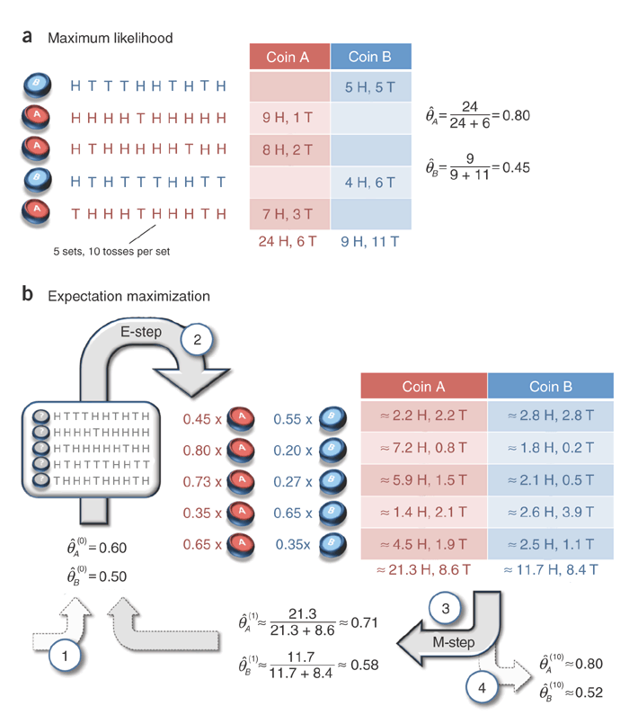
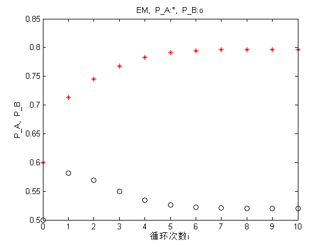

# EM算法

* [返回顶层目录](../../content/SUMMARY.md#目录)

[从最大似然到EM算法：一致的理解方式](https://mp.weixin.qq.com/s?__biz=MzIwMTc4ODE0Mw==&mid=2247487878&idx=1&sn=91eace84220bb48f876c50ef7f4b8c5f&chksm=96e9ce06a19e471049fcc02e019569ac648b5e8ed6153bf6a162a1da5b410466c94e5cf43c45&scene=0#rd)

[EM算法再次总结](https://blog.csdn.net/xueyingxue001/article/details/52020673?from=timeline)

一文详解高斯混合模型原理
http://www.ituring.com.cn/article/497545

# 为什么要有EM算法

EM算法当做最大似然估计的拓展，解决难以给出解析解的最大似然估计（MLE）问题。

# 1如何感性地理解EM算法？

https://www.jianshu.com/p/1121509ac1dc

# 2推一篇Nature Biotech的EM tutorial文章

怎么通俗易懂地解释EM算法并且举个例子?

https://www.zhihu.com/question/27976634/answer/153567695

推一篇Nature Biotech的EM tutorial文章，用了一个投硬币的例子来讲EM算法的思想。

> Do, C. B., & Batzoglou, S. (2008). What is the expectation maximization algorithm?. *Nature biotechnology*, *26*(8), 897.
>
> http://ai.stanford.edu/~chuongdo/papers/em_tutorial.pdf

现在有两个硬币A和B，要估计的参数是它们各自翻正面（head）的概率。观察的过程是先随机选A或者B，然后扔10次。以上步骤重复5次。

如果知道每次选的是A还是B，那可以直接估计（见下图a）。如果不知道选的是A还是B（隐变量），只观测到5次循环共50次投币的结果，这时就没法直接估计A和B的正面概率。EM算法此时可起作用（见下图b）。

推荐读原文，没有复杂的数学公式，通俗易懂。

上图中第一次抛硬币时硬币A的0.45是怎么得到的？这其实是一个最大似然估计，即
$$
\begin{aligned}
P_A=0.6^5\times 0.4^5=0.00079626\\
P_B=0.5^5\times 0.5^5=0.00097656\\
P_A'=P_A/(P_A+P_B)=0.45\\
P_B'=P_B/(P_A+P_B)=0.55
\end{aligned}
$$
这是我根据上图写的matlab代码：

~~~matlab
%% 先验概率
p_A_up = 0.6;% 估计的A硬币正面朝上的概率
p_B_up = 0.5;% 估计的B硬币正面朝上的概率
disp(['p_A_up(0) = ',num2str(p_A_up),' p_B_up(0) = ',num2str(p_B_up)]);
plot(0,p_A_up,'r*', 0,p_B_up,'ko'); hold on; 
xlabel('循环次数i'); ylabel('P\_A,  P\_B'); title('EM,  P\_A:*,  P\_B:o'); pause(0.15);
%% 实验样本描述
n_total = 10;
n_up_1 = 5; n_up_2 = 9; n_up_3 = 8; n_up_4 = 4; n_up_5 = 7; 
%% E_step and M_step
for i = 1:10
    % 第一次实验（10次投币）
    p_A_likelyhood_1 = p_A_up^n_up_1 * (1-p_A_up)^(n_total-n_up_1);
    p_B_likelyhood_1 = p_B_up^n_up_1 * (1-p_B_up)^(n_total-n_up_1);
    p_AB_likelyhood_1 = p_A_likelyhood_1 + p_B_likelyhood_1;
    p_A_likelyhood_1 = p_A_likelyhood_1 / p_AB_likelyhood_1;
    p_B_likelyhood_1 = p_B_likelyhood_1 / p_AB_likelyhood_1;
    n_up_A_1 = n_up_1 * p_A_likelyhood_1; n_down_A_1 = (n_total - n_up_1) * p_A_likelyhood_1;
    n_up_B_1 = n_up_1 * p_B_likelyhood_1; n_down_B_1 = (n_total - n_up_1) * p_B_likelyhood_1;

    % 第二次实验（10次投币）
    p_A_likelyhood_2 = p_A_up^n_up_2 * (1-p_A_up)^(n_total-n_up_2);
    p_B_likelyhood_2 = p_B_up^n_up_2 * (1-p_B_up)^(n_total-n_up_2);
    p_AB_likelyhood_2 = p_A_likelyhood_2 + p_B_likelyhood_2;
    p_A_likelyhood_2 = p_A_likelyhood_2 / p_AB_likelyhood_2;
    p_B_likelyhood_2 = p_B_likelyhood_2 / p_AB_likelyhood_2;
    n_up_A_2 = n_up_2 * p_A_likelyhood_2; n_down_A_2 = (n_total - n_up_2) * p_A_likelyhood_2;
    n_up_B_2 = n_up_2 * p_B_likelyhood_2; n_down_B_2 = (n_total - n_up_2) * p_B_likelyhood_2;

    % 第三次实验（10次投币）
    p_A_likelyhood_3 = p_A_up^n_up_3 * (1-p_A_up)^(n_total-n_up_3);
    p_B_likelyhood_3 = p_B_up^n_up_3 * (1-p_B_up)^(n_total-n_up_3);
    p_AB_likelyhood_3 = p_A_likelyhood_3 + p_B_likelyhood_3;
    p_A_likelyhood_3 = p_A_likelyhood_3 / p_AB_likelyhood_3;
    p_B_likelyhood_3 = p_B_likelyhood_3 / p_AB_likelyhood_3;
    n_up_A_3 = n_up_3 * p_A_likelyhood_3; n_down_A_3 = (n_total - n_up_3) * p_A_likelyhood_3;
    n_up_B_3 = n_up_3 * p_B_likelyhood_3; n_down_B_3 = (n_total - n_up_3) * p_B_likelyhood_3;

    % 第四次实验（10次投币）
    p_A_likelyhood_4 = p_A_up^n_up_4 * (1-p_A_up)^(n_total-n_up_4);
    p_B_likelyhood_4 = p_B_up^n_up_4 * (1-p_B_up)^(n_total-n_up_4);
    p_AB_likelyhood_4 = p_A_likelyhood_4 + p_B_likelyhood_4;
    p_A_likelyhood_4 = p_A_likelyhood_4 / p_AB_likelyhood_4;
    p_B_likelyhood_4 = p_B_likelyhood_4 / p_AB_likelyhood_4;
    n_up_A_4 = n_up_4 * p_A_likelyhood_4; n_down_A_4 = (n_total - n_up_4) * p_A_likelyhood_4;
    n_up_B_4 = n_up_4 * p_B_likelyhood_4; n_down_B_4 = (n_total - n_up_4) * p_B_likelyhood_4;

    % 第五次实验（10次投币）
    p_A_likelyhood_5 = p_A_up^n_up_5 * (1-p_A_up)^(n_total-n_up_5);
    p_B_likelyhood_5 = p_B_up^n_up_5 * (1-p_B_up)^(n_total-n_up_5);
    p_AB_likelyhood_5 = p_A_likelyhood_5 + p_B_likelyhood_5;
    p_A_likelyhood_5 = p_A_likelyhood_5 / p_AB_likelyhood_5;
    p_B_likelyhood_5 = p_B_likelyhood_5 / p_AB_likelyhood_5;
    n_up_A_5 = n_up_5 * p_A_likelyhood_5; n_down_A_5 = (n_total - n_up_5) * p_A_likelyhood_5;
    n_up_B_5 = n_up_5 * p_B_likelyhood_5; n_down_B_5 = (n_total - n_up_5) * p_B_likelyhood_5;
    
    % A硬币的全部投币结果
    n_up_A_total= n_up_A_1 + n_up_A_2 + n_up_A_3 + n_up_A_4 + n_up_A_5;
    n_down_A_total= n_down_A_1 + n_down_A_2 + n_down_A_3 + n_down_A_4 + n_down_A_5;
    p_A_up = n_up_A_total / (n_up_A_total + n_down_A_total);
    
    % B硬币的全部投币结果
    n_up_B_total= n_up_B_1 + n_up_B_2 + n_up_B_3 + n_up_B_4 + n_up_B_5;
    n_down_B_total= n_down_B_1 + n_down_B_2 + n_down_B_3 + n_down_B_4 + n_down_B_5;
    p_B_up = n_up_B_total / (n_up_B_total + n_down_B_total);
    
    % 输出显示A和B硬币的正面朝上概率的估计值。A和B硬币是隐变量，因为实验并没有告诉你是A还是B。
    disp(['p_A_up(',num2str(i),') = ',num2str(p_A_up),' p_B_up(',num2str(i),') = ',num2str(p_B_up)]);
    plot(i,p_A_up,'r*', i,p_B_up,'ko'); pause(0.15);
end
hold off
~~~

matlab运行结果如下所示，A硬币正面朝上的概率由最初猜测的0.6收敛为了最终的0.80，B硬币正面朝上的概率由最初猜测的0.6收敛到了最终的0.52。

# 3The Introduction to Expectation Maximization Algorithm 

https://www.zhihu.com/question/27976634/answer/263821332

看了很多中文的，还是不懂，最后通过follow [NTU这个](https://link.zhihu.com/?target=http%3A//www.cmlab.csie.ntu.edu.tw/%7Ecyy/learning/tutorials/EM.pdf) 理解了一点。

很多东西都是搞数学的人弄出来，那群人小智慧有余，其实很傻。

http://www.cmlab.csie.ntu.edu.tw/~cyy/learning/tutorials/EM.pdf

什么是缺失值(missiong value)或者隐变量？举例来说：

* 给予四个人的身高和体重，但其中一人的体重未知(miss)，推测整体的distribution？
* 任意给予十个人，但尚未做分类(classify)，此时他属于哪一个类是未知的。

简单的说，EM算法就是先由当前的$\theta_n$的分布，推测出缺失值z的最适合的分布，再由已知的数据+缺失数据z，去推测下一步$\theta_{n+1}$的分布。

# 4

https://www.zhihu.com/question/27976634/answer/163164402

em算法应该推成 kl散度+下界函数 的形式，这样比较好理解

