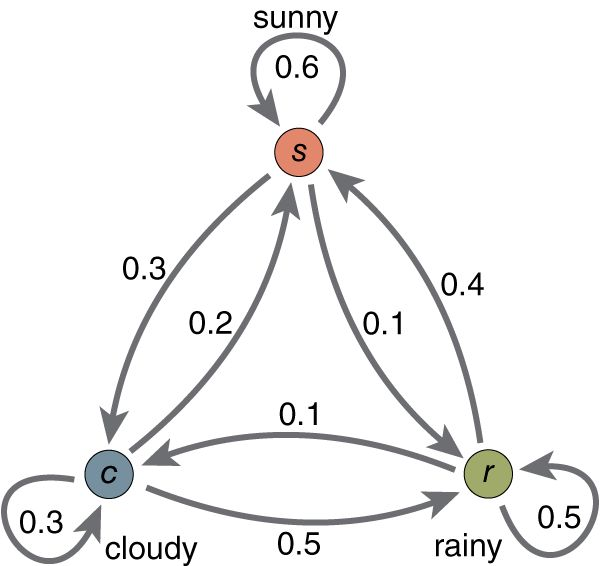
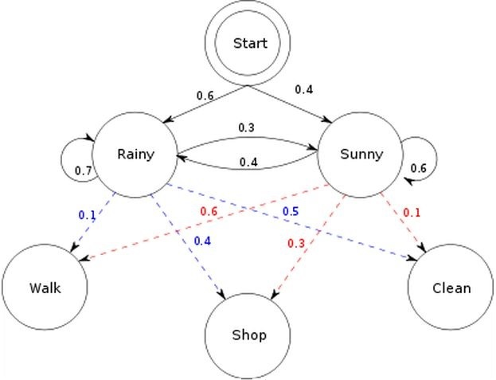
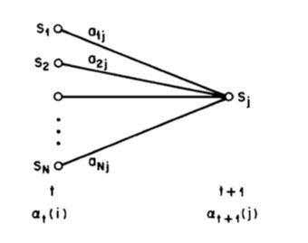
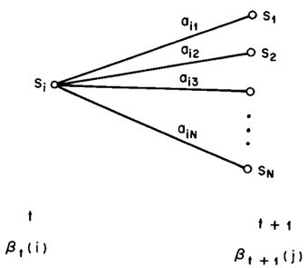

# HMM隐马尔科夫模型

HMM模型就是这样一个系统—它有一个会随时间改变的隐藏的状态，在持续地影响它的外在表现。

* [返回顶层目录](../../SUMMARY.md#目录)

* [理解HMM](#理解HMM)
  * [用简单的例子来理解HMM](#用简单的例子来理解HMM)
    * [用打游戏来理解](#用打游戏来理解)
    * [用女朋友来理解](#用女朋友来理解)
* [HMM的三个问题](#HMM的三个问题)
  * [解码(Decoding)](#解码(Decoding))
  * [学习(Learning)](#学习(Learning))
  * [估计(Evaluation)](#估计(Evaluation))
* [HMM的应用](#HMM的应用)

# 理解HMM

## 用简单的例子来理解HMM

本节是给零基础人士看的。目标是让普通初中生以及只有初中基础人士无障碍理解HMM框架。追求数学严谨性人士、追求用简洁符号表达模型的同学以及数理基础良好的大神请自行移步参阅文献。

讲这种东西就得先搞清HMM到底干了什么，初学者很容易对“模型在干嘛”这个问题上犯晕。我个人特别讨厌跟初学者上来就讲state space/transition matrix/emission probability云云的讲法(注：比如《统计学习方法》李航博士那种讲法。虽然用来准备面试很方便，但初学者肯定会被符号和几个概念绕晕了；另外，私以为他换掉符号和前人文献不保持一致的做法又会让初学者又多了一道坎去翻。总之，不太厚道)。因为初学时，对大多非理科出身的人而言，用抽象的名词与符号描述的“语言系统”还没固化在脑袋里。用抽象符号在那儿讲就好比“一群人还没学会走，就逼着他们快点跑”。这是不太现实的。

综上，用复杂抽象的语言描述不合适的，这个学习曲线过于陡峭，别人需要时间消化。基于此原因，我发现，对零基础小伙伴们用游戏的例子去类比地解释往往比较容易降低学习难度，比如这样讲:

### 用打游戏来理解

我是一战士，修炼出了三种战斗形态，分别为**暴怒态**，**正常状态**和**防御态**。同时我也会三个被动技能，分别是普通平A，爆击(攻击伤害翻倍)，吸血(生命汲取)。
我在暴怒状态下打出暴击的概率是80%,打出吸血概率为5%；
在正常状态下，打出暴击的比率为30%，打出吸血的概率是20%；
在防御形态下，暴击成功概率为5%，吸血概率为60%。
总结一下，**战士在不同状态下能打出技能的概率不一样**。

本来，战士这个职业在暴怒态时，身边会有一圈红光环；防御态时，会有一圈蓝光环。但是，现在我正在玩游戏，游戏突然出了个bug：有个傻x程序员改了游戏的代码，他给写崩了，从此战士身边光环都看不见了。那我没法通过看脚下的光环知道战士在爆什么状态了。

话说，现在问题来了：由于看不到脚下光环，我只能估计“战士”在爆什么状态；但我现在打一boss，砍10次，发现8次都是暴击，血哗哗地翻倍在掉，你觉得我这战士最可能是爆了什么状态？

(每次用这个不规范的例子和新手讲，他们立刻就懂了；而且他们接下来还会问："’暴怒状态’不能总持续吧？这不科学，应该限定个一段时间后，暴怒状态消失的概率为50%...."你瞧瞧连状态转换的transition prob自己都能假设出来了，都会抢答了都lol...“HMM的在干什么”的问题很容易地让他们就理解了)

综上，一个战士的状态会不断随时间变化；然后他的被动技能发动概率会因为所处不同状态而不同。这就是HMM想表达的东西。并且我们还可以通过它回答一些有趣的问题：通过战士发动的技能来推测战士所出的状态。

这个例子只是个感性认识，**它其实只是告诉了我们hmm比较“像什么东西”。**显然，我们还需要更规范更严谨地去介绍什么是HMM，去规范化这个模型。这个例子里的“战士”可以换成其它答案里的天气，换成硬币等等。但无论用什么说法，我们已经能通过这个例子抓住**核心问题**了：

> HMM模型就是这样一个系统——它有一个能不断改变的**隐藏的状态**（在这个例子里就是战士爆的状态。**它会变**，而且由于一个码农的缘故，**状态变得不可见**）在持续地影响它的**外在表现**（在这个例子里就是战士打出的技能是暴击、平a、还是吸血的概率）。再重复一遍：**HMM模型就是这样一个系统——它有一个会随时间改变的隐藏的状态，在持续地影响它的外在表现。**

现在我们再继续规范一下这个例子，让它更贴近那种严谨描述。
因为我们知道战士打人总爆击，角色特别bug，这没法玩啊。所以我们要限制一下战士爆状态。
我们在游戏里做了个限制：
我们设定，战士一开始进入游戏世界时是**正常状态**的。而且，每过一段时间（比如1分钟），战士就会自动爆一次状态。最后，每一次爆发还和上一次状态爆的状态是什么有关：
1.上一次如果是**正常状态，**那下次变为**暴怒**的概率比较大**。**下次转换成**暴怒状态**，**平衡状态**或**防御状态**的概率我们假设分别为**60%，30%,10%**。这保证了战士职业下次能有较大的概率能打出暴击！
2.同理，若当我们上次在**暴怒态时**，下次继续保持**暴怒态**的概率就得限制一下。下次继续保持**暴怒**的概率就设为10%，而转换成**正常状态**的概率是60%，转换成**防御态**的概率是30%；
3.如果上次是**防御态**，那么我们也让它下次也尽量变正常。（不然总吸血啊）那他下次转成其它三态的概率(三态和以上对应书写顺序一致)分别为为10%，60，30%。
这样服务器就能限制战士的爆**暴怒态**的次数，让它不那么不平衡。

顺便提一下，其实以上的这种限定——让战士下一次爆不同状态的概率只和上次处在什么状态有关系——叫马尔可夫性质（markov property）。
经过这样的设定后，不仅仅战士这个职业不会那么不平衡，而且，我们可以靠以上这些数字来计算之前只能感性理解的问题了。比如：**我这个战士在第一分钟的时候是正常状态，那么我第二分钟赶去死亡谷打一个boss能暴击的概率是多少？（**这个当作思考题**，提示：想想两个问题，上一状态和下一状态间转换的概率是多少？不同状态下发不同技能的概率是多少？）**

最后总结一下。以上例子中讲明了HMM的五样“要素”：
**1.状态和状态间转换的概率**
**2.不同状态下，有着不同的外在表现的概率。**
**3.最开始设置的初始状态**
**4.能转换的所有状态的集合**
**5.能观察到外在表现的结合**

**Hidden 说明的是状态的不可见性；Markov说明的是状态和状态间是markov chain。这就是为什么叫Hidden Markov Model。**

我相信你们再去看其它答案里写的就明白多了。

ps:懂了是什么之后再去看paper就好多了。没记错的话去，看[《A tutorial on Hidden Markov Models and selected applications in Speech recognition》](http://www.cs.cmu.edu/~cga/behavior/rabiner1.pdf)。另外，HMM除了上文提到的“五要素”，还有“三个基本问题”。这文章将hmm的三个基本问题讲得很清楚。

### 用女朋友来理解

既是马尔可夫模型，就一定存在马尔可夫链，该马尔可夫链服从**马尔可夫性质**：即无记忆性。也就是说，这一时刻的状态，受且只受前一时刻的影响，而不受更往前时刻的状态的影响。

在这里我们仍然使用非常简单的天气模型来做说明马尔可夫性质。

在这个马尔可夫模型中，存在三个状态，Sunny， Rainy， Cloudy，同时图片上标的是各个状态间的转移概率（如果不明白什么是转移概率，那建议先去学习什么是马尔可夫再来看HMM）。

现在我们要说明什么是 HMM。既是隐形，说明这些状态是观测不到的，相应的，我们可以通过其他方式来『猜测』或是『推断』这些状态，这也是 HMM 需要解决的问题之一。

举个例子，我女朋友现在在北京工作，而我还在法国读书。每天下班之后，她会根据天气情况有相应的活动：或是去商场购物，或是去公园散步，或是回家收拾房间。我们有时候会通电话，她会告诉我她这几天做了什么，而闲着没事的我呢，则要通过她的行为猜测这几天对应的天气最有可能是什么样子的。

以上就是一个简单的 HMM，天气状况属于状态序列，而她的行为则属于观测序列。天气状况的转换是一个马尔可夫序列。而根据天气的不同，有相对应的概率产生不同的行为。在这里，为了简化，把天气情况简单归结为晴天和雨天两种情况。雨天，她选择去**散步，购物，收拾**的概率分别是0.1，0.4，0.5， 而如果是晴天，她选择去散步，购物，收拾的概率分别是0.6，0.3，0.1。而天气的转换情况如下：这一天下雨，则下一天依然下雨的概率是0.7，而转换成晴天的概率是0.3；这一天是晴天，则下一天依然是晴天的概率是0.6，而转换成雨天的概率是0.4。同时还存在一个初始概率，也就是第一天下雨的概率是0.6， 晴天的概率是0.4。

根据以上的信息，我们得到了 HMM的一些基本要素：初始概率分布 π，状态转移矩阵 A，观测量的概率分布 B，同时有两个状态，三种可能的观测值。

现在，重点是要了解并解决HMM 的三个问题。

问题1(**解码**)，已知整个模型，我女朋友告诉我，连续三天，她下班后做的事情分别是：散步，购物，收拾。那么，根据模型，计算产生这些行为的概率是多少。

问题2(**学习**)，最复杂的，我女朋友只告诉我这三天她分别做了这三件事，而其他什么信息我都没有。她要我建立一个模型，晴雨转换概率，第一天天气情况的概率分布，根据天气情况她选择做某事的概率分布。（惨绝人寰）

问题3(**估计**)，同样知晓这个模型，同样是这三件事，我女朋友要我猜，这三天她下班后北京的天气是怎么样的。这三天怎么样的天气才最有可能让她做这样的事情。

而要解决这些问题，伟大的大师们分别找出了对应的算法。问题一，Forward算法(向前算法)，或者Backward算法(向后算法)。 问题二，Baum-Welch算法(鲍姆-韦尔奇算法)（中文好绕口），用的是最大似然估计方法，当然，由于其含隐变量，得采用EM算法，EM算法就是求含有隐变量的MLE，现在知道为什么要学习EM算法了吧。问题三，Viterbi算法，维特比算法。

尽管例子有些荒谬（天气情况要复杂的多，而且不太可能满足马尔可夫性质；同时，女朋友要做什么往往由心情决定而不由天气决定。而从问题一来看，一定是天数越多，这个概率就会越低；从问题三来看，观察到的行为越多，模型才能更准确一些），但是应该已经简单却又详尽地解释了什么是 HMM。如果只是想了解个大概，到此为止。

****

具体如何解决这三大问题。需要数学基础，概率基础。

问题1(**解码**)，已知整个模型，我女朋友告诉我，连续三天，她下班后做的事情分别是：散步，购物，收拾。那么，根据模型，计算产生这些行为的概率是多少。

**问题1的解决1：遍历算法。**

要计算产生这一系列行为的概率，那我们把每一种天气情况下产生这些行为都罗列出来，那每种情况的和就是这个概率。有三天，每天有两种可能的天气情况，则总共有 2的三次=8种 情况.
举例其中一种情况 ： P（下雨，下雨，下雨，散步，购物，收拾）=P（第一天下雨）P（第一天下雨去散步）P（第二天接着下雨）P（下雨去购物）P（第三天还下雨）P（下雨回家收拾）=0.6X0.1X0.7X0.4X0.7X0.5=0.00588
当然，这里面的 P（第二天接着下雨）当然是已知第一天下雨的情况下，第二天下雨的概率，为0.7.
将八种情况相加可得，三天的行为为{散步，购物，收拾}的可能性为0.033612. 看似简单易计算，但是一旦观察序列变长，计算量就会非常庞大（$N^T$的复杂度，T为观测序列的长度）。

**问题1 的解决2：向前算法。**

先计算 t=1时刻，发生『散步』一行为的概率，如果下雨，则为 P(散步，下雨)=P（第一天下雨）X P（散步 | 下雨）=0.6X0.1=0.06；如果晴天，P（散步，晴天）=0.4X0.6=0.24

t=2 时刻，发生『购物』的概率，当然，这个概率可以从 t=1 时刻计算而来。

如果t=2下雨，则 P（第一天散步，第二天购物， 第二天下雨）= 【P（第一天散步，第一天下雨）X P（第二天下雨 | 第一天下雨）+P（第一天散步，第一天晴天）X P(第二天下雨 | 第一天晴天)】X P（第二天购物 | 第二天下雨）=【0.06X0.7+0.24X0.4】X0.4=0.0552

如果 t=2晴天，则 P（第一天散步，第二天购物，第二天晴天）=0.0486 （同理可得，请自行推理）。

如果 t=3，下雨，则 P（第一天散步，第二天购物，第三天收拾，第三天下雨）=【P（第一天散步，第二天购物，第二天下雨）X P（第三天下雨 | 第二天下雨）+ P（第一天散步，第二天购物，第二天天晴）X P（第三天下雨 | 第二天天晴）】X P（第三天收拾 | 第三天下雨）=【0.0552X0.7+0.0486X0.4】X0.5= 0.02904

如果t=3，晴天，则 P（第一天散步，第二天购物，第三天收拾，第三天晴天）= 0.004572

那么 P（第一天散步，第二天购物，第三天收拾），这一概率则是第三天，下雨和晴天两种情况的概率和。0.02904+0.004572=0.033612.

以上例子可以看出，向前算法计算了每个时间点时，每个状态的发生观测序列的概率，看似繁杂，但在 T 变大时，复杂度会大大降低。

**问题1的解决3：向后算法**

顾名思义，向前算法是在时间 t=1的时候，一步一步往前计算。而相反的，向后算法则是倒退着，从最后一个状态开始，慢慢往后推。

初始化后向变量：
$$
\begin{aligned}
\beta_3(Rainy)=1\\
\beta_3(Sunny)=1
\end{aligned}
$$
递推后向变量：
$$
\begin{aligned}
\beta_2(Rainy)&=\alpha_{Rainy\rightarrow Rainy}b_{Rainy\rightarrow (O_3=Clean)}\beta_3(Rainy)+\alpha_{Rainy\rightarrow Sunny}b_{Sunny\rightarrow (O_3=Clean)}\beta_3(Sunny)\\
&=0.7\times 0.5\times1+0.3\times0.1\times1=0.38\\
\beta_2(Sunny)&=\alpha_{Sunny\rightarrow Rainy}b_{Rainy\rightarrow (O_3=Clean)}\beta_3(Rainy)+\alpha_{Sunny\rightarrow Sunny}b_{Sunny\rightarrow (O_3=Clean)}\beta_3(Sunny)\\
&=0.4\times0.5\times1+0.6\times0.1\times1=0.26
\end{aligned}
$$
同理，继续递推后向变量：
$$
\begin{aligned}
\beta_1(Rainy)&=\alpha_{Rainy\rightarrow Rainy}b_{Rainy\rightarrow (O_2=Shop)}\beta_2(Rainy)+\alpha_{Rainy\rightarrow Sunny}b_{Sunny\rightarrow (O_2=Shop)}\beta_2(Sunny)\\
&=0.7\times 0.4\times0.38+0.3\times0.3\times0.26=0.1298\\
\beta_1(Sunny)&=\alpha_{Sunny\rightarrow Rainy}b_{Rainy\rightarrow (O_2=Shop)}\beta_2(Rainy)+\alpha_{Sunny\rightarrow Sunny}b_{Sunny\rightarrow (O_2=Shop)}\beta_2(Sunny)\\
&=0.4\times0.4\times0.38+0.6\times0.3\times0.26=0.1076
\end{aligned}
$$
最终结果：P(散步，购物，收拾)=
$$
\begin{aligned}
&\pi_{Rainy}\times b_{Rainy\rightarrow(O_1=Walk)}\beta_1(Rainy)+\pi_{Sunny}\times b_{Sunny\rightarrow(O_1=Walk)}\beta_1(Sunny)\\
=&0.6\times0.1\times0.1298+0.4\times0.6\times0.1076\\
=&0.033612
\end{aligned}
$$

三种算法的答案是一致的。

问题2(**学习**)，最复杂的，我女朋友只告诉我这三天她分别做了这三件事，而其他什么信息我都没有。她要我建立一个模型，晴雨转换概率，第一天天气情况的概率分布，根据天气情况她选择做某事的概率分布。（惨绝人寰）

问题3(**估计**)，同样知晓这个模型，同样是这三件事，我女朋友要我猜，这三天她下班后北京的天气是怎么样的。这三天怎么样的天气才最有可能让她做这样的事情。

**问题3的解决：维特比算法**

维特比算法致力于寻找一条最佳路径，以便能最好地解释观测到的序列。

初始化：
$$
\begin{aligned}
&\delta_1(Sunny)=\pi_{Sunny}\times b_{Sunny\rightarrow(O_1=Walk)}=0.4\times0.6=0.24\\
&\delta_1(Rainy)=\pi_{Rainy}\times b_{Rainy\rightarrow(O_1=Walk)}=0.6\times0.1=0.06
\end{aligned}
$$
初始路径：
$$
\begin{aligned}
&\phi_1(Sunny)=X\\
&\phi_1(Rainy)=X
\end{aligned}
$$
递推，当然是要找出概率最大的那条路径。
$$
\begin{aligned}
&\delta_2(Rainy)\\
=&max[\delta_1(Rainy)\times \alpha_{Rainy\rightarrow Rainy},\delta_1(Sunny)\times \alpha_{Sunny\rightarrow Rainy}]\times b_{Rainy\rightarrow(O_2=Shop)}\\
=&max[0.06\times0.7,\ 0.24\times0.4]\times0.4\\
=&0.0384
\end{aligned}
$$

$$
\begin{aligned}
&\delta_2(Sunny)\\
=&max[\delta_1(Sunny)\times \alpha_{Sunny\rightarrow Sunny},\delta_1(Rainy)\times \alpha_{Rainy\rightarrow Sunny}]\times b_{Sunny\rightarrow(O_2=Shop)}\\
=&max[0.24\times0.6,\ 0.06\times0.3]\times0.3\\
=&0.0432
\end{aligned}
$$

那么，到达第二天下雨这一状态的最佳路径，应该是：
$$
\begin{aligned}
&\phi_2(Rainy)\\
=&arg\ max[\delta_1(Rainy)\times \alpha_{Rainy\rightarrow Rainy},\delta_1(Sunny)\times \alpha_{Sunny\rightarrow Rainy}]\\
=&arg\ max[0.06\times0.7,\ 0.24\times0.4]\\
=&arg\ max[0.042,\ 0.096]\\
=&Sunny
\end{aligned}
$$

也就是说，第一天是晴天的可能性更大，即到达第二天下雨这一状态的最大可能路径是“第一天天晴->第二天下雨”。

同样地，到达第二天天晴这一状态的最佳路径，应该是：
$$
\begin{aligned}
&\phi_2(Sunny)\\
=&arg\ max[\delta_1(Rainy)\times \alpha_{Rainy\rightarrow Sunny},\delta_1(Sunny)\times \alpha_{Sunny\rightarrow Sunny}]\\
=&arg\ max[0.06\times0.3,\ 0.24\times0.6]\\
=&arg\ max[0.018,\ 0.144]\\
=&Sunny
\end{aligned}
$$
也就是说，第一天是晴天的可能性更大，即到达第二天天晴这一状态的最大可能路径是“第一天天晴->第二天天晴”。

同样的，可以推得第三天，
$$
\begin{aligned}
&\delta_3(Rainy)\\
=&max[\delta_2(Rainy)\times \alpha_{Rainy\rightarrow Rainy},\delta_2(Sunny)\times \alpha_{Sunny\rightarrow Rainy}]\times b_{Rainy\rightarrow(O_3=Clean)}\\
=&max[0.0384\times0.7,\ 0.0432\times0.4]\times0.5\\
=&0.01344
\end{aligned}
$$

$$
\begin{aligned}
&\delta_3(Sunny)\\
=&max[\delta_2(Rainy)\times \alpha_{Rainy\rightarrow Sunny},\delta_2(Sunny)\times \alpha_{Sunny\rightarrow Sunny}]\times b_{Sunny\rightarrow(O_3=Clean)}\\
=&max[0.0384\times0.3,\ 0.0432\times0.6]\times0.1\\
=&0.002592
\end{aligned}
$$

那么，到达第三天下雨这一状态的最佳路径，应该是：
$$
\begin{aligned}
&\phi_2(Rainy)\\
=&arg\ max[\delta_1(Rainy)\times \alpha_{Rainy\rightarrow Rainy},\delta_1(Sunny)\times \alpha_{Sunny\rightarrow Rainy}]\\
=&arg\ max[0.06\times0.7,\ 0.24\times0.4]\\
=&arg\ max[0.042,\ 0.096]\\
=&Sunny
\end{aligned}
$$
也就是说，第一天是晴天的可能性更大，即到达第二天下雨这一状态的最大可能路径是“第一天天晴->第二天下雨”。

同样地，到达第二天天晴这一状态的最佳路径，应该是：
$$
\begin{aligned}
&\phi_2(Sunny)\\
=&arg\ max[\delta_1(Rainy)\times \alpha_{Rainy\rightarrow Sunny},\delta_1(Sunny)\times \alpha_{Sunny\rightarrow Sunny}]\\
=&arg\ max[0.06\times0.3,\ 0.24\times0.6]\\
=&arg\ max[0.018,\ 0.144]\\
=&Sunny
\end{aligned}
$$
也就是说，第一天是晴天的可能性更大，即到达第二天天晴这一状态的最大可能路径是“第一天天晴->第二天天晴”。

# HMM的三个问题

## 解码(Decoding)

## 学习(Learning)

## 估计(Evaluation)

# HMM的应用

知乎第三个例子后面的例子

# 参考资料

* [如何用简单易懂的例子解释隐马尔可夫模型](https://www.zhihu.com/question/20962240)

本文的“用简单的例子来理解HMM”这一节就是复制的这个回答里的例子。

