# 机器学习概论

- [返回顶层目录](../../SUMMARY.md#目录)
- [机器学习思想](#机器学习思想)
- [容量、过拟合和欠拟合](#容量、过拟合和欠拟合)
- [正则化](#正则化)
  - [正则化作用及其常见术语](#正则化作用及其常见术语)
  - [机器学习正则化技术基本概念](#机器学习正则化技术基本概念)
  - [正则化对应约束条件的最优化](#正则化对应约束条件的最优化)
    - [L2正则化直观理解](#L2正则化直观理解)
    - [L1正则化直观理解](#L1正则化直观理解)
    - [L1与L2解的稀疏性](#L1与L2解的稀疏性)
    - [正则化参数 λ](#正则化参数 λ)
    - [L2正则化理论分析](#L2正则化理论分析)
    - [L1正则化理论分析](#L1正则化理论分析)
    - [约束最优化观点总结](#约束最优化观点总结)
  - [贝叶斯观点：正则化对应模型先验概率](#贝叶斯观点：正则化对应模型先验概率)
    - [Linear Regression](#Linear Regression)
    - [Ridge Regression](#Ridge Regression)
    - [Lasso Regression](#Lasso Regression)
    - [Elastic Net Regression](#Elastic Net Regression)
    - [贝叶斯观点正则化总结](#贝叶斯观点正则化总结)
  - [正则化技术总结](#正则化技术总结)
- [维数灾难](#维数灾难)


- [机器学习模型分类](#机器学习模型分类)


# 机器学习思想


[机器学习包含哪些学习思想？](https://www.zhihu.com/question/267135168/answer/329318812)


# 容量、过拟合和欠拟合

[一文区分什么是「过拟合」和「欠拟合」？](https://mp.weixin.qq.com/s?__biz=MzI4MDYzNzg4Mw==&mid=2247486990&idx=1&sn=31536229da8b403924de67da070f0d0e&chksm=ebb436dadcc3bfcc30230d64341ea60296e48db3d24a9802c4508593ea55ab40712bbde3b89e&scene=0#rd)


《深度学习》p70

[如何通俗的理解机器学习中的VC维、shatter和break point？](https://www.zhihu.com/question/38607822)


[VC维的来龙去脉](http://www.flickering.cn/machine_learning/2015/04/vc%E7%BB%B4%E7%9A%84%E6%9D%A5%E9%BE%99%E5%8E%BB%E8%84%89/)


# 正则化


《深度学习》p147 正则化和欠约束优化问题

《深度学习》p28 伪拟


[机器学习中使用正则化来防止过拟合是什么原理？](https://www.zhihu.com/question/20700829/answer/16395087)

[[视频讲解]史上最全面的正则化技术总结与分析！](https://mp.weixin.qq.com/s?__biz=MzUyMjE2MTE0Mw==&mid=2247484668&idx=1&sn=2b9244cbd5c3594ec797e323a2335b33&chksm=f9d15a64cea6d3729b94d710c5b2158b1de0af187f8274a58a04276231ecbeb9791170a62bc0&mpshare=1&scene=1&srcid=0224D61CH68y7f8fjwoCWkES#rd)

本群知乎专栏有一篇专门分析这个的文章，有数学推导，你看下就知道为啥了

[[视频讲解]史上最全面的正则化技术总结与分析--part1](https://zhuanlan.zhihu.com/p/35429054)

[[视频讲解]史上最全面的正则化技术总结与分析--part2](https://zhuanlan.zhihu.com/p/35432128)


[为什么说regularization是缓解overfitting的好办法？](https://www.zhihu.com/question/274502949/answer/377224580)


------

正则化是一种有效的控制模型复杂度、防止过拟合、提高模型泛化能力方法，在机器学习和深度学习算法中应用非常广泛，本文从机器学习正则化着手，首先阐述了正则化技术的一般作用和概念，然后针对L1和L2范数正则从4个方面深入理解，最后对常用的典型算法应用进行了分析和总结，后续文章将分析深度学习中的正则化技术。

最基本的正则化方法是在原目标（代价）函数中添加惩罚项，对复杂度高的模型进行“惩罚”。其数学表达形式为：
$$
\tilde{J}(w;X,y)=J(w;X,y)+\alpha\Omega(w)
$$
式中X、y为训练样本和相应标签，w为权重系数向量；J()为目标函数，即为惩罚项，可理解为模型“规模”的某种度量；参数α控制正则化强弱。不同的Ω函数对权重w的最优解有不同的偏好，因而会产生不同的正则化效果。最常用的Ω函数有两种，即L1范数和L2范数，相应称之为L1正则化和L2正则化。此时有：
$$
\begin{aligned}
L1:\Omega(w)=||w||_1=\sum_i|w_i|\\
L2:\Omega(w)=||w||_2^2=\sum_iw_i^2\\
\end{aligned}
$$
本文将从不同角度详细说明L1、L2正则化的推导、求解过程，并对L1范数产生稀疏性效果的本质予以解释。

## 正则化作用及其常见术语

正则化技术广泛应用在机器学习和深度学习算法中，其本质作用是**防止过拟合、提高模型泛化能力**。过拟合简单理解就是训练的算法模型太过复杂了，过分考虑了当前样本结构。其是防止过拟合的其中一种技术手段。在早期的机器学习领域一般只是将范数惩罚叫做正则化技术，而在深度学习领域认为：能够显著减少方差，而不过度增加偏差的策略都可以认为是正则化技术，故推广的正则化技术还有：扩增样本集、早停止、Dropout、集成学习、多任务学习、对抗训练、参数共享等(具体见“花书”)。

过拟合的时候，拟合函数的系数往往非常大，而正则化是通过约束参数的范数使其不要太大，所以可以在一定程度上减少过拟合情况。

为什么过拟合的时候系数会很大？
如下图所示，过拟合，就是**拟合函数需要顾忌每一个点，最终形成的拟合函数波动很大**。在某些很小的区间里，函数值的变化很剧烈。这就意味着函数在某些小区间里的导数值（绝对值）非常大，由于自变量值可大可小，所以只有系数足够大，才能保证导数值很大。

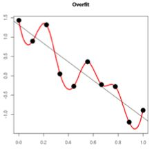

对于机器学习领域正则化技术可以从以下几个不同角度进行理解：

- **(1) 正则化等价于结构风险最小化，其是通过在经验风险项后加上表示模型复杂度的正则化项或惩罚项，达到选择经验风险和模型复杂度都较小的模型目的**。

**经验风险**：机器学习中的风险是指模型与真实解之间的误差的积累，经验风险是指使用训练出来的模型进行预测或者分类，存在多大的误差，可以简单理解为训练误差，经验风险最小化即为训练误差最小。

**结构风险**：结构风险定义为经验风险与置信风险(置信是指可信程度)的和，置信风险越大，模型推广能力越差。可以简单认为结构风险是经验风险后面多加了一项表示模型复杂度的函数项，从而可以同时控制模型训练误差和测试误差，结构风险最小化即为在保证模型分类精度(经验风险)的同时，降低模型复杂度，提高泛化能力。
$$
R(f)=\frac{1}{n}\sum_{i=1}^nL(y_i,f(x_i))+\lambda\Omega(f)
$$
其中， R(f)表示结构风险，L(yi,f(xi))表示第i个样本的经验风险， Ω(f)是表征模型复杂度的正则项，λ是正则化参数。根据奥卡姆剃刀定律，“如无必要，勿增实体”，即认为相对简单的模型泛化能力更好。而模型泛化能力强、泛化误差小，即表示模型推广能力强，通俗理解就是在训练集中训练得到的优秀模型能够很好的适用于实际测试数据，而不仅仅是减少训练误差或者测试误差。**泛化误差**定义如下：
$$
E=\text{Bias}^2(X)+\text{Var}(X)+\text{Noise}
$$
其中，E表示泛化误差，Bias代表偏差，Var代表方差，Noise代表噪声。

泛化误差与偏差和方差的关系如下图所示：


从上图可以看出，随着训练程度加深，模型复杂度会增加，偏差减少，方差增大，而泛化误差呈现U型变化，对于一个“好的系统”通常要求误差小，正则化的作用即为适当的控制模型复杂度，从而使得泛化误差曲线取最小值。

- **(2)正则化等价于带约束的目标函数中的约束项**

以平方误差损失函数和L2范数为例，优化问题的数学模型如下：
$$
\begin{aligned}
J(\theta)=\sum_{i=1}^n(y_i-\theta^Tx_i)^2\\
s.t.\quad ||\theta||^2_2\leq C
\end{aligned}
$$
针对上述带约束条件的优化问题，采用拉格朗日乘积算子法可以转化为无约束优化问题，即
$$
J(\theta)=\sum_{i=1}^n(y_i-w^Tx_i)^2+\lambda(||\theta||_2^2-C)
$$
由于参数C为常数，可以忽略，故上述公式和标准的正则化共识完全一致。

- **(3) 从贝叶斯角度考虑，正则项等价于引入参数的模型先验概率，可以简单理解为对最大似然估计引入先验概率，从而转化为最大后验估计，其中的先验概率即对于正则项**

这部分内容后面详细讲解。

## 机器学习正则化技术基本概念

正则化也可以称为规则化、权重衰减技术，不同的领域叫法不一样，数学上常称为范数，例如L1和L2范数，统计学领域叫做惩罚项、罚因子，以信号降噪为例：
$$
x(i)^*=\text{arg }\mathop{\text{min}}_{x(i)}\{F(x(i))=\frac{1}{2}||y(i)-x(i)||_2^2+\lambda R(x(i))\}
$$
其中，x(i)既可以是原始信号，也可以是小波或者傅立叶变换等的系数， R(x(i))是罚函数(范数罚)，λ是正则项(惩罚项)， y(i)是传感器采集到的含噪信号，I={0,...,n-1}，N为信号点数，x(i)*为降噪后输出，上述公式中的正则化技术作用和机器学习中的完全一样。

下面给出范数的数学公式，方便后面分析：

(1) P范数：
$$
Lp = (\sum_{i=1}^n \left| x_i \right|^p)^{\frac{1}{p}}
$$
(2) L0范数：0范数表示向量中非零元素的个数（即为其稀疏度）

(3) L1范数：即向量元素绝对值之和，p范数取1则为1范数
$$
\left| x \right|_1 = \sum_{i = 1}^n \left| {x_i } \right|
$$
(4) L2范数：即向量元素绝对值的平方和再开方，也称为欧几里得距离, \[ p \]  范数取2则为2范数
$$
\left| x \right|_2 = \sqrt {\sum_{i = 1}^n {\left| {x_i } \right|^2 } } 
$$
(5) ∞范数: 即所有向量元素绝对值中的最大值，p范数取∞则为∞范数
$$
\left| x \right|_\infty = \mathop {\max }_i \left| {x_i } \right| 
$$
(6) -∞范数：即所有向量元素绝对值中的最小值，p范数取-∞，则为-∞范数
$$
\left| x \right|_{ - \infty } = \mathop {\min }\limits_i \left| {x_i } \right|
$$
假设向量长度为2维，则有下列图形：

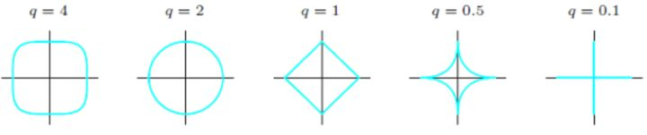

假设向量长度为3维，则有下列图形：

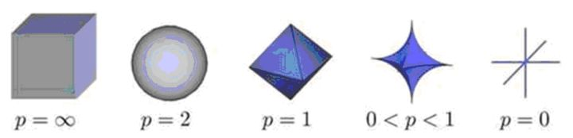

从上述各图可以看出：q(p)越小，曲线越贴近坐标轴，q(p)越大，曲线越远离坐标轴，并且棱角越明显，当q(p)取0时候，是完全和坐标轴贴合，当q(p)取∞时候，呈现正方体形状。同时也可以看出，采用不同的范数作为正则项，会得到完全不同的算法模型结果，故而对于不同要求的模型，应该采用不同的范数作为正则项。

可从带约束条件的优化求解和最大后验概率两种思路来推导L1、L2正则化，下面将予以详细分析。

## 正则化对应约束条件的最优化

对于模型权重系数w求解是通过最小化目标函数实现的，即求解：
$$
\begin{aligned}
\mathop{\text{min}}_w\ J(w;X,y)\\
s.t.\ ||w||_0\leq C
\end{aligned}
$$
L0范数表示向量中非零元素的个数。但由于该问题是一个NP问题，不易求解，为此我们需要稍微“放松”一下约束条件。为了达到近似效果，我们不严格要求某些权重w为0，而是要求权重应接近与0，即尽量小。从而可用L1、L2范数来近似L0范数，即：
$$
\begin{aligned}
\mathop{\text{min}}_w\ J(w;X,y)\\
s.t.\ ||w||_1\leq C
\end{aligned}
$$
或者
$$
\begin{aligned}
\mathop{\text{min}}_w\ J(w;X,y)\\
s.t.\ ||w||_2\leq C
\end{aligned}
$$
使用L2范数时，为方便后续处理，可对||w||_2进行平方，此时只需调整C的取值即可。利用拉格朗日算子法，我们可将上述带约束条件的最优化问题转换为不带约束项的优化问题，构造拉格朗日函数：
$$
\begin{aligned}
&L(w,\alpha)=J(w;X,y)+\alpha(||w||_1-C)\text{或}\\
&L(w,\alpha)=J(w;X,y)+\alpha(||w||_2^2-C)
\end{aligned}
$$
其中α>0，我们假设α的最优解为α*，则对拉格朗日函数求最小化等价于：
$$
\begin{aligned}
&\mathop{\text{min}}_w\ J(w;X,y)+\alpha^*||w||_1\text{或}\\
&\mathop{\text{min}}_w\ J(w;X,y)+\alpha^*||w||_2^2
\end{aligned}
$$
为什么上式可以把C省略掉呢？是因为之所以α没有求出最优解$α^*$之前不能省略C，是因为C是随着α变化的，但是当最优的$α^*$一旦知道，那么C就是不变的了，那C就是常数了，那自然就在最小化时可以省略了。

可以看出，上式与
$$
\tilde{J}(w;X,y)=J(w;X,y)+\alpha\Omega(w)
$$
等价。

因此，我们得到对L1、L2正则化的第一种理解：

- L1正则化等价于在原优化目标函数中增加约束条件
  $$
  ||w||_1\leq C   
  $$

- 正则化等价于在原优化目标函数中增加约束条件
  $$
  ||w||_2^2\leq C
  $$


下面将从直观分析和理论推导两个角度来说明L1、L2正则化的效果。

### L2正则化直观理解

考虑带约束条件的优化解释，对L2正则化为：
$$
\begin{aligned}
\mathop{\text{min}}_w\ J(w;X,y)\\
s.t.\ ||w||_2\leq C
\end{aligned}
$$
该问题的求解示意图如下所示：

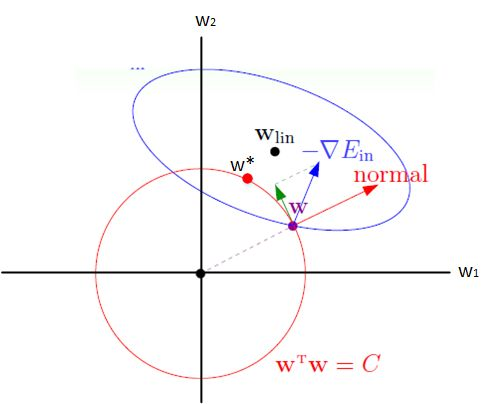

图中椭圆为原目标函数 J(w)的一条等高线，圆为半径$\sqrt{C}$的L2范数球。由于约束条件的限制，w必须位于L2范数球内。考虑边界上的一点w，图中蓝色箭头为J(w)在该处的梯度方向▽J(w)，红色箭头为L2范数球在该处的法线方向。由于w不能离开边界（否则违反约束条件），因而在使用梯度下降法更新w时，只能朝▽J(w)在范数球上w处的切线方向更新，即图中绿色箭头的方向。如此  将沿着边界移动，当▽J(w)与范数球上w处的法线平行时，此时▽J(w)在切线方向的分量为0，w将无法继续移动，从而达到最优解w*（图中红色点所示）。

上面所说的，其实就是不等式约束的优化，即KKT条件。我们还应当要注意到，就是这个约束中的C并不是个常数，而是变化的，最终是选择一个使得损失函数最小的C。

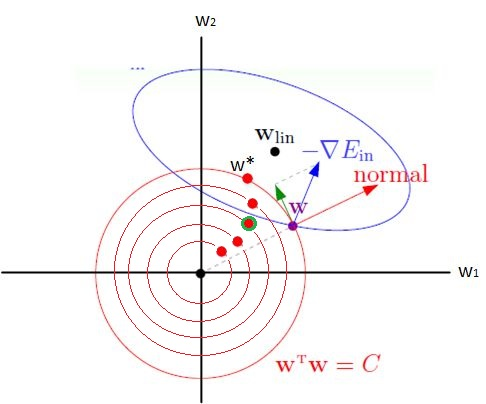

C是不断变化的，假设当C取上图中的绿点的位置时，整个损失函数能取到最小值。也就是C取下图所示的值：

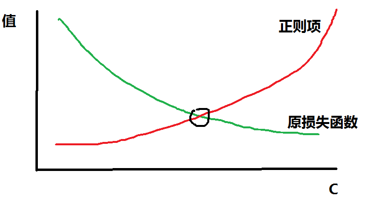

这个C的最终位置，其实还是取决于正则项的超参数λ。

### L1正则化直观理解

对于L1正则化：
$$
\begin{aligned}
\mathop{\text{min}}_w\ J(w;X,y)\\
s.t.\ ||w||_1\leq C
\end{aligned}
$$
同理，其求解示意图如下所示：

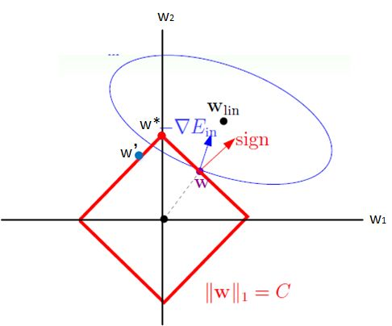

其主要差别在于L1、L2范数球的形状差异。由于此时每条边界上w的切线和法线方向保持不变，在图中w将一直朝着▽J(w)在切线方向的分量沿着边界向左上移动。当w跨过顶点到达w'时，▽J(w)在切线方向的分量变为右上方，因而w将朝右上方移动。最终，w将稳定在顶点处，达到最优解w*。此时，可以看到w1=0，这也就是采用L1范数会使产生稀疏性的原因。  

以上分析虽是基于二维的情况，但不难将其推广到多维情况，其主要目的是为了直观地说明L1、L2正则化最优解的差异，以及L1范数为什么为产生稀疏性。

同上面L2正则化一样，上面所说的，其实就是不等式约束的优化，即KKT条件。我们还应当要注意到，就是这个约束中的C并不是个常数，而是变化的，最终是选择一个使得损失函数最小的C。

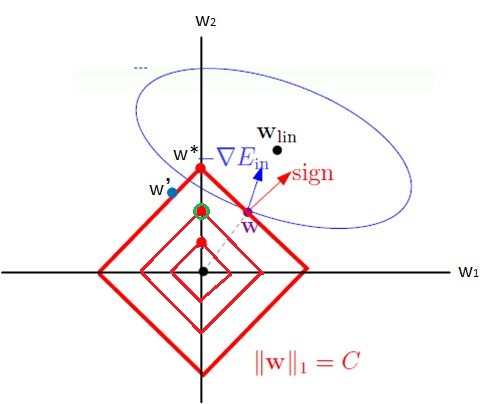

C是不断变化的，假设当C取上图中的绿点的位置时，整个损失函数能取到最小值。也就是C取下图所示的值：


这个C的最终位置，其实还是取决于正则项的超参数λ。

[从局部泰勒展开说说L1和L2正则化](https://zhuanlan.zhihu.com/p/26895929)

### L1与L2解的稀疏性

介绍完 L1 和 L2 正则化的物理解释和数学推导之后，我们再来看看它们解的分布性。

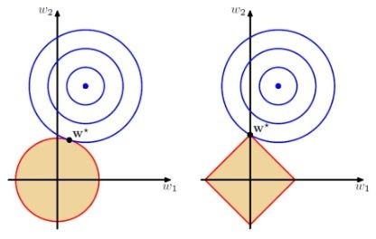

以二维情况讨论，上图左边是L2正则化，右边是L1正则化。从另一个方面来看，满足正则化条件，实际上是求解蓝色区域与黄色区域的交点，即同时满足限定条件和J(w)最小化。对于L2来说，限定区域是圆，这样，得到的解w1或w2为0的概率很小，很大概率是非零的。

对于L1来说，限定区域是正方形，方形与蓝色区域相交的交点是顶点的概率很大，这从视觉和常识上来看是很容易理解的。也就是说，方形的凸点会更接近J(w)最优解对应的$w^*$位置，而凸点处必有w1或w2为0。这样，得到的解w1或w2为零的概率就很大了。所以，L1正则化的解具有稀疏性。

扩展到高维，同样的道理，L2的限定区域是平滑的，与中心点等距；而L1的限定区域是包含凸点的，尖锐的。这些凸点更接近J(w)的最优解位置，而在这些凸点上，很多wj为0。

---

关于L1更容易得到稀疏解的原因，有一个很棒的解释，请见下面的链接：

我们可以想象一下L0问题：正则化项非0参数，优化这个直接等于求稀疏解。当然这是一个组合优化问题。

L1 norm是包含L0的最小凸区域，也就是说我们既可以用凸优化来求解，同时它也保持了一定程度L0的稀疏性质。即L1是L0的近似。

而L2 norm的正则化有closed form解，但是相对来说距离L0就更远了一些。

（L2正则化的解相当于先对数据做主成分分析，然后对最后的回归系数分解在数据的主成分上，然后各自缩小，其中对于小的回归系数采取比较大的惩罚值）

---

或者比较直观的解释为：

假设费用函数L与某个参数x的关系如图所示：

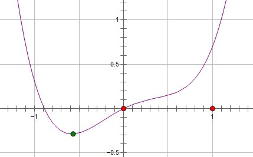

则最优的x在绿点处，x非零。

现在施加L2 regularization，新的费用函数（L+Cx^2）如图中蓝线所示：


最优的x在黄点处，x的绝对值减小了，但依然非零。 而如果施加L1 regularization，则新的费用函数（L+C|x|）如图中粉线所示：


最优的x就变成了0。这里利用的就是绝对值函数的尖峰。两种regularization能不能把最优的x变成0，取决于原先的费用函数在0点处的导数。
如果本来导数不为0，那么施加L2 regularization后导数依然不为0，最优的x也不会变成0。
而施加L1 regularization时，只要regularization项的系数C大于原先费用函数在0点处的导数的绝对值，x = 0就会变成一个极小值点。上面只分析了一个参数x。事实上L1 regularization会使得许多参数的最优值变成0，这样模型就稀疏了。

### 正则化参数 λ

正则化是结构风险最小化的一种策略实现，能够有效降低过拟合。损失函数实际上包含了两个方面：一个是训练样本误差。一个是正则化项。其中，参数 λ 起到了权衡的作用。

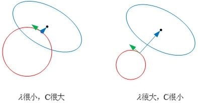

以L2为例，若λ很小，对应上文中的C值就很大。这时候，圆形区域很大，能够让w更接近J(w)最优解的位置。若λ近似为0，相当于圆形区域覆盖了最优解位置，这时候，正则化失效，容易造成过拟合。相反，若λ很大，对应上文中的C值就很小。这时候，圆形区域很小，w离J(w)最优解的位置较远。w被限制在一个很小的区域内变化，w普遍较小且接近0，起到了正则化的效果。但是，λ过大容易造成欠拟合。欠拟合和过拟合是两种对立的状态。

### L2正则化理论分析

PRML里的图虽然直观易懂但是却让人觉得缺乏实际的理论依据，最近看了[Deep Learning](www.deeplearningbook.org/)这本书发现里面L1和L2效果的推导十分有趣，结合自己的一些想法跟大家分享一下。

假设原目标函数 J(w)的最优解为$w^*$，并假设其为二阶可导，将J(w)在$w^*$处进行二阶泰勒展开有：
$$
\hat{J}(w)=J(w^*)+\frac{1}{2}(w-w^*)^TH(w-w^*)
$$
式中H为J(w)在$w^*$处的Hessian矩阵，注意$w^*$为J(w)的最优解，其一阶导数为0，因而式中无一阶导数项。$\hat{J}(w)$取得最小值时有：
$$
\bigtriangledown _w\hat{J}(w)=H(w-w^*)=0
$$
由于**L2正则化**的目标函数为在J(w)中添加
$$
\Omega(w)=\frac{1}{2}\alpha||w||_2^2=\frac{1}{2}\alpha w^Tw
$$
即
$$
\tilde{J}(w)=\tilde{J}(w)+\Omega(w)=J(w^*)+\frac{1}{2}(w-w^*)^TH(w-w^*)+\frac{1}{2}\alpha w^Tw
$$
，对上式求导，有：
$$
\bigtriangledown _w\tilde{J}(w)=\bigtriangledown _w\hat{J}(w)+\bigtriangledown _w\Omega(w)=H(w-w^*)+\alpha w
$$
设其最优解为$\tilde{w}$，则有：
$$
\begin{aligned}
H(\tilde{w}-w^*)+\alpha\tilde{w}=0\\
\tilde{w}=(H+\alpha I)^{-1}Hw^*
\end{aligned}
$$
由于H是对称矩阵，可对其做特征值分解，即
$$
H=Q\Lambda Q^T
$$
，其中Q为正交矩阵，且每一列为H的特征向量，带入上式有：
$$
\tilde{w}=(Q\Lambda Q^T+\alpha I)^{-1}Q\Lambda Q^Tw^*=[Q(\Lambda +\alpha I)Q^T]^{-1}Q\Lambda Q^Tw^*=Q(\Lambda+\alpha I)^{-1}\Lambda Q^T Hw^*
$$
∧为对角矩阵，且对角线元素为H的特征值λj。

w\*可在Q为正交基上作线性展开，由上式可知**$\tilde{w}$为w\*在H的每个特征向量上的分量以**
$$
\frac{\lambda_j}{\lambda_j+\alpha}
$$
**比例放缩得到**。若λj>>α，则$w_j^*$受正则化的影响较小；若λj<<α，则$w_j^*$受正则化的影响较大，将收缩到接近于0的值。同时，若$w_j^*\neq0$，则$\tilde{w}_j\neq0$，因而L2正则化不会产生稀疏性的效果。

也就是说：

L2正则化中，H的特征值较大的特征根对应的w分量受到的缩放较小，而特征值较小的特征根方向的w受到的缩放较大。对应到基于梯度的训练中来即，对整体函数减小贡献较大的w分量受到的scale较小，而那些很平缓的方向分量受到了较大的缩放。如图所示效果

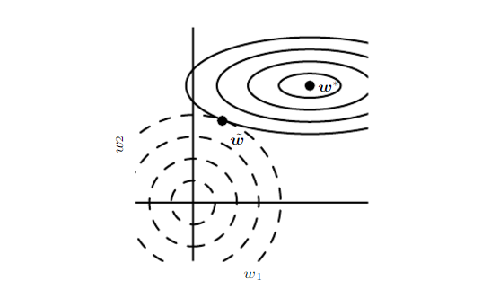

图中实线为未正则化的曲线，虚线圆为L2正则化的圆。$w^*$为原始的未正则化的极小值，$\hat{w}$为正则化后的极小值。可以看到因为在水平w1方向函数变化较缓慢(等值线稀疏)，所以w1方向值受缩放较大，而相应的w2方向则受缩放较小。

同时我们观察到如果H是正定的，那么如果w不为0则正则化后的$\hat{w}$也不会为零。所以得到我们的结论

**L2正则化会使w缩小，缩小的倍数与Hessian矩阵的特征值有关，但是不会使得w变为0**

多说一句：L2正则化是神经网络训练中最常使用的正则化手段，观察单一一步的梯度更新有：
$$
w\leftarrow=w-\epsilon(\alpha w+\bigtriangledown_wJ(w;X,y))=(1-\epsilon \alpha)w-\epsilon\bigtriangledown_wJ(w;X,y)
$$
即每一步先对w进行了一个缩放再进行原始的梯度更新，这就是我们在训练时常需要设置的**weight decay**。

### L1正则化理论分析

对于**L1的正则化**，只需将Ω(w)替换为w的L1范数，同理可以得到：
$$
\tilde{J}(w)=\tilde{J}(w)+\Omega(w)=J(w^*)+\frac{1}{2}(w-w^*)^TH(w-w^*)+\alpha ||w||_1
$$
对上式求导，有
$$
\bigtriangledown _w\tilde{J}(w)=\bigtriangledown _w\hat{J}(w)+\bigtriangledown _w\Omega(w)=H(w-w^*)+\alpha \ \text{sign}(w)
$$
其最优解满足：
$$
H(\tilde{w}-w^*)+\alpha\text{sign}(\tilde{w})=0
$$
这里我们没有L2正则化时那么方便的求解了，可以看到是和w的符号有关的。为了简化讨论，我们做出进一步假设：Hessian矩阵H是对角矩阵，即
$$
H=diag[H_{11},H_{22},...,H_{nn}]
$$
，Hjj>0。这意味着此时w的不同分量之间没有相关性，该假设可通过对输入特征进行预处理（例如使用PCA）得到，现在我们可以解上式了，此时$\tilde{w}$的解为：
$$
\tilde{w}_j=\text{sign}(w_j^*)\ \text{max}\left\{ |w_j^*|-\frac{\alpha}{H_{jj}} \ ,0\right\}
$$
我们很容易得出结果：

* 当
  $$
  |w^*_j|\leq\frac{\alpha}{H_{jj}}
  $$
  时，可知$\tilde{w}_j=0$，因而L1正则化会使最优解的某些元素为0，从而产生稀疏性；

* 当
  $$
  |w^*_j|>\frac{\alpha}{H_{jj}}
  $$
  时，$\tilde{w}_j\neq 0$，$\tilde{w}_j$会在原有最优解上朝着0的方向平移了一个常数值$\frac{\alpha}{H_{jj}}$。

这就是L1正则化的效果。

**L1正则化会使得一些w分量变为0，此时该分量对应的特征便不再有效了，造成的结果是特征空间的稀疏性。所以L1有的时候会被用来做特征选择。**

### 约束最优化观点总结

综上，

* L2是控制所有特征的权重，“简单的模型”，相当于在“复杂模型”的基础上人工地筛选掉一些特征，人工筛选的质量一般可比不上L1的自动筛选。

  L2正则化的效果是对原最优解的每一个元素进行不同比例的放缩；

* L1是舍弃掉一些不重要的特征。

  L1正则化则会使原最优解的元素产生不同的偏移，并使某些元素为0，从而产生稀疏性。

在传统线性模型中带L2正则化的线性回归通常叫做Ridge regression，而带L1正则化的则叫做LASSO。

一种通用的建议是，如果我们确定有的特征是冗余不必要的，要做特征选择，则使用L1正则化，否则一般用L2正则化。

## 贝叶斯观点：正则化对应模型先验概率

李航《统计学习方法》书中1.5节正则化与交叉验证中提到一句：

**从贝叶斯的角度来看，正则化项对应于模型的先验概率**

更详细的解释：

> **从贝叶斯的角度来看，正则化等价于对模型参数引入先验分布。**

### Linear Regression

我们先看下最原始的Linear Regression：

**Bayesian Regression and Graphical model**

The regression model:
$$
y = Xw + \epsilon
$$
can be see as the following model:
$$
p(y|X,w,\lambda)=N(Xw,\lambda)\ \ \ \ with \ \ p(\epsilon)=N(0,\lambda)
$$
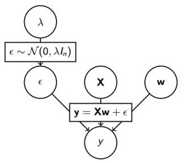
$$
\begin{aligned}
p(\epsilon^{(i)})&=\frac{1}{\sqrt{2\pi}\delta}exp\left( -\frac{(\epsilon^{(i)})^2}{2\sigma^2}\right)\\
\Rightarrow p(y^{(i)}|x^{(i)};\theta)&=\frac{1}{\sqrt{2\pi}\delta}exp\left( -\frac{(y^{(i)}-w^Tx^{(i)})^2}{2\sigma^2}\right)
\end{aligned}
$$
由最大似然估计(MLE)：
$$
\begin{aligned}
L(w)&=p(\vec{y}|X;w)\\
&=\prod_{i=1}^{m}p(y^{(i)}|x^{(i)};\theta)\\
&=\prod_{i=1}^{m}\frac{1}{\sqrt{2\pi}\delta}exp\left( -\frac{(y^{(i)}-w^Tx^{(i)})^2}{2\sigma^2}\right)
\end{aligned}
$$
取对数：
$$
\begin{aligned}
l(w)&=log\ L(w)\\
&=log\ \prod_{i=1}^{m}\frac{1}{\sqrt{2\pi}\delta}exp\left( -\frac{(y^{(i)}-w^Tx^{(i)})^2}{2\sigma^2}\right)\\
&=\sum^m_{i=1}log\ \frac{1}{\sqrt{2\pi}\delta}exp\left( -\frac{(y^{(i)}-w^Tx^{(i)})^2}{2\sigma^2}\right)\\
&=m\ log\ \frac{1}{\sqrt{2\pi}\sigma}-\frac{1}{\sigma^2}\cdot \frac{1}{2}\sum_{i=1}^m\left( y^{(i)}-w^Tx^{(i)} \right)^2
\end{aligned}
$$
求对数似然的最大值，即求下式的最小值，同时最大似然估计的w参数为：
$$
w_{MLE}=arg\ \mathop{min}_w\frac{1}{2}\sum_{i=1}^m\left( y^{(i)}-w^Tx^{(i)} \right)^2
$$
这就导出了我们原始的least-squares损失函数，但是，但是，这是在我们对参数w没有加入任何**先验分布**的情况下。在数据维度很高的情况下，我们的模型参数很多，模型复杂度高，容易发生过拟合。

比如我们经常说的“少数据样本点n，高数据维度p”。当数据维度p远大于样本点个数n的时候，不做任何其他假设或限制的话，学习问题基本上是没法进行的。因为如果用上所有维度的话，维度越大，通常会导致模型越复杂，但是反过来样本点又很少，于是就会出现很严重的overfitting问题。

**”数据样本点数目p>数据维度n“问题以及维度选择 **

- p$\approx$10000并且n<100。一个典型的“少数据样本点n，高数据维度p”问题(West et al. 2001)。

在这个时候，我们可以对参数w引入**先验分布**，降低模型复杂度。

### Ridge Regression

> **我们对参数w引入协方差为$\alpha$的零均值高斯先验。**

$$
\begin{aligned}
L(w)&=p(\vec{y}|X;w)p(w)\\
&=\prod_{i=1}^{m}p(y^{(i)}|x^{(i)};\theta)p(w)\\
&=\prod_{i=1}^{m}\frac{1}{\sqrt{2\pi}\delta}exp\left( -\frac{(y^{(i)}-w^Tx^{(i)})^2}{2\sigma^2}\right)\prod_{j=1}^{n}\frac{1}{\sqrt{2\pi\alpha}}exp\left( -\frac{(w^{(i)})^2}{2\alpha}\right)\\
&=\prod_{i=1}^{m}\frac{1}{\sqrt{2\pi}\delta}exp\left( -\frac{(y^{(i)}-w^Tx^{(i)})^2}{2\sigma^2}\right)\frac{1}{(\sqrt{2\pi\alpha})^n}exp\left( -\frac{w^Tw}{2\alpha}\right)\\
\end{aligned}
$$

取对数：
$$
\begin{aligned}
l(w)&=log L(w)\\
&=m\ log \frac{1}{\sqrt{2\pi}\delta} + n\ log\frac{1}{\sqrt{2\pi\alpha}}-\frac{1}{\sigma^2}\cdot \frac{1}{2}\sum_{i=1}^m(y^{(i)}-w^Tx^{(i)})^2-\frac{1}{\alpha}\cdot \frac{1}{2}w^Tw\\
\Rightarrow w_{MAP_{Guassian}}&=arg\  \mathop{min}_w\left( \frac{1}{\sigma^2}\cdot \frac{1}{2}\sum_{i=1}^m(y^{(i)}-w^Tx^{(i)})^2+\frac{1}{\alpha}\cdot \frac{1}{2}w^Tw \right)
\end{aligned}
$$
等价于：
$$
J_R(w)=\frac{1}{n}\left \| y-w^TX \right \|_2 + \lambda\left \|w  \right \|_2
$$
这不就是Ridge Regression吗？

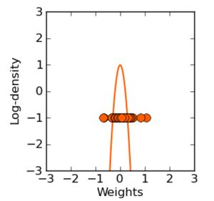

看我们得到的参数，在零附近是不是很密集，老实说，ridge regression并不具有产生**稀疏解**的能力，也就是说参数并不会真出现很多零。假设我们的预测结果与两个特征相关，L2正则倾向于综合两者的影响，给影响大的特征赋予**高的权重**；而L2正则倾向于选择影响较大的参数，而舍弃掉影响较小的那个。实际应用中L2正则表现往往会优于L1正则，但L2正则会大大降低我们的**计算量**。

> Typically ridge or ℓ2 penalties are **much better** for minimizing prediction error rather than ℓ1 penalties. The reason for this is that when two predictors are highly correlated, ℓ1 regularizer will simply pick one of the two predictors. In contrast, the ℓ2 regularizer will keep both of them and jointly shrink the corresponding coefficients a little bit. Thus, while the ℓ1 penalty can certainly reduce overfitting, you may also experience a loss in predictive power.

那现在我们知道了，对模型的参数引入零均值的**高斯先验**等价于L2正则化。

假设损失函数在二维上求解，则可以画出图像

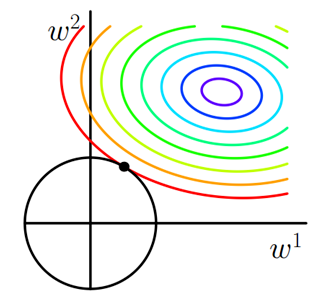

彩色实线是J0（不带罚函数的损失函数）的等值线，黑色实线是L2正则的等值线。二维空间（权重向量只有w1和w2）上，L2正则项的等值线是圆，与J0的等值线相交时w1或w2等于零的概率很小。所以**使用L2正则项的解不具有稀疏性**。在求解过程中，L2通常倾向让权值尽可能小，最后构造一个所有参数都比较小的模型。因为一般认为参数值小的模型比较简单，能适应不同的数据集，也在一定程度上避免了过拟合现象。参数足够小，数据偏移得多一点也不会对结果造成什么影响，可以说“抗扰动能力强”。

### Lasso Regression

上面我们对模型的参数w引入了高斯分布，那么**拉普拉斯分布**(Laplace distribution)呢？

注：LASSO是least absolute shrinkage and selection operator的简写。

**L1正则罚项（LASSO）等价于权重w的拉普拉斯先验**：
$$
w\sim C\text{ e}^{-\lambda|w|}
$$
我们看下拉普拉斯分布长啥样：
$$
f(x|\mu,b)=\frac{1}{2b}\text{exp}\left(-\frac{|x-\mu|}{b}\right)
$$
其中，其中，μ 是位置参数，b 是尺度参数。

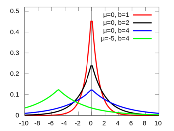

关于拉普拉斯和正态分布的渊源，大家可以参见正态分布的前世今生。
重复之前的推导过程我们很容易得到：
$$
w_{MAP_{Laplace}}=arg\  \mathop{min}_w\left( \frac{1}{\sigma^2}\cdot \frac{1}{2}\sum_{i=1}^m(y^{(i)}-w^Tx^{(i)})^2+\frac{1}{b}\left \| w \right \|_1 \right)
$$

> **我们对参数w引入尺度参数为b的零均值高斯先验。**

$$
\begin{aligned}
L(w)&=p(\vec{y}|X;w)p(w)\\
&=\prod_{i=1}^{m}p(y^{(i)}|x^{(i)};\theta)p(w)\\
&=\prod_{i=1}^{m}\frac{1}{\sqrt{2\pi}\delta}exp\left( -\frac{(y^{(i)}-w^Tx^{(i)})^2}{2\sigma^2}\right)\prod_{j=1}^{n}\frac{1}{2b}\text{exp}\left(-\frac{|w^{(j)}|}{b}\right)\\
&=\prod_{i=1}^{m}\frac{1}{\sqrt{2\pi}\delta}exp\left( -\frac{(y^{(i)}-w^Tx^{(i)})^2}{2\sigma^2}\right)\frac{1}{(2b)^n}\text{exp}\left(-\frac{\left \|w  \right \|_1}{b}\right)\\
\end{aligned}
$$

取对数：
$$
\begin{aligned}
l(w)&=log L(w)\\
&=m\ log \frac{1}{\sqrt{2\pi}\delta} + n\ log\frac{1}{2b}-\frac{1}{\sigma^2}\cdot \frac{1}{2}\sum_{i=1}^m(y^{(i)}-w^Tx^{(i)})^2-\frac{1}{b}\left \| w \right \|_1\\
\Rightarrow w_{MAP_{Laplace}}&=arg\  \mathop{min}_w\left( \frac{1}{\sigma^2}\cdot \frac{1}{2}\sum_{i=1}^m(y^{(i)}-w^Tx^{(i)})^2+\frac{1}{b}\left \| w \right \|_1 \right)
\end{aligned}
$$
等价于：
$$
J_R(w)=\frac{1}{n}\left \| y-w^TX \right \|_2 + \lambda\left \|w  \right \|_1
$$
这不就是Lasso Regression吗？

该问题通常被称为 LASSO (least absolute shrinkage and selection operator) 。LASSO 仍然是一个 convex optimization 问题，不具有解析解。它的优良性质是能产生**稀疏性**，导致 w 中许多项变成零。

> 再次总结下，对参数引入**拉普拉斯先验**等价于 L1正则化。

假设损失函数在二维上求解，则可以画出图像


彩色实线是J0（不带罚函数的损失函数）的等值线，黑色实线是L1正则的等值线。二维空间（权重向量只有w1和w2）上，L1正则项的等值线是方形，方形与J0的等值线相交时相交点为顶点的概率很大，所以w1或w2等于零的概率很大。所以**使用L1正则项的解具有稀疏性**。

推广到更大维度空间也是同样道理，L2正则项的等值线或等值面是比较平滑的，而L1正则项的等值线或等值面是比较尖锐的，所以这些突出的点与J0（不带罚函数的损失函数）接触的机会更大，而在这些突出的点上，会有很多权值等于0，所以，L1norm可以看成是L0norm的近似。

由L1正则化导出的稀疏性质已被广泛用于**特征选择**，特征选择可以从可用的特征子集中选择有意义的特征。

### Elastic Net Regression

可能有同学会想，既然L1和L2正则各自都有自己的优势，那我们能不能将他们结合起来？

可以，事实上，大牛早就这么玩过了。

**Elastic Net回归是权重w的综合先验**

同时将L1和L2正则作为罚项，等价于对权重w设置更综合的先验：
$$
w\sim C(\lambda,\alpha)\text{exp}^{-(\lambda|w|_1+\alpha|w|_2)}
$$
因为lasso在解决之前提到的“small n(样本), large p(特征) problem”存在一定缺陷。

> **The limitation of the lasso**
>
> - If p>n, the lasso selects at most n variables. The number of selected genes is bounded by the number of samples.
> - Grouped variables: the lasso fails to do grouped selection. It tends to select one variable from a group and ignore the others.

重复之前的推导过程我们很容易得到：
$$
\hat{\beta}=\text{arg }\mathop{\text{min}}_{\beta}||y-X\beta||_2+\lambda_2||\beta||_2+\lambda_1||\beta_1||_1
$$

- 罚项中的L1会产生一个稀疏模型
- 罚项中的L2
  - 解除了对所选变量的数目限制
  - 鼓励促进组效应（grouping effect）

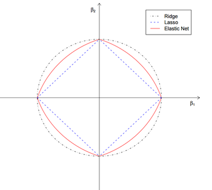

### 贝叶斯观点正则化总结

正则化参数等价于对参数引入**先验分布**，使得**模型复杂度**变小（缩小解空间），对于噪声以及异常值的鲁棒性（泛化能力）增强。整个最优化问题从贝叶斯观点来看是一种贝叶斯最大后验估计，其中正则化项对应后验估计中的**先验信息**，损失函数对应后验估计中的似然函数，两者的乘积即对应贝叶斯最大后验估计的形式。

这篇文章[《Lazy Sparse Stochastic Gradient Descent for Regularized Mutlinomial Logistic Regression》](http://citeseerx.ist.psu.edu/viewdoc/download;jsessionid=BFEF7AF6F95524A8DD0B8BBA565D4EDD?doi=10.1.1.177.3514&rep=rep1&type=pdf)还讲了线性回归正则化和数据先验分布的关系的理论推导到算法实现，除了高斯先验、拉普拉斯鲜艳，还讲了其他先验。

## 正则化技术总结

本文从各个角度深入的分析了机器学习算法中使用到的正则化技术，正则化技术是机器学习和深度学习中非常重要的内容，不管是在面试、笔试还是实际应用中都至关重要，通过本文您应该知道以下重要结论：

- **正则化的作用是防止过拟合、提高模型泛化能力**
- **正则化等价于结构风险最小化**
- **正则化等价于带约束的目标函数中的约束项**
- **正则项等价于引入参数的模型先验概率**
- **在误差符合均值为0的高斯分布，则最大似然估计和最小二乘法等价**
- **最大后验估计就是在最大似然估计函数上面乘上了一项先验分布而已**
- **L2范数相当于给模型参数θ设置一个零均值高斯先验分布，L1范数相当于给模型参数θ设置一个拉普拉斯先验分布**
- **L0和L1正则可以得到稀疏解，而L2不能，并且参数优化速度L1快于L2，但是L2更容易理解，计算更方便。**

# 维数灾难

当数据的维度很高时，很多机器学习的问题变得相当困难。这种现象被称为维数灾难。

维度增多会使得x的可能分布位置数目远大于训练样本的数目。

为了充分理解这个问题，假设空间被分成网格。

低维时，用少量划分的网格就可以描述这个空间。当泛化到新数据点时，可通过检测与这个新数据点在相同网格中的训练样本，来判断如何处理新数据点。

但是，如果该网格中没有样本，是不是就傻眼了？在高维空间中，**参数的分布位置数目远大于样本数目，大部分分布位置是没有样本的**。

那如何预测新的分布位置的输出呢？很多传统的机器学习算法仅仅假设新的位置点的输出应约等于最邻近的样本点的输出。

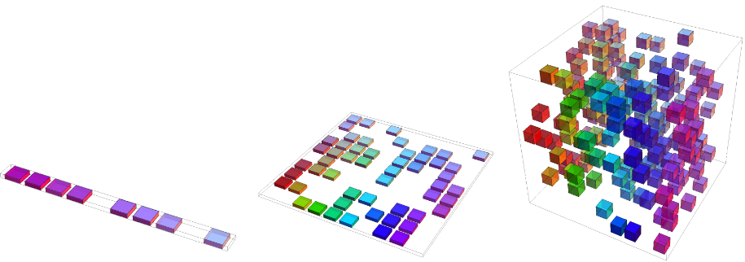

比如每个维度分成十份，一共十个训练数据点，一维的情况下，十个训练数据最多可以占据十个网格，即100%的覆盖率，而在二维空间，十个数据最多占据10%的网格(10/10^2=10%)，即10%的覆盖率，在三维空间，十个数据最多占据1%的网格(10/10^3=1%)，即1%的覆盖率。即随着维度的增加，样本的可能分布位置远大于样本数目。

------


对于大多数数据，在一维空间或者说是低维空间都是很难完全分割的，但是在高纬空间间往往可以找到一个超平面，将其完美分割。

引用[The Curse of Dimensionality in Classification](http://www.visiondummy.com/2014/04/curse-dimensionality-affect-classification/)的例子来说明：

想象下我们有一系列图片，每张图描述的不是猫就是狗。现在我们想利用这些图片来做一个可以判断猫狗的分类器。首先，我们需要找到一些描述猫狗特征，利用这些特征，分类器能够识别猫狗。比如可以通过颜色来区分它们，一种分类方法是将红、绿、蓝三种颜色作为识别特征。以简单的线性分类器为例，将这三种特征结合起来的分类算法为：

```python
If 0.5*red + 0.3*green + 0.2*blue > 0.6 : 
	return cat;
else 
	return dog;
```

然而，将这三种颜色作为特征来区分猫狗明显是不够的。为此，我们决定增加一些特征，比如x、y轴方向上的梯度dx、dy，那么现在就有5个特征了。

为了得到更精确的分类器，基于颜色和、纹理、统计动差等，我们还需要更多的特征。通过将特征增加到好几百，我们能得到一个完美的分类器吗？回答可能会出乎你们的意料：不能！事实上，过了某个临界点，如果还持续的增加特征，那么分类器的性能会下降。看图1，这就是我们经常说的“**维度灾难(curse of dimension)**”。

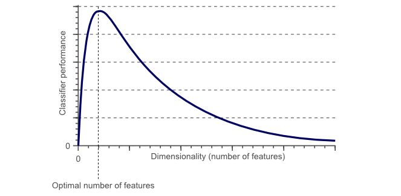

维度灾难和过拟合的关系：

假设在地球上有无数只猫和狗，但由于种种原因，我们总共只有10张描述猫狗的图片。我们的最终目的是利用这10张图片训练出一个很牛的分类器，它能准确的识别我们没见过的各种无数的猫、狗。

如果只使用一维特征，例如红色进行训练，在一维特征轴上展开

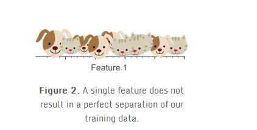

我们可以发现，分类效果并不好，因此我们准备再加入一个图像平均绿色的特征。

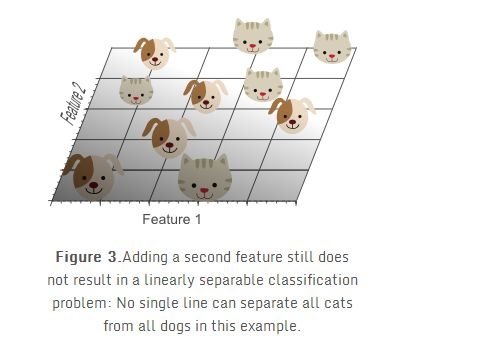

在红绿构成的二维特征空间中，我们发现还是没法找到一条线将他们分开。我们准备再加一个特征，把空间拓展到3维。

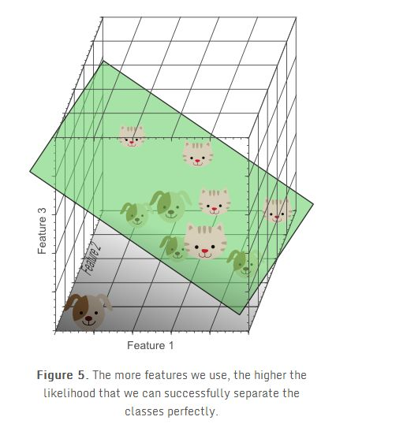

终于我们找到了一个平面可以将10个样本完美的分开。
从这个例子我们好像可以看出，分类器的效果随着特征维度的增加变得更好了，我们应该不停的增加特征维度直到分类器获得最好的结果为止，但是我们在上文论述过，从图1可以看出，实际上这是有问题的。

在1特征空间为1维时（如图2），10个训练实例覆盖在一维轴上，假设轴长为5，那么每个样本平均每个单位有2个样本。特征空间为2维时（如图3），我们仍然用10个实例进行训练，此时二维空间的面积是5x5=25，样本密度是10/25=0.4，即每个单位面积有0.4个样本。在特征空间为3维时，10个样本的密度是10/(5x5x5)=0.08，即每个单位体积有0.08个样本。

如果我们不断的增加特征，特征维度就会不断变大，同时变得越来越稀疏。**由于稀疏的原因，随着特征维度的不断变大，我们很容易的就找到一个能将样本按类别完美分开的超平面**，因为训练样本落到该空间的最优超平面错误一边的概率会随着维度增加无限变小。然而，如果将高维分类映射回低维，我们能很容易发现一个严重的问题：


使用太多的特征导致了过拟合。分类器学习了很多异常特征（如噪声等），因此对于新的数据泛化性能不好。

上图展示了3D分类结果投影到2D空间中的情景，我们可以看不像高维空间中，在低维空间中，数据并没有显示出可分性。而实际上，通过增加第三维度来获得最优分类效果等价于在低维空间使用复杂的非线性分类器，而往往复杂的模型结构也是导致过拟合的原因之一。结果就是分类器学习到了很多数据集中的特例，因此对于现实数据往往会效果较差，因为现实数据是没有这些噪声以及异常特性的。
因此说，**过拟合是维度灾难带来的最直接结果**。

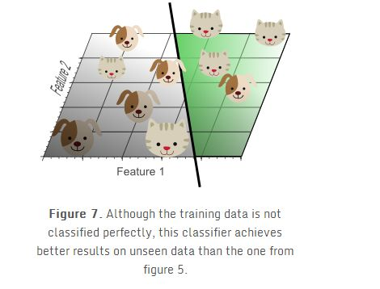

展示了使用2个特征的线性分类器的训练结果，尽管这个分类边界看起来不如图5中的分类器，但是简单的分类器对于未知的数据具有更好的泛化性能，因为其不会学习到训练集中偶然出现的特例。换句话说，维度灾难可以通过使用更少的特征来避免，同时这样分类器就不会对训练数据过拟合。

下面从另一个角度来阐述，我们假设每个特征的范围是从0-1，同时每个猫和狗都具有不同的特征。如果我们想使用全数据的20%的数据来训练模型，那么在一维的情况下，我们的特征范围只需要取20%的范围，也就是0.2就够了。当上升到2维的情况下，我们需要45%的每维特征（0.45*0.45=0.2）才可以覆盖特征空间中的20%，当上升到3维空间时，我们则需要每维58%的特征范围（0.58^3 = 0.2）。

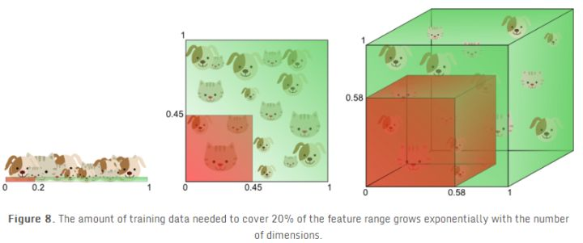

换句话说，如果特征数目一定，那么随着维度增加过拟合就会出现。另一方面，如果持续增加维度，那么训练数据需要指数级的增加才能保持同样的距离分布来避免过拟合。

举个例子：例如在一维空间中，样本密度是1000个/单位，那么我们在任意测试样本0.001的单位距离都可以找到一个样本。但是如果到2维空间，那么我们需要1000^2个样本才能保证，任意样本的0.001单位距离内都有一个样本。

换个角度来看，如果我们吧100个点丢到0-1的区间内，并且吧0-1分成每个0.1一共10个区间，那么极有可能每个区间都会有点存在，但是如果还是100个点丢到2维空间内，那么边长为0.1的单位单元就有100个，几乎不可能每个单元都有一个点。当拓展到3维就有1000个单元。所以当在更高维的空间内，数据会变得非常系数，会丢失在高维空间内。这就是数据的稀疏性。

 在上面的例子中，我们通过演示数据的稀疏性展示了维数灾难，即：在分类中我们使用的特征数量越多，那么由于高维下数据的稀疏性我们不得不需要更多的训练数据来对分类器的参数进行估计(高维数下分类器参数的估计将变得更加困难)。维数灾难造成的另外一个影响是：数据的稀疏性致使数据的分布在空间上不同(实际上，数据在高维空间的中心比在边缘区域具备更大的稀疏性，**数据更倾向于分布在空间的边缘区域**)。举个栗子更好理解：

假设一个二维的单位正方形代表了2维空间，特征的平均值作为特征空间的中点，所有距离特征空间单位距离内的点都在一个特征空间的内接圆内，而在内接圆外的点则分布在空间的角落，他们相对来说更难被区分，因为他们的特征差距很大(不同角落的样本如果同类别会很难区分)。因此单位圆内的样本越多，那么分类任务就越简单：

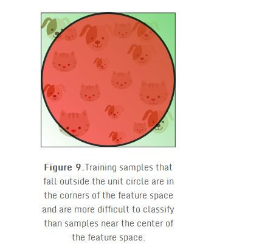

在这里一个有趣的问题就是随着维度的增长，超球体所占的空间和超立方体的空间的相对比例是如何变化的。超立方体的体积在维度d的情况下永远是1^d=1，超球题的体积在半径为0.5的情况下可以由以下公式计算：
$$
V(d)=\frac{\pi^{d/2}}{\Gamma(d/2+1)}0.5^d
$$
其体积-维度图画出来大概是这样的：

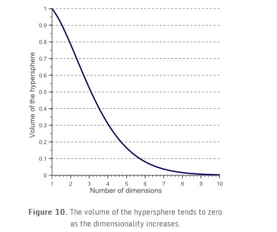

我们可以明显的发现，当维度不断增大，内接球的体积会趋于0，而超立方体的体积还是1，这种反直觉的发现解释了分类器维度灾难的相关问题：在高维空间中，大部分训练数据都位于定义的特征空间立方体的拐角处。正如前面提到的，样例在拐角处比样例在内接球体内是更难分类的，下图更明显的展示了这一点：

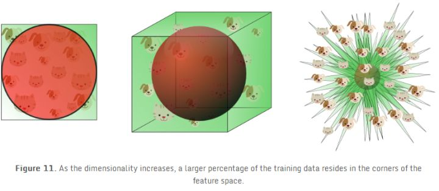

对于8维的超立方体，大概有98%的数据位于它的256个拐角处。当维度趋近于无穷大时，样本点到中心点的欧式距离的最大值和最小值的差值与最小值的比例趋近于0：
$$
lim_{d\rightarrow \infty}\frac{dist_{max}-dist_{min}}{dist_{min}}\rightarrow0
$$
因此，在某种意义上，几乎所有的高维空间都远离其中心，**或者从另一个角度来看，高维单元空间可以说是几乎完全由超立方体的“边角”所组成的，没有“中部”**，这对于理解卡方分布是很重要的直觉理解。 给定一个单一分布，由于其最小值和最大值与最小值相比收敛于0，因此，其最小值和最大值的距离变得不可辨别。 

因此，在高维空间用距离来衡量样本相似性的方法已经渐渐失效。所以以距离为标准的分类算法（欧氏距离，曼哈顿距离，马氏距离）在低维空间会有更好的表现。类似的，高斯分布在高维空间会变得更加平坦，而且尾巴也会更长。

对于使用距离测度的机器学习算法的影响：

由于维度灾难的影响，正如前面所说的在高维空间中，欧式距离的测度会失去意义，当维度趋于无穷时，数据集中任意两点的距离会趋向收敛，意思是任意两点的最大距离和最小距离会变为相同。

因此基于欧式距离的k-means算法，会无法进行聚类（因为距离会趋于收敛）。而K-NN会的临近K个点中，会出现更多非同类的点（远多于低维度的情况）。

参考网页：
[Curse of dimensionality](https://en.wikipedia.org/wiki/Curse_of_dimensionality)
[The Curse of Dimensionality in Classification](http://www.visiondummy.com/2014/04/curse-dimensionality-affect-classification/)

# 机器学习模型分类

注意：没有把神经网络体系加进来。因为NNs的范式很灵活，不太适用这套分法。

------

**一、监督**

- **分类算法(线性和非线性)**

  - 感知机

  - KNN

  - 概率

    - 朴素贝叶斯（NB）
    - Logistic Regression（LR）
    - 最大熵MEM（与LR同属于对数线性分类模型）

  - 支持向量机(SVM)

  - 决策树(ID3、CART、C4.5)

  - assembly learning

    - Boosting

      - Gradient Boosting

        - GBDT

        - xgboost

          传统GBDT以CART作为基分类器，xgboost还支持线性分类器，这个时候xgboost相当于带L1和L2正则化项的逻辑斯蒂回归（分类问题）或者线性回归（回归问题）；

          xgboost是Gradient Boosting的一种高效系统实现，并不是一种单一算法。

      - AdaBoost

    - Bagging

      - 随机森林

    - Stacking


- ……


- 概率图模型
  - HMM
  - MEMM（最大熵马尔科夫）
  - CRF
  - ……
- 回归预测
  - 线性回归
  - 树回归
  - Ridge岭回归
  - Lasso回归
  - ……
- ……  

------

**二、非监督**

- 聚类
  - 基础聚类
    - K-mean
    - 二分k-mean
    - K中值聚类
    - GMM聚类


- 层次聚类
- 密度聚类
- 谱聚类
- 主题模型
  - pLSA
  - LDA隐含狄利克雷分析
- 关联分析
  - Apriori算法
  - FP-growth算法
- 降维
  - PCA算法
  - SVD算法
  - LDA线性判别分析
  - LLE局部线性嵌入
- 异常检测：
- ……

------

**三、半监督学习**

------

**四、迁移学习**


# 参考资料

- [如何用简单易懂的例子解释条件随机场（CRF）模型？它和HMM有什么区别？](https://www.zhihu.com/question/35866596/answer/236886066)

"机器学习模型分类"一节参照了此知乎回答。

- [史上最全面的正则化技术总结与分析--part1](https://zhuanlan.zhihu.com/p/35429054)


- [史上最全面的正则化技术总结与分析--part2](https://zhuanlan.zhihu.com/p/35432128)
- [深入理解L1、L2正则化](https://zhuanlan.zhihu.com/p/29360425)

* [l1 相比于 l2 为什么容易获得稀疏解？](https://www.zhihu.com/question/37096933/answer/70507353)
* [机器学习中 L1 和 L2 正则化的直观解释](https://zhuanlan.zhihu.com/p/38309692)
* [从局部泰勒展开说说L1和L2正则化](https://zhuanlan.zhihu.com/p/26895929)

"正则化"一节参考了此知乎专栏和回答。

- [LR正则化与数据先验分布的关系？](https://www.zhihu.com/question/23536142/answer/90135994)

“贝叶斯观点：正则化对应模型先验概率”一节参考了此知乎回答。

- [维度灾难](https://zhuanlan.zhihu.com/p/27488363)

"维数灾难"一节参考了此知乎专栏。