# 支持向量机

* [返回顶层目录](../../SUMMARY.md)

* [线性可分支持向量机与硬间隔最大化](#线性可分支持向量机与硬间隔最大化)
  * [线性可分支持向量机](#线性可分支持向量机)
  * [函数间隔和几何间隔](#函数间隔和几何间隔)
  * [间隔最大化](#间隔最大化)
    * [最大间隔分离超平面](#最大间隔分离超平面)
    * [最大间隔分离超平面的存在唯一性](#最大间隔分离超平面的存在唯一性)
    * [支持向量和间隔边界](#支持向量和间隔边界)
  * [线性可分支持向量机学习的对偶算法](#线性可分支持向量机学习的对偶算法)
    * [对偶优化问题](#对偶优化问题)
    * [根据KKT条件由对偶优化的解α求原始优化问题的解w和b](#根据KKT条件由对偶优化的解α求原始优化问题的解w和b)
    * [线性可分支持向量机学习算法](#线性可分支持向量机学习算法)
    * [线性可分数据集的支持向量](#线性可分数据集的支持向量)
* [线性支持向量机与软间隔最大化](#线性支持向量机与软间隔最大化)
  * [线性支持向量机](#线性支持向量机)
  * [线性支持向量机学习的对偶算法](#线性支持向量机学习的对偶算法)
  * [支持向量](#支持向量)
  * [合页损失函数](#合页损失函数)
* [非线性支持向量机与核函数](#线性支持向量机与软间隔最大化)
  * [核技巧](#核技巧)
    * [非线性分类问题](#非线性分类问题)
    * [核函数的定义](#核函数的定义)
    * [对核函数的理解](#对核函数的理解)
    * [核技巧在支持向量空间中的应用](核技巧在支持向量空间中的应用)
  * [（正定）核函数有效性判定](#（正定）核函数有效性判定)
  * [常用核函数](#常用核函数)
    * [核函数的选取](#核函数的选取)
  * [非线性支持向量分类机](#非线性支持向量分类机)
* [序列最小最优化算法SMO](#线性支持向量机与软间隔最大化)
  * [两个变量二次规划的求解方法](#两个变量二次规划的求解方法)
  * [变量的选择方法](#变量的选择方法)
  * [SMO算法](#SMO算法)

支持向量机（support vector machines，SVM）是一种二类分类模型。它的基本模型是定义**在特征空间上的间隔最大的线性分类器**，间隔最大使它有别于感知机；支持向量机还包括核技巧，这使它成为实质上的非线性分类器。支持向量机的**学习策略就是间隔最大化**，可形式化为一个求解凸二次规划（convex quadratic programming）的问题，也等价于正则化的合页损失函数的最小化问题。支持向量机的学习算法是求解凸二次规划的最优化算法。

支持向量机学习方法包含构建由简至繁的模型：线性可分支持向量机（ linear support vector machine in linearly separable case )、线性支持向量机（ linear support vector machine)及非线性支持向量机（non-linear support vector machine)。简单模型是复杂模型的基础，也是复杂模型的特殊情况。当训练数据线性可分时，通过硬间隔最大化（ hard margin maximization)，学习一个线性的分类器，即线性可分支持向量机，又称为硬间隔支持向量机；当训练数据近似线性可分时，通过软间隔最大化（ soft margin maximization)，也学习一个线性的分类器，即线性支持向量机，又称为软间隔支持向量机；当训练数据线性不可分时，通过使用核技巧（kemel trick）及软间隔最大化，学习非线性支持向量机。

当输入空间为欧氏空间或离散集合、特征空间为希尔伯特空间时，核函数（kernel function）表示将输入从输入空间映射到特征空间得到的特征向量之间的内积。**通过使用核函数可以学习非线性支持向量机，等价于隐式地在高维的特征空间中学习线性支持向量机**。这样的方法称为核技巧。核方法（ kernel method)是比支持向量机更为一般的机器学习方法。

Cortes与Vapnik提出线性支持向童机，Boser、Guyon与Vapnik又引入核技巧，提出非线性支持向量机。

本章按照上述思路介绍3类支持向量机、核函数及一种快速学习算法——序列最小最优化算法（SMO)。

# 线性可分支持向量机与硬间隔最大化

## 线性可分支持向量机

考虑一个二分类问题，假设输入空间与特征空间为两个不同的空间。**输入空间**为欧式空间或离散集合，**特征空间**为欧式空间或希尔伯特空间。

线性可分支持向量机、线性支持向量机假设这两个空间的元素一一对应，并将**输入空间中的输入映射为特征空间中的特征向量**。非线性支持向量机利用一个从输入空间到特征空间的非线性映射，将输入映射为特征向量，使得在特征空间中能够使用线性支持向量机来学习。所以，**输入都由输入空间转换到特征空间，支持向量机的学习是在特征空间上进行的**。

假设给定一个特征空间上的训练数据集
$$
T=\{ (x_1,y_1),(x_2,y_2),...,(x_N,y_N) \}
$$
其中，xi∈X=R^n，yi∈Y=\{+1,-1\}，i=1,2,...,N，xi为第i个特征向量，也称为实例，yi为xi的类标记，当yi=+1时，称xi为正例；当yi=-1时，称xi为负例，(xi,yi)称为样本点。再假设训练数据集是线性可分的。

学习的目标是在特征空间中找到一个分离超平面，能将实例分到不同的类。分离超平面对应于方程w·x+b=0，它由法向量w和截距b决定，可用(w,b)来表示。分离超平面将特征空间划分为两部分，一部分是正类，一部分是负类。法向量指向的一侧为正类，另一侧为负类。

一般地，当训练数据集线性可分时，存在无穷个分离超平面可将两类数据正确分开。感知机利用误分类最小的策略，求得分离超平面，不过这时的解有无穷多个。线性可分支持向量机利用间隔最大化求最优分离超平面，这时，解是唯一的。

**线性可分支持向量机的定义：**

给定线性可分训练数据集，通过间隔最大化或等价地求解相应的凸二次规划问题学习得到的分离超平面为
$$
w^*\cdot x+b^*=0
$$
以及相应的分类决策函数
$$
f(x)=\text{sign}(w^*\cdot x+b^*)
$$
称为线性可分支持向量机。

考虑如下图所示的二维特征空间中的分类问题。图中的“。”表示正例，“x”表示负例。训练数据集线性可分，这时有许多直线能将两类数据正确划分。线性可分支持向量机对应将两类数据正确划分并且间隔最大的直线，如下图所示。

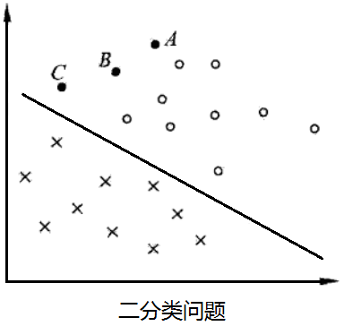

J间隔最大及相应的约束最优化问题将在下面叙述。这里先介绍函数间隔和集合间隔的概念。

## 函数间隔和几何间隔

在上图中，有A,B,C三个点，表示三个实例，均在分离超平面的正类一侧，预测他们的类。点A距分离超平面较远，若预测该点为正类，就比较确信预测是正确的；点C距分离超平面较近，若预测该点为正类就不那么确信；点B介于点A与C之间，预测其为正类的确信度也在A与C之间。

一般来说，**一个点距离分离超平面的远近可以表示分类预测的确信程度**。在超平面w·x+b=0确定的情况下，|w·x+b|能够相对地表示点x距离超平面的远近。而w·x+b的符号与类标记y的符号是否一致能够表示分类是否正确。所以可用量**y(vv·x+b)来表示分类的正确性及确信度**，这就是**函数间隔**（functional margin)的概念。

**函数间隔的定义**

对于给定的训练数据集T和超平面(w,b)，定义超平面(w,b)关于样本点(x,y)的函数间隔为
$$
\hat{\gamma}_i=y_i(w\cdot x_i+b)
$$
定义超平面关于训练数据集T的函数间隔为超平面(w,b)关于T中所有样本点(xi,yi)的函数间隔之最小值，即
$$
\hat{\gamma}=\mathop{\text{min}}_{i=1,...,N}\hat{\gamma}_i
$$
函数间隔可以表示分类预测的正确性及确信度。但是选择分离超平面时，只有函数间隔还不够。因为只要成比例地改变w和b，例如将它们改为2w和2b，超平面并没有改变，但函数间隔却成为原来的2倍。这一事实启示我们，可以对分离超平面的法向量w加某些束，如规范化，||w|| = 1，使得间隔是确定的。这时函数间隔成为几何间隔（geometric margin)。

下图给出了超平面(w,b)及其法向量w。点A表示某一实例其类标记为yi=+1。点A与超平面(w,b)的距离由线段AB给出，记作γi
$$
\gamma_i=\frac{w}{||w||}\cdot x_i+\frac{b}{||w||}
$$
其中，||w||为w的L2范数。这是点A在超平面正的一侧的情形。如果点Z在超平面负的一侧，即yi=-1，那么点与超平面的距离为
$$
\gamma_i=-\left(\frac{w}{||w||}\cdot x_i+\frac{b}{||w||}\right)
$$
一般地，当样本点(xi,yi)被超平面(w,b)正确分类时，点xi与超平面(w,b)的距离是
$$
\gamma_i=y_i\left(\frac{w}{||w||}\cdot x_i+\frac{b}{||w||}\right)
$$
由这一事实导出几何间隔的概念。

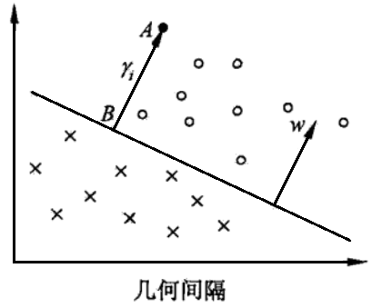

**几何间隔的定义：**

对于给定的训练数据集T和超平面(w,b)，定义超平面(w,b)关于样本点(xi,yi)的几何间隔为
$$
\gamma_i=y_i\left(\frac{w}{||w||}\cdot x_i+\frac{b}{||w||}\right)
$$
定义超平面(w,b)关于训练数据集T的几何间隔为超平面(w,b)关于T所有样本点(xi,yi)的几何间隔之最小值，即
$$
\gamma=\mathop{\text{min}}_{i=1,...,N}\gamma_i
$$
超平面(w,b)关于样本点(xi,yi)的几何间隔一般是实例点到超平面的带符号的距离（signed distance），当样本点被超平面正确分类时就是实例点到超平面的距离。

从函数间隔和几何间隔的定义可知，函数间隔和几何间隔有下面的关系：
$$
\begin{aligned}
\gamma_i&=\frac{\hat{\gamma}_i}{||w||}\\
\gamma&=\frac{\hat{\gamma}}{||w||}\\
\end{aligned}
$$
如果||w||=1，那么函数间隔和几何间隔相等。如果超平面参数w和b成比例地改变（超平面没有改变），函数间隔也按此比例改变，而几何间隔不变。

## 间隔最大化

支持向量机学习的基本想法是**求解能够正确划分训练数据集并且几何间隔最大的分离超平面**。对线性可分的训练数据集而言，线性可分分离超平面有无穷多个（等价于感知机)，但是几何间隔最大的分离超平面是**唯一**的。这里的间隔最大化又称为硬间隔最大化（与将要讨论的训练数据集近似线性可分时的软间隔最大化相对应)。

间隔最大化的直观解释是：对训练数据集找到几何间隔最大的超平面意味着**以充分大的确信度对训练数据进行分类**。也就是说，不仅将正负实例点分开，而且**对最难分的实例点（离超平面最近的点）也有足够大的确信度将它们分开**。这样的超平面应该**对未知的新实例有很好的分类预测能力**。

### 最大间隔分离超平面

下面考虑如何求得一个几何间隔最大的分离超平面，即最大间隔分离超平面。具体地，这个问题可以表示为下面的约束最优化问题：
$$
\begin{aligned}
&\mathop{\text{max}}_{w,b}\quad \gamma\\
&\text{s.t.}\quad y_i\left(\frac{w}{||w||}\cdot x_i+\frac{b}{||w||}\right)\geqslant \gamma,\ i=1,2,...,N\\
\end{aligned}
$$
即我们希望最大化超平面(w,b)关于训练数据集的几何间隔γ，约束条件表示的是超平面(w,b)关于每个训练样本点的几何间隔至少是γ。

考虑几何间隔和函数间隔的关系式，可将这个问题改写为
$$
\begin{aligned}
&\mathop{\text{max}}_{w,b}\quad \frac{\hat{\gamma}}{||w||}\\
&\text{s.t.}\quad y_i\left(w\cdot x_i+b\right)\geqslant \hat{\gamma},\ i=1,2,...,N\\
\end{aligned}
$$
函数间隔$\hat{\gamma}$的取值并不影响最优化问题的解。事实上，假设将w和b按比例改变为λw和λb，这时函数间隔为λ$\hat{\gamma}$。函数间隔的这一改变对上面最优化问题的不等式约束没有影响，对目标函数的优化也没有影响，也就是说，它产生一个等价的最优化问题。这样，就可以取函数间隔$\hat{\gamma}$=1。

怎么理解上段中说的将函数间隔$\hat{\gamma}$取为1不影响最优化呢？你可以这样想，现在令函数间隔为1，而且为了满足约束条件，即每个点到直线w·x+b=0的函数间隔都要大于$\hat{\gamma}$，则w要足够大才行，对吧？因为w增大λ倍，函数间隔$\hat{\gamma}$也会增大λ倍。但是，优化目标又是求最大值，但w正好是处于分母位置，所以w的值就要尽可能的小才行，但是过小了，就又不满足约束条件了。当然你取函数间隔为2也行，但同时你的w就也要增大两倍才能满足约束，这样的话，对于目标条件，上下同时增大两倍，那还是没变。所以，函数间隔$\hat{\gamma}$可以取任意值，但是为了方便就取了1。这下理解了吧？

将$\hat{\gamma}$=1带入上面的最优化问题，注意到最大化
$$
\frac{1}{||w||}
$$
和最小化
$$
\frac{1}{2}||w||^2
$$
是等价的，于是就得到下面的线性可分支持向量机学习的最优化问题
$$
\begin{aligned}
&\mathop{\text{max}}_{w,b}\quad \frac{1}{2}||w||^2\\
&\text{s.t.}\quad y_i\left(w\cdot x_i+b\right)-1\geqslant 0,\ i=1,2,...,N\\
\end{aligned}
$$
这是一个凸二次规划问题。

凸优化是指约束优化问题
$$
\begin{aligned}
&\mathop{\text{min}}_{w}\quad f(w)&\\
&\text{s.t.}\ \quad g_i(w)\leqslant 0,\ i=1,2,...,k\\
&\ \ \quad \quad h_i(w)=0,\ i=1,2,...,l\\
\end{aligned}
$$
其中，目标函数f(w)和约束函数gi(x)都是R^n上的连续可微的凸函数，约束函数hi(w)是R^n上的仿射函数。

当目标函数f(w)是二次函数且约束函数gi(w)是仿射函数时，上述凸最优化问题成了凸二次规划问题。

如果求出了约束最优化问题的解w\*，b\*，那么就可以得到最大间隔分离超平面w\*x+b\*=0及分类决策函数f(x)=sign(w\*x+b\*)，即线性可分支持向量机模型。

综上所述，就有下面的线性可分支持向量机的学习算法——最大间隔法（maximum margin method）。

**线性可分支持向量机学习算法：最大间隔法**

输入：线性可分训练数据
$$
T=\{ (x_1,y_1),(x_2,y_2),...,(x_N,y_N) \}
$$
其中，xi∈X=R^n，yi∈Y=\{+1,-1\}，i=1,2,...,N；

输出：最大间隔分离超平面和分类决策函数

（1）构造并求解约束最优化问题：
$$
\begin{aligned}
&\mathop{\text{max}}_{w,b}\quad \frac{1}{2}||w||^2\\
&\text{s.t.}\quad y_i\left(w\cdot x_i+b\right)-1\geqslant 0,\ i=1,2,...,N\\
\end{aligned}
$$
求得最优解w\*，b\*。

（2）由此得到分离超平面：
$$
w^*\cdot x+b^*=0
$$
分类决策函数
$$
f(x)=\text{sign}(x^*\cdot x+b^*)
$$

### 最大间隔分离超平面的存在唯一性

线性可分训练数据集的最大间隔分离超平面是存在且唯一的。

证明此处略，详见李航的《统计学习基础》对应章节。

### 支持向量和间隔边界

在线性可分情况下，训练数据的样本点中与分离超平面最近的样本点的实例称为支持向量。支持向量是使不等式约束条件的等号成立的点，即
$$
y_i(w\cdot x_i+b)-1=0
$$
对yi=+1的正例点，支持向量在超平面
$$
H_1:\ w\cdot x+b=1
$$
上，对yi=-1的负例点，支持向量在超平面
$$
H_2:\ w\cdot x+b=-1
$$
上，如下图所示，在H1和H2上的点就是支持向量。

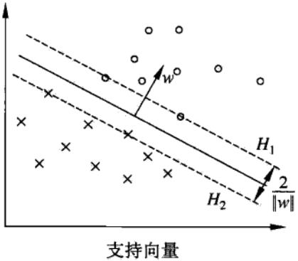

注意到H1和H2平行，并旦没有实例点落在它们中间。在H1与H2之间形成一条长带，分离超平面与它们平行且位于它们中央。长带的宽度，即H1与H2之间的距离称为间隔（margin）。间隔依赖于分离超平面的法向量W，等于
$$
\frac{2}{||w||}
$$
H1和H2称为间隔边界。

在决定分离超平面时只有支持向量起作用，而其他实例点并不起作用。如果移动支持向量将改变所求的解：但是如果在间隔边界以外移动其他实例点，甚至去掉这些点，则解是不会改变的。由于支持向量在确定分离超平面中起着决定性作用，所以将这种分类模型称为支持向量机。支持向量的个数一般很少，所以支持向量机由很少的“重要的”训练样本确定。

## 线性可分支持向量机学习的对偶算法

### 对偶优化问题

为了求解线性可分支持向量机的最优化问题，将它作为原始最优化问题，应用拉格朗日对偶性，通过求解对偶问题，得到与阿森纳hi问题的最优解，这就是线性可分支持向量机的对偶算法。这样做的优点，一是**对偶问题往往更容易求解**，二是自然引入核函数，进而推广到非线性分类问题。

首先构建拉格朗日函数。为此，对每一个不等式约束引入拉格朗日乘子αi≥0，i=1,2,...,N，定义拉格朗日函数：
$$
L(w,b,\alpha)=\frac{1}{2}||w||^2-\sum_{i=1}^N\alpha_iy_i(w\cdot x_i+b)+\sum_{i=1}^N\alpha_i
$$
其中，
$$
\alpha=(\alpha_1,\alpha_2,...,\alpha_N)
$$
为拉格朗日乘子向量。

根据拉格朗日对偶性，原始问题的对偶问题是极大极小问题：
$$
\mathop{\text{max}}_{\alpha}\mathop{\text{min}}_{w,b}L(w,b,\alpha)
$$
**等等，“根据拉格朗日对偶性”是什么意思？你需要看看凸优化一章。。如果拉格朗日函数具有强对偶性，那么原函数（极小极大）的最优值p\*和对偶函数（极大极小）的最优值d\*的值是一样大的。**

**那怎么判断是否满足强对偶性呢？其中一个就是，在原函数和不等式约束是凸函数的基础上，如果满足Slater条件，那么强对偶性就成立，从而原函数和对偶函数的最优值就相等，就可以通过求对偶函数的最优值来求原函数的最优值了。**

**那Slater条件又是什么呢？Slater条件是说：存在x，使不等式约束中的“小于等于号”要严格取到“小于号”。这个条件一般都能满足。。所以，我们的这个函数显然很容易就满足了Slater条件，而且它又是凸函数，那么就是满足强对偶性质喽，那么原函数（最小最大）和对偶函数（极大极小）的最优值就是一样的啦。所以，既然原函数不好求最优值，那我们就求对偶函数的最优值，因为对偶函数好求最优值嘛。。求出来的对偶函数的最优值，就是原函数的最优值了。。**

所以，为了求得对偶问题的解，需要先求L(w,b,α)对w,b的极小，再求对α的极大。

（1）求
$$
\mathop{\text{min}}_{w,b}L(w,b,\alpha)
$$
将拉格朗日函数L(w,b,α)分别对w,b求偏导数，并令其等于0。
$$
\begin{aligned}
\bigtriangledown_wL(w,b,\alpha)&=w-\sum_{i=1}^N\alpha_iy_ix_i=0\\
\bigtriangledown_bL(w,b,\alpha)&=-\sum_{i=1}^N\alpha_iy_i=0\\
\end{aligned}
$$
得
$$
\begin{aligned}
&w=\sum_{i=1}^N\alpha_iy_ix_i\\
&\sum_{i=1}^N\alpha_iy_i=0\\
\end{aligned}
$$
将上式中第一行式子带入拉格朗日函数，并利用下式，即得：
$$
\begin{aligned}
L(w,b,\alpha)&=\frac{1}{2}||w||^2-\sum_{i=1}^N\alpha_iy_i(w\cdot x_i+b)+\sum_{i=1}^N\alpha_i\\
&=\frac{1}{2}\sum_{i=1}^N\sum_{j=1}^N\alpha_i\alpha_jy_iy_j(x_i\cdot x_j)-\sum_{i=1}^N\alpha_iy_i\left(\left( \sum_{j=1}^N\alpha_jy_jx_j \right)\cdot x_i+b\right)+\sum_{i=1}^N\alpha_i\\
&=-\frac{1}{2}\sum_{i=1}^N\sum_{j=1}^N\alpha_i\alpha_jy_iy_j(x_i\cdot x_j)+\sum_{i=1}^N\alpha_i\\
\end{aligned}
$$
即
$$
\mathop{\text{min}}_{w,b}L(w,b,\alpha)=-\frac{1}{2}\sum_{i=1}^N\sum_{j=1}^N\alpha_i\alpha_jy_iy_j(x_i\cdot x_j)+\sum_{i=1}^N\alpha_i
$$
**拉格朗日对偶的重要作用是将w的计算提前并消除w，使得优化函数变为拉格朗日乘子的单一参数优化问题**。

（2）求
$$
\mathop{\text{min}}_{w,b}L(w,b,\alpha)
$$
对α的极大，即是对偶问题
$$
\begin{aligned}
&\mathop{\text{max}}_{\alpha}-\frac{1}{2}\sum_{i=1}^N\sum_{j=1}^N\alpha_i\alpha_jy_iy_j(x_i\cdot x_j)+\sum_{i=1}^N\alpha_i\\
&s.t.\quad \sum_{i=1}^N\alpha_iy_i=0\\
&\quad\quad\quad\alpha_i\geqslant 0,\quad i=1,2,...,N
\end{aligned}
$$
将上式从求极大换成求极小，就得到下面与之等价的**对偶优化问题**：
$$
\begin{aligned}
&\mathop{\text{min}}_{\alpha}\ \ \frac{1}{2}\sum_{i=1}^N\sum_{j=1}^N\alpha_i\alpha_jy_iy_j(x_i\cdot x_j)-\sum_{i=1}^N\alpha_i\\
&s.t.\quad \sum_{i=1}^N\alpha_iy_i=0\\
&\quad\quad\quad\alpha_i\geqslant 0,\quad i=1,2,...,N
\end{aligned}
$$
考虑原始最优化问题和对偶最优化问题，原始问题满足Slater条件，使得对偶性为强对偶，所以存在w\*,α\*,β\*，使w\*是原始问题的解，α\*,β\*是对偶问题的解。这意味着求解原始问题可以转换为求解对偶问题。

### 根据KKT条件由对偶优化的解α求原始优化问题的解w和b

对线性可分训练数据集，假设对偶最优化问题对α的解为α\*=(α1\*,α2\*,...,αN\*)^T，可以由α\*求得原始最优化问题对(w,b)的解w\*,b\*。有下面的定理。

**定理：**

设
$$
\alpha^*=(\alpha_1^*,\alpha_2^*,...,\alpha_l^*)^T
$$
是对偶最优化问题的解，则存在下标j，使得αj\*>0，并可按下式求得原始最优化问题的解w\*,b\*：
$$
\begin{aligned}
&w^*=\sum_{i=1}^N\alpha_i^*y_ix_i\\
&b^*=y_j-\sum_{i=1}^N\alpha_i^*y_i(x_i\cdot x_j)\\
\end{aligned}
$$
证明：

这里先说一下KKT条件（不知道KKT条件的，建议先看凸优化一章）：

在原函数和不等式约束是凸函数的基础上，如果满足Slater条件（存在x可以让所有不等式约束均小于零），那么强对偶性成立。则x\*和α\*,β\*分别是原始问题和对偶问题的解的充分必要条件是x\*,α\*,β\*满足下面的KKT条件：
$$
\begin{aligned}
&\bigtriangledown_xL(x^*,\alpha^*,\beta^*)=0\\
&\bigtriangledown_{\alpha}L(x^*,\alpha^*,\beta^*)=0\\
&\bigtriangledown_{\beta}L(x^*,\alpha^*,\beta^*)=0\\
&\alpha_i^*c_i(x_i^*)=0, \quad i=1,2,...,k\\
&c_i(x^*)\leqslant 0,\quad i=1,2,...,k\\
&\alpha_i^*\geqslant 0\quad i=1,2,...,k\\
&h_j(x^*)=0\quad i=1,2,...,l\\
\end{aligned}
$$
特别指出，上式中的第四行称为KKT的**互补松弛条件**，粗略地讲，互补松弛条件意味着在最优点处，除了第i个约束起作用的情况（ci(x\*)=0），最优Lagrange乘子的第i项都为零，也就是说，若αi\*>0，则ci(x\*)=0。

下面开始正式证明：

根据上面所述，KKT条件成立，即得
$$
\begin{aligned}
&\bigtriangledown_wL(w^*,b^*,\alpha^*)=w^*-\sum_{i=1}^N\alpha_i^*y_ix_i=0\\
&\bigtriangledown_{b}L(w^*,b^*,\alpha^*)=-\sum_{i=1}^N\alpha_iy_i=0\\
&\alpha_i^*(y_i(w^*\cdot x_i+b^*)-1)=0, \quad i=1,2,...,N\\
&y_i(w^*x_i+b^*)-1\geqslant 0,\quad i=1,2,...,N\\
&\alpha_i^*\geqslant 0,\quad i=1,2,...,N\\
\end{aligned}
$$
由此得
$$
w^*=\sum_i\alpha_i^*y_ix_i
$$
其中至少有一个aj\*>0（反证法，如果所有的a\*均为0，则w\*为0，不是原始最优化问题的解，则产生矛盾），因此对这个j或这几个j有（**根据上面的互补松弛条件，不等式变为等式，这说明处于边界上，所以其实下标j代表的点就位于边界上，也就是所谓的支持向量。所以注意观察上式，最优分界面的w的值其实并不是每一个点都在贡献的，而仅仅是由a不为零的点，也就是边界上的支撑点贡献的**）：
$$
y_j(w^*\cdot x_j+b^*)-1=0
$$
将上上式带入上式，并注意到yj^2=1，即得
$$
\begin{aligned}
b^*&=y_j-w^*x_j\\
&=y_j-\sum_{i=1}^N\alpha_i^*y_i(x_i\cdot x_j)\\
\end{aligned}
$$
故此定理得证，即有
$$
\begin{aligned}
&w^*=\sum_{i=1}^N\alpha_i^*y_ix_i\\
&b^*=y_j-\sum_{i=1}^N\alpha_i^*y_i(x_i\cdot x_j)\\
\end{aligned}
$$
由此定理可知，分离超平面可以写成
$$
\sum_{i=1}^N\alpha_i^*y_i(x\cdot x_i)+b^*=0
$$
分类决策函数可以写成
$$
f(x)=\text{sign}\left( \sum_{i=1}^N\alpha_i^*y_i(x\cdot x_i)+b^* \right)
$$
这就是说，分类决策函数只依赖与输入x和训练样本输入的内积。上式称为线性可分支持向量机的对偶形式。

### 线性可分支持向量机学习算法

综上所述，对于给定的线性可分训练数据集，可以首先求对偶问题（**强对偶性**，必须满足Slater条件）
$$
\begin{aligned}
&\mathop{\text{min}}_{\alpha}\ \ \frac{1}{2}\sum_{i=1}^N\sum_{j=1}^N\alpha_i\alpha_jy_iy_j(x_i\cdot x_j)-\sum_{i=1}^N\alpha_i\\
&s.t.\quad \sum_{i=1}^N\alpha_iy_i=0\\
&\quad\quad\quad\alpha_i\geqslant 0,\quad i=1,2,...,N
\end{aligned}
$$
的解a\*；再利用（**KKT条件**）
$$
\begin{aligned}
&w^*=\sum_{i=1}^N\alpha_i^*y_ix_i\\
&b^*=y_j-\sum_{i=1}^N\alpha_i^*y_i(x_i\cdot x_j)\\
\end{aligned}
$$
求得原始问题的解w\*,b\*；从而得到分离超平面及分类决策函数。这种算法称为**线性可分支持向量机的对偶学习算法**，是线性可分支持向量机的基本算法。

**线性可分支持向量机学习算法：**

输入：线性可分训练集T=\{(x1,y1),(x2,y2),...,(xN,yN)\}，其中，xi∈X=R^n，yi∈Y=\{-1,+1\}，i=1,2,...,N；

输出：分离超平面和分类决策函数。

（1）构造并求解约束最优化问题
$$
\begin{aligned}
&\mathop{\text{min}}_{\alpha}\ \ \frac{1}{2}\sum_{i=1}^N\sum_{j=1}^N\alpha_i\alpha_jy_iy_j(x_i\cdot x_j)-\sum_{i=1}^N\alpha_i\\
&s.t.\quad \sum_{i=1}^N\alpha_iy_i=0\\
&\quad\quad\quad\alpha_i\geqslant 0,\quad i=1,2,...,N
\end{aligned}
$$
求得最优解α\*=(α1\*,α1\*,...,αN\*)^T。

（2）计算
$$
w^*=\sum_{i=1}^N\alpha_i^*y_ix_i
$$
并选择α\*的一个正分量αj\*>0，计算
$$
b^*=y_j-\sum_{i=1}^N\alpha_i^*y_i(x_i\cdot x_j)
$$
（3）求得分离超平面
$$
w^*\cdot x+b^=0
$$
分类决策函数：
$$
f(x)=\text{sign}(w^*\cdot x+b^*)
$$

### 线性可分数据集的支持向量

在线性可分支持向量机中，由上面的（如下式）式子可知，**w\*和b\*只依赖于训练数据中对应于αi\*>0的样本点(xi,yi)，而其他样本点对w\*和b\*没有影响**。我们将训练数据中对应于**αi\*>0的实例点xi称为支持向量**。
$$
\begin{aligned}
&w^*=\sum_{i=1}^N\alpha_i^*y_ix_i\\
&b^*=y_j-\sum_{i=1}^N\alpha_i^*y_i(x_i\cdot x_j)\\
\end{aligned}
$$
根据这一定义，**支持向量一定在分隔边界上**，为什么？因为由KKT互补松弛条件可知，
$$
\alpha_i^*(y_i(w^*\cdot x_i+b^*)-1)=0,\quad i=1,2,...,N
$$
对应于αi\*>0的实例xi，有
$$
y_i(w^*\cdot x_i+b^*)-1=0
$$
或
$$
w^*\cdot x_i+b^*=\pm1
$$
即xi一定在间隔边界上，这里的支持向量的定义与前面给出的支持向量的定义是一致的。

---

对于线性可分问题，上述线性可分支持向量机的学习（**硬间隔最大化**）算法是完美的。但是，训练数据集线性可分是理想的清醒。在现实问题中，训练数据集往往是线性不可分的，即在样本中出现的噪点或特异点。此时，有更一般的学习算法。

# 线性支持向量机与软间隔最大化

## 线性支持向量机

线性可分子问题的支持向量机学习方法，对线性不可分训练数据是不适用的，因为这时上述方法中的不等式约束并不能成立。怎么才能将它扩展到线性不可分问题呢？这就需要修改硬间隔最大化，使其成为软间隔最大化。

假设给定一个特征空间上的训练数据集
$$
T=\{(x_1,y_1),(x_2,y_2),...,(x_N,y_N)\}
$$
其中，xi∈X=R^n，yi∈Y=\{+1,-1\}，i=1,2,...,N，xi为第i个特征向量，也称为实例，yi为xi的类标记。再假设训练数据集不是线性可分的。通常情况是，训练数据中有一些离群点，将这些离群点除去后，剩下大部分的样本组成的集合是线性可分的。

线性不可分意味着某些样本点是不能满足线性可分中的函数间隔大于等于1的约束条件的。为了解决这个问题，可以对每个样本点(xi,yi)引进一个松弛变量ξi≥0，使函数间隔加上松弛变量大于等于1。这样，约束条件变为
$$
y_i(w\cdot x_i+b)\geqslant1-\xi_i
$$
**上式可以这么理解：ξi是数据点到其分隔边界的函数距离，而1-ξi则就是数据点到分界面的函数距离了。原来要求的是数据点到分界面的函数距离要大于等于1，现在就放宽到了数据点到分界面函数距离大于等于1-ξi。这其实是对异常离群点的一种容忍。**

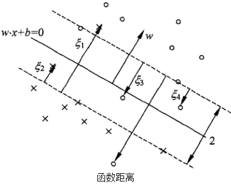

同时，对每一个松弛变量ξi，支付一个代价ξi。原来的目标函数变成了现在的
$$
\frac{1}{2}||w||^2+C\sum_{i=1}^N\xi_i
$$
这里，C>0称为惩罚函数，一般由应用问题决定，C值大时对误分类的惩罚更大，C值小时对误分类的惩罚减小。最小化目标函数（上式）包含了**两层含义**：

* **使**
  $$
  \frac{1}{2}||w||^2
  $$
  **尽可能小，即间隔尽量大；**

* **同时使误分类点的个数尽可能小，**

  **而C是调和两者的系数**。

有了上面的思路，可以和训练数据集线性可分时一样来考虑训练数据集不可分时的线性支持向量机学习问题。相应于硬间隔最大化，它称为**软间隔最大化**。

线性不可分的线性支持向量机的学习问题变成如下凸二次规划问题（**原始问题**）：
$$
\begin{aligned}
&\mathop{\text{min}}_{w,b,\xi}\quad \frac{1}{2}||w||^2+C\sum_{i=1}^N\xi_i\\
&\text{s.t.}\ \ \quad y_i(w\cdot x_i+b)\geqslant 1-\xi_i,\ i=1,2,...,N\\
&\ \ \ \quad \quad \xi_i\geqslant 0,\ i=1,2,...,N\\
\end{aligned}
$$
原始问题是一个凸二次规划问题，因而关于(w,b,ξ)的解是存在的。可以证明w的解是唯一的，但b的解并不唯一，b的解存在于一个区间。

设原始问题的解是w\*,b\*，于是可以得到分离超平面w\*·x+b\*=0及分类决策函数f(x)=sign(w\*·x+b\*)。称这样的模型为训练样本不可分时的线性支持向量机，简称**线性支持向量机**。显然，线性支持向量机包含线性可分支持向量机。由于现实中国训练数据集往往是不可分的，线性支持向量机具有更广泛的适用性。

下面给出**线性支持向量机的定义**：

对于给定的线性不可分的训练数据集，通过求解凸二次规划问题，即软间隔最大问题（上述原始问题），得到的分离超平面为
$$
w^*\cdot x+b^*=0
$$
以及相应的分类决策函数
$$
f(x)=\text{sign}(w^*\cdot x+b^*)
$$
称为线性支持向量机。

## 线性支持向量机学习的对偶算法

原始问题的对偶问题是
$$
\begin{aligned}
&\mathop{\text{min}}_{\alpha}\quad \frac{1}{2}\sum_{i=1}^N\sum_{j=1}^N\alpha_i\alpha_jy_iy_j(x_i\cdot x_j)-\sum_{i=1}^N\alpha_i\\
&\text{s.t.}\ \quad \sum_{i=1}^N\alpha_iy_i=0\\
&\ \ \ \quad \quad 0\leqslant\alpha_i\leqslant C,\ i=1,2,...,N\\
\end{aligned}
$$
下面我们来具体说明上述对偶问题是怎么得出的：

原始最优化问题的**拉格朗日函数**是
$$
L(w,b,\xi,\alpha,\mu)=\frac{1}{2}||w||^2+C\sum_{i=1}^N\xi_i-\sum_{i=1}^N\alpha_i(y_i(w\cdot x_i+b)-1+\xi_i)-\sum_{i=1}^N\mu_i\xi_i
$$
其中，
$$
\alpha_i\geqslant0,\quad \mu_i\geqslant0
$$
对偶问题是拉格朗日函数的极大极小问题。

首先求L(w,b,ξ,α,μ)**对w,b,ξ的极小**，由
$$
\begin{aligned}
&\bigtriangledown_wL(w,b,\xi,\alpha,\mu)=w-\sum_{i=1}^N\alpha_iy_ix_i=0\\
&\bigtriangledown_bL(w,b,\xi,\alpha,\mu)=-\sum_{i=1}^N\alpha_iy_i=0\\
&\bigtriangledown_{\xi_i}L(w,b,\xi,\alpha,\mu)=C-\alpha_i-\mu=0
\end{aligned}
$$
得
$$
\begin{aligned}
&w=\sum_{i=1}^N\alpha_iy_ix_i\\
&\sum_{i=1}^N\alpha_iy_i=0\\
&C-\alpha_i-\mu=0\\
\end{aligned}
$$
将上式代入上面的拉格朗日函数，得
$$
\mathop{\text{min}}_{w,b,\xi}L(w,b,\xi,\alpha,\mu)=-\frac{1}{2}\alpha_i\alpha_jy_iy_j(x_i\cdot x_j)+\sum_{i=1}^N\alpha_i
$$
再对极小（上式）求**α的极大**，即得**对偶问题**：
$$
\begin{aligned}
&\mathop{\text{max}}_{\alpha}\quad -\frac{1}{2}\sum_{i=1}^N\sum_{j=1}^N\alpha_i\alpha_jy_iy_j(x_i\cdot x_j)+\sum_{i=1}^N\alpha_i\\
&\text{s.t.}\ \quad \sum_{i=1}^N\alpha_iy_i=0\\
&\ \ \ \quad \quad C-\alpha_i-\mu_i=0\\
&\ \ \ \quad \quad \alpha_i\geqslant0\\
&\ \ \ \quad \quad \mu_i\geqslant0,\ i=1,2,...,N\\
\end{aligned}
$$
**拉格朗日对偶的重要作用是将w的计算提前并消除w，使得优化函数变为拉格朗日乘子的单一参数优化问题**。

将对偶最优化问题（上式）进行变换：利用等式约束（上式第二项约束）消去μi，从而只留下变量αi，并将约束（上式第后三项约束）写成
$$
0\leqslant\alpha_i\leqslant C
$$
下面具体来说明上式不等式是怎么得到的：
$$
\begin{aligned}
&C-\alpha_i-\mu_i=0 \Rightarrow \mu_i=C-\alpha_i\\
&u_i\geqslant0 \Rightarrow C-\alpha_i\geqslant0 \Rightarrow \alpha_i\leqslant C\\
&\alpha_i\geqslant0 \Rightarrow 0\leqslant \alpha_i\leqslant C
\end{aligned}
$$
再通过取负，将对目标函数求极大转换为求极小，于是得到对偶问题
$$
\begin{aligned}
&\mathop{\text{min}}_{\alpha}\quad \frac{1}{2}\sum_{i=1}^N\sum_{j=1}^N\alpha_i\alpha_jy_iy_j(x_i\cdot x_j)-\sum_{i=1}^N\alpha_i\\
&\text{s.t.}\ \quad \sum_{i=1}^N\alpha_iy_i=0\\
&\ \ \ \quad \quad 0\leqslant\alpha_i\leqslant C,\ i=1,2,...,N\\
\end{aligned}
$$
可以**通过求解对偶问题而得到原始问题的解(w\*,b\*)，进而确定分离超平面和决策函数**。为此，我们以定理的形式叙述原始问题的最优解(w\*,b\*)和对偶问题的最优解α\*的关系。

**定理：原始问题的最优解(w\*,b\*)和对偶问题的最优解α\*的关系：**

设
$$
\alpha^*=\{\alpha_1^*, \alpha_2^*, ..., \alpha_N^*\}
$$
是上述对偶问题的一个解，若存在α\*的一个分量αj\*，0<αj\*<C，则原始问题的解(w\*,b\*)可按下式求得：
$$
\begin{aligned}
&w^*=\sum_{i=1}^N\alpha_i^*y_ix_i\\
&b^*=y_j-\sum_{i=1}^Ny_i\alpha_i^*(x_i\cdot x_j)\\
\end{aligned}
$$
证明：

原始问题是凸二次规划问题，满足强对偶问题（凸函数+Slater条件），所以原函数问题和对偶问题等价，则解满足KKT条件。即得
$$
\begin{aligned}
&\bigtriangledown_wL(w,b,\xi,\alpha,\mu)=w-\sum_{i=1}^N\alpha_iy_ix_i=0\\
&\bigtriangledown_bL(w,b,\xi,\alpha,\mu)=-\sum_{i=1}^N\alpha_iy_i=0\\
&\bigtriangledown_{\xi_i}L(w,b,\xi,\alpha,\mu)=C-\alpha_i-\mu=0\\
&\alpha_i^*(y_i(w^*\cdot x_i+b^*)-1+\xi_i)=0\\
&\mu_i^*\xi_i^*=0\\
&y_i(w^*\cdot x_i+b^*)-1+\xi_i^*\geqslant 0\\
&\xi_i^*\geqslant0\\
&\alpha_i^*\geqslant0\\
&\mu_i^*\geqslant 0,\quad i=1,2,...,N\\
\end{aligned}
$$
解释下上式所述的KKT条件：前三项是一阶偏导等于零，**第四五项是互补松弛条件（强对偶性决定的）**，第六七项是原始问题的约束条件，最后两项是对偶问题的约束条件。

由上式KKT条件中的第一项可知，原始问题的解中的第一项成立，即
$$
w^*=\sum_{i=1}^N\alpha_i^*y_ix_i
$$
再由KKT的互补松弛条件（第四五项）得，若存在αj\*，0<αj\*<C，则
$$
y_i(w^*\cdot x_i+b^*)-1=0
$$
。**这里具体是怎么得到的呢？**

**由互补松弛条件的第一项可知，当αj\*>0时，该项括号内才等于零，即**
$$
y_i(w^*\cdot x_i+b^*)-1+\xi_i^*=0
$$
**里面还有个ξi\*未知，那怎么消去这个ξi\*呢？由互补松弛条件的第二项可知，当μi\*>0时，ξi\*=0，这时候就能消去ξi\*了。那么当μi\*>0时，αj\*必须满足什么条件呢？或者说，当αj\*满足什么条件时，才能保证μi\*>0？我们知道，对偶问题的条件中有一个C-αi-μi=0，即μi=C-αi>0，则αi<C，这时，上式中的ξi\*=0。也就是说，当0<αj\*<C时，ξi\*=0，则有**
$$
y_i(w^*\cdot x_i+b^*)-1=0
$$
即由此即得原始问题的解中的第二项（注意上式中1可以写成yi的平方，然后可消去yi，求得b\*），即
$$
b^*=y_j-\sum_{i=1}^Ny_i\alpha_i^*(x_i\cdot x_j)
$$
。由此定理可知，分离超平面可以写成
$$
\sum_{i=1}^N\alpha_i^*y_i(x\cdot x_i)+b^*=0
$$
分类决策函数可以写成
$$
f(x)=\text{sign}\left( \sum_{i=1}^N\alpha_i^*y_i(x\cdot x_i)+b^* \right)
$$
上式为**线性支持向量机的对偶形式**。

综合前面的结果，有下面的算法。

**线性支持向量机学习算法**

输入：训练数据集T=\{ (x1,y1),(x2,y2),...,(xN,yN) \}，其中，xi∈X=R^n，yi∈Y=\{-1,+1\}，i=1,2,...,N；

输出：分离超平面和分类决策函数。

（1）选择惩罚参数C>0，构造并求解凸二次规划问题（**对偶问题**）
$$
\begin{aligned}
&\mathop{\text{min}}_{\alpha}\quad \frac{1}{2}\sum_{i=1}^N\sum_{j=1}^N\alpha_i\alpha_jy_iy_j(x_i\cdot x_j)-\sum_{i=1}^N\alpha_i\\
&\text{s.t.}\ \quad \sum_{i=1}^N\alpha_iy_i=0\\
&\ \ \ \quad \quad 0\leqslant\alpha_i\leqslant C,\ i=1,2,...,N\\
\end{aligned}
$$
求得最优解
$$
\alpha^*=\{\alpha_1^*, \alpha_2^*, ..., \alpha_N^*\}
$$
（2）计算原问题的最优解的参数w\*和b\*。
$$
w^*=\sum_{i=1}^N\alpha_i^*y_ix_i
$$
选择α\*的一个满足条件0<αj\*<C的分量αj\* ，计算
$$
b^*=y_j-\sum_{i=1}^Ny_i\alpha_i^*(x_i\cdot x_j)
$$
（3）求得分离超平面和分类决策函数

分离超平面：
$$
w^*\cdot x+b^*=0
$$
分类决策函数：
$$
f(x)=\text{sign}(w^*\cdot x+b^*)
$$
上述步骤（2）中，对任一符合条件0<αj\*<C的αj\*，按照该算法求b\*的公式都可以求出b\*，但是由于原始问题对b的解并不唯一，所以实际计算时，可以取在所有符合条件的样本点上的平均值。

## 支持向量

在线性不可分的情况下，将对偶问题的解
$$
\alpha^*=(a_1^*,\alpha_2^*,...,\alpha_N^*)^T
$$
中对应于αi\*>0的样本点(xi,yi)的实例xi称为支持向量（软间隔的支持向量）。如下图所示，这时的支持向量要比线性可分时的情况更复杂一些。图中，分离超平面由实线表示，间隔边界由虚线表示，正例点由“。”表示，负例点由“x”表示。图中还标出了实例xi到间隔边界的距离
$$
\frac{\xi_i}{||w||}
$$
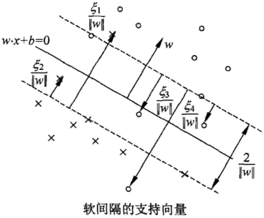

**软间隔的支持向量xi或者在间隔边界上，或者在间隔边界与分离超平面之间，或者在分离超平面误分一侧。**

* 若αi\*<C，则ξi=0，支持向量恰好落在间隔边界上；
* 若αi\*=C，
  * 0<ξi<1，则分类正确，xi在间隔边界与分离超平面之间；
  * ξi=1，则xi在分离超平面上；
  * ξi>1，则xi位于分离超平面误分一侧。

**这里解释下为什么，由上一节我们知道**
$$
\begin{aligned}
&C-\alpha_i^*-\mu_i^*=0\\
&\mu_i^*\xi_i^*=0
\end{aligned}
$$
**所以，当αi\*\<C，则μi\*\>0，所以ξi=0，即支持向量恰好落在间隔边界上；而当αi\*=C时，μi\*=0，所以ξi>0。**

## 合页损失函数

对于线性支持向量机学习来说，其模型为分离超平面w\*·x+b\*=0及决策函数f(x)=sign(w\*·x+b\*)，其学习策略为软间隔最大化，学习算法为图二次规划。

线性支持向量机学习还有另外一种解释，就是最小化以下目标函数：
$$
\sum_{i=1}^N\left[ 1-y_i(w\cdot x_i+b) \right]_++\lambda||w||^2
$$
目标函数的第一项是经验损失是或经验风险，函数
$$
L(y(w\cdot x+b))=[1-y(w\cdot x+b)]_+
$$
称为合页损失函数（hinge loss function）。下标“+”表示以下取正值的函数。
$$
\begin{aligned}
\ [z]_+=
\left\{\begin{matrix}
z,\quad z>0\\ 
0,\quad z\leqslant0
\end{matrix}\right.
\end{aligned}
$$
这就是说，当样本点(xi,yi)被正确分类且间隔函数（确信度）yi(w·xi+b)>1时，损失是0，否则损失是1-yi(w·xi+b)，注意到在上图中的实例点x4被正确分类，但损失不是0。目标函数的第2项是系数为λ的L2范数，是正则化项。

**定理：线性支持向量机原始最优化问题 等价于 合页损失+正则化的最优化问题**

线性支持向量机原始最优化问题
$$
\begin{aligned}
&\mathop{\text{min}}_{w,b,\xi}\quad \frac{1}{2}||w||^2+C\sum_{i=1}^N\xi_i\\
&\text{s.t.}\ \ \quad y_i(w\cdot x_i+b)\geqslant 1-\xi_i,\ i=1,2,...,N\\
&\ \ \ \quad \quad \xi_i\geqslant 0,\ i=1,2,...,N\\
\end{aligned}
$$
等价于合页损失+正则化的最优化问题
$$
\mathop{\text{min}}_{w,b}\ \sum_{i=1}^N\left[ 1-y_i(w\cdot x_i+b) \right]_++\lambda||w||^2
$$
证明：令
$$
\left[ 1-y_i(w\cdot x_i+b) \right]_+=\xi_i
$$
，则ξi≥0，原始最优化问题约束条件的第二项成立。

由上式，

* 当1-yi(w·xi+b)>0时，有yi(w·xi+b)=1-ξi；
* 当1-yi(w·xi+b)≤0时，ξi=0，有yi(w·xi+b)≥1-ξi

故原始最优化问题约束条件的第一项成立。

于是w,b,ξi满足原始最优化问题的约束条件。

所以合页损失+正则化最优化问题可写成
$$
\mathop{\text{min}}_{w,b}\sum_{i=1}^N\xi_i+\lambda||w||^2
$$
若取
$$
\lambda=\frac{1}{2C}
$$
，则
$$
\mathop{\text{min}}_{w,b} \frac{1}{C}\left( \frac{1}{2}||w||^2+C\sum_{i=1}^N\xi_i \right)
$$
与原始最优化问题等价。

反之，也可将原始最优化问题表示成合页损失+正则化的最优化问题。

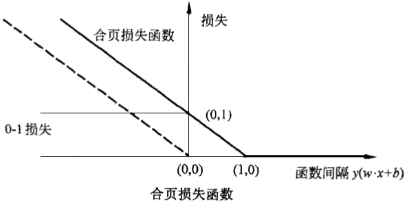

合页损失函数的图形如上图所示，横轴是函数间隔y(w·x+b)，纵轴是损失。由于函数像一个合页，故名合页损失函数。

图中还画出0-1损失函数，可以认为它是二类问题的真正的损失函数，而合页损失函数是0-1损失函数的上界。由于0-1损失函数不是连续可导的，直接优化由其构成的目标函数比较困难，可以认为**线性支持向量机是优化由0-1损失函数的上界（合页损失函数）构成的目标函数**。这时的上界损失函数又称为代理损失函数。

**上图中虚线显示的是感知机的损失函数**
$$
\left[ -y_i(w\cdot x_i+b) \right]_+
$$
**。这时，当样本点(xi,yi)被正确分类时，损失是0，否则损失是-yi(w·xi+b)。相比之下，合页损失函数不仅要分类正确，而且确信度要足够高时损失才是0。也就是说，合页损失函数对学习有更高的要求。这就是SVM和感知机分本质区别！**

# 非线性支持向量机与核函数

对解线性分类问题，线性分类支持向量机是一种非常有效的方法。但是，有时分类问题是非线性的，这时可以使用非线性支持向量机。本节叙述非线性支持向量机，其主要优点是利用核技巧。核技巧不仅应用于支持向量机，而且应用于其他统计学习问题。

## 核技巧

### 非线性分类问题

非线性分类问题是指通过利用非线性模型才能就很好地进行分类的问题。先看一个例子：如下图所示，是一个分类问题，图中“●”表示正实例点，“x”表示负实例点。由图可见，无法用直线（线性模型将正负实例正确分开），但可以用一条椭圆曲线（非线性模型）将他正确们分开。

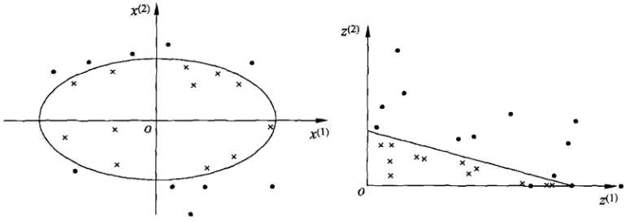

一般来说，对给定的一个训练数据集
$$
T=\{(x_1,y_1),(x_2,y_2),...,(x_N,y_N)\}
$$
其中实例xi属于输入空间，xi∈X=R^n，对应的标记有两类，yi∈Y=\{+1,-1\}，i=1,2,...,N。如果能用R^n中的一个超曲面将正负例分开，则称这个问题为非线性可分问题。

非线性问题往往不好求解，所以希望能用解线性分类问题的方法解决这个问题，所采取的方法是进行一个变换 ，将非线性问题变换为线性问题，通过解变换后的线性问题的方法求解原来的非线性问题。

对上图中所示的例子，通过变换，将左图中的椭圆变换为有图中的直线，将非线性分类问题变为线性分类问题。

设原空间为X⊆R^2，x=(x(1),x(2))^T∈X，新空间为Z⊆R^2，zx=(z(1),z(2))^T∈Z，定义从原空间到新空间的变换（映射）：
$$
z=\phi(x)=\left( (x^{(1)})^2, (x^{(2)})^2 \right)^T
$$
经过变换z=Φ(x)，原空间XX⊆R^2变换为新空间为Z⊆R^2，原空间中的点相应地变换为新空间中的点，原空间中的椭圆
$$
w_1(x^{(1)})^2+w_2(x^{(2)})^2+b=0
$$
变换成为新空间中的直线
$$
w_1z^{(1)}+w_2z^{(2)}+b=0
$$
在变换后的新空间里，直线w1·z1+w2·z2+b=0可将变换后的正负实例点正确分开。这样，原空间中的非线性可分问题就变成了新空间里的线性可分问题。

上面的例子说明，用线性分类方法求解非线性分类问题分为两步：

* **首先使用一个变换将原空间的数据映射到新空间**
* **然后在新空间中用线性分类学习方法从训练数据中学习分类模型**

**核技巧**就属于这样的方法。

核技巧应用到支持向量机，其基本思想就是通过一个非线性变换将输入空间（欧式空间或离散集合）对应于一个特征空间（希尔伯特空间H），使得在输入空间R^n中的**超曲面模型**对应于特征空间中的**超平面模型（支持向量机）**。这样，分类问题的学习任务通过在特征空间求解线性支持向量机就可以完成。

### 核函数的定义

**核函数**：设X是输入空间，又设H为特征空间（希尔伯特空间）如果存在一个从X到H的映射
$$
\phi(x):X\rightarrow H
$$
使得对所有x,z∈X，函数K(x,z)满足条件
$$
K(x,y)=\phi(x)\cdot \phi(z)
$$
则称K(x,z)为核函数，Φ(x)为映射函数，式中Φ(x)·Φ(z)为Φ(x)和Φ(z)的内积。

核技巧的想法是，在学习与预测中只定义核函数K(x,z)，而不显式地定义映射函数Φ（**这样其实有一个问题就是，你得知道定义的这个函数K到底是不是核函数，如何验证？接下来会讲到**）。为什么要用核函数？**其高维空间内积后的结果可等效为在低维空间的样本向量通过核函数直接求得。所以用核函数**。通常，直接计算K(x,z)比较容易，而通过Φ(x)和Φ(z)计算K(x,z)并不容易。注意，**Φ是输入空间R^n到特征空间的映射，特征空间一般是高维的，甚至是无穷维的**。

可以看到，对于给定的核K(x,z)，特征空间H和映射函数Φ的取法并不是唯一的，可以取不同的特征空间，即便是同一特征将空间里，也可以取不同的映射。

下面举一个简单的例子来说明核函数和映射函数的关系。

假设输入空间是R^2，核函数是K(x,z)=(x·z)^2，试找出其相关的特征空间H和映射Φ(x)：R^2→H。

解：取特征空间H=R^3，记
$$
x=(x^{(1)},x^{(2)})^T,\quad z=(z^{(1)},z^{(2)})^T
$$
，由于
$$
(x\cdot z)^2=(x^{(1)}z^{(1)}+x^{(2)}z^{(2)})^2=(x^{(1)}z^{(1)})^2+2x^{(1)}z^{(1)}x^{(2)}z^{(2)}+(x^{(2)}z^{(2)})^2
$$
所以可以取映射
$$
\phi(x)=\left( (x^{(1)})^2,\sqrt{2}x^{(1)}x^{(2)},(x^{(2)})^2 \right)^T
$$
容易验证
$$
\phi(x)\cdot\phi(z)=(x\cdot z)^2=K(x,z)
$$
。仍取H=R^3以及
$$
\phi(x)=\frac{1}{\sqrt{2}}\left( (x^{(1)})^2-(x^{(2)})^2,\ 2x^{(1)}x^{(2)},\ (x^{(2)})^2 \right)^T
$$
同样有
$$
\phi(x)\cdot\phi(z)=(x\cdot z)^2=K(x,z)
$$
。还可以取H=R^4和
$$
\phi(x)=\left( (x^{(1)})^2,\ x^{(1)}x^{(2)},\ x^{(1)}x^{(2)},\ (x^{(2)})^2 \right)^T
$$

### 对核函数的理解

考虑我们最初在“线性回归”中提出的问题，特征是房子的面积x，这里的x是实数，结果y是房子的价格。假设我们从样本点的分布中看到x和y符合3次曲线，那么我们希望使用x的三次多项式来逼近这些样本点。那么首先需要将特征x扩展到三维(x,x^2,x^3)，然后寻找特征和结果之间的模型。我们将这种特征变换称作特征映射（feature mapping）。映射函数称作Φ，在这个例子中
$$
\begin{aligned}
\phi(x)=
\begin{bmatrix}
x\\ 
x^2\\
x^3
\end{bmatrix}
\end{aligned}
$$
我们希望将得到的特征映射后的特征用于SVM分类，而不是最初的特征。这样，我们需要将前面线性可分SVM的w·x+b公式中的内积从\<x^(i), x\>，映射到\<Φ(x^(i)),Φ(x)\>。具体的讲：

前面已经得到线性支持向量机的分界线：
$$
\sum_{i=1}^N\alpha_i^*y_i<x_i\cdot x>+b^*=0
$$
如果我们已经求得a\*和b\*，那么分界线就只依赖于x和xi的矢量积形式，这一点非常关键。很多时候我们需要从数据中挖掘新的特征来进行训练，而不是简单粗暴地用原始数据，比如我们从x中挖掘出新的特征x^2，那我们还需要再一步步重新推导y的表达式吗？只需要将\<xi, x\>换成\<xi^2, x^2\>即可，更一般的描述：

如果存在一种映射关系Φ(x)，将x映射到另一空间中，已知
$$
y=\sum_{k=1}^m\alpha_iy^{(i)}<x^{(i)},x>+b
$$
，那么新空间中的
$$
y=\sum_{k=1}^m\alpha_iy^{(i)}<\phi(x^{(i)}),\phi(x)>+b
$$
整个过程非常的顺溜，Φ(x)可以将数据从低维映射到高维空间当中，为分类提供了新的视角。

至于为什么需要映射后的特征而不是最初的特征来参与计算，上面提到的（为了**更好地拟合**）是其中一个原因，另外的一个重要原因是**样例可能存在线性不可分的情况，而将特征映射到高维空间后，往往就可分了**。（在《数据挖掘导论》Pang-Ning Tan等人著的《支持向量机》那一章有个很好的例子说明）

如下图所示，一维空间中的数据点X和O互相交杂，在一维空间中我们无法找到一个分界点进行划分，但是通过
$$
\phi(x)=(x,\ 0.5x^2+2)
$$
映射到二维空间中以后，很容易找到分界线将这些不同类型的点区分开来

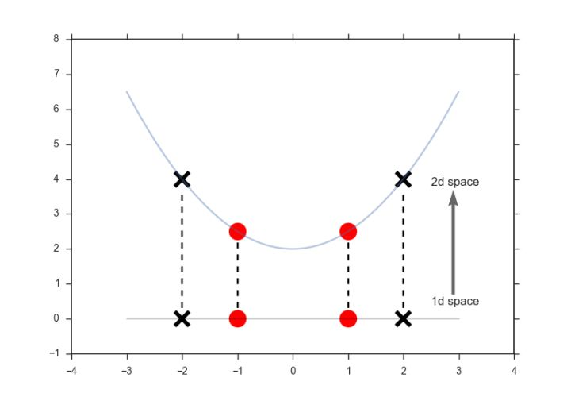

将核函数形式化定义，如果原始特征内积是\<x,z\>，映射后为\<Φ(x),Φ(z)\>，那么定义核函数（Kernel）为
$$
K(x,z)=\phi(x)^T\phi(z)
$$
映射函数Φ通常将低维的数据（m）映射到高维空间中，核函数K表示的是映射之后高维空间中两个**矢量的点积**。

到这里，我们可以得出结论，

通过映射函数，我们能从原始数据中（低维空间）抽象出所需的**特征**（高维空间），**由低维空间向高维空间的转化很多时候非常的麻烦，有意思的是，无论是1维、10维、100维还是更高维的空间，其矢量点积的结果都是一个常数，那么有没有什么捷径，可以跳过维度转换的过程，通过相对简单的计算直接得到矢量积？答案就是核函数**，

具体地讲，如果要实现该节开头的效果，只需先计算Φ(x)，然后计算Φ(x)Φ(z)即可，然而这种计算方式是非常低效的。比如最初的特征是n维的，我们将其映射到n^2维，然后再计算，这样需要O(n^2)的时间。那么我们能不能想办法减少计算时间呢？

还是举一个例子来说明吧：

先看一个例子，

令
$$
x=[x_1,x_2,x_3]^T,\ y=[y_1,y_2,y_3]^T
$$
，我们定义
$$
\phi(x)=[x_1x_1, x_1x_2, x_1x_3, x_2x_1,x_2x_2,x_2x_3,x_3x_1,x_3x_2,x_3x_3]^T
$$
将原始数据从三维空间映射到九维空间中，让我们来计算Φ(1,2,3)·Φ(4,5,6)：
$$
\begin{aligned}
\phi(1,2,3)=&[1,2,3,2,4,6,3,6,9]^T\\
\phi(4,5,6)=&[16,20,24,20,25,30,24,30,36]^T\\
\phi(1,2,3)\cdot\phi(4,5,6)=&1\times16+2\times20+3\times24+2\times20\\
&+4\times25+6\times30+3\times24+6\times30+9\times36\\
=&16+40+72+40+100+180+72+180+324\\
=&1024\\
\end{aligned}
$$
可以看出计算相当繁琐，嗯，我们来尝试找找对应的核函数：
$$
\begin{aligned}
\phi(x)\cdot\phi(y)=&[x_1x_1, x_1x_2, x_1x_3, x_2x_1,x_2x_2,x_2x_3,x_3x_1,x_3x_2,x_3x_3]
\begin{bmatrix}
y_1y_1\\ 
y_1y_2\\
y_1y_3\\
y_2y_1\\
y_2y_2\\
y_2y_3\\
y_3y_1\\
y_3y_2\\
y_3y_3\\
\end{bmatrix}\\
=&x_1y_1x_1y_1+x_1y_1x_2y_2+x_1y_1x_3y_3+x_2y_2x_1y_1+x_2y_2x_2y_2\\
&+x_2y_2x_3y_3+x_3y_3x_1y_1+x_3y_3x_2y_2+x_3y_3x_3y_3\\
=&(x_1y_1 + x_2y_2 +x_3y_3)^T\\
=&(x^Ty)^2\\
=&K(x,y)\\
\end{aligned}
$$
通过上面的推导，我们发现虽然维度转化的过程较为繁琐复杂，但是矢量点积的结果确实相当简洁，这一次我们直接用核函数计算：
$$
K(x,y)=K((1,2,3),(4,5,6))=(1\times4+2\times5+3\times6)^2=32^2=1024
$$
相比于从低维映射到高维空间再进行矢量积运算，核函数大大简化了计算的过程，使得向更高维转化变为了可能，我们不需要知道低维空间的数据是怎样映射到高维空间的，我们只需要知道结果是怎么计算出来的。

再看一个例子：

假设x和z都是n维的，
$$
K(x,z)=(x^Tz)^2
$$
展开后，得
$$
\begin{aligned}
K(x,z)&=(x^Tz)^2\\
&=\left( \sum_{i=1}^nx_iz_i \right)\left( \sum_{i=1}^nx_iz_i \right)\\
&=\sum_{i=1}^n\sum_{j=1}^nx_ix_jz_iz_j\\
&=\sum_{i=1}^n\sum_{j=1}^n(x_ix_j)(z_iz_j)\\
&=\phi(x)^T\phi(z)
\end{aligned}
$$
这个时候发现我们可以只计算原始特征x和z内积的平方（时间复杂度是O(n)），就等价与计算映射后特征的内积。也就是说我们不需要花O(n^2)时间了。

现在看一下映射函数（n=3时），根据上面的公式，得到
$$
\begin{aligned}
\phi(x)=
\begin{bmatrix}
x_1x_1\\ 
x_1x_2\\
x_1x_3\\
x_2x_1\\
x_2x_2\\
x_2x_3\\
x_3x_1\\
x_3x_2\\
x_3x_3
\end{bmatrix}
\end{aligned}
$$
也就是说核函数
$$
K(x,z)=(x^Tz)^2
$$
只能在选择这样的Φ作为映射函数时才能够等价于映射后特征的内积。

---

由于计算的是内积，我们可以想到余弦相似度，如果x和z向量夹角越小，那么核函数值越大，反之，越小。因此，**核函数值是Φ(x)和Φ(z)的相似度**。即可将核函理解为两个数据点的相似程度，两个向量的点乘其实就是将其中一个向量投影到另一个向量上，重叠的长度越大，相似度越大，向量点乘的结果也越大。以高斯核为例， 
$$
K(x,y)=\text{exp}\left( -\frac{||x-y||^2}{2\sigma^2} \right)
$$
衡量的是向量x和y在无限空间的相似度，当x=y时，K(x,y)=1，表示两个向量完全重合，当||x-y||→∞时，K(x,y)=0，两个向量之间的相似度很小；另一方面，当σ^2的值很小时，核函数的值越有可能趋向于0，向量x和y只有在相当接近的情况下才会被判别为相似，也就是说只有在y邻域相当小的范围内才会被认为是相似于它的向量，这样严苛的条件确保了高精度（低偏差）但是却很容易过拟合（高方差）。

---

**为什么从低维映射到高维就线性可分了？**

下面有张图说明在低维线性不可分时，映射到高维后就可分了，使用高斯核函数。

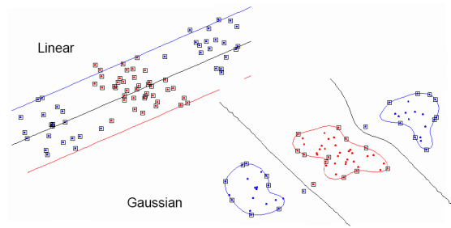

这里举一个**核函数把低维空间映射到高维空间**的例子。

下面这张图位于第一、二象限内。我们关注红色的门，以及“北京四合院”这几个字下面的紫色的字母。我们把**红色的门**上的点看成是“+”数据，**紫色字母**上的点看成是“-”数据，它们的横、纵坐标是两个特征。显然，在这个二维空间内，“+”“-”两类数据不是线性可分的。

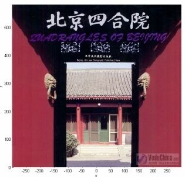

我们现在考虑核函数
$$
K(x,z)=<x,z>^2
$$
，即“内积平方”。

这里面
$$
x=(x_1,x_2),z=(z_1,z_2)
$$
是二维空间中的两个点。

这个核函数对应着一个二维空间到三维空间的映射，它的表达式是：
$$
\phi(x)=(x_1^2,\sqrt{2}x_1x_2,x_2^2)
$$
可以验证，
$$
\begin{aligned}
<\phi(x), \phi(z)>&=<(x_1^2,\sqrt{2}x_1x_2,x_2^2),(z_1^2,\sqrt{2}z_1z_2,z_2^2)>\\
&=x_1^2z_1^2+2x_1x_2z_1z_2+x_2^2z_2^2\\
&=(x_1z_1+x_2z_2)^2\\
&=<x,z>^2\\
&=K(x,z)\\
\end{aligned}
$$
在Φ的映射下，原来二维空间中的图在三维空间中的像是这个样子：

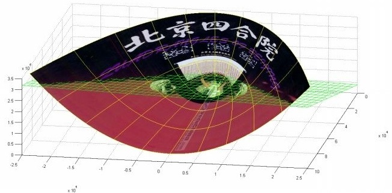

（前后轴为x轴，左右轴为y轴，上下轴为z轴）

注意到绿色的平面可以完美地分割红色和紫色，也就是说，两类数据在三维空间中变成线性可分的了。

而三维中的这个判决边界，再映射回二维空间中是这样的：

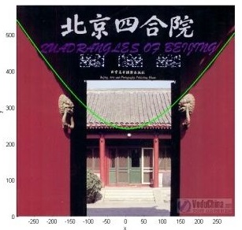

这是一条**双曲线，它不是线性的**。

核函数的作用就是**隐含着一个从低维空间到高维空间的映射**，而这个映射可以**把低维空间中线性不可分的两类点变成线性可分**的。

当然，举的这个具体例子强烈地依赖于数据在原始空间中的位置。
事实中使用的核函数往往比这个例子复杂得多。它们对应的映射并不一定能够显式地表达出来；它们映射到的高维空间的维数也比我举的例子（三维）高得多，甚至是无穷维的。这样，就可以期待原来并不线性可分的两类点变成线性可分的了。

在实用中，很多使用者都是盲目地试验各种核函数，并扫描其中的参数，选择效果最好的。至于什么样的核函数适用于什么样的问题，大多数人都不懂。

### 核函数的本质

上面说了这么一大堆，读者可能还是没明白核函数到底是个什么东西？再简要概括下，即以下三点： 

* 实际中，我们会经常遇到线性不可分的样例，此时，我们的常用做法是把样例特征映射到高维空间中去(如上文2.2节最开始的那幅图所示，映射到高维空间后，相关特征便被分开了，也就达到了分类的目的)；
* 但进一步，如果凡是遇到线性不可分的样例，一律映射到高维空间，那么这个维度大小是会高到可怕的(如上文中19维乃至无穷维的例子)。那咋办呢？
* 此时，核函数就隆重登场了，核函数的价值在于它虽然也是将特征进行从低维到高维的转换，但核函数绝就绝在它事先在低维上进行计算，而将实质上的分类效果表现在了高维上，也就如上文所说的避免了直接在高维空间中的复杂计算。

### 核技巧在支持向量空间中的应用

这里首先要明白：kernel在SVM中的应用真心只是冰山一角，做kernel的人基本不关心在SVM上怎么用的问题，就像用SVM的人也不关心kernel是啥一样。kernel和SVM完全是两个正交的概念，早在SVM提出以前，reproducing kernel Hilbert space（RKHS）的应用就比较广泛了。（更详细的说明点[这里](https://www.zhihu.com/question/24627666/answer/35507744)）

**我们注意到在线性支持向量机的对偶问题中，无论是目标函数还是决策函数（分离超平面）都只涉及输入实例与实例之间的内积。**

**在对偶问题的目标函数中的内积xi·xj可以用核函数K(xi,xj)=Φ(xi)·Φ(xj)来代替**。此时目标函数成为
$$
W(\alpha)=\frac{1}{2}\sum_{i=1}^N\sum_{j=1}^N\alpha_i\alpha_jy_iy_jK(x_i,x_j)-\sum_{i=1}^N\alpha_i
$$
同样，分类决策函数中的内积也可以用核函数代替，则分类决策函数成为f
$$
\begin{aligned}
f(x)&=\text{sign}\left( \sum_{i=1}^{N_s}\alpha_i^*y_i\phi(x_i)\cdot\phi(x)+b^* \right)\\
&=\text{sign}\left( \sum_{i=1}^{N_s}\alpha_i^*y_iK(x_i,x)+b^* \right)
\end{aligned}
$$
这等价于**经过映射函数Φ将原来的输入空间变换到一个新的特征空间，将输入空间中的内积xi·xj变换为特征空间中的内积Φ(xi)·Φ(xj)，在新的特征空间里从训练样本中学习线性支持向量机**，当映射函数是非线性函数时，学习到的含有核函数的支持向量机是非线性分类模型。

也就是说，在核函数K(x,z)给定的条件下，可以利用解线性分类问题的方法求解非线性分类问题的支持向量机。**学习是隐式地在特征空间中进行的，不需要显式地定义特征空间和映射函数**。这样的技巧成为**核技巧**，它是巧妙地**利用线性分类学习方法与核函数解决非线性问题**的技术。在实际应用中，往往**依赖领域知识直接选择核函数**，核函数选择的有效性需要通过实验验证。

最后用一个例子举例说明下核函数解决非线性问题的直观效果。

假设现在你是一个农场主，圈养了一批羊群，但为预防狼群袭击羊群，你需要搭建一个篱笆来把羊群围起来。但是篱笆应该建在哪里呢？你很可能需要依据牛群和狼群的位置建立一个“分类器”，比较下图这几种不同的分类器，我们可以看到SVM完成了一个很完美的解决方案。

这个例子从侧面简单说明了SVM使用非线性分类器的优势，而逻辑模式以及决策树模式都是使用了直线方法。

## （正定）核函数有效性判定

这里先提前说明一个**Gram矩阵的概念**，接下来会用到。什么是Gram矩阵？

**Gram矩阵定义**：n维欧式空间中任意k(k≤n)个向量α1,α2,...,αk的内积欧组成的矩阵
$$
\begin{aligned}
\bigtriangleup(\alpha_1,\alpha_2,...,\alpha_k)=
\begin{bmatrix}
(\alpha_1,\alpha_1)&  (\alpha_1,\alpha_2)& ... & (\alpha_1,\alpha_k)\\ 
(\alpha_2,\alpha_1)&  (\alpha_2,\alpha_2)& ... & (\alpha_2,\alpha_k)\\ 
...& ...& ... & ...\\ 
(\alpha_k,\alpha_1)&  (\alpha_k,\alpha_2)& ... & (\alpha_k,\alpha_k)\\ 
\end{bmatrix}
\end{aligned}
$$
称为k个向量α1,α2,...,αk的格拉姆（Gram）矩阵，它的行列式称为Gram行列式。

举例：正例样本点是x1=(3, 3)T，x2=(4, 3)T，负例样本点是x3=(1, 1)T，则Gram矩阵为
$$
\begin{aligned}
\bigtriangleup(\alpha_1,\alpha_2,...,\alpha_k)=
\begin{bmatrix}
18&  21&6\\ 
21&  25&7\\ 
6&  7& 2\\ 
\end{bmatrix}
\end{aligned}
$$

---

已知映射函数Φ，可以通过Φ(x)和Φ(z)的内积求得核函数K(x,z)。**不用构造映射Φ(x)能否直接判断一个给定的函数K(x,z)是不是核函数？**或者说，函数K(x,z)满足什么条件才能成为核函数？

本节叙述正定核的充要条件。**通常所的核函数就是正定核函数**。

问题：给定一个函数K(x,z)，我们能否使用K(x,z)来替代计算=Φ(x)·Φ(z)。也就是说，是否能够找出一个Φ，使得对于所有的x和z，都有K(x,z)=Φ(x)·Φ(z)？

比如给出了
$$
K(x,z)=(x^Tz)^2
$$
，能否认为K(x,z)是一个有效的核函数？

下面来解决这个问题：

给定m个训练样本
$$
\{ x^{(1))}, x^{(2)},...,x^{(m)} \}
$$
，每一个x(i)对应一个特征向量。那么，我们可以将任意两个x(i)和x(j)带入K(x,z)中，计算得到
$$
K_{ij}=K(x^{(i)},x^{(j)})
$$
。i可以从1到m，j可以从1到m，这样可以计算出mxm的核函数矩阵（Kernel Matrix）。为了方便，我们将核函数矩阵和K(x,z)都使用K来表示。

如何假设K有效的核函数，那么根据核函数定义
$$
K_{ij}=K(x^{(i)},x^{(j)})=\phi(x^{(i)})^T\phi(x^{(j)})=\phi(x^{(j)})^T\phi(x^{(i)})=K(x^{(j)},x^{(i)})=K_{ji}
$$
可见，**矩阵K应该是个对称阵**。

接下来**让我们得出一个更强的结论吧**。首先使用符号Φk(x)来表示映射函数Φ(x)的第k维属性值。那么对于任意向量z，得
$$
\begin{aligned}
z^TKz&=\sum_i\sum_jz_iK_{ij}z_j\\
&=\sum_i\sum_jz_i\phi(x^{(i)})^T\phi(x^{(j)})z_j\\
&=\sum_i\sum_jz_i\sum_k\phi_k(x^{(i)})\phi_k(x^{(j)})z_j\\
&=\sum_k\sum_i\sum_jz_i\phi_k(x^{(i)})\phi_k(x^{(j)})z_j\\
&=\sum_k\left( \sum_i z_i\phi_k(x^{(i)}) \right)^2\\
&\geqslant 0\\
\end{aligned}
$$
从这个公式我们可以看出，如果K是个有效的核函数（即K(x,z)和Φ(x)·Φ(z)等价），那么，在训练集上得到的核函数K应该是半正定的（K≥0）

这样我们就得到**成为一个核函数的必要条件**：

**K是有效的核函数 ==> 核函数矩阵K是对称半正定的**。

幸运的是，**这个条件也是充分的**，由Mercer定理来表达。

>**Mercer定理**：
>
>如果函数K是R^nxR^n上的映射（也就是从两个n维向量映射到实数域）。那么如果K是一个有效核函数（也称为Mercer核函数），那么当且仅当对于训练样例\{x^(1), x^(2), ... ,x^(m)\}，其相应的核函数矩阵是对称半正定的。

即，由Mercer定理我们知道，当且仅当核函数矩阵K是对称半正定的，K才是一个有效核函数。

关于 Mercer's theorem 的证明超出了这篇文章的范畴，有兴趣的同学可以自己查找相关资料或者戳这里 [CLT2008S-lecture18.pdf](http://web.iitd.ac.in/~sumeet/CLT2008S-lecture18.pdf) 了解如何证明其充分性。

Mercer定理表明为了证明K是有效的核函数，那么我们不用去寻找Φ，而只需要在训练集上求出各个Kij，然后判断矩阵K是否是半正定（使用左上角主子式大于等于零等方法）即可。

许多其他的教科书在Mercer定理证明过程中使用了L2数和再生希尔伯特空间等概念，但在特征是n维的情况下，这里给出的证明是等价的。

使用SVM的很多人甚至都不知道这个Mercer定理，也不关心它；有些不满足该条件的函数也被拿来当核函数用。

**这里为什么要求核矩阵是半正定的呢？因为在svm里面核函数的作用是计算两个数据点在另一个高维空间的inner product，而核函数是半正定的话能保证这个高维空间的存在，也就是保证计算得到的核函数的值真的是在某一个空间里的inner product。**

核函数不仅仅用在SVM上，但凡在一个模型后算法中出现了\<x,z\>，我们都可以常使用K(x,z)去替换，这可能能够很好地改善我们的算法。

总结一下上面的证明过程，我们有

**正定核的充要条件**

设K：XxX→R是对称函数，则K(x,z)为正定核函数的充要条件是对任意xi∈X，i=1,2,...,m，K(x,z)对应的Gram矩阵：
$$
K=\left[ K(x_i,x_j) \right]_{m\times m}
$$
是半正定矩阵。

注意：这里没有对称的要求，因为这是正定核，不是Mercer核，正定核比Mercer核更具一般性。

上述定理给出了正定核的充要条件，因此可以作为正定核，即核函数的另一定义。

**正定核的等价定义**

设X⊆R^n，K(x,z)是定义在XxX上的对称函数，如果对任意xi∈X，i=1,2,...,m，K(x,z)对应的Gram矩阵
$$
K=\left[ K(x_i,x_j) \right]_{m\times m}
$$
是对称半正定矩阵，则称K(x,z)是正定核。

这一定义在构造核函数时很有用，但对于一个具体函数K(x,z)来说，**检验它是否为半正定核函数并不容易**，因为要求要对任意有限输入集\{x1, x2,...,xm\}验证K对应的Gram矩阵是否为半正定的，这不容易啊。**在实际问题中往往应用已有的核函数**。

另外，**由Mercer定理可以得到Mercer核，正定核比Mercer核更具有一般性**。

## 常用核函数

我们可以自己构造一个核函数，但是往往比较复杂，因为我们要证明k是对称的、K是半正定的这两个充分必要条件。所以，我们往往是用已经有的有效的核函数去解决问题。

在支持向量机中常用的几种核函数是

* 线性核
  $$
  K(x,z)=x^Tz
  $$

* 多项式核（Polynomial Kernel）
  $$
  K(x,z)=(x^Tz+1)^p
  $$

* 径向基函数核(Radial basis function kernel，又叫高斯核，简称 RBF）
  $$
  K(x,z)=\text{exp}\left( -\frac{||x-z||^2}{2\sigma^2} \right)
  $$

* 拉普拉斯核
  $$
  K(x,z)=\text{exp}\left( -\frac{||x-z||}{\sigma} \right)
  $$

* 逻辑核（ Sigmoid Kernel）
  $$
  K(x,z)=\text{tanh}(\beta x^Tz+\theta)
  $$

关于核方法的理论部分涉及到泛函分析、微积分等等，水比较深，推荐一本书：《Kernel Methods for Pattern Analysi》(模式分析的核方法)，作者是：John Shawe-Taylor和Nello Cristianini 。

### 线性核

$$
K(x,z)=x^Tz
$$

线性核，实际上就是原始空间中的内积。这个核存在的主要目的是使得“映射后空间中的问题”和“映射前空间中的问题”两者在形式上统一起来了(意思是说，咱们有的时候，写代码，或写公式的时候，只要写个模板或通用表达式，然后再代入不同的核，便可以了，于此，便在形式上统一了起来，不用再分别写一个线性的，和一个非线性的)。

### 多项式核函数

$$
K(x,z)=(x^Tz+1)^p
$$

该空间的维度是
$$
\binom{m+d}{d}
$$
，其中m是原始空间的维度。（求解方法点击[这里](http://zhidao.baidu.com/question/16706714.html)）。

多项式核函数的低维到高维的映射函数为
$$
\begin{aligned}
K(x,z)&=(x^Tz+c)^2\\
&=\sum_{i=1}^n\sum_{j=1}^n(x_ix_j)(z_iz_j)+\sum_{i=1}^n(\sqrt{2c}x_i)(\sqrt{2c}z_i)+c^2
\end{aligned}
$$
对应的映射函数（n=3时）是
$$
\begin{aligned}
\phi(x)=
\begin{bmatrix}
x_1x_1\\ 
x_1x_2\\
x_1x_3\\
x_2x_1\\
x_2x_2\\
x_2x_3\\
x_3x_1\\
x_3x_2\\
x_3x_3\\
\sqrt{2c}x_1\\
\sqrt{2c}x_2\\
\sqrt{2c}x_3\\
c
\end{bmatrix}
\end{aligned}
$$

### 高斯核函数（径向基核函数RBF）

高斯核函数会将原始空间映射到无穷维空间
$$
K(x,z)=\text{exp}\left( -\frac{||x-z||^2}{2\sigma^2} \right)
$$
注：线性核函数是RBF的一个特例。解释点击[这里](https://scholar.google.com/scholar?hl=en&q=Asymptotic+behaviors+of+support+vector+machines+with+Gaussian+kernel&btnG=&as_sdt=1%2C5&as_sdtp=)。

如果x和z很相近（||x-z||≈0），那么核函数值为1，如果x和z相差很大（||x-z||>>0），那么核函数值约等于0。由于这个函数类似于高斯分布，因此称为**高斯核函数**，也叫做**径向基函数(Radial Basis Function 简称RBF)**。**它能够把原始特征映射到无穷维**。

高斯核函数衡量的是向量x和y在无限空间的相似度，当x=y时，K(x,y)=1，表示两个向量完全重合，当||x-y||→∞时，K(x,y)=0，两个向量之间的相似度很小；另一方面，当σ^2的值很小时，核函数的值越有可能趋向于0，向量x和y只有在相当接近的情况下才会被判别为相似，也就是说只有在y邻域相当小的范围内才会被认为是相似于它的向量，这样严苛的条件确保了高精度（低偏差）但是却很容易过拟合（高方差）。

如果σ选得很大的话，高次特征上的权重实际上衰减得非常快，所以实际上（数值上近似一下）相当于一个低维的子空间；反过来，如果σ选得很小，则可以将任意的数据映射为线性可分——当然，这并不一定是好事，因为随之而来的可能是非常严重的过拟合问题。不过，总的来说，通过调控参数σ，高斯核实际上具有相当高的灵活性，也是使用最广泛的核函数之一。下图所示的例子便是把低维线性不可分的数据通过高斯核函数映射到了高维空间：

既然高斯核函数能够比较x和z的相似度，并映射到0到1，回想logistic回归，sigmoid函数可以，因此还有**sigmoid核函数**等等。

这里解释下高斯核函数为什么会将原始空间映射到无穷维空间。
$$
\begin{aligned}
K(x,z)&=\text{exp}\left( -\frac{||x-z||^2}{2\sigma^2} \right)\\
&=\text{exp}( -x^2)\text{exp}( -z^2)\text{exp}(2xz)\quad \text{(ignore constant term)}\\
&=\text{exp}( -x^2)\text{exp}( -z^2)\left( \sum_{i=0}^{\infty}\frac{(2xz)^i}{i!} \right)\quad \text{(Tylor)}\\
&=\sum_{i=0}^{\infty}\left(\text{exp}( -x^2)\text{exp}( -z^2)\sqrt{\frac{2^i}{i!}}\sqrt{\frac{2^i}{i!}}x^iz^i\right)\\
&=\phi(x)^T\phi(z)\\
\end{aligned}
$$
由上式，显然可得高斯核的映射函数
$$
\phi(x)=\text{exp}( -\frac{1}{4\sigma^2})\cdot\text{exp}( -x^2)\cdot\left(1,\sqrt{\frac{2}{1!}}x,\sqrt{\frac{2^2}{2!}}x^2,...\right)
$$
σ过大，为什么高维权重衰减会很快？所有维度的权值都会衰减啊？有待学习！

**RBF核的优点**：

SVM关键是选取核函数的类型，主要有线性内核，多项式内核，径向基内核（RBF），sigmoid核。
这些函数中应用最广的应该就是RBF核了，无论是小样本还是大样本，高维还是低维等情况，RBF核函数均适用，它相比其他的函数有一下优点：

* RBF核函数可以将一个样本映射到一个更高维的空间，而且线性核函数是RBF的一个特例，也就是说如果考虑使用RBF，那么就没有必要考虑线性核函数了。
* 与多项式核函数相比，RBF需要确定的参数要少，核函数参数的多少直接影响函数的复杂程度。另外，当多项式的阶数比较高时，核矩阵的元素值将趋于无穷大或无穷小，而RBF则在上，会减少数值的计算困难。
* 对于某些参数，RBF和sigmoid具有相似的性能。

### 核函数的选取

在不知道特征映射的形式时，我们并不知道什么样的核函数是合适的，而核函数也仅隐式地定义了这个特征空间，于是“核函数选择”称为支持向量机最大的变数。

选择合适的核函数并不是一件容易的事情，因为评估数据点之间的相似度往往需要专业领域的知识，幸运的是大多数情况下高斯核都能取得不错的结果。核函数并不是支持向量机专用的技巧，任何算法只要能写成向量相乘的形式就可以运用核函数进行优化。

**一般用线性核和高斯核**，也就是Linear核与RBF核。需要注意的是需要对数据归一化处理，很多使用者忘了这个小细节

个人经验：

* **RBF kernel**是第一选择，几乎效果都是最好的，一般情况下RBF效果是不会差于Linear，但是时间上RBF会耗费更多。
* 此外，**linear kernel**也有用武之地，（其实linear kernel本身就是RBF的一种特殊情况），因为当features的数量很多的时候，linear kernel的速度优势比较明显。

当然有时间当然最好是都试一遍，看看哪个更符合自己的数据分布特性了。

下面是**吴恩达**的见解：

* 如果Feature的数量很大，跟样本数量差不多，这时候选用LR或者是Linear Kernel的SVM

  如果特征维数很高，往往线性可分（SVM解决非线性分类问题的思路就是将样本映射到更高维的特征空间中），可以采用LR或者线性核的SVM

* 如果Feature的数量比较小，而样本数量很多，需要手工添加一些feature变成第一种情况

  如果样本数量很多，由于求解最优化问题的时候，目标函数涉及两两样本计算内积，使用高斯核明显计算量会大于线性核，所以手动添加一些特征，使得线性可分，然后可以用LR或者线性核的SVM

* 如果Feature的数量比较小，样本数量一般，不算大也不算小，选用SVM+Gaussian Kernel

  如果不满足上述两点，即特征维数少，样本数量正常，可以使用高斯核的SVM

## 非线性支持向量分类机

如上所述，利用核技巧，可以将线性分类的学习方法应用到非线性分类问题上。将线性支持向量机扩展到非线性支持向量机，只需要**将线性支持向量机对偶形式中的内积换成核函数**。

**非线性支持向量机**

从非线性分类训练集，通过和函数与软间隔最大化，或凸二次规划，学习得到的分类决策函数
$$
f(x)=\text{sign}\left( \sum_{i=1}^N\alpha_i^*y_iK(x,x_i)+b^* \right)
$$
称为非线性支持向量，K(x,z)是正定核函数。

下面叙述非线性支持向量机学习算法

**非线性支持向量机学习算法**

输入：训练数据集
$$
T=\{ (x_1,y_1),(x_2,y_2),...,(x_N,y_N) \}
$$
，其中，xi∈X=R^n，yi∈Y=\{+1,-1\}，i=1,2,...,N

输出：分类决策函数。

（1）选取适当的核函数K(x,z)和适当的参数C，构造并求解最优化问题
$$
\begin{aligned}
&\mathop{\text{min}}_{\alpha}\quad \frac{1}{2}\sum_{i=1}^N\sum_{j=1}^N\alpha_i\alpha_jy_iy_jK(x_i, x_j)-\sum_{i=1}^N\alpha_i\\
&\text{s.t.}\ \quad \sum_{i=1}^N\alpha_iy_i=0\\
&\ \ \ \quad \quad 0\leqslant\alpha_i\leqslant C,\ i=1,2,...,N\\
\end{aligned}
$$
求得最优解α\*=(α1\*, α2\*, ... , αN\*)^T。

（2）选择α\*的一个正分量0<αj\*<C，计算
$$
b^*=y_j-\sum_{i=1}^N\alpha_i^*y_iK(x_i, x_j)
$$
（3）构造决策函数：
$$
f(x)=\text{sign}\left( \sum_{i=1}^N\alpha_i^*y_iK(x, x_i)+b^* \right)
$$
当K(x,z)是正定核函数时，上述最优化问题是凸二次规划函数，解是存在的。

# 序列最小最优化算法SMO

[SMO优化算法（Sequential minimal optimization）](https://www.cnblogs.com/jerrylead/archive/2011/03/18/1988419.html)

[理解支持向量机（三）SMO算法](https://blog.csdn.net/shijing_0214/article/details/51017029)

[【分类战车SVM】第六话：SMO算法（像smoke一样简单！）](https://mp.weixin.qq.com/s?__biz=MjM5MDEzNDAyNQ==&mid=207384849&idx=6&sn=872955558bde98e49e11aa70da2c2c97#rd)

终于到SVM的实现部分了。那么神奇和有效的东西还得回归到实现才可以展示其强大的功力。SVM有效而且存在很高效的训练算法，这也是工业界非常青睐SVM的原因。

我们知道，支持向景机的学习问题可以形式化为求解凸二次规划问题。这样的**凸二次规划问题具有全局最优解**，并且有许多最优化算法可以用于这一问题的求解。但是当训练样本容最很大时，这些算法往往变得非常低效，以致无法使用。所以，如何高效地实现支持向量机学习就成为一个重要的问题。目前人们己提出许多快速实现算法，本节讲述其中的序列最小最优化（sequential minimal optimization，SMO）算法，这种算法1998年由Platt提出。

前面讲到，SVM的学习问题可以转化为下面的对偶问题：
$$
\begin{aligned}
&\mathop{\text{min}}_{\alpha}\quad \frac{1}{2}\sum_{i=1}^N\sum_{j=1}^N\alpha_i\alpha_jy_iy_j(x_i\cdot x_j)-\sum_{i=1}^N\alpha_i\\
&\text{s.t.}\ \quad \sum_{i=1}^N\alpha_iy_i=0\\
&\ \ \ \quad \quad 0\leqslant\alpha_i\leqslant C,\ i=1,2,...,N\\
\end{aligned}
$$
在这个问题中，变量是拉格朗日乘子，一个变量αi对应于一个样本(xi,yi)；变量的总数等于训练样本容量N。

上述对偶问题需要满足的KKT条件：
$$
\begin{aligned}
\alpha_i=0&\Rightarrow y^{(i)}(w^Tx^{(i)}+b)\geqslant1\\
\alpha_i=C&\Rightarrow y^{(i)}(w^Tx^{(i)}+b)\leqslant1\\
0<\alpha_i<C&\Rightarrow y^{(i)}(w^Tx^{(i)}+b)=1\\
\end{aligned}
$$
也就是说找到一组αi可以满足上面的这些条件的就是该目标的一个最优解。所以我们的优化目标是找到一组最优的αi\*。一旦求出这些αi\*，就很容易计算出权重向量**w\***和b，并得到分隔超平面了。

这是个凸二次规划问题，它具有全局最优解，一般可以通过现有的工具来优化。但当训练样本非常多的时候，这些优化算法往往非常耗时低效，以致无法使用。从SVM提出到现在，也出现了很多优化训练的方法。其中，非常出名的一个是1982年由Microsoft Research的John C. Platt在论文《Sequential Minimal Optimization: A Fast Algorithm for TrainingSupport Vector Machines》（这也是学习SMO最好的资料）中提出的Sequential Minimal Optimization序列最小化优化算法，简称SMO算法，并成为最快的二次规划优化算法，特别针对线性SVM和数据稀疏时性能更优。SMO算法的思想很简单，它将大优化的问题分解成多个小优化的问题。这些小问题往往比较容易求解，并且对他们进行顺序求解的结果与将他们作为整体来求解的结果完全一致。在结果完全一致的同时，SMO的求解时间短很多。

SMO算法是一种启发式算法，其基本思路是：**如果所有变量的解都满足此最优化问题的KKT条件（Karush-Kuhn-Tucker conditions)，那么这个最优化问题的解就得到了。因为KKT条件是该最优化问题的充分必要条件**。否则，选择两个变量，固定其他变量，针对这两个变量构建一个二次规划问题。这个二次规划问题关于这两个变量的解应该更接近原始二次规划问题的解，因为这会使得原始二次规划问题的目标函数值变得更小。重要的是，这时子问题可以通过解析方法求解，这样就可以大大提高整个算法的计算速度。子问题有两个变量，一个是违反KKT条件最严重的那一个，另一个由约束条件自动确定。如此，SMO算法将原问题不断分解为子问题并对子问题求解，进而达到求解原问题的目的。

注意，子问题的两个变童中只有一个是自由变量。假设α1，α2为两个变最，α3，α4，...，αN固定，那么由上面的等式约束可知
$$
\alpha_1=-y\sum_{i=2}^N\alpha_iy_i
$$
如果α2确定，那么α1也随之确定，所以子问题中同时更新两个变量。因此，我们需要一次选取两个参数做优化，比如α1和α2，此时α1可以由α2和其他参数表示出来。这样回代入W中，W就只是关于α2的函数了，这时候就可以只对α2进行优化了。在这里就是对α2进行求导，令导数为0就可以解出这个时候最优的α2了。然后也可以得到α1。这就是一次的迭代过程，一次迭代只调整两个拉格朗日乘子α1和α2。SMO之所以高效就是因为在固定其他参数后，对一个参数优化过程很高效（对一个参数的优化可以通过解析求解，而不是迭代。虽然对一个参数的一次最小优化不可能保证其结果就是所优化的拉格朗日乘子的最终结果，但会使目标函数向极小值迈进一步，这样对所有的乘子做最小优化，直到所有满足KKT条件时，目标函数达到最小）。

总结下来是：

重复下面过程直到收敛\{

（1）选择两个拉格朗日乘子αi和αj；

（2）固定其他拉格朗日乘子αk(k不等于i和j)，只对αi和αj优化w(**α**);

（3）根据优化后的αi和αj，更新截距b的值；

\}

整个SMO算法包括两个部分：

* 求解两个变量二次规划的解析方法
* 选择变量的启发式方法

在深入SMO算法之前，我们先来了解下坐标下降这个算法，SMO其实基于这种简单的思想的。

## 坐标下降（上升）法

假设要求解下面的优化问题：
$$
\mathop{\text{max}}_{\alpha}W(\alpha_1,\alpha_2,...,\alpha_m)
$$
在这里，我们需要求解m个变量αi，一般来说是通过梯度下降（这里是求最大值，所以应该叫上升）等算法每一次迭代对所有m个变量αi也就是α向量进行一次性优化。通过误差每次迭代调整α向量中每个元素的值。而坐标上升法（坐标上升与坐标下降可以看做是一对，坐标上升是用来求解max最优化问题，坐标下降用于求min最优化问题）的思想是每次迭代只调整一个变量αi的值，其他变量的值在这次迭代中固定不变。
$$
\begin{aligned}
&\text{Loop until convergence:\{}\\
&\quad \quad \text{For i = 1,...,m \{}\\
&\quad \quad \quad \quad \alpha_i:=\text{arg }\mathop{\text{max}}_{\hat{\alpha_i}} W(\alpha_1,...,\alpha_{i-1},\hat{\alpha_{i}},\alpha_{i+1},...,\alpha_m)\\
&\quad \quad \text{\}}\\
&\text{\}}\\
\end{aligned}
$$
最里面语句的意思是固定除αi之外的所有αj(i不等于j)，这时W可看作只是关于αi的函数，那么直接对αi求导优化即可。这里我们进行最大化求导的顺序i是从1到m，可以通过更改优化顺序来使W能够更快地增加并收敛。如果W在内循环中能够很快地达到最优，那么坐标上升法会是一个很高效的求极值方法。

用个二维的例子来说明下坐标下降法：我们需要寻找f(x,y)=x^2+xy+y^2的最小值处的(x\*, y\*)，也就是下图的F\*点的地方。

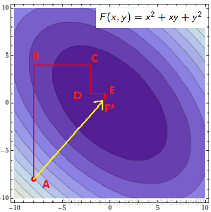

假设我们初始的点是A（图是函数投影到xoy平面的等高线图，颜色越深值越小），我们需要达到F\*的地方。那最快的方法就是图中黄色线的路径，一次性就到达了，其实这个是牛顿优化法，但如果是高维的话，这个方法就不太高效了（因为需要求解矩阵的逆，这个不在这里讨论）。我们也可以按照红色所指示的路径来走。从A开始，先固定x，沿着y轴往让f(x, y)值减小的方向走到B点，然后固定y，沿着x轴往让f(x, y)值减小的方向走到C点，不断循环，直到到达F\*。反正每次只要我们都往让f(x, y)值小的地方走就行了，这样脚踏实地，一步步走，每一步都使f(x, y)慢慢变小，总有一天，皇天不负有心人的。到达F\*也是时间问题。到这里你可能会说，这红色线比黄色线贫富差距也太严重了吧。因为这里是二维的简单的情况嘛。如果是高维的情况，而且目标函数很复杂的话，再加上样本集很多，那么在梯度下降中，目标函数对所有αi求梯度或者在牛顿法中对矩阵求逆，都是很耗时的。这时候，如果W只对单个αi优化很快的时候，坐标下降法可能会更加高效。

## 两个变量二次规划的求解方法

不失一般性，假设选择的两个变量是α1，α2，其他变量αi(i=3,4,...,N)是固定的，于是SMO的最优化问题
$$
\begin{aligned}
&\mathop{\text{min}}_{\alpha}\quad \frac{1}{2}\sum_{i=1}^N\sum_{j=1}^N\alpha_i\alpha_jy_iy_j(x_i\cdot x_j)-\sum_{i=1}^N\alpha_i\\
&\text{s.t.}\ \quad \sum_{i=1}^N\alpha_iy_i=0\\
&\ \ \ \quad \quad 0\leqslant\alpha_i\leqslant C,\ i=1,2,...,N\\
\end{aligned}
$$
其指令的两个变量的子问题可以写成：
$$
\begin{aligned}
&\mathop{\text{min}}_{\alpha_1,\alpha_2}\quad  W(\alpha_2,\alpha_2)=\frac{1}{2}K_{11}\alpha_1^2+\frac{1}{2}K_{22}\alpha_2^2+y_1y_2K_{12}\alpha_1\alpha_2\\
&\ \ \quad \quad \quad \quad  \quad \quad \quad \quad -(\alpha_1+\alpha_2)+y_1\alpha_1\sum_{i=3}^Ny_i\alpha_iK_{i1}+y_2\alpha_2\sum_{i=3}^Ny_i\alpha_iK_{i2}\\
&\text{s.t.}\ \quad \alpha_1y_1+\alpha_2y_2=-\sum_{i=3}^Ny_i\alpha_i=\zeta\\
&\ \ \ \quad \quad 0\leqslant\alpha_i\leqslant C,\ i=1,2\\
\end{aligned}
$$

其中，Kij=K(xi,yi)，i,j=1,2,...,N，ζ是常数，上式的优化目标函数中省略了不含是α1，α2的常数项。

为了求解两个变量的二次规划问题，首先分析约束条件，然后在此约束条件下求极小。

由于只有两个变量(α1, α2)，约束可以用二维空间的图形表示：

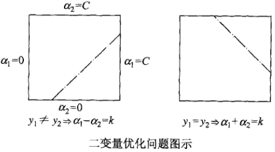

上式（SMO优化问题）的不等式约束使得(α1, α2)在盒子[0, C]x[0, C]内，等式约束使得(α1, α2)在平行于盒子[0, C]x[0, C]的对角线的直线上。因此要**求的是目标函数在一条平行于对角线的线段上的最优值**。这使得**两个变量的最优化问题成为实质上的单变量的最优化问题**，不妨考虑为变量α2的最优化问题。

假设问题的初始可行解为α1(old)，α2(old)，最优解为α1(new)，α2(new)，并且假设在沿着约束方向未经剪辑时α2的最优解为α2(new,unc)。

由于α2(new)需满足不等式约束，所以最优值α2(new)的取值范围必须满足条件
$$
L\leqslant\alpha_2^{new}\leqslant H
$$
其中，L与H是α2(new)所在对角线断点的界。如果y1≠y2（如上图左图所示），则
$$
L=\text{max}(0,\alpha_2^{old}-\alpha_1^{old}),\quad H=\text{min}(C,C+\alpha_2^{old}-\alpha_1^{old})
$$
如果y1=y2（如上图右图所示），则
$$
L=\text{max}(0,\alpha_2^{old}+\alpha_1^{old}-C),\quad H=\text{min}(C,\alpha_2^{old}+\alpha_1^{old})
$$
下面，首先求沿着约束方向未经剪辑即未考虑约束时α2的最优解α2(new,unc)；然后再求剪辑后α2的解α2(new)。我们用定理来叙述这个结果。为了叙述简单，记
$$
g(x)=\sum_{i=1}^N\alpha_iy_iK(x_i,x)+b
$$
令
$$
E_i=g(x_i)-y_i=\left( \sum_{j=1}^N\alpha_jy_jK(x_j,x_i)+b \right)-y_i,\quad i=1,2
$$
当i=1,2时，Ei为函数g(x)对输入xi的预测值与真实值输出yi之差。

**定理**

上述最优化问题沿着约束方向未经剪辑时的解是
$$
\alpha_2^{\text{new,unc}}=\alpha_2^{\text{old}}+\frac{y_2(E_1-E_2)}{\eta}
$$
其中，
$$
\eta=K_{11}+K_{22}-2K_{12}=||\phi(x_!)-\phi(x_2)||^2
$$
Φ(x)是输入空间到特征空间的映射，Ei，i=1,2，上面已经给出。

经剪辑后α2的解是
$$
\begin{aligned}
\alpha_2^{\text{new}}=
\left\{\begin{matrix}
&H, &\alpha_2^{\text{new,unc}}>H\\
&\alpha_2^{\text{new,unc}},&L\leqslant\alpha_2^{\text{new,unc}}\leqslant H\\ 
&L, &\alpha_2^{\text{new,unc}}<L\\
\end{matrix}\right.
\end{aligned}
$$
由α2(new)求得α1(new)是
$$
\alpha_1^{\text{new}}=\alpha_1^{\text{old}}+y_1y_2(\alpha_2^{\text{old}}-\alpha_2^{\text{new}})
$$
**证明**

引进记号
$$
v_i=\sum_{j=3}^N\alpha_jy_jK(x_i,x_j)=g(x_i)-\sum_{j=1}^2\alpha_jy_jK(x_i,x_j)-b,\quad i=1,2
$$
目标函数可以写成
$$
\begin{aligned}
W(\alpha_1,\alpha_2)=&\frac{1}{2}K_{11}\alpha_1^2+\frac{1}{2}K_{22}\alpha_2^2+y_1y_2K_{12}\alpha_1\alpha_2\\
&-(\alpha_1+\alpha_2)+y_1v_1\alpha_1+y_2v_2\alpha_2\\
\end{aligned}
$$
由α1y1=ζ-α2y2及yi^2=1，可将α1表示为
$$
\alpha_1=(\zeta-y_2\alpha_2)y_1
$$
带入上上式，得到只是α2的函数的目标函数：
$$
\begin{aligned}
W(\alpha_2)=&\frac{1}{2}K_{11}(\zeta-\alpha_2y_2)^2+\frac{1}{2}K_{22}\alpha_2^2+y_2K_{12}(\zeta-\alpha_2y_2)\alpha_2\\
&-(\zeta-\alpha_2y_2)y_1-\alpha_2+v_1(\zeta-\alpha_2y_2)+y_2v_2\alpha_2\\
\end{aligned}
$$
上式对α2求导数
$$
\begin{aligned}
\frac{\partial W}{\partial \alpha_2}=&K_{11}\alpha_2+K_{22}\alpha_2-2K_{12}\alpha_2\\
&-K_{11}\zeta y_2+K_{12}\zeta y_2+y_1y_2-1-v_1y_2+y_2v_2
\end{aligned}
$$
令其为0，得到
$$
\begin{aligned}
(K_{11}+K_{22}-2K_{12})\alpha_2=&y_2(y_2-y_1+\zeta K_{11}-\zeta K_{12}+v_1-v_2)\\
=&y_2[ y_2-y_1+\zeta K_{11} -\zeta K_{12}+\left( g(x_1)-\sum_{j=1}^2y_j\alpha_jK_{1j}-b \right)\\
&-\left( g(x_2)-\sum_{j=1}^2y_j\alpha_jK_{2j}-b \right)]
\end{aligned}
$$
将
$$
\zeta=\alpha_1^{\text{old}}y_1+\alpha_2^{\text{old}}y_2
$$
代入，得到
$$
\begin{aligned}
(K_{11}+K_{22}-2K_{12})\alpha_2^{\text{new,unc}}=&y_2((K_{11}+K_{22}-2K_{12})\alpha_2^{\text{old}}y_2+y_2-y_1+g(x_1)-g(x_2))\\
&=(K_{11}+K_{22}-2K_{12})\alpha_2^{\text{old}}+y_2(E_1-E_2)
\end{aligned}
$$
将
$$
\eta=K_{11}+K_{22}-2K_{12}
$$
代入，于是得到
$$
\alpha_2^{\text{new,unc}}=\alpha_2^{\text{old}}+\frac{y_2(E_1-E_2)}{\eta}
$$
要使其满足不等式约束必须将其限制在区间[L,H]内，从而得到α2(new)的表达式（就是上面的定理）。具体求解如下：

由SMO的优化问题的等式约束
$$
\alpha_1y_1+\alpha_2y_2=\zeta
$$
得到
$$
\begin{aligned}
&\alpha_1^{\text{new}}y_1+\alpha_2^{\text{new}}y_2=\alpha_1^{\text{old}}y_1+\alpha_2^{\text{old}}y_2\\
\Rightarrow &\alpha_1^{\text{new}}=y_1(\alpha_1^{\text{old}}y_1+\alpha_2^{\text{old}}y_2-\alpha_2^{\text{new}}y_2)\\
\Rightarrow &\alpha_1^{\text{new}}=\alpha_1^{\text{old}}+y_1y_2(\alpha_2^{\text{old}}-\alpha_2^{\text{new}})\\
\end{aligned}
$$
于是就得到了SMO的优化问题的解
$$
(\alpha_1^{\text{new}},\alpha_2^{\text{new}})
$$

### α2须取临界值的情况

大部分情况下，有
$$
\eta=K_{11}+K_{22}-2K_{12}>0
$$
。但是在如下几种情况下，α2(new)需要取临界值L或者H。

* η<0，当核函数K不满足Mercer定理时，K矩阵负定
* η=0，样本x1与x2输入特征相同

也可以如下理解，对SMO的优化问题的目标值W(α1,α2)求二阶导数就是η=K11+K22-2K12

* 当η<0时，目标函数W为凸函数，没有极小值，极值在定义域边界处取得
* 当η=0时，目标函数W为单调函数，同样在边界处取极值

计算方法：

即把α2(new)=L和α2(new)=H分别带入
$$
\alpha_1^{\text{new}}=\alpha_1^{\text{old}}+y_1y_2(\alpha_2^{\text{old}}-\alpha_2^{\text{new}})
$$
中，计算出α1(new)=L1和α1(new)=H1，如下式所示：
$$
\begin{aligned}
&L1=\alpha_1^{\text{old}}+y_1y_2(\alpha2^{\text{old}}-L)\\
&H1=\alpha_1^{\text{old}}+y_1y_2(\alpha2^{\text{old}}-H)\\
\end{aligned}
$$
然后将(α1(new)=L1, α2(new)=L)和(α1(new)=H1, α2(new)=H)带入目标函数W内，比较W(α1(new)=L1, α2(new)=L)和W(α1(new)=H1, α2(new)=H)的大小。 α2取小的函数值对应的边界点。

## 变量的选择方法

SMO算法在每个子问题中选择两个变量优化，其中至少一个变量是违反KKT条件的。

### 第一个变量的选择

SMO称选择呢第一个变量的过程为外层循环。**外层循环在训练样本中选取违反KKT条件最严重的样本点**，并将其对应的变量作为第1个变量。具体地，检验训练样本点(xi,yi)是否满足KKT条件，即
$$
\begin{aligned}
\alpha_i=0&\Leftrightarrow  y_ig(x_i)\geqslant1\\
0<\alpha_i<C&\Leftrightarrow  y_ig(x_i)=1\\
\alpha_i=C&\Leftrightarrow  y_ig(x_i)\leqslant1\\
\end{aligned}
$$
其中，
$$
g(x_i)=\sum_{j=1}^N\alpha_jy_jK(x_i,x_j)+b
$$
该检验是在ε范围内进行的。在检验过程中，**外层循环首先优先遍历所有满足条件0<αi<C的样本点，即在将间隔边界上的支持向量点，检验他们是否满足KKT条件**，因为在界上（αi为0或C）的样例对应的系数αi一般不会更改。如果这些样本点都满足KKT 条件，那么遍历整个训练集。

### 第二个变量的选择

SMO称选择第二个变量的过称谓内层循环。假设在外层循环中已经找到第1个变量α1，现在要在内层循环中找到第2个变量α2。**第二个变量选择的标准是希望能使α2有足够大的变化**。

由下式
$$
\alpha_2^{\text{new,unc}}=\alpha_2^{\text{old}}+\frac{y_2(E_1-E_2)}{\eta}
$$
可知，α2(new)是依赖于|E1-E2|的，为了加快计算速度，以中间打的做法是选择α2，使其对应的|E1-E2|最大。因为α1已定，E1也确定了。如果E1是正的，那么选择最小的Ei作为E2；如果E1是负的，那么选择最大的Ei作为E2。为了节省计算时间，将所有的Ei值保存在一个列表中。

在特殊情况下，如果内层循环通过以上方法选择的α2不能使目标函数有足够的下降，那么采用一下启发式规则继续选择α2。遍历在间隔边界上的支持向量点，依次将其对应的变量作为α2试用，知道目标函数有足够的下降。若找不到合适的α2，那么遍历训练数据集；若仍然找不到合适的α2，则放弃第一个α1，再通过外层循环寻求另外的α1。

至此，迭代关系式出了b的推导式以外，都已经推出。

### 计算阈值b和插值Ei

在每次完成两个变量的优化后，都要重新计算阈值b，也就是说b每一步都要更新，因为前面的KKT条件指出αi和yi·g(xi)的关系，而g(xi)和b有关，在每一步计算出αi后，根据KKT条件来调整b。

当0<α1(new)<C时，由KKT条件可知：
$$
\sum_{i=1}^N\alpha_iy_iK_{i1}+b=y_1
$$
于是，
$$
b_1^{\text{new}}=y_1-\sum_{i=3}^N\alpha_iy_iK_{i1}-\alpha_1^{\text{new}}y_1K_{11}-\alpha_2^{\text{new}}y_2K_{21}
$$
由前面的E1定义
$$
E_i=g(x_i)-y_i=\left( \sum_{j=1}^N\alpha_jy_jK(x_j,x_i)+b \right)-y_i,\quad i=1,2
$$
有
$$
E_i=\sum_{i=3}^N\alpha_iy_iK_{i1}+\alpha_1^{\text{old}}y_1K_{11}+\alpha_2^{\text{old}}y_2K_{21}+b^{\text{old}}-y_1
$$
计算b1(new)的上上上式的前两项由上式可写成：
$$
y_1-\sum_{i=3}^N\alpha_iy_iK_{i1}=-E_i+\alpha_1^{\text{old}}y_1K_{11}+\alpha_2^{\text{old}}y_2K_{21}+b^{\text{old}}
$$
并将上式带入计算b1(new)的式子（上上上上式）中，可得
$$
b_1^{\text{new}}=-E_1-y_1K_{11}(\alpha_1^{\text{new}}-\alpha_1^{\text{old}})-y_2K_{21}(\alpha_2^{\text{new}}-\alpha_2^{\text{old}})+b^{\text{old}}
$$
同样，如果0<α2(new)<C，那么，
$$
b_2^{\text{new}}=-E_2-y_1K_{12}(\alpha_1^{\text{new}}-\alpha_1^{\text{old}})-y_2K_{22}(\alpha_2^{\text{new}}-\alpha_2^{\text{old}})+b^{\text{old}}
$$
如果α1(new)，α2(new)同时满足条件0<αi(new)<C，i=1,2，那么b1(new)=b2(new)。如果α1(new)，α2(new)是0或者C，那么b1(new)和b2(new)以及它们之间的数都是符合KKT条件的阈值，这时选择它们的中点作为b(new)。

在每次完成两个变量的优化之后，还必须更新对应的Ei值，并将它们保存在列表中，Ei值的更新要用到b(new)值，以及所有支持向量对应的对应的αj：
$$
E_i^{\text{new}}=\sum_Sy_j\alpha_jK(x_i,x_j)+b^{\text{new}}-y_i
$$
其中，S是所有支持向量xj的集合。

**个人理解：注意，每次更新的只有三个变量：αi,Ei(实际上是ui,即当前模型的预测值,因为每个样本点的真实值是不会改变的),b.**

**更新的变量里没有w,因为计算过程中不需要w的参与,我们并不需要计算出w再来计算每个样本点的预测值，因为从w的计算公式可以看出来，只需计算那些支持向量与样本点的内积即可，之所以这样做，而不是计算出w，再计算每个样本点的预测值，是因为引入核函数之后，就不需要，也很难计算w的值了，w对应的将是一个高维向量，计算起来相当麻烦，而且我们用到w的地方全都可以用低维空间的内积和核函数来代替，所以不更新w。**

## 凸优化问题终止条件

SMO算法的基本思路是：如果说有变量的解都满足此最优化问题的KKT条件，那么这个最优化问题的解就得到了。因为KKT条件是该最优化问题的充分必要条件（证明请参考文献）。

所以我们可以监视原问题的KKT条件，所以所有的样本都满足KKT条件，那么就表示迭代结束了。但是由于KKT条件本身是比较苛刻的，所以也需要设定一个容忍值ε，即所有样本在容忍值ε范围内满足KKT条件则认为训练可以结束；当然了，对于对偶问题的凸优化还有其他终止条件，可以参考文献。

## SMO算法

输入：训练数据集T
$$
T=\{ (x_1,y_1),(x_2,y_2),...,(x_N,y_N) \}
$$
其中，xi∈X=R^n，yi∈Y=\{+1,-1\}，i=1,2,...,N，精度ε；

输出：近似解
$$
\hat{\alpha}
$$
（1）取初始值α(0)=0，令k=0；

（2）选取优化变量α1(k),α2(k)，解析求解两个变量的最优化问题（如前面所示），求得最优解α1(k+1)，α2(k+1)，更新α为α(k+1)；

（3）若在精度ε范围内满足停止条件：
$$
\begin{aligned}
&\sum_{i=1}^N\alpha_iy_i=0\\
&0\leqslant\alpha_i\leqslant C,\quad i=1,2,...,N\\
&y_i\cdot g(x_i)=
\left\{\begin{matrix}
&\geqslant 1,\quad &\{ x_i|\alpha_i=0 \}\\ 
&= 1,\quad &\{ x_i|0<\alpha_i<C \}\\ 
&\leqslant 1,\quad &\{ x_i|\alpha_i=C \}\\ 
\end{matrix}\right.
\end{aligned}
$$
其中，
$$
g(x_i)=\sum_{j=1}^N\alpha_jy_jK(x_i,x_j)+b
$$
则转（4），否则令k=k+1，转（2）；

（4）取
$$
\hat{\alpha}=\alpha^{(k+1)}
$$
**建议参看SMO原文的伪代码**

这里再总结下SMO算法：

SMO算法是支持向量机学习的一种快速方法，其特点是不断地将元二次规划问题分解为只有两个变量的二次规划问题，并对子问题进行解析求解，知道所有变量满足KKT条件为止。这样通过启发式的方法得到原二次规划问题的最优解。因为子问题有解析解，所以每次计算子问题都很快，虽然计算子问题次数很多，但在总体上还是高效的。

# SVM的正则化

支持向量机SVM优化目的为寻找一个超平面，使得正负样本能够以最大间隔分离开，从而得到更好的泛化性能，其通过引入核函数来将低维线性不可分的样本映射到高维空间从而线性可分，通过引入惩罚参数C(类似于正则化参数)来对错分样本进行惩罚，从而减少模型复杂度，提高泛化能力，其优化目标如下：
$$
\mathop{min}_{\theta,b}\frac{1}{n}\sum_{i=1}^n\text{max}(1-y_i(\theta^Tx_i+b),0)+\frac{1}{2CN}\theta^T\theta
$$
其中，正则项系数为
$$
\lambda=\frac{1}{2C}
$$
惩罚参数C作用和正则化参数λ作用一致，只是反相关而已。

需要明白以下结论：

* C越大，λ越小，表示对分错样本的惩罚程度越大，正则化作用越小，偏差越小，方差越大，越容易出现过拟合(通俗理解，原本将低维空间映射到5维空间正好线性可分，但是由于惩罚过于严重，任何一个样本分错了都不可原谅，结果系统只能不断提高维数来拟合样本，假设为10维，最终导致映射维数过高，出现过拟合样本现象，数学上称为VC维较大)；
* C越小，λ越大，表示对分错样本的惩罚程度越小，正则化作用越大，偏差越大，方差越小，越容易出现欠拟合(通俗理解，原本将低维空间映射到5维空间正好线性可分，但是由于惩罚过小，分错了好多样本都可以理解，比较随意，结果系统也采用简化版来拟合样本，假设为3维，最终导致映射维数过低，出现欠拟合样本现象，数学上称为VC维较小)。

# 逻辑回归和SVM的区别

[逻辑回归和SVM的区别是什么？各适用于解决什么问题？](https://www.zhihu.com/question/24904422)

[LR与SVM的区别与联系](https://zhuanlan.zhihu.com/p/31403164)

逻辑回归是广义的线性回归，通过S型函数变化而已，取一个阈值作为分类标志，在行业的应用中很多直接用概率值解决放贷或者营销策略，不同概率值使用不同策略，逻辑回归便于实施易于解释都是业务常用的。逻辑回归常用于处理大数据，而SVM则正好相反。

支持向量机通过超平面分割数据，追求的是分类结果。SVM的理论性强，最nb的地方是核函数的引入，可以来逼近非线性目标函数。不过如果非线性的话，工业界GBDT用得更广些。

两者的不同具体表现在：

* 损失函数不一样，逻辑回归的损失函数是log loss，svm的损失函数是hinge loss

  损失函数的不同，导致了逻辑回归侧重于所有点，svm侧重于超平面边缘的点

  即SVM考虑分界面处的局部点（不关心已经确定远离的点），而逻辑回归考虑全局（已经远离的点可能通过调整中间线使其能够更加远离）

* 损失函数的优化方法不一样，逻辑回归用梯度下降法优化，svm用smo方法进行优化

* 对非线性问题的处理方式不同。LR主要靠特征构造，必须组合交叉特征，特征离散化。SVM也可以这样，还可以通过kernel。

* 处理的数据规模不同。**LR一般用来处理大规模的学习问题**。如十亿级别的样本，亿级别的特征。

**为什么逻辑回归和SVM的本质区别在于损失函数？**

逻辑回归和支持向量机之间的区别也经常被问到的，特地找了一些相关资料看了下。

我们先来看一下SVM 和正则化的逻辑回归它们的**损失函数**：
$$
\begin{aligned}
&\text{SVM: } &\frac{1}{n}\sum_{i=1}^n(1-y_i\left[ w_0+x_i^Tw_1 \right])^++\lambda||w_1||/2\\
&\text{Logistic: } &\frac{1}{n}\sum_{i=1}^n-\text{log }g(y_i\left[ w_0+x_i^Tw_1 \right])+\lambda||w_1||/2\\
\end{aligned}
$$
其中，g(z)是Sigmoid函数，即
$$
g(z)=\frac{1}{1+\text{exp}(-z)}
$$
可以将逻辑回归和SVM统一起来：
$$
\text{Both: } \frac{1}{n}\sum_{i=1}^n\text{Loss}(y_i\left[ w_0+x_i^Tw_1 \right])+\lambda||w_1||/2
$$
**也就是说，他们的区别在于逻辑回归采用的是log loss（对数损失函数），SVM采用的是hinge loss（E(z)=max(0,1-z)）。**

也即

* SVM损失函数：
  $$
  \text{Loss}(z)=(1-z)^+
  $$

* LR损失函数：
  $$
  \text{Loss}(z)=\text{log}(1+\text{exp}(-z))
  $$

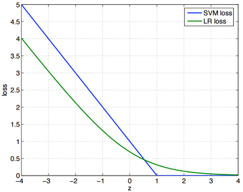

其实，这两个损失函数的目的都是增加对分类影响较大的数据点的权重，减少与分类关系较小的数据点的权重。SVM的处理方法是只考虑**support vectors**，也就是和分类最相关的少数点，去学习分类器。而逻辑回归通过非线性映射，大大减小了离分类平面较远的点的权重，相对提升了与分类最相关的数据点的权重，**两者的根本目的都是一样的**。

svm考虑**局部**（支持向量），而logistic回归考虑**全局**，就像大学里的辅导员和教师间的区别：

>辅导员关心的是挂科边缘的人，常常找他们谈话，告诫他们一定得好好学习，不要浪费大好青春，挂科了会拿不到毕业证、学位证等等，相反，对于那些相对优秀或者良好的学生，他们却很少去问，因为辅导员相信他们一定会按部就班的做好分内的事；而大学里的教师却不是这样的，他们关心的是班里的整体情况，大家是不是基本都理解了，平均分怎么样，至于某个人的分数是59还是61，他们倒不是很在意。

如果给SVM换用其他的Loss函数的话，SVM就不再是SVM了。正是因为Hinge Loss的零区域对应的正是非支持向量的普通样本，从而所有的普通样本都不参与最终超平面的决定，这才是支持向量机最大的优势所在，对训练样本数目的依赖大大减少，而且提高了训练效率。

# 总结

这份SVM的讲义重点概括了SVM的基本概念和基本推导，中规中矩却又让人醍醐灌顶。起初让我最头疼的是拉格朗日对偶和SMO，后来逐渐明白拉格朗日对偶的重要作用是将w的计算提前并消除w，使得优化函数变为拉格朗日乘子的单一参数优化问题。而SMO里面迭代公式的推导也着实让我花费了不少时间。

对比这么复杂的推导过程，SVM的思想确实那么简单。它不再像logistic回归一样企图去拟合样本点（中间加了一层sigmoid函数变换），而是就在样本中去找分隔线，为了评判哪条分界线更好，引入了几何间隔最大化的目标。

之后所有的推导都是去解决目标函数的最优化上了。在解决最优化的过程中，发现了w可以由特征向量内积来表示，进而发现了核函数，仅需要调整核函数就可以将特征进行低维到高维的变换，在低维上进行计算，实质结果表现在高维上。由于并不是所有的样本都可分，为了保证SVM的通用性，进行了软间隔的处理，导致的结果就是将优化问题变得更加复杂，然而惊奇的是松弛变量没有出现在最后的目标函数中。最后的优化求解问题，也被拉格朗日对偶和SMO算法化解，使SVM趋向于完美。

对于非线性SVM：SVM通过一个非线性映射Φ(x)，把样本空间映射到一个高维乃至无穷维的特征空间中（Hilbert空间），使得在原来的样本空间中非线性可分的问题转化为在特征空间中的线性可分的问题．简单地说，就是升维和线性化。作为分类、回归等问题来说，很可能在低维样本空间无法线性处理的样本集，在高维特征空间中却可以通过一个线性超平面实现线性划分（或回归）。一般的升维都会带来计算的复杂化，但SVM方法巧妙地应用核函数的展开定理简化了计算，不需要知道非线性映射的显式表达式。简单来说，SVM是在高维特征空间中建立线性学习机，几乎不增加计算的复杂性，并且在某种程度上避免了“维数灾难”，这一切要归功于核函数的展开和计算理论．

# 参考资料

* 《统计学习方法》李航

本章的结构和大部分内容均参考此书对应章节。

* [支持向量机（三）核函数](https://www.cnblogs.com/jerrylead/archive/2011/03/18/1988406.html)

"对核函数的理解"和“（正定）核函数有效性判定”这两节参考此博客。

* [我所理解的 SVM 2——核函数的应用](https://zhuanlan.zhihu.com/p/24291579)

"对核函数的理解"一节参考此博客。

* [支持向量机通俗导论（理解SVM的三层境界）](https://blog.csdn.net/v_july_v/article/details/7624837)

"对核函数的理解"和“核函数的本质”两节参考此博客。

* [如何理解高斯核函数的公式？](https://www.zhihu.com/question/46587416/answer/343002184)

"高斯核函数"参考了此知乎。

* [SVM的核函数如何选取？](https://www.zhihu.com/question/21883548/answer/19693213)

"核函数的选取"参考了此知乎回答。

* [机器学习算法与Python实践之（四）支持向量机（SVM）实现](https://blog.csdn.net/zouxy09/article/details/17292011)

"SMO算法"参考了此博客。

- [坐标上升/下降算法](https://blog.csdn.net/u010626937/article/details/75044343)

"坐标下降（上升）法"参考了此博客。

* [【机器学习详解】SMO算法剖析](https://blog.csdn.net/luoshixian099/article/details/51227754)

"α2须取临界值的情况"参考了此博客。

* [SMO算法(比较好的讲解)](https://blog.csdn.net/aiaiai010101/article/details/73350990)

"变量的选择方法"最后的个人理解参考了此博客。

* [支持向量机（五）SMO算法](https://www.cnblogs.com/jerrylead/archive/2011/03/18/1988419.html)

"SMO算法"参考了此博客。

* [史上最全面的正则化技术总结与分析--part2](https://zhuanlan.zhihu.com/p/35432128)

“SVM的正则化”参考此知乎专栏文章。

- [支持向量机SVM（一）](https://www.cnblogs.com/jerrylead/archive/2011/03/13/1982639.html)

这份材料从前几节讲的logistic回归出发，引出了SVM，既揭示了模型间的联系，也让人觉得过渡更自然。“逻辑回归和SVM的区别”一节参考了此博客。

* [逻辑回归和SVM的区别是什么？各适用于解决什么问题？](https://www.zhihu.com/question/24904422)

“逻辑回归和SVM的区别”一节参考了此博客。

---

以下待仔细研究：

* [支持向量机通俗导论（理解SVM的三层境界）](https://blog.csdn.net/v_july_v/article/details/7624837)

待看

* [支持向量机SVM（一）](https://www.cnblogs.com/jerrylead/archive/2011/03/13/1982639.html)

这份材料从前几节讲的logistic回归出发，引出了SVM，既揭示了模型间的联系，也让人觉得过渡更自然。

* [攀登传统机器学习的珠峰-SVM (上)](https://zhuanlan.zhihu.com/p/36332083)

111

* [理解SVM的核函数和参数](https://mp.weixin.qq.com/s?__biz=MzU4MjQ3MDkwNA==&mid=2247484495&idx=1&sn=4f3a6ce21cdd1a048e402ed05c9ead91&chksm=fdb699d8cac110ce53f4fc5e417e107f839059cb76d3cbf640c6f56620f90f8fb4e7f6ee02f9&mpshare=1&scene=1&srcid=0522xo5euTGK36CZeLB03YGi#rd)

111

* [规则化和不可分情况处理（Regularization and the non-separable case）](https://www.cnblogs.com/jerrylead/archive/2011/03/18/1988415.html)

正则化可能会用到

* [【分类战车SVM】附录：用Python做SVM模型](https://mp.weixin.qq.com/s?__biz=MjM5MDEzNDAyNQ==&mid=207384849&idx=7&sn=eda3ef452c5b07cf741e8e01e813a516#rd)

这属于项目实践部分，以后有时间了再写吧