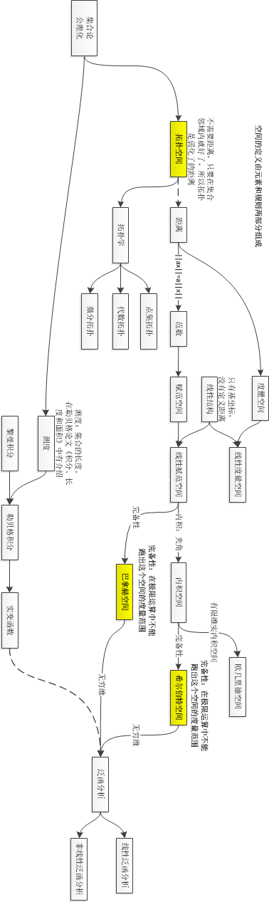

# 希尔伯特空间

- [返回顶层目录](../../SUMMARY.md#目录)
- [返回上层目录](calculus.md)

学过傅立叶展开吗？傅立叶展开是以三角函数为基矢。希尔伯特空间类似，以一个相互正交的函数组为基矢的空间。那么函数就成了这个空间的矢量。函数可以展开为基矢的线性叠加，基矢的系数就相当于矢量的各个分量。

下面用一张图来说明希尔伯特空间是怎么一步步由最基本的集合加上各种规则得到的：

# 参考资料

* [函数空间-上海交通大学公开课：数学之旅](http://open.163.com/special/cuvocw/shuxuezhilv.html)

文中的图就来自于次公开课中的讲述内容。

* [如何理解希尔伯特空间？](https://www.zhihu.com/question/19967778)

文中对希尔伯特空间的理解来自于此。