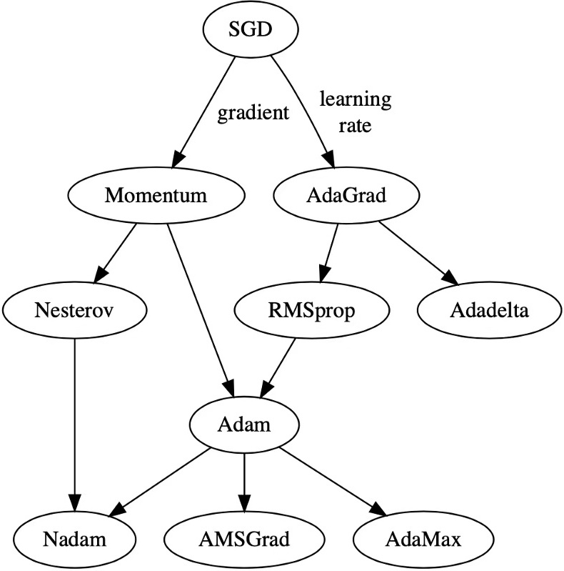

# 梯度下降算法

- [返回顶层目录](../../SUMMARY.md#目录)
- [各类梯度下降算法的演化](#各类梯度下降算法的演化)
- [随机梯度下降SGD](sgd.md)
- [动量法Momentum](momentum.md)
- [牛顿动量Nesterov](nesterov.md)
- [AdaGrad](adagrad.md)
- [RMSprop](rmsprop.md)
- [Adadelta](adadelta.md)
- [Adam](adam.md)
- [Nadam](nadam.md)
- [AMSGrad](amsgrad.md)
- [AdasMax](adamax.md)

# 各类梯度下降算法的演化

# 参考资料

* [Deep Learning 之 最优化方法](https://blog.csdn.net/BVL10101111/article/details/72614711)