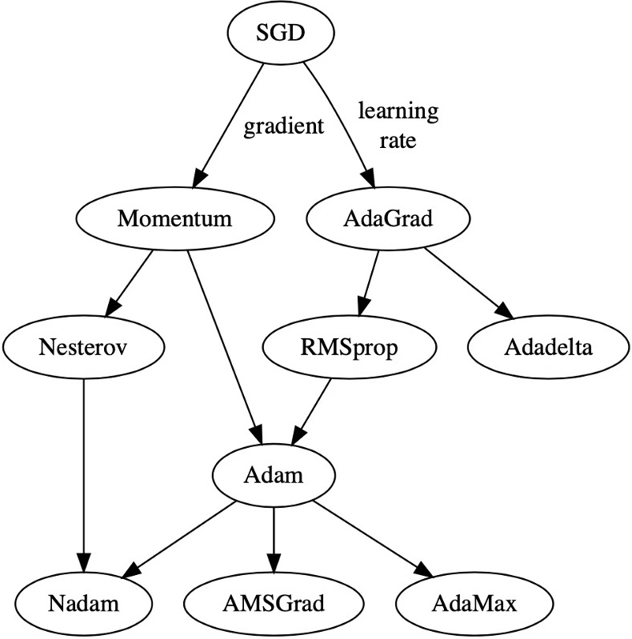
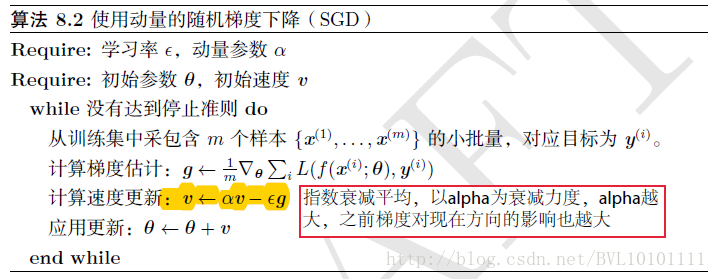
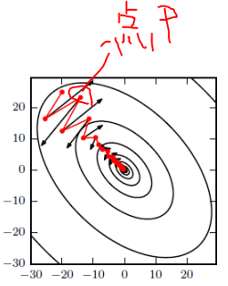

# Momentum动量法

- [返回顶层目录](../../SUMMARY.md#目录)
- [返回上层目录](gradient-descent-algorithm.md)
- [各类梯度下降算法的演化](#各类梯度下降算法的演化)
- [结论](#结论)
- [算法](#算法)
- [动量算法直观效果解释](#动量算法直观效果解释)

# 各类梯度下降算法的演化

# 结论

> 1.动量方法主要是为了解决Hessian矩阵病态条件问题（直观上讲就是梯度高度敏感于参数空间的某些方向）的。
>
> 2.加速学习
>
> 3.一般将参数设为0.5,0.9，或者0.99，分别表示最大速度2倍，10倍，100倍于SGD的算法。
>
> 4.通过速度v，来积累了之间梯度指数级衰减的平均，并且继续延该方向移动：
> $$
> v \leftarrow \alpha v - \epsilon g
> $$
>

# 算法

# 动量算法直观效果解释

如图所示，红色为SGD+Momentum。黑色为SGD。可以看到黑色为典型Hessian矩阵病态的情况，相当于大幅度的徘徊着向最低点前进。

而由于动量积攒了历史的梯度，如点P前一刻的梯度与当前的梯度方向几乎相反。因此原本在P点原本要大幅徘徊的梯度，主要受到前一时刻的影响，而导致在当前时刻的梯度幅度减小。

直观上讲就是，要是当前时刻的梯度与历史时刻梯度方向相似，这种趋势在当前时刻则会加强；要是不同，则当前时刻的梯度方向减弱。

**从另一个角度讲：**

要是当前时刻的梯度与历史时刻梯度方向相似，这种趋势在当前时刻则会加强；要是不同，则当前时刻的梯度方向减弱。

假设每个时刻的梯度g总是类似，那么由$$v \leftarrow \alpha v - \epsilon g$$我们可以直观的看到每次的步长为：
$$
\frac{\epsilon||g||}{1-\alpha}
$$
即当设为0.5,0.9，或者0.99，分别表示最大速度2倍，10倍，100倍于SGD的算法（注意，能这样算的前提是，假设g保持不变，多轮后v的值基本不再变化）。

现在证明每轮的梯度g保持不变时，多轮后v的值基本不再变化：
$$
\begin{aligned}
&v_0 \leftarrow 0\\
&v_1 \leftarrow \alpha v_0-\epsilon g=-\epsilon g\\
&v_2 \leftarrow \alpha v_1-\epsilon g=-\alpha \epsilon g-\epsilon g=-\epsilon g(\alpha + 1)\\
&v_3 \leftarrow \alpha v_2-\epsilon g=-\alpha \epsilon g(\alpha + 1)-\epsilon g=-\epsilon g(\alpha^2 + \alpha + 1)\\
&v_4 \leftarrow \alpha v_2-\epsilon g=-\alpha \epsilon g(\alpha^2 + \alpha + 1)-\epsilon g=-\epsilon g(\alpha^3 + \alpha^2 + \alpha + 1)\\
&\quad\quad ...\\
&v_n \leftarrow \alpha v_{n-1}-\epsilon g=-\epsilon g(\alpha^{n-1} + \alpha^{n-2} + ... + \alpha + 1)\\
\end{aligned}
$$
我们现在看下$$v_{n}/v_{n-1}$$：
$$
\frac{v_n}{v_{n-1}}=\frac{-\epsilon g(\alpha^{n-1} + \alpha^{n-2} + ... + \alpha + 1)}{-\epsilon g(\alpha^{n-2} + \alpha^{n-3} + ... + \alpha + 1)}\approx 1
$$
所以上述假设确实成立。

或者我们直接可以从$$v_{n}/v_{1}$$来看最大速度的倍数：
$$
\begin{aligned}
v_n&=-\epsilon g(\alpha^{n-1} + \alpha^{n-2} + ... + \alpha + 1)\\
&=-\epsilon g(\frac{1-\alpha^n}{1-\alpha})\\
&\approx \frac{-\epsilon g}{1-\alpha}\\
&=\frac{v_1}{1-\alpha}
\end{aligned}
$$
即$$v_{n}$$是$$v_1$$的$$1/(1-\alpha)$$倍。

# 参考资料

* [Deep Learning 最优化方法之Momentum（动量）](https://blog.csdn.net/bvl10101111/article/details/72615621)

本文参考了此博客。

