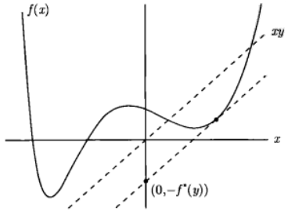
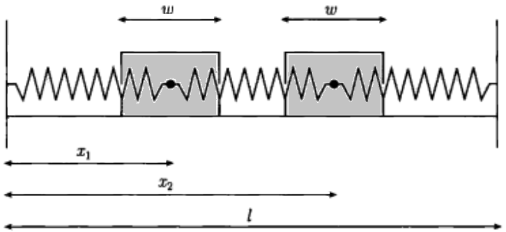

# 凸优化

- [返回顶层目录](../../SUMMARY.md#目录)
- [返回上层目录](numerical-calculation-and-optimization.md)

[理解凸优化](https://mp.weixin.qq.com/s?__biz=MzU4MjQ3MDkwNA==&mid=2247484439&idx=1&sn=4fa8c71ae9cb777d6e97ebd0dd8672e7&chksm=fdb69980cac110960e08c63061e0719a8dc7945606eeef460404dc2eb21b4f5bdb434fb56f92&mpshare=1&scene=1&srcid=0518tlWFr2se8CueI9c0wSTe#rd)


参考：

重要

https://blog.csdn.net/xueyingxue001/article/details/51858074


https://blog.csdn.net/shenxiaolu1984/article/details/78194053?locationNum=3&fps=1


# 凸集


## Jensen不等式


# 凸函数


## 共轭函数




注意，这个函数并不是凸函数。


这里附上图的matlab代码：

```matlab
figure(1)
x = [-10:0.1:17];
y = hanshu(x);
y2 = x;
plot(x,y, 'r', x, y2, 'g', 0*x, y2, 'k', x, 0*x, 'k', x, y2 - y, 'b')
%%
axis([-7 7 -4 15])
figure(2)
axis([-7 7 -4 15])
hold on
for w1 = [-10:0.1:17]
    w0 = hanshu(w1);
    y_ge = w1*x - w0;
    plot(x, y_ge)
end
```

其中，函数y = hanshu(x)的matlab function类型代码为：

```matlab
function [y] = hanshu(x)
w0 = 2.432; w1 = 0.3675; w2 = -0.3701; w3 = 0.003058; w4 = 0.01168;
y = w0 + w1*x + w2*x.^2 + w3*x.^3 + w4*x.^4;
end
```


### 如何求共轭函数


## Fenchel不等式


# 凸优化问题


# 对偶


## 拉格朗日对偶函数


## 拉格朗日对偶问题


## 最优性条件

###互补松弛性

设原问题和对偶问题的最优值都可以达到且相等（即强对偶性成立）。令x\*是原问题的最优解，(λ\*,ν\*)是对偶问题的最优解，这表明
$$
\begin{aligned}
f_0(x^*)&=g(\lambda^*,\mu^*)\\
&=\mathop{\text{inf}}_x\left( f_0(x)+\sum_{i=1}^m\lambda_i^*f_i(x)+\sum_{i=1}^p\mu_i^*h_i(x) \right)\\
&\leqslant f_0(x^*)+\sum_{i=1}^m\lambda_i^*f_i(x^*)+\sum_{i=1}^p\mu_i^*h_i(x) \\
&\leqslant f_0(x^*)
\end{aligned}
$$
第一个等式说明最优对偶间隙为零，第二个等式是对偶函数的定义。第三个不等式是根据Lagrange函数关于x求下确界小于等于其在x=x\*处的值得来。最后一个不等式的成立是因为下式
$$
\begin{aligned}
&\lambda_i^*\geqslant0,\quad f_i(x^*)\leqslant0,\ &i=1,...,m\\
&h_i(x^*)=0,&i=1,...,p
\end{aligned}
$$
。因此，在上面的式子链中，两个不等式取等号。

可以由此得出一些有意义的结论。例如，由于第三个不等式变为等式，我们知道L(x,λ\*,ν\*)关于x求极小时在x\*处取得最小值（Lagrange函数L(x,λ\*,ν\*)也可以有其他最小点；x\*只是其中一个最小点）。

另外一个重要的结论是
$$
\sum_{i=1}^m\lambda_i^*f_i(x^*)=0
$$
事实上，求和项的每一项都非正，因此有
$$
\lambda_i^*f_i(x^*)=0,\quad i=1,...,m
$$
上述条件成为**互补松弛性**；它对任意原问题最优解x\*以及对偶问题最优解(λ\*,ν\*)都成立（当强对偶性成立时）。我们可以将互补松弛条件写成
$$
\lambda_i^*>0\rightarrow f_i(x^*)=0
$$
或者等价地
$$
f_i(x^*)<0\rightarrow \lambda_i^*=0
$$
粗略地讲，上式意味着在最优点处，除了第i个约束起作用的情况（fi(x\*)=0），最优Lagrange乘子的第i项都为零。

### KKT最优性条件

和前面一样，令x\*和(λ\*,ν\*)分别是原问题和对偶问题的某对最优解，**对偶间隙为零（需要满足Slater条件）**。因为L(x,λ\*,ν\*)关于x求极小在x\*处取得最小值，因此函数在x*处的导数必须为零，即
$$
\triangledown f_0(x^*)+\sum_{i=1}^m\lambda_i^*\triangledown f_i(x^*)+\sum_{i=1}^p\mu_i^*\triangledown h_i(x^*)=0
$$
因此，我们有
$$
\begin{aligned}
f_i(x^*)\leqslant0&,\quad i=1,...,m\\
h_i(x^*)\leqslant0&,\quad i=1,...,p\\
\lambda_i^*\geqslant0&,\quad i=1,...,m\\
\lambda_i^*f_i(x^*)=0&,\quad i=1,...,m\\
\triangledown f_0(x^*)+\sum_{i=1}^m\lambda_i^*\triangledown f_i(x^*)+\sum_{i=1}^p\mu_i^*\triangledown h_i(x^*)=0&\\
\end{aligned}
$$
我们称上式为**Karush-Kuhn-Tucker**（KKT）条件。

总之，对于目标函数和约束函数可微的任意优化问题，如果**强对偶性成立**，那么任意一对原问题最优解和对偶问题最优解必须满足KKT条件。

当原问题是凸问题时，满足KKT条件的点也是原、对偶最优解。换言之，如果函数fi是凸函数，hi是放射函数，x\*、λ\*、ν\*是人以满足KKT条件的点，那么，x\*和(λ\*,ν\*)分别是原问题和对偶问题的最优解，对偶间隙为零。

**若某个凸优化问题满足Slater条件，那么KKT条件是最优性的充要条件：Slater条件意味着最优对偶间隙为零，且对偶最优解可以达到，因此x是原问题的最优解，当且仅当存在(λ,ν)，二者满足KKT条件。**

KKT条件在优化领域有着重要作用。在一些特殊的情况下，是可以求解KKT条件的（因此也可以求解优化问题）。更一般地，很多求解凸优化问题的方法可以认为或者理解为求解KKT条件的方法。

### KKT条件的力学解释

可以从力学角度（这其实也是最初提出Lagrange的动机）对KKT条件给出的一个较好的解释。我们可以通过一个简单的例子描述这个想法。下图所示系统包含两个连在一起的模块，左右两端是墙，通过三段弹簧将它们连在一起。

模块的位置用x描述，x1是左边模块的中心点的位移，x2是右边模块中心点的位移。左边墙的位置是0，右边墙的位置是l。

模块本身的宽度是w>0，且它们之间不能互相穿透，也不能穿透墙。



弹性势能可以写成模块位置的函数
$$
f_0(x_1,x_2)=\frac{1}{2}k_1x_1^2+\frac{1}{2}k_2(x_2-x_1)^2+\frac{1}{2}(l-x_2)^2
$$
其中，ki>0是三段弹簧的劲度系数。在满足以下不等式的约束
$$
\begin{aligned}
w/2-x_1&\leqslant0\\
w+x_1-x_2&\leqslant0\\
w/2-l+x_2&\leqslant0
\end{aligned}
$$
的条件下极小化弹性使能可以得到平衡位置x*。这些约束也称为运动约束，它描述了模块的宽度w>0，且不同的模块之间以及模块和墙之间不能穿透，通过求解如下优化问题可以得到平衡位置
$$
\begin{aligned}
&\text{minimize}\quad &\left(1/2)(k_1x_1^2+k_2(x_2-x_1)^2+k_3(l-x_2)^2\right)\\
&\text{subjuect to}\quad &w/2-x_1\leqslant0\\
&&w+x_1-x_2\leqslant0\\
&&w/2-l+x_2\leqslant0
\end{aligned}
$$
这是一个二次规划问题。

引入Lagrange乘子λ1，λ2，λ3，此问题的KKT条件包含：

* 运动约束
  $$
  \begin{aligned}
  w/2-x_1&\leqslant0\\
  w+x_1-x_2&\leqslant0\\
  w/2-l+x_2&\leqslant0
  \end{aligned}
  $$

* 非负约束
  $$
  \lambda_i\geqslant0
  $$

* 互补松弛条件
  $$
  \begin{aligned}
  \lambda_1(w/2-x_1)&=0\\
  \lambda_2(w+x_1-x_2)&=0\\
  \lambda_3(w/2-l+x_2)&=0
  \end{aligned}
  $$

* 零梯度条件
  $$
  \begin{aligned}
  \begin{bmatrix}
   k_1x_1-k_2(x_2-x_1)\\ 
   k_2(x_2-x_1)-k_3(l-x_2)
  \end{bmatrix}
  +\lambda_1
  \begin{bmatrix}
  -1\\ 
  0
  \end{bmatrix}
  +\lambda_2
  \begin{bmatrix}
  1\\ 
  -1
  \end{bmatrix}
  +\lambda_3
  \begin{bmatrix}
  0\\ 
  1
  \end{bmatrix}
  =0
  \end{aligned}
  $$


上式可以理解为两个模块间的受力平衡方程，这里假设**Lagrange乘子是模块之间，模块与墙之间的接触力**，如下图所示。第一个方程表示第一个模块上的总受力为零，其中λ1是左边墙事假在这个模块上的接触力，-λ2是右边模块给的力。**当存在接触时，接触力不为零（如上面的互补松弛条件所描述）**，上面的互补松弛条件中的最后一个条件表明，除非右边模块接触墙，否则λ3为零。


在这个例子中，弹性势能和运动约束方程都是凸函数，若2w≤l且Slater约束准则成立，即墙之间有足够的孔家安放两个模块，我们有：原始问题（即求弹性势能最小）的平衡点能量表述和KKT条件给出的受力平衡表述具有一样的结果。

### 通过解对偶问题求解原问题

前面已经提到，如果**强对偶性**成立，且存在一个对偶最优解(λ\*,ν\*)，那么任意原问题最优点也是L(X,λ\*,ν\*)的最优解（为什么？简单理解：当λ≠0时，f=0，当λ=0时，f≤0，而h=0一直满足）。这个性质可以让我们从对偶最优方程中去求解原问题最优解。

更精确地，假设强对偶性成立，对偶最优解(λ\*,ν\*)已知。假设L(X,λ\*,ν\*)的最小点，即下列问题的解
$$
\text{minimize}\quad f_0(x)+\sum_{i=1}^m\lambda_i^*f_i(x)+\sum_{i=1}^p\nu_i^*h_i(x)
$$
唯一。那么，如果上式的解是原问题的可行解，那么它一定就是原问题的最优解；如果它不是原问题的可行解，那原问题本身就不存在最优解，即原问题的最优解无法达到。

**当对偶问题比原问题更容易求解时**，比如说对偶问题可以解析求解或者有某些特殊的结构容易求解，上述方法很有效。

