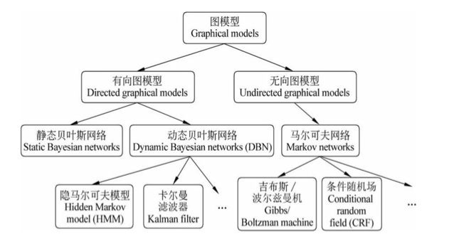
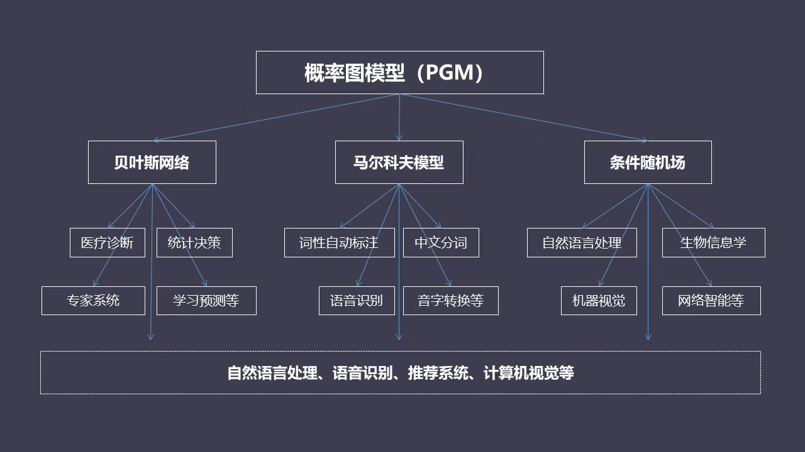

# 概率图模型

- [返回顶层目录](../../SUMMARY.md)
- [概率图模型简介](probability-graphical-model-introduction.md)

=================================

[概率图模型（PGM）有必要系统地学习一下吗？](https://www.zhihu.com/question/23255632/answer/388974128)

《深度学习》P49

概率图模型，简单说就是用graph来表示各参数的关系，用图的一些理论来简化公式上的推导吧。简单的说，就是概率图将原本公式表达的一长串列式，**可视化**了（多么火的词啊）！你用windows肯定比用dos在某些方面更加直观啊。

图模型是用图的方式表示概率推理 ，将概率模型可视化，方便展示变量之间的关系。概率图模型能利用复杂分布中的结构来紧凑表示它。 

机器学习里能和深度学习有来有回的现在也就只有概率图了，而且作为一个优雅的模型，工程化上可解释性好太多。像lixin liu所说的这两个很早就已经结合起来了，比如stack RBM得到的deep belief network (DBN) 或者是deep boltzmann machine (DBM)等。 最近这两者的结合做的deep generative model，比如variational auto encoder效果也很不错。 题主可以看一下MIT的deep learning书中part 3从Chap 16 - 20的内容，介绍的都是如何把概率图模型的方法应用在deep learning上。作者：Xinran He链接：https://www.zhihu.com/question/48845169/answer/113157452

Graphical Model到现在还是Machine Learning一个大支啊。。。每年NIPS和ICML关于他的文章还是很多的。。。必须系统学一下。。。比如现在火爆的Deep Learning，就是最早Hinton老爷子基于Restricted Boltzman Machine 搞得，这个RBM本质就是Random Markov Field。。。Graphical Model的一个大类。。。

还是Eric Xing老师的课有深度，是Jordan讲义的再扩展，里面还有Jun Zhu老师的研究成果。Koller的书应该是PGM的方法综述，也没啥具体的例子，一开始看也会是云里雾里的。PGM在互联网的实用价值其实不高，单一个CRF、LDA、KF HMM、或者它们之间组合的模型，应用在CV或者NLP就有一堆的论文了，还可以做非参数改造。真的要求解，又还得优化、统计不能少。做实验也不简单。—— 把Jun Zhu老师的Max-margin Nonparametric Bayes看懂，再做做实验试试，这可不是朝夕之功啊。反正，题主要为了兴趣就慢慢看，为了工作就去实习吧，为了发论文还是去水CNN、RNN、LSTM吧。作者：li zhengyang链接：https://www.zhihu.com/question/23255632/answer/105892071来源：知乎著作权归作者所有。商业转载请联系作者获得授权，非商业转载请注明出处。

建议阅读PRML第八章：概率图模型

https://blog.csdn.net/sherrylml/article/details/51488949

看PRML第8章就足够了（其实做ML的把这本圣经吃透也足够了（喜欢theory的再去看看Mohri的FML），实际上更多人这本书都看不下去就去翻其他乱七八糟的教材），完了读读Jordan的[Graphical Models, Exponential Families, and Variational Inference](https://link.zhihu.com/?target=https%3A//people.eecs.berkeley.edu/%7Ewainwrig/Papers/WaiJor08_FTML.pdf)进个阶，然后根据自己的兴趣读最新论文。

作者：Untitled链接：https://www.zhihu.com/question/264634540/answer/300281971来源：知乎

强推PRML相关章节，读了之后真是醍醐灌顶，感觉很棒，印象最深的一章了。
当然答主没读过其他概率图模型相关的资料，所以仅供参考～

《深度学习》goodfellow的第16章。讲的就是概率图模型。

[《机器学习》笔记-概率图模型（14）](https://zhuanlan.zhihu.com/p/36804199)

[终极入门 马尔可夫网络 (Markov Networks)——概率图模型](https://mp.weixin.qq.com/s?__biz=MzI4MDYzNzg4Mw==&mid=2247486998&idx=2&sn=665ce56d5ab937abab652fedf7100332&chksm=ebb436c2dcc3bfd4123eb4a7f23d8389250d3a47a58cd5655beab23b6dd59f72ec5c956c2a67&mpshare=1&scene=1&srcid=0210TbIAPCcASnK9AcvEru8x#rd)

机器学习的算法经常会涉及在非常多的随机变量上的概率分布。通常，这些概率分布涉及的直接相互作用都是介于非常少的变量之间的。使用单个函数来描述整个联合概率分布是非常低效的（无论是计算上还是统计上）。

# 概率图模型综述

在概率图模型中， 每个节点表示一个随机变量（或一组随机变量），边表示这些变量之间的概率关系。概率图分为有向图和无向图。有向图主要是贝叶斯网络，无向图主要是马尔科夫随机场。

贝叶斯网络由Judea Pearl 教授发明于上世界80年代，这项工作获得了2011年图灵奖。

概率图模型的应用有：

先说说PGM的**重要性**。概率图模型大致可以分为两种：

* **有向图模型**directed graphical model(又称贝叶斯网络）。贝叶斯网络由Judea Pearl教授发明于上世界80年代，这项工作获得了2011年图灵奖。
* **有向图模型**undirected graphical model（又称马尔可夫随机场）。马尔可夫随机场最早被物理学家用于对原子进行建模，其中的代表作Ising model获得过诺贝尔奖。

图灵奖+诺贝尔奖，PGM的重要性可见一斑。另外，PGM是将人工智能（AI）的研究热点从传统AI(如逻辑、推理、知识表示）转向机器学习的重要工作（其他起到这一作用的工作有支持向量机、决策树、boosting等）。

概率图模型在实际中（包括工业界）的应用非常广泛与成功。这里举几个例子。隐马尔可夫模型（HMM）是语音识别的支柱模型；高斯混合模型（GMM）及其变种K-means是数据聚类的最基本模型；条件随机场（CRF）广泛应用于自然语言处理（如词性标注，命名实体识别）；Ising模型获得过诺贝尔奖；话题模型在工业界大量使用(如腾讯的推荐系统），等等。

PGM**优雅的理论**：机器学习的一个核心任务是从观测到的数据中挖掘隐含的知识，而概率图模型是实现这一任务的一种很优雅elegant，条理化principled的手段。PGM巧妙地结合了图论和概率论。从**图论**的角度，*PGM是一个图，包含结点与边。结点可以分为两类：隐含结点和观测结点。边可以是有向的或者是无向的*。从**概率论**的角度，*PGM是一个概率分布，图中的结点对应于随机变量，边对应于随机变量的dependency或者correlation关系*。

PGM**实现方法**：给定一个实际问题，我们通常会观测到一些数据，并且希望能够挖掘出隐含在数据中的知识。怎么用PGM实现呢？我们构建一个图，用观测结点表示观测到的数据，用隐含结点表示潜在的知识，用边来描述知识与数据的相互关系，最后获得一个概率分布。给定概率分布之后，通过进行两个任务：inference (给定观测结点，推断隐含结点的后验分布）和learning(学习这个概率分布的参数），来获取知识。PGM的强大之处在于，不管数据和知识多复杂，我们的处理手段是一样的：建一个图，定义一个概率分布，进行inference和learning。这对于描述复杂的实际问题，构建大型的人工智能系统来说，是非常重要的。

# 概率图模型分类

## 有向图（贝叶斯网络）

[贝叶斯网与链式法则的理解 ](https://blog.csdn.net/ybdesire/article/details/77488532)

## 无向图（马尔科夫随机场）

# 概率图模型角度看机器学习

PGM 的原理经过若干大牛的归纳后已经并不那么复杂，看看怎么建模，怎么 Learn，怎么 Inference，就能掌握原理的精髓。但是，PGM 可以把这几年机器学习的主流发展方向串起来，会讲很多正在流行的模型，这为这门不是那么系统的学科搭了一个框架，又讲可以讲理论，又可以讲在图像、语音的应用，实在是对入门同学的福音。当你开始看PGM的时候，你就快接触到 State-of-the-art Machine Learning了。  Machine Learning 又发展了这么多年，出现了这么多研究，是时候大家再写写书，想想办法把东西总结总结了，书名总不能还叫 Machine Learning 吧，所以换个框架，从 PGM 写起，真是极好的。

要是你还在念书，最好系统学，按部就班看Koller公开课，战线比较长，但是她的时间线真的很扎实，接触别的的图模型心里更有底气：[Coursera - Free Online Courses From Top Universities](https://link.zhihu.com/?target=https%3A//www.coursera.org/course/pgm)。公开课有一点不好就是隔一段时间反刍起来特别不方便，这时就可以祭出她那本凶器，整门公开课其实就是这本书的目录加摘要，讲的顺序和里面用得例子是一模一样的，可以当做是完整版的教案：[http://www.amazon.cn/Probabilistic-Graphical-Models-Principles-and-Techniques-Koller-Daphne/dp/0262013193/ref=sr_1_1?ie=UTF8&qid=1452571603&sr=8-1&keywords=Probabilistic+Graphical+Models%3A+Principles+and+Techniques](https://link.zhihu.com/?target=http%3A//www.amazon.cn/Probabilistic-Graphical-Models-Principles-and-Techniques-Koller-Daphne/dp/0262013193/ref%3Dsr_1_1%3Fie%3DUTF8%26qid%3D1452571603%26sr%3D8-1%26keywords%3DProbabilistic%2BGraphical%2BModels%253A%2BPrinciples%2Band%2BTechniques)

要是你已经工作了，我觉得还是不要拿宝贵的时间系统学了，从你工作中用到的一个图模型入手，看论文，一点一点走遍图模型，一个模型一个模型地拓扑展开。工作中会用到的模型基本上都是全息的，比如你学个条件随机场，你就得跟隐马对比吧，那你就要分别知道马尔科夫随机场跟贝叶斯网络，然后你就会想知道马尔科夫随机场（条件随机场）跟贝叶斯网络（隐马）有啥区别。要想知道区别在哪你就得知道贝叶斯网络独立性怎么判断、马尔科夫随机场独立性怎么判断、贝叶斯怎么inference、马尔科夫怎么inference、贝叶斯怎么优化、马尔科夫怎么优化，要知道贝叶斯怎么优化你还得知道EM，而EM书上一般都是从最大熵讲的。。。然后你就知道这些都是啥东西了，他们之间是什么关系，这样你就知道概率图模型里都有些啥了，心里就有个谱。我也在用这种方式学，我觉得这个思路比无中生有开始讲要流畅得多。

推荐bayesian network and machine learning这本书

# 待整合

[概率图模型（PGM）有必要系统地学习一下吗？](https://www.zhihu.com/question/23255632/answer/388974128)

估计题主已经用不到啦，这个回答写给后来人：

Koller 那本废话好多，看半天还没看到正题，要看很久很久才能对 PGM 的全貌有一个了解……

如果题主需要学习 CRF 或者序列标注模型的话，我推荐一个教程：

[[1011.4088] An Introduction to Conditional Random Fieldsarxiv.org](https://arxiv.org/abs/1011.4088)

这份教程只有 90 页，虽然内容主要针对 CRF （以及相关的 HMM 等模型），但是却回顾了 PGM 里的重要概念以及建模、训练、推断的全部套路，由此可以掌握 PGM 的方法论，别的 PGM 模型也能分分钟上手。

---

我认为　这个问题应该通过“对比式”回答更有说服力，通常来讲，一个模型可以通过三种角度来看待：

- 线性代数的角度；
- 贝叶斯概率的角度；
- 神经网络的角度；

拿pca举个例子，起初大家都是通过特征值特征向量入手来认识，其他的模型也可以通过类似的线性代数思想来认识，但这样却带来一个问题，你学习不同的模型貌似每个都是一个全新的学习过程，一个新的开始；　但如果换个角度呢？通过概率的方法ppca来重新认识PCA，同时，也可以通过概率的视角去研究其他模型，比如HMM, GMM等。神奇的事情发生了，这些不同模型如果统一采用概率模型（ pgm）来研究貌似可以共享一些方法或者学习经验，比如变分推断，置信传播等，是不是有了大一统的感觉？这种大一统的感觉对你认识一个模型，尤其是认识一类模型，解决learning, inference这类问题会有质的提升。当然，大部分菜鸡仅通过线性代数的视角也可以认识并解决某个问题，但所站的高度却不同。再引申，神经网络更是一种超级“渐近”大一统的模型，比如pca基本等价naive autoencoder。如此看来，看官发现没有，要想成为牛人，现在的趋势是，对同一个模型可能要从这三个视角来认识，也就是学习量实则是三倍！这也是为何AI人才的培养周期特别长的原因。

所以，概率图模型（PGM）是否有必要系统地学习，取决于你是否想成为行业大牛。

---

https://www.csdn.net/article/2015-04-30/2824600

概率图模型是图论与概率方法的结合产物，2000年代中期它们都曾在机器学习研究人员中风靡一时。当年我在研究生院的时候（2005-2011），变分法、Gibbs抽样和置信传播算法被深深植入在每位CMU研究生的大脑中，并为我们提供了思考机器学习问题的一个极好的心理框架。我所知道大部分关于图模型的知识都是来自于Carlos Guestrin和Jonathan Huang。Carlos Guestrin现在是GraphLab公司（现改名为Dato）的CEO，这家公司生产大规模的产品用于图像的机器学习。Jonathan Huang现在是Google的高级研究员。

下面的视频尽管是GraphLab的概述，但它也完美地阐述了“图形化思维”，以及现代数据科学家如何得心应手地使用它。Carlos是一个优秀的讲师，他的演讲不局限于公司的产品，更多的是提供下一代机器学习系统的思路。

概率图模型的计算方法介绍（[视频和PPT下载](http://pan.baidu.com/s/1ntFrqrf)）

Dato CEO，Carlos Guestrin教授

# 参考资料

* [深度学习]Goodfellow，第三章，概率与信息论

本文参考了此书。

* [概率图模型（PGM）有必要系统地学习一下吗？](https://www.zhihu.com/question/23255632)

"概率图模型综述"一章部分参考了此问题的回答。

[知乎-可否帮我找一本概率图模型的英文教材？](https://www.zhihu.com/question/22562956/answer/26879532)

初学者推荐Michael I. Jordan的**An Introduction to Probabilistic Graphical Models**，大概100页，网上可以下到电子版http://www.cis.upenn.edu/~mkearns/papers/barbados/jordan-tut.pdf

Koller 在 Coursera 的课不错，涵盖了她那本书的基础部分。不过要是说看书的话，我推荐 Jordan 的 An Introduction to Probabilistic Graphical Models（没有出版，不过可以搜到，在此就不贴链接了）。Koller 的书起点太高，过于 formal；相比起来 Jordan 的更直观易懂一些。

Daphne Koller -- Probabilistic graphical model  PGM权威著作
Christopher M.Bishop -- Pattern recognition and Machine learning  入门
Kevin P.Murphy   -- Machine learning a Probabilistic Perspective  可以参考

[1] **Probabilistic Graphical Models Principles and Techniques.** Daphne Koller,Nir Friedman （太厚了）
 [2] **Pattern Recognition and Machine Learning.** Chapter 8 
 [3] <http://www.cnblogs.com/bhlsheji/p/4875551.html>

推荐**bayesian network and machine learning**这本书

Eric Xing老师的课有深度，是Jordan讲义的再扩展，里面还有Jun Zhu老师的研究成果。

 很有必要，我再次推荐周志华《机器学习》中的概率图模型有专门一章。

建议重点搞懂下面几个模型：

\1. HMM  [隐马尔科夫模型 | 我爱自然语言处理](https://link.zhihu.com/?target=http%3A//www.52nlp.cn/category/hidden-markov-model)

\2. CRF 模型

\3. LDA 模型

能把这几个模型看下来，学会了，恭喜你，入门了