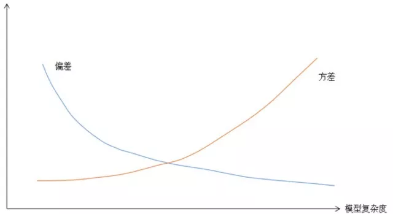
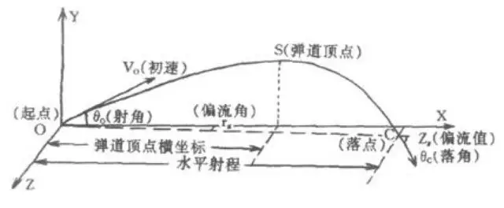

# 偏差和方差

- [返回顶层目录](../../SUMMARY.md#目录)
- [返回上层目录](statistics-and-information-theory.md)

偏差和方差有什么区别？

https://www.zhihu.com/question/20448464/answer/339471179

为什么样本方差（sample variance）的分母是 n-1？

https://www.zhihu.com/question/20099757/answer/312670291

# 偏差和方差有什么区别？

https://www.zhihu.com/question/20448464/answer/339471179

# 从偏差和方差来看待过拟合和欠拟合

我们也可以从偏差和方差来看待过拟合和欠拟合，模型的泛化误差来自于两部分，分别称为偏差和方差。

**偏差**（bias）是模型本身导致的误差，即错误的模型假设所导致的误差，它是模型的预测值的数学期望和真实值之间的差距。假设样本特征向量为x，标签值为y，要拟合的目标函数为h(x)，模型训练出来的函数为$\hat h(x)$，则偏差为：
$$
Bias[\hat h(x)]=E[\hat h(x)-h(x)]
$$
根据上面的定义，高偏差意味着模型本身的输出值与期望值差距很大，因此会导致欠拟合问题。

**方差**（variance）是由于对训练样本集的小波动敏感而导致的误差。它可以理解为模型预测值的变化范围，即模型预测值的波动程度。根据概率论中方差的定义，有：
$$
Var[\hat h(x)]=E[\hat h^2(x)]-E^2[\hat h(x)]
$$
根据定义，高方差意味着算法对训练样本集中的随机噪声进行建模，从而出现过拟合问题。模型的总体误差可以分解为偏差的平方与方差之和：
$$
E\left[\left(y-\hat h(x)\right)^2\right]=\text{Bias}^2\left[\hat h(x)\right]+\text{Var}\left[\hat h(x)\right]
$$
这称为”偏差-方差“分解公式。如果模型过于简单，一般会有大的偏差和小的方差；反之如果模型复杂则会有大的方差但偏差很小。这是一对矛盾，因此我们需要在偏置和方差之间做一个折中。如果我一模型的复杂度作为横坐标，把方差和偏差的值作为纵坐标，可以得到下图所示的两条曲线。

下面以一个简单的例子来形象的解释偏差和方差的概念。在打靶时，子弹飞出枪管之后以曲线轨迹飞行。

如果不考虑空气的阻力，这是一条标准的抛物线，如果考虑空气阻力，是一条更复杂的曲线。

我们用弹道曲线作为预测模型，在给定子弹初速度的前提下，如果知道靶心与枪口的距离，可以通过调整枪口的仰角来让子弹命中靶心。

如果使用抛物线函数就会产生偏差，因为理论上子弹的落点不会在靶心而是在靶心偏下的位置，此时需要更换弹道曲线模型。

无论选用哪种弹道曲线模型，受风速、枪口震动等因素的影响，即使瞄准的是靶心，子弹还是会随机散布在靶心周围，这就是方差。