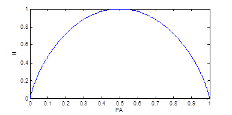
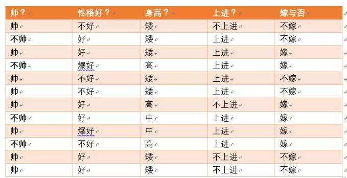
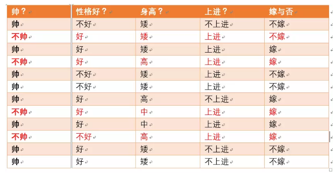
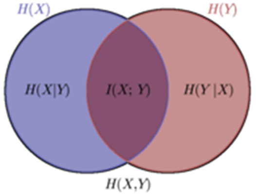

# 信息论

* [返回顶层目录](../../SUMMARY.md#目录)
* [返回上层目录](statistics-and-information-theory.md)

* [什么是信息](#什么是信息)
* [自信息](#自信息)
* [信息熵](#信息熵)
  * [信息熵的定义](#信息熵的定义)
  * [信息熵的直观理解](#信息熵的直观理解)
* [交叉熵、相对熵(KL散度)与互信息](#交叉熵、相对熵(KL散度)与互信息)
  * [交叉熵H(p,q)](#交叉熵H(p,q))
  * [相对熵(KL散度)H(p,q)-H(p)](#相对熵(KL散度)H(p,q)-H(p))
  * [互信息I(X,Y)](#互信息I(X,Y))
* [联和熵与条件熵](#联和熵与条件熵)
  * [联和熵H(X,Y)](#联和熵H(X,Y))
  * [条件熵H(y|x)](#条件熵H(y|x))
* [各种熵之间关系的文氏图](#各种熵之间关系的文氏图)
* [参考资料](#参考资料)

信息轮是应用数学的一个分支，主要研究的是**对一个信号包含信息的多少进行量化**。

概率论使我们能够提出不确定的声明，以及在不确定性存在的情况下进行推理，而信息论使我们能够**量化概率分布中的不确定性总量**。（《深度学习》Goodfellow第34页）

# 什么是信息

信息是我们一直在谈论的东西，但信息这个概念本身依然比较抽象。在百度百科中的定义：信息，泛指人类社会传播的一切内容，指音讯、消息、通信系统传输和处理的对象。

信息是不确定性的消除。比如我告诉你明天太阳会从东边升起，这没什么信息含量，因为并没有消除任何不确定性，太阳肯定会从东边升起。但是你告诉我应该抽奖抽哪张能赢头等奖500万，那这个信息量就很大了，消除了非常大的不确定性，或者说，随机抽奖，能中500万的概率是千万分之一，也就是概率很小，不确定性很大，但是你告诉了我这个信息，能够让这个概率很小的事情发生，那就是消除了很大的不确定性，所以这个信息就很大。再进一步说，你告诉了能中奖的那张奖券，其实还包含了其他的奖券都不能赢得头等奖500万（假设头等奖只有一个），将一千万种可能的结果坍缩到了唯一的确定结果，所以信息其实是一种不确定度（复杂度）的消除。

# 自信息

信息论的一个基本想法是一个不太可能发生的事件居然发生了，要比一个非常可能的事件发生，能提供更多的信息。消息说：“今天早上太阳升起”，信息量是如此之少，以至于没有必要发送；但一条消息说：“今天早上有日食”，信息量就很丰富。

我们想要通过这种基本想法来量化信息，特别是：

* 非常可能发生的事件信息量要比较少，并且极端的情况下，确保能够发生的事件应该没有信息量。
* 较不可能发生的事件具有更高的信息量。
* 独立事件应具有增量的信息。例如，投掷的硬币两次正面朝上传递的信息，应该是透支一次硬币正面朝上的信息量的两倍。

为了满足上述3个性质，我们定义一个事件X=x的自信息为
$$
I(x)=-logP(x)
$$
其中，以e为底的对数的单位是奈特(nats)，以2为底的对数的单位是**比特**(bit)或香农(shannons)。

# 信息熵

信息熵也叫香农熵。

## 信息熵的定义

信息可不可以被量化，怎样量化？答案当然是有的，那就是“信息熵”。早在1948年，香农\(Shannon\)在他著名的《通信的数学原理》论文中指出：“信息是用来消除随机不确定性的东西”，并提出了“信息熵”的概念（借用了热力学中熵的概念），来解决信息的度量问题。

热力学用熵（统计学熵）描述的是孤立系统的混乱状态；信息论用熵（信息熵）描述的是信息系统的信息量。两者没有关系，就比如柳树和树形图没有关系一样。

自信息只处理单个的输出。我们可以用信息熵（香农熵）来对整个概率分布中的不确定性总量进行量化：
$$
H(x)=\mathbb{E}_{x\sim P}[I(x)]=-\mathbb{E}_{x\sim P}[log P(x)]
$$
也记作$H(P)$。换言之，一个分布的信息熵是指遵循这个分布的事件所产生的期望信息总量。它给除了对依据概率分布P生成的符号进行编码所需的比特数在平均意义上的下界。那些接近确定性的分布（输出几乎可以确定）具有较低的熵；那些接近均匀分布的概率分布具有较高的熵。

## 信息熵的直观理解

* **信息熵的直观理解**

一种直观理解信息熵的说法：信息熵是“惊喜的期望值”。买彩票中五百万的可能性很小，一旦你真中了五百万，那你就会很惊喜，那么买彩票中五百万的信息熵就很大。信息会改变你对事物的未知度和好奇心，你拥有的信息量越大，你对事物越了解，进而你对事物的好奇心也会降低，因为你对事物的确定性越高。至此，为了抽象这个模型，聪明的香农总结出了信息熵这个概念。信息熵用以表示一个事物的非确定性，如果该事物的非确定性越高，你的好奇心越重，该事物的信息熵就越高。

信息熵是消除不确定性所需信息量的度量，也即未知事件可能含有的信息量。

一个事件或一个系统，准确的说是一个随机变量，它有着一定的不确定性。例如，“除东道主俄罗斯外，哪31个国家能进军2018年俄罗斯世界杯决赛圈”，这个随机变量的不确定性很高，要消除这个不确定性，就需要引入很多的信息，这些很多信息的度量就用“信息熵”表达。需要引入消除不确定性的信息量越多，则信息熵越高，反之则越低。例如“中国男足进军2018年俄罗斯世界杯决赛圈”，这个因为确定性很高，几乎不需要引入信息，因此信息熵很低。再拿上文中的抽奖来举例子，你要抽奖很多很多次（运气最差的情况：抽奖一千万减一次，即引入很多消除不确定性的信息量，才能确定买哪一张中奖），即你需要引入很多消除不确定性的信息量，所以抽奖中五百万这件事的信息熵很高。

* **信息熵的计算**

那信息熵如何计算呢？举个吴军在《数学之美》中一样的例子（吴军先生的《数学之美》这本书用了一章对信息熵做了通俗易懂的讲解），假设世界杯决赛圈32强已经产生，那么随机变量“2018年俄罗斯世界杯足球赛32强中，谁是世界杯冠军？”的信息量是多少呢？

根据香农\(Shannon\)给出的信息熵公式，对于任意一个随机变量X，它的信息熵定义如下，单位为比特\(bit\)：

$$
H(x) = -\sum_{x\in X}{p(x)\cdot log{p(x)}}
$$
那么上述随机变量（谁获得冠军）的信息量是：

$$
H=-(p1\cdot log{p1}+p2\cdot log{p2}+...+p32\cdot log{p32})
$$
其中，p1,p2,…,p32分别是这32强球队夺冠的概率。

吴军的书中给出了几个结论：一是32强球队夺冠概率相同时，H=5；二是夺冠概率不同时，H&lt;5；三是H不可能大于5。

对于第一个结论：结果是很显然的，夺冠概率相同，即每个球队夺冠概率都是1/32，所以

$$
H=-(\frac{1}{32}\cdot log{\frac{1}{32}}+\frac{1}{32}\cdot log{\frac{1}{32}}+...+\frac{1}{32}\cdot log{\frac{1}{32}})
$$
对于第二个结论和第三个结论：使用拉格朗日乘子法进行证明，详见《求约束条件下极值的拉格朗日乘子法》。这实际上是说系统中各种随机性的概率越均等，信息熵越大，反之越小。怎么直观理解夺冠概率相同时信息熵最大呢？信息熵表述的就是事物的信息状态。事物的信息怎么定义呢？如果你确定一件事件的发生概率是100%，你认为这件事情的信息量为0——可不是吗，既然都确定了，就没有信息量了；相反，如果你不确定这件事，你需要通过各种方式去了解，就说明这件事是有意义的，是有信息量的。好的，你应该注意到了一个词“确定”。是的，信息熵表述的就是事物的不确定程度。一场势均力敌的比赛结果的不确定性高于一场已经被看到结果的比赛，多么符合直观理解啊！

* **信息熵公式的推导**

从香农给出的数学公式上可以看出，信息熵其实是一个随机变量信息量的数学期望。

从上面的直观表述，我们发现信息熵其实可以有很直观的表述，表征的是事物的不确定性。继续抽象，我们应该定量表述事物的不确定性呢？这就是信息熵的数学表述了

我们知道，合理的数据定理都需要满足数学自洽性验证，我们已经知道确定的事件表述为P\(A\)=100%，则熵为0；假设一件事情，只有两种可能，则概率分布是P\(A\)和P\(-A\)，其熵表述为

$$
H=-(p{A}\cdot log{2}{p{A}}+(1-p{A})\cdot log{2}{(1-p{A})}) 
$$
上式对应的数据分布是

可以发现，当P\(A\)=0.5的时候，也就是事件结果最难预测的时候，信息熵是最大的，值达到1——这同样是符合直觉判断的。

那么，为什么求熵的时候用的是对数log2呢？这个就得从香农提出的信息熵使用的场景说起，大家都知道，香农提出的信息熵是用于信息论的，而信息论主要解决的是通讯问题，所以说，信息熵是和计算机通讯相关的理论。计算机的基本存储单位是二进制位，即1bit，每个bit都尤其只有两种表达——0或1。如果一个事件有两种可能性，且概率均等，都为50%，那么需要用1bit表示；如果有4种可能，且概率均等，则用2bit表示——你会发现，1bit刚好就是我们上面证明的H的最大值。这样就解释通了，底数为何为2了。

# 交叉熵、相对熵(KL散度)与互信息

## 交叉熵H(p,q)

熵的本质是香农信息量$(-log\frac{1}{p})$的期望。

现有关于样本集的2个概率分布p和q，其中p为真实分布，q为非真实分布。按照真实分布p来衡量识别一个样本的所需要的编码长度的期望（即平均编码长度）为：
$$
H(p)=-\sum_ip(i)log\frac{1}{p(i)}
$$
。如果使用错误分布q来表示来自真实分布p的平均编码长度，则应该是：
$$
H(p,q)=\sum_ip(i)log\frac{1}{q(i)}
$$
。因为用q来编码的样本来自分布p，所以期望H(p,q)中概率是p(i)。H(p,q)我们称之为“交叉熵”。

比如含有4个字母(A,B,C,D)的数据集中，真实分布p=(1/2,1/2,0,0)，即A和B出现的概率均为1/2。C和D出现的概率都为0。计算H(p)为1，即只需要1位编码即可识别A和B。如果使用分布Q=(1/4,1/4,1/4,1/4)来编码则得到H(p,q)=2，即需要2位编码来识别A和B(当然还有C和D，尽管C和D并不会出现，因为真实分布p中C和D出现的概率为0，这里就钦定概率为0的事件不会发生啦)。

可以看到上例中根据非真实分布q得到的平均编码长度H(p,q)大于根据真实分布p得到的平均编码长度H(p)。事实上，根据[吉布斯不等式(Gibbs' inequality)](https://en.wikipedia.org/wiki/Gibbs%27_inequality)可知，H(p,q)>=H(p)恒成立，当q为真实分布p时取等号。我们将由q得到的平均编码长度比由p得到的平均编码长度多出的bit数称为“相对熵”：
$$
D(p||q)=H(p,q)-H(p)=\sum_ip(i)log\frac{p(i)}{q(i)}
$$
，其又被称为[KL散度](https://en.wikipedia.org/wiki/Kullback%E2%80%93Leibler_divergence)(Kullback-Leibler divergence, KLD)。它表示两个函数或概率分布的差异性：差异越大则相对熵越大，差异越小则相对熵越小，特别地，若两者相同则熵为0。注意，KL散度的非对称性。

比如TD-IDF算法就可以理解为相对熵的应用：词频在整个语料库的分布与词频在具体文档中分布之间的差异性。

交叉熵可在机器学习中作为损失函数，p表示真实标记的分布，q则为训练后的模型的预测标记分布，交叉熵损失函数可以衡量p与q的相似性。交叉熵作为损失函数还有一个好处在神经网络中使用sigmod函数在梯度下降时能避免军方误差损失函数学习速率降低的问题，因为学习速率可以被输入的误差所控制。

PS：通常“相对熵”也可以称之为“交叉熵”，因为真实分布p是固定的，D(p||q)由H(p,q)决定。当然也有特殊情况，彼时两者须区别对待。

---

大部分机器学习和现代的神经网络使用最大似然来训练。这意味着代价函数就是负的对数似然。它与训练数据和模型分布之间的交叉熵等价。这个代价函数表示为
$$
J(\theta)=-\mathbb E_{x,y\sim\hat{p}_{data}}log\ p_{model}(y|x)
$$
可以看出：**任何一个由负对数似然组成的损失都是定义在训练集上的经验分布和定义在模型上的概率分布之间的交叉熵。例如，均方误差是经验分布和高斯模型之间的交叉熵。**

均方误差就是与单位高斯分布的输出相关联的交叉熵损失。《深度学习》p235

一个和KL散度密切相关的量是交叉熵，即$H(P,Q)=H(P)+D_{KL}(P||Q)$，它和KL散度很像，但是缺少左边一项：
$$
H(P,Q)=-\mathbb{E}_{x\sim P}logQ(x)
$$
针对Q最小化交叉熵等价于最小化KL散度，因为Q并不参与被省略的那一项。

## 相对熵(KL散度)H(p,q)-H(p)

如果对于同一个随机变量x有两个单独的概率分布P(x)和Q(x)，可以使用KL散度（Kullback-Leibler divergence）来衡量这两个分布的差异：
$$
D_{KL}(P||Q)=\mathbb{E}_{x\sim P}\left[log\frac{P(x)}{Q(x)}\right]=\mathbb{E}_{x\sim P}[logP(x)-logQ(x)]
$$
在离散型随机变量的情况下，KL散度衡量的是，当我们使用一种被设计成能够使得概率分布Q产生的消息长度最小的编码，发送包含由概率分布P产生的符号的消息时，所需要的额外信息量。

初学机器学习：直观解读KL散度的数学概念

https://zhuanlan.zhihu.com/p/37452654

## 互信息I(X,Y)

* 两个随机变量X，Y的互信息，定义为X，Y的联合分布和独立分布乘积的相对熵。
* $I(X,Y)=D(P(X,Y)||P(X)P(Y))$

$$
I(X,Y)=\sum_{x,y}p(x,y)log\frac{p(x,y)}{p(x)p(y)}
$$

计算H(X)-I(X,Y)
$$
\begin{aligned}
&H(X)-I(X,Y)\\
=&-\sum_xp(x)log\ p(x)-\sum_{x,y}p(x,y)log\ \frac{p(x,y)}{p(x)p(y)}\\
=&-\sum_x(\sum_yp(x,y))log\ p(x)-\sum_{x,y}p(x,y)log\ \frac{p(x,y)}{p(x)p(y)}\\
=&-\sum_{x,y}p(x,y))log\ p(x)-\sum_{x,y}p(x,y)log\ \frac{p(x,y)}{p(x)p(y)}\\
=&\sum_{x,y}p(x,y)log\ \frac{p(x,y)}{p(y)}\\
=&\sum_{x,y}p(x,y)log\ p(x|y)\\
=&H(X|Y)\\
\end{aligned}
$$

# 联和熵与条件熵

## 联和熵H(X,Y)

* 两个随机变量X、Y的联合分布，可形成联和熵Joint Entropy，用H(X, Y)表示。
* H(X,Y)-H(X)=H(Y|X)
  * (X, Y)发生所包含的熵，减去X单独繁盛包含的熵：在X发生的前提下，Y发生“新”带来的熵
  * 该式子定义为X发生前提下，X的熵：
    * 条件熵H(Y|X)

$$
\begin{aligned}
&H(X,Y)-H(X)\\
=&-\sum_{x,y}p(x,y)log\ p(x,y)+\sum_xp(x)log\ p(x)\\
=&-\sum_{x,y}p(x,y)log\ p(x,y)+\sum_x(\sum_yp(x,y))log\ p(x)\\
=&-\sum_{x,y}p(x,y)log\ p(x,y)+\sum_{x,y}p(x,y)log\ p(x)\\
=&-\sum_{x,y}p(x,y)log\ \frac{p(x,y)}{p(x)}\\
=&-\sum_{x,y}p(x,y)log\ p(y|x)*****\\
=&-\sum_{x}p(x)\sum_{y}p(y|x)log\ p(y|x)\\
=&-\sum_{x}p(x)H(y|x)\\
\end{aligned}
$$

## 条件熵H(y|x)

条件熵就是按照一个分类变量对原变量数据进行分类后，原变量的不确定性就会减小了，**因为新增加了这个新的分类变量的信息**。这个不确定程度减小了多少就是信息的增益，而还剩下多少不确定性程度就是条件熵。

**条件熵是另一个变量Y的熵对X（条件）的期望**。

---

* **信息熵以及引出条件熵**

我们首先知道信息熵是考虑该随机变量的所有可能取值，即所有可能发生事件所带来的信息量的期望。公式如下：
$$
H(x)=-\sum_{i=1}^np(x_i)log\ p(x_i)
$$
我们的条件熵的定义是：定义为X给定条件下，Y的条件概率分布的熵的数学期望。

这个还是比较抽象，下面我们解释一下：

设有随机变量(X,Y)，其联合概率分布为 
$$
p(X=x_i,Y=y_i)=p_{ij}, \ i=1,2,...,n,\ j=1,2,...,m
$$
条件熵H(Y|X)表示在已知随机变量X的条件下随机变量Y的不确定性。

随机变量X给定的条件下随机变量Y的条件熵H(Y|X)

---

* **条件熵公式**

下面推导一下条件熵的公式：
$$
\begin{aligned}
H(Y|X)&=\sum_{x\in X}p(x)H(Y|X=x)\\
&=-\sum_{x\in X}p(x)\sum_{y\in Y}p(y|x)log\ p(y|x)\\
&=-\sum_{x\in X}\sum_{y\in Y}p(x,y)log\ p(y|x)\\
\end{aligned}
$$
注意，这个条件熵，不是指在给定某个数（某个变量为某个值）的情况下，另一个变量的熵是多少，变量的不确定性是多少？而是**期望**！

因为条件熵中X也是一个变量，意思是在一个变量X的条件下（变量X的每个值都会取），另一个变量Y的熵对X的期望。

**条件熵是另一个变量Y的熵对X（条件）的期望**。

这是最容易错的！

---

* **举例解释条件熵**

下面通过例子来解释一下：

加入我们有上面数据：

设随机变量Y={嫁, 不嫁}

我们就可以统计出，嫁的个数为6/12 = 1/2

不嫁的个数为6/12 = 1/2

那么Y的熵，根据熵的公式来算，可以得到
$$
H(Y)=-\frac{1}{2}log\frac{1}{2}-\frac{1}{2}log\frac{1}{2}
$$
为了引出条件熵，我们现在还有一个**变量X**，代表长相是帅还是帅，当长相是不帅的时候，统计如下红色所示：

可以得出，当已知不帅的条件下，满足条件的只有4个数据了，这四个数据中，不嫁的个数为1个，占1/4，

嫁的个数为3个，占3/4，

那么此时的
$$
\begin{aligned}
&H(Y|X=\text{不帅})=-\frac{1}{4}log\frac{1}{4}-\frac{3}{4}log\frac{3}{4}\\
&p(X=\text{不帅})=4/12=1/3
\end{aligned}
$$
同理我们可以得到：

当已知帅的条件下，满足条件的有8个数据了，这八个数据中，不嫁的个数为5个，占5/8

嫁的个数为3个，占3/8

那么此时的
$$
\begin{aligned}
&H(Y|X=\text{帅})=-\frac{5}{8}log\frac{5}{8}-\frac{3}{8}log\frac{3}{8}\\
&p(X=\text{帅})=8/12=2/3\\
\end{aligned}
$$
我们终于可以计算我们的**条件熵**了，我们现在需要求：
$$
H(Y|X=\text{长相})
$$
也就是说，我们想要求出当已知长相的条件下的条件熵。

根据公式我们可以知道，长相可以取帅与不帅两种

条件熵是另一个变量Y熵对X（条件）的期望。

公式为：
$$
H(Y|X)=\sum_{x\in X}p(x)H(Y|X=x)
$$
则有
$$
H(Y|X=\text{长相})=p(X=\text{帅})*H(Y|X=\text{帅})+p(X=\text{不帅})*H(Y|X=\text{不帅})
$$
然后将上面已经求得的答案带入即可求出条件熵！

这里比较容易错误就是忽略了X也是可以取多个值，然后对其求期望！！

---

* **总结**

其实条件熵意思是按一个新的变量的每个值对原变量进行分类，比如上面这个题把嫁与不嫁按帅，不帅分成了俩类。

然后在每一个小类里面，都计算一个小熵，然后每一个小熵乘以各个类别的概率，然后求和。

我们用另一个变量对原变量分类后，原变量的不确定性就会减小了，因为新增了Y的信息，可以感受一下。不确定程度减少了多少就是信息的增益。

**条件熵是另一个变量Y的熵对X（条件）的期望**。

# 各种熵之间关系的文氏图

整理得到的等式

* $H(Y|X)=H(X,Y)-H(X)$
  * 条件熵定义
* $H(Y|X)=H(Y)-I(X,Y)$
  * 根据互信息定义展开得到
* 对偶式
  * $H(Y|X)=H(X,Y)-H(X)$
  * $H(Y|X)=H(Y)-I(X,Y)$
* $I(X,Y)=H(X)+H(Y)-H(X,Y)$
  * 多数文献，将该式作为互信息的定义式
* $H(Y|X)\leqslant H(Y)$

# 参考资料

* 《深度学习》Goodfellow，第三章，概率与信息论

“自信息”一章参考此书；“交叉熵与相对熵(KL散度)”一章参考此书。

* [通俗理解条件熵](https://blog.csdn.net/xwd18280820053/article/details/70739368)

"条件熵"一节参考此博客。

* [如何通俗的解释交叉熵与相对熵?](https://www.zhihu.com/question/41252833/answer/108777563)

"交叉熵"一节参考此博客。

* [北京2014年10月机器学习班之邹博的最大熵模型PPT](http://pan.baidu.com/s/1qWLSehI)

“各种熵之间关系的文氏图”一节参考子ppt。

---

有时间看下下面的网址

[信息论的熵](http://blog.csdn.net/hguisu/article/details/27305435)

[从香农熵到手推KL散度：纵览机器学习中的信息论](https://zhuanlan.zhihu.com/p/32985487)

[如何通俗的解释交叉熵与相对熵?](https://www.zhihu.com/question/41252833/answer/195901726)

[机器学习各种熵：从入门到全面掌握](https://mp.weixin.qq.com/s?__biz=MzUyMjE2MTE0Mw==&mid=2247485772&idx=1&sn=08e167ca071873b569ede4e5f9ae422f&chksm=f9d157d4cea6dec235cc2ae4500c0b72a81f92d1b540d377d6fe2a8ce9d12469b3073c6b7117&scene=0#rd)

[为什么交叉熵（cross-entropy）可以用于计算代价？](https://www.zhihu.com/question/65288314/answer/244557337)

[信息量，熵，交叉熵，相对熵与代价函数](https://mp.weixin.qq.com/s?__biz=MzU1NTUxNTM0Mg==&mid=2247488638&idx=1&sn=d00968aa06484c0d0550324f1c372baa&chksm=fbd278dfcca5f1c97d3fa571ffe53b184abad005753ff81eb9037e5ff29a42709c8ba1b4ff26&scene=0#rd)

---

[http://blog.csdn.net/saltriver/article/details/53056816](http://blog.csdn.net/saltriver/article/details/53056816)

[http://blog.csdn.net/xuxurui007/article/details/21788551](http://blog.csdn.net/xuxurui007/article/details/21788551)

[https://www.zhihu.com/search?type=content&q=%E4%BF%A1%E6%81%AF%E7%86%B5](https://www.zhihu.com/search?type=content&q=%E4%BF%A1%E6%81%AF%E7%86%B5)

[https://www.zhihu.com/question/26521135](https://www.zhihu.com/question/26521135)

[https://www.zhihu.com/question/26446385](https://www.zhihu.com/question/26446385)

[https://www.zhihu.com/question/40185590](https://www.zhihu.com/question/40185590)

[https://zhuanlan.zhihu.com/p/28564865](https://zhuanlan.zhihu.com/p/28564865)

[https://zhuanlan.zhihu.com/p/26486223](https://zhuanlan.zhihu.com/p/26486223)

[http://www.jianshu.com/p/67425a89df47](http://www.jianshu.com/p/67425a89df47)

[https://ask.julyedu.com/question/6897](https://ask.julyedu.com/question/6897)

[https://ask.julyedu.com/people/zoubo](https://ask.julyedu.com/people/zoubo)

[https://ask.julyedu.com/question/628](https://ask.julyedu.com/question/628)

[https://www.zhihu.com/question/21149770/answer/219143281](https://www.zhihu.com/question/21149770/answer/219143281)

