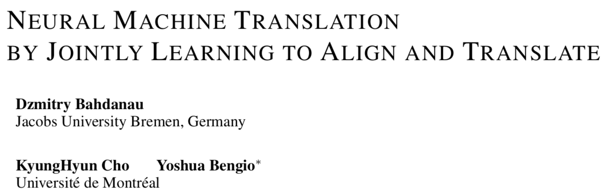

# seq2seq和注意力机制

- [返回顶层目录](../../../SUMMARY.md)
- [返回上层目录](../natural-language-processing.md)
- [seq2seq介绍]

pdf: [NEURAL MACHINE TRANSLATION BY JOINTLY LEARNING TO ALIGN AND TRANSLATE](https://arxiv.org/pdf/1409.0473.pdf)

# encoder-decoder结构

seq2seq属于encoder-decoder结构的一种，这里看看常见的encoder-decoder结构，基本思想就是利用两个RNN，一个RNN作为encoder，另一个RNN作为decoder。encoder负责将输入序列压缩成指定长度的向量，这个向量就可以看成是这个序列的语义，这个过程称为编码，如下图，获取语义向量最简单的方式就是直接将最后一个输入的隐状态作为语义向量C。也可以对最后一个隐含状态做一个变换得到语义向量，还可以将输入序列的所有隐含状态做一个变换得到语义变量。

Seq2seq

下面这段是我论文里的一段简短的介绍, 我就不翻译了...

这是2014年Google提出的一个模型[（论文链接）](https://arxiv.org/abs/1409.3215)，知乎和各大博客网站上有很多介绍，这里就不赘述了。简单来说，seq2seq又两个RNN组成，一个是encoder，一个是decoder。拿MT举例子，比如我们要把源语言“我爱中国”翻译成目标语言“I love China”，那么定义输入序列：

# 参考资料

* [seq2seq 与attention机制 网易公开课](https://study.163.com/course/courseMain.htm?courseId=1006498029)

* [如何理解seq2seq？](http://f.dataguru.cn/thread-907291-1-1.html)

- [完全图解RNN、RNN变体、Seq2Seq、Attention机制](https://zhuanlan.zhihu.com/p/28054589)

===

[seq2seq学习笔记](https://blog.csdn.net/jerr__y/article/details/53749693)

seq2seq 模型分析

首先介绍几篇比较重要的 seq2seq 相关的论文： 
[1] Cho et al., 2014 . Learning Phrase Representations using RNN Encoder-Decoder for Statistical Machine Translation 
[2] Sutskever et al., 2014. Sequence to Sequence Learning with Neural Networks 
[3] Bahdanau et al., 2014. Neural Machine Translation by Jointly Learning to Align and Translate 
[4] Jean et. al., 2014. On Using Very Large Target Vocabulary for Neural Machine Translation 
[5] Vinyals et. al., 2015. A Neural Conversational Model[J]. Computer Science

顾名思义，seq2seq 模型就像一个翻译模型，输入是一个序列（比如一个英文句子），输出也是一个序列（比如该英文句子所对应的法文翻译）。这种结构最重要的地方在于输入序列和输出序列的长度是可变的。

**举个栗子**

> 在机器翻译：输入（hello） -> 输出 （你好）。输入是1个英文单词，输出为2个汉字。 
> 在对话机器中：我们提（输入）一个问题，机器会自动生成（输出）回答。这里的输入和输出显然是长度没有确定的序列（sequences）.

要知道，在以往的很多模型中，我们一般都说输入**特征矩阵**，每个样本对应矩阵中的某一行。就是说，无论是第一个样本还是最后一个样本，他们都有一样的特征维度。但是对于翻译这种例子，难道我们要让每一句话都有一样的字数吗，那样的话估计五言律诗和七言绝句又能大火一把了，哈哈。但是这不科学呀，所以就有了 seq2seq 这种结构。

 

[NLP之Seq2Seq](https://blog.csdn.net/qq_32241189/article/details/81591456)

[翻译系统/聊天机器人Seq2Seq模型+attention](https://blog.csdn.net/weixin_37479258/article/details/99887469)

[真正的完全图解Seq2Seq Attention模型](https://zhuanlan.zhihu.com/p/40920384)

