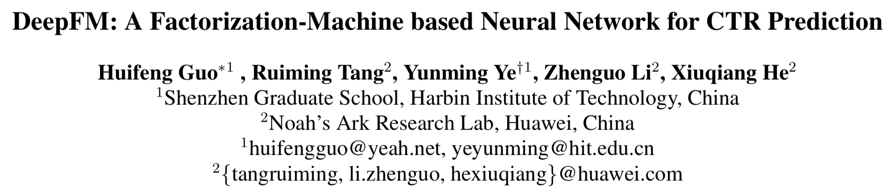
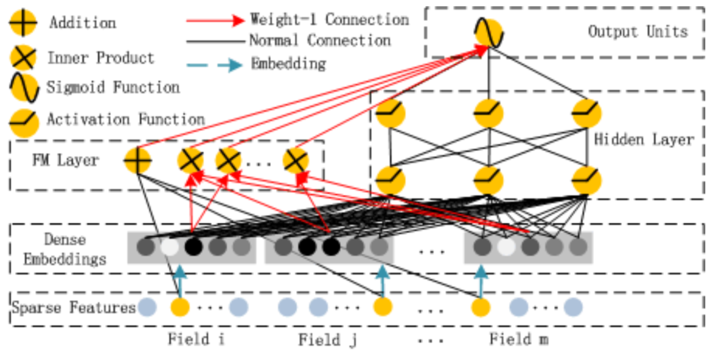
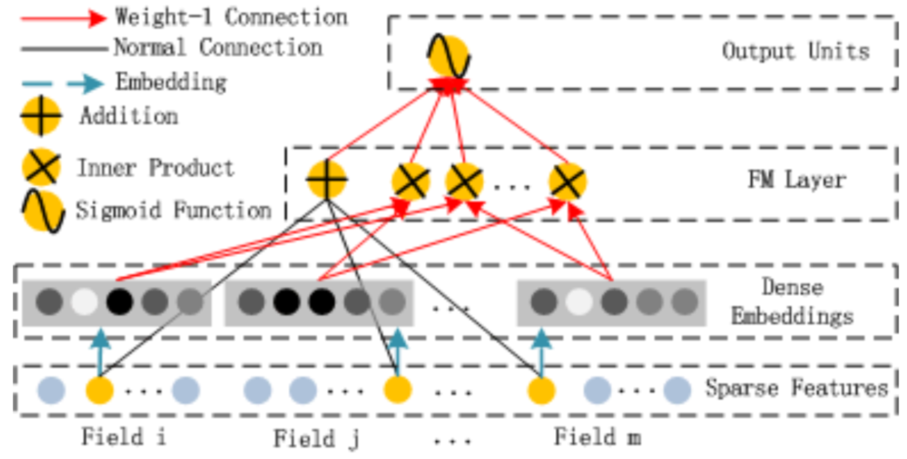
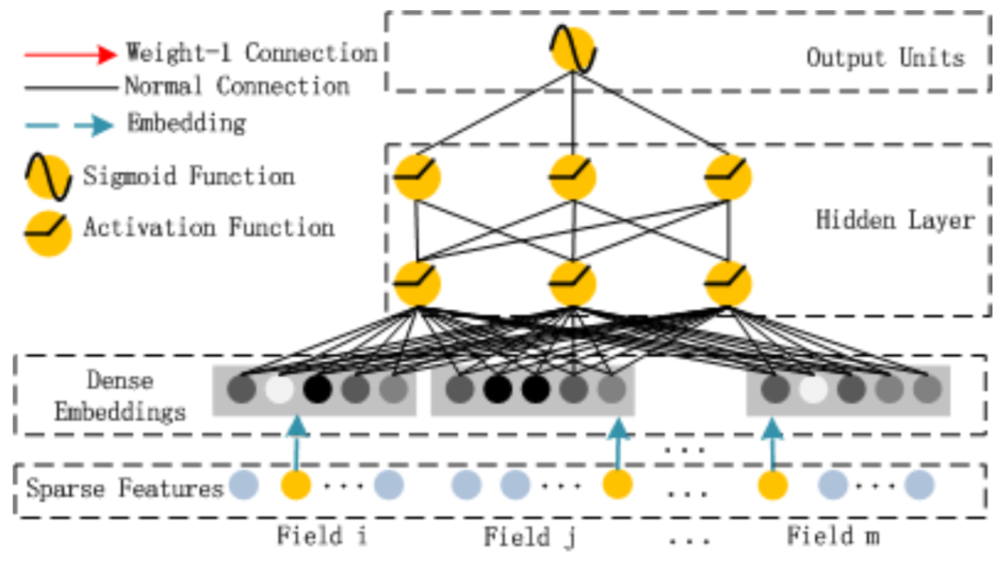
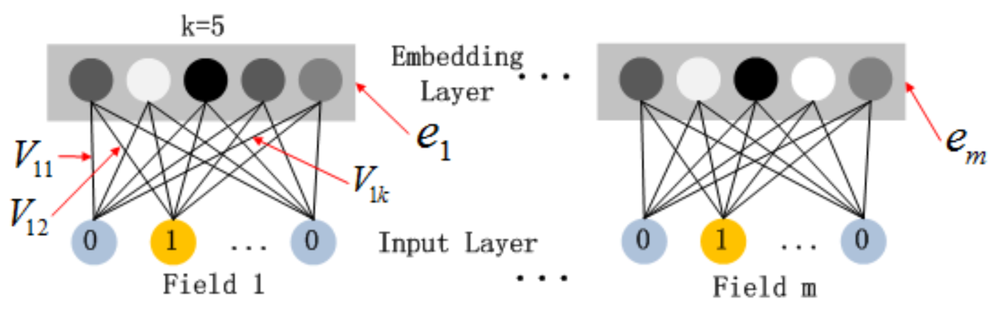

# DeepFM

* [返回顶层目录](../../../../SUMMARY.md)
* [返回上层目录](deep-learning.md)
* [DeepFM架构](#DeepFM架构)
* [DeepFM原理](#DeepFM原理)
  * [FM部分](#FM部分)
  * [Deep部分](#Deep部分)
  * [特征的Embedding层](#特征的Embedding层)

PDF: [*DeepFM: A Factorization-Machine based Neural Network for CTR Prediction*](https://arxiv.org/abs/1703.04247)

类似于Wide&Deep，华为诺亚方舟实验室提出了DeepFM模型，它的特点是：

* 不需要预训练，直接端到端训练
* 同时学习低阶和高阶的特征交叉
* Wide部分和Deep部分共享特征的Embedding

# DeepFM架构

显然，Wide侧是FM，Deep侧就是一个多层神经网络。而且Wide侧和Deep侧共享了底层的特征Embedding。

DeepFM同时考虑了低阶（FM）和高阶（Deep）特征交叉，和单独各自作为模型相比，这样做会带来额外的收益。

Wide侧采用FM避免了特征工程，因为它能自动进行特征交叉。

# DeepFM原理

设训练数据为n个$$(x,y)$$样本，其中，$$x=[x_{field_1}, x_{field_2}, ... x_{field_j}, ... , x_{field_m}]$$，$$y\in {0, 1}$$。

CTR预测模型为$$\hat{y}=CTR\_model(x)$$。

就和FM一样，对于每一个特征，都会有一个一阶权值$$w_i$$和一个二阶特征交叉的隐向量（Embedding）$$V_i$$，而且$$V_i$$还会被Deep模型共享用来进行高阶特征交叉。

所有的参数，包括$$w_i$$，$$V_i$$，和深度网络参数$$(W^{(l)},\ b^{(l)})$$，会按照如下的模型进行训练：
$$
\hat{y}=sigmoid(y_{FM}+y_{DNN})
$$
其中，$$y_{FM}$$为FM部分的输出值，$$y_{DNN}$$为Deep部分的输出值。

## FM部分

模型为：
$$
y_{FM}=w_0+\sum_{i=1}^dw_ix_i+\sum_{j_1=1}^d\sum_{j_2=j_1+1}^d<V_i,V_j>x_{j_1}\cdot x_{j_2}
$$

## Deep部分

Deep部分就是一个简单的前馈神经网络，用于高阶特征交叉。

## 特征的Embedding层

FM部分和Deep部分共享了特征的Embedding层，该层具体结构如下：

特征的Embedding其实就是OneHot对应的神经网络权重，这一点和Word2Vec一样。

# 参考资料

===

[CTR预估算法之FM, FFM, DeepFM及实践](https://blog.csdn.net/John_xyz/article/details/78933253)

[FFM及DeepFFM模型在推荐系统的探索](http://axure.pmskill.net/AI/%E6%96%B0%E6%B5%AA-ffm%E5%8F%8Adeepffm%E6%A8%A1%E5%9E%8B%E5%9C%A8%E6%8E%A8%E8%8D%90%E7%B3%BB%E7%BB%9F%E7%9A%84%E6%8E%A2%E7%B4%A2%E5%8F%8A%E5%AE%9E%E8%B7%B5.pdf)

[翻译：DeepFM：基于因子分解 -机器的CTR预测神经网络](https://www.kdocs.cn/l/sY7EQM541)

[【通俗易懂】手把手带你实现DeepFM！](https://mp.weixin.qq.com/s/QrO48ZdP483TY_EnnWFhsQ)

