# Factorization Machines

* [返回顶层目录](../../../SUMMARY.md)
* [返回上层目录](../advanced-knowledge.md)
* [FM的原理](#FM的原理)
* [演进到FM模型的两条路径](#演进到FM模型的两条路径)
  * [从LR到SVM再到FM模型](#从LR到SVM再到FM模型)
  * [从MF到FM模型](#从MF到FM模型)
* [FM公式推导](#FM公式推导)
  * [算法计算复杂度](#算法计算复杂度)
  * [梯度求导](#梯度求导)
* [利用FM模型做统一的召回模型](#利用FM模型做统一的召回模型)
  * [统一召回和多路召回优缺点比较](#统一召回和多路召回优缺点比较)
  * [如何用FM模型做召回模型](#如何用FM模型做召回模型)
    * [极简版FM召回模型](#极简版FM召回模型)
    * [加入场景上下文特征](#加入场景上下文特征)
  * [如何将多路召回融入FM召回模型](#如何将多路召回融入FM召回模型)
  * [FM模型能否将召回和排序阶段一体化](#FM模型能否将召回和排序阶段一体化)
* [直接用FM交叉特征做召回存在的问题](#直接用FM交叉特征做召回存在的问题)
* [使用xlearn实现FM](#使用xlearn实现FM)
  * [安装xlearn](#安装xlearn)
  * [构建LibSVM格式训练数据](#构建LibSVM格式训练数据)
  * [进行训练](#进行训练)
  * [进行预测](#进行预测)


pdf: [Factorization Machines](https://cseweb.ucsd.edu/classes/fa17/cse291-b/reading/Rendle2010FM.pdf)

FM模型其实有些年头了，是2010年由Rendle提出的，但是真正在各大厂大规模在CTR预估和推荐领域广泛使用，其实也就是最近几年的事。

FM模型比较简单，网上介绍的内容也比较多，细节不展开说它了。不过我给个个人判断：我觉得FM是推荐系统工程师应该熟练掌握和应用的必备算法，即使你看很多DNN版本的排序模型，你应该大多数情况会看到它的影子，原因其实很简单：特征组合对于推荐排序是非常非常重要的，而FM这个思路已经很简洁优雅地体现了这个思想了（主要是二阶特征组合）。DNN模型一样离不开这个特点，而MLP结构是种低效率地捕获特征组合的结构，所以即使是深度模型，目前一样还离不开类似FM这个能够直白地直接去组合特征的部分。这是你会反复发现它的原因所在，当然也许是它本人，也许不一定是它本人，但是一定是它的变体。

# FM的原理

FM和FFM模型是最近几年提出的模型，凭借其在数据量比较大并且特征稀疏的情况下，仍然能够得到优秀的性能和效果的特性，屡次在各大公司举办的CTR预估比赛中获得不错的战绩。

FM（Factorization Machine）是由Konstanz大学Steffen Rendle（现任职于Google）于2010年最早提出的，旨在解决稀疏数据下的特征组合问题[[7\]](http://www.algo.uni-konstanz.de/members/rendle/pdf/Rendle2010FM.pdf)。下面以一个示例引入FM模型。假设一个广告分类的问题，根据用户和广告位相关的特征，预测用户是否点击了广告。源数据如下

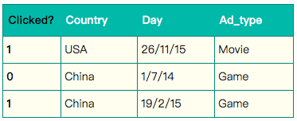

“Clicked?“是label，Country、Day、Ad_type是特征。由于三种特征都是categorical类型的，需要经过独热编码（One-Hot Encoding）转换成数值型特征。


由上表可以看出，经过One-Hot编码之后，大部分样本数据特征是比较稀疏的。上面的样例中，每个样本有7维特征，但平均仅有3维特征具有非零值。实际上，这种情况并不是此例独有的，在真实应用场景中这种情况普遍存在。例如，CTR/CVR预测时，用户的性别、职业、教育水平、品类偏好，商品的品类等，经过One-Hot编码转换后都会导致样本数据的稀疏性。特别是商品品类这种类型的特征，如商品的末级品类约有550个，采用One-Hot编码生成550个数值特征，但每个样本的这550个特征，有且仅有一个是有效的（非零）。由此可见，数据稀疏性是实际问题中不可避免的挑战。

One-Hot编码的另一个特点就是导致特征空间大。例如，商品品类有550维特征，一个categorical特征转换为550维数值特征，特征空间剧增。

同时通过观察大量的样本数据可以发现，某些特征经过关联之后，与label之间的相关性就会提高。例如，`USA`与`Thanksgiving`、`China`与`Chinese New Year`这样的关联特征，对用户的点击有着正向的影响。换句话说，来自`China`的用户很可能会在`Chinese New Year`有大量的浏览、购买行为，而在`Thanksgiving`却不会有特别的消费行为。这种关联特征与label的正向相关性在实际问题中是普遍存在的，如`化妆品`类商品与`女性`，`球类运动配件`的商品与`男性`，`电影票`的商品与`电影`品类偏好等。因此，引入两个特征的组合是非常有意义的。

**多项式模型是包含特征组合的最直观的模型**。在多项式模型中，特征$$x_i$$和$$x_j$$的组合采用$$x_ix_j$$表示，**即$$x_i$$和$$x_j$$都非零时，组合特征$$x_ix_j$$才有意义**。从对比的角度，本文只讨论二阶多项式模型。模型的表达式如下
$$
y(x)=w_0+\sum_{i=1}^nw_ix_i+\sum_{i=1}^n\sum_{j=i+1}^nw_{ij}x_ix_j
$$
其中，$$n$$代表样本的特征数量，$$x_i$$是第$$i$$个特征的值，$$w_0$$、$$w_i$$、$$w_{ij}$$是模型参数。

从上式可以看出，**组合特征的参数一共有$$\frac{n(n-1)}{2}$$个**，任意两个参数都是独立的。然而，在数据稀疏性普遍存在的实际应用场景中，**二次项参数的训练是很困难的**。其原因是，每个**参数$$w_{ij}$$的训练需要大量$$x_i$$和$$x_j$$都非零的样本；由于样本数据本来就比较稀疏，满足“$$x_i$$和$$x_j$$都非零”的样本将会非常少。训练样本的不足，很容易导致参数$$w_{ij}$$不准确**，最终将严重影响模型的性能。

那么，如何解决二次项参数的训练问题呢？矩阵分解提供了一种解决思路。在model-based的协同过滤中，一个rating矩阵可以分解为user矩阵和item矩阵，每个user和item都可以采用一个隐向量表示。比如在下图中的例子中，我们把每个user表示成一个二维向量，同时把每个item表示成一个二维向量，两个向量的点积就是矩阵中user对item的打分。

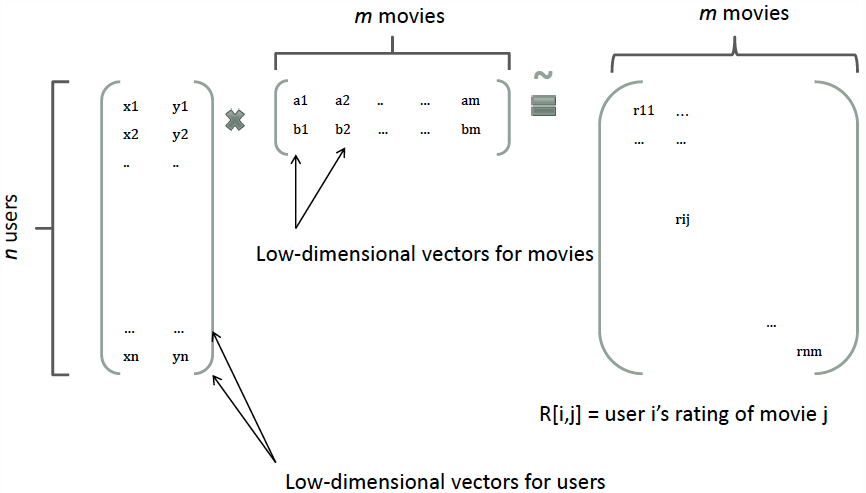

类似地，所有二次项参数$$w_{ij}$$可以组成一个对称阵$$W$$（为了方便说明FM的由来，对角元素可以设置为正实数），那么这个矩阵就可以分解为$$W=V^TV$$，**$$V$$的第$$j$$列便是第$$j$$维特征的隐向量。换句话说，每个参数$$w_{ij}=\left \langle v_i, v_j \right \rangle$$，这就是FM模型的核心思想**。因此，FM的模型方程为（本文不讨论FM的高阶形式）
$$
\begin{aligned}
y(x)&=w_0+\sum_{i=1}^nw_ix_i+\sum_{i=1}^n\sum_{j=i+1}^nw_{ij}x_ix_j\\
&=w_0+\sum_{i=1}^nw_ix_i+\sum_{i=1}^n\sum_{j=i+1}^n\left \langle v_i, v_j \right \rangle x_ix_j
\end{aligned}
$$
其中，$$v_i$$是第$$i$$维特征的隐向量，$$\left \langle \cdot\ ,\ \cdot \right \rangle$$代表向量点积。隐向量的长度为$$k\ (k\ll n)$$，包含$$k$$个描述特征的因子。根据上式，**二次项的参数数量减少为$$kn$$个，远少于多项式模型的参数数量$$\frac{n(n-1)}{2}$$个**。另外，参数因子化使得$$x_hx_i$$的参数和$$x_ix_j$$的参数不再是相互独立的，因此我们可以在样本稀疏的情况下相对合理地估计FM的二次项参数。具体来说，$$x_hx_i$$和$$x_ix_j$$的系数分别为$$\left \langle v_h,\ v_i \right \rangle$$和$$\left \langle v_i,\ v_j \right \rangle$$，它们之间有共同项$$v_i$$。也就是说，**所有包含“$$x_i$$的非零组合特征”（存在某个$$j\neq i$$，使得$$x_ix_j\neq 0$$）的样本都可以用来学习隐向量$$v_i$$，这很大程度上避免了数据稀疏性造成的影响。而在多项式模型中，$$w_{hi}$$和$$w_{ij}$$是相互独立的**。

显而易见，上式是一个通用的拟合方程，**可以采用不同的损失函数用于解决回归、二元分类等问题**，比如可以采用`MSE（Mean Square Error）`损失函数来求解回归问题，也可以采用`Hinge`/`Cross-Entropy`损失来求解分类问题。当然，在进行二元分类时，FM的输出需要经过sigmoid变换，这与Logistic回归是一样的。直观上看，FM的复杂度是$$O(kn^2)$$。但是，通过下式的等式（该公式的证明见下节），FM的二次项可以化简，其**复杂度可以优化到$$O(kn)$$**。由此可见，FM可以在线性时间对新样本作出预测。
$$
\sum_{i=1}^n\sum_{j=i+1}^n\left \langle v_i, v_j \right \rangle x_ix_j=\frac{1}{2}\sum_{f=1}^k\left(\left(\sum_{i=1}^nv_{i,f}x_i\right)^2-\sum_{i=1}^nv_{i,f}^2x_i^2\right)
$$
也就是说，我们**把多项式模型的二阶项的系数从$$w_{ij}$$变为了特征的pair对$$\left \langle v_i ,\ v_j \right \rangle$$。这是核心思想**，即：
$$
w_{i,j}=\left \langle v_i ,\ v_j \right \rangle
$$
其中，$$v_i$$是k维空间的向量。

前面说到不同特征之间存在关联，即

> `USA`与`Thanksgiving`、`China`与`Chinese New Year`这样的关联特征，对用户的点击有着正向的影响。

可以用下面的图来表示（这里是**关键之处**，来自[CMU的FM课件](http://www.cs.cmu.edu/~wcohen/10-605/2015-guest-lecture/FM.pdf)）：


可以看到不同特征pair对的权值并不是完全独立的，比如`USA`与`Thanksgiving`这两个特征的向量就靠的很近，则其特征交叉的权值就会比较大，`China`与`Chinese New Year`这两个特征向量同理。

# 演进到FM模型的两条路径

下面我从两个角度来简单介绍下FM模型，一个角度是从特征组合模型的进化角度来讲；另外一个角度从协同过滤模型的进化角度来讲。FM模型就处于这两类模型进化的交汇口。

## 从LR到SVM再到FM模型

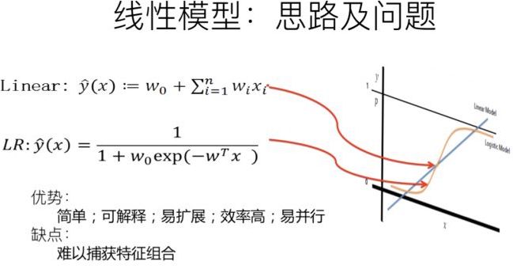

LR模型是CTR预估领域早期最成功的模型，大多工业推荐排序系统采取LR这种“**线性模型+人工特征组合引入非线性**”的模式。因为LR模型具有简单方便易解释容易上规模等诸多好处，所以目前仍然有不少实际系统仍然采取这种模式。但是，LR模型最大的缺陷就是人工特征工程，耗时费力费人力资源，那么能否将特征组合的能力体现在模型层面呢？


其实想达到这一点并不难，如上图在计算公式里加入二阶特征组合即可，任意两个特征进行组合，可以将这个组合出的特征看作一个新特征，融入线性模型中。而组合特征的权重可以用来表示，和一阶特征权重一样，这个组合特征权重在训练阶段学习获得。其实这种二阶特征组合的使用方式，和多项式核SVM是等价的。虽然这个模型看上去貌似解决了二阶特征组合问题了，但是它有个潜在的问题：**它对组合特征建模，泛化能力比较弱，尤其是在大规模稀疏特征存在的场景下，这个毛病尤其突出**，比如CTR预估和推荐排序，这些场景的最大特点就是特征的大规模稀疏。所以上述模型并未在工业界广泛采用。那么，有什么办法能够解决这个问题吗？

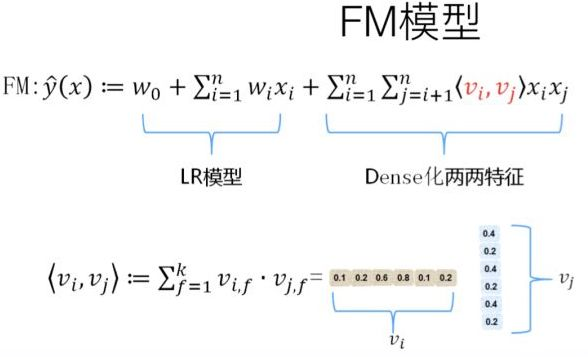

于是，FM模型此刻可以闪亮登场了。如上图所示，FM模型也直接引入任意两个特征的二阶特征组合，和SVM模型最大的不同，在于**特征组合权重的计算方法。FM对于每个特征，学习一个大小为k的一维向量，于是，两个特征$$x_i$$和$$x_j$$的特征组合的权重值，通过特征对应的向量$$v_i$$和$$v_j$$的内积$$<v_i,v_j>$$来表示。这本质上是在对特征进行embedding化表征**，和目前非常常见的各种实体embedding本质思想是一脉相承的，但是很明显在FM这么做的年代（2010年），还没有现在能看到的各种眼花缭乱的embedding的形式与概念。所以FM作为特征embedding，可以看作当前深度学习里各种embedding方法的老前辈。当然，FM这种模式有它的前辈模型吗？有，等会会谈。其实，**和目前的各种深度DNN排序模型比，它仅仅是少了2层或者3层MLP隐层，用来直接对多阶特征非线性组合建模**而已，其它方面基本相同。

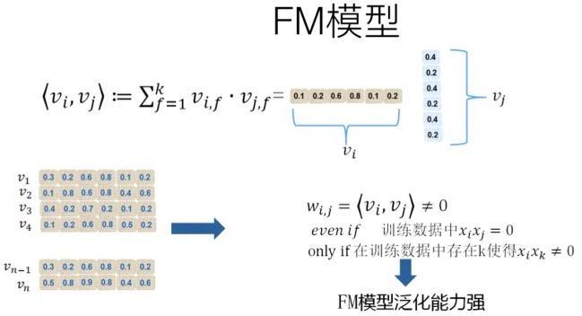

那么为什么说FM的这种特征embedding模式，在大规模稀疏特征应用环境下比较好用？为什么说它的泛化能力强呢？参考上图说明。即使在训练数据里两个特征并未同时在训练实例里见到过，意味着$$x_i$$和$$x_j$$一起出现的次数为0，如果换做SVM的模式，是无法学会这个特征组合的权重的。但是**因为FM是学习单个特征的embedding，并不依赖某个特定的特征组合是否出现过，所以只要特征$$x_i$$和其它任意特征组合出现过，那么就可以学习自己对应的embedding向量。于是，尽管$$x_i$$和$$x_j$$这个特征组合没有看到过，但是在预测的时候，如果看到这个新的特征组合，因为$$x_i$$和$$x_j$$都能学会自己对应的embedding，所以可以通过内积算出这个新特征组合的权重**。这是为何说**FM模型泛化能力强**的根本原因。

其实本质上，这也是目前很多花样的embedding的最核心特点，就是**从0/1这种二值硬核匹配，切换为向量软匹配，使得原先匹配不上的，现在能在一定程度上算密切程度了，具备很好的泛化性能**。

## 从MF到FM模型

FM我们大致应该知道是怎么个意思了，这里又突然冒出个MF，长得跟FM貌似还有点像，那么MF又是什么呢？它跟FM又有什么关系？

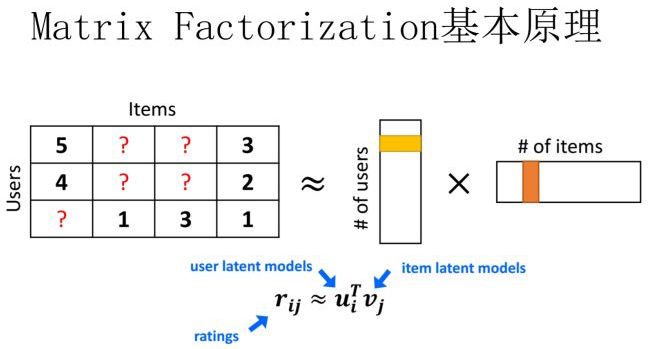

MF（Matrix Factorization，矩阵分解）模型是个在推荐系统领域里资格很深的老前辈协同过滤模型了。核心思想是通过两个低维小矩阵（一个代表用户embedding矩阵，一个代表物品embedding矩阵）的乘积计算，来模拟真实用户点击或评分产生的大的协同信息稀疏矩阵，本质上是编码了用户和物品协同信息的降维模型。

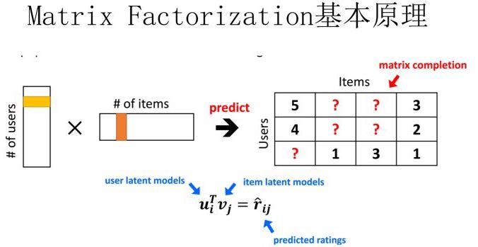

当训练完成，每个用户和物品得到对应的低维embedding表达后，如果要预测某个$$\text{User}_i$$对的$$\text{Item}_j$$评分的时候，只要它们做个内积计算$$<\text{User}_i, \text{Item}_j>$$，这个得分就是预测得分。看到这里，让你想起了什么吗？

身为推荐算法工程师，我假设你对它还是比较熟悉的，更多的就不展开说了，相关资料很多，我们重点说MF和FM的关系问题。

MF和FM不仅在名字简称上看着有点像，其实他们本质思想上也有很多相同点。那么，MF和FM究竟是怎样的关系呢？

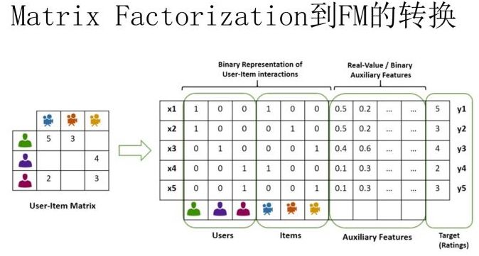

本质上，**MF模型是FM模型的特例**，MF可以被认为是只有User ID 和Item ID这两个特征Fields的FM模型，MF将这两类特征通过矩阵分解，来达到将这两类特征embedding化表达的目的。而FM则可以看作是MF模型的进一步拓展，除了User ID和Item ID这两类特征外，很多其它类型的特征，都可以进一步融入FM模型里，它将所有这些特征转化为embedding低维向量表达，并计算任意两个特征embedding的内积，就是特征组合的权重，如果FM只使用User ID 和Item ID，你套到FM公式里，看看它的预测过程和MF的预测过程一样吗？

从谁更早使用特征embedding表达这个角度来看的话，很明显，和FM比起来，MF才是真正的前辈，无非是特征类型比较少而已。而**FM继承了MF的特征embedding化表达这个优点，同时引入了更多Side information作为特征，将更多特征及Side information embedding化融入FM模型中**。所以很明显FM模型更灵活，能适应更多场合的应用范围。

鉴于MF和FM以上错综复杂剪不断理还乱的关系，我推论出下面的观点（个人意见）：

其一：在你有使用MF做协同过滤的想法的时候，暂时压抑一下这种冲动，可以优先考虑引入FM来做的，而非传统的MF，因为可以在实现等价功能的基础上，很方便地融入其它任意你想加入的特征，把手头的事情做得更丰富多彩。

其二：从实际大规模数据场景下的应用来讲，在排序阶段，绝大多数只使用ID信息的模型是不实用的，没有引入Side Information，也就是除了User ID／Item ID外的很多其它可用特征的模型，是不具备实战价值的。原因很简单，大多数真实应用场景中，User/Item有很多信息可用，而协同数据只是其中的一种，引入更多特征明显对于更精准地进行个性化推荐是非常有帮助的。而如果模型不支持更多特征的便捷引入，明显受限严重，很难真正实用，这也是为何矩阵分解类的方法很少看到在Ranking阶段使用，通常是作为一路召回形式存在的原因。

# FM公式推导

## 算法计算复杂度

从FM的原始数学公式看，因为在进行二阶（2-order）特征组合的时候，假设有n个不同的特征，那么二阶特征组合意味着任意两个特征都要进行交叉组合，所以可以直接推论得出：FM的时间复杂度是n的平方。但是如果故事仅仅讲到这里，FM模型是不太可能如此广泛地被工业界使用的。因为现实生活应用中的n往往是个非常巨大的特征数，如果FM是n平方的时间复杂度，那估计基本就没人带它玩了。

**对于一个实用化模型来说，效果是否足够好只是一个方面，计算效率是否够高也很重要，这两点是一个能被广泛使用算法的一枚硬币的两面，缺其中任何一个可能都不能算是优秀的算法**。如果在两者之间硬要分出谁更重要的话，怎么选？在数据量特别大的情况下，如果在效果好和速度快之间做选择，很多时候跑得快的简单模型会胜出，这是为何LR模型在CTR预估领域一直被广泛使用的原因。

而FFM模型则是反例，我们在几个数据集合上测试过，FFM模型作为排序模型，效果确实是要优于FM模型的，但是FFM模型对参数存储量要求太多，以及无法能做到FM的运行效率，如果中小数据规模做排序没什么问题，但是数据量一旦大起来，对资源和效率的要求会急剧升高，这是严重阻碍FFM模型大规模数据场景实用化的重要因素。

再顺手谈谈DNN排序模型，现在貌似看着有很多版本的DNN排序模型，但是考虑到上面讲的运算效率问题，你会发现太多所谓效果好的模型，其实不具备实用价值，算起来太复杂了，效果好得又很有限，超大规模训练或者在线 Serving速度根本跟不上。除非，你们公司有具备相当强悍实力的工程团队，能够进行超大数据规模下的大规模性能优化，那当我上面这句话没说。

我对排序模型，如果你打算推上线真用起来的话，建议是，沿着这个序列尝试：**FM-->DeepFM**。你看着路径有点短是吗？确实比较短。**如果DeepFM做不出效果，别再试着去尝试更复杂的模型了**，还是多从其它方面考虑考虑优化方案为好。有些复杂些的模型，也许效果确实好一些，在个别大公司也许真做上线了，但是很可能效果好不是算法的功劳，是工程能力强等多个因素共同导致的，人家能做，你未必做的了。至于被广泛尝试的Wide &Deep，我个人对它有偏见，所以直接被我跳过了。当然，如果你原始线上版本是LR，是可以直接先尝试Wide&Deep的，但是即使如此，要我做升级方案，我给的建议会是这个序列：**LR—>FM—>DeepFM—>干点其他的**。

如何优化FM的计算复杂度？


再说回来，**FM如今被广泛采用并成功替代LR模型的一个关键所在是：它可以通过数学公式改写，把表面貌似是$$O(kn^2)$$的复杂度降低到$$O(kn)$$**，其中$$n$$是特征数量，$$k$$是特征的embedding size，这样就**将FM模型改成了和LR类似和特征数量$$n$$成线性规模的时间复杂度**了，这点非常好。

那么，如何改写原始的FM数学公式，让其复杂度降下来呢？因为原始论文在推导的时候没有给出详细说明，我相信不少人看完估计有点懵，所以这里简单解释下推导过程:

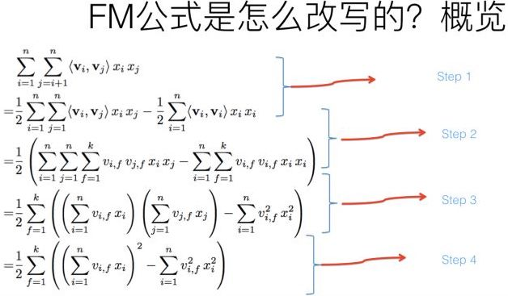

上图展示了整个推导过程，我相信如果数学基础不太扎实的同学看着会有点头疼，转换包括四个步骤，下面分步骤解释下。

* **step 1:**

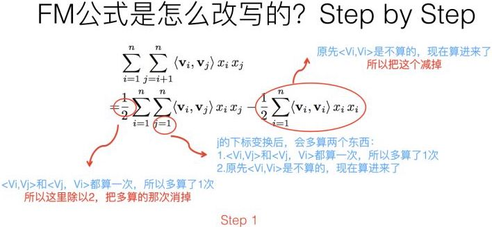

第一个改写步骤及为何这么改写参考上图，比较直观，不解释了；

* **step 2:**

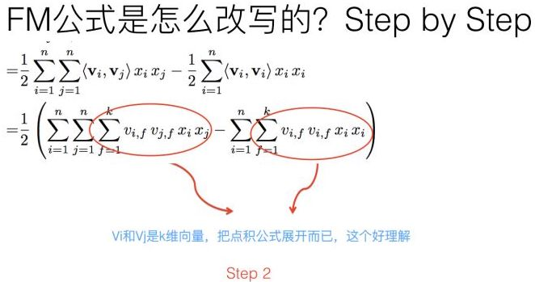

第二步转换更简单，更不用解释了。

* **step 3:**

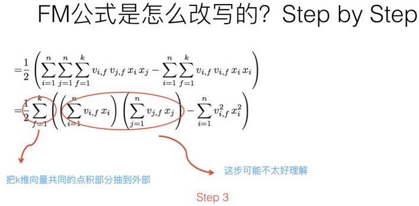

第三步转换不是太直观，可能需要简单推导一下，很多人可能会卡在这一步，所以这里解释解释。

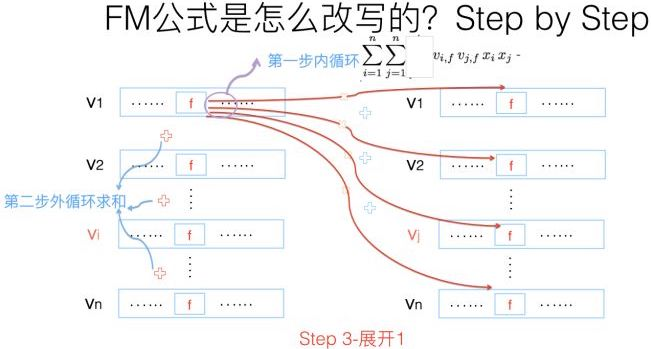

其实吧，如果把k维特征向量内积求和公式抽到最外边后，公式就转成了上图这个公式了（不考虑最外边k维求和过程的情况下）。它有两层循环，内循环其实就是指定某个特征的第f位（这个f是由最外层那个k指定的）后，和其它任意特征对应向量的第f位值相乘求和；而外循环则是遍历每个的第f位做循环求和。这样就完成了指定某个特征位f后的特征组合计算过程。最外层的k维循环则依此轮循第f位，于是就算完了步骤三的特征组合。

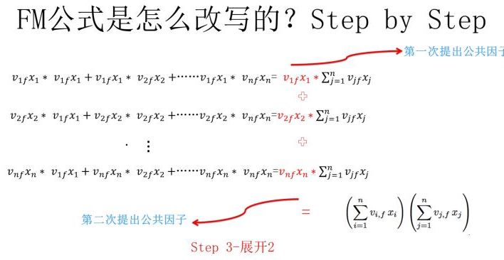

对上一页公式图片展示过程用公式方式，再一次改写（参考上图），其实就是两次提取公共因子而已，这下应该明白了吧？

* **step 4:**

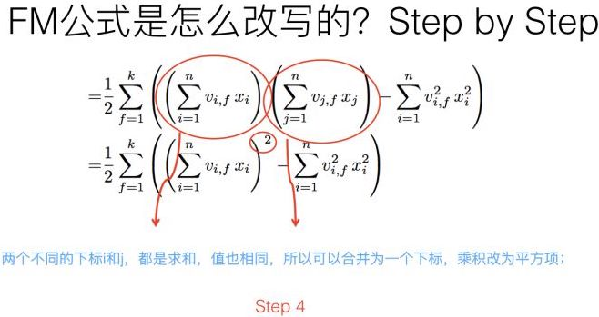

第四步公式变换，意思参考上图，这步也很直白，不解释。

于是，通过上述四步的公式改写，可以看出在实现FM模型时，时间复杂度就降低到了$$O(kn)$$了，而虽说看上去n还有点大，但是其实真实的推荐数据的特征值是极为稀疏的，就是说大量$$x_i$$其实取值是0，意味着真正需要计算的特征数n是远远小于总特征数目n的，无疑这会进一步极大加快FM的运算效率。

这里需要强调下改写之后的FM公式的第一个平方项，怎么理解这个平方项的含义呢？这里其实蕴含了后面要讲的使用FM模型统一多路召回的基本思想，所以这里特殊提示一下。

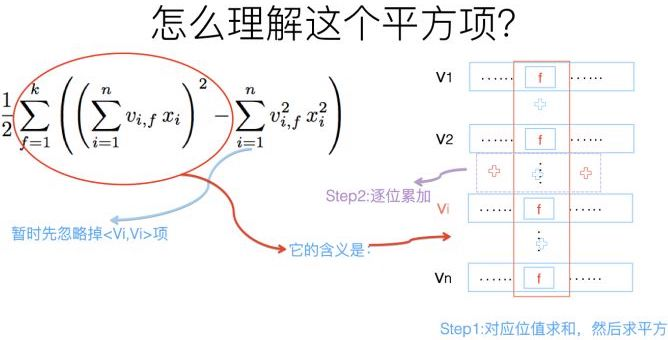

参考上图，你体会下这个计算过程。它其实等价于什么？

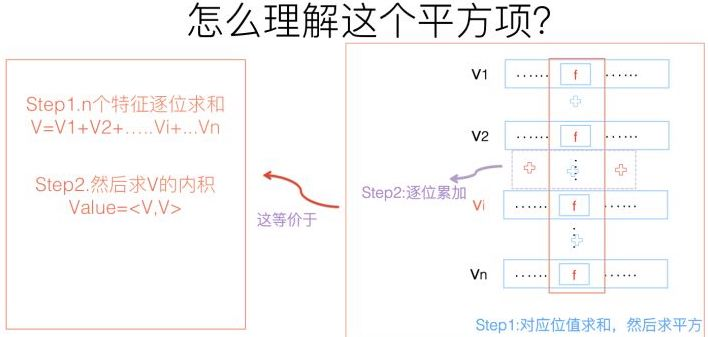

这个平方项，它等价于将FM的所有特征项的embedding向量累加，之后求内积。我再问下之前问过的问题：“我们怎样利用FM模型做统一的召回？”这个平方项的含义对你有启发吗？你可以仔细想想它们之间的关联。

## 梯度求导

FM的计算公式为：
$$
\begin{aligned}
y(x)&=w_0+\sum_{i=1}^nw_ix_i+\sum_{i=1}^n\sum_{j=i+1}^nw_{ij}x_ix_j\\
&=w_0+\sum_{i=1}^nw_ix_i+\sum_{i=1}^n\sum_{j=i+1}^n\left \langle v_i, v_j \right \rangle x_ix_j\\
&=w_0+\sum_{i=1}^nw_ix_i+\frac{1}{2}\sum_{f=1}^k\left(\left(\sum_{i=1}^nv_{i,f}x_i\right)^2-\sum_{i=1}^nv_{i,f}^2x_i^2\right)
\end{aligned}
$$
我们通过随机梯度下降SGD进行求解：
$$
\begin{aligned}
\frac{\partial}{\partial \theta}\hat{y}(x)=
\left\{\begin{matrix}
&1,&\text{if }\theta\ \text{is }w_0\\ 
&x_i,&\text{if }\theta\ \text{is }w_i\\ 
&x_i\sum_{j=1}^nv_{j,f}x_j-v_{i,f}x_i^2,&\text{if }\theta\ \text{is }v_{i,f}\\ 
\end{matrix}\right.
\end{aligned}
$$

# 利用FM模型做统一的召回模型

目前工业界推荐系统在召回阶段，大多数采用了多路召回策略，比如典型的召回路有：基于用户兴趣标签的召回；基于协同过滤的召回；基于热点的召回；基于地域的召回；基于Topic的召回；基于命名实体的召回等等，除此外还有很多其它类型的召回路。

现在我们来探讨下第一个问题：在召回阶段，能否用一个统一的模型把多路召回招安？就是说改造成利用单个模型，单路召回的模式？具体到这篇文章，就是说能否利用FM模型来把多路召回统一起来？

在回答上述问题之前，我估计你会提出疑问：目前大家用多路召回用的好好的，为啥要多此一举，用一个模型把多路召回统一起来呢？这个问题非常好，我们确实应该先看这么做的必要性。

## 统一召回和多路召回优缺点比较

我们先来说明下统一召回和多路召回各自的优缺点，我觉得使用统一召回模式，相对多路召回有如下优点：

首先，采用多路召回，每一路召回因为采取的策略或者模型不同，所以各自的召回模型得分不可比较，比如利用协同过滤召回找到的候选Item得分，与基于兴趣标签这一路召回找到的候选Item得分，完全是不可比较的。这也是为何要用第二阶段Ranking来将分数统一的原因。而如果采取统一的召回模型，比如FM模型，那么不论候选项Item来自于哪里，它们在召回阶段的得分是完全可比的。

其次，貌似在目前“召回+Ranking”两阶段推荐模型下，多路召回分数不可比这个问题不是特别大，因为我们可以依靠Ranking阶段来让它们可比即可。但是其实多路召回分数不可比会直接引发一个问题：对于每一路召回，我们应该返回多少个Item是合适的呢？如果在多路召回模式下，这个问题就很难解决。既然分数不可比，那么每一路召回多少候选项K就成为了超参，需要不断调整这个参数上线做AB测试，才能找到合适的数值。而如果召回路数特别多，于是每一路召回带有一个超参K，就是这一路召回多少条候选项，这样的超参组合空间是非常大的。所以到底哪一组超参是最优的，就很难定。其实现实情况中，很多时候这个超参都是拍脑袋上线测试，找到最优的超参组合概率是很低的。

而如果假设我们统一用FM模型来做召回，其实就不存在上面这个问题。这样，我们可以在召回阶段做到更好的个性化，比如有的用户喜欢看热门的内容，那么热门内容在召回阶段返回的比例就高，而其它内容返回比例就低。所以，可以认为各路召回的这组超参数就完全依靠FM模型调整成个性化的了，很明显这是使用单路单模型做召回的一个特别明显的好处。

再次，对于工业界大型的推荐系统来说，有极大的可能做召回的技术人员和做Ranking的技术人员是两拨人。这里隐含着一个潜在可能会发生的问题，比如召回阶段新增了一路召回，但是做Ranking的哥们不知道这个事情，在Ranking的时候没有把能体现新增召回路特性的特征加到Ranking阶段的特征中。这样体现出来的效果是：新增召回路看上去没什么用，因为即使你找回来了，而且用户真的可能点击，但是在排序阶段死活排不上去。也就是说，在召回和排序之间可能存在信息鸿沟的问题，因为目前召回和排序两者的表达模式差异很大，排序阶段以特征为表达方式，召回则以“路／策略／具体模型”为表达方式，两者之间差异很大，是比较容易产生上述现象的。

但是如果我们采用FM模型来做召回的话，新增一路召回就转化为新增特征的问题，而这一点和Ranking阶段在表现形式上是相同的，对于召回和排序两个阶段来说，两者都转化成了新增特征问题，所以两个阶段的改进语言体系统一，就不太容易出现上述现象。

上面三点，是我能想到的采用统一召回模型，相对多路召回的几个好处。但是是不是多路召回一定不如统一召回呢？其实也不是，很明显多路召回这种策略，上线一个新召回方式比较灵活，对线上的召回系统影响很小，因为不同路召回之间没有耦合关系。但是如果采用统一召回，当想新增一种召回方式的时候，表现为新增一种或者几种特征，可能需要完全重新训练一个新的FM模型，整个召回系统重新部署上线，灵活性比多路召回要差。

上面讲的是必要性，讲完了必要性，我们下面先探讨如何用FM模型做召回，然后再讨论如何把多路召回改造成单路召回，这其实是两个不同的问题。

## 如何用FM模型做召回模型

如果要做一个实用化的统一召回模型，要考虑的因素有很多，比如Context上下文特征怎么处理，实时反馈特征怎么加入等。为了能够更清楚地说明，我们先从极简模型说起，然后逐步加入必须应该考虑的元素，最后形成一个实用化的统一召回模型。

不论是简化版本FM召回模型，还是复杂版本，首先都需要做如下两件事情：

**第一，离线训练**。这个过程跟在排序阶段采用FM模型的离线训练过程是一样的，比如可以使用线上收集到的用户点击数据来作为训练数据，线下训练一个完整的FM模型。在召回阶段，我们想要的其实是：每个特征和这个特征对应的训练好的embedding向量。这个可以存好待用。

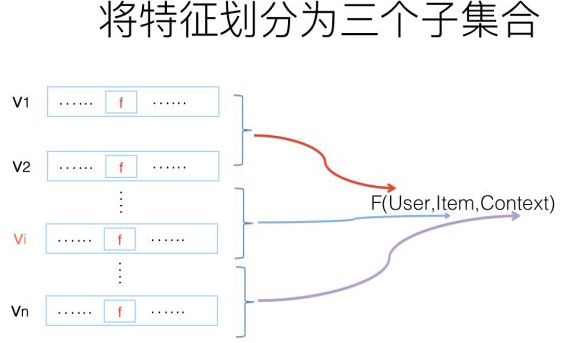

第二，如果将推荐系统做个很高层级的抽象的话，可以表达成学习如下形式的映射函数：
$$
y=F(User,Item,Context)
$$
意思是，我们利用用户（User）相关的特征，物品(Item)相关的特征，以及上下文特征（Context,比如何时何地用的什么牌子手机登陆等等）学习一个映射函数F。学好这个函数后，当以后新碰到一个Item，我们把用户特征，物品特征以及用户碰到这个物品时的上下文特征输入F函数，F函数会告诉我们用户是否对这个物品感兴趣。如果他感兴趣，就可以把这个Item作为推荐结果推送给用户。

说了这么多，第二个我们需要做的事情是：把特征划分为三个子集合，用户相关特征集合，物品相关特征集合以及上下文相关的特征集合。而用户历史行为类特征，比如用户过去点击物品的特征，可以当作描述用户兴趣的特征，放入用户相关特征集合内。至于为何要这么划分，后面会讲。

做完上述两项基础工作，我们可以试着用FM模型来做召回了。

### 极简版FM召回模型

我们先来构建一个极简的FM召回模型，首先，我们先不考虑上下文特征，晚点再说。

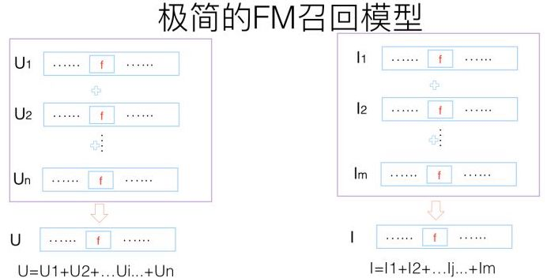

第一步，对于某个用户，我们可以把属于这个用户子集合的特征，查询离线训练好的FM模型对应的特征embedding向量，然后将n个用户子集合的特征embedding向量累加，形成用户兴趣向量U，这个向量维度和每个特征的维度是相同的。

类似的，我们也可以把每个物品，其对应的物品子集合的特征，查询离线训练好的FM模型对应的特征embedding向量，然后将m个物品子集合的特征embedding向量累加，形成物品向量I，这个向量维度和每个特征的维度也是是相同的。

对于极简版FM召回模型来说，用户兴趣向量U可以离线算好，然后更新线上的对应内容；物品兴趣向量I可以类似离线计算或者近在线计算，问题都不大。

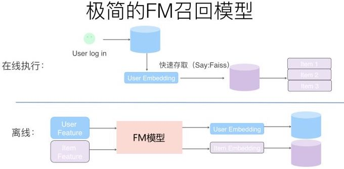

第二步，对于每个用户以及每个物品，我们可以利用步骤一中的方法，将每个用户的兴趣向量离线算好，存入在线数据库中比如Redis（用户ID及其对应的embedding），把物品的向量逐一离线算好，存入Faiss(Facebook开源的embedding高效匹配库)数据库中。

当用户登陆或者刷新页面时，可以根据用户ID取出其对应的兴趣向量embedding，然后和Faiss中存储的物料embedding做内积计算，按照得分由高到低返回得分Top K的物料作为召回结果。提交给第二阶段的排序模型进行进一步的排序。这里Faiss的查询速度至关重要，至于这点，后面我们会单独说明。

这样就完成了一个极简版本FM召回模型。但是这个版本的FM召回模型存在两个问题。

**问题一**：首先我们需要问自己，这种累加用户embedding特征向量以及累加物品embedding特征向量，之后做向量内积。这种算法符合FM模型的原则吗？和常规的FM模型是否等价？

我们来分析一下。这种做法其实是在做用户特征集合U和物品特征集合I之间两两特征组合，是符合FM的特征组合原则的，考虑下列公式是否等价就可以明白了：
$$
\begin{aligned}
<\sum_iU_i,\sum_jI_j>\\
\sum_i\sum_j<U_i,U_j>
\end{aligned}
$$
其实两者是等价的，建议您可以推导一下（这其实不就是上面在介绍FM公式改写的第三步转换吗？当然，跟完全版本的FM比，**我们没有考虑U和I特征集合内部任意两个特征的组合**，等会会说这个问题）。

也可以这么思考问题：在上文我们说过，FM为了提升计算效率，对公式进行了改写，改写后的高效计算公式的第一个平方项其实等价于：把所有特征embedding向量逐位累加成一个求和向量V，然后自己和自己做个内积操作<V,V>。这样等价于根据FM的原则计算了任意两个特征的二阶特征组合了。而上面描述的方法，和标准的FM的做法其实是一样的，区别无非是**将特征集合划分为两个子集合U和I，分别代表用户相关特征及物品相关特征。而上述做法其实等价于在用户特征U和物品特征I之间做两两特征组合，只是少了U内部之间特征，及I内部特征之间的特征组合而已**。一般而言，其实我们不需要做U内部特征之间以及I内部特征之间的特征组合，对最终效果影响很小。于是，沿着这个思考路径，我们也可以推导出上述做法基本和FM标准计算过程是等价的。

**问题二**：这个版本FM是个简化版本模型，因为它没考虑场景上下文特征，那么如果再将上下文特征引入，此时应该怎么做呢？

### 加入场景上下文特征

上面叙述了如何根据FM模型做一个极简版本的召回模型，之所以说极简，因为我们上面说过，抽象的推荐系统除了用户特征及物品特征外，还有一类重要特征，就是用户发生行为的场景上下文特征（比如什么时间在什么地方用的什么设备在刷新），而上面版本的召回模型并没有考虑这一块。

之所以把上下文特征单独拎出来，是因为它有自己的特点，有些上下文特征是近乎实时变化的，比如刷新微博的时间，再比如对于美团嘀嘀这种对地理位置特别敏感的应用，用户所处的地点可能随时也在变化，而这种变化在召回阶段就需要体现出来。所以，上下文特征是不太可能像用户特征离线算好存起来直接使用的，而是用户在每一次刷新可能都需要重新捕获当前的特征值。动态性强是它的特点。

而考虑进来上下文特征，如果我们希望构造和标准的FM等价的召回模型，就需要多考虑两个问题：

问题一：既然部分上下文特征可能是实时变化的，无法离线算好，那么怎么融入上文所述的召回计算框架里？

问题二：我们需要考虑上下文特征C和用户特征U之间的特征组合，也需要考虑C和物品特征I之间的特征组合。上下文特征有时是非常强的特征。那么，如何做能够将这两对特征组合考虑进来呢？

我们可以这么做：

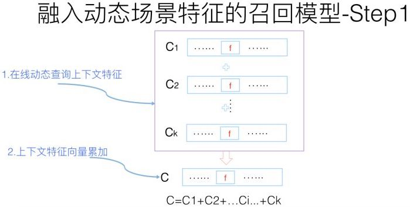

首先，由于上下文特征的动态性，所以给定用户UID后，可以在线查询某个上下文特征对应的embedding向量，然后所有上下文向量求和得到综合的上下文向量C。这个过程其实和U及I的累加过程是一样的，区别无非是上下文特征需要在线实时计算。而一般而言，场景上下文特征数都不多，所以在线计算，速度方面应可接受。

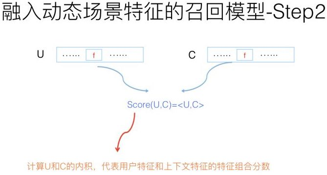

然后，将在线算好的上下文向量C和这个用户的事先算好存起来的用户兴趣向量U进行内积计算Score=<U,C>。这个数值代表用户特征和上下文特征的二阶特征组合得分，算好备用。至于为何这个得分能够代表FM中的两者（U和C）的特征组合，其实道理和上面讲的U和I做特征组合道理是一样的。

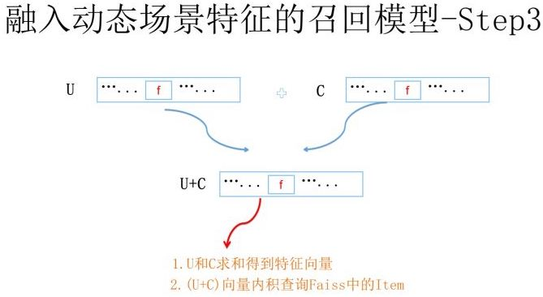

再然后，将U和C向量累加求和，利用（U+C）去Faiss通过内积方式取出Top K物品，这个过程和极简版是一样的，无非查询向量由U换成了（U+C）。通过这种方式取出的物品同时考虑到了用户和物品的特征组合<U,I>，以及上下文和物品的特征组合<C,I>。道理和之前讲的内容是类似的。

**假设返回的Top K物品都带有内积的得分Score1，再考虑上一步<U,C>的得分Score，将两者相加对物品重排序**（<U,C>因为跟物品无关，所以其实不影响物品排序，但是会影响最终得分，FM最外边的Sigmoid输出可能会因为加入这个得分而发生变化），就得到了最终结果，而这个最终结果考虑了U/I/C两两之间的特征组合。

于是我们通过这种手段，构造出了一个完整的FM召回模型。这个召回模型通过构造user embedding，Context embedding和Item embedding，以及充分利用类似Faiss这种高效embedding计算框架，就构造了高效执行的和FM计算等价的召回系统。

## 如何将多路召回融入FM召回模型

上文所述是如何利用FM模型来做召回，下面我们讨论下如何将多路召回统一到FM召回模型里来。

我们以目前不同类型推荐系统中共性的一些召回策略来说明这个问题，以信息流推荐为例子，传统的多路召回阶段通常包含以下策略：协同过滤，兴趣分类，兴趣标签，兴趣Topic，兴趣实体，热门物品，相同地域等。这些不同角度的召回策略都是较为常见的。

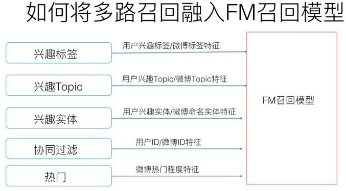

我们再将上述不同的召回路分为两大类，可以把协同过滤作为一类，其它的作为一类，协同过滤相对复杂，我们先说下其它类别。

对于比如兴趣分类，兴趣标签，热门，地域等召回策略，要把这些召回渠道统一到FM模型相对直观，只需要在训练FM模型的时候，针对每一路的特性，在用户特征端和物品特征端新增对应特征即可。比如对于地域策略，我们可以把物品所属地域（比如微博所提到的地域）和用户的感兴趣地域都作为特征加入FM模型即可。兴趣标签，Topic，兴趣实体等都是类似的。所以大多数情况下，在多路召回模式下你加入新的一路召回，在FM统一召回策略下，对应地转化成了新增特征的方式。

然后我们再说协同过滤这路召回。其实本质上也是将一路召回转化为新加特征的模式。我们上文在介绍FM模型和MF模型关系的时候提到过：本质上MF模型这种典型的协同过滤策略，是FM模型的一个特例，可以看作在FM模型里只有User ID和Item ID这两类（Fields）特征的情形。意思是说，如果我们将user ID和Item ID作为特征放入FM模型中进行训练，那么FM模型本身就是包含了协同过滤的思想的。当然，对于超大规模的网站，用户以亿计，物品可能也在千万级别，如果直接把ID引入特征可能会面临一些工程效率问题以及数据稀疏的问题。对于这个问题，我们可以采取类似在排序阶段引入ID时的ID哈希等降维技巧来进行解决。

所以综合来看，在多路召回下的每一路召回策略，绝大多数情况下，可以在FM召回模型模式中转化为新增特征的方式。

在具体实施的时候，可以沿着这个路径逐步替换线上的多路召回：先用FM模型替换一路召回，线上替换掉；再新加入某路特征，这样上线，就替换掉了两路召回；如此往复逐渐把每一路召回统一到一个模型里。这是比较稳的一种替换方案。当然如果你是个猛人，直接用完整的FM召回模型一步替换掉线上的各路召回，也，未尝不可。只要小流量AB测试做好也没啥。

## FM模型能否将召回和排序阶段一体化

前文有述，之所以目前常见的工业推荐系统会分为召回排序两个阶段，是因为这两个阶段各司其职，职责分明。召回主要考虑泛化性并把候选物品集合数量降下来；排序则主要负责根据用户特征／物品特征／上下文特征对物品进行精准排名。

那么，我们现在可以来审视下本文开头提出的第二个问题了：FM模型能否将常见的两阶段模型一体化？即是否能将实用化的推荐系统通过FM召回模型简化为单阶段模型？意思是推荐系统是否能够只保留FM召回这个模块，扔掉后续的排序阶段，FM召回按照得分排序直接作为推荐结果返回。我们可以这么做吗？

这取决于FM召回模型是否能够一并把原先两阶段模型的两个职责都能承担下来。这句话的意思是说，FM召回模型如果直接输出推荐结果，那么它的速度是否足够快？另外，它的精准程度是否可以跟两阶段模型相媲美？不会因为少了第二阶段的专门排序环节，而导致推荐效果变差？如果上面两个问题的答案都是肯定的，那么很明显FM模型就能够将现有的两阶段推荐过程一体化。

我们分头来分析这个问题的答案：准确性和速度。先从推荐精准度来说明，因为如果精准度没有办法维持，那么速度再快也没什么意义。

所以现在的第一个子问题是：FM召回模型推荐结果的质量，是否能够和召回+排序两阶段模式接近？

我们假设一个是FM统一召回模型直接输出排序结果；而对比模型是目前常见的多路召回+FM模型排序的配置。从上文分析可以看出，尽管FM召回模型为了速度够快，做了一些模型的变形，但是如果对比的两阶段模型中的排序阶段也采取FM模型的话，我们很容易推理得到如下结论：如果FM召回模型采用的特征和两阶段模型的FM排序模型采用相同的特征，那么两者的推荐效果是等价的。这意味着：只要目前的多路召回都能通过转化为特征的方式加入FM召回模型，而且FM排序阶段采用的特征在FM召回模型都采用。那么两者推荐效果是类似的。这意味着，从理论上说，是可以把两阶段模型简化为一阶段模型的。

既然推理的结论是推荐效果可以保证，那么我们再来看第二个问题：只用FM召回模型做推荐，速度是否足够快？

我们假设召回阶段FM模型对User embedding和Item embedding的匹配过程采用Facebook的Faiss系统，其速度快慢与两个因素有关系：

1. 物品库中存储的Item数量多少，Item数量越多越慢；
2. embedding大小，embedding size越大，速度越慢；

微博机器学习团队18年将Faiss改造成了分布式版本，并在业务易用性方面增加了些新功能，之前我们测试的查询效率是：假设物品库中存储100万条微博embedding数据，而embedding size=300的时候，TPS在600左右，平均每次查询小于13毫秒。而当库中微博数量增长到200万条，embedding size=300的时候，TPS在400左右，平均查询时间小于20毫秒。这意味着如果是百万量级的物品库，embedding size在百级别，一般而言，通过Faiss做embedding召回速度是足够实用化的。如果物品库大至千万量级，理论上可以通过增加Faiss的并行性，以及减少embedding size来获得可以接受的召回速度。

当然，上面测试的是纯粹的Faiss查询速度，而事实上，我们需要在合并用户特征embedding的时候，查询用户特征对应的embedding数据，而这块问题也不太大，因为绝大多数用户特征是静态的，可以线下合并进入用户embedding，Context特征和实时特征需要线上在线查询对应的embedding，而这些特征数量占比不算太大，所以速度应该不会被拖得太慢。

综上所述，FM召回模型从理论分析角度，其无论在实用速度方面，还是推荐效果方面，应该能够承载目前“多路召回+FM排序”两阶段推荐模式的速度及效果两方面功能，所以推论它是可以将推荐系统改造成单模型单阶段模式的。

当然，上面都是分析结果，并非实测，所以不能确定实际应用起来也能达到上述理论分析的效果。

# 直接用FM交叉特征做召回存在的问题

如果FM召回模型采用的特征和两阶段模型的FM排序模型采用相同的特征，那么两者的推荐效果是等价的。这里有些遗憾，召回模式只有交叉特征，而直接用fm排序，既有交叉特征又有非交叉特征。这样的话效果上应该会有偏差，可以直接等价吗？

回答：有实验证明FM加上一阶的那个LR和不加其实效果差不多。

又有人说：在自己的数据集上试了试，同样的参数，3000万样本，120万维度，同样的参数，加上LR，AUC从0.79 提升到 0.80，这个还是要看数据集？

本回答来自[这里](https://zhuanlan.zhihu.com/p/58160982)的评论。

# 使用xlearn实现FM

xlearn使用文档：[xlearn-doc](https://xlearn-doc-cn.readthedocs.io/en/latest/index.html)

xlearn源码：[github-aksnzhy/xlearn](https://github.com/aksnzhy/xlearn)

具体的参数配置和使用方法，请阅读xlearn使用文档，这里不再赘述。

##安装xlearn

参考[xlearn详细安装指南](https://xlearn-doc-cn.readthedocs.io/en/latest/install/index.html#)进行安装。

注意：在最后一步的时候，可能需要把python换成你使用的python路径，不然就把xlearn安装到其他版本的python里去了。

## 构建LibSVM格式训练数据

xlearn需要的训练数据是LibSVM格式的特征，注意起始编号为1，即

```
1 1:1 3:1 5:1
0 2:1 3:1 6:1
1 1:1 4:1 5:1
```

对上面训练数据格式的解释：

* 训练样本按第一个空格分割，左侧是训练样本的label，右侧是训练样本的特征
* 第一列为label，如果是分类任务，只能是1或者0
* 从第二列开始为特征数据，特征的起始index必须是1，而不能是0，这是LibSVM格式的自身要求

特征构建说明，对于离散特征，必须onehot化，对于连续特征，也建议onehot化，这样会增加非线性，增强拟合能力。

在实际工程中，对于大量的样本（量级为几千万到几十亿条），一般采用spark生成训练数据。

## 进行训练

具体请看xlearn的文档，这里仅给出一个简单示例：

```python
import xlearn as xl
fm_model = xl.create_fm()
# 如果你的数据超过了内存的20%，
# 那么就需要使用这个命令了，它会分批次的读入内存
#fm_model.setOnDisk() 
# 这个命令会禁止对输入特征进行归一化
fm_model.disableNorm()
fm_model.setTrain(trainPath)
fm_model.setValidate(testPath)

param = {'task': 'binary'
		'lr': 0.2
		'lambda': 0.002
		'k': 12
		'epoch': 10
		'block_size': 1000
		'metric': auc
		'opt': adagrad
		'stop_window': 2}

print(param.items())

fm_model.setTXTModel("model.txt")
fm_model.fit(param, "model.out")
```

训练过程：

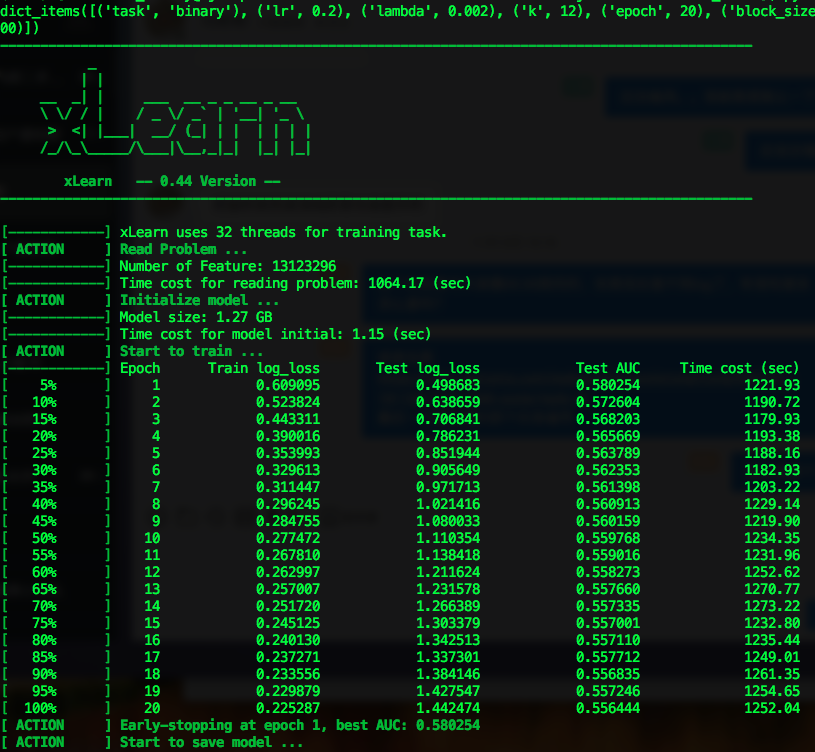

正常情况下，train和test的交叉熵损失会下降，同时test的AUC会上升。上图就是非正常情况。

AUC体现了排序能力，而交叉熵损失体现了拟合能力，这里我们更关注排序能力，即正样本的预测值和负样本的预测值是要有差别的，但并不要求正样本的预测值一定要大于0.5，比如正样本的预测值可以为0.4，负样本的预测值为0.2，这时候虽然交叉熵损失还较高，但是AUC已经很不错了，AUC训练完成时一般正常情况都在0.7以上。否则就要怀疑是否训练样本出错了，比如训练样本的正负样本采样比例和实际差别太大。

## 进行预测

当训练完成后，可对已有的数据进行预测，预测的数据格式依然是libSVM格式，但是其中的label模型并不会使用，仅相当于一个占位符。

预测代码：

```python
import xlearn as xl
fm_model = xl.create_fm()
# 如果你模型训练时加了这个，这里也必须加
fm_model.disableNorm()
# 如果你是二分类，需要加这个得到sigmoid之后的概率值
fm_model.setSigmoid()
# 如果你要想而非累预测结果为0或者1，则加这个选项
#fm_model.setSign() 

# 这里的test_file可以是你的训练数据，也可以是你的验证数据
fm_model.setTest("test_file")
# 这里的模型是二进制模型model.out，而不是model.txt
fm_model.predict("model.out", "predict_file")
```

打开predict_file，结果为：

```
0.775094
0.144574
0.521248
0.0804462
0.311063
0.459749
```

这时可以用预测结果和已有的测试数据的结果进行对比，看实际标签为1的预测平均得分是多少，实际标签为0的预测平均得分是多少，以确认模型是否能将正样本和负样本区分开。

对比代码这里也附上：

```python
mport sys                                                                                                                                                            
import os

print("============================================")
print("cal score begin")

line_num = float(sys.argv[1])
print("line num is {}".format(sys.argv[1]))
print("test file is {0}".format(sys.argv[2]))
print("predict file is {0}".format(sys.argv[3]))

pos_set = set()
neg_set = set()

i= 1
fi1 = open(sys.argv[2], 'r')
for line in fi1:
    label = float(line.strip().split(" ")[0])
    if (label == 1.0):
        pos_set.add(i)
    elif (label == 0.0):
        neg_set.add(i)
    #print("i = ", str(i), " label = ", str(label))
    i = i + 1 
    if (i > line_num):
        break
fi1.close()

real_line_num  = i - 1 

if line_num != (len(pos_set) + len(neg_set)):
    print("data read error!")
    sys.exit(1)

#print("pos_set =")
#print(pos_set)
#print("neg_set =")
#print(neg_set)

pos_score = 0.0 
neg_score = 0.0 

i = 1 
fi2 = open(sys.argv[3], 'r') 
for line in fi2:
    score = float(line.strip())
    if (i in pos_set):
        pos_score = pos_score + score
        #print("i = ", str(i), " score = ", str(score), " in pos 1")
    elif (i in neg_set):
        neg_score = neg_score + score
        #print("i = ", str(i), " score = ", str(score), " in neg 0")
    
    i = i + 1
    if (i > line_num):
        break
fi2.close()

avg_pos_score = pos_score / float(len(pos_set))
avg_neg_score = neg_score / float(len(neg_set))

print("real line num is {}".format(real_line_num))
print("avg_pos_score =  {0}; avg_neg_sore = {1}".format(round(avg_pos_score, 4), round(avg_neg_score, 4)))
print("============================================")   
```


# 参考资料

* [推荐系统召回四模型之：全能的FM模型](https://zhuanlan.zhihu.com/p/58160982)

本文的FM原理部分主要复制了这篇文章。

* [深入FFM原理与实践](https://tech.meituan.com/2016/03/03/deep-understanding-of-ffm-principles-and-practices.html)

* [CMU的FM课件](http://www.cs.cmu.edu/~wcohen/10-605/2015-guest-lecture/FM.pdf)

“FM原理”参考了上述文章。

* [因子分解机（libffm+xlearn）](https://blog.csdn.net/songbinxu/article/details/79662665)
* [xLearn Tutorials](https://xlearn-doc-cn.readthedocs.io/en/latest/tutorial/index.html)
* [xLearn详细安装指](https://xlearn-doc-cn.readthedocs.io/en/latest/install/index.html)

“使用xlearn实现FM”参考了上述资料。