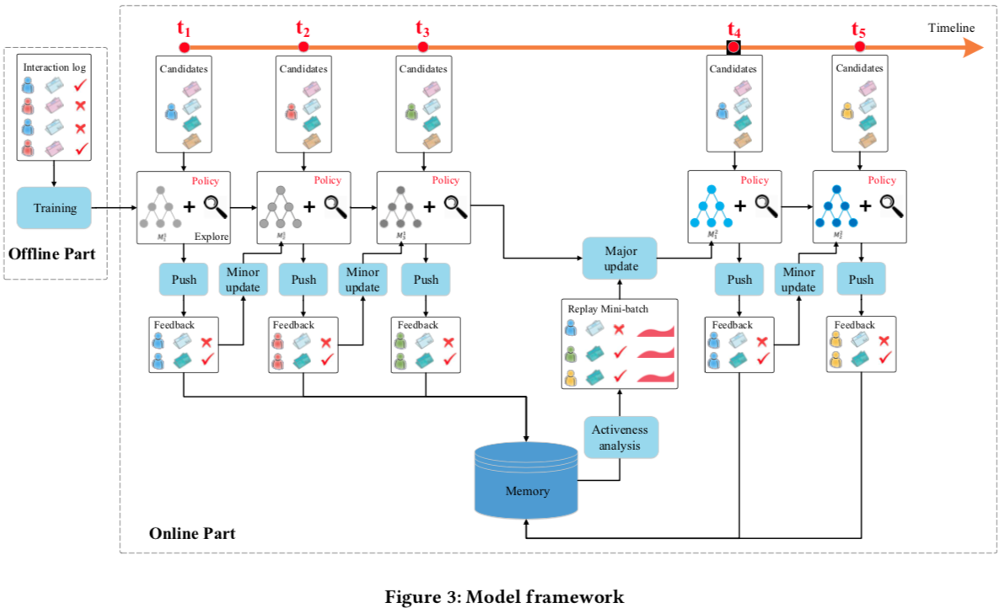

# reinforcement-learning

* [返回顶层目录](../../../../SUMMARY.md)
* [返回上层目录](../advanced-knowledge.md)

[增强学习在推荐系统有什么最新进展？](https://www.zhihu.com/question/57388498)

# 为什么要将强化学习用在推荐系统上

作为一个**千亿级数据量**的从业者，我讲讲我认为推荐系统中**最重要的几点**，可能与其他回答都略有不同

1. **不同规模下的工程架构：**特征从**百**到**百万**到**百亿**，不同级别的工程架构相差极大
2. **对目标的选定：**如何选择你的目标，决定了怎么做画像、特征，改变一个目标非常的伤筋动骨，而且也无法说清目标的制定是否科学
3. **对长期目标的学习：**短期的目标可以是一跳（用户的单次成本，付费或者消费），但长期的目标一定是用户付出的长期成本（长期消费，用户粘性），怎么去学习，是非常困难的事情。很多公司、学校都在进行这方面的研究（1、2、3），可以参考

这几个点很难绕过，未来几年也会成为各家推荐的差异点。核心技术说实话大家都非常清楚，Wide & Deep已经应用的非常广泛，这剩余的核心问题就看谁能够解决的足够快、跑的足够前面了。

# 论文解读

## 基于深度强化学习的新闻推荐模型DRN

[《DRN: A Deep Reinforcement Learning Framework for News Recommendation》](http://www.personal.psu.edu/~gjz5038/paper/www2018_reinforceRec/www2018_reinforceRec.pdf)

### 解读一：杨镒铭的解读

作者是[杨镒铭](https://www.zhihu.com/people/yang-yi-ming-80)，毕业于中科大，现就任于滴滴，负责行车路线的召回和排序工作。

下面的内容是作者知乎专栏关于此论文的解读：

[强化学习系列一——基于深度强化学习的新闻推荐模型DRN](https://zhuanlan.zhihu.com/p/58280384)

### 解读二：我的解读

#### 摘要

这篇文章提出了用于新闻推荐的新颖的深度强化学习框架。在线个性化新闻推荐是一个有高度挑战性的问题，这是因为新闻特点和用户偏好是动态变化的。尽管

#### 概述

在我们的系统中，用户池和新闻池作为**环境**（environment），推荐算法作为**智能体**（agent），用户的特征表征作为**状态**（state），新闻的特征表征作为**动作**（action）。每当用户发生一次请求新闻的行为，状态表征（用户特征）和一组行为表征（候选新闻的表征）会传给智能体。智能体会在当前状态（用户特征）下选择最好的行为（即给用户推荐一系列的新闻），并且取回用户的反馈作为**奖励**（reward）。特别的，奖励由*是否点击*和用户的
*活跃度*的估计组成。所有的推荐和反馈日志将存储到智能体的内存中。每隔一小时，智能体就会使用内存中的log日志来更新其推荐算法。

本文剩余的结构如下：

* 第二部分：讨论了相关工作

* 第三部分：提出了问题的定义

* 第四部分：介绍了我们的方法

* 第五部分：实验结果
* 第六部分：简要总结

#### 相关工作

##### 新闻推荐算法

推荐系统一直在被广泛的研究，因为其和产品的利润直接挂钩。最近，由于在线内容的爆炸性增长，越来越多的人关注推荐的特殊应用：在线个性化新闻推荐。

传统的新闻推荐算法分为三类：

* 基于内容的推荐会维护新闻的频率特征（即TF-IDF）和用户画像（基于历史点击过的新闻）。然后推荐系统会选择与用户画像相似的新闻进行推荐。
* 相比之下，协同过滤方法通常利用当前用户或者相似用户的历史打分进行打分预测，或者两者的结合。
* 为了结合上述两类方法的优势，进一步提出了混合方法来改善用户画像建模。

近期，作为上述方法的扩展和集成，深度学习模型比前三类方法表现出了优越的性能，这是因为其对复杂用户-物品关系的建模能力。

不同于致力于建立用户和物品之间复杂关系模型，我们的算法关注的是处理在线新闻推荐的动态特性，以及未来奖励的建模。然而，这些特征构造和用户-物品关系建模技术可以轻易地继承到我们的模型中。

##### 推荐中的强化学习

* 上下文相关的多臂赌博机模型（Contextual Multi-Armed Bandit models，简称MAB）

文献[5, 7, 23, 40, 43, 44, 50]的工作开始将上下文包含了用户和物品的特征的问题定义为MAB问题。文献[23]假设期望的奖励是上下文的线性函数。文献[39]使用赌博机的集成来提升性能，文献[40]提出了五参数模型，文献[50]解决了用户的兴趣会随时间变化。最近，文献[14]有人尝试把赌博机问题，和基于聚类的协同过滤，还有矩阵分解结合起来，这是为了能对更加复杂的用户和物品关系进行建模，并在确定奖励函数时利用社交网络关系。**然而，我们的模型和这些工作大大不同，这是因为，通过应用马尔可夫决策过程，我们的模型能够明确地对将来的奖励建模。长久看来，这将显著提升推荐准确性。**

* 马尔可夫决策过程模型

还有一些文献尝试使用马尔可夫决策过程来对推荐过程进行建模。与基于MAB的方法不同，基于MDP的方法不仅能够获取当前迭代的即时奖励，还能获取未来迭代的潜在奖励。文献[26, 27, 35, 36, 38]试图将物品或者n元（n-gram）物品建模为状态，将物品之间的转移（推荐下一个物品的）建模为行动。然后，这不能扩大到大数据集上，因为当物品的候选集变大时，状态空间的维度会指数级增长。此外，状态转移数据通常非常稀疏，并缺只能用于学习与特定状态转换对应的模型参数。因此，模型确实很难去学习。不同于上述文献，**我们提出了一个采用连续状态和行为表征的MDP框架，能够让系统去扩展，并且通过使用所有的状态、行动和奖励来有效学习模型参数。**

#### 问题定义

我们的问题定义如下：

当一个用户u给推荐智能体G在时刻t发送一个新的请求，已知一个新闻I的候选集，我们的算法将给这个用户选择一个TopK的适合其的新闻列表L。论文中用到的符号如下表所示。

| 符号 | 含义                         |
| ---- | ---------------------------- |
| G    | Agent                        |
| u, U | User, User set               |
| a    | Action                       |
| s    | State                        |
| r    | Reward                       |
| i, I | News, Candidate news pool    |
| L    | Lsit of news to recommend    |
| B    | List of feedback from users  |
| Q    | Deep Q-Network               |
| W    | Parameters of Deep Q-Network |

#### 方法

近年来，个性化新闻推荐已经引起了许多关注。当前的方法通常可以归类为基于内容的方法，基于协同过滤的方法，还有混合方法。最近，为了能够对更复杂的用户和物品之间交互进行建模，进一步提出了许多深度学习模型。当新闻推荐问题发生在在线场景下时，会变得更加具有挑战性，这是因为有三点：

* 由于新闻特征和用户喜好的高度动态性，需要在线学习
* 只单纯使用点击/未点击标签捕捉不到用户的对新闻的全部反馈信息
* 传统的推荐方法倾向于推荐相似的物品，这样会缩减用户的阅读选择范围，会使得用户对推荐内容感到厌倦，导致见效用户长期的满意度。

为了解决上述三个挑战，我们提出了**基于DQN的深度强化学习框架，来进行在线个性化新闻推荐**。

特别的，我们使用**用户的连续状态特征表征**和**物品的连续行为特征表征**作为给多层DQN的输入，以预测潜在的奖励（即，用户是否会点击该新闻）。

* 该框架能够处理新闻推荐的高度动态特性，这是因为DQN可以在线更新。同时，DQN不同于常见的在线方法，这是因为其能够推测用户和物品之间的未来交互。
* 我们提出将用户的活跃度（即用户在一次推荐后有多快再次回到App）和点击标签结合，作为用户的反馈。
* 我们提出将Dueling Bandit Gradient Descent探索策略用于我们的算法，这样不仅能够改善推荐多样性，还能避免推荐精确度的损失。经典的探索策略如ε-greedy和Upper Confidence Bound会引起损害推荐精确度。

我们的方法和MAB类方法有很大的不同，因为其对未来的奖励有明确的建模，也不同于之前的使用用户log记录的MDP方法，因为其对状态和动作的连续表征和扩展到大规模系统上的能力。

本节内容如下：

##### 模型框架

如图3所示，我们的模型由离线部分和在线部分组成。在离线阶段，从新闻和用户提取四类特征（在下一节讨论）。使用一个多层DQN，根据这四类特征来预测奖励（即，用户-新闻的点击标签和用户活跃度）。使用离线的用户-新闻点击记录来训练该网络。然后，在在线学习部分，我们的推荐智能体G将会和用户交互，并用如下方式来更新网络：

（1）PUSH：在每一个时间戳(t1, t2, t3, t4, t5, …)上，当用户发送一个新闻请求到系统时，推荐智能体G将以当前用户和新闻候选集的特征表征作为输入，

##### 特征构建

##### 深度强化学习模型

##### 用户活跃度

##### 探索

#### 实验

#### 总结

# 论文

[1] Dulac-Arnold G, Evans R, van Hasselt H, et al. Deep reinforcement learning in large discrete action spaces[J]. arXiv preprint arXiv:1512.07679, 2015.

[2] Liebman E, Saar-Tsechansky M, Stone P. Dj-mc: A reinforcement-learning agent for music playlist recommendation[C]//Proceedings of the 2015 International Conference on Autonomous Agents and Multiagent Systems. International Foundation for Autonomous Agents and Multiagent Systems, 2015: 591-599.

[3] Zheng G, Zhang F, Zheng Z, et al. DRN: A Deep Reinforcement Learning Framework for News Recommendation[C]//Proceedings of the 2018 World Wide Web Conference on World Wide Web. International World Wide Web Conferences Steering Committee, 2018: 167-176.

# 参考文献

* [推荐系统有哪些坑？-Geek An](https://www.zhihu.com/question/28247353/answer/399162539)

"为什么要将强化学习用在推荐系统上"一节参考了此回答。

