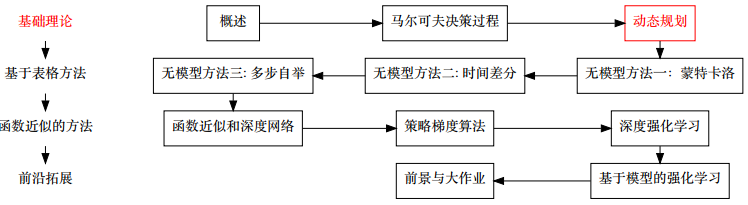
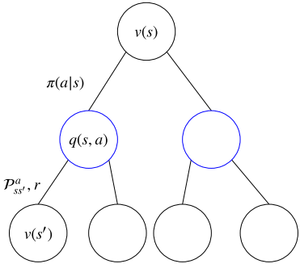
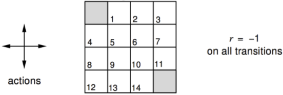
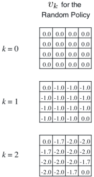
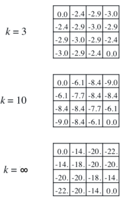
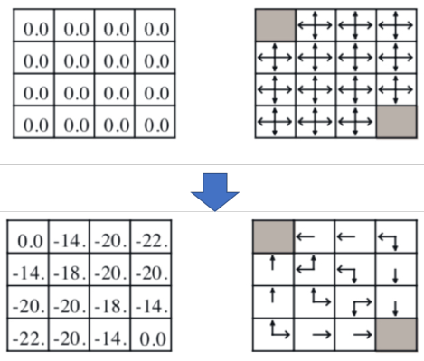

# 动态规划

- [返回顶层目录](../SUMMARY.md#目录)
- [本章在学习地图中的位置](#本章在学习地图中的位置)
- [前言](#前言)
- [策略评价](#策略评价)
- [策略提升](#策略提升)
- [策略迭代](#策略迭代)
- [值迭代](#值迭代)
- [动态规划引申](#动态规划引申)

# 本章在学习地图中的位置

# 前言

## 什么是动态规划

* 之前提到解决序列决策问题有两种手段——学习与规划
* 当有一个景区的环境模型时，可以用动态规划去解
* 编程算法中也有动态规划的概念，与其相似
* 总的来说，就是讲问题分解成子问题，通过解决子问题，来解决原问题
  * **动态**：针对序列问题
  * **规划**：优化，得到策略
* **贝尔曼方程**是关键

## 动态规划可以解决什么问题

动态规划是一种解决问题的方法，什么样的问题能使用动态规划去解决呢？这样的问题具有以下两种性质：

* 最优子结构
  * 满足**最优性原理**
  * 最优的解可以被分解成子问题的最优解
* 交叠式子问题
  * 子问题能被多次重复
  * 子问题的解要能被缓存并再利用

恰好MDPs就满足这两个特征：

* 贝尔曼方程是递归的形式，把问题分解成子问题
* 值函数有效的存储了子问题的解，并能够再利用

注：什么是最优性原理？即：多阶段决策过程的最优决策序列具有这样的性质：不论初始状态和初始决策如何，对于前面决策所造成的某一状态而言，其后各阶段的决策序列必须构成最优策略。

## 强化学习中的动态规划

* 使用动态规划解决强化学习问题时，要求知道MDPs的所有元素

* 针对**评价**

  * 输入：MDP\<S,A,P,R,γ\>和策略π；

    或者，MRP\<S,Pπ,Rπ,γ\>

  * 输出：值函数vπ

* 针对**优化**

  * 输入：MDP\<S,A,P,R,γ\>
  * 输出：最优值函数v*和最优策略π*

## 动态规划的其他应用

动态规划不仅仅用来解决强化学习问题，是运筹学的一个分支。

* Richard Bellman在1957年出版作品《Dynamic Programming》
* 分类：线性动态规划，区域动态规划，树形动态规划，背包问题等
* 应用例子：最短路径问题，二分查找树，网络流优化问题等。

# 策略评价

## 策略评价问题

问题：给定一个策略π，求对应的值函数vπ(s)或qπ(s,a)

解决方法：

* 直接解：
  $$
  v_{\pi}=(I-\gamma\cal{P}^{\pi})^{-1}R^{\pi}
  $$

  * 可以直接求得精确解
  * 时间复杂度O(n^3)

* 迭代解：v1→v2→...→vπ

  * 利用贝尔曼期望方程求解
  * 同样可以收敛到vπ

## 利用贝尔曼期望方程的迭代式策略评价

贝尔曼期望方程，表明了我们能够**通过后继状态 s‘ 更新s**。
$$
v_{\pi}=\sum_{a\in \cal{A}}\pi(a|s)\left(\cal{R}(s,a)+\gamma\sum_{s'\in \cal{S}}\cal{P}^a_{ss'}v_{\pi}(s') \right)
$$
因此，可以得到如下的迭代式子
$$
\begin{aligned}
&v_{k+1}=\sum_{a\in \cal{A}}\pi(a|s)\left(\cal{R}(s,a)+\gamma\sum_{s'\in \cal{S}}\cal{P}^a_{ss'}v_{k}(s') \right)\\
&v^{k+1}=\cal{R}^{\pi}+\gamma\cal{P}^{\pi}v^k
\end{aligned}
$$

## 同步备份下的迭代式策略评价算法

四个关键字：

* 备份（backup）：$v_{k+1}(s)$需要用到$v_k(s')$，用$v_k(s')$更新$v_{k+1}(s)$的过程称为备份。更新状态s的值函数称为备份状态s。**备份图**
* 同步（synchronous）：每次更新都要更新完所有的状态
* 策略评价
* 迭代式

**同步备份下的迭代式策略评价算法**

~~~
1: for k = 1,2,...  do
2:		for 所有的状态s∈S  do
3:			所有迭代式更新值函数v_{k+1}(s)
4:		end for 
5: end for
~~~

注：异步的版本后面会讲

## 策略评价例子

* 假设γ=1

* 14个普通状态，2个终止状态

* 走出边界的动作会导致状态不变

* 在走到终止状态前，任何动作都会导致-1的奖励

* 给定一随机策略
  $$
  \pi(a|s)=0.25, \ \forall s,a
  $$
  

通过贝尔曼方程验算上图第[0,1]个格子位置的值函数。
$$
\begin{aligned}
&-1.0=-1+\frac{1}{4}\times 0+\frac{1}{4}\times 0+\frac{1}{4}\times 0+\frac{1}{4}\times 0\\
&-1.7=-1+\frac{1}{4}\times (-1)+\frac{1}{4}\times  (-1)+\frac{1}{4}\times  (-1)+\frac{1}{4}\times 0\\
&-1.7=-1+\frac{1}{4}\times (-1)+\frac{1}{4}\times  (-1)+\frac{1}{4}\times  (-1)+\frac{1}{4}\times (-1)\\
\end{aligned}
$$

我们可以验证k=∞时，迭代收敛了
$$
\begin{aligned}
&-14=-1+\frac{1}{4}\times 0+\frac{1}{4}\times (-18)+\frac{1}{4}\times (-20)+\frac{1}{4}\times (-14)\\
&-18=-1+\frac{1}{4}\times (-14)+\frac{1}{4}\times  (-14)+\frac{1}{4}\times  (-20)+\frac{1}{4}\times (-20)\\
&-20=-1+\frac{1}{4}\times (-18)+\frac{1}{4}\times  (-18)+\frac{1}{4}\times  (-20)+\frac{1}{4}\times (-20)\\
&-22=-1+\frac{1}{4}\times (-22)+\frac{1}{4}\times  (-22)+\frac{1}{4}\times  (-20)+\frac{1}{4}\times (-20)\\
\end{aligned}
$$

# 策略提升

## 怎么改进策略π

* 给定一个策略π

  * **评价**策略π
    $$
    v_{\pi}=\mathbb{E}_{\pi}[R_{t+1}+\gamma R_{t+2}+...|S_t=s]
    $$

  * 在求得vπ之后，根据贪婪的动作**改进**策略
    $$
    \pi '=\text{greedy}(v_{\pi})\Leftrightarrow a'=\text{arg }\mathop{\text{max}}_a\ q_{\pi}(s,a)
    $$

* 可以证明π’≥π，即
  $$
  v_{\pi'}(s)\geq v_{\pi}(s),\ \forall s
  $$

* 使得更新后的策略不差于之前的策略的过程称之为**策略提升**

* 贪婪动作只是策略提升的一种方式

* 通过策略评价，和贪婪动作，策略从随机策略变成了最优策略π*
* 上述的策略比较幸运，策略提升一次就达到了最优
* 一般情况下，可能需要多次迭代（策略评价/策略提升）才能到达最优策略

## 策略提升定理

**策略提升定理：**

对于两个确定性策略 π‘ 和π，如果满足
$$
q_{\pi}(s,\pi'(s))\geq v_{\pi}(s)
$$
，那么我们可以得到
$$
v_{\pi'}\geq v_{\pi}(s)
$$
贪婪动作得到的策略是上述的特殊形式：
$$
q_{\pi}(s,\pi_{\text{贪婪}})\geq q_{\pi}(s,\pi'),\ \forall \pi'
$$
证明：

# 策略迭代

# 值迭代

# 动态规划引申

# 参考文献

- [《强化学习理论与实践》第三章：动态规划](http://www.shenlanxueyuan.com/my/course/96)

本文主要参考此视频课程。

