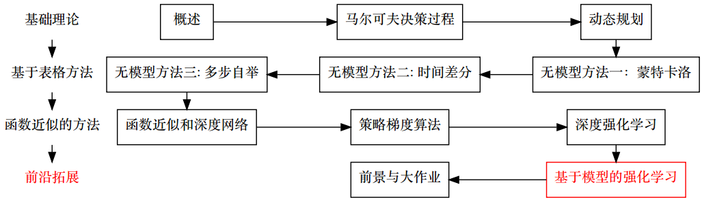

# 基于模型的强化学习

- [返回顶层目录](../../SUMMARY.md#目录)
- [本章在学习地图中的位置](#本章在学习地图中的位置)
- [本章简介](#本章简介)
- [基于模型的强化学习详述](#基于模型的强化学习详述)
- [整合无模型方法和基于模型的方法](#整合无模型方法和基于模型的方法)
- [基于仿真的搜索](#基于仿真的搜索)

# 本章在学习地图中的位置

其实本来截止到上一讲就结束了，本节和下节课是拓展。基于模型的强化学习作为强化学习的补充。

无模型是指在马尔科夫转移过程中，我们并不知道状态转移函数和奖励函数，所以说会通过采样的方式去获得。在动态规划这一节我们知道，如果已知状态转移函数和奖励函数，是不需要和环境发生交互的，直接使用动态规划的算法就可以得到。

基于模型的强化学习**将动态规划和无模型方法进行整合**，就类似于多步自举是时间差分和蒙特卡洛的整合一样。

为什么要讲基于模型的强化学习？

* 基于模型的强化学习是和我们之前讲的内容的并行的分支
* Alpha-GO用的最核心算法其实是基于模型的强化学习的一种：蒙特卡洛树搜索。其中也会结合值函数和策略梯度等。

# 本章简介

## 学习与规划

* 学习（Learning）
  * 未知环境模型P,R
  * 智能体与环境交互产生经验
  * 从经验中学习（学习值函数，策略等）
  * 无模型的方法（蒙特卡洛，时间差分等）
* 规划（Planning）
  * 已知环境模型P,R
  * 无需智能体的交互
  * 直接从模型学习
  * 动态规划的方法（DP）
* 相同点
  * 都是根据未来的结果，计算当前的估计

# 基于模型的强化学习详述

# 整合无模型方法和基于模型的方法

# 基于仿真的搜索

Alpha-GO用的最核心算法其实是基于模型的强化学习的一种：**蒙特卡洛树搜索**。其中也会结合值函数和策略梯度等。

