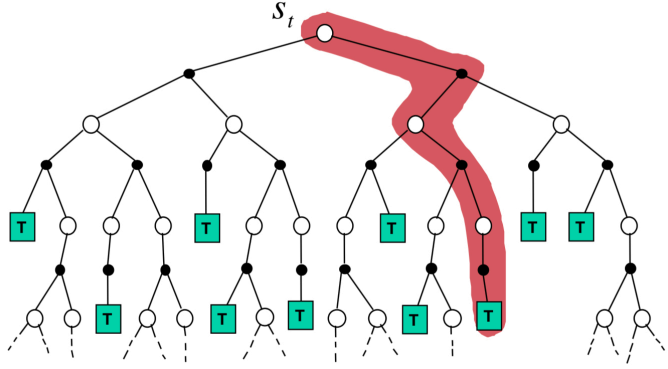
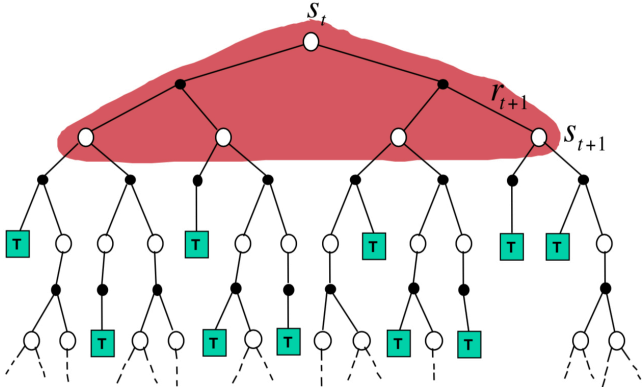
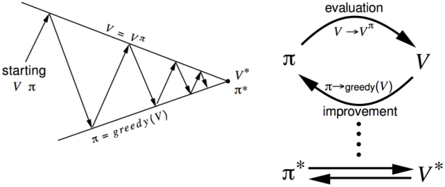
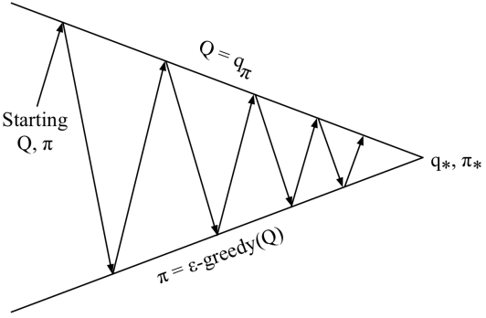
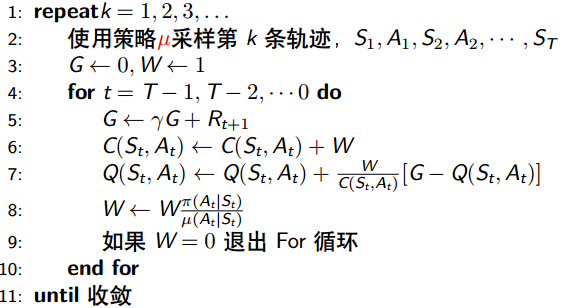
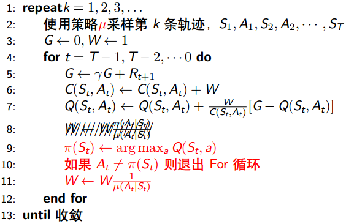

# 无模型方法一：蒙特卡洛

- [返回顶层目录](../SUMMARY.md)
- [本章在学习地图中的位置](#本章在学习地图中的位置)
- [无模型方法简介](#无模型方法简介)
  - [无模型（model-free）方法](#无模型（model-free）方法)
  - [从经验中学习](#从经验中学习)
  - [和动态规划的区别](#和动态规划的区别)
- [在策略和离策略](#在策略和离策略)
  - [行为策略和目标策略](#行为策略和目标策略)
  - [在策略（on-policy）学习](#在策略（on-policy）学习)
  - [离策略（off-policy）学习](#离策略（off-policy）学习)
  - [重要性采样](#重要性采样)
  - [离策略学习中的重要性采样](#离策略学习中的重要性采样)
- [蒙特卡洛方法](#蒙特卡洛方法)
  - [蒙特卡洛（Monte-Carlo,MC）方法](#蒙特卡洛（Monte-Carlo,MC）方法)
  - [动态规划方法](#动态规划方法)
- [蒙特卡洛评价](#蒙特卡洛评价)
  - [一些表述说明](#一些表述说明)
  - [蒙特卡洛策略评价](#蒙特卡洛策略评价)
  - [首次拜访（First-visit）MC策略评价](#首次拜访（First-visit）MC策略评价)
  - [每次拜访（Every-visit）MC策略评价](#每次拜访（Every-visit）MC策略评价)
  - [对Q函数的MC方法](#对Q函数的MC方法)
  - [离策略MC策略评价](#离策略MC策略评价)
  - [MC的特点小结](#MC的特点小结)
- [增量式蒙特卡洛算法](#增量式蒙特卡洛算法)
  - [为什么需要增量式算法？](#为什么需要增量式算法？)
  - [增量式MC更新](#增量式MC更新)
  - [常量步长](#常量步长)
- [蒙特卡洛优化](#蒙特卡洛优化)
  - [广义策略迭代](#广义策略迭代)
  - [MC中的广义策略迭代](#MC中的广义策略迭代)
  - [问题一：使用哪个值函数？](#问题一：使用哪个值函数？)
  - [问题二：贪婪策略提升？](#问题二：贪婪策略提升？)
  - [ε-贪婪探索](#ε-贪婪探索)
  - [ε-贪婪探索提升](#ε-贪婪探索提升)
  - [MC的策略迭代](#MC的策略迭代)
  - [增量式策略评价](#增量式策略评价)
  - [无限探索下的极限贪婪（GLIE）](#无限探索下的极限贪婪（GLIE）)
  - [GLIE蒙特卡洛优化](#GLIE蒙特卡洛优化)
- [蒙特卡洛算法引申](#蒙特卡洛算法引申)
  - [增量式离策略每次拜访蒙特卡洛评价](#增量式离策略每次拜访蒙特卡洛评价)
  - [增量式离策略每次拜访蒙特卡洛优化](#增量式离策略每次拜访蒙特卡洛优化)

# 本章在学习地图中的位置

上一章我们介绍了模型相关 (Model-based) 的强化学习。从现在开始我们要介绍模型无关 (Model-free) 的强化学习。

由于模型无关的强化学习比较复杂，今天先介绍其中一部分——模型无关的**策略评价**。模型无关的策略评价是，不知道马尔科夫决策过程转移概率和奖励函数的情况下，计算一个策略的每一个状态价值。模型无关的策略评价主要有两种算法，一个是蒙特卡罗算法，另一个叫时差学习算法。

模型无关的**策略学习**，是在不知道马尔科夫决策过程的情况下学习到最优策略。模型无关的策略学习主要有三种算法: MC Control, SARSA 和 Q learning。

# 无模型方法简介

## 无模型（model-free）方法

* 属于**学习**方法的一种
* MDPs中未知P，R——无模型
* 需要智能体和环境进行**交互**
* 一般采用样本备份
* 需要结合充分的**探索**

## 从经验中学习

* 由于未知环境模型，所以无法预知自己的后继状态和奖励值

* 通过与环境进行交互然后观察环境返回的值

* 本质上相当于从概率分布
  $$
  P_{ss'}^a,R_s^a
  $$
  中进行采样

* 上述是对随机变量S‘和R的采样，需要实现完整的轨迹还需要确定动作A

* 采样**策略**得到动作A

  * 可控制

* 采样足够充分时，可以使用样本分布良好地刻画总体分布

## 和动态规划的区别

* 无模型学习
  * 未知环境模型
  * 需要与环境进行交互，有交互成本
  * 样本备份
  * 异步备份
  * 需要充分的探索
  * 两个策略（行为策略和目标策略）
  * ...
* 动态规划（基于模型学习）
  * 已知环境模型
  * 不需要直接交互，直接利用环境模型推导
  * 全宽备份
  * 同步和异步
  * 一个策略
  * ...

# 在策略和离策略

## 行为策略和目标策略

* 行为策略是智能体与环境交互的策略
* 目标策略是我们要学习的策略，即vπ，qπ时的下标π

## 在策略（on-policy）学习

* 行为策略和目标策略是同一个策略，可以理解为**同策略**
* 直接使用样本统计属性去估计总体
* 更简单，且收敛性更好
* 数据利用性更差（只有智能体**当前**交互的样本能够被利用）
* 限定了学习过程中的策略是随机性策略

## 离策略（off-policy）学习

* 行为策略μ和目标策略π**不是**同一个策略，可以理解为**异策略**

* 一般行为策略μ选用随机性策略，目标策略π选用确定性策略

* 需要结合**重要性采样**才能使用样本估计总体

* 方差更大，收敛性更差

* 数据利用性更好（可以使用其他智能体交互的样本）

* 行为策略μ需要比目标策略π更具备探索性。即，在每个状态下，目标策略π的可行动作是行为策略μ可行动作的子集
  $$
  \pi(a|s)>0\Rightarrow\mu(a|s)>0
  $$

## 重要性采样

* 重要性采样是一种估计**概率分布期望值**的技术，它使用了来自其他概率分布的样本。

* 主要用于无法直接采样原分布的情况

* 估计期望值时，需要加权概率分布的比值（称为重要性采样率）

* 例子：

  * 估计全班身高，总体男女比例1:2

  * 由于某些限制（比如女生大部分出去玩了），只能按男女比例2:1去采样

  * 如果不考虑采样的分布形式，直接平均得到的值就有问题

  * 因此需要加权，按照下面的加权比例去加权：
    $$
    \frac{1}{2}:\frac{2}{1}=1:4
    $$

* 重要性采样证明很简单，如下：
  $$
  \begin{aligned}
  \mathbb{E}_{X\sim P}[f(X)]&=\sum P(X)f(X)\\
  &=\sum Q(X)\frac{P(X)}{Q(X)}f(X)\\
  &=\mathbb{E}_{X\sim Q}[\frac{P(X)}{Q(X)}f(X)]
  \end{aligned}
  $$

## 离策略学习中的重要性采样

考虑t时刻之后的动作状态**轨迹**
$$
\rho_t=A_t,S_{t+1},A_{t+1},...,S_T
$$
，可以得到该轨迹出现的概率为
$$
\mathbb{P}(\rho_t)=\prod_{k=t}^{T-1}\pi(A_k|S_k)\mathbb{P}(S_{k+1}|S_k,A_k)
$$
，因此可以得到相应的重要性采样率为
$$
\eta_t^T=\frac{\prod_{k=t}^{T-1}\pi(A_k|S_k)\mathbb{P}(S_{k+1}|S_k,A_k)}
{\prod_{k=t}^{T-1}\mu(A_k|S_k)\mathbb{P}(S_{k+1}|S_k,A_k)}
=\prod_{k=t}^{T-1}\frac{\pi(A_k|S_k)}
{\mu(A_k|S_k)}
$$
即便是未知环境模型，也能得到重要性采样率。

# 蒙特卡洛方法

##蒙特卡洛（Monte-Carlo,MC）方法

* MC方法可以被用于任意涉及随机变量的估计
* 这里MC方法特指利用统计平均估计期望值的方法
* 强化学习中存在很多估计期望值的计算vπ,v*
* 使用MC方法只需要利用经验数据，不需要P,R
* MC方法从**完整**的片段中学习
* MC方法仅仅用于片段性任务（必须有终止条件）

最简单的思路，通过不断的采样，然后统计平均回报值来估计值函数，方差较大。

## 动态规划方法

使用所有后续状态进行全宽备份

# 蒙特卡洛评价

## 一些表述说明

* 轨迹：把状态-动作的序列称为一个智能体的**轨迹**（trajectory）（有时也会加上奖励）
  $$
  \rho=S_1,A_1,S_2,A_2,...,S_T
  $$

  * 状态动作序列构成了马尔科夫链图上的一条轨迹

* 从
  $$
  \pi,P_{ss'}^a
  $$
  采样一条轨迹：我们把智能体从初始状态开始和环境进行交互的整个过程中得到的轨迹叫做采样一条轨迹。其中需要考虑两个分布
  $$
  \pi,P_{ss'}^a
  $$

* 从策略中采样一条轨迹ρ。因为
  $$
  P_{ss'}^a
  $$
  是稳定的，所以轨迹的分布随着策略的变化而变化。我们简述成从一个策略π中采样轨迹
  $$
  \rho\sim \pi
  $$

## 蒙特卡洛策略评价

* 目标：给定策略π，求vπ

* 过去的方法使用了贝尔曼期望方程
  $$
  v_{\pi}(s)=\sum_{a\in A}\left(R(s,a)+\gamma\sum_{s'\in S}P_{ss'}^av_{\pi}(s')\right)
  $$

  * 直接解
  * 迭代式动态规划

* MC利用了值函数的原始定义
  $$
  v_{\pi}(s)=\mathbb{E}_{\pi}[G_t|S_t=s]
  $$

* MC策略评价使用回报值的经验平均来估计实际期望值

## 首次拜访（First-visit）MC策略评价

* 为了评价状态s
* 使用给定的策略π采样大量的轨迹
  * 在每一条轨迹中，对于状态s**首次**出现的时间t
  * 增加状态数量N(s)←N(s)+1
  * 增加总回报值Gsum(s)←Gsum(s)+Gt
* 计算平均值得到值函数的估计V(s)=Gsum(s) / N(s)
* 每条轨迹都是独立同分布的
* 根据大数定律，随着N(s)→∞,V(s)→vπ(s)
* 在MC方法下，V(s)是vπ(s)的无偏估计

## 每次拜访（Every-visit）MC策略评价

- 为了评价状态s

- 使用给定的策略π采样大量的轨迹

  - 在每一条轨迹中，对于状态s**每次**出现的时间t
  - 增加状态数量N(s)←N(s)+1
  - 增加总回报值Gsum(s)←Gsum(s)+Gt

- 计算平均值得到值函数的估计V(s)=Gsum(s) / N(s)

- 同样的，根据大数定律，随着N(s)→∞,V(s)→vπ(s)

- 收敛性的证明不如首次拜访MC策略评价直观。可参考论文：

  [《Reinforcement learning with replacing eligibility traces》](https://link.springer.com/content/pdf/10.1007%2FBF00114726.pdf)

- 更容易拓展到函数逼近和资格迹（后述）

## 对Q函数的MC方法

* 在没有模型的时候，一般我们选择估计Q函数（为什么不选V函数？）

  在模型相关强化学习中，我们的工作是找到最优策略的状态价值v函数。但是在模型无关的环境下，这个做法却行不通。如果我们在模型无关环境下找最优策略的状态价值v，在预测时，对状态 (s) 最优策略如下所示
  $$
  \begin{aligned}
  \pi(s,a)=
  \left\{\begin{matrix}
  &1,\ a=\text{arg}\ \mathop{\text{max}}_{a}[R_{s,a}+\gamma\sum_{s'\in S}P_{s,a}^{s'}v(s')]\\ 
  &1,\ a\neq\text{arg}\ \mathop{\text{max}}_{a}[R_{s,a}+\gamma\sum_{s'\in S}P_{s,a}^{s'}v(s')]
  \end{matrix}\right.
  \end{aligned}
  $$
  看到那个R和P了吗？在模型无关的设定下，我们不知道这两个值。也许有同学说可以在预测时探索环境得到R和T。但是实际问题中，探索会破坏当前状态，比如在机器人行走任务中，为了探索，机器人需要做出一个动作，这个动作使得机器人状态发生变化。这时候为原来状态选择最优动作已经没有意义了。解决办法是把工作对象换成状态-动作价值q。获得最优策略的状态-动作价值q之后，对于状态s，最优策略策略如下所示：
  $$
  \begin{aligned}
  \pi(s,a)=
  \left\{\begin{matrix}
  &1,\ a=\text{arg}\ \mathop{\text{max}}_{a}q(s,a)\\ 
  &1,\ a\neq\text{arg}\ \mathop{\text{max}}_{a}q(s,a)
  \end{matrix}\right.
  \end{aligned}
  $$

* 因为我们可以通过Q函数直接得到贪婪的策略，最优的Q函数可以得到最优的策略（如上式所示）

* MC方法和V函数类似，但是Q函数的拜访从状态s变成了在状态s下做动作a

* 一个重要的区别是，在给定策略π的情况下，大量的\<s,a\>都没有被遍历到

  * 尤其是当策略π是确定性策略时，每个s只对应一个a

* 一种避免该困境的方法是假设**探索开始**，即随机选择初始状态和初始动作

## 离策略MC策略评价

* 在采样轨迹时使用的策略是行为策略μ

* 而我们计算的值函数是目标策略π

* 使用重要性采样率去加权回报值
  $$
  G_t^{\pi/\mu}=\prod_{k=t}^{T-1}\frac{\pi(A_k|S_k)}{\mu(A_k|S_k)}G_t
  $$

* 将所有在策略的MC算法中的Gt替换成
  $$
  G_t^{\pi/\mu}
  $$
  就得到离策略MC算法

* 使用重要性采样会显著增加方差，可能到无限大。（增加了X^2）
  $$
  \text{Var}[X]=\mathbb{E}[X^2]-\bar{X}^2
  $$

## MC的特点小结

* 偏差为0，是无偏估计
* 方差较大，需要大量数据去消除
* 收敛性好
* 容易理解和使用
* 没有利用马尔科夫性，有时可以用在非马尔科夫环境

# 增量式蒙特卡洛算法

## 为什么需要增量式算法？

* 之前的蒙特卡洛算法需要采样大量轨迹之后再同一计算平均数

* 能不能在每一条轨迹之后都得到值函数的估计值呢？

* 平均值能够以增量式进行计算
  $$
  \begin{aligned}
  \mu_k&=\frac{1}{k}\sum_{j=1}^kx_j\\
  &=\frac{1}{k}\left(x_k+\sum_{j=1}^{k-1}x_j\right)\\
  &=\frac{1}{k}\left(x_k+(k-1)\mu_{k-1}\right)\\
  &=\mu_{k-1}+\frac{1}{k}(x_k-\mu_{k-1})
  \end{aligned}
  $$

## 增量式MC更新

* 采样轨迹S1,A1,S2,A2,...,ST

* 对于每一个状态St，统计回报值Gt，
  $$
  \begin{aligned}
  &N(S_t)\leftarrow N(S_t)+1\\
  &V(S_t)\leftarrow V(S_t)+\frac{1}{N(S_t)}(G_t-V(S_t))\\
  \end{aligned}
  $$

* 此时1/N(St)可以认为是更新的步长

## 常量步长

很多时候，我们会采样常量步长α∈(0,1]。
$$
V(S_t)\leftarrow V(S_t)+\alpha(G_t-V(S_t))
$$
常量步长的意思表示会逐渐遗忘过去的轨迹。（ps.这不就是一阶低通滤波嘛。。。）
$$
\begin{aligned}
V_{k+1}=&V_k+\alpha(g_k-V_k)\\
=&\alpha g_k+(1-\alpha)V_k\\
=&\alpha g_k+(1-\alpha)[\alpha g_{k-1}+(1-\alpha)V_{k-1}]\\
=&\alpha g_k+(1-\alpha)\alpha g_{k-1}+(1-\alpha)^2\alpha g_{k-2}+\\
&...+(1-\alpha)^{k-1}\alpha g_1+(1-\alpha)^kV_1\\
=&(1-\alpha)^kV_1+\sum_{i-1}^k\alpha(1-\alpha)^{k-i}g_i
\end{aligned}
$$
由于
$$
(1-\alpha)^k+\sum_{i-1}^k\alpha(1-\alpha)^{k-i}=1
$$
，所以也可以认为常量步长是回报值的指数加权。

对于常量步长，有：

* 仍然是回报值的加权平均
* 对初始值敏感度更小
* 更简单，不用使用N(St)
* 适用于不稳定环境

# 蒙特卡洛优化

## 广义策略迭代

* **策略评价**：估计vπ，比如迭代式策略评价
* **策略生成**：生成π’≥π，比如贪婪策略提升

## MC中的广义策略迭代

- **策略评价**：估计vπ，蒙特卡洛策略评价，**V=vπ？**
- **策略生成**：生成π’≥π，贪婪策略提升**？**

## 问题一：使用哪个值函数？

* 在V函数上做贪婪策略提升要求环境模型
  $$
  \pi'(s)=\text{arg }\mathop{\text{max}}_{a\in A}R(s,a)
  $$

* 在Q函数上做贪婪策略提升是无模型的
  $$
  \pi'(s)=\text{arg }\mathop{\text{max}}_{a\in A}Q(s,a)
  $$

如何理解以上两点：

在模型相关强化学习中，我们的工作是找到最优策略的状态价值v函数。但是在模型无关的环境下，这个做法却行不通。如果我们在模型无关环境下找最优策略的状态价值v，在预测时，对状态 (s) 最优策略如下所示
$$
\begin{aligned}
\pi(s,a)=
\left\{\begin{matrix}
&1,\ a=\text{arg}\ \mathop{\text{max}}_{a}[R_{s,a}+\gamma\sum_{s'\in S}P_{s,a}^{s'}v(s')]\\ 
&1,\ a\neq\text{arg}\ \mathop{\text{max}}_{a}[R_{s,a}+\gamma\sum_{s'\in S}P_{s,a}^{s'}v(s')]
\end{matrix}\right.
\end{aligned}
$$
看到那个R和P了吗？在模型无关的设定下，我们不知道这两个值。也许有同学说可以在预测时探索环境得到R和T。但是实际问题中，探索会破坏当前状态，比如在机器人行走任务中，为了探索，机器人需要做出一个动作，这个动作使得机器人状态发生变化。这时候为原来状态选择最优动作已经没有意义了。解决办法是把工作对象换成状态-动作价值q。获得最优策略的状态-动作价值q之后，对于状态s，最优策略策略如下所示：
$$
\begin{aligned}
\pi(s,a)=
\left\{\begin{matrix}
&1,\ a=\text{arg}\ \mathop{\text{max}}_{a}q(s,a)\\ 
&1,\ a\neq\text{arg}\ \mathop{\text{max}}_{a}q(s,a)
\end{matrix}\right.
\end{aligned}
$$

## 问题二：贪婪策略提升？

* MC虽然利用了过去的经验数据，但是
  * 某些状态并未遍历到
  * 遍历不够充分，置信度不高
* 例子
  * 比如每天早上有两个选择，学习和玩耍
  * 学习如果没有成果，获得奖励0，有成果获得奖励1000
  * 玩耍获得奖励1
  * 首次尝试学习获得奖励0，Q(s,学习)=0
  * 首次尝试玩耍获得奖励1，Q(s,学习)=1
  * 根据贪婪策略会选择玩耍
  * 由于不会选择学习，所以Q(s,学习)不会更新
* 你确定选到了最优策略？
  * 不是，因为按照贪婪策略，会一直选择玩耍。

## ε-贪婪探索

* 解决这个问题，需要保证智能体一直在探索新的策略

* 最简单的做法，保证所有的m个动作都有一定的概率被采样

  * 用1-ε的概率选择贪婪的动作
  * 用ε的概率随机选择从m各动作中选择

  $$
  \begin{aligned}
  \pi(a|s)=\left\{\begin{matrix}
  &\epsilon/m+1-\epsilon\quad&\text{if  }a=\text{arg }\mathop{\text{max}}_{a\in A}Q(s,a)\\ 
  &\epsilon/m\quad&\text{otherwise}
  \end{matrix}\right.
  \end{aligned}
  $$

* 能同时解决对Q函数的蒙特卡洛策略评价中的**探索开始**假设

## ε-贪婪探索提升

ε-贪婪探索提升**定理**：

对于任意ε-贪婪策略π，使用相应的qπ得到的ε-贪婪策略π‘是在π上的一次策略提升，即
$$
v_{\pi'}(s)\geq v_{\pi}(s)
$$
证明如下：
$$
\begin{aligned}
q_{\pi}(s,\pi'(s))&=\sum_{a\in A}\pi'(a|s)q_{\pi}(s,a)\\
&=\frac{\epsilon}{m}\sum_{a\in A}q_{\pi}(s,a)+(1-\epsilon)\mathop{\text{max}}_{a\in A}q_{\pi}(s,a)\\
&\geq\frac{\epsilon}{m}\sum_{a\in A}q_{\pi}(s,a)+(1-\epsilon)\frac{\pi(a|s)-\epsilon/m}{1-\epsilon}q_{\pi}(s,a)\\
&=\sum_{a\in A}\pi(a|s)q_{\pi}(s,a)\\
&=v_{\pi}(s)\\
\end{aligned}
$$
根据策略提升定理，可以得到
$$
v_{\pi'}(s)\geq v_{\pi}(s)
$$

## MC的策略迭代

* 策略评价：蒙特卡洛策略评价，**Q=q_π**
* 策略提升：**ε**-贪婪探索提升

## 增量式策略评价

**每条轨迹：**

* 策略评价：蒙特卡洛策略评价，**Q≈ qπ**
* 策略提升：**ε**-贪婪探索提升

## 无限探索下的极限贪婪（GLIE）

定义：

**无限探索下的极限贪婪（Greedy in the Limit with Infnite Exploration (GLIE) ）**

* 无限探索：所有状态动作都能被探索无穷次
  $$
  \lim_{k}\rightarrow N_k(s,a)=\infty
  $$

* 极限贪婪：在极限的情况下，策略会收敛到一个贪婪的策略
  $$
  \lim_{k\rightarrow\infty}\pi_k(a|s)=1,\ \left(a=\text{arg }\mathop{\text{max}}_{a'\in A}Q_k(s,a')\right)
  $$

* 设置ε逐渐衰减到0，比如εk=1/k，ε-贪婪策略是GLI的。

定理：

GLIE蒙特卡洛优化能收敛到最优的Q函数

## GLIE蒙特卡洛优化

算法：GLIE蒙特卡洛优化算法

~~~
1: repeat k = 1,2,3,...
2:     使用策略π采样第k条轨迹，S1,A1,S2,A2,...,ST
3:     对于轨迹中的每一个St和At
4:        N(St,At)←N(St,At)+1
5:        Q(St,At)←Q(St,At)+1/N(St,At)(Gt-Q(St,At))
6:     执行ε-策略提升，并衰减ε值
7:         ε←1/k
8:         π←ε-greedy(Q)
9: until 收敛
~~~

# 蒙特卡洛算法引申

## 增量式离策略每次拜访蒙特卡洛评价

算法：增量式离策略每次拜访蒙特卡洛评价算法

## 增量式离策略每次拜访蒙特卡洛优化

算法：增量式离策略每次拜访蒙特卡洛优化算法

# 参考文献

* [《强化学习理论与实践》第四章：无模型方法一：蒙特卡洛](http://www.shenlanxueyuan.com/my/course/96)

本章内容是该课程这节课的笔记

* [强化学习系列之三:模型无关的策略评价](http://www.algorithmdog.com/reinforcement-learning-model-free-evalution)

可以看下这个，讲蒙特卡洛和时间差分的模型无关的策略评价

* [强化学习系列之四:模型无关的策略学习](http://www.algorithmdog.com/reinforcement-learning-model-free-learning)

讲模型无关的策略学习，主要有三种算法: MC Control, SARSA和Q learning

