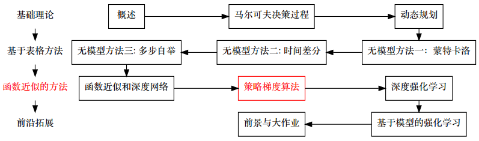
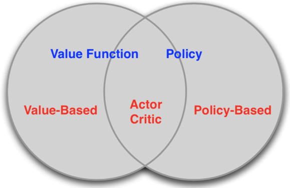
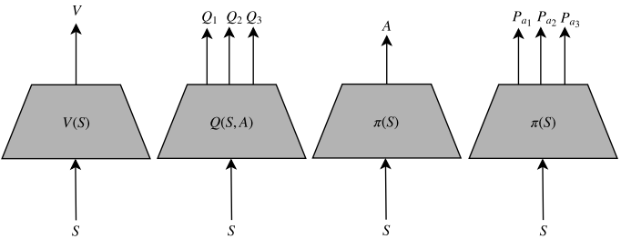
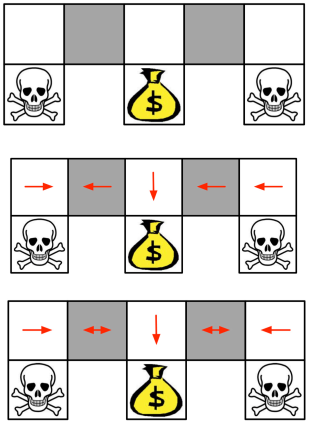
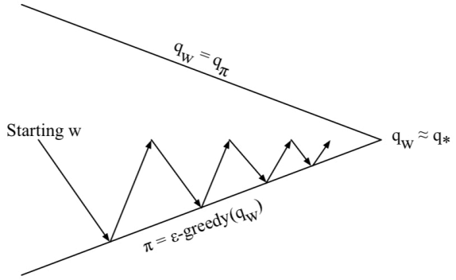
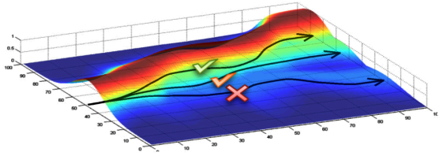

# 策略梯度算法

- [返回顶层目录](../../SUMMARY.md#目录)
- [本章在学习地图中的位置](#本章在学习地图中的位置)
- [本章简介](#本章简介)
- [策略梯度定理](#策略梯度定理)
- [减少方差](#减少方差)
- [Actor-Critic](#Actor-Critic)
- [引申](#引申)

# 本章在学习地图中的位置

强化学习可由基于值函数还是基于策略分为三种：

* 基于值函数的方法
* 基于策略的方法（本节课要讲的策略梯度算法）
* 两者结合的Actor-Critic方法

前面的七次课程都是主要介绍基于值函数的方法，这次课程会讲一个全新的强化学习算法，本次课程内容虽比较多，但也只是整个策略梯度算法的一个开端。

- 本章简介

  本章会首先简要介绍什么是策略梯度算法，并与以前基于值函数的方法进行对比，体会为什么要提出一个策略梯度算法。

- 策略梯度定理

  然后会详细推导策略梯度定理。了解其是怎么来的，为什么是有效的，怎么去更新参数。

- 减少方差

  策略梯度算法有很多优点，但是和基于值函数的方法比，最大的缺点是方差会非常大。有很多研究者做了如何减小策略梯度算法方差的研究。

- Actor-Critic

  将策略梯度算法和之前的基于值函数的方法进行一个结合，就是目前很多场景和研究都会关注的Actor-Critic方法。

- 引申

  本节课仅仅是梯度策略算法的开端，这里会讲还有哪些梯度策略算法，开拓视野。

# 本章简介

##基于策略的强化学习

* 在过去的课程中，我们讲述了基于值函数的方法

  第一节课就讲过，一个agent分为三部分，值函数，策略，以及是否具有环境模型。本节课不考虑环境模型，所以就是两部分：值函数和策略。之前的方法都是基于值函数的方法，因为不管是策略评价（求解给定策略下的值函数）还是策略优化（找到最优的值函数），我们都是求解一个值函数

* 上一节中，使用了带参数w的函数去近似值函数
  $$
  \begin{aligned}
  &V_w(s)\approx V^{\pi}(s)\\
  &Q_w(s,a)\approx Q^{\pi}(s,a)\\
  \end{aligned}
  $$
  这节课我们讲基于策略的方法，上节课我们用参数近似值函数，这节课我们用参数直接来近似策略。比如上节课用神经网络，输入是状态，输出是V函数，而这节课，输入是状态，输出直接就是一个动作（即策略）或者动作的概率分布，这就是基于策略的强化学习。

* 之前的策略是从值函数中推导出来的

  * 使用贪婪的方法导出最优策略

    有一个最优的Q函数，就可以通过贪婪的方法导出一个最优的策略

  * 使用ε贪婪的方法导出了行为策略

    想要导出一个行为策略，则可通过Q函数导出一个带ε的贪婪策略。

    虽然我们的最终目的是找到一个策略，但是本质上都是优化一个V函数或者Q函数，所以之前的方法都称为基于值函数的方法。

* 我们直接参数化**策略**
  $$
  \pi_{\theta}(a|s)=\mathbb{P}[a|s,\theta]
  $$

* 这里仍有考虑无模型的方法

## 强化学习分类

* 基于值函数的方法

  * 学值函数
  * 用值函数导出策略

* 基于策略的方法

  * 没有值函数

  * 学习策略

    选择使最终期望回报值最大的策略

* Actor-Critic

  是上面两者的结合，Actor指策略网络，Critic指值函数网络

  * 学习值函数
  * 学习策略

## 为什么要使用策略梯度算法

基于值函数方法的局限性

* 针对确定性策略

  值函数方法无法估计随机性策略。有人会问带ε的贪婪策略不就是随机策略吗？因为它虽然是随机策略，但不是我们想要的随机性策略。带ε的贪婪策略只是人为去设定的，并不能求出最优的随机性策略。

* 会导致策略退化

* 难以处理高纬度的状态/动作空间，尤其是高纬度的动作空间

  * 如果是连续的状态/动作空间，那甚至就不能处理

* 收敛速度慢

## 策略模型的建模方式

策略网络的建模方式分为如上图所示的几种。

左边两个图，是用神经网络建模逼近值函数常用的两种建模方式

* 第一个图，建模V函数，输入是状态，输出是状态所对应的V
* 第二个图，动作是离散的话，输入时状态，输出是每一个动作所对应的Q值，这样也方便大家去求一个max

右边两个图，是策略网络的做法

* 第三个图（策略网络第一种做法）：如果动作是连续的，输入是状态，输出就是连续动作里的一个值（或一个向量，比如机器人的多个关节动作组成的向量）。用的方法是确定性策略梯度下降。本节课不讲。
* 第四个图（策略网络第二种做法）：离散动作下的建模，输入是状态，输出是所有动作的概率（加起来为1，用softmax保证）。本节课就介绍这种做法。

## 策略梯度算法的优缺点

优点

* 更好的收敛性
* 能够有效地处理高维和连续的动作空间
* 能够学到随机策略
* 不会导致策略退化

缺点

* 更容易收敛到局部最优解
* 难以评价一个策略，而且评价的方差会非常的大

本节课后面会讲为什么策略梯度算法有上述优缺点。

## 随机策略

之前讲的值函数方法，都是学习最优的确定性策略。一般来说，在满足马尔科夫环境的情况下，最优策略都是确定性策略。但是很多时候，我们需要输出随机性的策略，它的最优策略就是随机性策略，且还需要精确到每个动作上到底是多大的概率。

举例子说明什么是随机策略。

石头剪刀布

* 两个人玩“石头剪刀布”

  你并不知道下一次对方要出什么

* 如果是确定性策略，则很容易就输掉游戏

  即每一次都出石头或者布，那么你很容易就输掉游戏，因为对方会根据你的确定性策略，来调整出针对性策略。这其实是部分观测环境，因为你不能观测到对面要出什么，这在强化学习中可以建模成多智能体问题

* 均匀分布的随机策略才是最优的（满足纳什均衡）

  最好的策略应该是均匀分布的随机性策略，在多智能体里面可以满足纳什均衡。所以，要想赢，最好是输出均匀分布的随机策略。

  用ε的贪婪策略就无法去做。因为ε的贪婪策略，比如，会让出石头的概率是0.9，再以0.1的概率随机取选一个，很难调整成均匀分布的概率，而且也不能求出是均匀分布。

再举个例子，这也是个部分观测的例子。

一个智能体，想找到宝藏，避开毒药。智能体在当前位置只能看到其上下左右。

* 假设灰色区域是部分观测的

* 因此两个灰色区域是等价的

  即在这两个灰色区域，它无法区分到底在哪个灰色区域，到底在什么地方。

* 确定性策略会导致两个灰色区域有相同的动作

  如果学到确定性策略，不管是确定性往左还是往右，比如确定性往左，就会导致徘徊，永远也走不出，也找不到宝藏。

* 即便使用ε的贪婪策略，也会导致获得长时间的徘徊

  即以0.9的概率往左走，0.1的概率左右都尝试，则会以很大概率徘徊，徘徊很久之后才能走出去。

* 最佳的策略是以0.5的概率选择动作

  所以，最佳的策略是以0.5的概率左右各尝试一遍。

* 很多时候我们需要确定分布的随机动作

  这用以往的值函数的方法就没法去做。

  确定分布的随机动作是指：不仅要随机，而且要知道随机分布下每一个动作的概率是多少。

## 策略退化

值函数方法的缺点是会导致策略退化。

* 真实的最优函数会导致真实的最优策略

  强化学习最终的目的是求出最优的策略，之前讲的**值函数的方法中，值函数在中间做了桥梁**。就是说，**先通过求最优的值函数，再求最优点的策略**。如果这个中介（值函数）是完美无缺，那么确实可以从最优质函数导出最优策略

* 然而近似的最优值函数可能导致完全不同的策略

  但是往往这些中介会有一点点缺陷，而这个缺陷就是，哪怕值函数只差了一点点，也可能导致完全不同的策略。所以在近似的最优值函数下，可能导致和最优策略完全不同的最优策略。这就导致了策略退化

* 使用函数近似时，也会产生策略退化

前两点的例子

* 假设有两个动作，A和B，其中动作A的真实Q值为0.5001，动作B的真实Q值为0.49999

* 假设对B的估计准确无误

* 如果对A的Q值估计为0.9999，误差很大，但是导出的最优动作是正确的，会选择A动作为最优动作

* 如果对A的Q值估计为0.4998，误差很小，但是导出的最优动作是错误的，会选择B动作为最优动作

  在估计Q函数的时候，虽然觉得误差很小了，但是由于存在一点点误差，导致估计得很精确的情况下，反而并不能求出最优策略

最后一点的例子

* 包含两个状态：\{A, B\}
* 假设特征是一维的：A的特征值是2，B的特征值是1
* 如果最优的策略π*是使B的V值比A大，那么使用函数近似时，参数w应该是负值
* 为了逼近真实的值函数（假设>0），那么w应该是正值
* 值函数越准确，策略越差
* 要解决这个问题，就得用非线性模型来解决。

## 收敛性对比

* 基于值函数的方法

  * 收敛慢。需要对V（或Q）和π交替优化

  * 方差小

    更新的值函数是基于过于所有更新的大量统计得到的，由于是统计值，所以方差比较小

* 策略梯度算法

  * 收敛快。直接对π优化

    按照策略最大化的方法走，即按照上图中下面的斜向上的那条线走，不用交替的抖动着走

  * 方差大

    策略梯度没有大量统计值，所以方差比较大。所以后面会有Actor-Critic的方法，将两者进行结合，既具有策略梯度收敛快的优点，方差又小。

# 策略梯度定理

## 策略梯度目标函数

* 用一个参数θ建模策略πθ(s,a)，如何寻找最优的参数θ？

* 值函数近似时，优化的目标是使值函数的输出接近目标值

* 如何评价一个策略πθ的好坏？ 

  即当模型的输出是概率分布时，如何评价其好坏。概率分布和回报值最大又有什么关系呢？

* 一种定义方法，使用初始状态的值函数（对于片段性任务）
  $$
  J_1(\theta)=V^{\pi_{\theta}}(s_1)=\mathbb{E}_{\pi_{\theta}}[v_1]
  $$

* 策略优化问题就变成了：**找θ使得最大化J1(θ)**

* 解此类问题有两大类算法：**基于梯度的**和**不基于梯度的**

* 本文主要是关注基于梯度的算法

## 数值法求梯度

* 目标函数：
  $$
  J_1(\theta)
  $$

* 策略模型：
  $$
  \pi_{\theta}(s,a)
  $$

* 怎么求
  $$
  \triangle_{\theta}J_1
  $$

当不知道策略模型和目标函数有什么关系的时候，可用数值法求解。

数值梯度法：

* 对于θ的每一个维度k∈[1,n]

  * 通过给θ的第k维加入一点扰动ε

  * 然后估计对第k维的偏导数
    $$
    \frac{\partial J(\theta)}{\partial \theta_k}\approx\frac{J(\theta+\epsilon u_k) - J(\theta)}{\epsilon}
    $$

  * 其中uk是单位向量，第k维是1，其他均为0

* 每次求θ的梯度需要计算n次（因为有n维）

* 简单，噪声大（毕竟是数值仿真），效率低

* 此方法简单暴力，有时很有效，对任意策略均适用，甚至策略不可微的情况也适用

注意：求目标函数J1(θ)的时候的时候，目标函数定义的是V函数，而V函数有时并不知道，所以可以通过蒙特卡洛的方式去仿真，比如说，给定一个策略网络，用这个策略网络的初始状态和模拟器去交互，交互很多遍之后求一个平均值，就得到它的一个V函数。然后加一个扰动，再去和环境交互，然后求出V，然后做差分，整个过程就这样。

## 策略梯度算法

* 已有策略模型：πθ(s,a)（线性模型或者神经网络模型）

  * 策略模型可微分，即我们能求策略模型关于θ的梯度
    $$
    \bigtriangledown_{\theta}\pi_{\theta}
    $$

* 策略梯度算法的出发点：

  * 找到一种合适的目标函数J，满足：

    * 最大化目标函数J相当于最大化期望回报值

      即和强化学习的目标是一致的，不能随便找一个目标函数

    * 且能够建立

    * $$
      \bigtriangledown_{\theta}J
      $$

      与
      $$
      \bigtriangledown_{\theta}\pi_{\theta}
      $$
      的关系

      因为神经网络只能求策略模型关于θ的梯度，并不能求目标函数J关于θ的梯度

      把这种关系描述出来之后，就可以利用深度学习框架自动去求导

  * 可以不需要知道J的具体形式，关键是计算关于θ的梯度
    $$
    \bigtriangledown_{\theta}J
    $$
    用梯度更新就可以更新神经网络的参数

## 策略梯度的推导

参考自：https://media.nips.cc/Conferences/2016/Slides/6198-Slides.pdf

**轨迹**

用τ表示每次仿真的状态-行为序列
$$
S_0,A_0,...,S_T,A_T
$$
，每一个轨迹代表了强化学习的一个样本。轨迹的回报：
$$
R(\tau)=\sum_{t=0}^T\gamma^tR(s_t,a_t)
$$
之前的回报值用G表示，但是为了和上面的参考的资料里保持一致，就用R表示了。

用P(τ;θ)表示轨迹τ出现的概率，强化学习的**目标函数**可表示为
$$
U(\theta)=\mathbb{E}\left( \sum_{t=0}^T\gamma^tR(s_t,a_t);\pi_{\theta} \right)=\sum_{\tau}\mathbb{P}(\tau;\theta)R(\tau)
$$
其中，轨迹的概率是带θ的，因为θ是策略网络的参数，不同的策略会影响轨迹出现的概率。

## 对目标函数的几点说明

$$
U(\theta)=\mathbb{E}\left( \sum_{t=0}^T\gamma^tR(s_t,a_t);\pi_{\theta} \right)=\sum_{\tau}\mathbb{P}(\tau;\theta)R(\tau)
$$

* 强化学习的目标是
  $$
  \mathop{\text{max}}_{\theta}U(\theta)=\text{max}\sum_{\tau}\mathbb{P}(\tau;\theta)R(\tau)
  $$

* 不同的策略πθ影响了不同轨迹的出现的概率，所以轨迹的概率是带θ的

* 在一个固定的环境中，某一个固定的轨迹的R(τ)是稳定的，所以和θ无关

## 求解▽θU(θ)

如何求解
$$
\bigtriangledown_{\theta}U(\theta)
$$

* P(τ;θ)未知

  没有用可微分的模型表示，也没有具体的数学模型表达式

* 无法用一个可微分的数学模型直接表达U(θ)

  智能体和环境交互能达到什么？

  第一，有神经网络模型，πθ(s,a)。第二，智能体和环境发生交互，会采到一些样本。我们能获得的东西就这些，但是好像和P(τ;θ)并没有什关系。。

所以，无法直接求解U(θ)关于θ的梯度。

**策略梯度解决的问题是，即使未知U(θ)的具体形式，也能求梯度**。包括两种角度

* 似然率的角度
* 重要性采样的角度

## 从似然率的角度

$$
\begin{aligned}
\bigtriangledown_{\theta}U(\theta)&=\bigtriangledown_{\theta}\sum_{\tau}\mathbb{P}(\tau;\theta)R(\tau)\\
&=\sum_{\tau}\bigtriangledown_{\theta}\mathbb{P}(\tau;\theta)R(\tau)\\
&=\sum_{\tau}\frac{\mathbb{P}(\tau;\theta)}{\mathbb{P}(\tau;\theta)}\bigtriangledown_{\theta}\mathbb{P}(\tau;\theta)R(\tau)\\
&=\sum_{\tau}\mathbb{P}(\tau;\theta)\frac{\bigtriangledown_{\theta}\mathbb{P}(\tau;\theta)R(\tau)}{\mathbb{P}(\tau;\theta)}\\
&=\sum_{\tau}\mathbb{P}(\tau;\theta)\bigtriangledown_{\theta}\text{log}\mathbb{P}(\tau;\theta)R(\tau)\\
&=\mathbb{E}_{\tau}\left[ \bigtriangledown_{\theta}\text{log}\mathbb{P}(\tau;\theta)R(\tau) \right]
\end{aligned}
$$

为什么要推到成这样的形式？

* **P(τ|θ)可以通过π(a|s)的模型表达**（后面会证明）

  而π(a|s)是可微分的，是可微分的线性模型（手动求梯度）或神经网络模型（利用深度学习框架自动求梯度）

  所以，将不可微分的U(θ)转变为了可微分的π(a|s)

* **R(τ)是轨迹的回报值，可以通过采样的方式估计**

  最简单的方法就是蒙特卡洛

* **期望符号E可以通过经验平均去估算**

利用当前策略πθ采样m条轨迹，使用经验平均来估计梯度
$$
\bigtriangledown_{\theta}U(\theta)\approx \frac{1}{m}\sum_{i=1}^m\bigtriangledown_{\theta}\text{log}\mathbb{P}(\tau;\theta)R(\tau)
$$
**策略平均算法就是对梯度进行采样**，也就是用采样的方法，估计了梯度值。

这样就可以解决了计算梯度值，即便不知道目标值U(θ)具体的解析形式是什么。通过把它划分为三部分，就可以分块击破解决了。

## 从重要性采样的角度

对于参数的更新θold→θ，我们使用参数θold产生的数据去评估参数θ的回报期望值，由重要性采样得到：
$$
\begin{aligned}
U(\theta)&=\sum_{\tau}\mathbb{P}(\tau|\theta_{\text{old}})\frac{\mathbb{P(\tau;\theta)}}{\mathbb{P(\tau|\theta_{\text{old}})}}R(\tau)\\
&=\mathbb{E}_{\tau\sim\theta_{\text{old}}}\left[ \frac{\mathbb{P}(\tau|\theta)}{\mathbb{P}(\tau|\theta_{\text{old}})}R(\tau) \right]
\end{aligned}
$$
此时，导数变成了（因为过去的参数已经稳定了，是一个具体的常数值，所以不参与求导）
$$
\bigtriangledown_{\theta}U(\theta)=\mathbb{E}_{\tau\sim\theta_{\text{old}}}\left[ \frac{\bigtriangledown_{\theta}\mathbb{P}(\tau|\theta)}{\mathbb{P}(\tau|\theta_{\text{old}})}R(\tau) \right]
$$
当θ=θold时（取极限），我们得到当前策略的导数：
$$
\begin{aligned}
\bigtriangledown_{\theta}U(\theta)|_{\theta=\theta_{\text{old}}}&=\mathbb{E}_{\tau\sim\theta_{\text{old}}}\left[ \frac{\bigtriangledown_{\theta}\mathbb{P}(\tau|\theta)|_{\text{old}}}{\mathbb{P}(\tau|\theta_{\text{old}})}R(\tau) \right]\\
&=\mathbb{E}_{\tau\sim\theta_{\text{old}}}\left[\bigtriangledown_{\theta}\mathbb{P}(\tau|\theta)|_{\text{old}}R(\tau) \right]\\
\end{aligned}
$$
这个关系就又和前面的“从似然率的角度”的式子一样了。只是这边严格区分了在更新的时候，参数是θold还是θ。

## 似然率梯度的理解

$$
\bigtriangledown_{\theta}U(\theta)\approx \frac{1}{m}\sum_{i=1}^m\bigtriangledown_{\theta}\text{log}\mathbb{P}(\tau;\theta)R(\tau)
$$

* 轨迹τ的概随参数θ变化最陡的方向是
  $$
  \bigtriangledown_{\theta}\text{log}\mathbb{P}(\tau;\theta)
  $$

  * 沿正方向，估计出现的概率会变大
  * 沿负方向，轨迹出现的概率会变小

* R(τ)控制了参数更新的方向和步长，正负决定了方向，大小决定了概率（减小）的幅度

  回报值是正的轨迹，就去增大它的概率

  回报值是负的轨迹，就去减小它的概率

  策略梯度算法本质上是在增大高回报轨迹出现的概率，减小低回报轨迹出现的概率。就是说智能体和环境交互，得到了很多轨迹，而不同轨迹得到的回报值是不一样的。那怎么更新参数呢？就是尽可能使回报值更高的轨迹，下次出现的概率更高一点，使回报值更低的轨迹，下次出现的概率更低一点。这就是策略梯度算法本质上在做的事。

策略梯度

* 增大了高回报轨迹出现的概率，回报值越大增加越多
* 减少了低回报值轨迹出现的概率，回报值越小减少越多

这里有个问题就是：要是所有采样到的轨迹的回报值都是正的话，那就是谁先被采样到，谁出现的概率就更大一些。这就是一个bug。怎么修复这个bug呢？后面会讲到一个削减一个基线（base-line）来解决这个bug。

注意到似然率梯度只是改变轨迹出现的概率，而没有尝试去改变轨迹。

## 将轨迹分解成状态和动作

前一节讲到：P(τ|θ)可以通过π(a|s)的模型表达。这里就来具体推导：

由于满足马尔科夫性，轨迹的似然率的表达（链式法则）如下：
$$
\mathbb{P}(\tau^{(i)};\theta)=\prod_{t=0}^T\mathbb{P}(s_{t+1}^{(i)}|s_t^{(i)},a_t^{(i)})\cdot\pi_{\theta}(a_t^{(i)}|s_t^{i()})
$$
上式中我们并不知道状态转移概率的表达式是什么，所以就想把它消掉，那怎么消掉呢？

由于上式中的状态转移概率
$$
\mathbb{P}(s_{t+1}^{(i)}|s_t^{(i)},a_t^{(i)})
$$
中不包含参数θ，因此求导的过程可以消掉。只有πθ(a|s)中含有参数θ，所以
$$
\begin{aligned}
\bigtriangledown_{\theta}\text{log}\mathbb{P}(\tau^{(i)};\theta)&=\bigtriangledown_{\theta}\text{log}\left[ \prod_{t=0}^T\mathbb{P}(s_{t+1}^{(i)}|s_t^{(i)},a_t^{(i)})\cdot\pi_{\theta}(a_t^{(i)}|s_t^{i()}) \right]\\
&=\bigtriangledown_{\theta}\left[ \sum_{t=0}^T\text{log}\mathbb{P}(s_{t+1}^{(i)}|s_t^{(i)},a_t^{(i)})+\sum_{t=0}^T\text{log}\pi_{\theta}(a_t^{(i)}|s_t^{i()}) \right]\\
&=\bigtriangledown_{\theta}\left[\sum_{t=0}^T\text{log}\pi_{\theta}(a_t^{(i)}|s_t^{i()}) \right]\\
&=\sum_{t=0}^T\bigtriangledown_{\theta}\text{log}\pi_{\theta}(a_t^{(i)}|s_t^{i()})
\end{aligned}
$$

## 似然率梯度估计

根据之前的推导，我们可以在仅有可微分的策略模型πθ的情况下，求得
$$
\bigtriangledown_{\theta}U(\theta)
$$

$$
\hat{\eta}= \frac{1}{m}\sum_{i=1}^m\bigtriangledown_{\theta}\text{log}\mathbb{P}(\tau^{(i)};\theta)R(\tau^{(i)})
$$

这里
$$
\bigtriangledown_{\theta}\text{log}\mathbb{P}(\tau^{(i)};\theta)=\sum_{i=1}^T\bigtriangledown_{\theta}\text{log}\pi_{\theta}(a_t^{(i)}|s_t^{(i)})
$$
如下式所示，$\hat{\eta}$是▽θU(θ)的无偏估计（根据经验平均估计真实的值），即
$$
\mathbb{E}[\hat{\eta}]=\bigtriangledown_{\theta}U(\theta)
$$
到这里，我们把策略梯度估计的推导讲完了，但是和实际应用还有段距离，下面先讲讲怎么样减小方差。

# 减少方差

上面讲到的策略梯度算法有两个缺点：

* 方差大

* 如果所有的R(τ)都是正的，那么所有动作出现的概率都会增加

  这就导致谁先被采样到，谁就获利

我们可以通过以下的方法去减小方差

* 引入基线（baseline）

* 修改回报函数R(τ)

* Actor-Critic方法

  策略梯度算法结合值函数的方法，去做Actor-Critic方法

* 优势函数

  在Actor-Critic方法构建过程中，引入优势函数

* ...

## 引入基线

首先要证明引入基线，不影响策略梯度
$$
\begin{aligned}
\bigtriangledown_{\theta}U(\theta)&\approx \frac{1}{m}\sum_{i=1}^m\bigtriangledown_{\theta}\text{log}\mathbb{P}(\tau;\theta)R(\tau)\\
&= \frac{1}{m}\sum_{i=1}^m\bigtriangledown_{\theta}\text{log}\mathbb{P}(\tau;\theta)(R(\tau)-b)\\
\end{aligned}
$$
1
$$
\begin{aligned}
\mathbb{E}\left[\bigtriangledown_{\theta}\text{log}\mathbb{P}(\tau;\theta)b\right]
&=\sum_{\tau}\mathbb{P}(\tau;\theta)\bigtriangledown_{\theta}\text{log}\mathbb{P}(\tau;\theta)b\\
&=\sum_{\tau}\mathbb{P}(\tau;\theta)\frac{\bigtriangledown_{\theta}\text{log}\mathbb{P}(\tau;\theta)b}{\mathbb{p}(\tau;\theta)}\\
&=\sum_{\tau}\bigtriangledown_{\theta}\mathbb{P}(\tau;\theta)b\\
&=\bigtriangledown_{\theta}\left( \sum_{\tau}\mathbb{P}(\tau;\theta)b \right)\\
&=\bigtriangledown_{\theta}b\\
&=0
\end{aligned}
$$

## 怎么选基线

## 最小方差

## 修改回报函数

# Actor-Critic

# 引申

